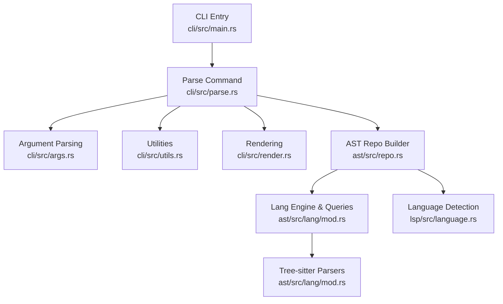
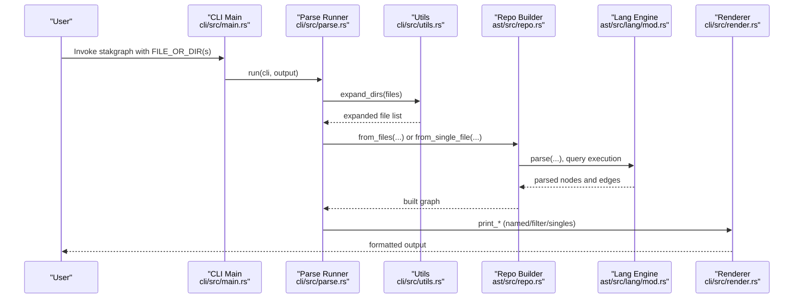
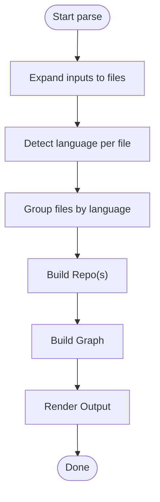
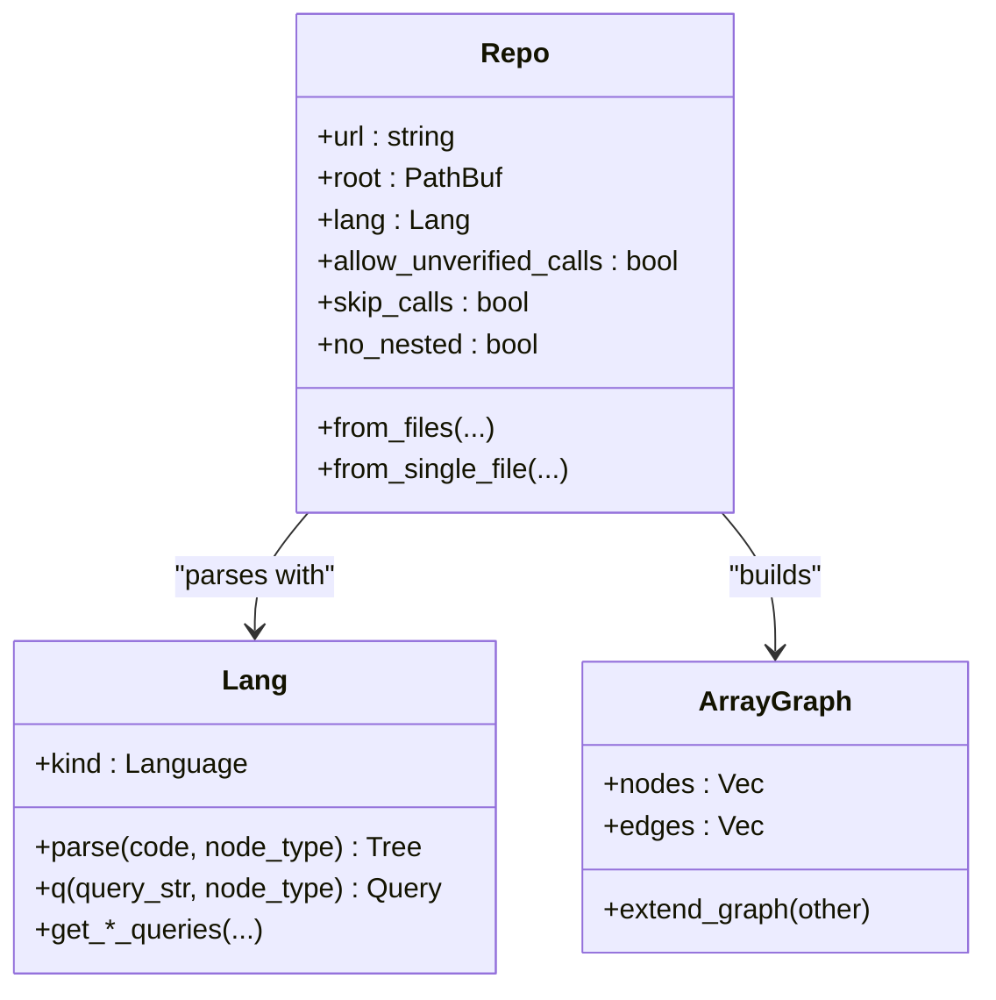
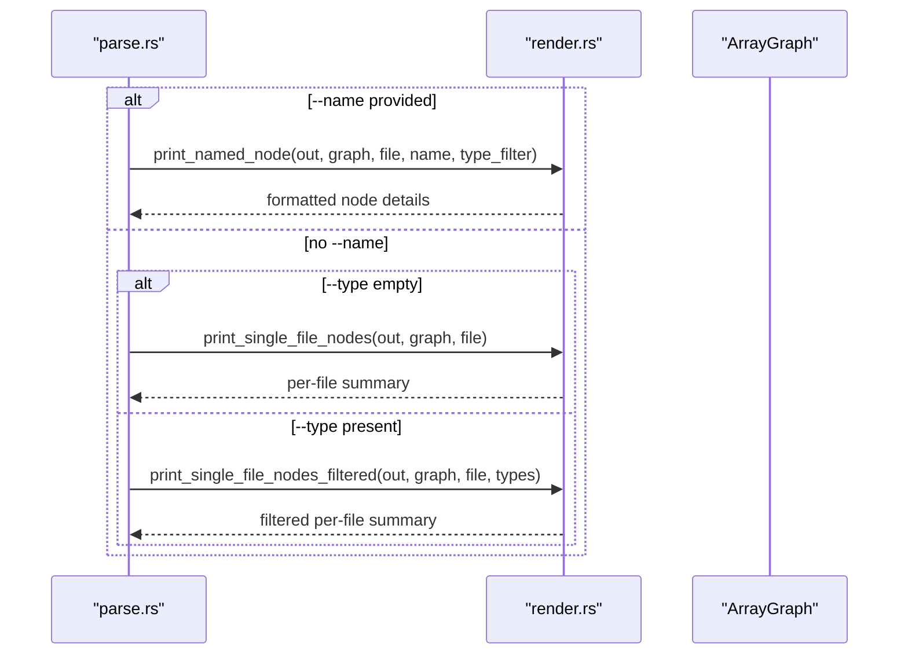
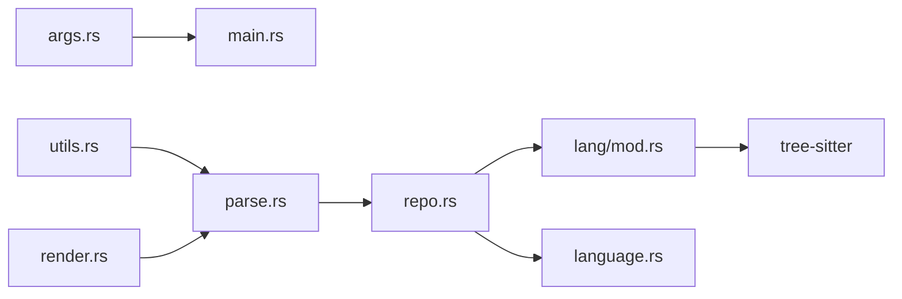

# Basic Parsing Commands

<cite>
**Referenced Files in This Document**
- [main.rs](file://cli/src/main.rs)
- [args.rs](file://cli/src/args.rs)
- [parse.rs](file://cli/src/parse.rs)
- [render.rs](file://cli/src/render.rs)
- [utils.rs](file://cli/src/utils.rs)
- [repo.rs](file://ast/src/repo.rs)
- [language.rs](file://lsp/src/language.rs)
- [mod.rs](file://ast/src/lang/mod.rs)
- [flags.rs](file://cli/tests/cli/flags.rs)
- [python.rs](file://cli/tests/cli/python.rs)
- [ruby.rs](file://cli/tests/cli/ruby.rs)
</cite>

## Table of Contents
1. [Introduction](#introduction)
2. [Project Structure](#project-structure)
3. [Core Components](#core-components)
4. [Architecture Overview](#architecture-overview)
5. [Detailed Component Analysis](#detailed-component-analysis)
6. [Dependency Analysis](#dependency-analysis)
7. [Performance Considerations](#performance-considerations)
8. [Troubleshooting Guide](#troubleshooting-guide)
9. [Conclusion](#conclusion)

## Introduction
This document explains StakGraph’s basic parsing commands for analyzing individual files, directories, and entire projects. It covers command syntax, input patterns, output formats, and parsing options such as --allow for unverified calls, --skip-calls for performance optimization, and --no-nested for simplified output. It also documents how the AST engine integrates with tree-sitter parsers and how the CLI orchestrates parsing, graph building, and rendering.

## Project Structure
The parsing flow is driven by the CLI entry point, which delegates to the parse module. The parse module expands inputs, groups files by language, builds graphs via the AST engine, and renders results. The AST engine uses language-specific parsers and tree-sitter queries to extract nodes and edges.

**Diagram sources**
- [main.rs:21-70](file://cli/src/main.rs#L21-L70)
- [parse.rs:62-225](file://cli/src/parse.rs#L62-L225)
- [args.rs:5-60](file://cli/src/args.rs#L5-L60)
- [utils.rs:13-45](file://cli/src/utils.rs#L13-L45)
- [render.rs:1-430](file://cli/src/render.rs#L1-L430)
- [repo.rs:737-783](file://ast/src/repo.rs#L737-L783)
- [mod.rs:322-329](file://ast/src/lang/mod.rs#L322-L329)
- [language.rs:314-326](file://lsp/src/language.rs#L314-L326)

**Section sources**
- [main.rs:1-70](file://cli/src/main.rs#L1-L70)
- [parse.rs:1-225](file://cli/src/parse.rs#L1-L225)
- [args.rs:1-190](file://cli/src/args.rs#L1-L190)
- [utils.rs:1-233](file://cli/src/utils.rs#L1-L233)
- [render.rs:1-430](file://cli/src/render.rs#L1-L430)
- [repo.rs:737-783](file://ast/src/repo.rs#L737-L783)
- [mod.rs:322-329](file://ast/src/lang/mod.rs#L322-L329)
- [language.rs:314-326](file://lsp/src/language.rs#L314-L326)

## Core Components
- CLI entry and dispatch:
  - The CLI parses arguments and routes to the default parse command when no subcommand is provided.
- Argument definitions:
  - Defines flags for --allow, --skip-calls, --no-nested, --type filters, --name lookup, --stats, --max-tokens, --depth, and verbosity/logging controls.
- Parse orchestration:
  - Expands directories to files, detects languages, builds Repo instances, constructs graphs, and renders outputs.
- Rendering:
  - Prints per-file summaries, supports named node lookup, and optionally prints a statistics table.
- AST engine:
  - Provides language-specific parsing, queries, and graph construction. Integrates tree-sitter for parsing and uses language-specific queries to extract nodes and relationships.

Key option behaviors:
- --allow: Propagated to the graph builder to include unverified function calls.
- --skip-calls: Skips extracting function call relationships to improve performance.
- --no-nested: Excludes nested nodes inside other nodes to simplify output.

**Section sources**
- [main.rs:52-70](file://cli/src/main.rs#L52-L70)
- [args.rs:13-59](file://cli/src/args.rs#L13-L59)
- [parse.rs:62-225](file://cli/src/parse.rs#L62-L225)
- [render.rs:282-402](file://cli/src/render.rs#L282-L402)
- [repo.rs:116-117](file://ast/src/repo.rs#L116-L117)
- [mod.rs:322-329](file://ast/src/lang/mod.rs#L322-L329)

## Architecture Overview
The default parse command follows a predictable flow: argument parsing, input expansion, language detection, graph construction, and rendering.

**Diagram sources**
- [main.rs:52-70](file://cli/src/main.rs#L52-L70)
- [parse.rs:62-225](file://cli/src/parse.rs#L62-L225)
- [utils.rs:19-45](file://cli/src/utils.rs#L19-L45)
- [repo.rs:737-783](file://ast/src/repo.rs#L737-L783)
- [mod.rs:322-329](file://ast/src/lang/mod.rs#L322-L329)
- [render.rs:404-419](file://cli/src/render.rs#L404-L419)

## Detailed Component Analysis

### Command Syntax and Options
- Syntax overview:
  - stakgraph [FLAGS] [OPTIONS] [FILE_OR_DIR ...]
- Flags and options:
  - --allow: Include unverified function calls in the graph.
  - --skip-calls: Skip extracting function call relationships.
  - --no-nested: Exclude nodes nested inside other nodes.
  - --type TYPE[,TYPE...]: Limit output to specific node types.
  - --name NAME: Print only the named node (use with a single file; optional --type to disambiguate).
  - --stats: Print a summary table of node type counts for the selected files.
  - --max-tokens N: Activate budget-aware summary mode for directories.
  - --depth DEPTH: Maximum directory tree depth (used with --max-tokens).
  - -q/--quiet, -v/--verbose, --perf: Control logging verbosity and performance logs.
  - FILE_OR_DIR: Accepts multiple files or directories; comma-separated values are supported.

Behavioral notes:
- If no files are provided and no subcommand is given, the CLI exits with an error.
- Directory inputs are expanded to language-detected files.
- When --max-tokens is set or when parsing a directory without filters, the system switches to a budget-aware summary mode.

**Section sources**
- [args.rs:5-60](file://cli/src/args.rs#L5-L60)
- [args.rs:154-189](file://cli/src/args.rs#L154-L189)
- [parse.rs:62-70](file://cli/src/parse.rs#L62-L70)
- [parse.rs:72-120](file://cli/src/parse.rs#L72-L120)

### Input Expansion and Language Detection
- Directory expansion:
  - Walks directories recursively, filters for files with recognized extensions, and deduplicates paths.
- Language detection:
  - Uses Language::from_path to map file extensions to supported languages.
- Grouping by language:
  - Files are grouped by detected language to construct separate Repo instances.

**Diagram sources**
- [parse.rs:19-45](file://cli/src/parse.rs#L19-L45)
- [language.rs:314-326](file://lsp/src/language.rs#L314-L326)
- [parse.rs:78-120](file://cli/src/parse.rs#L78-L120)

**Section sources**
- [parse.rs:19-45](file://cli/src/parse.rs#L19-L45)
- [language.rs:314-326](file://lsp/src/language.rs#L314-L326)
- [parse.rs:78-120](file://cli/src/parse.rs#L78-L120)

### Graph Construction and Tree-Sitter Integration
- Repo construction:
  - Builds Repo instances from either a set of files under a common root or single files.
  - Propagates parsing options: allow_unverified_calls, skip_calls, no_nested.
- AST engine:
  - Uses Lang::parse to invoke tree-sitter parsers.
  - Executes language-specific queries to extract nodes (functions, classes, endpoints, etc.) and relationships.
- Linking and aggregation:
  - Aggregates nodes and edges across repos and performs cross-repo linking.

**Diagram sources**
- [repo.rs:737-783](file://ast/src/repo.rs#L737-L783)
- [mod.rs:322-329](file://ast/src/lang/mod.rs#L322-L329)
- [repo.rs:103-194](file://ast/src/repo.rs#L103-L194)

**Section sources**
- [repo.rs:737-783](file://ast/src/repo.rs#L737-L783)
- [mod.rs:322-329](file://ast/src/lang/mod.rs#L322-L329)
- [repo.rs:103-194](file://ast/src/repo.rs#L103-L194)

### Rendering and Output Formats
- Per-file summaries:
  - Prints nodes for a given file, sorted by line number, with contextual metadata and previews.
- Named node lookup:
  - Finds a specific node by name within a file; supports disambiguation via --type.
- Statistics:
  - When --stats is enabled, prints a table of node type counts for included files.

**Diagram sources**
- [parse.rs:183-196](file://cli/src/parse.rs#L183-L196)
- [render.rs:282-402](file://cli/src/render.rs#L282-L402)
- [render.rs:404-419](file://cli/src/render.rs#L404-L419)

**Section sources**
- [render.rs:282-402](file://cli/src/render.rs#L282-L402)
- [render.rs:404-419](file://cli/src/render.rs#L404-L419)
- [parse.rs:183-196](file://cli/src/parse.rs#L183-L196)

### Practical Examples
- Parse a single file:
  - stakgraph path/to/main.py
- Parse a directory:
  - stakgraph src/
- Parse with filters:
  - stakgraph --type Function,Endpoint src/app.ts
- Find a named node:
  - stakgraph --name getPerson src/app.ts
- Include unverified calls:
  - stakgraph --allow src/backend.go
- Skip calls for performance:
  - stakgraph --skip-calls src/frontend.ts
- Simplify output by excluding nested nodes:
  - stakgraph --no-nested src/lib.rs
- Print statistics:
  - stakgraph --stats src/rust_project/

Validation and behavior references:
- Case-insensitive type filtering and error reporting for invalid types.
- --name combined with --type to disambiguate.
- --stats and --type can be combined.

**Section sources**
- [flags.rs:6-14](file://cli/tests/cli/flags.rs#L6-L14)
- [flags.rs:37-43](file://cli/tests/cli/flags.rs#L37-L43)
- [flags.rs:71-88](file://cli/tests/cli/flags.rs#L71-L88)
- [flags.rs:120-127](file://cli/tests/cli/flags.rs#L120-L127)
- [python.rs:6-24](file://cli/tests/cli/python.rs#L6-L24)
- [ruby.rs:6-25](file://cli/tests/cli/ruby.rs#L6-L25)

## Dependency Analysis
- CLI depends on:
  - args.rs for flag definitions and validation.
  - parse.rs for orchestration and graph building.
  - render.rs for output formatting.
  - utils.rs for input expansion and helpers.
- AST engine depends on:
  - language.rs for extension-to-language mapping.
  - mod.rs for tree-sitter integration and query execution.
  - repo.rs for constructing graphs and aggregating results.

**Diagram sources**
- [args.rs:1-190](file://cli/src/args.rs#L1-L190)
- [main.rs:18-70](file://cli/src/main.rs#L18-L70)
- [utils.rs:1-233](file://cli/src/utils.rs#L1-L233)
- [parse.rs:1-225](file://cli/src/parse.rs#L1-L225)
- [repo.rs:1-195](file://ast/src/repo.rs#L1-L195)
- [mod.rs:28-329](file://ast/src/lang/mod.rs#L28-L329)
- [language.rs:314-326](file://lsp/src/language.rs#L314-L326)

**Section sources**
- [args.rs:1-190](file://cli/src/args.rs#L1-L190)
- [main.rs:18-70](file://cli/src/main.rs#L18-L70)
- [parse.rs:1-225](file://cli/src/parse.rs#L1-L225)
- [repo.rs:1-195](file://ast/src/repo.rs#L1-L195)
- [mod.rs:28-329](file://ast/src/lang/mod.rs#L28-L329)
- [language.rs:314-326](file://lsp/src/language.rs#L314-L326)

## Performance Considerations
- Use --skip-calls to avoid extracting function call relationships when not needed.
- Prefer targeted file inputs or --type filters to reduce graph size.
- For large directories, consider --max-tokens with --depth to constrain output volume.
- Logging flags:
  - -q suppresses logs; -v enables info logs; --perf enables performance/memory logs.

[No sources needed since this section provides general guidance]

## Troubleshooting Guide
Common issues and resolutions:
- No files provided:
  - The CLI exits with an error when no inputs are supplied and no subcommand is given.
- Unknown node type:
  - Using an invalid type with --type triggers validation errors.
- Node not found:
  - Using --name with a non-existent node prints a clear message; use --type to disambiguate.
- Conflicting flags:
  - --quiet conflicts with --verbose and --perf; the CLI validates and rejects invalid combinations.
- Binary or unprintable content:
  - Non-text files are skipped with a notice; previews are omitted for binary content.

**Section sources**
- [args.rs:154-189](file://cli/src/args.rs#L154-L189)
- [flags.rs:37-43](file://cli/tests/cli/flags.rs#L37-L43)
- [flags.rs:91-97](file://cli/tests/cli/flags.rs#L91-L97)
- [flags.rs:60-68](file://cli/tests/cli/flags.rs#L60-L68)
- [utils.rs:188-224](file://cli/src/utils.rs#L188-L224)

## Conclusion
StakGraph’s basic parsing commands provide a flexible way to analyze codebases at scale. By combining language detection, tree-sitter-powered parsing, and configurable rendering, users can tailor output to their needs. Use flags like --allow, --skip-calls, and --no-nested to balance completeness and performance, and leverage --type, --name, and --stats for focused insights.