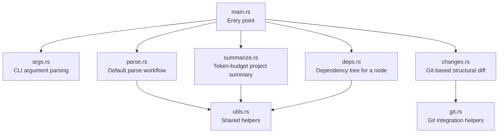
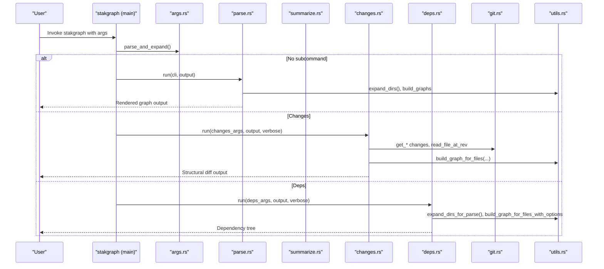
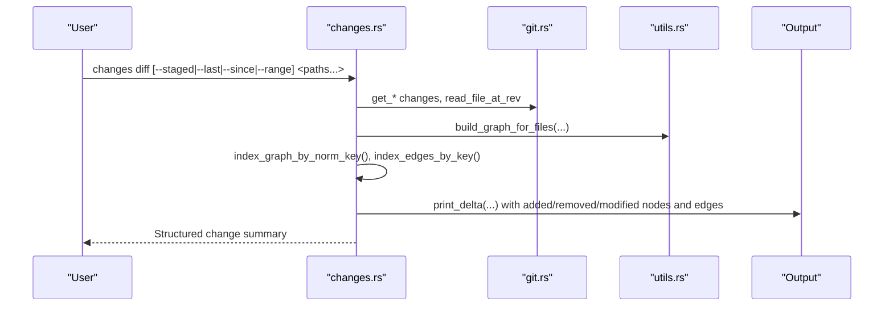
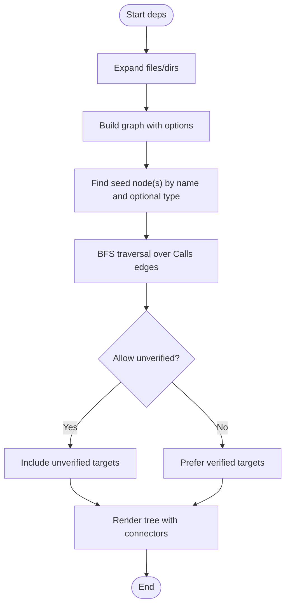
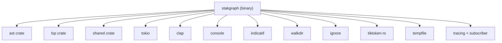

# CLI Interface

<cite>
**Referenced Files in This Document**
- [README.md](file://README.md)
- [Cargo.toml](file://cli/Cargo.toml)
- [main.rs](file://cli/src/main.rs)
- [args.rs](file://cli/src/args.rs)
- [parse.rs](file://cli/src/parse.rs)
- [summarize.rs](file://cli/src/summarize.rs)
- [changes.rs](file://cli/src/changes.rs)
- [deps.rs](file://cli/src/deps.rs)
- [git.rs](file://cli/src/git.rs)
- [utils.rs](file://cli/src/utils.rs)
- [changes_cmd.rs](file://cli/tests/cli/changes_cmd.rs)
- [summarize_cmd.rs](file://cli/tests/cli/summarize_cmd.rs)
- [deps_cmd.rs](file://cli/tests/cli/deps_cmd.rs)
</cite>

## Table of Contents
1. [Introduction](#introduction)
2. [Project Structure](#project-structure)
3. [Core Components](#core-components)
4. [Architecture Overview](#architecture-overview)
5. [Detailed Component Analysis](#detailed-component-analysis)
6. [Dependency Analysis](#dependency-analysis)
7. [Performance Considerations](#performance-considerations)
8. [Troubleshooting Guide](#troubleshooting-guide)
9. [Conclusion](#conclusion)

## Introduction
This document describes the StakGraph CLI interface, focusing on the commands and options available to parse files and directories, produce token-budget-aware summaries, track structural changes across commits, and analyze dependencies. It explains how to use each command, the available options, and how they integrate with git for change analysis. Practical examples and troubleshooting guidance are included to help you use the CLI effectively.

## Project Structure
The CLI is implemented as a Rust binary named stakgraph, with subcommands and shared utilities. The main entry point delegates to subcommands, which implement distinct workflows.

**Diagram sources**
- [main.rs:52-69](file://cli/src/main.rs#L52-L69)
- [args.rs:5-70](file://cli/src/args.rs#L5-L70)
- [parse.rs:62-224](file://cli/src/parse.rs#L62-L224)
- [summarize.rs:204-443](file://cli/src/summarize.rs#L204-L443)
- [changes.rs:18-420](file://cli/src/changes.rs#L18-L420)
- [deps.rs:15-170](file://cli/src/deps.rs#L15-L170)
- [git.rs:3-149](file://cli/src/git.rs#L3-L149)
- [utils.rs:13-233](file://cli/src/utils.rs#L13-L233)

**Section sources**
- [Cargo.toml:8-10](file://cli/Cargo.toml#L8-L10)
- [main.rs:1-70](file://cli/src/main.rs#L1-L70)

## Core Components
- Command routing and logging initialization
- Argument parsing for global and subcommand options
- Parse workflow for files/directories
- Summarize workflow for token-budget project overviews
- Changes workflow for git-integrated structural diffs
- Deps workflow for dependency trees
- Git integration for commit scanning and snapshots
- Shared utilities for graph building and path handling

**Section sources**
- [main.rs:52-69](file://cli/src/main.rs#L52-L69)
- [args.rs:5-70](file://cli/src/args.rs#L5-L70)
- [parse.rs:62-224](file://cli/src/parse.rs#L62-L224)
- [summarize.rs:204-443](file://cli/src/summarize.rs#L204-L443)
- [changes.rs:18-420](file://cli/src/changes.rs#L18-L420)
- [deps.rs:15-170](file://cli/src/deps.rs#L15-L170)
- [git.rs:3-149](file://cli/src/git.rs#L3-L149)
- [utils.rs:13-233](file://cli/src/utils.rs#L13-L233)

## Architecture Overview
The CLI orchestrates parsing, graph construction, and rendering. Subcommands share utilities for building graphs and filtering node types. The changes command integrates with git to compute structural deltas between snapshots.

**Diagram sources**
- [main.rs:52-69](file://cli/src/main.rs#L52-L69)
- [args.rs:154-189](file://cli/src/args.rs#L154-L189)
- [parse.rs:62-224](file://cli/src/parse.rs#L62-L224)
- [summarize.rs:204-443](file://cli/src/summarize.rs#L204-L443)
- [changes.rs:18-420](file://cli/src/changes.rs#L18-L420)
- [deps.rs:15-170](file://cli/src/deps.rs#L15-L170)
- [git.rs:3-149](file://cli/src/git.rs#L3-L149)
- [utils.rs:78-134](file://cli/src/utils.rs#L78-L134)

## Detailed Component Analysis

### Command Reference

#### stakgraph (default)
- Purpose: Parse files and print a graph-oriented summary.
- Syntax:
  - stakgraph [options] [files/dirs...]
- Options:
  - --allow: Include unverified function calls in the graph.
  - --skip-calls: Skip extracting function call relationships.
  - --no-nested: Exclude nodes nested inside other nodes.
  - --type TYPE[,TYPE...]: Only emit certain node types (e.g., Function,Endpoint).
  - --name NAME: Print only the named node (use with a single file; optional --type to disambiguate).
  - --stats: Print counts by node type as a summary table.
  - --max-tokens N: Token budget for output; activates budget-aware summary mode.
  - --depth N: Maximum directory tree depth (used with --max-tokens on a directory).
  - --verbose/-v: Show info and debug logs.
  - --perf: Show performance/memory logs (implies verbose).
  - --quiet/-q: Suppress all logs except errors.
- Examples:
  - Parse a single file: stakgraph src/routes.ts
  - Include unverified calls: stakgraph src/routes.ts --allow
  - Skip call extraction: stakgraph src/routes.ts --skip-calls
  - Exclude nested nodes: stakgraph src/routes.ts --no-nested
  - Filter by node types: stakgraph src/routes.ts --type Function,Endpoint
  - Print counts: stakgraph src/routes.ts --stats
  - Token budget summary: stakgraph ./my-project --max-tokens 2000 --depth 1
- Notes:
  - If no files/dirs are provided, the CLI exits with an error.
  - When --max-tokens is set or when parsing a directory without filters, the CLI switches to summarize mode.

**Section sources**
- [args.rs:9-60](file://cli/src/args.rs#L9-L60)
- [args.rs:154-189](file://cli/src/args.rs#L154-L189)
- [parse.rs:62-70](file://cli/src/parse.rs#L62-L70)
- [README.md:35-83](file://README.md#L35-L83)

#### stakgraph summarize
- Purpose: Produce a token-budget-aware project summary.
- Syntax:
  - stakgraph summarize <dir> [--max-tokens N] [--depth N]
- Options:
  - --max-tokens N: Token budget (default varies; see examples).
  - --depth N: Maximum directory tree depth (default adaptive).
- Examples:
  - stakgraph summarize ./my-project --max-tokens 2000
  - stakgraph summarize ./my-project --max-tokens 5000 --depth 1

**Section sources**
- [summarize.rs:204-443](file://cli/src/summarize.rs#L204-L443)
- [README.md:57-66](file://README.md#L57-L66)

#### stakgraph changes
- Purpose: Explore git changes summaries scoped to specific files or directories.
- Subcommands:
  - stakgraph changes list <paths...> [--max N]
  - stakgraph changes diff [--staged | --last N | --since REF | --range A..B] [--types TYPE[,TYPE...]] <paths...>
- Options:
  - --staged: Compare staged changes only.
  - --last N: Compare HEAD~N..HEAD.
  - --since REF: Compare <ref>..HEAD.
  - --range A..B: Compare explicit range.
  - --types TYPE[,TYPE...]: Only show nodes of these types (e.g., Function,Endpoint).
  - <paths...>: Files or directories to scope the changes to (default: all files).
  - --max N: Maximum commits to show for list (default: 20).
- Examples:
  - List commits touching paths: stakgraph changes list mcp/src/
  - Diff staged changes: stakgraph changes diff --staged mcp/src/
  - Diff last N commits: stakgraph changes diff --last 5 mcp/src/
  - Diff since branch: stakgraph changes diff --since main mcp/src/
  - Diff explicit range: stakgraph changes diff --range HEAD~5..HEAD mcp/src/
  - Scope by paths: stakgraph changes diff --last 1 src/app/

**Section sources**
- [args.rs:62-129](file://cli/src/args.rs#L62-L129)
- [changes.rs:18-420](file://cli/src/changes.rs#L18-L420)
- [git.rs:3-149](file://cli/src/git.rs#L3-L149)
- [README.md:45-56](file://README.md#L45-L56)

#### stakgraph deps
- Purpose: Show a dependency tree for a named node.
- Syntax:
  - stakgraph deps <NAME> <files/dirs...> [--depth N] [--type NODE_TYPE] [--allow]
- Options:
  - --depth N: Maximum traversal depth (0 = unlimited, default: 3).
  - --type NODE_TYPE: Only show nodes of this type (e.g., Function,Class,Endpoint).
  - --allow: Include unverified (cross-file unresolved) calls (default: true).
  - <files/dirs...>: Files or directories to parse.
- Examples:
  - stakgraph deps batch_process src/testing/rust/src
  - stakgraph deps run_servers src/testing/python/web/main.py --allow true
  - stakgraph deps run_servers src/testing/python/web/main.py --allow false
  - stakgraph deps batch_process src/testing/rust/src --depth 0
  - stakgraph deps batch_process src/testing/rust/src --type Function

**Section sources**
- [args.rs:131-152](file://cli/src/args.rs#L131-L152)
- [deps.rs:15-170](file://cli/src/deps.rs#L15-L170)
- [README.md:87-137](file://README.md#L87-L137)

### CLI Options Reference

- Global options (apply to default parse):
  - --allow: Include unverified function calls in the graph.
  - --skip-calls: Skip extracting function call relationships.
  - --no-nested: Exclude nodes nested inside other nodes.
  - --type TYPE[,TYPE...]: Only emit certain node types.
  - --name NAME: Print only the named node (single file; optional --type).
  - --stats: Print counts by node type as a summary table.
  - --max-tokens N: Token budget for output; activates budget-aware summary mode.
  - --depth N: Maximum directory tree depth (used with --max-tokens on a directory).
  - --verbose/-v: Show info and debug logs.
  - --perf: Show performance/memory logs (implies verbose).
  - --quiet/-q: Suppress all logs except errors.

- Changes options:
  - --staged: Compare staged changes only.
  - --last N: Compare HEAD~N..HEAD.
  - --since REF: Compare <ref>..HEAD.
  - --range A..B: Compare explicit range.
  - --types TYPE[,TYPE...] (diff): Only show nodes of these types.
  - <paths...> (list/diff): Files or directories to scope changes.

- Deps options:
  - --depth N: Maximum traversal depth (0 = unlimited, default: 3).
  - --type NODE_TYPE: Only show nodes of this type.
  - --allow: Include unverified calls (default: true).
  - <files/dirs...>: Files or directories to parse.

**Section sources**
- [args.rs:13-60](file://cli/src/args.rs#L13-L60)
- [args.rs:85-152](file://cli/src/args.rs#L85-L152)

### Practical Examples

- Parsing a single file:
  - stakgraph src/routes.ts
- Parsing a directory:
  - stakgraph src/
- Filtering by node types:
  - stakgraph src/routes.ts --type Function,Endpoint
- Including unverified calls:
  - stakgraph src/routes.ts --allow
- Skipping call extraction:
  - stakgraph src/routes.ts --skip-calls
- Excluding nested nodes:
  - stakgraph src/routes.ts --no-nested
- Printing counts:
  - stakgraph src/routes.ts --stats
- Token-budget project summary:
  - stakgraph summarize ./my-project --max-tokens 2000
  - stakgraph summarize ./my-project --max-tokens 5000 --depth 1
- Tracking changes:
  - stakgraph changes list mcp/src/
  - stakgraph changes diff --last 5 mcp/src/
  - stakgraph changes diff --staged mcp/src/
  - stakgraph changes diff --since main mcp/src/
  - stakgraph changes diff --range HEAD~5..HEAD mcp/src/
- Dependency analysis:
  - stakgraph deps batch_process src/testing/rust/src
  - stakgraph deps run_servers src/testing/python/web/main.py --allow true
  - stakgraph deps run_servers src/testing/python/web/main.py --allow false
  - stakgraph deps batch_process src/testing/rust/src --depth 0
  - stakgraph deps batch_process src/testing/rust/src --type Function

**Section sources**
- [README.md:35-83](file://README.md#L35-L83)
- [summarize_cmd.rs:5-40](file://cli/tests/cli/summarize_cmd.rs#L5-L40)
- [changes_cmd.rs:57-217](file://cli/tests/cli/changes_cmd.rs#L57-L217)
- [deps_cmd.rs:5-123](file://cli/tests/cli/deps_cmd.rs#L5-L123)

### Changes Tracking Workflow (Git Integration)
The changes command computes structural differences between snapshots by building AST graphs from git blobs or the working tree and comparing nodes and edges.

**Diagram sources**
- [changes.rs:98-420](file://cli/src/changes.rs#L98-L420)
- [git.rs:3-149](file://cli/src/git.rs#L3-L149)
- [utils.rs:78-134](file://cli/src/utils.rs#L78-L134)

**Section sources**
- [changes.rs:98-420](file://cli/src/changes.rs#L98-L420)
- [git.rs:3-149](file://cli/src/git.rs#L3-L149)

### Dependency Analysis Workflow
The deps command builds a graph from files and traverses call edges to present a dependency tree.

**Diagram sources**
- [deps.rs:15-170](file://cli/src/deps.rs#L15-L170)
- [utils.rs:47-76](file://cli/src/utils.rs#L47-L76)
- [utils.rs:82-134](file://cli/src/utils.rs#L82-L134)

**Section sources**
- [deps.rs:15-170](file://cli/src/deps.rs#L15-L170)
- [utils.rs:47-134](file://cli/src/utils.rs#L47-L134)

## Dependency Analysis
The CLI depends on shared crates and external libraries for parsing, rendering, and progress reporting.

**Diagram sources**
- [Cargo.toml:12-27](file://cli/Cargo.toml#L12-L27)

**Section sources**
- [Cargo.toml:12-27](file://cli/Cargo.toml#L12-L27)

## Performance Considerations
- Use --skip-calls to reduce parsing overhead when call relationships are not needed.
- Use --no-nested to simplify output and reduce rendering cost.
- Use --max-tokens with summarize to cap output size and improve responsiveness.
- Use --depth to limit directory traversal during summarize.
- Use --perf or --verbose to enable progress and performance logs for diagnostics.
- Prefer scoped paths with changes diff to limit the number of files parsed.

[No sources needed since this section provides general guidance]

## Troubleshooting Guide
Common issues and resolutions:
- No file path provided:
  - The CLI exits with an error when no files/dirs are provided for the default parse.
- Invalid path for summarize:
  - The summarize command validates the path and reports “path does not exist” when invalid.
- Invalid range format for changes diff:
  - The changes diff command validates the range format and returns a validation error if incorrect.
- Scope warnings for missing paths:
  - When scoping changes to paths that do not exist in the repository, the CLI emits warnings and indicates no changes found in the specified scope.
- Unknown node type:
  - The deps command validates node types and returns a validation error for unknown types.
- Missing node name:
  - The deps command requires a node name and returns a validation error if missing.
- Unverified vs verified calls:
  - When --allow is false, the deps command prefers verified targets and suppresses unverified entries.

**Section sources**
- [args.rs:170-173](file://cli/src/args.rs#L170-L173)
- [summarize.rs:222-231](file://cli/src/summarize.rs#L222-L231)
- [changes.rs:150-158](file://cli/src/changes.rs#L150-L158)
- [changes.rs:167-184](file://cli/src/changes.rs#L167-L184)
- [deps.rs:20-26](file://cli/src/deps.rs#L20-L26)
- [deps.rs:60-66](file://cli/src/deps.rs#L60-L66)
- [deps_cmd.rs:6-29](file://cli/tests/cli/deps_cmd.rs#L6-L29)
- [summarize_cmd.rs:35-40](file://cli/tests/cli/summarize_cmd.rs#L35-L40)
- [changes_cmd.rs:133-140](file://cli/tests/cli/changes_cmd.rs#L133-L140)
- [changes_cmd.rs:143-151](file://cli/tests/cli/changes_cmd.rs#L143-L151)

## Conclusion
The StakGraph CLI provides a powerful, git-aware toolkit for parsing code into graphs, summarizing projects under token budgets, tracking structural changes across commits, and exploring dependencies. By combining flexible options with robust git integration, it enables efficient navigation and analysis of large codebases. Use the examples and troubleshooting guidance here to tailor the CLI to your workflow and optimize performance.