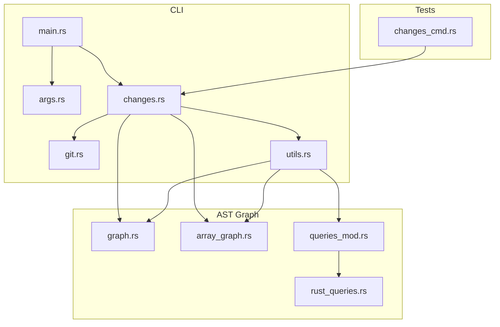
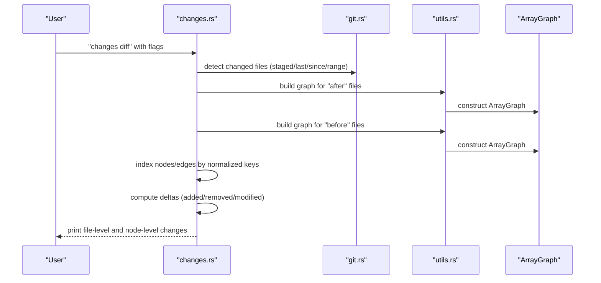
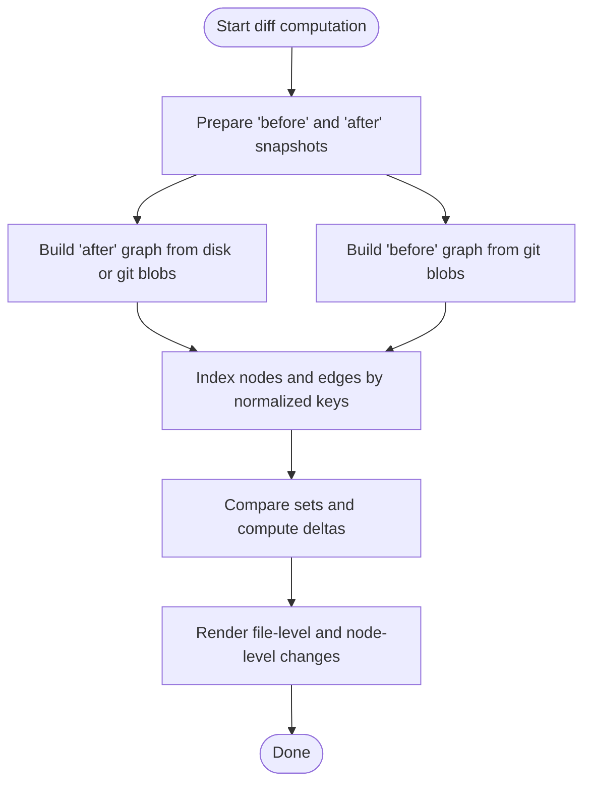
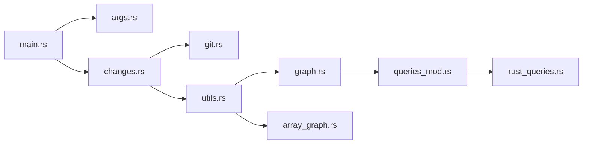

# Change Tracking and Analysis

<cite>
**Referenced Files in This Document**
- [changes.rs](file://cli/src/changes.rs)
- [git.rs](file://cli/src/git.rs)
- [args.rs](file://cli/src/args.rs)
- [main.rs](file://cli/src/main.rs)
- [utils.rs](file://cli/src/utils.rs)
- [graph.rs](file://ast/src/lang/graphs/graph.rs)
- [array_graph.rs](file://ast/src/lang/graphs/array_graph.rs)
- [mod.rs](file://ast/src/lang/graphs/mod.rs)
- [queries_mod.rs](file://ast/src/lang/queries/mod.rs)
- [rust_queries.rs](file://ast/src/lang/queries/rust.rs)
- [changes_cmd.rs](file://cli/tests/cli/changes_cmd.rs)
- [README.md](file://README.md)
</cite>

## Table of Contents
1. [Introduction](#introduction)
2. [Project Structure](#project-structure)
3. [Core Components](#core-components)
4. [Architecture Overview](#architecture-overview)
5. [Detailed Component Analysis](#detailed-component-analysis)
6. [Dependency Analysis](#dependency-analysis)
7. [Performance Considerations](#performance-considerations)
8. [Troubleshooting Guide](#troubleshooting-guide)
9. [Conclusion](#conclusion)

## Introduction
This document explains StakGraph’s change tracking and analysis functionality centered on the changes command. It covers how to compare structural differences between code versions using git integration, the supported comparison modes, and how to interpret the output. It also documents the underlying structural diff algorithm, how relationships are preserved across changes, and performance considerations for large repositories. Practical examples demonstrate analyzing pull requests, tracking refactoring changes, and monitoring code evolution.

## Project Structure
The change tracking capability spans several modules:
- CLI entry and routing: main, args, changes, git, utils
- AST graph construction and types: graph, array_graph, queries
- Tests validating behavior: changes_cmd

**Diagram sources**
- [main.rs:52-69](file://cli/src/main.rs#L52-L69)
- [args.rs:80-129](file://cli/src/args.rs#L80-L129)
- [changes.rs:18-40](file://cli/src/changes.rs#L18-L40)
- [git.rs:3-15](file://cli/src/git.rs#L3-L15)
- [utils.rs:78-134](file://cli/src/utils.rs#L78-L134)
- [graph.rs:11-54](file://ast/src/lang/graphs/graph.rs#L11-L54)
- [array_graph.rs:26-97](file://ast/src/lang/graphs/array_graph.rs#L26-L97)
- [queries_mod.rs:395-414](file://ast/src/lang/queries/mod.rs#L395-L414)
- [rust_queries.rs:178-181](file://ast/src/lang/queries/rust.rs#L178-L181)
- [changes_cmd.rs:57-83](file://cli/tests/cli/changes_cmd.rs#L57-L83)

**Section sources**
- [main.rs:52-69](file://cli/src/main.rs#L52-L69)
- [args.rs:80-129](file://cli/src/args.rs#L80-L129)
- [changes.rs:18-40](file://cli/src/changes.rs#L18-L40)
- [git.rs:3-15](file://cli/src/git.rs#L3-L15)
- [utils.rs:78-134](file://cli/src/utils.rs#L78-L134)
- [graph.rs:11-54](file://ast/src/lang/graphs/graph.rs#L11-L54)
- [array_graph.rs:26-97](file://ast/src/lang/graphs/array_graph.rs#L26-L97)
- [queries_mod.rs:395-414](file://ast/src/lang/queries/mod.rs#L395-L414)
- [rust_queries.rs:178-181](file://ast/src/lang/queries/rust.rs#L178-L181)
- [changes_cmd.rs:57-83](file://cli/tests/cli/changes_cmd.rs#L57-L83)

## Core Components
- Changes command: parses arguments, selects mode (list or diff), and orchestrates git-based change detection and structural diff computation.
- Git integration: discovers changed files across staged, last N commits, since a reference, or a custom range; reads file content from git blobs when needed.
- Graph building: constructs in-memory graphs (ArrayGraph) from either working tree files or git blobs for before/after snapshots.
- Structural diff: compares nodes and edges across snapshots, preserving relationships by indexing on normalized keys and filtering by node type and scope.

Key CLI commands and options:
- stakgraph changes list [--max N] [PATH...]: list commits affecting scoped paths.
- stakgraph changes diff [--staged | --last N | --since REF | --range A..B] [--types TYPE,...] [PATH...]: compute structural delta between snapshots.

**Section sources**
- [args.rs:80-129](file://cli/src/args.rs#L80-L129)
- [changes.rs:18-40](file://cli/src/changes.rs#L18-L40)
- [git.rs:38-122](file://cli/src/git.rs#L38-L122)
- [utils.rs:78-134](file://cli/src/utils.rs#L78-L134)

## Architecture Overview
The changes command follows a deterministic flow:
1. Parse arguments and select mode.
2. Detect changed files using git integration.
3. Build before/after graphs from working tree or git blobs.
4. Index nodes and edges by normalized keys.
5. Compute deltas (added, removed, modified nodes; added/removed edges).
6. Render a human-readable summary grouped by file.

**Diagram sources**
- [changes.rs:98-420](file://cli/src/changes.rs#L98-L420)
- [git.rs:38-122](file://cli/src/git.rs#L38-L122)
- [utils.rs:78-134](file://cli/src/utils.rs#L78-L134)
- [array_graph.rs:26-97](file://ast/src/lang/graphs/array_graph.rs#L26-L97)

## Detailed Component Analysis

### Changes Command Modes and Syntax
- List commits:
  - Syntax: stakgraph changes list [--max N] [PATH...]
  - Behavior: lists recent commits touching scoped paths.
- Diff (structural):
  - Syntax: stakgraph changes diff [--staged | --last N | --since REF | --range A..B] [--types TYPE,...] [PATH...]
  - Modes:
    - --staged: compare staged changes against HEAD.
    - --last N: compare HEAD~N..HEAD.
    - --since REF: compare REF..HEAD.
    - --range A..B: compare arbitrary revisions.
  - Scope: PATH filters apply to both file discovery and graph filtering.
  - Types: --types limits analysis to specified node types.

Output interpretation:
- File-level grouping: Added, Removed, Modified, or Edge changes.
- Node-level details: Added (+), removed (-), modified (~) with signature comparison.
- Edge-level details: New edges (↗) and dropped edges (↘) with source/target context.

Practical examples:
- Analyze PR changes across a feature directory: stakgraph changes diff --since origin/main feature/
- Track refactoring across last 3 commits: stakgraph changes diff --last 3 --types Function,Class
- Monitor code evolution in a subset: stakgraph changes diff frontend/components/

**Section sources**
- [args.rs:86-129](file://cli/src/args.rs#L86-L129)
- [changes.rs:42-96](file://cli/src/changes.rs#L42-L96)
- [changes.rs:98-420](file://cli/src/changes.rs#L98-L420)
- [README.md:45-83](file://README.md#L45-L83)

### Git Integration Features
- Repository root detection: resolves top-level git directory.
- Changed file discovery:
  - Working tree: modified plus untracked files.
  - Staged: cached changes only.
  - Last N: HEAD~N..HEAD.
  - Since: REF..HEAD.
  - Range: explicit A..B.
- Reading file content from git blobs for historical snapshots.
- Path scoping: normalizes and filters paths to avoid unintended matches.

Common scenarios:
- Pull request review: stakgraph changes diff --since origin/main
- Branch comparison: stakgraph changes diff --range feature..main
- Local staging: stakgraph changes diff --staged

**Section sources**
- [git.rs:3-15](file://cli/src/git.rs#L3-L15)
- [git.rs:38-58](file://cli/src/git.rs#L38-L58)
- [git.rs:60-63](file://cli/src/git.rs#L60-L63)
- [git.rs:65-95](file://cli/src/git.rs#L65-L95)
- [git.rs:97-122](file://cli/src/git.rs#L97-L122)
- [git.rs:124-148](file://cli/src/git.rs#L124-L148)

### Structural Diff Algorithm
The algorithm proceeds in three steps:
1. Snapshot preparation:
   - Build "after" graph from either working tree files or git blobs (when using --range).
   - Build "before" graph from git blobs for the selected revision.
2. Indexing:
   - Nodes indexed by normalized key: node_type + name + repo-relative file path.
   - Edges indexed by normalized key: source_type + source_name + source_file + target_type + target_name + target_file.
   - Only Call and Handler edges are considered for edge-level diffs.
3. Delta computation:
   - Added: nodes present in "after" but not in "before".
   - Removed: nodes present in "before" but not in "after".
   - Modified: nodes in both with differing bodies.
   - Added edges: edges in "after" where source node was not newly added.
   - Removed edges: edges in "before" where source node was not removed.

Relationship preservation:
- Normalized keys ensure accurate matching across renames and moves.
- Symlink canonicalization ensures consistent path normalization.
- Edge filtering focuses on Calls and Handler relationships to reflect functional changes.

**Diagram sources**
- [changes.rs:224-335](file://cli/src/changes.rs#L224-L335)
- [changes.rs:465-553](file://cli/src/changes.rs#L465-L553)
- [changes.rs:568-795](file://cli/src/changes.rs#L568-L795)

**Section sources**
- [changes.rs:224-335](file://cli/src/changes.rs#L224-L335)
- [changes.rs:465-553](file://cli/src/changes.rs#L465-L553)
- [changes.rs:568-795](file://cli/src/changes.rs#L568-L795)

### Node and Edge Types Used in Diff
- Node types excluded from diff indexing: Repository, File, Directory, Import, Language, Package.
- Node types included: Function, Class, Endpoint, Request, DataModel, etc.
- Edge types considered: Calls, Handler.

These choices focus the diff on functional and structural changes rather than metadata or packaging nodes.

**Section sources**
- [changes.rs:470-495](file://cli/src/changes.rs#L470-L495)
- [mod.rs:31-55](file://ast/src/lang/graphs/mod.rs#L31-L55)
- [mod.rs:82-98](file://ast/src/lang/graphs/mod.rs#L82-L98)

### Practical Examples
- Analyze PR changes:
  - stakgraph changes diff --since origin/main backend/
- Track refactoring:
  - stakgraph changes diff --last 5 --types Function,Class frontend/
- Monitor code evolution:
  - stakgraph changes diff --range v1.2..v1.3 api/

Validation and smoke tests confirm behavior:
- Working tree diff produces file-change headers.
- Staged mode detects staged changes.
- Last-N and type filters work as expected.
- Invalid range format yields validation error.
- Scope warnings appear when paths do not exist.

**Section sources**
- [README.md:45-83](file://README.md#L45-L83)
- [changes_cmd.rs:57-83](file://cli/tests/cli/changes_cmd.rs#L57-L83)
- [changes_cmd.rs:85-130](file://cli/tests/cli/changes_cmd.rs#L85-L130)
- [changes_cmd.rs:132-140](file://cli/tests/cli/changes_cmd.rs#L132-L140)
- [changes_cmd.rs:142-151](file://cli/tests/cli/changes_cmd.rs#L142-L151)
- [changes_cmd.rs:180-216](file://cli/tests/cli/changes_cmd.rs#L180-L216)

## Dependency Analysis
- CLI depends on:
  - git.rs for repository operations and file change detection.
  - utils.rs for graph construction and path utilities.
  - args.rs for command-line parsing and option validation.
- Graph engine:
  - graph.rs defines the Graph trait and common operations.
  - array_graph.rs implements ArrayGraph for in-memory graph storage and merging.
  - queries_mod.rs and language-specific query modules (e.g., rust_queries.rs) provide parsing and extraction rules used by graph builders.

**Diagram sources**
- [main.rs:52-69](file://cli/src/main.rs#L52-L69)
- [args.rs:80-129](file://cli/src/args.rs#L80-L129)
- [changes.rs:18-40](file://cli/src/changes.rs#L18-L40)
- [git.rs:3-15](file://cli/src/git.rs#L3-L15)
- [utils.rs:78-134](file://cli/src/utils.rs#L78-L134)
- [graph.rs:11-54](file://ast/src/lang/graphs/graph.rs#L11-L54)
- [array_graph.rs:26-97](file://ast/src/lang/graphs/array_graph.rs#L26-L97)
- [queries_mod.rs:395-414](file://ast/src/lang/queries/mod.rs#L395-L414)
- [rust_queries.rs:178-181](file://ast/src/lang/queries/rust.rs#L178-L181)

**Section sources**
- [main.rs:52-69](file://cli/src/main.rs#L52-L69)
- [args.rs:80-129](file://cli/src/args.rs#L80-L129)
- [changes.rs:18-40](file://cli/src/changes.rs#L18-L40)
- [git.rs:3-15](file://cli/src/git.rs#L3-L15)
- [utils.rs:78-134](file://cli/src/utils.rs#L78-L134)
- [graph.rs:11-54](file://ast/src/lang/graphs/graph.rs#L11-L54)
- [array_graph.rs:26-97](file://ast/src/lang/graphs/array_graph.rs#L26-L97)
- [queries_mod.rs:395-414](file://ast/src/lang/queries/mod.rs#L395-L414)
- [rust_queries.rs:178-181](file://ast/src/lang/queries/rust.rs#L178-L181)

## Performance Considerations
- Graph construction:
  - ArrayGraph is optimized for in-memory use and avoids external dependencies, enabling fast diffs.
  - build_graph_for_files_with_options supports toggling unverified call inclusion to balance completeness and speed.
- File scope:
  - Use --types and PATH scoping to reduce the number of files processed.
- Temp files:
  - Temporary directories are used to materialize git blobs for before/after graphs; ensure sufficient disk space.
- Large repositories:
  - Prefer --last N or --since to constrain the diff window.
  - Filter by node types to minimize rendering overhead.

[No sources needed since this section provides general guidance]

## Troubleshooting Guide
Common issues and resolutions:
- Git command failures:
  - Symptoms: errors when invoking git rev-parse or diff.
  - Causes: git not installed, not a git repository, or insufficient permissions.
  - Resolution: ensure git is installed and the current directory is a repository; run with appropriate permissions.
- Invalid range format:
  - Symptoms: validation error indicating range must be in format <a>..<b>.
  - Resolution: use --range A..B syntax.
- No changes found:
  - Working tree: staged changes may be empty; use --staged or commit changes.
  - Scoped: verify PATH exists in the repository; the tool warns when scoped paths do not exist.
- Unexpected scope matches:
  - Behavior: prefix matches across siblings are avoided; ensure PATH is precise.
- Signature comparison:
  - Modified nodes display signature lines; long signatures are truncated to a maximum length.

**Section sources**
- [git.rs:3-15](file://cli/src/git.rs#L3-L15)
- [git.rs:24-36](file://cli/src/git.rs#L24-L36)
- [changes.rs:150-158](file://cli/src/changes.rs#L150-L158)
- [changes.rs:167-185](file://cli/src/changes.rs#L167-L185)
- [changes.rs:186-223](file://cli/src/changes.rs#L186-L223)
- [changes_cmd.rs:132-140](file://cli/tests/cli/changes_cmd.rs#L132-L140)
- [changes_cmd.rs:142-151](file://cli/tests/cli/changes_cmd.rs#L142-L151)
- [changes_cmd.rs:180-216](file://cli/tests/cli/changes_cmd.rs#L180-L216)

## Conclusion
StakGraph’s changes command provides a robust, git-integrated way to analyze structural differences between code versions. By focusing on functional entities and their relationships, it surfaces meaningful changes that matter to developers reviewing PRs, tracking refactorings, and monitoring evolution. The normalized-key indexing and selective edge filtering ensure accurate and maintainable diffs, while CLI options enable efficient analysis across large repositories.