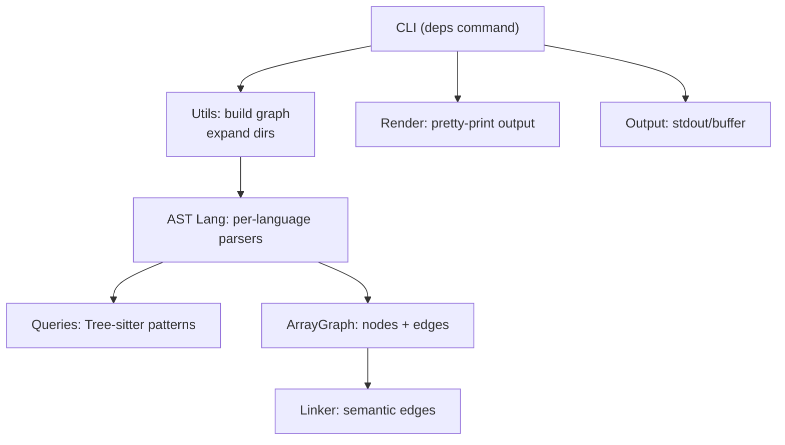
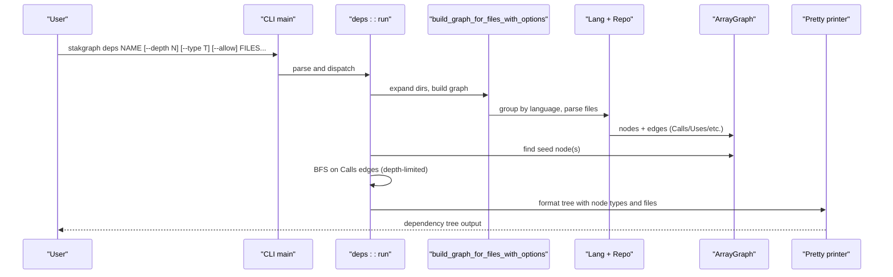

# Dependency Analysis

<cite>
**Referenced Files in This Document**
- [deps.rs](file://cli/src/deps.rs)
- [args.rs](file://cli/src/args.rs)
- [main.rs](file://cli/src/main.rs)
- [utils.rs](file://cli/src/utils.rs)
- [output.rs](file://cli/src/output.rs)
- [render.rs](file://cli/src/render.rs)
- [mod.rs](file://ast/src/lang/mod.rs)
- [linker.rs](file://ast/src/lang/linker.rs)
- [asg.rs](file://ast/src/lang/asg.rs)
- [queries/mod.rs](file://ast/src/lang/queries/mod.rs)
- [go.rs](file://ast/src/lang/queries/go.rs)
- [python.rs](file://ast/src/lang/queries/python.rs)
- [ruby.rs](file://ast/src/lang/queries/ruby.rs)
- [deps_cmd.rs](file://cli/tests/cli/deps_cmd.rs)
</cite>

## Table of Contents
1. [Introduction](#introduction)
2. [Project Structure](#project-structure)
3. [Core Components](#core-components)
4. [Architecture Overview](#architecture-overview)
5. [Detailed Component Analysis](#detailed-component-analysis)
6. [Dependency Analysis](#dependency-analysis)
7. [Performance Considerations](#performance-considerations)
8. [Troubleshooting Guide](#troubleshooting-guide)
9. [Conclusion](#conclusion)
10. [Appendices](#appendices)

## Introduction
This document explains StakGraph’s dependency analysis capabilities centered on the deps command. It covers command syntax, output formats, visualization options, filtering, and the underlying dependency extraction algorithm across languages. You will learn how StakGraph parses code, identifies imports and function calls, maps relationships, and surfaces dependency trees for a given node. Guidance is included for assessing code architecture and identifying technical debt via dependency insights.

## Project Structure
StakGraph organizes dependency analysis across CLI, AST parsing, and language-specific query modules:
- CLI exposes commands and orchestrates parsing and rendering.
- AST provides language-agnostic graph primitives and language-specific parsers.
- Language modules define Tree-sitter queries and extraction rules per language.
- Linker adds higher-level semantic edges (e.g., API request ↔ endpoint).

**Diagram sources**
- [main.rs:52-69](file://cli/src/main.rs#L52-L69)
- [utils.rs:82-134](file://cli/src/utils.rs#L82-L134)
- [mod.rs:51-329](file://ast/src/lang/mod.rs#L51-L329)
- [queries/mod.rs:55-393](file://ast/src/lang/queries/mod.rs#L55-L393)
- [linker.rs:34-242](file://ast/src/lang/linker.rs#L34-L242)
- [render.rs:282-402](file://cli/src/render.rs#L282-L402)
- [output.rs:13-51](file://cli/src/output.rs#L13-L51)

**Section sources**
- [main.rs:52-69](file://cli/src/main.rs#L52-L69)
- [utils.rs:78-134](file://cli/src/utils.rs#L78-L134)
- [mod.rs:51-329](file://ast/src/lang/mod.rs#L51-L329)
- [queries/mod.rs:55-393](file://ast/src/lang/queries/mod.rs#L55-L393)
- [linker.rs:34-242](file://ast/src/lang/linker.rs#L34-L242)
- [render.rs:282-402](file://cli/src/render.rs#L282-L402)
- [output.rs:13-51](file://cli/src/output.rs#L13-L51)

## Core Components
- deps command: Parses files/directories, builds a dependency graph, and prints a tree of callers for a named node.
- Argument parsing: Supports filtering by node type, depth, allow-unverified flag, and input selection.
- Graph building: Aggregates nodes and edges per language, grouping files by language and building a unified graph.
- Rendering: Formats dependency trees with node types, file locations, and optional operand hints.
- Language parsers: Define Tree-sitter queries for imports, function calls, endpoints, and tests.

Key behaviors:
- Accepts a NAME and FILE_OR_DIR inputs; resolves the seed node by name and file.
- Traverses “Calls” edges breadth-first up to a configurable depth.
- Resolves multiple callee targets per name, preferring verified targets when available.
- Honors allow flag to include unverified cross-file calls.

**Section sources**
- [deps.rs:15-170](file://cli/src/deps.rs#L15-L170)
- [args.rs:132-152](file://cli/src/args.rs#L132-L152)
- [utils.rs:82-134](file://cli/src/utils.rs#L82-L134)
- [render.rs:282-402](file://cli/src/render.rs#L282-L402)

## Architecture Overview
The deps command follows a clear flow: parse → build graph → locate seed → traverse edges → render.

**Diagram sources**
- [main.rs:52-69](file://cli/src/main.rs#L52-L69)
- [deps.rs:15-170](file://cli/src/deps.rs#L15-L170)
- [utils.rs:82-134](file://cli/src/utils.rs#L82-L134)
- [mod.rs:744-800](file://ast/src/lang/mod.rs#L744-L800)
- [render.rs:282-402](file://cli/src/render.rs#L282-L402)

## Detailed Component Analysis

### Command Syntax and Options
- Command: stakgraph deps NAME [--depth N] [--type NODE_TYPE] [--allow] FILES...
- Flags:
  - --depth: traversal depth (0 means unlimited).
  - --type: restrict to a single node type (e.g., Function, Class, Endpoint).
  - --allow: include unverified function calls (default true).
  - FILES: comma-separated or multiple arguments; supports directories (recursively expanded).

Behavior highlights:
- NAME must match exactly one node (disambiguate with --type if needed).
- Depth 0 disables depth limit.
- allow=true includes cross-file unresolved calls; allow=false prefers verified targets.

**Section sources**
- [args.rs:132-152](file://cli/src/args.rs#L132-L152)
- [deps.rs:15-66](file://cli/src/deps.rs#L15-L66)

### Output Formats and Visualization
- Tree-style output with ASCII connectors (├──, └──, │).
- Each line shows:
  - Node name
  - Node type label
  - File path (relative to current directory)
  - Line number (when available)
  - Operand hint for function calls (language-dependent delimiter)
- Unverified targets are labeled distinctly when allowed.

Rendering logic:
- Uses a queue with indentation prefixes and “is_last” flags to draw tree branches.
- For verified targets, displays file and line; for unverified, shows a special marker.
- Node type styling and operand formatting are applied.

**Section sources**
- [deps.rs:81-164](file://cli/src/deps.rs#L81-L164)
- [render.rs:33-65](file://cli/src/render.rs#L33-L65)
- [render.rs:96-157](file://cli/src/render.rs#L96-L157)

### Dependency Extraction Algorithm
High-level steps:
1. Expand inputs: directories are recursively scanned for supported files.
2. Group files by language; parse per language using Tree-sitter queries.
3. Extract nodes (functions, classes, endpoints, imports, etc.) and edges (Calls, Uses, Operand).
4. Build ArrayGraph with nodes and edges.
5. Optionally link semantic edges (e.g., Request ↔ Endpoint, Integration/E2E tests).
6. Locate seed node(s) by name and optional type.
7. Traverse Calls edges breadth-first up to depth limit, preferring verified targets.

Language-specific parsing:
- Imports: captured via language-specific queries (e.g., Go imports, Python imports, Ruby requires).
- Function calls: captured with operand extraction when applicable (e.g., Go selector expressions, Python attribute calls).
- Endpoint detection: language-specific patterns (e.g., Go HTTP handlers, Python decorators, Ruby routes).

Unverified calls:
- When allow=false, unverified targets are excluded; when allow=true, a single unverified entry is emitted if no verified targets exist.

**Section sources**
- [utils.rs:47-76](file://cli/src/utils.rs#L47-L76)
- [utils.rs:82-134](file://cli/src/utils.rs#L82-L134)
- [mod.rs:744-800](file://ast/src/lang/mod.rs#L744-L800)
- [queries/mod.rs:55-393](file://ast/src/lang/queries/mod.rs#L55-L393)
- [go.rs:66-192](file://ast/src/lang/queries/go.rs#L66-L192)
- [python.rs:56-269](file://ast/src/lang/queries/python.rs#L56-L269)
- [ruby.rs:55-169](file://ast/src/lang/queries/ruby.rs#L55-L169)
- [linker.rs:36-140](file://ast/src/lang/linker.rs#L36-L140)
- [deps.rs:172-209](file://cli/src/deps.rs#L172-L209)

### Filtering Options
- Node type filtering: --type accepts a single node type to constrain the seed search.
- Directory expansion: --files supports directories and comma-separated paths.
- Depth control: --depth limits traversal depth (0 = unlimited).
- Allow unverified: --allow toggles inclusion of cross-file unresolved calls.

Validation:
- Unknown node types produce a validation error.
- No parseable files produce a validation error.
- No matching seed produces a validation error.

**Section sources**
- [args.rs:132-152](file://cli/src/args.rs#L132-L152)
- [deps.rs:16-66](file://cli/src/deps.rs#L16-L66)
- [utils.rs:13-45](file://cli/src/utils.rs#L13-L45)

### Relationship Mapping and Semantic Edges
Beyond direct calls, StakGraph can link higher-level relationships:
- API request ↔ endpoint: matches frontend Request nodes to backend Endpoint nodes by normalized path and HTTP verb.
- Integration/E2E tests: links tests to endpoints or pages based on heuristics and content markers.
- Operand edges: captures “receiver.method” patterns for languages that support it.

These linkers operate on the built graph and add edges that reflect runtime or framework semantics.

**Section sources**
- [linker.rs:36-140](file://ast/src/lang/linker.rs#L36-L140)
- [linker.rs:213-242](file://ast/src/lang/linker.rs#L213-L242)
- [linker.rs:362-396](file://ast/src/lang/linker.rs#L362-L396)

### Examples and Use Cases
- Analyze Rust function dependencies:
  - deps batch_process path/to/rust/src
  - Use --depth 0 for full recursion; --type Function to disambiguate.
- Python imports and calls:
  - deps run_servers path/to/python/main.py
  - --allow true to include unverified cross-module calls; --allow false to prefer verified targets.
- TypeScript/JS test frameworks:
  - deps structureFinalAnswer ../mcp/src/repo
  - Calls to test framework functions are intentionally skipped in output.

Validation and failure modes are covered by CLI tests.

**Section sources**
- [deps_cmd.rs:32-53](file://cli/tests/cli/deps_cmd.rs#L32-L53)
- [deps_cmd.rs:64-96](file://cli/tests/cli/deps_cmd.rs#L64-L96)
- [deps_cmd.rs:99-122](file://cli/tests/cli/deps_cmd.rs#L99-L122)

## Dependency Analysis

### Command Syntax Reference
- stakgraph deps NAME [--depth N] [--type NODE_TYPE] [--allow] FILES...

Where:
- NAME: target node name to trace.
- --depth: traversal depth (default 3; 0 means unlimited).
- --type: restrict to a single node type (e.g., Function, Class, Endpoint).
- --allow: include unverified calls (default true).
- FILES: comma-separated or multiple file/directory paths.

**Section sources**
- [args.rs:132-152](file://cli/src/args.rs#L132-L152)

### Output Format Details
- Tree layout with branch indicators.
- Per node: name, type, file path, line number.
- Operand hints for function calls (language-specific delimiter).
- Unverified entries marked distinctly when allowed.

**Section sources**
- [deps.rs:81-164](file://cli/src/deps.rs#L81-L164)
- [render.rs:33-65](file://cli/src/render.rs#L33-L65)

### Visualization Options
- Tree view: default ASCII-art tree with depth-limited traversal.
- Node type coloring and emphasis applied in rendering.
- File-relative paths displayed for clarity.

**Section sources**
- [render.rs:33-65](file://cli/src/render.rs#L33-L65)
- [render.rs:282-402](file://cli/src/render.rs#L282-L402)

### Filtering and Disambiguation
- Single-type constraint via --type to resolve ambiguous names.
- Directory expansion to include all supported files under a path.
- Depth control to manage output verbosity.

**Section sources**
- [args.rs:132-152](file://cli/src/args.rs#L132-L152)
- [utils.rs:47-76](file://cli/src/utils.rs#L47-L76)

### Dependency Extraction Algorithm
- Parse per language using Tree-sitter queries.
- Capture imports, function definitions, and function calls.
- Build ArrayGraph with Nodes and Edges.
- Prefer verified targets; optionally include unverified cross-file calls.
- Traverse Calls edges breadth-first with depth limit.

**Section sources**
- [mod.rs:744-800](file://ast/src/lang/mod.rs#L744-L800)
- [queries/mod.rs:55-393](file://ast/src/lang/queries/mod.rs#L55-L393)
- [go.rs:66-192](file://ast/src/lang/queries/go.rs#L66-L192)
- [python.rs:56-269](file://ast/src/lang/queries/python.rs#L56-L269)
- [ruby.rs:55-169](file://ast/src/lang/queries/ruby.rs#L55-L169)
- [deps.rs:172-209](file://cli/src/deps.rs#L172-L209)

### Relationship Mapping
- Calls: direct function/method invocation.
- Uses: variable/function references.
- Operand: receiver for method-like calls.
- Semantic edges: Request ↔ Endpoint, Integration/E2E test linking.

**Section sources**
- [asg.rs:230-242](file://ast/src/lang/asg.rs#L230-L242)
- [linker.rs:36-140](file://ast/src/lang/linker.rs#L36-L140)
- [linker.rs:213-242](file://ast/src/lang/linker.rs#L213-L242)
- [linker.rs:362-396](file://ast/src/lang/linker.rs#L362-L396)

### Integration with Package Managers
- Library discovery: language-specific queries identify libraries/modules.
- Example: Go require statements and Python dotted names.
- Import resolution: language modules provide import parsing and resolution helpers.

**Section sources**
- [go.rs:50-65](file://ast/src/lang/queries/go.rs#L50-L65)
- [python.rs:47-54](file://ast/src/lang/queries/python.rs#L47-L54)
- [queries/mod.rs:274-296](file://ast/src/lang/queries/mod.rs#L274-L296)

### Using Dependency Analysis for Architecture Assessment and Technical Debt
- Identify long call chains: use --depth 0 and review deep trees to spot excessive coupling.
- Track external library usage: leverage library discovery queries to catalog third-party dependencies.
- Detect unverified calls: disable --allow to surface cross-file unresolved dependencies that may indicate missing imports or dynamic dispatch.
- Spot circular dependencies: traverse and compare target files; repeated cycles indicate circularity.
- Review import-heavy modules: excessive imports often signal high coupling or unclear boundaries.
- Evaluate test coverage linkage: use semantic edges to ensure Requests map to Endpoints and tests link to handlers/pages.

**Section sources**
- [deps.rs:172-209](file://cli/src/deps.rs#L172-L209)
- [linker.rs:362-396](file://ast/src/lang/linker.rs#L362-L396)
- [go.rs:50-65](file://ast/src/lang/queries/go.rs#L50-L65)
- [python.rs:47-54](file://ast/src/lang/queries/python.rs#L47-L54)

## Performance Considerations
- Directory traversal: expanding directories increases parsing workload; limit scope to relevant paths.
- Depth control: higher depths exponentially increase output volume; use --depth to constrain.
- Language grouping: files grouped by language reduce parser overhead.
- Unverified calls: enabling --allow may increase candidate sets; disable if strictness is preferred.

[No sources needed since this section provides general guidance]

## Troubleshooting Guide
Common issues and resolutions:
- No parseable files found: ensure FILES include supported extensions; verify paths and permissions.
- Unknown node type: correct --type to a supported node type.
- No node named ‘NAME’ found: confirm NAME exists; use --type to disambiguate; check file path correctness.
- Broken pipe: output redirection may cause exit; handle gracefully or avoid piping to broken consumers.

**Section sources**
- [deps.rs:28-66](file://cli/src/deps.rs#L28-L66)
- [utils.rs:13-45](file://cli/src/utils.rs#L13-L45)
- [output.rs:26-51](file://cli/src/output.rs#L26-L51)

## Conclusion
The deps command provides a focused, structured way to explore code dependencies in StakGraph. By combining language-aware parsing, verified/unverified call handling, and semantic edge linking, it enables practical assessments of architecture and technical debt. Use filtering, depth control, and visualization options to tailor insights to your needs.

[No sources needed since this section summarizes without analyzing specific files]

## Appendices

### Node Types Supported by --type
Supported node types include: Repository, Package, Language, Directory, File, Import, Library, Class, Trait, Instance, Function, Endpoint, Request, Datamodel, Feature, Page, Var, UnitTest, IntegrationTest, E2etest, Mock.

**Section sources**
- [args.rs:13-44](file://cli/src/args.rs#L13-L44)
- [asg.rs:272-327](file://ast/src/lang/asg.rs#L272-L327)