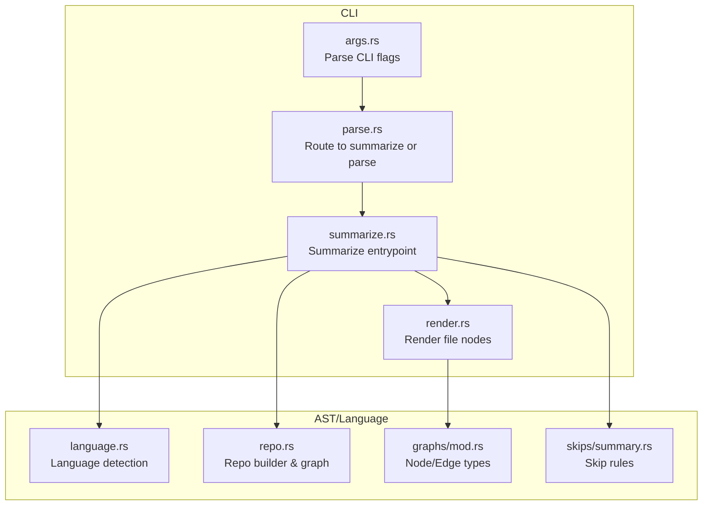
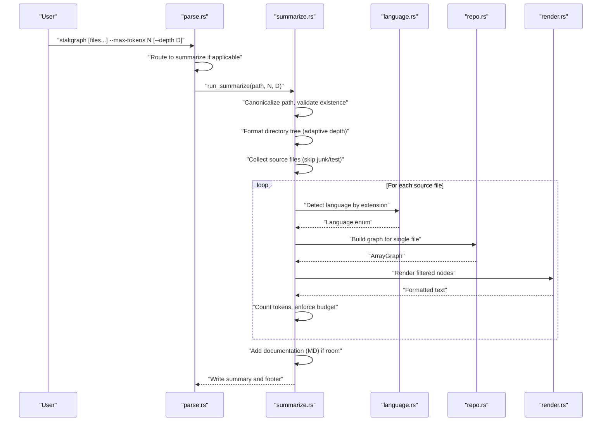
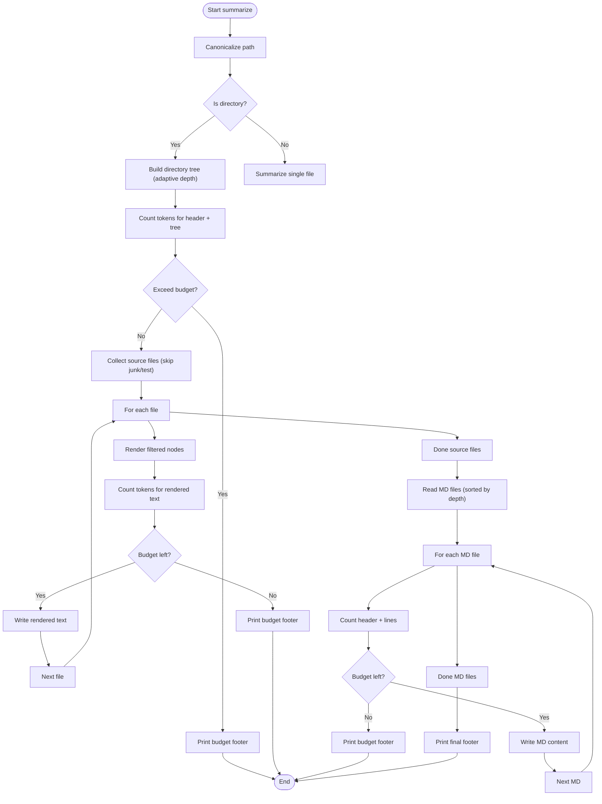
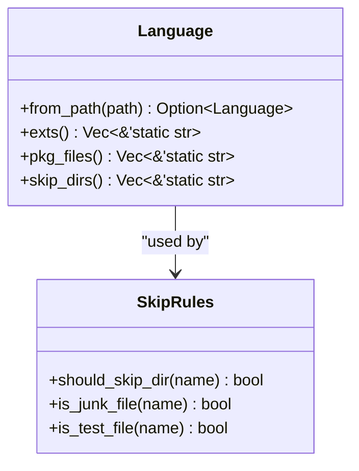
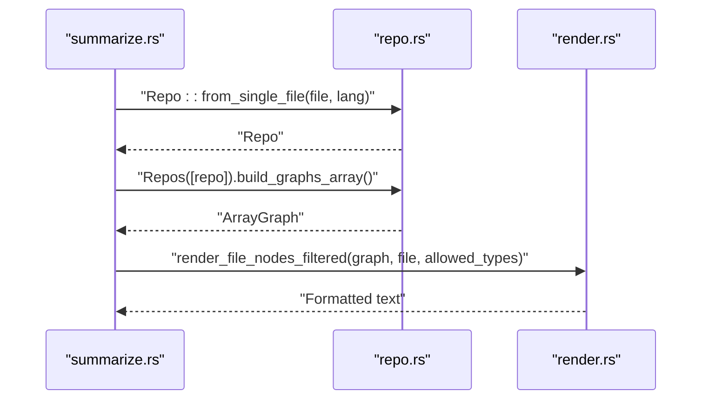
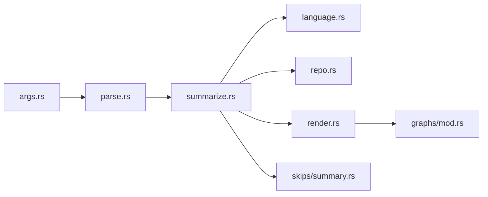

# Project Summarization

<cite>
**Referenced Files in This Document**
- [summarize.rs](file://cli/src/summarize.rs)
- [args.rs](file://cli/src/args.rs)
- [parse.rs](file://cli/src/parse.rs)
- [render.rs](file://cli/src/render.rs)
- [language.rs](file://lsp/src/language.rs)
- [repo.rs](file://ast/src/repo.rs)
- [summary.rs](file://ast/src/lang/queries/skips/summary.rs)
- [mod.rs (graphs)](file://ast/src/lang/graphs/mod.rs)
- [summarize_cmd.rs](file://cli/tests/cli/summarize_cmd.rs)
</cite>

## Table of Contents
1. [Introduction](#introduction)
2. [Project Structure](#project-structure)
3. [Core Components](#core-components)
4. [Architecture Overview](#architecture-overview)
5. [Detailed Component Analysis](#detailed-component-analysis)
6. [Dependency Analysis](#dependency-analysis)
7. [Performance Considerations](#performance-considerations)
8. [Troubleshooting Guide](#troubleshooting-guide)
9. [Conclusion](#conclusion)
10. [Appendices](#appendices)

## Introduction
This document explains the StakGraph summarize command: how it generates comprehensive project summaries with token-aware analysis and multi-language support. It covers command syntax, output formats, customization options, examples across project types, token counting, language detection, and performance guidance for large codebases. The goal is to help you quickly assess projects, assist in code reviews, and identify technical debt using concise, budget-aware summaries.

## Project Structure
The summarize command lives in the CLI and orchestrates parsing, graph building, and rendering. It leverages language detection, AST graph construction, and token-aware budgeting to produce summaries.

**Diagram sources**
- [args.rs:1-190](file://cli/src/args.rs#L1-L190)
- [parse.rs:62-225](file://cli/src/parse.rs#L62-L225)
- [summarize.rs:204-444](file://cli/src/summarize.rs#L204-L444)
- [render.rs:421-430](file://cli/src/render.rs#L421-L430)
- [language.rs:314-327](file://lsp/src/language.rs#L314-L327)
- [repo.rs:70-195](file://ast/src/repo.rs#L70-L195)
- [mod.rs (graphs):31-55](file://ast/src/lang/graphs/mod.rs#L31-L55)
- [summary.rs:1-127](file://ast/src/lang/queries/skips/summary.rs#L1-L127)

**Section sources**
- [args.rs:1-190](file://cli/src/args.rs#L1-L190)
- [parse.rs:62-225](file://cli/src/parse.rs#L62-L225)
- [summarize.rs:204-444](file://cli/src/summarize.rs#L204-L444)
- [render.rs:421-430](file://cli/src/render.rs#L421-L430)
- [language.rs:314-327](file://lsp/src/language.rs#L314-L327)
- [repo.rs:70-195](file://ast/src/repo.rs#L70-L195)
- [mod.rs (graphs):31-55](file://ast/src/lang/graphs/mod.rs#L31-L55)
- [summary.rs:1-127](file://ast/src/lang/queries/skips/summary.rs#L1-L127)

## Core Components
- CLI argument parsing and routing: Determines whether to run summarize mode based on flags and inputs.
- Summarize engine: Builds a directory tree, collects source files, renders summaries, and adds documentation context with token budgeting.
- Language detection: Maps file extensions to supported languages and filters irrelevant files.
- Graph rendering: Converts parsed AST nodes into readable summaries for allowed node types.
- Skip rules: Excludes junk/test directories and files to keep summaries focused.

Key behaviors:
- Token-aware budgeting: Uses a tokenizer to estimate output size and stops adding content when the budget is exceeded.
- Adaptive directory depth: Chooses depth based on budget when summarizing directories.
- Multi-language support: Detects languages via extension and builds language-specific graphs.

**Section sources**
- [args.rs:49-60](file://cli/src/args.rs#L49-L60)
- [parse.rs:67-70](file://cli/src/parse.rs#L67-L70)
- [summarize.rs:204-444](file://cli/src/summarize.rs#L204-L444)
- [language.rs:314-327](file://lsp/src/language.rs#L314-L327)
- [render.rs:421-430](file://cli/src/render.rs#L421-L430)
- [summary.rs:113-127](file://ast/src/lang/queries/skips/summary.rs#L113-L127)

## Architecture Overview
The summarize flow integrates CLI flags, language detection, graph building, and token-aware rendering.

**Diagram sources**
- [parse.rs:62-70](file://cli/src/parse.rs#L62-L70)
- [summarize.rs:204-444](file://cli/src/summarize.rs#L204-L444)
- [language.rs:314-327](file://lsp/src/language.rs#L314-L327)
- [repo.rs:70-195](file://ast/src/repo.rs#L70-L195)
- [render.rs:421-430](file://cli/src/render.rs#L421-L430)

## Detailed Component Analysis

### Command Syntax and Options
- Positional inputs:
  - FILE_OR_DIR: One or more files/directories (comma-separated or multiple args).
- Flags:
  - --max-tokens N: Activates token-aware budgeting; default applied when summarizing directories without filters.
  - --depth D: Maximum directory tree depth when using token budgeting on directories.
  - --verbose, --perf, --quiet: Control logging verbosity.
  - --type TYPE,...: Limit node types to render (ignored in summarize mode).
  - --stats, --allow, --skip-calls, --no-nested, --name: Other modes; summarize ignores most of these.

Behavior:
- If --max-tokens is provided or input is a directory without filters, the CLI routes to summarize mode automatically.

**Section sources**
- [args.rs:49-60](file://cli/src/args.rs#L49-L60)
- [args.rs:154-189](file://cli/src/args.rs#L154-L189)
- [parse.rs:67-70](file://cli/src/parse.rs#L67-L70)

### Token Counting Algorithm
- Token estimation uses a tokenizer to encode text and count tokens.
- ANSI color codes are stripped before counting to reflect terminal output size.
- Budget enforcement occurs after writing each section:
  - Directory tree
  - Per-file summaries
  - Documentation (Markdown) content

**Diagram sources**
- [summarize.rs:204-444](file://cli/src/summarize.rs#L204-L444)
- [summarize.rs:46-49](file://cli/src/summarize.rs#L46-L49)

**Section sources**
- [summarize.rs:204-444](file://cli/src/summarize.rs#L204-L444)
- [summarize.rs:46-49](file://cli/src/summarize.rs#L46-L49)

### Language Detection and Multi-Language Support
- Detection:
  - Maps file extension to a Language variant.
  - Supported languages include Rust, Go, TypeScript/JS/TSX/JSX, Python, Ruby, Kotlin, Swift, Java, Bash, Toml, Svelte, Angular, C/C++, PHP, CSharp.
- Filtering:
  - Skips directories and files marked as junk or tests.
  - Uses language-specific skip lists and patterns.

**Diagram sources**
- [language.rs:314-327](file://lsp/src/language.rs#L314-L327)
- [summary.rs:113-127](file://ast/src/lang/queries/skips/summary.rs#L113-L127)

**Section sources**
- [language.rs:25-40](file://lsp/src/language.rs#L25-L40)
- [language.rs:314-327](file://lsp/src/language.rs#L314-L327)
- [summary.rs:113-127](file://ast/src/lang/queries/skips/summary.rs#L113-L127)

### Summary Generation Process
- Allowed node types for summaries:
  - Function, Class, DataModel, Endpoint, Request, Trait.
- Rendering:
  - Builds a single-file graph.
  - Filters nodes to allowed types.
  - Formats each node with metadata, docs, and body previews.
- Ordering:
  - Source files are scored by proximity to entry points and depth to prioritize important files.

**Diagram sources**
- [summarize.rs:176-202](file://cli/src/summarize.rs#L176-L202)
- [repo.rs:70-195](file://ast/src/repo.rs#L70-L195)
- [render.rs:421-430](file://cli/src/render.rs#L421-L430)

**Section sources**
- [summarize.rs:22-29](file://cli/src/summarize.rs#L22-L29)
- [summarize.rs:176-202](file://cli/src/summarize.rs#L176-L202)
- [render.rs:421-430](file://cli/src/render.rs#L421-L430)

### Output Formats and Sections
- Header: "Summary:" followed by the path and token budget.
- Directory Structure: Underlined section with a tree view; depth adapts to budget.
- File Summaries: Underlined section; each file summary includes:
  - File label
  - Node summaries (function/class/data model/endpoint/request/trait)
  - Optional docs and body previews
- Documentation: Underlined section for Markdown files; prints header and lines until budget is exhausted.
- Footer: Final token usage and number of files not shown if any.

**Section sources**
- [summarize.rs:264-314](file://cli/src/summarize.rs#L264-L314)
- [summarize.rs:320-369](file://cli/src/summarize.rs#L320-L369)
- [summarize.rs:377-423](file://cli/src/summarize.rs#L377-L423)
- [summarize.rs:425-441](file://cli/src/summarize.rs#L425-L441)

### Examples and Use Cases
- Single file summary:
  - Run with a file path and --max-tokens to generate a focused summary for that file.
- Directory summary with depth:
  - Run on a directory with --max-tokens and --depth to limit tree depth.
- Budget exhaustion:
  - When budget is tight, the summary stops early and reports tokens used and files omitted.

Validation and behavior are covered by tests:
- Single file smoke test
- Directory with depth
- Budget footer presence
- Invalid path handling

**Section sources**
- [summarize_cmd.rs:5-40](file://cli/tests/cli/summarize_cmd.rs#L5-L40)

## Dependency Analysis
- CLI routing depends on argument parsing to decide summarize mode.
- Summarize depends on:
  - Language detection for file inclusion
  - Repo/graph building for per-file summaries
  - Rendering to format node outputs
  - Skip rules to exclude noise
- Node types used in summaries are defined centrally.

**Diagram sources**
- [args.rs:1-190](file://cli/src/args.rs#L1-L190)
- [parse.rs:62-225](file://cli/src/parse.rs#L62-L225)
- [summarize.rs:204-444](file://cli/src/summarize.rs#L204-L444)
- [language.rs:314-327](file://lsp/src/language.rs#L314-L327)
- [repo.rs:70-195](file://ast/src/repo.rs#L70-L195)
- [render.rs:421-430](file://cli/src/render.rs#L421-L430)
- [summary.rs:1-127](file://ast/src/lang/queries/skips/summary.rs#L1-L127)
- [mod.rs (graphs):31-55](file://ast/src/lang/graphs/mod.rs#L31-L55)

**Section sources**
- [args.rs:1-190](file://cli/src/args.rs#L1-L190)
- [parse.rs:62-225](file://cli/src/parse.rs#L62-L225)
- [summarize.rs:204-444](file://cli/src/summarize.rs#L204-L444)
- [language.rs:314-327](file://lsp/src/language.rs#L314-L327)
- [repo.rs:70-195](file://ast/src/repo.rs#L70-L195)
- [render.rs:421-430](file://cli/src/render.rs#L421-L430)
- [summary.rs:1-127](file://ast/src/lang/queries/skips/summary.rs#L1-L127)
- [mod.rs (graphs):31-55](file://ast/src/lang/graphs/mod.rs#L31-L55)

## Performance Considerations
- Token budgeting:
  - Enforces early termination to avoid excessive memory and I/O.
  - Prefer smaller budgets for very large projects to keep summaries responsive.
- Directory depth:
  - Use --depth to reduce directory tree size when budget is low.
- File ordering:
  - Source files are prioritized by proximity to entry points and shallow depth to surface key areas first.
- Memory and logging:
  - Logging can be controlled via --verbose/--perf/--quiet to reduce overhead during large runs.

[No sources needed since this section provides general guidance]

## Troubleshooting Guide
Common issues and resolutions:
- Invalid path:
  - The command validates the path and exits with an error if it does not exist.
- No parseable files:
  - If no source files are found or budget is too small, the summary indicates that no summaries were produced.
- Budget exhausted at directory tree:
  - When the tree alone exceeds the budget, the footer indicates budget reached at that stage.
- Large projects:
  - Reduce --max-tokens or set --depth to limit scope.

**Section sources**
- [summarize.rs:220-231](file://cli/src/summarize.rs#L220-L231)
- [summarize.rs:304-314](file://cli/src/summarize.rs#L304-L314)
- [summarize_cmd.rs:35-40](file://cli/tests/cli/summarize_cmd.rs#L35-L40)

## Conclusion
The StakGraph summarize command delivers a fast, token-aware, multi-language project summary. By combining language detection, adaptive directory depth, and targeted node rendering, it helps you quickly understand codebases, guide code reviews, and identify areas needing attention. Tune --max-tokens and --depth for large projects to maintain responsiveness.

[No sources needed since this section summarizes without analyzing specific files]

## Appendices

### Command Reference
- stakgraph [FILE_OR_DIR ...] --max-tokens N [--depth D] [--verbose | --perf | --quiet]

Where:
- FILE_OR_DIR: One or more files or directories (comma-separated or multiple args).
- N: Token budget for output.
- D: Maximum directory tree depth when summarizing directories under budget.

**Section sources**
- [args.rs:49-60](file://cli/src/args.rs#L49-L60)
- [parse.rs:67-70](file://cli/src/parse.rs#L67-L70)

### Allowed Node Types in Summaries
- Function, Class, DataModel, Endpoint, Request, Trait.

**Section sources**
- [summarize.rs:22-29](file://cli/src/summarize.rs#L22-L29)
- [mod.rs (graphs):31-55](file://ast/src/lang/graphs/mod.rs#L31-L55)