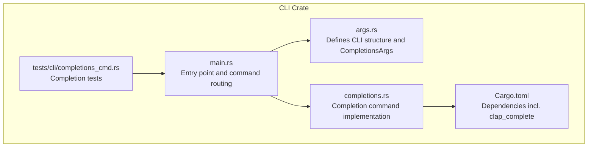
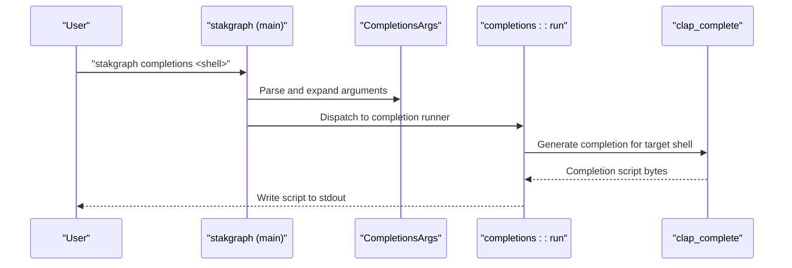
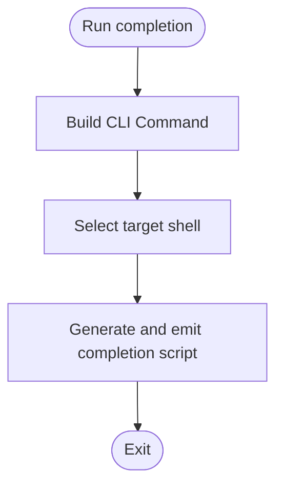
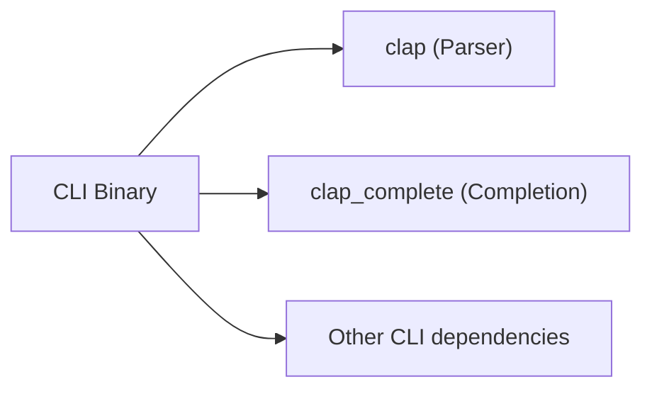

# Shell Completion Scripts

<cite>
**Referenced Files in This Document**
- [completions.rs](file://cli/src/completions.rs)
- [args.rs](file://cli/src/args.rs)
- [main.rs](file://cli/src/main.rs)
- [Cargo.toml](file://cli/Cargo.toml)
- [completions_cmd.rs](file://cli/tests/cli/completions_cmd.rs)
- [install.sh](file://install.sh)
- [README.md](file://README.md)
</cite>

## Table of Contents
1. [Introduction](#introduction)
2. [Project Structure](#project-structure)
3. [Core Components](#core-components)
4. [Architecture Overview](#architecture-overview)
5. [Detailed Component Analysis](#detailed-component-analysis)
6. [Dependency Analysis](#dependency-analysis)
7. [Performance Considerations](#performance-considerations)
8. [Troubleshooting Guide](#troubleshooting-guide)
9. [Conclusion](#conclusion)

## Introduction
This document explains StakGraph's shell completion script generation capability. The CLI provides a dedicated command to emit completion scripts for popular shells (bash, zsh, fish, and PowerShell). These scripts enable interactive autocompletion of commands, subcommands, and flags directly in the terminal. The completion system is powered by the Clap ecosystem and its companion crate for completion generation.

Key capabilities:
- Generate completion scripts for bash, zsh, fish, and powershell
- Integrate generated scripts into your shell configuration
- Leverage dynamic completion derived from the CLI's argument definition
- Troubleshoot common completion issues

## Project Structure
The completion feature is implemented within the CLI crate and integrates with the main CLI entry point. The relevant files are:
- Command definition and argument parsing
- Completion command implementation
- CLI entry point routing
- Test coverage for completion behavior
- Build-time dependency for completion generation

**Diagram sources**
- [args.rs](file://cli/src/args.rs)
- [completions.rs](file://cli/src/completions.rs)
- [main.rs](file://cli/src/main.rs)
- [Cargo.toml](file://cli/Cargo.toml)
- [completions_cmd.rs](file://cli/tests/cli/completions_cmd.rs)

**Section sources**
- [args.rs](file://cli/src/args.rs)
- [completions.rs](file://cli/src/completions.rs)
- [main.rs](file://cli/src/main.rs)
- [Cargo.toml](file://cli/Cargo.toml)
- [completions_cmd.rs](file://cli/tests/cli/completions_cmd.rs)

## Core Components
- CompletionsArgs: Defines the completion command and accepts a shell enumeration argument.
- completions::run: Generates the completion script for the requested shell and writes it to stdout.
- CLI entry point: Routes the completions command to the implementation.
- Tests: Verify that completion scripts include expected commands and flags.

How it works:
- The CLI defines a subcommand for completions with a shell parameter.
- The main entry point detects the completions command and invokes the completion runner.
- The runner builds a clap Command from the CLI definition and delegates to the completion generator to produce shell-specific output.

**Section sources**
- [args.rs](file://cli/src/args.rs)
- [completions.rs](file://cli/src/completions.rs)
- [main.rs](file://cli/src/main.rs)
- [completions_cmd.rs](file://cli/tests/cli/completions_cmd.rs)

## Architecture Overview
The completion system is a thin wrapper around Clap's completion generation. The CLI's argument structure drives the completion content, ensuring that new flags and subcommands automatically appear in generated scripts.

**Diagram sources**
- [main.rs](file://cli/src/main.rs)
- [args.rs](file://cli/src/args.rs)
- [completions.rs](file://cli/src/completions.rs)
- [Cargo.toml](file://cli/Cargo.toml)

## Detailed Component Analysis

### CompletionsArgs and CLI Argument Definition
- The CLI defines a subcommand for completions with a shell parameter.
- The shell parameter is an enum supported by the completion generator.
- The CLI's top-level arguments and subcommands inform the generated completion content.

Implementation highlights:
- The completions subcommand is declared alongside other commands.
- The shell parameter uses Clap's enum support for completion generation.

**Section sources**
- [args.rs](file://cli/src/args.rs)

### Completion Runner Implementation
- The runner constructs the CLI's Command from the parsed arguments.
- It delegates to the completion generator to write the appropriate shell script to stdout.
- The runner is invoked only when the completions command is detected.

**Diagram sources**
- [completions.rs](file://cli/src/completions.rs)
- [args.rs](file://cli/src/args.rs)

**Section sources**
- [completions.rs](file://cli/src/completions.rs)

### CLI Entry Point Routing
- The main entry point parses arguments and expands file lists.
- It routes to the completion runner when the completions command is present.
- Other commands (changes, deps) are unaffected by completion generation.

**Section sources**
- [main.rs](file://cli/src/main.rs)

### Test Coverage for Completions
- Tests confirm that bash completion includes the main command and key flags.
- Tests confirm that zsh completion emits non-empty output.
- These tests validate that the completion system produces usable scripts.

**Section sources**
- [completions_cmd.rs](file://cli/tests/cli/completions_cmd.rs)

## Dependency Analysis
The completion feature relies on a dedicated dependency for generating shell completion scripts. This dependency is declared in the CLI crate's manifest.

**Diagram sources**
- [Cargo.toml](file://cli/Cargo.toml)

**Section sources**
- [Cargo.toml](file://cli/Cargo.toml)

## Performance Considerations
- Completion generation is a lightweight operation that writes to stdout.
- There is no runtime overhead for enabling completion; scripts are generated on demand.
- Using completion scripts improves ergonomics by reducing typing and mistakes.

## Troubleshooting Guide
Common issues and resolutions:
- No completion appears after sourcing a script:
  - Ensure the completion script was generated for the correct shell and saved to the expected location.
  - Confirm that your shell's completion system is configured to load scripts from the intended directory.
- Completion does not include recent changes:
  - Re-run the completion generation command to refresh the script.
  - Verify that the CLI binary used for generation matches the one in your PATH.
- Bash completion not working:
  - Confirm that bash-completion is installed and loaded.
  - Ensure the generated script is placed in a directory searched by bash-completion.
- Zsh completion not working:
  - Confirm that compinit is initialized and compsys is available.
  - Ensure the generated script is placed in a directory in fpath.
- Fish completion not working:
  - Confirm that the fish user configuration directory exists and contains the generated script.
  - Reload fish or restart the shell to apply changes.
- PowerShell completion not working:
  - Confirm that the generated script is sourced in your PowerShell profile.
  - Ensure that tab-completion is enabled for the current session.

## Conclusion
StakGraph's completion system leverages Clap and its completion generator to provide accurate, dynamic shell scripts for bash, zsh, fish, and PowerShell. By generating completion scripts from the CLI's argument definition, the system remains synchronized with the command surface. Integrating these scripts into your shell configuration significantly improves productivity and reduces errors when using the CLI.