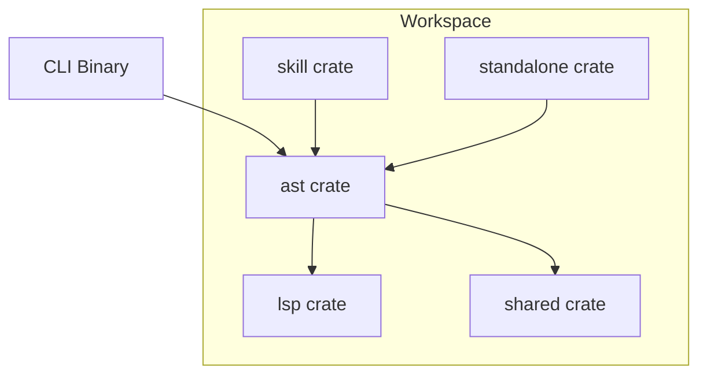
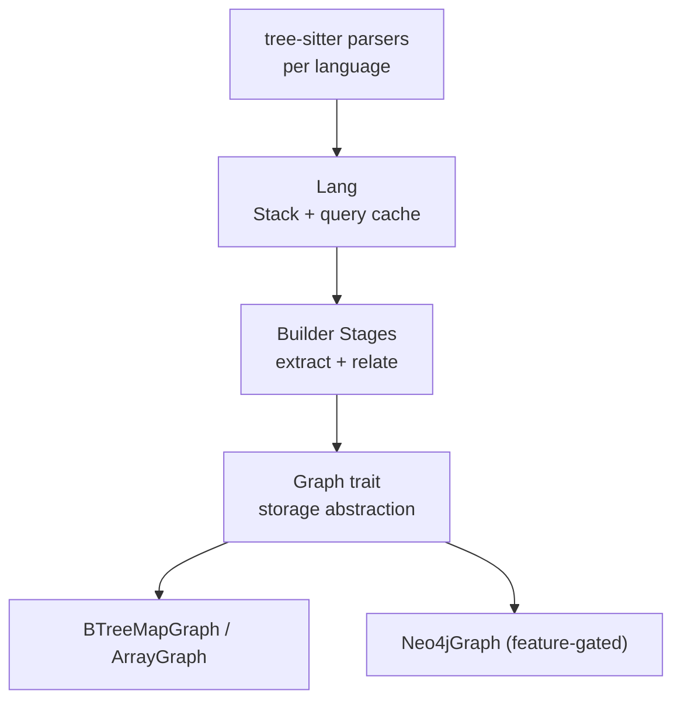
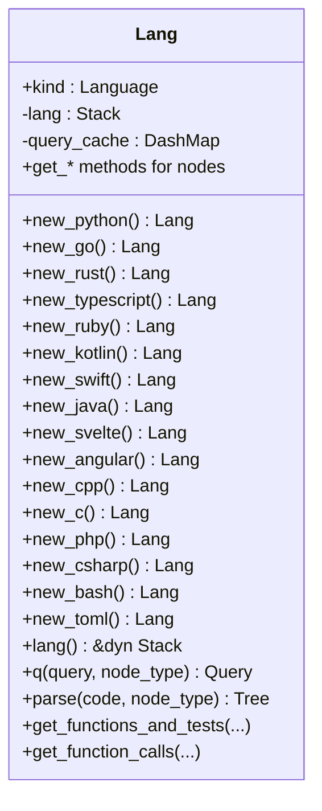
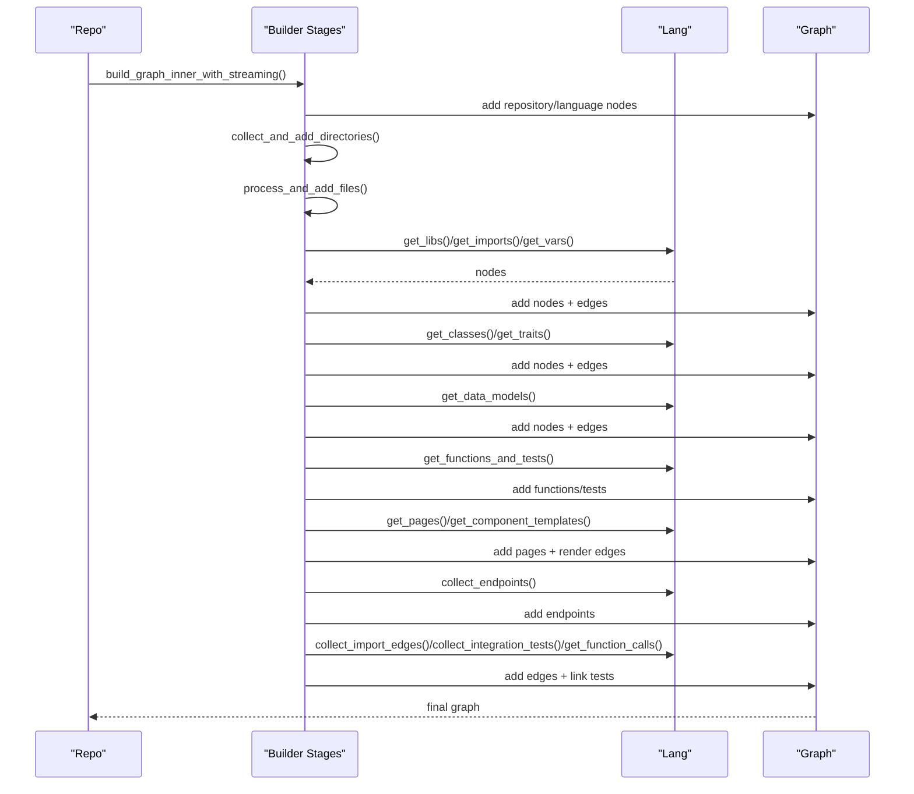
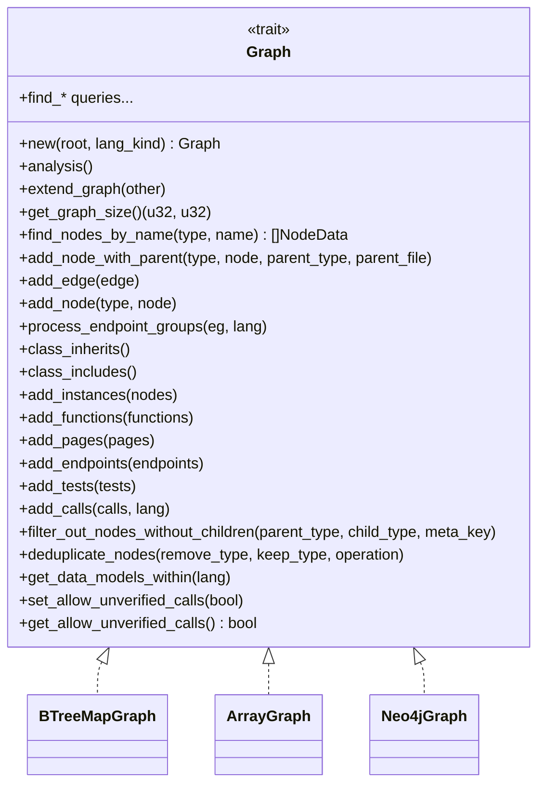
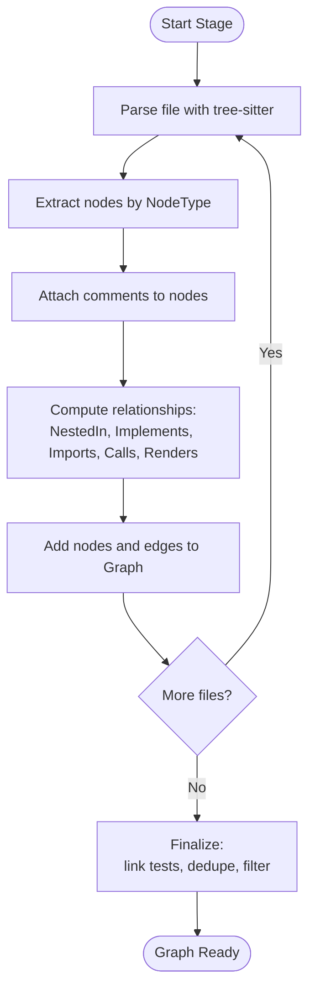
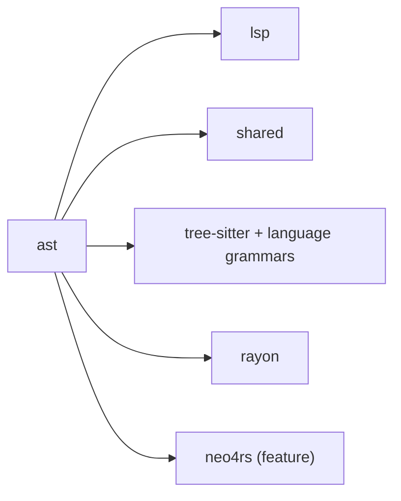

# Core Engine Architecture

<cite>
**Referenced Files in This Document**
- [Cargo.toml](file://Cargo.toml)
- [ast/Cargo.toml](file://ast/Cargo.toml)
- [ast/src/lib.rs](file://ast/src/lib.rs)
- [ast/src/index.rs](file://ast/src/index.rs)
- [ast/src/repo.rs](file://ast/src/repo.rs)
- [ast/src/lang/mod.rs](file://ast/src/lang/mod.rs)
- [ast/src/lang/asg.rs](file://ast/src/lang/asg.rs)
- [ast/src/lang/graphs/mod.rs](file://ast/src/lang/graphs/mod.rs)
- [ast/src/lang/graphs/graph.rs](file://ast/src/lang/graphs/graph.rs)
- [ast/src/builder/mod.rs](file://ast/src/builder/mod.rs)
- [ast/src/builder/core.rs](file://ast/src/builder/core.rs)
- [ast/src/builder/stages.rs](file://ast/src/builder/stages.rs)
</cite>

## Table of Contents
1. [Introduction](#introduction)
2. [Project Structure](#project-structure)
3. [Core Components](#core-components)
4. [Architecture Overview](#architecture-overview)
5. [Detailed Component Analysis](#detailed-component-analysis)
6. [Dependency Analysis](#dependency-analysis)
7. [Performance Considerations](#performance-considerations)
8. [Troubleshooting Guide](#troubleshooting-guide)
9. [Conclusion](#conclusion)

## Introduction
This document describes the StakGraph core engine architecture centered on tree-sitter parsing and graph construction. It explains the language parser factory pattern, the multi-stage graph building pipeline, and storage backend abstractions. It also covers the AST engine fundamentals, language-agnostic parsing approach, and relationship mapping algorithms. The document details the graph construction stages from node extraction through edge creation to final storage, and outlines the modular architecture enabling pluggable language parsers and graph storage backends. Finally, it includes technical decisions, performance considerations, and extensibility patterns.

## Project Structure
The StakGraph workspace is organized into crates:
- ast: Core engine implementing parsing, graph construction, and storage abstractions
- lsp: Language Server Protocol integration for advanced analysis
- shared: Common utilities and error types
- skill and standalone: Additional binaries and services
- cli: Command-line interface for ingestion and querying

**Diagram sources**
- [Cargo.toml:1-5](file://Cargo.toml#L1-L5)
- [ast/Cargo.toml:13-76](file://ast/Cargo.toml#L13-L76)

**Section sources**
- [Cargo.toml:1-5](file://Cargo.toml#L1-L5)
- [ast/Cargo.toml:1-121](file://ast/Cargo.toml#L1-L121)

## Core Components
- Lang: Factory and orchestrator for language-specific parsing and query execution. It encapsulates a Stack trait object for language-specific behavior, maintains a query cache, and exposes methods to extract nodes and relationships for each language.
- Graph trait: Defines the abstraction for graph storage backends. Implementations include in-memory graphs (BTreeMapGraph, ArrayGraph) and optionally Neo4jGraph when enabled via features.
- Repo and Repos: Manage repository scanning, file collection, LSP initialization, and orchestrate the multi-stage graph building pipeline across files and directories.
- Builder stages: Implement the pipeline stages for libraries, imports, variables, classes/trait/implements, data models, functions/tests, pages/templates, endpoints, and finalization (edges, tests linkage, function calls).

Key responsibilities:
- Lang: Parses code with tree-sitter, executes language-specific queries, attaches comments, filters nested data models, and collects relationships.
- Graph: Provides node and edge insertion, querying, deduplication, filtering, and specialized operations (inheritance, includes).
- Repo: Coordinates file discovery, LSP setup, and delegates to builder stages to construct the graph incrementally.

**Section sources**
- [ast/src/lang/mod.rs:51-329](file://ast/src/lang/mod.rs#L51-L329)
- [ast/src/lang/graphs/graph.rs:11-191](file://ast/src/lang/graphs/graph.rs#L11-L191)
- [ast/src/repo.rs:55-565](file://ast/src/repo.rs#L55-L565)
- [ast/src/builder/core.rs:30-228](file://ast/src/builder/core.rs#L30-L228)
- [ast/src/builder/stages.rs:14-694](file://ast/src/builder/stages.rs#L14-L694)

## Architecture Overview
The core engine follows a layered architecture:
- Parsing layer: Uses tree-sitter grammars per language to produce parse trees.
- Language layer: Wraps language-specific logic, queries, and heuristics behind the Lang facade.
- Builder layer: Executes multi-stage pipeline to extract nodes and relationships.
- Storage layer: Graph trait abstracts storage backends; concrete implementations persist nodes and edges.

**Diagram sources**
- [ast/src/lang/mod.rs:28-329](file://ast/src/lang/mod.rs#L28-L329)
- [ast/src/lang/graphs/graph.rs:11-191](file://ast/src/lang/graphs/graph.rs#L11-L191)
- [ast/src/builder/core.rs:46-228](file://ast/src/builder/core.rs#L46-L228)
- [ast/Cargo.toml:6-10](file://ast/Cargo.toml#L6-L10)

## Detailed Component Analysis

### Language Parser Factory Pattern (Lang)
Lang acts as a factory and façade:
- Holds a boxed Stack trait object representing language-specific behavior
- Maintains a DashMap query cache keyed by query string and NodeType
- Exposes methods to parse code, collect nodes (classes, traits, imports, variables, data models, functions/tests, pages), and compute relationships (calls, imports, implements, nested-in)
- Provides comment attachment and filtering for nested data models

**Diagram sources**
- [ast/src/lang/mod.rs:51-329](file://ast/src/lang/mod.rs#L51-L329)

**Section sources**
- [ast/src/lang/mod.rs:51-329](file://ast/src/lang/mod.rs#L51-L329)

### Multi-Stage Graph Building Pipeline
The pipeline is orchestrated by Repo and implemented across builder stages:
- Initialization: Add repository and language nodes
- Directories: Collect and add directory nodes with parent relationships
- Files: Read files, add File nodes
- Libraries: Parse package files and add Library nodes
- Imports: Parse import sections and add Import nodes; populate import cache
- Variables: Extract variable nodes
- Classes and Traits: Add Class and Trait nodes; compute inherits/includes
- Implements: Resolve Implements edges across files
- Data Models: Add DataModel nodes; compute contains edges
- Functions and Tests: Extract functions and tests; attach comments; compute nested-in edges
- Pages and Templates: Detect pages and component templates; add Page nodes and Render edges
- Endpoints: Extract endpoints and endpoint groups; optionally find data models within
- Finalization: Add import edges, integration tests, function calls; link tests; clean graph

**Diagram sources**
- [ast/src/builder/core.rs:46-228](file://ast/src/builder/core.rs#L46-L228)
- [ast/src/builder/stages.rs:14-694](file://ast/src/builder/stages.rs#L14-L694)
- [ast/src/lang/mod.rs:355-728](file://ast/src/lang/mod.rs#L355-L728)

**Section sources**
- [ast/src/builder/core.rs:30-228](file://ast/src/builder/core.rs#L30-L228)
- [ast/src/builder/stages.rs:14-694](file://ast/src/builder/stages.rs#L14-L694)

### Storage Backend Abstractions (Graph trait)
The Graph trait defines the contract for graph storage backends:
- Node and edge insertion with parent-child semantics
- Querying by type/name/file and range-based lookup
- Specialized operations: class inheritance/inclusion, endpoint grouping, function call aggregation, deduplication, filtering
- Allow/deny unverified calls flag for safety during relationship mapping

Concrete implementations:
- BTreeMapGraph and ArrayGraph: in-memory graphs for local builds
- Neo4jGraph: optional backend when the neo4j feature is enabled

**Diagram sources**
- [ast/src/lang/graphs/graph.rs:11-191](file://ast/src/lang/graphs/graph.rs#L11-L191)
- [ast/src/lang/graphs/mod.rs:1-23](file://ast/src/lang/graphs/mod.rs#L1-L23)

**Section sources**
- [ast/src/lang/graphs/graph.rs:11-191](file://ast/src/lang/graphs/graph.rs#L11-L191)
- [ast/src/lang/graphs/mod.rs:1-23](file://ast/src/lang/graphs/mod.rs#L1-L23)

### AST Engine Fundamentals and Relationship Mapping
- Node model: NodeData captures name, file path, body, start/end positions, optional docs/hash/type, and metadata map
- Edge model: Edge connects NodeRef pairs with typed relationships (Calls, Uses, Operand, ArgOf, Contains, Imports, Of, Handler, Includes, Renders, ParentOf, Implements, NestedIn)
- Relationship mapping algorithms:
  - Nested-in: Detect function nesting by containment ranges and emit NestedIn edges
  - Implements: Resolve trait/class relationships by name/file mapping
  - Calls: Extract function calls per file; support test classification and linkage
  - Imports: Build Import nodes and Imports edges; maintain import cache
  - Pages/Templates: Map Angular/Svelte/etc. component templates to Page nodes and Renders edges
  - Endpoints: Extract endpoints and endpoint groups; optionally locate data models within

**Diagram sources**
- [ast/src/lang/asg.rs:66-228](file://ast/src/lang/asg.rs#L66-L228)
- [ast/src/lang/graphs/mod.rs:63-293](file://ast/src/lang/graphs/mod.rs#L63-L293)
- [ast/src/builder/stages.rs:581-692](file://ast/src/builder/stages.rs#L581-L692)

**Section sources**
- [ast/src/lang/asg.rs:66-228](file://ast/src/lang/asg.rs#L66-L228)
- [ast/src/lang/graphs/mod.rs:63-293](file://ast/src/lang/graphs/mod.rs#L63-L293)
- [ast/src/builder/stages.rs:581-692](file://ast/src/builder/stages.rs#L581-L692)

### Language-Agnostic Parsing Approach
- Each language contributes a Stack implementation with:
  - Language identifier and file extensions
  - Queries for extracting nodes (classes, traits, imports, variables, data models, functions/tests, pages)
  - Queries for relationships (calls, imports, implements, nested scopes)
  - Heuristics for comments, router files, template files, endpoint groups, and data model scoping
- Lang wraps these capabilities behind a unified API, enabling a single pipeline to work across languages

**Section sources**
- [ast/src/lang/mod.rs:197-308](file://ast/src/lang/mod.rs#L197-L308)
- [ast/src/lang/mod.rs:355-728](file://ast/src/lang/mod.rs#L355-L728)

### Modular Architecture and Extensibility
- Pluggable language parsers: New languages are added by implementing the Stack trait and registering constructors in Lang
- Pluggable storage backends: Implement Graph trait to support new storage systems
- Feature flags: Optional Neo4j integration and openssl-dependent features
- Parallelization: Builder stages leverage rayon for parallel processing where appropriate

**Section sources**
- [ast/src/lang/mod.rs:51-329](file://ast/src/lang/mod.rs#L51-L329)
- [ast/src/lang/graphs/graph.rs:11-191](file://ast/src/lang/graphs/graph.rs#L11-L191)
- [ast/Cargo.toml:6-10](file://ast/Cargo.toml#L6-L10)

## Dependency Analysis
The core engine depends on:
- tree-sitter grammars for parsing
- lsp crate for language detection and optional LSP integration
- shared crate for common types and error handling
- Optional neo4rs for Neo4j backend
- rayon for parallel processing

**Diagram sources**
- [ast/Cargo.toml:13-76](file://ast/Cargo.toml#L13-L76)

**Section sources**
- [ast/Cargo.toml:13-76](file://ast/Cargo.toml#L13-L76)

## Performance Considerations
- Query caching: Lang caches compiled tree-sitter queries per query string and NodeType to avoid repeated compilation
- Timing instrumentation: Stages record timing and memory usage for profiling
- Parallel processing: Builder stages use rayon to process files concurrently where safe
- Streaming upload: Optional batch upload to Neo4j reduces memory overhead during large graphs
- Filtering: Early filtering of files and nested data models reduces workload

Recommendations:
- Enable STREAM_UPLOAD for large graphs when using Neo4j
- Use appropriate skip filters to reduce traversal
- Monitor parse statistics via Lang’s parse stats APIs

**Section sources**
- [ast/src/lang/mod.rs:30-49](file://ast/src/lang/mod.rs#L30-L49)
- [ast/src/builder/core.rs:66-225](file://ast/src/builder/core.rs#L66-L225)
- [ast/src/builder/stages.rs:14-694](file://ast/src/builder/stages.rs#L14-L694)

## Troubleshooting Guide
Common issues and remedies:
- No supported language detected: Verify package files and required indicators; adjust configuration or environment variables
- Large files skipped: Files exceeding MAX_FILE_SIZE are skipped; consider splitting or adjusting limits
- LSP failures: Ensure LSP server starts successfully; disable LSP if not needed
- Missing imports or relationships: Confirm language-specific queries and filters; validate import cache population
- Memory pressure: Use streaming upload or reduce scope; review skip filters

Operational controls:
- Environment variables for repository input, output format, and LSP toggles
- Status updates and progress reporting during stages
- Parse statistics printing for diagnostics

**Section sources**
- [ast/src/repo.rs:25-53](file://ast/src/repo.rs#L25-L53)
- [ast/src/repo.rs:597-736](file://ast/src/repo.rs#L597-L736)
- [ast/src/index.rs:31-94](file://ast/src/index.rs#L31-L94)
- [ast/src/builder/core.rs:66-225](file://ast/src/builder/core.rs#L66-L225)

## Conclusion
StakGraph’s core engine provides a robust, language-agnostic graph construction pipeline powered by tree-sitter. The Lang factory pattern enables modular language support, while the Graph trait abstracts storage backends for flexibility. The multi-stage builder pipeline systematically extracts nodes and relationships, with strong extensibility for new languages and storage systems. Performance is addressed through caching, parallelization, and streaming uploads, with operational controls for diagnostics and tuning.