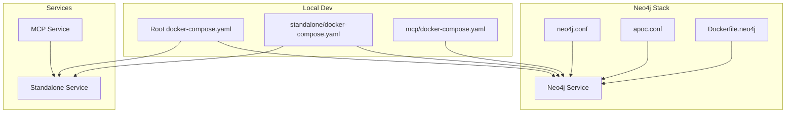
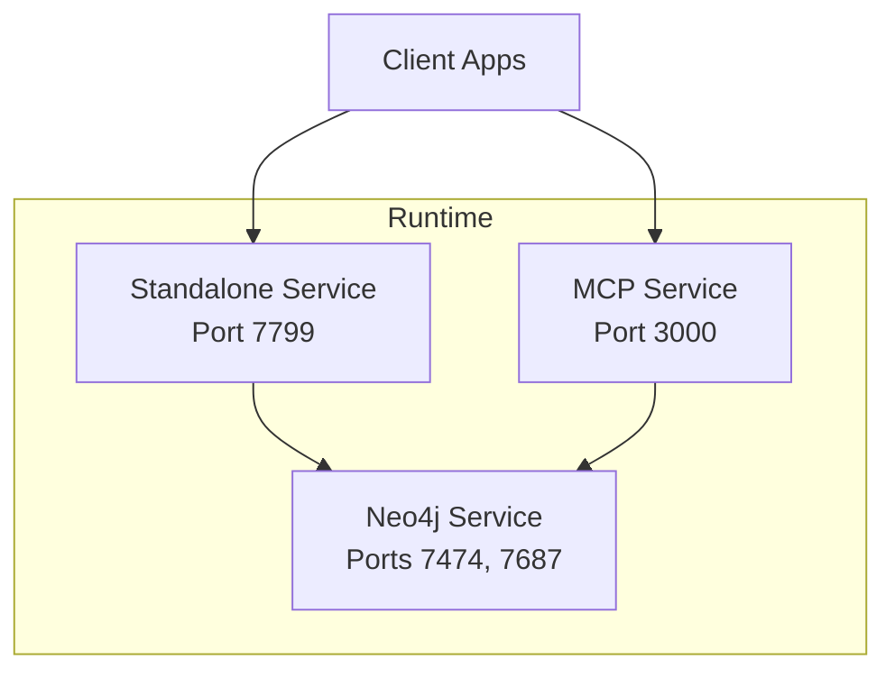
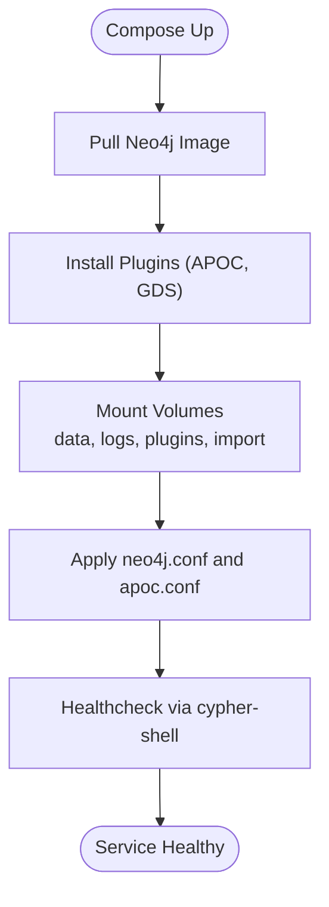
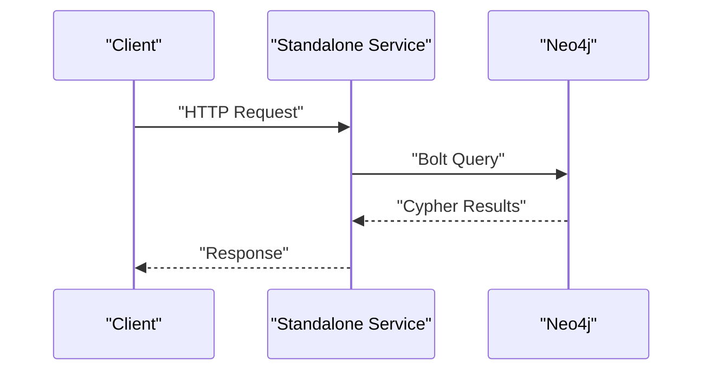
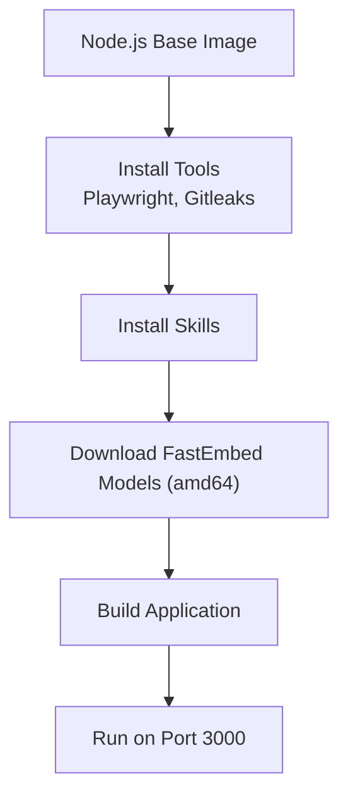
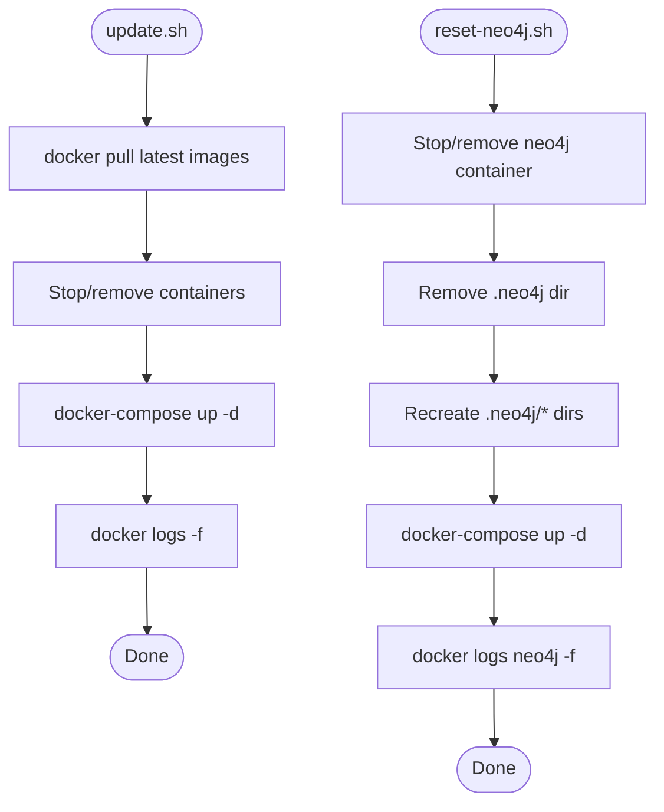
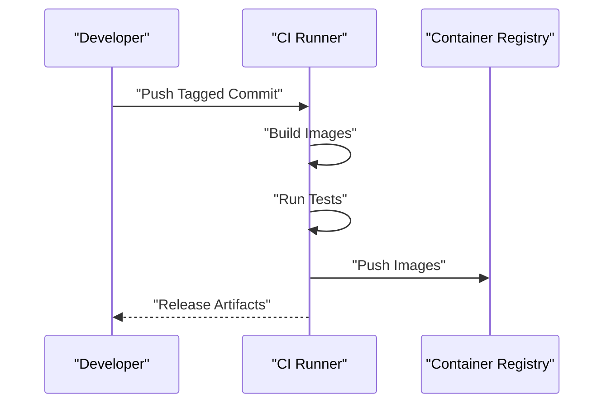
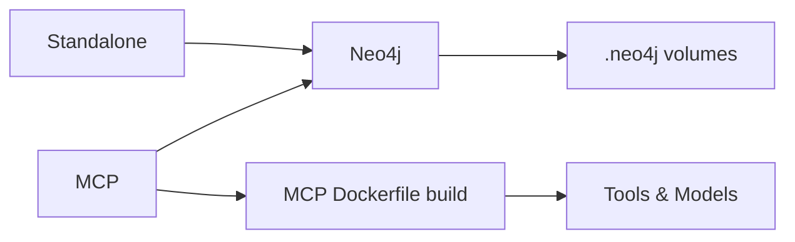
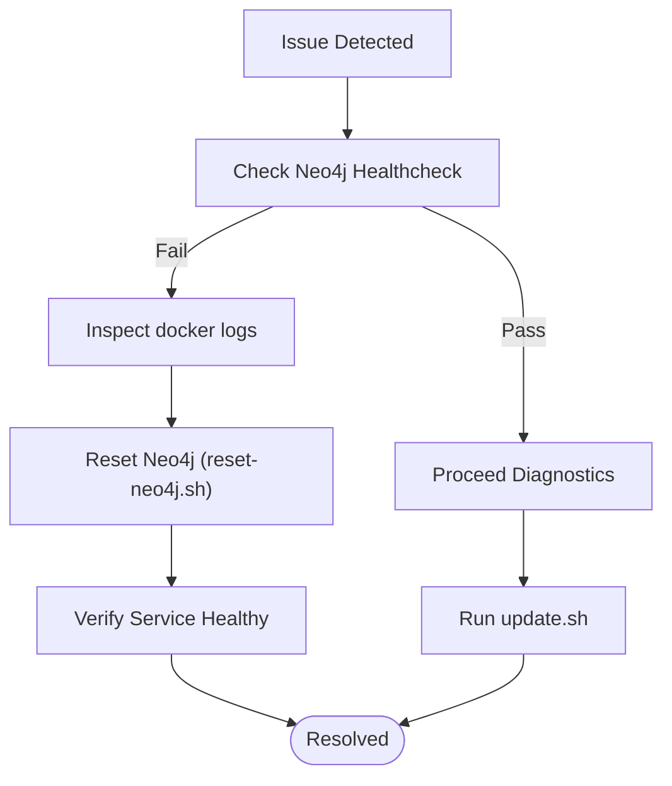

# Deployment and Operations

<cite>
**Referenced Files in This Document**
- [docker-compose.yaml](file://docker-compose.yaml)
- [standalone/docker-compose.yaml](file://standalone/docker-compose.yaml)
- [mcp/docker-compose.yaml](file://mcp/docker-compose.yaml)
- [mcp/Dockerfile.neo4j](file://mcp/Dockerfile.neo4j)
- [mcp/conf/neo4j.conf](file://mcp/conf/neo4j.conf)
- [mcp/conf/apoc.conf](file://mcp/conf/apoc.conf)
- [mcp/neo4j.yaml](file://mcp/neo4j.yaml)
- [mcp/deploy/reset-neo4j.sh](file://mcp/deploy/reset-neo4j.sh)
- [mcp/deploy/update.sh](file://mcp/deploy/update.sh)
- [mcp/deploy/dep.sh](file://mcp/deploy/dep.sh)
- [mcp/Dockerfile](file://mcp/Dockerfile)
- [install.sh](file://install.sh)
- [push-lsp.sh](file://push-lsp.sh)
- [push-skill.sh](file://push-skill.sh)
</cite>

## Table of Contents
1. [Introduction](#introduction)
2. [Project Structure](#project-structure)
3. [Core Components](#core-components)
4. [Architecture Overview](#architecture-overview)
5. [Detailed Component Analysis](#detailed-component-analysis)
6. [Dependency Analysis](#dependency-analysis)
7. [Performance Considerations](#performance-considerations)
8. [Troubleshooting Guide](#troubleshooting-guide)
9. [Conclusion](#conclusion)
10. [Appendices](#appendices)

## Introduction
This document provides comprehensive deployment and operations guidance for StakGraph. It covers containerization strategies, multi-container deployments using docker-compose, production deployment patterns, Neo4j integration and configuration, scaling considerations, CI/CD pipeline setup, automated testing, release management, monitoring and logging, performance tuning, troubleshooting, and operational best practices including security, backups, and disaster recovery.

## Project Structure
StakGraph includes multiple deployment artifacts and configurations:
- Root docker-compose for quick local stacks
- Standalone service composition with Neo4j
- MCP service stack with Neo4j configuration and deployment scripts
- Neo4j plugin customization via Dockerfile
- Configuration files for Neo4j and APOC
- Deployment automation scripts for updates and resets
- Container build and publish scripts for LSP and Skill services

**Diagram sources**
- [docker-compose.yaml:1-51](file://docker-compose.yaml#L1-L51)
- [standalone/docker-compose.yaml:1-54](file://standalone/docker-compose.yaml#L1-L54)
- [mcp/docker-compose.yaml:1-53](file://mcp/docker-compose.yaml#L1-L53)
- [mcp/Dockerfile.neo4j:1-14](file://mcp/Dockerfile.neo4j#L1-L14)
- [mcp/conf/neo4j.conf:1-17](file://mcp/conf/neo4j.conf#L1-L17)
- [mcp/conf/apoc.conf:1-4](file://mcp/conf/apoc.conf#L1-L4)

**Section sources**
- [docker-compose.yaml:1-51](file://docker-compose.yaml#L1-L51)
- [standalone/docker-compose.yaml:1-54](file://standalone/docker-compose.yaml#L1-L54)
- [mcp/docker-compose.yaml:1-53](file://mcp/docker-compose.yaml#L1-L53)

## Core Components
- Neo4j service with APOC and Graph Data Science plugins, configured via mounted volumes and configuration files
- Standalone service exposing port 7799, configured to connect to Neo4j via bolt://neo4j:7687
- MCP service built from a multi-stage Node.js Dockerfile with pre-installed tools and skills
- Deployment scripts for dependency installation, updates, and Neo4j reset operations

Key operational environment variables:
- Standalone: PORT, RUST_LOG, RUST_BACKTRACE, NEO4J_URI, NEO4J_USER, NEO4J_PASSWORD, USE_LSP, REPO_PATH
- Neo4j: NEO4J_AUTH

**Section sources**
- [docker-compose.yaml:10-16](file://docker-compose.yaml#L10-L16)
- [standalone/docker-compose.yaml:40-46](file://standalone/docker-compose.yaml#L40-L46)
- [mcp/Dockerfile:1-99](file://mcp/Dockerfile#L1-L99)
- [mcp/conf/neo4j.conf:1-17](file://mcp/conf/neo4j.conf#L1-L17)
- [mcp/conf/apoc.conf:1-4](file://mcp/conf/apoc.conf#L1-L4)

## Architecture Overview
The deployment architecture supports two primary modes:
- Single-service stack: Standalone plus Neo4j
- Multi-service stack: MCP plus Neo4j, with optional standalone

**Diagram sources**
- [standalone/docker-compose.yaml:38-54](file://standalone/docker-compose.yaml#L38-L54)
- [mcp/docker-compose.yaml:1-53](file://mcp/docker-compose.yaml#L1-L53)

## Detailed Component Analysis

### Neo4j Integration and Configuration
Neo4j is configured with:
- Plugin installation (APOC, Graph Data Science) during image build
- Persistent volumes for data, logs, plugins, and import
- Health checks using cypher-shell
- Tuned memory settings and procedure allowlists

**Diagram sources**
- [mcp/Dockerfile.neo4j:1-14](file://mcp/Dockerfile.neo4j#L1-L14)
- [mcp/conf/neo4j.conf:1-17](file://mcp/conf/neo4j.conf#L1-L17)
- [mcp/conf/apoc.conf:1-4](file://mcp/conf/apoc.conf#L1-L4)
- [mcp/docker-compose.yaml:20-53](file://mcp/docker-compose.yaml#L20-L53)

**Section sources**
- [mcp/Dockerfile.neo4j:1-14](file://mcp/Dockerfile.neo4j#L1-L14)
- [mcp/conf/neo4j.conf:9-16](file://mcp/conf/neo4j.conf#L9-L16)
- [mcp/conf/apoc.conf:1-4](file://mcp/conf/apoc.conf#L1-L4)
- [mcp/docker-compose.yaml:20-53](file://mcp/docker-compose.yaml#L20-L53)

### Standalone Service
The standalone service runs on port 7799 and connects to Neo4j via bolt://neo4j:7687. It mounts a host directory for repository ingestion and sets environment variables for logging and Neo4j credentials.

**Diagram sources**
- [standalone/docker-compose.yaml:38-54](file://standalone/docker-compose.yaml#L38-L54)

**Section sources**
- [standalone/docker-compose.yaml:38-54](file://standalone/docker-compose.yaml#L38-L54)

### MCP Service
The MCP service is built from a Node.js base image with:
- Pre-installed tools (Playwright, Gitleaks)
- Skills installation
- FastEmbed model downloads (amd64)
- Application build and exposure on port 3000

**Diagram sources**
- [mcp/Dockerfile:1-99](file://mcp/Dockerfile#L1-L99)

**Section sources**
- [mcp/Dockerfile:1-99](file://mcp/Dockerfile#L1-L99)

### Deployment Scripts
- dep.sh: Installs Docker, Docker Compose, and Git; adjusts permissions
- update.sh: Pulls latest images, stops/removes containers, restarts services, tails logs
- reset-neo4j.sh: Stops/removes Neo4j container, cleans volumes, recreates volumes, restarts stack, tails logs

**Diagram sources**
- [mcp/deploy/update.sh:1-12](file://mcp/deploy/update.sh#L1-L12)
- [mcp/deploy/reset-neo4j.sh:1-22](file://mcp/deploy/reset-neo4j.sh#L1-L22)

**Section sources**
- [mcp/deploy/dep.sh:1-21](file://mcp/deploy/dep.sh#L1-L21)
- [mcp/deploy/update.sh:1-12](file://mcp/deploy/update.sh#L1-L12)
- [mcp/deploy/reset-neo4j.sh:1-22](file://mcp/deploy/reset-neo4j.sh#L1-L22)

### CI/CD Pipeline Setup
- Release and publish scripts for LSP and Skill services are provided
- The MCP Dockerfile installs CLI via an install script, enabling reproducible builds

Recommended pipeline stages:
- Build: Build and tag images for MCP, LSP, Skill
- Test: Run unit and integration tests
- Push: Push images to registry
- Deploy: Use docker-compose to deploy to target environments

**Diagram sources**
- [push-lsp.sh:1-6](file://push-lsp.sh#L1-L6)
- [push-skill.sh:1-6](file://push-skill.sh#L1-L6)
- [mcp/Dockerfile:33-34](file://mcp/Dockerfile#L33-L34)
- [install.sh:1-94](file://install.sh#L1-L94)

**Section sources**
- [push-lsp.sh:1-6](file://push-lsp.sh#L1-L6)
- [push-skill.sh:1-6](file://push-skill.sh#L1-L6)
- [mcp/Dockerfile:33-34](file://mcp/Dockerfile#L33-L34)
- [install.sh:1-94](file://install.sh#L1-L94)

## Dependency Analysis
- Standalone depends on Neo4j being healthy before starting
- MCP depends on Neo4j availability
- Neo4j depends on persistent volumes and configuration files
- MCP build depends on external tool downloads and model assets

**Diagram sources**
- [standalone/docker-compose.yaml:49-51](file://standalone/docker-compose.yaml#L49-L51)
- [mcp/docker-compose.yaml:20-53](file://mcp/docker-compose.yaml#L20-L53)
- [mcp/Dockerfile.neo4j:1-14](file://mcp/Dockerfile.neo4j#L1-L14)
- [mcp/Dockerfile:1-99](file://mcp/Dockerfile#L1-L99)

**Section sources**
- [standalone/docker-compose.yaml:49-51](file://standalone/docker-compose.yaml#L49-L51)
- [mcp/docker-compose.yaml:20-53](file://mcp/docker-compose.yaml#L20-L53)
- [mcp/Dockerfile.neo4j:1-14](file://mcp/Dockerfile.neo4j#L1-L14)
- [mcp/Dockerfile:1-99](file://mcp/Dockerfile#L1-L99)

## Performance Considerations
- Neo4j memory tuning: pagecache and heap sizes are configured in neo4j.conf
- Procedure allowlists: restrict and enable specific procedures for security and performance
- Volume I/O: mount persistent volumes for data and logs to avoid container-local storage overhead
- Platform-specific optimizations: FastEmbed model downloads are restricted to amd64 in the MCP build

Operational tips:
- Monitor Neo4j healthcheck intervals and adjust retries based on environment
- Scale horizontally by adding replicas behind a load balancer (ensure stateless services)
- Use SSD-backed storage for Neo4j data volume

**Section sources**
- [mcp/conf/neo4j.conf:9-16](file://mcp/conf/neo4j.conf#L9-L16)
- [mcp/docker-compose.yaml:37-52](file://mcp/docker-compose.yaml#L37-L52)

## Troubleshooting Guide
Common issues and resolutions:
- Neo4j not ready: Use the healthcheck command to verify connectivity; inspect logs with docker logs
- Data loss risk: Reset Neo4j using the provided script to clean and recreate volumes
- Update failures: Use the update script to pull latest images and restart services
- Dependency installation: Use the dependency installer script to set up Docker and Docker Compose

**Diagram sources**
- [mcp/docker-compose.yaml:37-52](file://mcp/docker-compose.yaml#L37-L52)
- [mcp/deploy/reset-neo4j.sh:1-22](file://mcp/deploy/reset-neo4j.sh#L1-L22)
- [mcp/deploy/update.sh:1-12](file://mcp/deploy/update.sh#L1-L12)

**Section sources**
- [mcp/docker-compose.yaml:37-52](file://mcp/docker-compose.yaml#L37-L52)
- [mcp/deploy/reset-neo4j.sh:1-22](file://mcp/deploy/reset-neo4j.sh#L1-L22)
- [mcp/deploy/update.sh:1-12](file://mcp/deploy/update.sh#L1-L12)

## Conclusion
StakGraph provides flexible deployment options with robust Neo4j integration, automated build and deployment scripts, and clear separation of concerns between services. Production readiness requires careful attention to configuration, monitoring, scaling, and security controls.

## Appendices

### Deployment Checklists
- Pre-deployment
  - Review environment variables and secrets management
  - Confirm persistent volume mounts and disk capacity
  - Validate Neo4j configuration and plugin installation
- Post-deployment
  - Verify healthchecks and service readiness
  - Confirm connectivity between services
  - Capture initial metrics and logs baseline

### Configuration Management
- Use environment files or secret managers for credentials
- Parameterize ports and URIs for different environments
- Maintain separate compose files for dev, staging, prod

### Security Considerations
- Restrict Neo4j procedure allowlists to least privilege
- Enforce TLS for Neo4j bolt and browser connections
- Rotate credentials regularly and audit access logs
- Scan images and dependencies periodically

### Backup and Disaster Recovery
- Schedule regular Neo4j snapshot exports
- Back up persistent volumes to secure storage
- Document restore procedures and test recovery regularly

### Monitoring and Logging
- Enable RUST_LOG and backtrace for diagnostics
- Monitor Neo4j healthcheck and slow queries
- Centralize logs and set up alerting for critical events