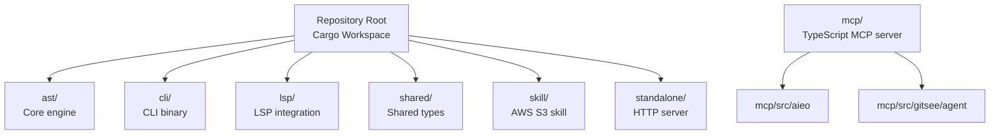
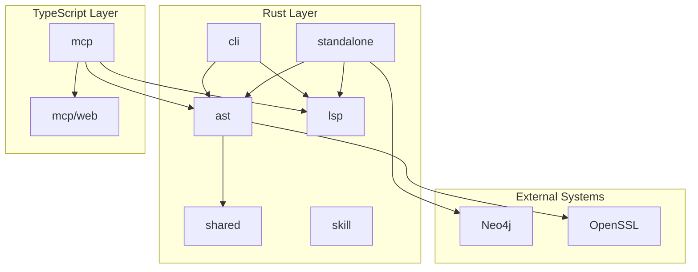
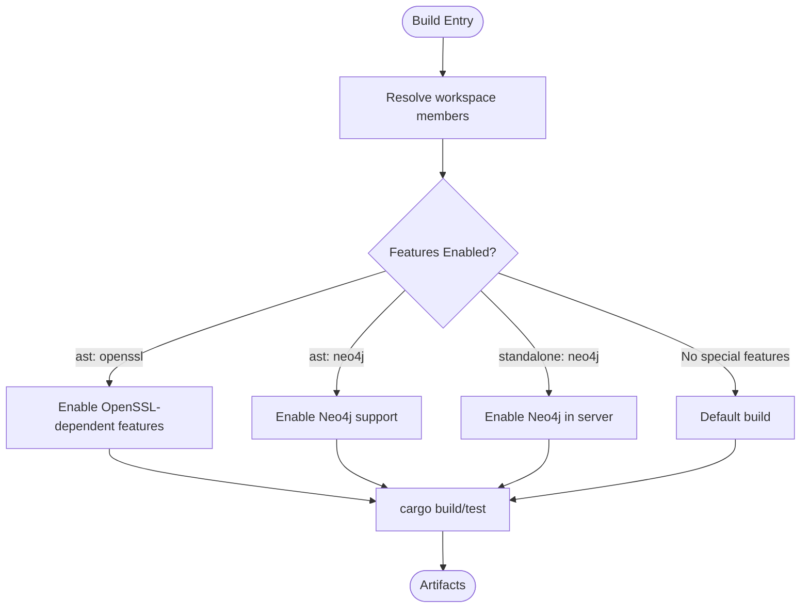
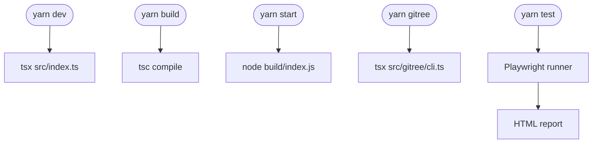
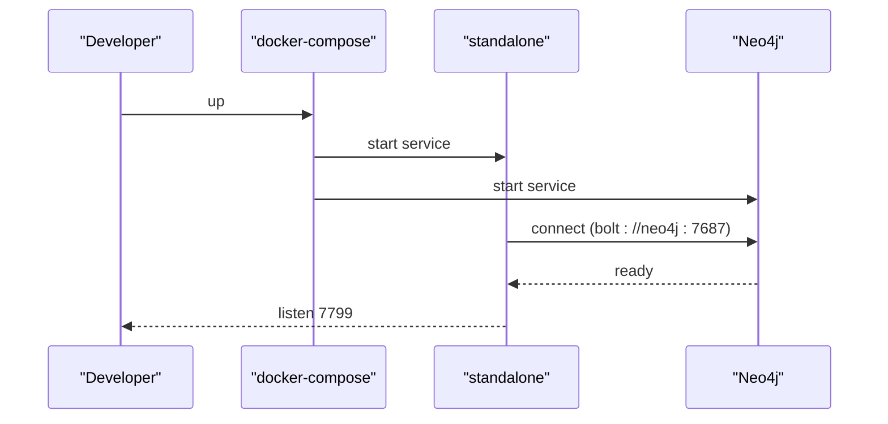
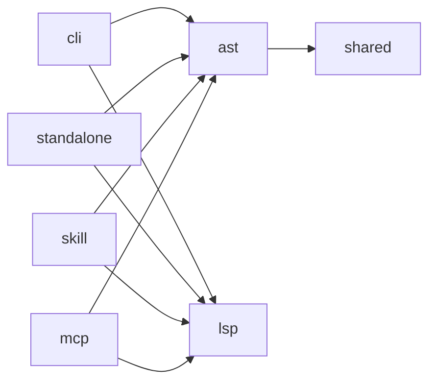
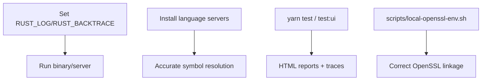
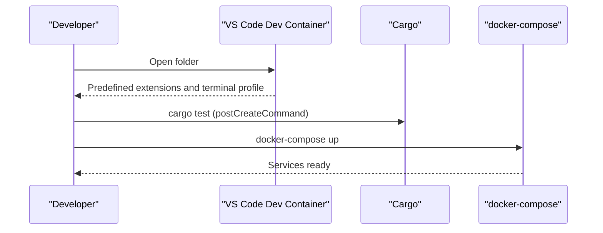

# Development Guide

<cite>
**Referenced Files in This Document**
- [README.md](file://README.md)
- [Cargo.toml](file://Cargo.toml)
- [.devcontainer/devcontainer.json](file://.devcontainer/devcontainer.json)
- [Cross.toml](file://Cross.toml)
- [install.sh](file://install.sh)
- [scripts/local-openssl-env.sh](file://scripts/local-openssl-env.sh)
- [docker-compose.yaml](file://docker-compose.yaml)
- [ast/Cargo.toml](file://ast/Cargo.toml)
- [cli/Cargo.toml](file://cli/Cargo.toml)
- [lsp/Cargo.toml](file://lsp/Cargo.toml)
- [shared/Cargo.toml](file://shared/Cargo.toml)
- [skill/Cargo.toml](file://skill/Cargo.toml)
- [standalone/Cargo.toml](file://standalone/Cargo.toml)
- [mcp/package.json](file://mcp/package.json)
- [mcp/tsconfig.json](file://mcp/tsconfig.json)
- [mcp/playwright.config.js](file://mcp/playwright.config.js)
</cite>

## Table of Contents
1. [Introduction](#introduction)
2. [Project Structure](#project-structure)
3. [Core Components](#core-components)
4. [Architecture Overview](#architecture-overview)
5. [Detailed Component Analysis](#detailed-component-analysis)
6. [Dependency Analysis](#dependency-analysis)
7. [Performance Considerations](#performance-considerations)
8. [Debugging and Profiling](#debugging-and-profiling)
9. [Contribution Guidelines](#contribution-guidelines)
10. [Development Workflows](#development-workflows)
11. [Adding New Language Support](#adding-new-language-support)
12. [Extending the MCP Server](#extending-the-mcp-server)
13. [Contributing to the Core Engine](#contributing-to-the-core-engine)
14. [Testing Requirements](#testing-requirements)
15. [Release Procedures](#release-procedures)
16. [Troubleshooting Guide](#troubleshooting-guide)
17. [Conclusion](#conclusion)

## Introduction
This guide explains how to set up a development environment for StakGraph, build and cross-compile the system, and contribute effectively. StakGraph consists of:
- A Rust core engine that parses code into a graph (ast)
- A CLI (cli) for parsing, summarizing, and change analysis
- An LSP integration (lsp) for precise symbol resolution
- A standalone HTTP server (standalone) backed by Neo4j
- A TypeScript MCP server (mcp) exposing tools and agents
- Shared types and utilities (shared)
- A skill binary (skill) for AWS S3 integration tasks

The repository supports a multi-language build system combining Rust (Cargo), TypeScript/Yarn, and Docker Compose for local orchestration.

## Project Structure
The repository is a Cargo workspace with multiple crates and a TypeScript monorepo. The top-level workspace manifest lists the members. The MCP server uses Yarn workspaces for internal packages.

**Diagram sources**
- [Cargo.toml:1-5](file://Cargo.toml#L1-L5)
- [mcp/package.json:7-15](file://mcp/package.json#L7-L15)

**Section sources**
- [Cargo.toml:1-5](file://Cargo.toml#L1-L5)
- [README.md:225-242](file://README.md#L225-L242)

## Core Components
- ast: The core engine that parses source files using Tree-sitter grammars and constructs a graph of nodes and edges. It optionally integrates with Neo4j and supports OpenSSL-dependent features.
- cli: A CLI binary that depends on ast and lsp to parse, summarize, and compute structural changes.
- lsp: Provides LSP integration for precise symbol resolution and cross-file call resolution.
- shared: Holds shared types and utilities used across crates.
- skill: A small binary integrating with AWS S3 for ingestion tasks.
- standalone: An HTTP server wrapping the ast crate, exposing endpoints backed by Neo4j.
- mcp: A TypeScript MCP server implementing tools, agents, vector search, and Git history analysis (gitree).

Key build and runtime characteristics:
- Rust workspace with per-crate Cargo manifests.
- TypeScript/Yarn workspace for MCP server with Playwright tests.
- Docker Compose for local Neo4j and server orchestration.

**Section sources**
- [ast/Cargo.toml:1-121](file://ast/Cargo.toml#L1-L121)
- [cli/Cargo.toml:1-27](file://cli/Cargo.toml#L1-L27)
- [lsp/Cargo.toml:1-20](file://lsp/Cargo.toml#L1-L20)
- [shared/Cargo.toml:1-23](file://shared/Cargo.toml#L1-L23)
- [skill/Cargo.toml:1-18](file://skill/Cargo.toml#L1-L18)
- [standalone/Cargo.toml:1-34](file://standalone/Cargo.toml#L1-L34)
- [mcp/package.json:1-102](file://mcp/package.json#L1-L102)

## Architecture Overview
High-level architecture and component interactions:

**Diagram sources**
- [Cargo.toml:1-5](file://Cargo.toml#L1-L5)
- [ast/Cargo.toml:13-76](file://ast/Cargo.toml#L13-L76)
- [standalone/Cargo.toml:6-30](file://standalone/Cargo.toml#L6-L30)
- [mcp/package.json:42-76](file://mcp/package.json#L42-L76)

## Detailed Component Analysis

### Rust Build System and Features
- Workspace layout: The root workspace includes ast, lsp, shared, skill, and standalone.
- Feature flags:
  - ast: openssl, neo4j, fulltest
  - standalone: neo4j, fulltest
- Cross-compilation targets configured for x86_64-unknown-linux-musl and aarch64-unknown-linux-musl with pre-build steps.

**Diagram sources**
- [ast/Cargo.toml:6-11](file://ast/Cargo.toml#L6-L11)
- [standalone/Cargo.toml:31-34](file://standalone/Cargo.toml#L31-L34)
- [Cross.toml:1-9](file://Cross.toml#L1-L9)

**Section sources**
- [Cargo.toml:1-5](file://Cargo.toml#L1-L5)
- [ast/Cargo.toml:6-11](file://ast/Cargo.toml#L6-L11)
- [standalone/Cargo.toml:31-34](file://standalone/Cargo.toml#L31-L34)
- [Cross.toml:1-9](file://Cross.toml#L1-L9)

### TypeScript/MCP Build and Testing
- Yarn workspace with internal packages under mcp/src/aieo and mcp/src/gitsee/agent.
- Scripts include dev, build, start, gitree, and Playwright test commands.
- Playwright configuration defines test discovery, parallelism, retries, and device projects.

**Diagram sources**
- [mcp/package.json:24-36](file://mcp/package.json#L24-L36)
- [mcp/playwright.config.js:8-45](file://mcp/playwright.config.js#L8-L45)

**Section sources**
- [mcp/package.json:1-102](file://mcp/package.json#L1-L102)
- [mcp/tsconfig.json:1-22](file://mcp/tsconfig.json#L1-L22)
- [mcp/playwright.config.js:1-46](file://mcp/playwright.config.js#L1-L46)

### Docker and Local Orchestration
- docker-compose brings up the standalone server and Neo4j with environment variables for credentials and logging.
- Health checks ensure Neo4j readiness before clients connect.

**Diagram sources**
- [docker-compose.yaml:1-51](file://docker-compose.yaml#L1-L51)

**Section sources**
- [docker-compose.yaml:1-51](file://docker-compose.yaml#L1-L51)

## Dependency Analysis
- Rust dependencies are declared per crate. Notable cross-crate dependencies include ast depending on lsp and shared, cli depending on ast and lsp, standalone depending on ast and lsp, and skill depending on ast and lsp.
- TypeScript dependencies include MCP SDKs, AI providers, Neo4j driver, and Playwright for testing.

**Diagram sources**
- [cli/Cargo.toml:12-16](file://cli/Cargo.toml#L12-L16)
- [standalone/Cargo.toml:7-9](file://standalone/Cargo.toml#L7-L9)
- [ast/Cargo.toml:13-16](file://ast/Cargo.toml#L13-L16)
- [skill/Cargo.toml:6-15](file://skill/Cargo.toml#L6-L15)
- [mcp/package.json:42-76](file://mcp/package.json#L42-L76)

**Section sources**
- [cli/Cargo.toml:12-16](file://cli/Cargo.toml#L12-L16)
- [standalone/Cargo.toml:7-9](file://standalone/Cargo.toml#L7-L9)
- [ast/Cargo.toml:13-16](file://ast/Cargo.toml#L13-L16)
- [skill/Cargo.toml:6-15](file://skill/Cargo.toml#L6-L15)
- [mcp/package.json:42-76](file://mcp/package.json#L42-L76)

## Performance Considerations
- Use release builds for performance-sensitive tasks:
  - Rust: cargo build --release
  - TypeScript: build with optimized settings and avoid dev overhead
- Enable Neo4j features and proper indexing for graph queries.
- Limit concurrent operations during ingestion and vector embedding.
- Use appropriate token budgets for summarization to reduce LLM overhead.

[No sources needed since this section provides general guidance]

## Debugging and Profiling
- Logging: Set RUST_LOG and RUST_BACKTRACE in environment variables for verbose logs and stack traces.
- LSP integration: Install language servers for TypeScript, Go, Rust, and Python as needed for accurate symbol resolution.
- MCP testing: Use Playwright with HTML reports and trace collection for UI-driven tests.
- OpenSSL linking: Use scripts/local-openssl-env.sh to ensure consistent OpenSSL linkage across platforms.

**Diagram sources**
- [docker-compose.yaml:10-16](file://docker-compose.yaml#L10-L16)
- [README.md:251-265](file://README.md#L251-L265)
- [mcp/playwright.config.js:24-34](file://mcp/playwright.config.js#L24-L34)
- [scripts/local-openssl-env.sh:148-150](file://scripts/local-openssl-env.sh#L148-L150)

**Section sources**
- [docker-compose.yaml:10-16](file://docker-compose.yaml#L10-L16)
- [README.md:251-265](file://README.md#L251-L265)
- [mcp/playwright.config.js:1-46](file://mcp/playwright.config.js#L1-L46)
- [scripts/local-openssl-env.sh:148-150](file://scripts/local-openssl-env.sh#L148-L150)

## Contribution Guidelines
- Run tests locally: cargo test and cargo test -p <crate-name>
- Optional LSP-enabled tests: USE_LSP=1 cargo test
- Install language servers for accurate parsing and symbol resolution
- Follow existing code style and keep changes scoped to a single concern

**Section sources**
- [README.md:244-267](file://README.md#L244-L267)

## Development Workflows
- Dev containers: Use the provided devcontainer configuration to spin up a preconfigured environment with extensions and a post-create command that runs tests.
- Local orchestration: docker-compose up to start the server and Neo4j.
- Cross-compilation: Configure targets in Cross.toml and use cargo-xbuild or similar tooling as needed.

**Diagram sources**
- [.devcontainer/devcontainer.json:1-19](file://.devcontainer/devcontainer.json#L1-L19)
- [docker-compose.yaml:1-51](file://docker-compose.yaml#L1-L51)

**Section sources**
- [.devcontainer/devcontainer.json:1-19](file://.devcontainer/devcontainer.json#L1-L19)
- [docker-compose.yaml:1-51](file://docker-compose.yaml#L1-L51)

## Adding New Language Support
- Add Tree-sitter grammar dependencies in ast/Cargo.toml under dependencies.
- Implement language-specific parsing and query logic under ast/src/lang/queries/<language>.
- Extend the linker and ASG construction to handle new node types and edges.
- Add CLI and MCP tooling to surface new capabilities.
- Update tests under ast/examples and relevant testing suites.

[No sources needed since this section provides general guidance]

## Extending the MCP Server
- Internal packages: Add new tooling under mcp/src/tools or agents under mcp/src/repo/agents.
- Web UI: Extend mcp/web with new components and integrate with existing stores and hooks.
- Testing: Add Playwright tests under mcp/src for new flows.
- Build and packaging: Update mcp/package.json scripts and tsconfig.json as needed.

**Section sources**
- [mcp/package.json:1-102](file://mcp/package.json#L1-L102)
- [mcp/tsconfig.json:1-22](file://mcp/tsconfig.json#L1-L22)
- [mcp/playwright.config.js:1-46](file://mcp/playwright.config.js#L1-L46)

## Contributing to the Core Engine
- Modify ast/src to add new node types, edges, or graph operations.
- Add or update Tree-sitter queries in ast/src/lang/queries.
- Keep changes backward compatible and add tests under ast/examples.
- Rebuild and test with cargo test and cargo test -p ast.

**Section sources**
- [ast/Cargo.toml:1-121](file://ast/Cargo.toml#L1-L121)

## Testing Requirements
- Rust: cargo test for unit and integration tests; cargo test -p <crate> for targeted crates.
- LSP-enabled tests: USE_LSP=1 cargo test.
- TypeScript: yarn test for Playwright tests; yarn test:ui for interactive mode; yarn test:debug for debugging.
- MCP tests: Use Playwright projects and HTML reports.

**Section sources**
- [README.md:244-249](file://README.md#L244-L249)
- [mcp/playwright.config.js:1-46](file://mcp/playwright.config.js#L1-L46)

## Release Procedures
- Cross-compile artifacts for supported platforms using Cross.toml targets.
- Publish binaries via GitHub Releases and update install.sh to download the correct assets.
- Ensure OpenSSL linkage is consistent across platforms using scripts/local-openssl-env.sh when building on non-standard environments.

**Section sources**
- [Cross.toml:1-9](file://Cross.toml#L1-L9)
- [install.sh:1-94](file://install.sh#L1-L94)
- [scripts/local-openssl-env.sh:148-150](file://scripts/local-openssl-env.sh#L148-L150)

## Troubleshooting Guide
- OpenSSL linking failures: Source scripts/local-openssl-env.sh to export OPENSSL_DIR, PKG_CONFIG_PATH, and LD_LIBRARY_PATH.
- LSP not working: Install language servers for TypeScript, Go, Rust, and Python as documented.
- Neo4j connectivity: Verify NEO4J_URI, NEO4J_USER, and NEO4J_PASSWORD in docker-compose.yaml.
- TypeScript build issues: Ensure tsconfig.json matches module resolution and target settings.

**Section sources**
- [scripts/local-openssl-env.sh:148-150](file://scripts/local-openssl-env.sh#L148-L150)
- [README.md:251-265](file://README.md#L251-L265)
- [docker-compose.yaml:10-16](file://docker-compose.yaml#L10-L16)
- [mcp/tsconfig.json:1-22](file://mcp/tsconfig.json#L1-22)

## Conclusion
This guide outlined the StakGraph development environment, build system, and contribution workflows across Rust and TypeScript. By leveraging devcontainers, cross-compilation, and Docker orchestration, contributors can reliably build, test, and extend StakGraph’s core engine, MCP server, and HTTP server.