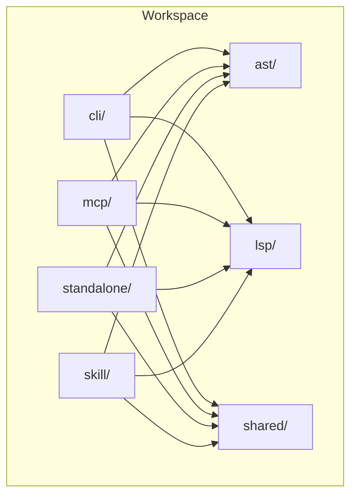
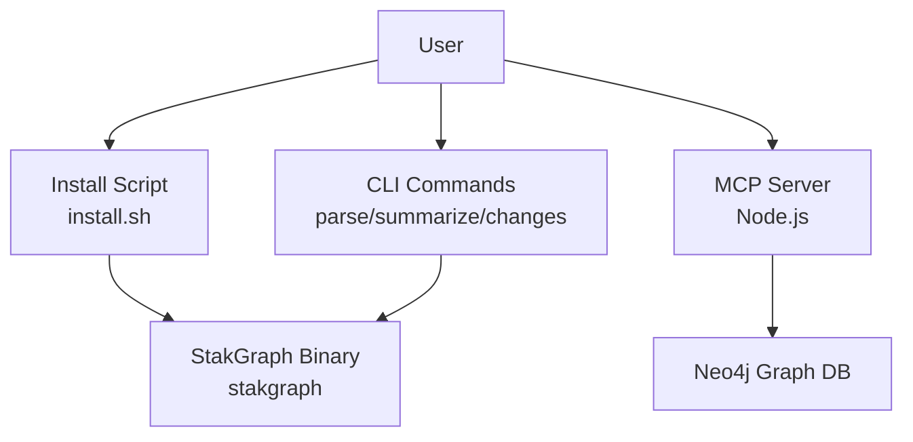
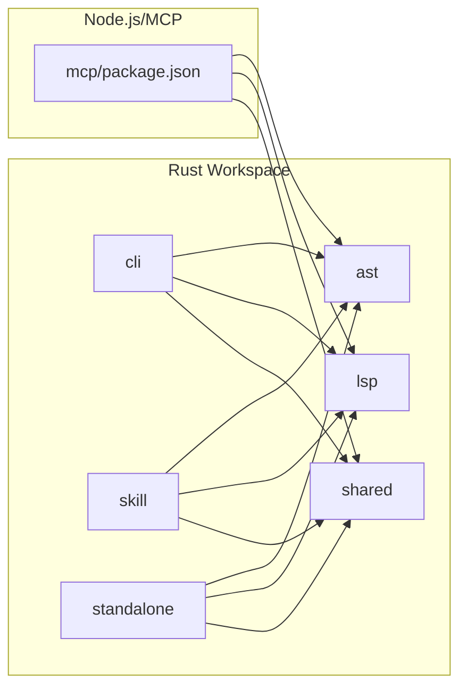

# Getting Started

<cite>
**Referenced Files in This Document**
- [install.sh](file://install.sh)
- [README.md](file://README.md)
- [.devcontainer/devcontainer.json](file://.devcontainer/devcontainer.json)
- [Cargo.toml](file://Cargo.toml)
- [Cross.toml](file://Cross.toml)
- [cli/Cargo.toml](file://cli/Cargo.toml)
- [mcp/package.json](file://mcp/package.json)
- [mcp/Dockerfile](file://mcp/Dockerfile)
- [mcp/docker-compose.yaml](file://mcp/docker-compose.yaml)
- [standalone/docker-compose.yaml](file://standalone/docker-compose.yaml)
</cite>

## Table of Contents
1. [Introduction](#introduction)
2. [Project Structure](#project-structure)
3. [Core Components](#core-components)
4. [Architecture Overview](#architecture-overview)
5. [Detailed Component Analysis](#detailed-component-analysis)
6. [Dependency Analysis](#dependency-analysis)
7. [Performance Considerations](#performance-considerations)
8. [Troubleshooting Guide](#troubleshooting-guide)
9. [Conclusion](#conclusion)
10. [Appendices](#appendices)

## Introduction
This guide helps you install and use StakGraph quickly on Linux, macOS, and Windows, and run the MCP server locally. You will:
- Install the StakGraph CLI using the provided install script
- Verify the installation and run your first parse
- Start the MCP server and connect an editor that supports the Model Context Protocol (MCP)
- Optionally run the Neo4j-backed graph server using Docker
- Set up a development environment using the included devcontainer

## Project Structure
StakGraph is a multi-crate Rust workspace with supporting TypeScript/Node.js tooling for the MCP server and optional Neo4j graph server.

**Diagram sources**
- [Cargo.toml:1-5](file://Cargo.toml#L1-L5)
- [cli/Cargo.toml:12-26](file://cli/Cargo.toml#L12-L26)

**Section sources**
- [Cargo.toml:1-5](file://Cargo.toml#L1-L5)

## Core Components
- StakGraph CLI: Parses files or directories, summarizes projects, tracks structural changes, and prints structured summaries.
- MCP Server: Exposes StakGraph tools to editors via the Model Context Protocol (MCP), including search, mapping, and autonomous exploration.
- Graph Server (Neo4j): Optional HTTP server that indexes repositories into Neo4j for querying and visualization.

Key prerequisites:
- Rust toolchain for building and running the CLI and servers
- Node.js for the MCP server
- Docker for running Neo4j and the graph server

**Section sources**
- [README.md:23-27](file://README.md#L23-L27)
- [README.md:140-175](file://README.md#L140-L175)
- [README.md:178-222](file://README.md#L178-L222)

## Architecture Overview
High-level architecture and data flow for installation and first run.

**Diagram sources**
- [install.sh:1-94](file://install.sh#L1-L94)
- [README.md:31-83](file://README.md#L31-L83)
- [README.md:140-175](file://README.md#L140-L175)
- [mcp/docker-compose.yaml:20-52](file://mcp/docker-compose.yaml#L20-L52)

## Detailed Component Analysis

### Install StakGraph CLI
Supported platforms: Linux (x86_64, aarch64), macOS (Intel, Apple Silicon), Windows.

Prerequisites:
- curl available on PATH
- Bash shell on Unix-like systems

Installation steps:
1. Run the install script from the repository root.
2. The script detects OS and architecture, downloads the appropriate prebuilt binary, and installs it to the configured directory.
3. Add the install directory to your PATH if not already present.

Verification:
- Run the CLI help or a simple parse to confirm installation.

Notes:
- The install script supports overriding the target version and install directory via environment variables.
- On Windows, the script installs a .exe binary.

**Section sources**
- [install.sh:15-19](file://install.sh#L15-L19)
- [install.sh:26-47](file://install.sh#L26-L47)
- [install.sh:49-68](file://install.sh#L49-L68)
- [install.sh:70-85](file://install.sh#L70-L85)
- [install.sh:89-94](file://install.sh#L89-L94)
- [README.md:23-27](file://README.md#L23-L27)

### First-Time CLI Usage
Basic commands:
- Parse a single file to see extracted nodes and edges
- Summarize a project within a token budget
- Track structural changes across commits

Example commands:
- Parse a file
- Summarize a directory with a token limit
- Show recent changes across commits

Output highlights:
- Extracted entities: functions, endpoints, data models, classes, traits, tests, imports
- Edges: calls, handler, contains, operand, implements, parent-of
- Visual indicators for relationships

**Section sources**
- [README.md:31-83](file://README.md#L31-L83)

### Running the MCP Server
Requirements:
- Node.js runtime
- Yarn package manager
- Docker (optional, for containerized deployment)

Quick start:
- Build the MCP server locally
- Start the server
- Connect an MCP-compatible editor

Dockerized deployment:
- Use the provided Dockerfile and docker-compose to build and run the MCP server with Neo4j
- The Dockerfile installs the StakGraph CLI inside the container and prepares dependencies

**Section sources**
- [mcp/package.json:24-36](file://mcp/package.json#L24-L36)
- [mcp/Dockerfile:1-99](file://mcp/Dockerfile#L1-L99)
- [mcp/docker-compose.yaml:1-53](file://mcp/docker-compose.yaml#L1-L53)

### Running the Graph Server (Neo4j-backed)
Requirements:
- Docker and docker-compose

Quick start:
- Bring up the stack with docker-compose
- Access Neo4j browser and Bolt at the exposed ports
- Use the HTTP endpoints to ingest and query the graph

Endpoints overview:
- Process repositories
- Embed code
- Search (fulltext/vector)
- Map relationships
- Shortest path
- Test coverage
- Asynchronous ingestion

**Section sources**
- [README.md:178-222](file://README.md#L178-L222)
- [standalone/docker-compose.yaml:1-54](file://standalone/docker-compose.yaml#L1-L54)

### Development Environment Setup (Devcontainer)
Use the included devcontainer configuration to spin up a ready-to-code environment with:
- Prebuilt image
- VS Code extensions for Rust and C++
- Post-create command to run tests
- Root user access

Steps:
- Open the repository in VS Code with Dev Containers extension
- Reopen in Container
- The workspace will build and run tests automatically

**Section sources**
- [.devcontainer/devcontainer.json:1-19](file://.devcontainer/devcontainer.json#L1-L19)

## Dependency Analysis
Build and runtime dependencies across components.

**Diagram sources**
- [Cargo.toml:1-5](file://Cargo.toml#L1-L5)
- [cli/Cargo.toml:12-26](file://cli/Cargo.toml#L12-L26)
- [mcp/package.json:42-76](file://mcp/package.json#L42-L76)

**Section sources**
- [Cargo.toml:1-5](file://Cargo.toml#L1-L5)
- [cli/Cargo.toml:12-26](file://cli/Cargo.toml#L12-L26)
- [mcp/package.json:42-76](file://mcp/package.json#L42-L76)

## Performance Considerations
- The CLI uses in-memory graphs for speed and minimal dependencies.
- Vector search relies on fastembed models; model downloads are handled in the Dockerfile for supported architectures.
- Neo4j-backed server enables scalable querying and graph operations.

[No sources needed since this section provides general guidance]

## Troubleshooting Guide
Common issues and resolutions:
- Install script fails due to missing curl
  - Ensure curl is installed and available on PATH.
- Binary not found after install
  - Confirm the install directory is on PATH and reload your shell.
- MCP server fails to start
  - Ensure Node.js and Yarn are installed and dependencies are built.
- Docker compose cannot pull images
  - Check network connectivity and Docker daemon status.
- Neo4j health checks failing
  - Verify credentials and ports; ensure volumes are writable.

**Section sources**
- [install.sh:15-19](file://install.sh#L15-L19)
- [install.sh:89-94](file://install.sh#L89-L94)
- [mcp/Dockerfile:33-37](file://mcp/Dockerfile#L33-L37)
- [mcp/docker-compose.yaml:39-52](file://mcp/docker-compose.yaml#L39-L52)
- [standalone/docker-compose.yaml:23-36](file://standalone/docker-compose.yaml#L23-L36)

## Conclusion
You now have the essentials to install StakGraph, parse your first file, run the MCP server, and optionally deploy the Neo4j-backed graph server. Use the devcontainer for a streamlined development experience.

[No sources needed since this section summarizes without analyzing specific files]

## Appendices

### Appendix A: Platform Support Matrix
- Linux: x86_64, aarch64
- macOS: Intel, Apple Silicon
- Windows: x86_64 (MSVC)

**Section sources**
- [install.sh:26-47](file://install.sh#L26-L47)

### Appendix B: Build Prerequisites
- Rust toolchain for building and testing
- Cross-compilation support for musl targets
- Node.js and Yarn for MCP server

**Section sources**
- [Cross.toml:1-9](file://Cross.toml#L1-L9)
- [mcp/package.json:77-96](file://mcp/package.json#L77-L96)