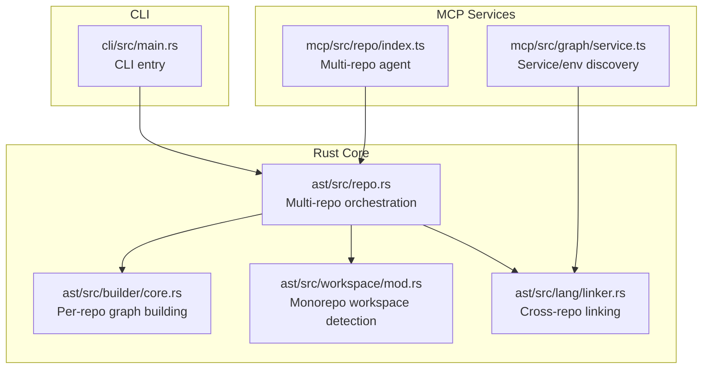
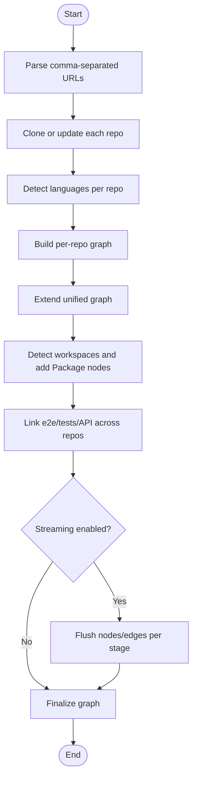
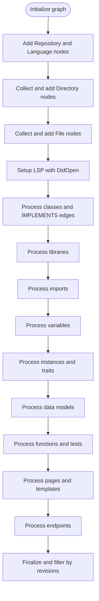
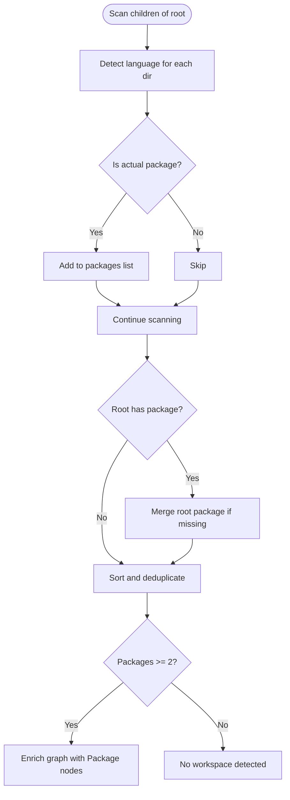
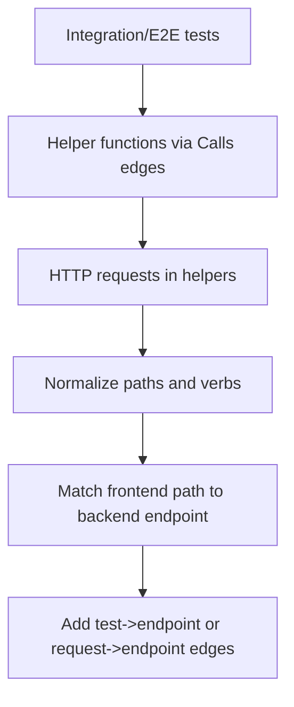
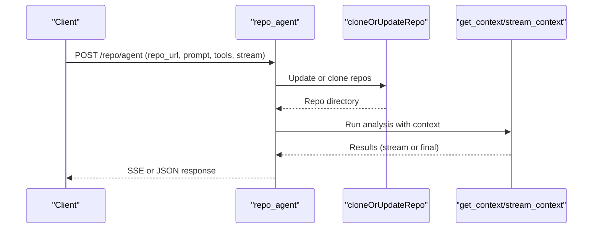
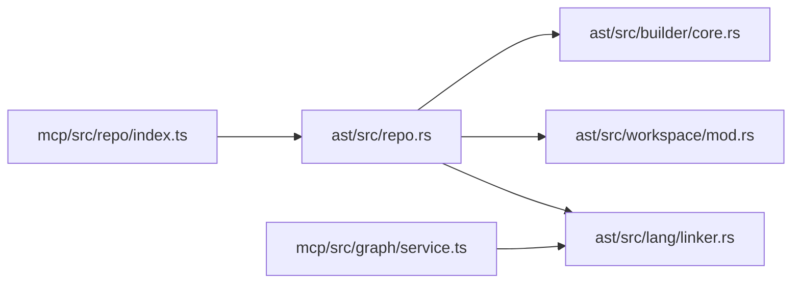

# Cross-Repository Relationship Mapping

<cite>
**Referenced Files in This Document**
- [repo.rs](file://ast/src/repo.rs)
- [mod.rs (workspace)](file://ast/src/workspace/mod.rs)
- [core.rs (builder)](file://ast/src/builder/core.rs)
- [linker.rs](file://ast/src/lang/linker.rs)
- [index.ts (repo agent)](file://mcp/src/repo/index.ts)
- [service.ts (graph service)](file://mcp/src/graph/service.ts)
- [main.rs (CLI)](file://cli/src/main.rs)
</cite>

## Table of Contents
1. [Introduction](#introduction)
2. [Project Structure](#project-structure)
3. [Core Components](#core-components)
4. [Architecture Overview](#architecture-overview)
5. [Detailed Component Analysis](#detailed-component-analysis)
6. [Dependency Analysis](#dependency-analysis)
7. [Performance Considerations](#performance-considerations)
8. [Troubleshooting Guide](#troubleshooting-guide)
9. [Conclusion](#conclusion)
10. [Appendices](#appendices)

## Introduction
This document explains StakGraph’s cross-repository relationship mapping capabilities. It covers how the platform simultaneously analyzes multiple repositories to discover relationships, dependencies, and architectural patterns across codebases. It documents multi-repo graph construction, workspace detection for monorepos and multi-repo projects, and the technical challenges of scaling graph construction across repositories with memory management, parallel processing, and incremental updates. Practical workflows, configuration options, and integration patterns for distributed development environments are included, along with performance optimization strategies and best practices for maintaining accurate relationship mappings.

## Project Structure
StakGraph comprises:
- Rust-based AST and graph builder for parsing and constructing per-repository graphs
- Linking logic to connect entities across repositories
- Workspace detection for monorepo and multi-package scenarios
- JavaScript/TypeScript MCP services for agent-driven exploration and multi-repo orchestration
- CLI entry points for command-line workflows



**Diagram sources**
- [repo.rs:70-195](file://ast/src/repo.rs#L70-L195)
- [core.rs (builder):30-228](file://ast/src/builder/core.rs#L30-L228)
- [mod.rs (workspace):94-112](file://ast/src/workspace/mod.rs#L94-L112)
- [linker.rs:34-140](file://ast/src/lang/linker.rs#L34-L140)
- [index.ts (repo agent):80-253](file://mcp/src/repo/index.ts#L80-L253)
- [service.ts (graph service):145-175](file://mcp/src/graph/service.ts#L145-L175)
- [main.rs (CLI):52-69](file://cli/src/main.rs#L52-L69)

**Section sources**
- [repo.rs:70-195](file://ast/src/repo.rs#L70-L195)
- [core.rs (builder):30-228](file://ast/src/builder/core.rs#L30-L228)
- [mod.rs (workspace):94-112](file://ast/src/workspace/mod.rs#L94-L112)
- [linker.rs:34-140](file://ast/src/lang/linker.rs#L34-L140)
- [index.ts (repo agent):80-253](file://mcp/src/repo/index.ts#L80-L253)
- [service.ts (graph service):145-175](file://mcp/src/graph/service.ts#L145-L175)
- [main.rs (CLI):52-69](file://cli/src/main.rs#L52-L69)

## Core Components
- Multi-repo orchestration and graph assembly: Builds individual repository graphs and merges them into a unified graph, adding workspace metadata and performing cross-repo linking.
- Per-repository graph building: Adds repository and language nodes, directories, files, classes, functions, endpoints, and other constructs, then links intra-repo relationships.
- Workspace detection: Identifies monorepo packages and adds Package nodes linked to Directory and Language nodes.
- Cross-repo linking: Links tests to pages/endpoints, integration/e2e flows, and API request-to-endpoint mappings across repositories.
- Agent-driven multi-repo exploration: Provides endpoints to clone/update multiple repositories and run contextual analysis with streaming or evented responses.

**Section sources**
- [repo.rs:70-195](file://ast/src/repo.rs#L70-L195)
- [core.rs (builder):30-228](file://ast/src/builder/core.rs#L30-L228)
- [mod.rs (workspace):94-112](file://ast/src/workspace/mod.rs#L94-L112)
- [linker.rs:34-140](file://ast/src/lang/linker.rs#L34-L140)
- [index.ts (repo agent):80-253](file://mcp/src/repo/index.ts#L80-L253)

## Architecture Overview
The system integrates multiple repositories into a single graph with the following stages:
- Repository cloning and detection
- Per-repository graph construction
- Workspace metadata enrichment
- Cross-repo linking
- Optional streaming upload to a graph database

```mermaid
sequenceDiagram
participant CLI as "CLI"
participant Agent as "MCP Repo Agent"
participant Repo as "ast/src/repo.rs"
participant Builder as "ast/src/builder/core.rs"
participant Link as "ast/src/lang/linker.rs"
CLI->>Agent : POST /repo/agent with repo URLs
Agent->>Repo : cloneOrUpdateRepo(urls)
Agent->>Repo : build_graphs_inner_impl(streaming?)
Repo->>Builder : build_graph_inner_with_streaming()
Builder-->>Repo : BTreeMapGraph (per-repo)
Repo->>Repo : extend_graph(per-repo graphs)
Repo->>Link : link_e2e_tests(), link_api_nodes()
Link-->>Repo : Updated graph with cross-repo edges
Repo-->>Agent : Unified graph (nodes/edges)
Agent-->>CLI : Streaming or SSE response
```

**Diagram sources**
- [index.ts (repo agent):80-253](file://mcp/src/repo/index.ts#L80-L253)
- [repo.rs:103-194](file://ast/src/repo.rs#L103-L194)
- [core.rs (builder):46-228](file://ast/src/builder/core.rs#L46-L228)
- [linker.rs:34-140](file://ast/src/lang/linker.rs#L34-L140)

## Detailed Component Analysis

### Multi-Repository Graph Construction
- Cloning and detection: Supports comma-separated repository URLs, optional credentials, branch/commit selection, and revision lists per repository. Detects languages and sets up LSP per repository.
- Graph assembly: Iterates repositories, builds per-repo graphs, extends a unified graph, and optionally streams intermediate nodes/edges to a graph database.
- Workspace enrichment: After building, detects workspaces and adds Package nodes linked to Repository, Language, and Directory nodes.



**Diagram sources**
- [repo.rs:298-355](file://ast/src/repo.rs#L298-L355)
- [repo.rs:103-194](file://ast/src/repo.rs#L103-L194)
- [mod.rs (workspace):94-112](file://ast/src/workspace/mod.rs#L94-L112)
- [linker.rs:34-140](file://ast/src/lang/linker.rs#L34-L140)

**Section sources**
- [repo.rs:298-355](file://ast/src/repo.rs#L298-L355)
- [repo.rs:103-194](file://ast/src/repo.rs#L103-L194)
- [mod.rs (workspace):94-112](file://ast/src/workspace/mod.rs#L94-L112)

### Per-Repository Graph Building
- Repository and language nodes: Adds Repository and Language nodes, linking them together.
- Directories and files: Adds Directory nodes with parent relationships and File nodes.
- Parsing and LSP: Processes classes, libraries, imports, variables, instances, traits, data models, functions, pages/templates, and endpoints.
- Finalization: Applies revision filters and reports statistics.



**Diagram sources**
- [core.rs (builder):376-445](file://ast/src/builder/core.rs#L376-L445)
- [core.rs (builder):232-289](file://ast/src/builder/core.rs#L232-L289)
- [core.rs (builder):291-348](file://ast/src/builder/core.rs#L291-L348)
- [core.rs (builder):446-505](file://ast/src/builder/core.rs#L446-L505)
- [core.rs (builder):506-567](file://ast/src/builder/core.rs#L506-L567)

**Section sources**
- [core.rs (builder):376-445](file://ast/src/builder/core.rs#L376-L445)
- [core.rs (builder):232-289](file://ast/src/builder/core.rs#L232-L289)
- [core.rs (builder):291-348](file://ast/src/builder/core.rs#L291-L348)
- [core.rs (builder):446-505](file://ast/src/builder/core.rs#L446-L505)
- [core.rs (builder):506-567](file://ast/src/builder/core.rs#L506-L567)

### Workspace Detection and Monorepo Management
- Scans child directories up to a depth limit, detects language-specific package markers, and identifies actual packages (excluding workspaces).
- Groups detected packages by language and can add a root package if not already present.
- Adds Package nodes and links them to Repository, Language, and Directory nodes.



**Diagram sources**
- [mod.rs (workspace):114-139](file://ast/src/workspace/mod.rs#L114-L139)
- [mod.rs (workspace):141-153](file://ast/src/workspace/mod.rs#L141-L153)
- [mod.rs (workspace):94-112](file://ast/src/workspace/mod.rs#L94-L112)
- [repo.rs:197-249](file://ast/src/repo.rs#L197-L249)

**Section sources**
- [mod.rs (workspace):94-112](file://ast/src/workspace/mod.rs#L94-L112)
- [mod.rs (workspace):114-139](file://ast/src/workspace/mod.rs#L114-L139)
- [mod.rs (workspace):141-153](file://ast/src/workspace/mod.rs#L141-L153)
- [repo.rs:197-249](file://ast/src/repo.rs#L197-L249)

### Cross-Repository Linking
- Integration tests to endpoints: Matches test bodies to endpoint names and HTTP verbs, supporting both direct and indirect links via helper functions.
- E2E tests to pages: Links E2E tests to page nodes by name matching.
- API nodes: Normalizes frontend and backend paths and verbs to create Request-to-Endpoint edges.



**Diagram sources**
- [linker.rs:34-140](file://ast/src/lang/linker.rs#L34-L140)
- [linker.rs:213-235](file://ast/src/lang/linker.rs#L213-L235)
- [linker.rs:243-282](file://ast/src/lang/linker.rs#L243-L282)
- [linker.rs:362-396](file://ast/src/lang/linker.rs#L362-L396)
- [linker.rs:398-463](file://ast/src/lang/linker.rs#L398-L463)
- [linker.rs:474-499](file://ast/src/lang/linker.rs#L474-L499)

**Section sources**
- [linker.rs:34-140](file://ast/src/lang/linker.rs#L34-L140)
- [linker.rs:213-235](file://ast/src/lang/linker.rs#L213-L235)
- [linker.rs:243-282](file://ast/src/lang/linker.rs#L243-L282)
- [linker.rs:362-396](file://ast/src/lang/linker.rs#L362-L396)
- [linker.rs:398-463](file://ast/src/lang/linker.rs#L398-L463)
- [linker.rs:474-499](file://ast/src/lang/linker.rs#L474-L499)

### Agent-Based Multi-Repository Exploration
- Accepts multiple repository URLs, clones or updates them, and runs contextual analysis with optional streaming responses.
- Supports tools configuration, session management, and event streaming via SSE.



**Diagram sources**
- [index.ts (repo agent):80-253](file://mcp/src/repo/index.ts#L80-L253)

**Section sources**
- [index.ts (repo agent):80-253](file://mcp/src/repo/index.ts#L80-L253)

## Dependency Analysis
- Rust core depends on:
  - Language-specific parsers and queries for AST extraction
  - Workspace detection for monorepo support
  - Linker module for cross-repo relationships
- MCP services depend on:
  - Repo agent for orchestrating multi-repo workflows
  - Graph service for service/environment discovery from parsed graphs



**Diagram sources**
- [repo.rs:70-195](file://ast/src/repo.rs#L70-L195)
- [core.rs (builder):30-228](file://ast/src/builder/core.rs#L30-L228)
- [mod.rs (workspace):94-112](file://ast/src/workspace/mod.rs#L94-L112)
- [linker.rs:34-140](file://ast/src/lang/linker.rs#L34-L140)
- [index.ts (repo agent):80-253](file://mcp/src/repo/index.ts#L80-L253)
- [service.ts (graph service):145-175](file://mcp/src/graph/service.ts#L145-L175)

**Section sources**
- [repo.rs:70-195](file://ast/src/repo.rs#L70-L195)
- [core.rs (builder):30-228](file://ast/src/builder/core.rs#L30-L228)
- [mod.rs (workspace):94-112](file://ast/src/workspace/mod.rs#L94-L112)
- [linker.rs:34-140](file://ast/src/lang/linker.rs#L34-L140)
- [index.ts (repo agent):80-253](file://mcp/src/repo/index.ts#L80-L253)
- [service.ts (graph service):145-175](file://mcp/src/graph/service.ts#L145-L175)

## Performance Considerations
- Memory management
  - Logs RSS before and after major stages to track growth during multi-repo ingestion.
  - Uses streaming upload contexts to flush nodes/edges incrementally when enabled.
- Parallel processing
  - Per-repository graph building is performed sequentially in the current implementation; parallelization could reduce total runtime for many repositories.
- Incremental updates
  - Supports revision filtering to limit analysis to specific commits.
  - Streaming upload allows partial graph availability during long builds.
- Scalability
  - Large files are skipped based on size limits.
  - Binary and junk directories are excluded to reduce IO overhead.

**Section sources**
- [repo.rs:111-112](file://ast/src/repo.rs#L111-L112)
- [repo.rs:182-191](file://ast/src/repo.rs#L182-L191)
- [core.rs (builder):310-327](file://ast/src/builder/core.rs#L310-L327)
- [core.rs (builder):66-98](file://ast/src/builder/core.rs#L66-L98)

## Troubleshooting Guide
- Validation errors
  - Number of revisions must be a multiple of the number of repositories when provided.
  - No supported language detected if package files or indicators are missing.
- Logging and observability
  - CLI initializes logging with configurable verbosity/performance flags.
  - Agent endpoints expose streaming and evented responses for long-running tasks.
- Common issues
  - Broken pipe errors are handled gracefully by exiting silently.
  - Streaming failures are caught and reported with appropriate status codes.

**Section sources**
- [repo.rs:312-319](file://ast/src/repo.rs#L312-L319)
- [repo.rs:463-473](file://ast/src/repo.rs#L463-L473)
- [main.rs (CLI):21-32](file://cli/src/main.rs#L21-L32)
- [index.ts (repo agent):103-175](file://mcp/src/repo/index.ts#L103-L175)
- [index.ts (repo agent):177-253](file://mcp/src/repo/index.ts#L177-L253)

## Conclusion
StakGraph’s cross-repository relationship mapping combines robust per-repository graph construction with intelligent workspace detection and cross-repo linking. The system supports multi-repo ingestion, monorepo-aware Package nodes, and flexible streaming uploads. By leveraging revision filtering, memory logging, and evented responses, it scales to large-scale multi-repo environments while maintaining accurate and actionable relationship mappings.

## Appendices

### Practical Workflows
- Multi-repo analysis via MCP agent
  - Provide comma-separated repository URLs, optional credentials, and a prompt.
  - Choose streaming mode for real-time updates or non-streaming for evented completion.
- CLI-based ingestion
  - Use CLI commands to parse and summarize repositories, with verbose/perf logging toggles.

**Section sources**
- [index.ts (repo agent):80-253](file://mcp/src/repo/index.ts#L80-L253)
- [main.rs (CLI):52-69](file://cli/src/main.rs#L52-L69)

### Configuration Options
- Repository collection
  - Supported via language-specific extensions and package files; configurable include/skip patterns.
- Workspace detection
  - Detects packages by language markers and excludes workspaces; groups by language for Package nodes.
- Linking rules
  - Test-to-endpoint, test-to-page, and Request-to-Endpoint linking with path/verb normalization.

**Section sources**
- [core.rs (builder):570-596](file://ast/src/builder/core.rs#L570-L596)
- [mod.rs (workspace):94-112](file://ast/src/workspace/mod.rs#L94-L112)
- [linker.rs:362-396](file://ast/src/lang/linker.rs#L362-L396)

### Integration Patterns
- Distributed development environments
  - Use agent endpoints to clone or update repositories and run contextual analysis.
  - Leverage evented SSE for progress tracking and secure token-based access when configured.

**Section sources**
- [index.ts (repo agent):177-253](file://mcp/src/repo/index.ts#L177-L253)