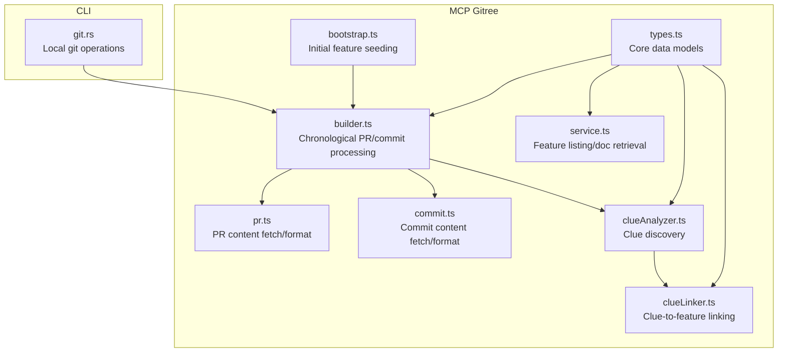
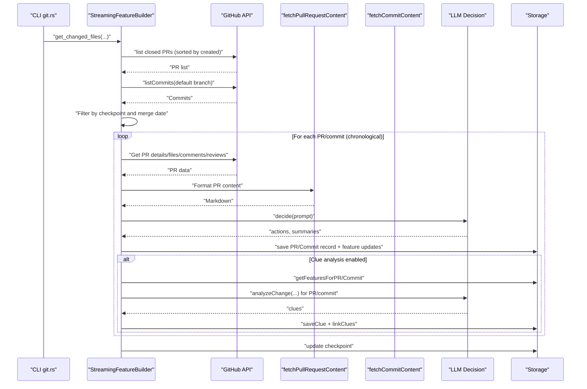
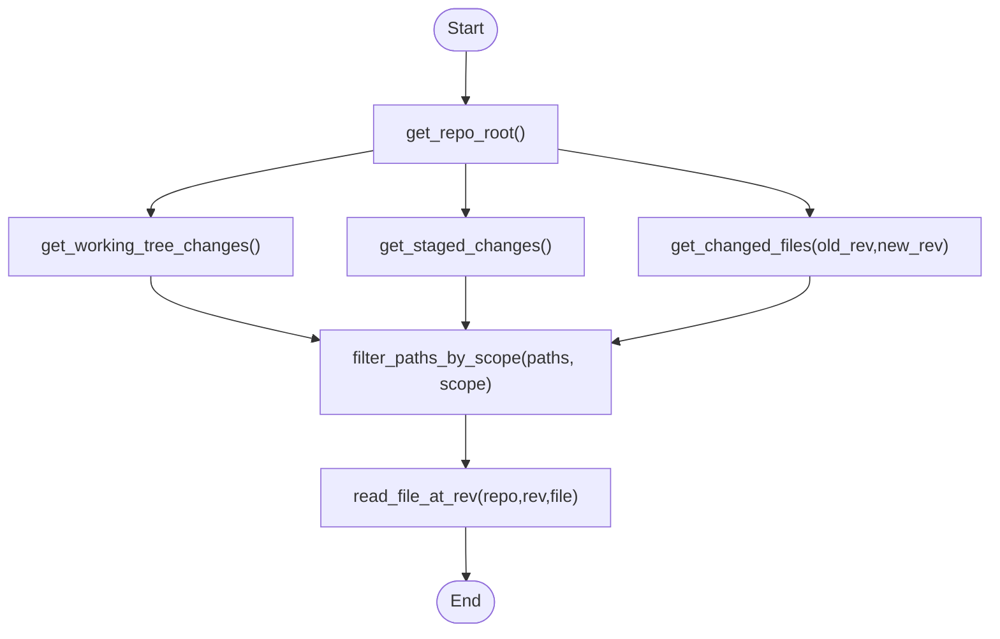
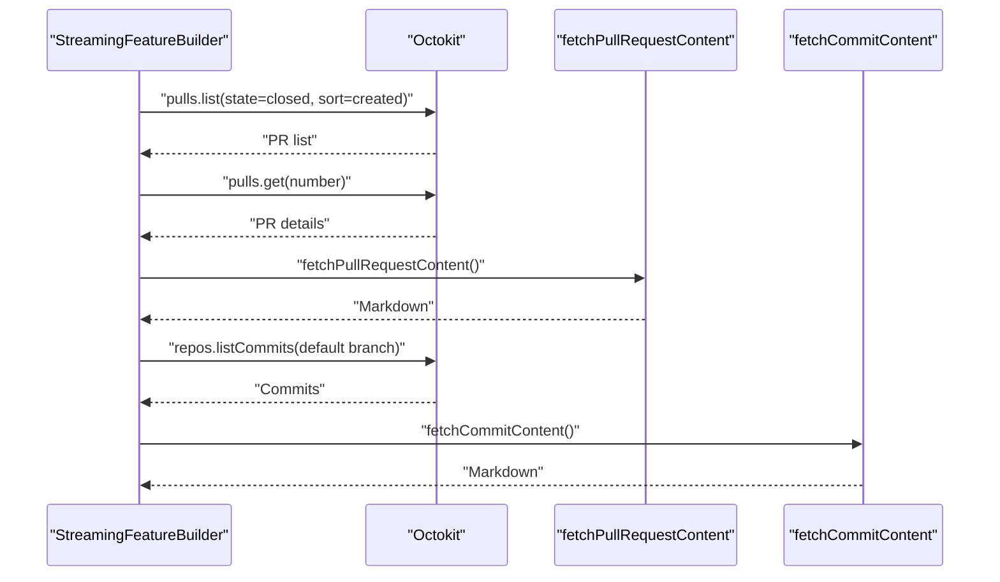
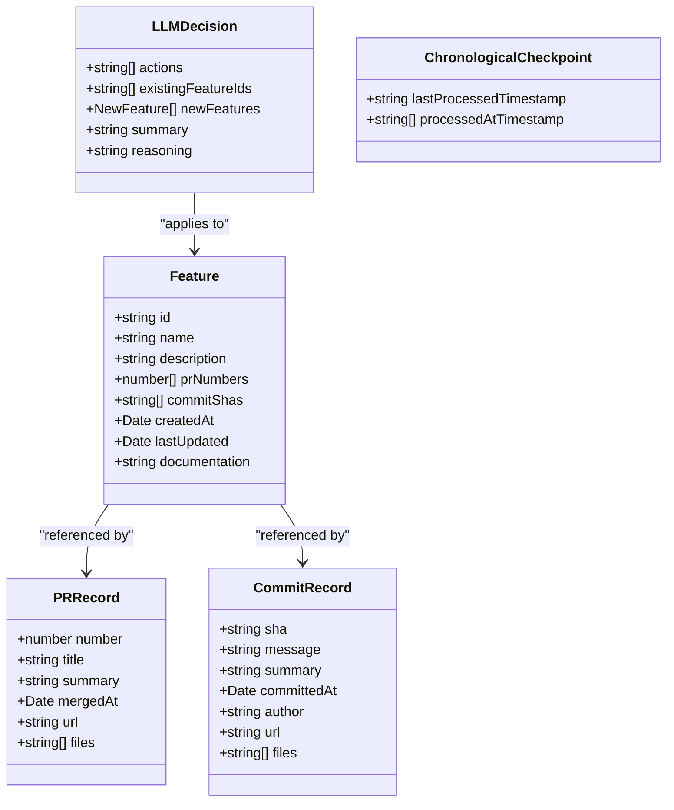
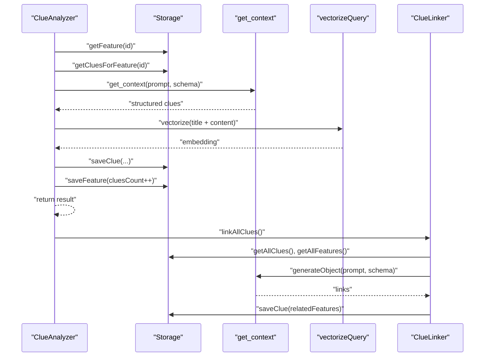
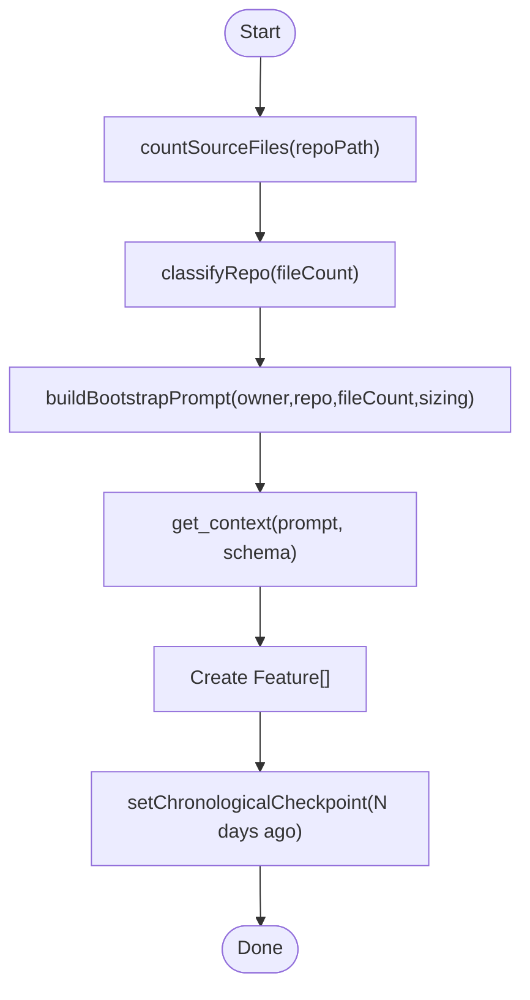
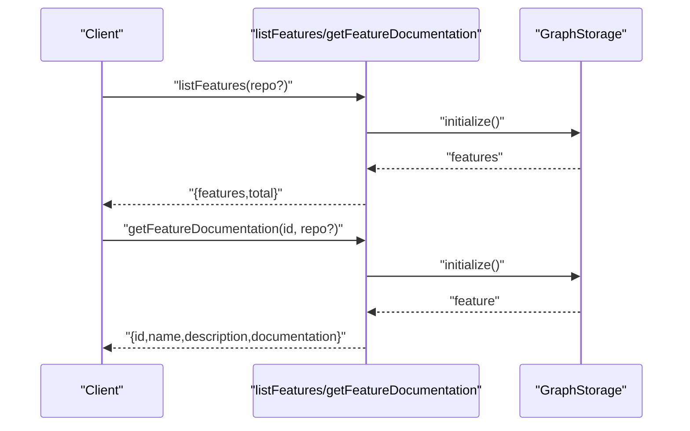
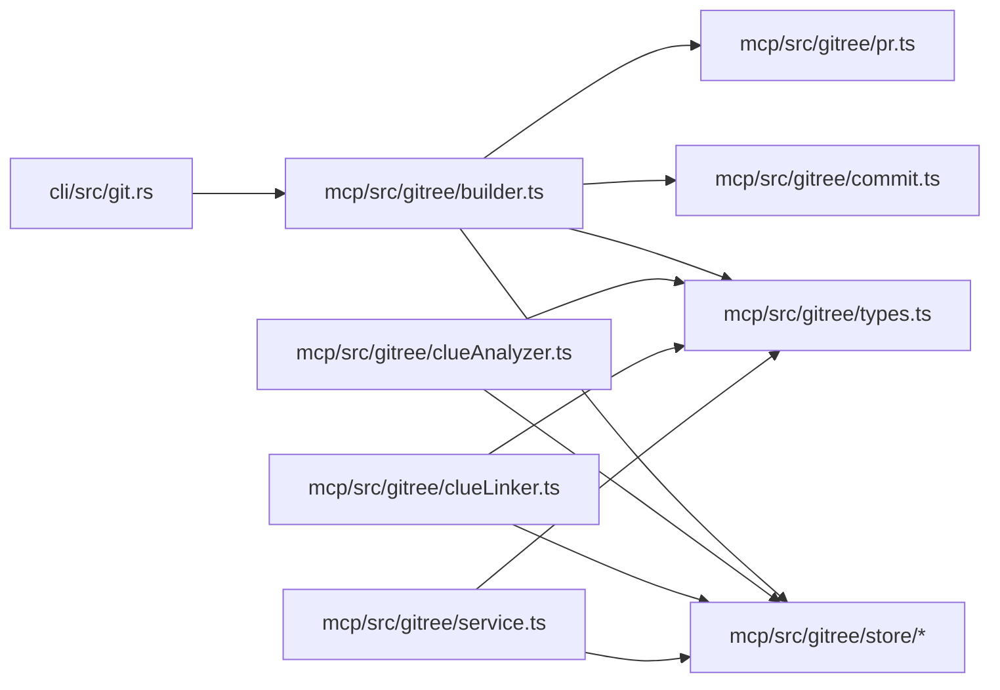

# Git Integration and Change Tracking

<cite>
**Referenced Files in This Document**
- [git.rs](file://cli/src/git.rs)
- [index.ts](file://mcp/src/gitree/index.ts)
- [service.ts](file://mcp/src/gitree/service.ts)
- [builder.ts](file://mcp/src/gitree/builder.ts)
- [pr.ts](file://mcp/src/gitree/pr.ts)
- [commit.ts](file://mcp/src/gitree/commit.ts)
- [clueAnalyzer.ts](file://mcp/src/gitree/clueAnalyzer.ts)
- [clueLinker.ts](file://mcp/src/gitree/clueLinker.ts)
- [types.ts](file://mcp/src/gitree/types.ts)
- [bootstrap.ts](file://mcp/src/gitree/bootstrap.ts)
</cite>

## Table of Contents
1. [Introduction](#introduction)
2. [Project Structure](#project-structure)
3. [Core Components](#core-components)
4. [Architecture Overview](#architecture-overview)
5. [Detailed Component Analysis](#detailed-component-analysis)
6. [Dependency Analysis](#dependency-analysis)
7. [Performance Considerations](#performance-considerations)
8. [Troubleshooting Guide](#troubleshooting-guide)
9. [Conclusion](#conclusion)
10. [Appendices](#appendices)

## Introduction
This document explains StakGraph’s Git integration and structural change tracking capabilities. It covers how the system analyzes git history, extracts PR and commit histories, and organizes them into conceptual features. It also documents the Gitree feature extraction system that turns chronological changes into architectural insights, including clue discovery and linking across features. Practical examples demonstrate change analysis, feature discovery, and architectural clue extraction. Finally, it provides guidance on performance optimization for large repositories and integrating the system into CI/CD pipelines.

## Project Structure
StakGraph comprises:
- CLI layer for local git operations and change enumeration
- MCP Gitree subsystem for PR/commit ingestion, feature modeling, and clue extraction
- Typed models and storage abstractions for persistent state
- LLM-driven orchestration for feature decisions and clue generation

**Diagram sources**
- [git.rs:1-149](file://cli/src/git.rs#L1-L149)
- [builder.ts:1-1013](file://mcp/src/gitree/builder.ts#L1-L1013)
- [pr.ts:1-436](file://mcp/src/gitree/pr.ts#L1-L436)
- [commit.ts:1-243](file://mcp/src/gitree/commit.ts#L1-L243)
- [clueAnalyzer.ts:1-695](file://mcp/src/gitree/clueAnalyzer.ts#L1-L695)
- [clueLinker.ts:1-277](file://mcp/src/gitree/clueLinker.ts#L1-L277)
- [bootstrap.ts:1-304](file://mcp/src/gitree/bootstrap.ts#L1-L304)
- [types.ts:1-262](file://mcp/src/gitree/types.ts#L1-L262)
- [service.ts:1-67](file://mcp/src/gitree/service.ts#L1-L67)

**Section sources**
- [git.rs:1-149](file://cli/src/git.rs#L1-L149)
- [index.ts:1-18](file://mcp/src/gitree/index.ts#L1-L18)

## Core Components
- Local Git Operations: Enumerate changed files, staged/unstaged diffs, and read file content at specific revisions.
- PR/Commit Ingestion: Fetch PRs and commits from GitHub, filter by merge date and checkpoint, and format content for LLM consumption.
- Feature Modeling: Maintain features, PR records, commit records, and chronological checkpoints.
- Clue Discovery: Extract reusable architectural insights from features and changes, with embeddings for semantic search.
- Clue Linking: Automatically connect clues to relevant features based on semantic similarity and entity overlap.
- Bootstrapping: Seed initial features via agentic exploration of the repository.

**Section sources**
- [git.rs:38-149](file://cli/src/git.rs#L38-L149)
- [pr.ts:32-58](file://mcp/src/gitree/pr.ts#L32-L58)
- [commit.ts:20-34](file://mcp/src/gitree/commit.ts#L20-L34)
- [types.ts:24-138](file://mcp/src/gitree/types.ts#L24-L138)
- [clueAnalyzer.ts:30-199](file://mcp/src/gitree/clueAnalyzer.ts#L30-L199)
- [clueLinker.ts:17-82](file://mcp/src/gitree/clueLinker.ts#L17-L82)
- [bootstrap.ts:181-258](file://mcp/src/gitree/bootstrap.ts#L181-L258)

## Architecture Overview
The Git integration and change tracking pipeline operates as follows:
- Local git commands enumerate changed files and staged/unstaged changes.
- The builder fetches PRs and commits from GitHub, filters by checkpoint, and processes them in chronological order.
- For each PR/commit, content is fetched and formatted, then an LLM decides whether to ignore, add to existing features, or create new features.
- Optional clue analysis extracts architectural insights from PR/commit changes and from feature codebases.
- Clue linking connects discovered clues to relevant features.
- Bootstrapping seeds features for new repositories.

**Diagram sources**
- [git.rs:38-58](file://cli/src/git.rs#L38-L58)
- [builder.ts:36-166](file://mcp/src/gitree/builder.ts#L36-L166)
- [pr.ts:32-58](file://mcp/src/gitree/pr.ts#L32-L58)
- [commit.ts:20-34](file://mcp/src/gitree/commit.ts#L20-L34)
- [clueAnalyzer.ts:291-433](file://mcp/src/gitree/clueAnalyzer.ts#L291-L433)
- [clueLinker.ts:17-82](file://mcp/src/gitree/clueLinker.ts#L17-L82)

## Detailed Component Analysis

### Git History Analysis (CLI)
- Determines repository root and enumerates changed files across staged, unstaged, and between revisions.
- Reads file content at a given revision safely, handling missing paths and invalid revisions.
- Filters paths by scope to constrain analysis.

**Diagram sources**
- [git.rs:3-149](file://cli/src/git.rs#L3-L149)

**Section sources**
- [git.rs:3-149](file://cli/src/git.rs#L3-L149)

### PR and Commit History Ingestion
- PR ingestion:
  - Fetches PR metadata and lists files, comments, reviews, and commits.
  - Formats content into a compact, LLM-friendly markdown with configurable limits.
- Commit ingestion:
  - Fetches commit details and formats message, changed files, and stats.
  - Supports orphan commit detection by checking PR associations.

**Diagram sources**
- [pr.ts:32-58](file://mcp/src/gitree/pr.ts#L32-L58)
- [commit.ts:20-34](file://mcp/src/gitree/commit.ts#L20-L34)
- [builder.ts:196-341](file://mcp/src/gitree/builder.ts#L196-L341)

**Section sources**
- [pr.ts:32-436](file://mcp/src/gitree/pr.ts#L32-L436)
- [commit.ts:20-243](file://mcp/src/gitree/commit.ts#L20-L243)
- [builder.ts:196-341](file://mcp/src/gitree/builder.ts#L196-L341)

### Feature Modeling and Decisions
- Core models define features, PR/commit records, LLM decisions, and chronological checkpoints.
- The builder applies LLM decisions to either add changes to existing features or create new ones, updating timestamps and usage metrics.

**Diagram sources**
- [types.ts:24-138](file://mcp/src/gitree/types.ts#L24-L138)

**Section sources**
- [types.ts:24-138](file://mcp/src/gitree/types.ts#L24-L138)
- [builder.ts:519-739](file://mcp/src/gitree/builder.ts#L519-L739)

### Clue Discovery and Linking
- Clue Analyzer:
  - Iteratively discovers architectural clues for a feature or for a specific PR/commit change.
  - Enforces limits and deduplicates against existing clues.
  - Generates embeddings for semantic search and links discovered features.
- Clue Linker:
  - Automatically links clues to relevant features using structured LLM prompting.
  - Processes batches to manage token usage and handles partial failures.

**Diagram sources**
- [clueAnalyzer.ts:30-199](file://mcp/src/gitree/clueAnalyzer.ts#L30-L199)
- [clueAnalyzer.ts:291-433](file://mcp/src/gitree/clueAnalyzer.ts#L291-L433)
- [clueLinker.ts:47-82](file://mcp/src/gitree/clueLinker.ts#L47-L82)
- [clueLinker.ts:107-151](file://mcp/src/gitree/clueLinker.ts#L107-L151)

**Section sources**
- [clueAnalyzer.ts:30-695](file://mcp/src/gitree/clueAnalyzer.ts#L30-L695)
- [clueLinker.ts:17-277](file://mcp/src/gitree/clueLinker.ts#L17-L277)

### Bootstrapping Initial Features
- Counts source files to infer repository size and target feature count range.
- Calls an agentic exploration to identify core features and generates initial documentation.
- Sets a chronological checkpoint to replay recent changes after bootstrapping.

**Diagram sources**
- [bootstrap.ts:27-104](file://mcp/src/gitree/bootstrap.ts#L27-L104)
- [bootstrap.ts:109-139](file://mcp/src/gitree/bootstrap.ts#L109-L139)
- [bootstrap.ts:181-258](file://mcp/src/gitree/bootstrap.ts#L181-L258)

**Section sources**
- [bootstrap.ts:181-304](file://mcp/src/gitree/bootstrap.ts#L181-L304)

### Feature Knowledge Extraction API
- Lists features with counts and metadata.
- Retrieves feature documentation by ID.

**Diagram sources**
- [service.ts:22-67](file://mcp/src/gitree/service.ts#L22-L67)

**Section sources**
- [service.ts:22-67](file://mcp/src/gitree/service.ts#L22-L67)

## Dependency Analysis
- CLI git.rs depends on system git to enumerate changes and read blobs at revisions.
- builder.ts orchestrates GitHub API calls, PR/commit formatting, LLM decisions, and storage updates.
- clueAnalyzer.ts and clueLinker.ts depend on storage and embedding utilities to discover and link architectural insights.
- types.ts defines shared models used across components.

**Diagram sources**
- [git.rs:1-149](file://cli/src/git.rs#L1-L149)
- [builder.ts:1-1013](file://mcp/src/gitree/builder.ts#L1-L1013)
- [pr.ts:1-436](file://mcp/src/gitree/pr.ts#L1-L436)
- [commit.ts:1-243](file://mcp/src/gitree/commit.ts#L1-L243)
- [types.ts:1-262](file://mcp/src/gitree/types.ts#L1-L262)
- [clueAnalyzer.ts:1-695](file://mcp/src/gitree/clueAnalyzer.ts#L1-L695)
- [clueLinker.ts:1-277](file://mcp/src/gitree/clueLinker.ts#L1-L277)
- [service.ts:1-67](file://mcp/src/gitree/service.ts#L1-L67)

**Section sources**
- [builder.ts:1-1013](file://mcp/src/gitree/builder.ts#L1-L1013)
- [types.ts:1-262](file://mcp/src/gitree/types.ts#L1-L262)

## Performance Considerations
- Pagination and limits:
  - GitHub API pagination is used for PRs and commits to avoid large payloads.
  - PR content truncation limits patch lines, files, comments, and reviews to control token usage.
- Incremental processing:
  - Chronological checkpoints ensure only new changes are processed on subsequent runs.
- Batched linking:
  - Clue linking processes batches to bound token usage and handle partial failures.
- Early filtering:
  - Heuristics skip trivial “chore” and “docs” PRs/commits to reduce noise.
- Bootstrapping sizing:
  - Repository size classification guides target feature counts to avoid over-segmentation.

[No sources needed since this section provides general guidance]

## Troubleshooting Guide
- Git command failures:
  - Local git operations return structured errors; inspect stderr for invalid repository or command failures.
- Missing file content at revision:
  - read_file_at_rev returns None for missing paths or invalid revisions; downstream logic should handle gracefully.
- GitHub API rate limits:
  - Pagination and reduced payload sizes mitigate throttling; consider retry/backoff strategies if needed.
- Clue analysis failures:
  - Analyzer/linker wrap operations and continue on error; review logs for specific change identifiers and feature IDs.
- Checkpoint inconsistencies:
  - If processing stalls, verify checkpoint timestamps and processed IDs; the builder migrates old checkpoints automatically.

**Section sources**
- [git.rs:101-122](file://cli/src/git.rs#L101-L122)
- [builder.ts:87-106](file://mcp/src/gitree/builder.ts#L87-L106)
- [builder.ts:129-149](file://mcp/src/gitree/builder.ts#L129-L149)
- [clueAnalyzer.ts:43-51](file://mcp/src/gitree/clueAnalyzer.ts#L43-L51)
- [clueAnalyzer.ts:244-250](file://mcp/src/gitree/clueAnalyzer.ts#L244-L250)

## Conclusion
StakGraph’s Git integration and change tracking system combines local git operations with GitHub API ingestion to build a chronological understanding of a repository’s evolution. The Gitree subsystem organizes changes into features and extracts reusable architectural clues, enabling teams to discover patterns, maintain documentation, and improve onboarding. With batching, checkpoints, and pruning heuristics, the system scales to large repositories and integrates cleanly into CI/CD workflows.

[No sources needed since this section summarizes without analyzing specific files]

## Appendices

### Practical Examples

- Change Analysis
  - Enumerate changed files between revisions and scope to a subset of paths.
  - For each change, fetch PR/commit content, apply LLM decision, and optionally analyze for clues.
  - Update checkpoints to resume incremental processing.

  **Section sources**
  - [git.rs:38-149](file://cli/src/git.rs#L38-L149)
  - [builder.ts:36-166](file://mcp/src/gitree/builder.ts#L36-L166)
  - [pr.ts:32-58](file://mcp/src/gitree/pr.ts#L32-L58)
  - [commit.ts:20-34](file://mcp/src/gitree/commit.ts#L20-L34)

- Feature Discovery
  - Bootstrap a new repository to seed features, then process recent changes incrementally.
  - Explore new features when the incremental flow detects novel areas without documentation.

  **Section sources**
  - [bootstrap.ts:181-258](file://mcp/src/gitree/bootstrap.ts#L181-L258)
  - [bootstrap.ts:265-304](file://mcp/src/gitree/bootstrap.ts#L265-L304)

- Architectural Clue Extraction
  - Analyze a feature iteratively to discover utilities, abstractions, integrations, and patterns.
  - Analyze PR/commit changes to extract actionable insights and link them to relevant features.

  **Section sources**
  - [clueAnalyzer.ts:30-199](file://mcp/src/gitree/clueAnalyzer.ts#L30-L199)
  - [clueAnalyzer.ts:291-433](file://mcp/src/gitree/clueAnalyzer.ts#L291-L433)
  - [clueLinker.ts:47-82](file://mcp/src/gitree/clueLinker.ts#L47-L82)

### CI/CD Integration Guidance
- Schedule periodic runs to process new PRs and commits using chronological checkpoints.
- Configure environment variables for LLM provider and API keys used by the agent and linking components.
- Monitor token usage and adjust content limits to fit within budget.
- Use bootstrapping for new repositories and incremental processing for established ones.

[No sources needed since this section provides general guidance]