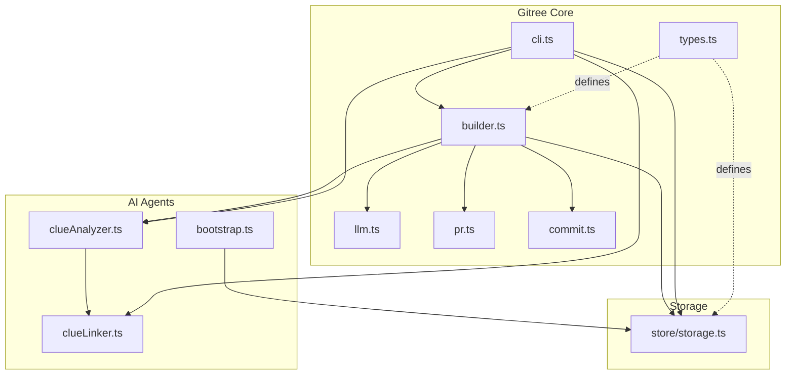
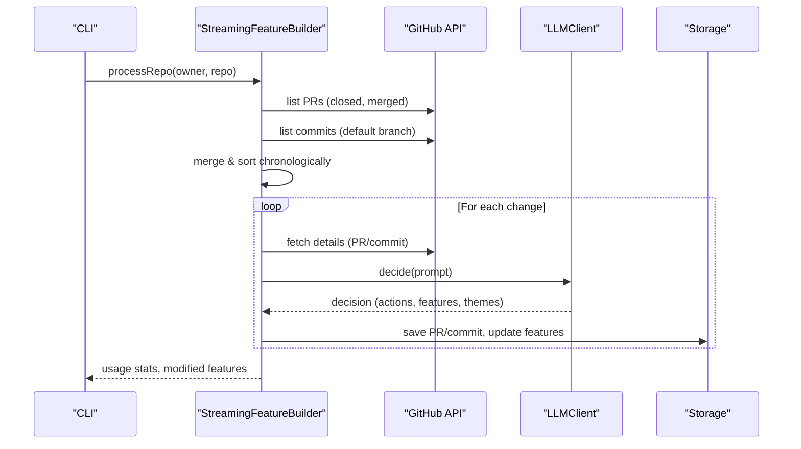
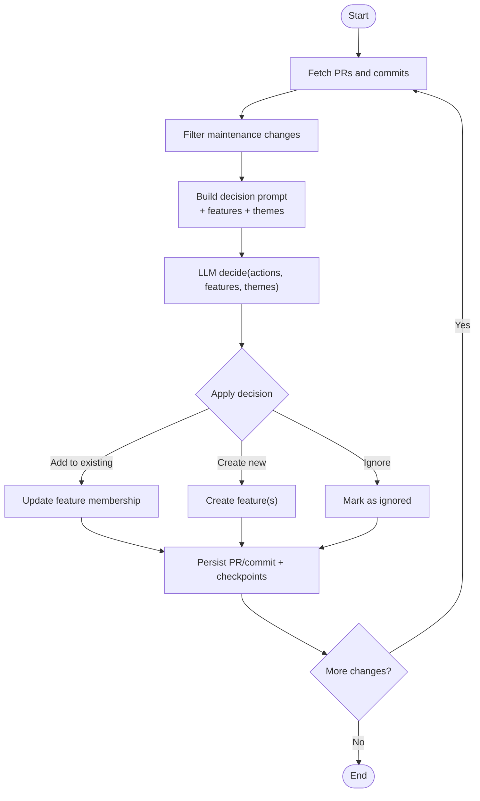
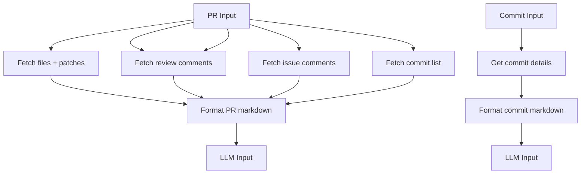
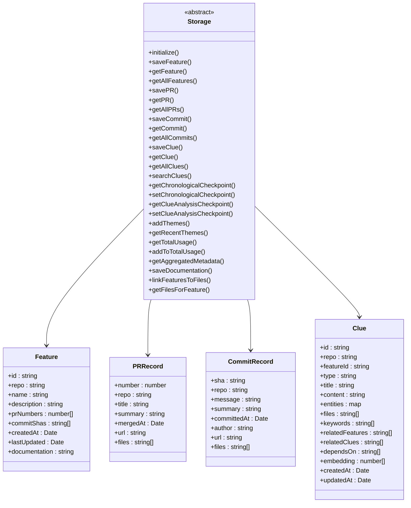
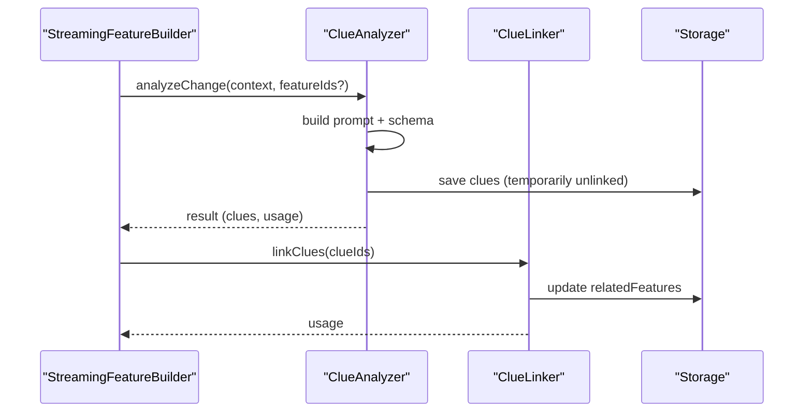
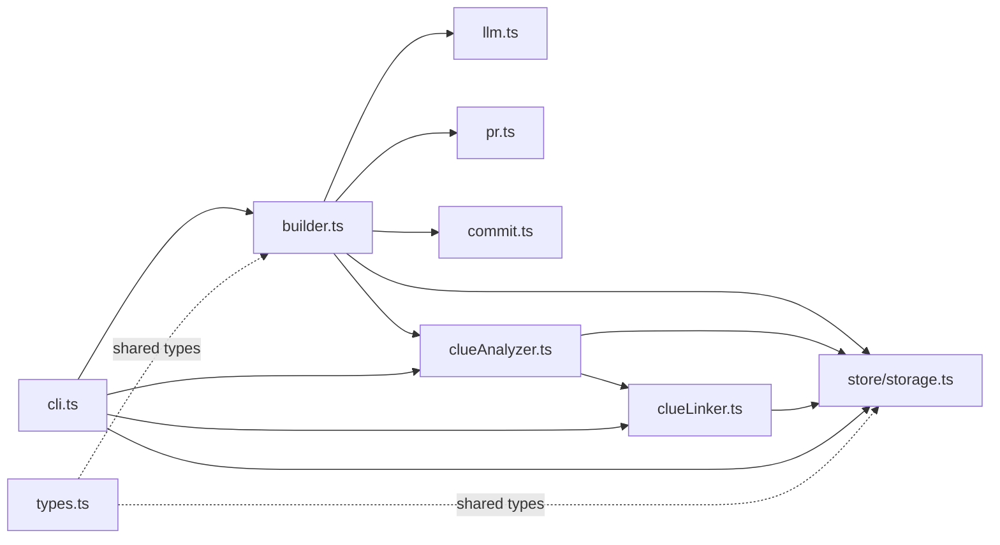

# Gitree Feature Extraction

<cite>
**Referenced Files in This Document**
- [README.md](file://mcp/src/gitree/README.md)
- [index.ts](file://mcp/src/gitree/index.ts)
- [types.ts](file://mcp/src/gitree/types.ts)
- [builder.ts](file://mcp/src/gitree/builder.ts)
- [llm.ts](file://mcp/src/gitree/llm.ts)
- [pr.ts](file://mcp/src/gitree/pr.ts)
- [commit.ts](file://mcp/src/gitree/commit.ts)
- [cli.ts](file://mcp/src/gitree/cli.ts)
- [storage.ts](file://mcp/src/gitree/store/storage.ts)
- [clueAnalyzer.ts](file://mcp/src/gitree/clueAnalyzer.ts)
- [clueLinker.ts](file://mcp/src/gitree/clueLinker.ts)
- [fileLinker.ts](file://mcp/src/gitree/fileLinker.ts)
- [bootstrap.ts](file://mcp/src/gitree/bootstrap.ts)
</cite>

## Table of Contents
1. [Introduction](#introduction)
2. [Project Structure](#project-structure)
3. [Core Components](#core-components)
4. [Architecture Overview](#architecture-overview)
5. [Detailed Component Analysis](#detailed-component-analysis)
6. [Dependency Analysis](#dependency-analysis)
7. [Performance Considerations](#performance-considerations)
8. [Troubleshooting Guide](#troubleshooting-guide)
9. [Conclusion](#conclusion)
10. [Appendices](#appendices)

## Introduction
Gitree is StakGraph’s feature extraction engine that analyzes GitHub PRs and commits to discover and organize user-facing features, architectural patterns, and development insights. It combines chronological processing of PRs and commits, LLM-driven decisions, and optional architectural clue analysis to build a knowledge base of features and their relationships over time. The system supports both file-based and graph-backed storage, integrates with AI agents for automated discovery, and exposes a CLI for end-to-end workflows.

## Project Structure
Gitree lives under mcp/src/gitree and is composed of:
- Core orchestration and processing: builder.ts, llm.ts, pr.ts, commit.ts
- Data models and storage contracts: types.ts, store/storage.ts
- AI-powered analysis: clueAnalyzer.ts, clueLinker.ts, bootstrap.ts
- CLI and integration: cli.ts, index.ts
- Knowledge base documentation: README.md



**Diagram sources**
- [builder.ts:1-1013](file://mcp/src/gitree/builder.ts#L1-L1013)
- [llm.ts:1-349](file://mcp/src/gitree/llm.ts#L1-L349)
- [pr.ts:1-436](file://mcp/src/gitree/pr.ts#L1-L436)
- [commit.ts:1-243](file://mcp/src/gitree/commit.ts#L1-L243)
- [types.ts:1-262](file://mcp/src/gitree/types.ts#L1-L262)
- [cli.ts:1-851](file://mcp/src/gitree/cli.ts#L1-L851)
- [store/storage.ts:1-128](file://mcp/src/gitree/store/storage.ts#L1-L128)
- [bootstrap.ts:1-304](file://mcp/src/gitree/bootstrap.ts#L1-L304)
- [clueAnalyzer.ts:1-695](file://mcp/src/gitree/clueAnalyzer.ts#L1-L695)
- [clueLinker.ts:1-277](file://mcp/src/gitree/clueLinker.ts#L1-L277)

**Section sources**
- [README.md:1-271](file://mcp/src/gitree/README.md#L1-L271)
- [index.ts:1-18](file://mcp/src/gitree/index.ts#L1-L18)

## Core Components
- StreamingFeatureBuilder: Orchestrates chronological PR and commit processing, applies LLM decisions, updates checkpoints, and optionally analyzes architectural clues.
- LLMClient and decision prompts: Structured prompting and schema-based parsing to decide whether to add to existing features, create new features, or ignore changes.
- PR and Commit content fetchers: Normalize GitHub data into LLM-friendly markdown for analysis.
- Storage interface: Defines multi-repo-aware persistence for features, PRs, commits, clues, themes, and checkpoints.
- ClueAnalyzer and ClueLinker: Extract reusable architectural insights (“clues”) and link them to relevant features.
- CLI: Provides commands for processing repositories, listing features, summarizing, linking files, analyzing clues, and querying statistics.

**Section sources**
- [builder.ts:1-1013](file://mcp/src/gitree/builder.ts#L1-L1013)
- [llm.ts:1-349](file://mcp/src/gitree/llm.ts#L1-L349)
- [pr.ts:1-436](file://mcp/src/gitree/pr.ts#L1-L436)
- [commit.ts:1-243](file://mcp/src/gitree/commit.ts#L1-L243)
- [storage.ts:1-128](file://mcp/src/gitree/store/storage.ts#L1-L128)
- [clueAnalyzer.ts:1-695](file://mcp/src/gitree/clueAnalyzer.ts#L1-L695)
- [clueLinker.ts:1-277](file://mcp/src/gitree/clueLinker.ts#L1-L277)
- [cli.ts:1-851](file://mcp/src/gitree/cli.ts#L1-L851)

## Architecture Overview
Gitree follows a staged pipeline:
- Data ingestion: Fetch PRs and commits from GitHub, filter and deduplicate, merge into a chronological timeline.
- LLM decision: For each change, build a prompt enriched with existing features and recent themes, then parse structured decisions.
- Persistence: Save PR/commit records and update feature membership; maintain per-repo checkpoints and theme lists.
- Optional analysis: Detect architectural clues from code changes and link them to relevant features.
- CLI and storage: Provide commands to process, query, summarize, and visualize the evolving feature map.



**Diagram sources**
- [builder.ts:36-166](file://mcp/src/gitree/builder.ts#L36-L166)
- [llm.ts:71-104](file://mcp/src/gitree/llm.ts#L71-L104)
- [cli.ts:41-82](file://mcp/src/gitree/cli.ts#L41-L82)

## Detailed Component Analysis

### Feature Extraction Pipeline
- Chronological ingestion: Combines PRs and commits, filters out pre-existing processed items via checkpoints, and sorts by merged/committed timestamps.
- Maintenance filtering: Heuristics skip typical non-feature changes (e.g., bump, chore, dependabot, docs, typo, ci).
- Decision-making: Builds a prompt with current features and recent themes, asks the LLM to choose actions (add to existing, create new, ignore), and parses structured output.
- Persistence: Saves PR/commit records, updates feature membership, and maintains per-repo checkpoints and theme lists.



**Diagram sources**
- [builder.ts:171-341](file://mcp/src/gitree/builder.ts#L171-L341)
- [builder.ts:346-565](file://mcp/src/gitree/builder.ts#L346-L565)
- [llm.ts:29-60](file://mcp/src/gitree/llm.ts#L29-L60)

**Section sources**
- [builder.ts:171-565](file://mcp/src/gitree/builder.ts#L171-L565)
- [llm.ts:109-349](file://mcp/src/gitree/llm.ts#L109-L349)

### Machine Learning Decisions and Prompts
- Structured schema: Enforces actions, feature IDs, new feature definitions, theme tags, summaries, reasoning, and optional new declarations.
- System and decision prompts: Emphasize user-facing capabilities, avoid implementation details, balance feature creation, and guide theme tagging.
- Retry and backoff: Robust LLM invocation with exponential backoff on failures.

```mermaid
classDiagram
class LLMClient {
+decide(prompt, retries) Promise~{decision, usage}~
}
class LLMDecision {
+actions : string[]
+existingFeatureIds : string[]
+newFeatures : NameDesc[]
+updateFeatures : UpdateDesc[]
+themes : string[]
+summary : string
+reasoning : string
+newDeclarations : Decl[]
}
LLMClient --> LLMDecision : "parses"
```

**Diagram sources**
- [llm.ts:65-105](file://mcp/src/gitree/llm.ts#L65-L105)
- [llm.ts:29-60](file://mcp/src/gitree/llm.ts#L29-L60)

**Section sources**
- [llm.ts:1-349](file://mcp/src/gitree/llm.ts#L1-L349)

### PR and Commit Content Normalization
- PR normalization: Aggregates PR metadata, files, review comments, issue comments, reviews, and commits; truncates diffs and comments to manage token budgets.
- Commit normalization: Formats commit message, files changed, and stats; truncates patches to cap token usage.



**Diagram sources**
- [pr.ts:32-58](file://mcp/src/gitree/pr.ts#L32-L58)
- [pr.ts:140-185](file://mcp/src/gitree/pr.ts#L140-L185)
- [commit.ts:20-34](file://mcp/src/gitree/commit.ts#L20-L34)
- [commit.ts:129-154](file://mcp/src/gitree/commit.ts#L129-L154)

**Section sources**
- [pr.ts:1-436](file://mcp/src/gitree/pr.ts#L1-L436)
- [commit.ts:1-243](file://mcp/src/gitree/commit.ts#L1-L243)

### Storage and Data Model
- Storage contract: Multi-repo aware, supports features, PRs, commits, clues, themes, checkpoints, and usage aggregation.
- Derived helpers: Query PRs/commits for a feature, get features for a PR/commit, search clues with embeddings and keyword matching.
- Per-repo checkpoints: Track last processed PR/commit and chronological progress for incremental processing.



**Diagram sources**
- [storage.ts:11-128](file://mcp/src/gitree/store/storage.ts#L11-L128)
- [types.ts:24-69](file://mcp/src/gitree/types.ts#L24-L69)
- [types.ts:171-198](file://mcp/src/gitree/types.ts#L171-L198)

**Section sources**
- [storage.ts:1-128](file://mcp/src/gitree/store/storage.ts#L1-L128)
- [types.ts:1-262](file://mcp/src/gitree/types.ts#L1-L262)

### Architectural Clue Analysis and Linking
- ClueAnalyzer: Iteratively extracts reusable architectural insights (“clues”) from features or recent changes, writing generic explanations and entity references.
- ClueLinker: Links clues to relevant features using semantic similarity and entity overlap, guided by a structured schema and system prompt.
- FileLinker: Maps features to file nodes in the graph based on PR file changes.



**Diagram sources**
- [builder.ts:936-1011](file://mcp/src/gitree/builder.ts#L936-L1011)
- [clueAnalyzer.ts:291-433](file://mcp/src/gitree/clueAnalyzer.ts#L291-L433)
- [clueLinker.ts:17-151](file://mcp/src/gitree/clueLinker.ts#L17-L151)

**Section sources**
- [clueAnalyzer.ts:1-695](file://mcp/src/gitree/clueAnalyzer.ts#L1-L695)
- [clueLinker.ts:1-277](file://mcp/src/gitree/clueLinker.ts#L1-L277)
- [fileLinker.ts:1-76](file://mcp/src/gitree/fileLinker.ts#L1-L76)

### Bootstrapping Initial Features
- Bootstrap: Estimates repository size, builds a structured prompt, and generates initial features with concise documentation using an agentic exploration.
- Explore new feature: Generates documentation for newly discovered features during incremental processing.

**Section sources**
- [bootstrap.ts:181-304](file://mcp/src/gitree/bootstrap.ts#L181-L304)

### CLI Workflows and Commands
- Process: Run end-to-end feature extraction for a repository.
- List/Show: Inspect features, PRs, commits, and clues.
- Summarize: Generate comprehensive documentation for features.
- Link files: Map features to files in the graph.
- Analyze clues: Extract and link architectural insights.
- Search clues: Retrieve relevant clues via embeddings and keywords.

**Section sources**
- [cli.ts:1-851](file://mcp/src/gitree/cli.ts#L1-L851)

## Dependency Analysis
Gitree composes modular components with clear boundaries:
- builder.ts depends on llm.ts, pr.ts, commit.ts, and storage.ts.
- clueAnalyzer.ts and clueLinker.ts depend on storage.ts and vectorization utilities.
- CLI orchestrates builder, storage, analyzer, and linker.
- types.ts defines shared data contracts used across modules.



**Diagram sources**
- [cli.ts:1-851](file://mcp/src/gitree/cli.ts#L1-L851)
- [builder.ts:1-1013](file://mcp/src/gitree/builder.ts#L1-L1013)
- [llm.ts:1-349](file://mcp/src/gitree/llm.ts#L1-L349)
- [pr.ts:1-436](file://mcp/src/gitree/pr.ts#L1-L436)
- [commit.ts:1-243](file://mcp/src/gitree/commit.ts#L1-L243)
- [store/storage.ts:1-128](file://mcp/src/gitree/store/storage.ts#L1-L128)
- [clueAnalyzer.ts:1-695](file://mcp/src/gitree/clueAnalyzer.ts#L1-L695)
- [clueLinker.ts:1-277](file://mcp/src/gitree/clueLinker.ts#L1-L277)
- [types.ts:1-262](file://mcp/src/gitree/types.ts#L1-L262)

**Section sources**
- [index.ts:1-18](file://mcp/src/gitree/index.ts#L1-L18)

## Performance Considerations
- Token budgeting: PR and commit content is truncated to cap LLM input sizes; adjust maxPatchLines and maxFiles to balance fidelity and cost.
- Incremental processing: Checkpoints prevent reprocessing; use per-repo chronological checkpoints for reliability.
- Batched linking: ClueLinker processes clues in batches to reduce overhead.
- Embedding generation: ClueAnalyzer computes embeddings for semantic search; cache or reuse where possible.
- Pagination limits: GitHub APIs are paginated; tune per_page and handle rate limits.

[No sources needed since this section provides general guidance]

## Troubleshooting Guide
- Missing credentials: Ensure GITHUB_TOKEN and provider API keys are configured; CLI validates tokens before processing.
- Rate limits: Expect throttling from GitHub and LLM providers; consider backoff and reduced concurrency.
- Maintenance filters: If legitimate changes are being skipped, review skip patterns and adjust heuristics.
- Storage backends: Switch between file-based and graph storage using CLI flags; ensure initialization succeeds.
- Clue analysis: If no clues are found, verify repo path availability and feature linkage; rerun link-clues if needed.

**Section sources**
- [cli.ts:51-82](file://mcp/src/gitree/cli.ts#L51-L82)
- [builder.ts:443-454](file://mcp/src/gitree/builder.ts#L443-L454)
- [llm.ts:77-104](file://mcp/src/gitree/llm.ts#L77-L104)

## Conclusion
Gitree provides a robust, incremental pipeline to extract user-facing features from PR and commit histories, guided by LLM decisions and optionally enriched with architectural clues. Its modular design, multi-repo storage abstraction, and CLI-first UX enable scalable feature knowledge bases for architecture tracking, technical debt analysis, and automated discovery.

[No sources needed since this section summarizes without analyzing specific files]

## Appendices

### Practical Workflows
- End-to-end processing:
  - yarn gitree process <owner> <repo> [--dir <path>] [--graph]
  - yarn gitree list-features [--dir <path>]
  - yarn gitree show-feature <featureId> [--dir <path>]
  - yarn gitree summarize <featureId> [--dir <path>]
  - yarn gitree link-files [<featureId>] [--dir <path>]
  - yarn gitree analyze-clues [<featureId>] [--dir <path>] [--repo-path <path>] [--no-link]
  - yarn gitree stats [--dir <path>] [--repo <owner/repo>]

- Retroactive analysis:
  - yarn gitree analyze-changes [--dir <path>] [--repo-path <path>] --repo <owner/repo> [--force]

**Section sources**
- [README.md:40-271](file://mcp/src/gitree/README.md#L40-L271)
- [cli.ts:41-851](file://mcp/src/gitree/cli.ts#L41-L851)

### Configuration Options
- CLI flags:
  - --dir: Knowledge base directory (default: ./knowledge-base)
  - --graph: Use Neo4j GraphStorage
  - --token: GitHub token override
  - --repo-path: Local repo path for code analysis
  - --no-link: Disable auto-linking after clue analysis
  - --force: Force reprocessing or re-analysis
  - --repo: Repository identifier for scoped operations

- PR/Commit content options:
  - maxPatchLines: Truncation threshold for diffs
  - maxFiles: Limit files per PR/commit
  - maxDescriptionChars, maxCommentChars: Truncation thresholds for text fields
  - maxComments, maxReviews: Cap on included comments/reviews

**Section sources**
- [cli.ts:41-851](file://mcp/src/gitree/cli.ts#L41-L851)
- [pr.ts:9-27](file://mcp/src/gitree/pr.ts#L9-L27)
- [commit.ts:9-15](file://mcp/src/gitree/commit.ts#L9-L15)

### Use Cases
- Feature evolution tracking: Monitor how features grow across PRs and commits over time.
- Architectural decision tracking: Use themes and clues to capture and revisit design choices.
- Technical debt analysis: Identify recurring patterns, missing abstractions, and cross-cutting concerns.
- Automated discovery: Bootstrap initial features and continuously refine them as code evolves.

[No sources needed since this section provides general guidance]