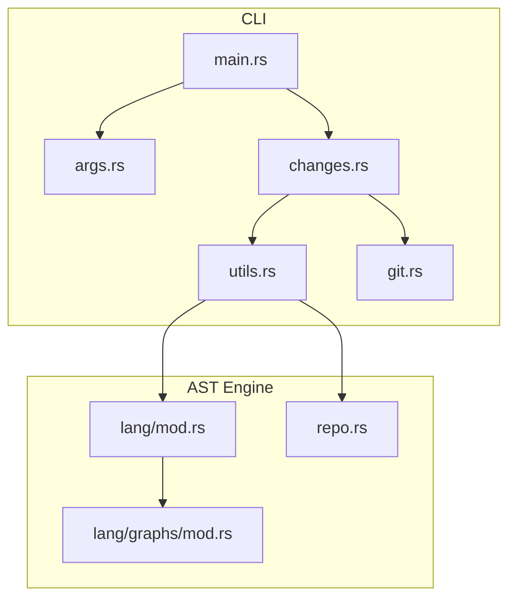
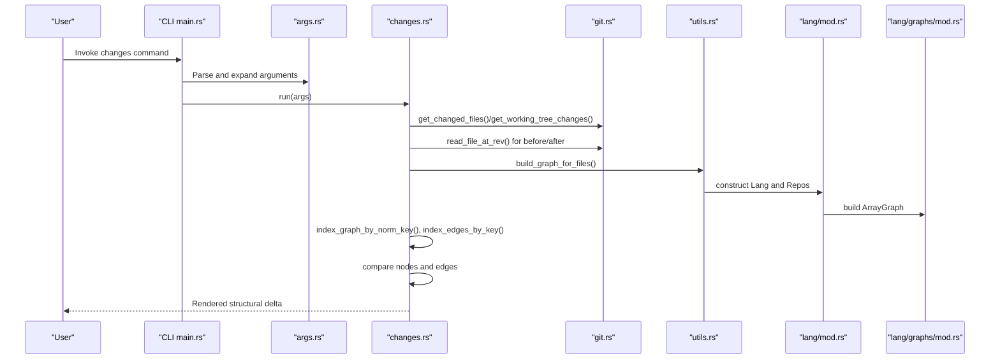
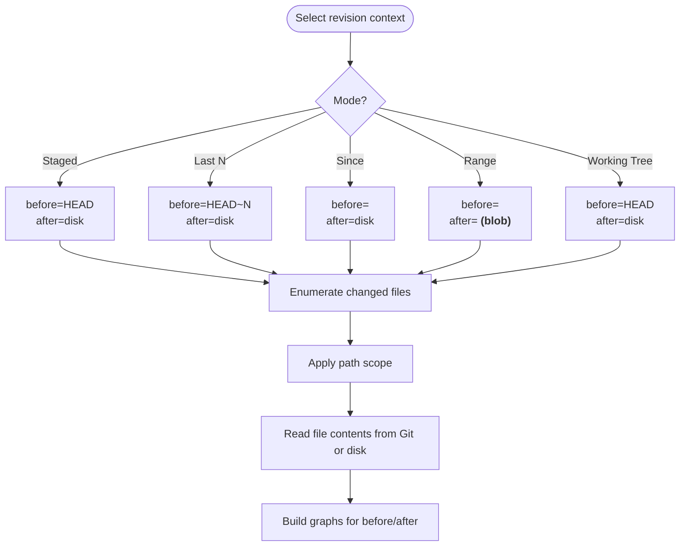
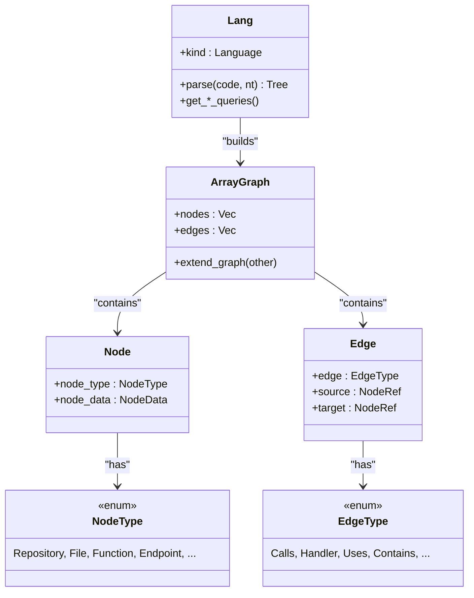
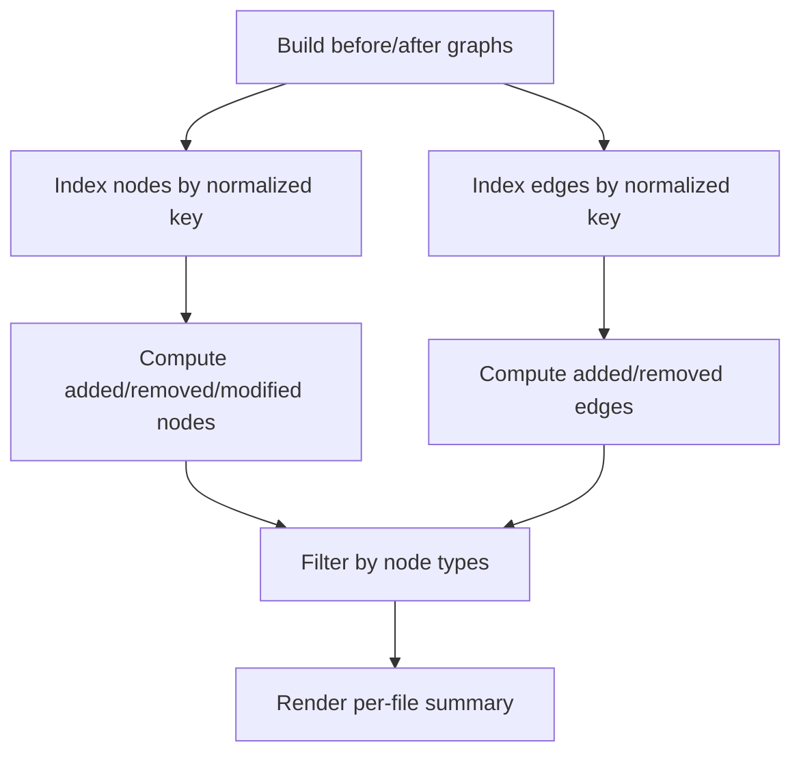
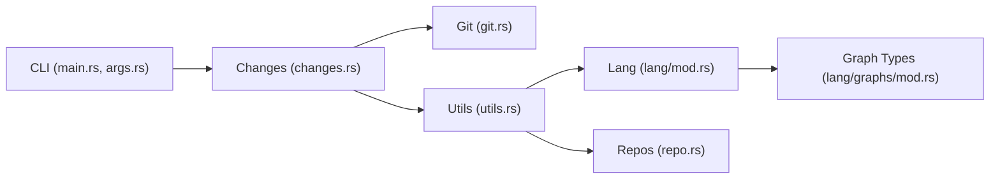

# Structural Change Tracking

<cite>
**Referenced Files in This Document**
- [main.rs](file://cli/src/main.rs)
- [args.rs](file://cli/src/args.rs)
- [git.rs](file://cli/src/git.rs)
- [changes.rs](file://cli/src/changes.rs)
- [utils.rs](file://cli/src/utils.rs)
- [mod.rs](file://ast/src/lang/graphs/mod.rs)
- [mod.rs](file://ast/src/lang/mod.rs)
- [repo.rs](file://ast/src/repo.rs)
</cite>

## Table of Contents
1. [Introduction](#introduction)
2. [Project Structure](#project-structure)
3. [Core Components](#core-components)
4. [Architecture Overview](#architecture-overview)
5. [Detailed Component Analysis](#detailed-component-analysis)
6. [Dependency Analysis](#dependency-analysis)
7. [Performance Considerations](#performance-considerations)
8. [Troubleshooting Guide](#troubleshooting-guide)
9. [Conclusion](#conclusion)
10. [Appendices](#appendices)

## Introduction
This document explains StakGraph’s structural change tracking system. It describes how the platform analyzes Git history to compute structural diffs between code versions, covering the end-to-end workflow from git blob parsing to AST comparison and structural delta computation. It documents commit-based analysis, change categorization, and graph representation, along with advanced topics such as semantic change detection beyond syntax, configuration controls for granularity, and CI/CD integration patterns. Practical examples and performance guidance are included for large repositories.

## Project Structure
StakGraph’s change tracking spans three primary areas:
- CLI entry and orchestration: parses arguments, invokes change commands, and coordinates output.
- Git integration: discovers changed files across revisions and reads file content from Git.
- Graph construction and diffing: builds AST-based graphs from files, normalizes nodes and edges, and computes deltas.

**Diagram sources**
- [main.rs:1-70](file://cli/src/main.rs#L1-L70)
- [args.rs:1-190](file://cli/src/args.rs#L1-L190)
- [changes.rs:1-796](file://cli/src/changes.rs#L1-L796)
- [utils.rs:1-233](file://cli/src/utils.rs#L1-L233)
- [git.rs:1-149](file://cli/src/git.rs#L1-L149)
- [mod.rs](file://ast/src/lang/mod.rs)
- [mod.rs](file://ast/src/lang/graphs/mod.rs)
- [repo.rs:1-200](file://ast/src/repo.rs#L1-L200)

**Section sources**
- [main.rs:1-70](file://cli/src/main.rs#L1-L70)
- [args.rs:1-190](file://cli/src/args.rs#L1-L190)
- [changes.rs:18-420](file://cli/src/changes.rs#L18-L420)
- [git.rs:38-149](file://cli/src/git.rs#L38-L149)
- [utils.rs:78-134](file://cli/src/utils.rs#L78-L134)
- [mod.rs](file://ast/src/lang/graphs/mod.rs)
- [mod.rs](file://ast/src/lang/mod.rs)
- [repo.rs:70-195](file://ast/src/repo.rs#L70-L195)

## Core Components
- CLI orchestration: parses user intent (list commits or compute diffs), sets logging, and delegates to change computation.
- Git integration: enumerates changed files across staged, recent commits, or arbitrary ranges; reads file content from Git or disk.
- Graph building: groups files by language, constructs AST graphs, and links nodes/edges across files.
- Delta computation: normalizes nodes and edges, compares bodies and signatures, and categorizes changes as added, removed, modified, or edge changes.

Key responsibilities:
- Argument parsing and validation for change commands.
- Revision selection and file scoping.
- Temporary file handling for Git blob snapshots.
- Graph normalization and indexing for robust comparison.
- Human-readable rendering of structural changes.

**Section sources**
- [args.rs:80-129](file://cli/src/args.rs#L80-L129)
- [changes.rs:98-420](file://cli/src/changes.rs#L98-L420)
- [git.rs:38-149](file://cli/src/git.rs#L38-L149)
- [utils.rs:78-134](file://cli/src/utils.rs#L78-L134)
- [mod.rs](file://ast/src/lang/graphs/mod.rs)
- [mod.rs](file://ast/src/lang/mod.rs)

## Architecture Overview
The change tracking pipeline follows a deterministic flow:
1. Determine revision context (staged, last N commits, since a ref, explicit range, or working tree).
2. Enumerate changed files and apply path scoping.
3. Load “before” and “after” file sets:
   - After: from disk (HEAD-based) or extracted from Git blobs (range-based).
   - Before: always from Git blobs to reflect prior state.
4. Build AST graphs for both snapshots.
5. Normalize nodes and edges, filter by node type, and compute deltas.
6. Render a structured summary.

**Diagram sources**
- [main.rs:52-69](file://cli/src/main.rs#L52-L69)
- [args.rs:80-129](file://cli/src/args.rs#L80-L129)
- [changes.rs:98-420](file://cli/src/changes.rs#L98-L420)
- [git.rs:38-149](file://cli/src/git.rs#L38-L149)
- [utils.rs:78-134](file://cli/src/utils.rs#L78-L134)
- [mod.rs](file://ast/src/lang/mod.rs)
- [mod.rs](file://ast/src/lang/graphs/mod.rs)

## Detailed Component Analysis

### Git Integration and Revision Selection
- Determines the “before” and “after” snapshots:
  - Staged-only: before=HEAD, after=disk.
  - Last N commits: before=HEAD~N, after=disk.
  - Since a ref: before=<ref>, after=disk.
  - Explicit range: before=<a>, after=<b> (Git blob).
  - Working tree: before=HEAD, after=disk.
- Enumerates changed files and applies path scoping.
- Reads file content from Git blobs for historical revisions and writes temporary files for graph building.

**Diagram sources**
- [changes.rs:140-163](file://cli/src/changes.rs#L140-L163)
- [git.rs:38-149](file://cli/src/git.rs#L38-L149)

**Section sources**
- [changes.rs:136-163](file://cli/src/changes.rs#L136-L163)
- [git.rs:38-149](file://cli/src/git.rs#L38-L149)

### Graph Construction and Normalization
- Files are grouped by language and processed via a language-specific AST stack.
- Repositories are constructed either from single files or common roots, then merged into a unified graph.
- Nodes and edges are normalized for comparison:
  - Nodes: keyed by type, name, and repository-relative file path.
  - Edges: keyed by source/target types/names/files; restricted to Calls and Handler edges.
- Only nodes/edges in changed files are indexed for performance.

**Diagram sources**
- [mod.rs](file://ast/src/lang/mod.rs)
- [mod.rs](file://ast/src/lang/graphs/mod.rs)

**Section sources**
- [utils.rs:78-134](file://cli/src/utils.rs#L78-L134)
- [mod.rs](file://ast/src/lang/mod.rs)
- [mod.rs](file://ast/src/lang/graphs/mod.rs)

### Delta Computation and Rendering
- Index nodes and edges by normalized keys; compute symmetric differences.
- Detect added/removed/modified nodes by comparing node bodies.
- Detect added/removed edges among Calls and Handler edges, excluding edges whose source was newly added or removed.
- Filter by requested node types and render per-file summaries with counts and signatures.

**Diagram sources**
- [changes.rs:336-420](file://cli/src/changes.rs#L336-L420)

**Section sources**
- [changes.rs:336-420](file://cli/src/changes.rs#L336-L420)

### Semantic Change Detection Beyond Syntax
- Signature-based comparison: normalize interface-like signatures by whitespace and length caps to highlight meaningful changes.
- Body comparison: modified nodes are those with differing normalized bodies.
- Edge semantics: Calls and Handler edges are prioritized to surface behavioral changes (e.g., new handlers, dropped calls).

Practical implications:
- Minor whitespace changes are less likely to appear as modified unless they alter the signature.
- New or removed edges indicate structural behavioral changes even if node bodies are unchanged.

**Section sources**
- [changes.rs:422-439](file://cli/src/changes.rs#L422-L439)
- [changes.rs:354-388](file://cli/src/changes.rs#L354-L388)

### Handling File Additions and Removals
- Addition: node present in after, absent in before.
- Removal: node present in before, absent in after.
- Modified: present in both but with different bodies.
- Edge addition/removal: computed from edge indices; filtered to exclude edges whose source node was newly added/removed.

**Section sources**
- [changes.rs:345-388](file://cli/src/changes.rs#L345-L388)

### Configuration Options and Granularity Controls
- Node type filtering: restrict diff output to specific node types (e.g., Function, Endpoint).
- Path scoping: limit analysis to specific directories or files.
- Revision modes:
  - Staged-only
  - Last N commits
  - Since a reference
  - Explicit range
  - Working tree
- Verbosity/performance toggles: control logging and memory/perf metrics visibility.

Operational guidance:
- Use path scoping to focus on subsystems during PR reviews.
- Prefer staged mode for pre-commit checks.
- Use range mode for targeted historical analysis.

**Section sources**
- [args.rs:104-129](file://cli/src/args.rs#L104-L129)
- [changes.rs:107-126](file://cli/src/changes.rs#L107-L126)
- [changes.rs:165](file://cli/src/changes.rs#L165)
- [main.rs:34-50](file://cli/src/main.rs#L34-L50)

### CI/CD Integration Patterns
- Pre-commit hook: run staged changes to catch structural regressions early.
- Pull/MR gate: compute diffs for last N commits or since merge-base to ensure minimal impact.
- Nightly or scheduled runs: analyze working tree changes for drift detection.
- Output consumption: pipe to JSON or structured formats for downstream automation.

Recommended invocation patterns:
- Staged-only diff for developer feedback loops.
- Range-based diff against main branch for release gates.

**Section sources**
- [args.rs:104-129](file://cli/src/args.rs#L104-L129)
- [changes.rs:136-163](file://cli/src/changes.rs#L136-L163)

## Dependency Analysis
High-level dependencies:
- CLI depends on Git utilities and change computation logic.
- Change computation depends on graph building utilities and the AST engine.
- AST engine depends on language-specific parsers and graph abstractions.

**Diagram sources**
- [main.rs:1-70](file://cli/src/main.rs#L1-L70)
- [args.rs:1-190](file://cli/src/args.rs#L1-L190)
- [changes.rs:1-796](file://cli/src/changes.rs#L1-L796)
- [git.rs:1-149](file://cli/src/git.rs#L1-L149)
- [utils.rs:1-233](file://cli/src/utils.rs#L1-L233)
- [mod.rs](file://ast/src/lang/mod.rs)
- [mod.rs](file://ast/src/lang/graphs/mod.rs)
- [repo.rs:1-200](file://ast/src/repo.rs#L1-L200)

**Section sources**
- [main.rs:1-70](file://cli/src/main.rs#L1-L70)
- [args.rs:1-190](file://cli/src/args.rs#L1-L190)
- [changes.rs:1-796](file://cli/src/changes.rs#L1-L796)
- [git.rs:1-149](file://cli/src/git.rs#L1-L149)
- [utils.rs:1-233](file://cli/src/utils.rs#L1-L233)
- [mod.rs](file://ast/src/lang/mod.rs)
- [mod.rs](file://ast/src/lang/graphs/mod.rs)
- [repo.rs:1-200](file://ast/src/repo.rs#L1-L200)

## Performance Considerations
- Minimize work:
  - Scope by path to reduce file set.
  - Limit node types to relevant subsets.
  - Prefer staged or small ranges for quick feedback.
- Efficient graphing:
  - Group files by language to amortize parser initialization.
  - Use common ancestor detection to batch build per-language repositories.
- Memory and IO:
  - Temporary extraction of Git blobs is necessary for range diffs; clean up promptly.
  - Avoid unnecessary filesystem reads by filtering non-parseable files early.
- Parallelism:
  - AST parsing and graph building leverage async and concurrent processing under the hood.
- Monitoring:
  - Enable verbose/perf logging to observe memory and timing metrics.

[No sources needed since this section provides general guidance]

## Troubleshooting Guide
Common issues and remedies:
- No changes found:
  - Verify path scoping and ensure the repository root is correct.
  - Confirm revision mode aligns with expectations (staged vs working tree vs range).
- Git errors when reading blobs:
  - Ensure the revision references exist and the file path was valid at that revision.
  - Check for renamed/moved files; adjust paths accordingly.
- Unsupported file types:
  - Non-parseable files are skipped; confirm language support for the extension.
- Large diffs overwhelming:
  - Narrow scope by path or node types.
  - Switch to staged or smaller ranges.

**Section sources**
- [changes.rs:167-185](file://cli/src/changes.rs#L167-L185)
- [git.rs:97-122](file://cli/src/git.rs#L97-L122)
- [utils.rs:78-134](file://cli/src/utils.rs#L78-L134)

## Conclusion
StakGraph’s structural change tracking combines Git-aware file enumeration, robust AST graph construction, and precise normalization-based comparisons to deliver actionable insights into structural evolution. By tuning granularity via path scoping and node type filters, teams can integrate change analysis into daily workflows and CI/CD gates, catching both syntactic and semantic shifts early.

[No sources needed since this section summarizes without analyzing specific files]

## Appendices

### Example Workflows
- Pre-commit review:
  - Mode: staged
  - Scope: current working directory or configured paths
  - Output: per-file node and edge changes
- Post-merge verification:
  - Mode: last N commits or since merge-base
  - Scope: feature area
  - Output: aggregated counts and signatures
- Historical analysis:
  - Mode: range
  - Scope: repository root
  - Output: detailed per-file breakdown

**Section sources**
- [args.rs:104-129](file://cli/src/args.rs#L104-L129)
- [changes.rs:107-126](file://cli/src/changes.rs#L107-L126)