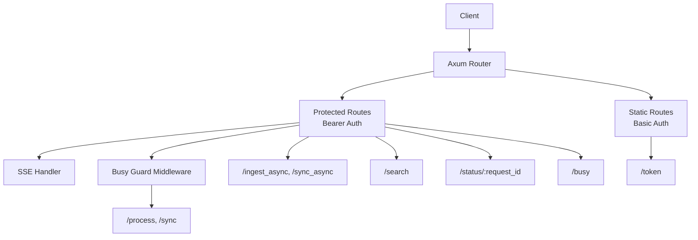
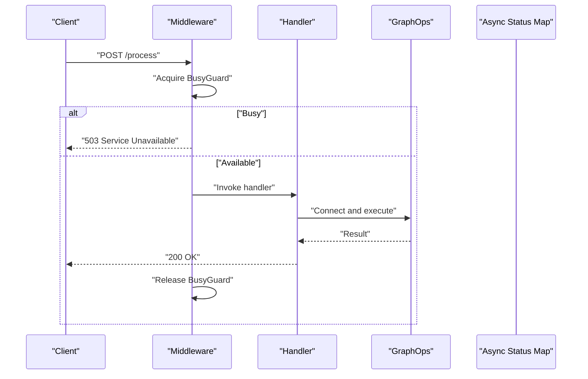
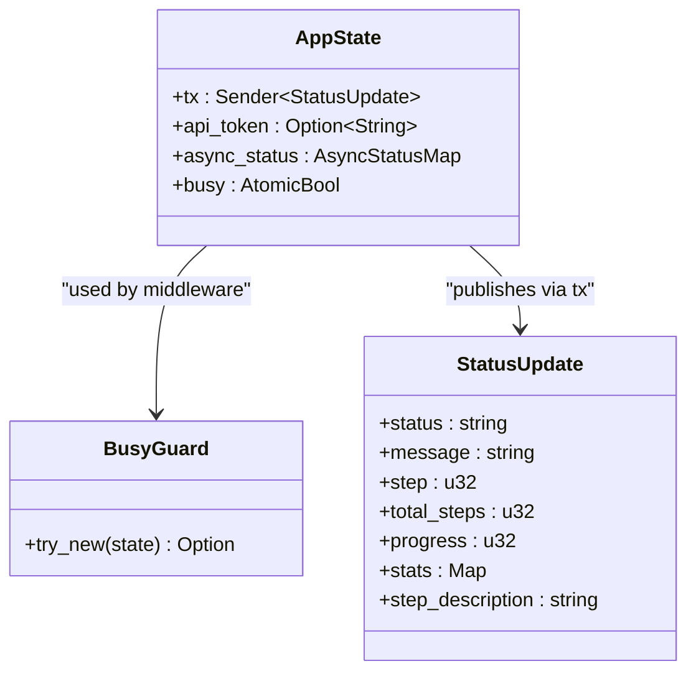

# API Reference

<cite>
**Referenced Files in This Document**
- [standalone/src/main.rs](file://standalone/src/main.rs)
- [standalone/src/handlers/mod.rs](file://standalone/src/handlers/mod.rs)
- [standalone/src/handlers/query.rs](file://standalone/src/handlers/query.rs)
- [standalone/src/handlers/vector.rs](file://standalone/src/handlers/vector.rs)
- [standalone/src/handlers/ingest.rs](file://standalone/src/handlers/ingest.rs)
- [standalone/src/handlers/status.rs](file://standalone/src/handlers/status.rs)
- [standalone/src/types.rs](file://standalone/src/types.rs)
- [standalone/src/auth.rs](file://standalone/src/auth.rs)
- [standalone/src/busy.rs](file://standalone/src/busy.rs)
- [standalone/src/webhook.rs](file://standalone/src/webhook.rs)
</cite>

## Table of Contents
1. [Introduction](#introduction)
2. [Project Structure](#project-structure)
3. [Core Components](#core-components)
4. [Architecture Overview](#architecture-overview)
5. [Detailed Component Analysis](#detailed-component-analysis)
6. [Dependency Analysis](#dependency-analysis)
7. [Performance Considerations](#performance-considerations)
8. [Troubleshooting Guide](#troubleshooting-guide)
9. [Conclusion](#conclusion)
10. [Appendices](#appendices)

## Introduction
This document describes the StakGraph HTTP API exposed by the standalone server. It covers synchronous and asynchronous endpoints for code processing and ingestion, vector similarity search, status polling, and Server-Sent Events (SSE). It also documents authentication, error handling, rate limiting via a busy guard, webhook delivery behavior, and operational configuration.

## Project Structure
The HTTP server is implemented in Rust using Axum. Routes are mounted under a single process, with authentication and busy-state middleware applied selectively. The server exposes:
- Synchronous endpoints behind a busy guard
- Asynchronous ingestion and sync endpoints with status tracking and optional callbacks
- Vector search endpoint
- SSE endpoint for live progress updates
- Token exchange endpoint for clients that authenticate with Basic to static assets

**Diagram sources**
- [standalone/src/main.rs:77-116](file://standalone/src/main.rs#L77-L116)
- [standalone/src/auth.rs:11-46](file://standalone/src/auth.rs#L11-L46)
- [standalone/src/auth.rs:48-87](file://standalone/src/auth.rs#L48-L87)

**Section sources**
- [standalone/src/main.rs:77-116](file://standalone/src/main.rs#L77-L116)
- [standalone/src/auth.rs:11-46](file://standalone/src/auth.rs#L11-L46)
- [standalone/src/auth.rs:48-87](file://standalone/src/auth.rs#L48-L87)

## Core Components
- Authentication
  - Bearer token: Authorization: Bearer <token> or X-API-Token header
  - Basic auth: for static assets; token exchange endpoint returns the bearer token
- Busy guard: prevents overlapping synchronous operations
- SSE: real-time progress updates for async operations
- Webhooks: optional HTTPS callbacks with HMAC signature and retries

**Section sources**
- [standalone/src/auth.rs:11-46](file://standalone/src/auth.rs#L11-L46)
- [standalone/src/auth.rs:48-87](file://standalone/src/auth.rs#L48-L87)
- [standalone/src/busy.rs:20-37](file://standalone/src/busy.rs#L20-L37)
- [standalone/src/webhook.rs:11-28](file://standalone/src/webhook.rs#L11-L28)

## Architecture Overview
The server initializes AppState containing:
- Broadcast channel for SSE
- Optional API token for auth
- Async status map for long-running jobs
- Atomic busy flag for synchronous operations

Routes are grouped:
- Public SSE and busy status
- Protected routes with Bearer auth
- Static routes with Basic auth and token exchange

**Diagram sources**
- [standalone/src/busy.rs:39-63](file://standalone/src/busy.rs#L39-L63)
- [standalone/src/handlers/ingest.rs:19-264](file://standalone/src/handlers/ingest.rs#L19-L264)

**Section sources**
- [standalone/src/main.rs:67-72](file://standalone/src/main.rs#L67-L72)
- [standalone/src/main.rs:77-116](file://standalone/src/main.rs#L77-L116)

## Detailed Component Analysis

### Authentication and Token Exchange
- Bearer authentication
  - Header: Authorization: Bearer <token>
  - Alternative: X-API-Token
  - Disabled if no API token is configured
- Basic authentication
  - Used for static assets
  - Accepts either username or password equal to the configured token
- Token exchange
  - Endpoint: GET /token
  - Returns { message, token, type: "bearer" } when API token is configured

Practical examples:
- Bearer: curl -H "Authorization: Bearer YOUR_TOKEN" https://host/api/search
- Basic: curl -u ":YOUR_TOKEN" https://host/token
- Token exchange: curl -u username:YOUR_TOKEN https://host/token

**Section sources**
- [standalone/src/auth.rs:11-46](file://standalone/src/auth.rs#L11-L46)
- [standalone/src/auth.rs:48-87](file://standalone/src/auth.rs#L48-L87)
- [standalone/src/auth.rs:89-105](file://standalone/src/auth.rs#L89-L105)
- [standalone/src/main.rs:123](file://standalone/src/main.rs#L123)

### POST /process (Synchronous)
Purpose: Synchronously process a repository and return graph statistics.

- Authentication: Required if API token configured
- Rate limiting: Enforced by BusyGuard; concurrent requests rejected
- Request body: ProcessBody
- Response: ProcessResponse { nodes, edges }
- Errors:
  - 401 Unauthorized (if auth required)
  - 503 Service Unavailable when system busy
  - 5xx on internal errors

Request schema (ProcessBody):
- repo_url: string, optional
- repo_path: string, optional
- username: string, optional
- pat: string, optional
- use_lsp: boolean, optional
- commit: string, optional
- branch: string, optional
- callback_url: string, optional
- realtime: boolean, optional
- docs: string, optional
- mocks: string, optional
- embeddings: string, optional
- embeddings_limit: number, optional

Response schema (ProcessResponse):
- nodes: integer
- edges: integer

curl example:
- curl -X POST https://host/api/process -H "Authorization: Bearer YOUR_TOKEN" -H "Content-Type: application/json" -d '{...}'

JavaScript fetch example:
- fetch("https://host/api/process", { method: "POST", headers: {"Authorization":"Bearer YOUR_TOKEN","Content-Type":"application/json"}, body: JSON.stringify({...}) })

Notes:
- Only one repository supported for sync operations
- Git credentials validated before processing

**Section sources**
- [standalone/src/main.rs:82-90](file://standalone/src/main.rs#L82-L90)
- [standalone/src/busy.rs:20-37](file://standalone/src/busy.rs#L20-L37)
- [standalone/src/handlers/ingest.rs:19-264](file://standalone/src/handlers/ingest.rs#L19-L264)
- [standalone/src/types.rs:34-48](file://standalone/src/types.rs#L34-L48)
- [standalone/src/types.rs:50-53](file://standalone/src/types.rs#L50-L53)

### GET /search (Vector Similarity Search)
Purpose: Perform vector similarity search over indexed code nodes.

- Authentication: Required if API token configured
- Query parameters: VectorSearchParams
- Response: Array of VectorSearchResult { node, score }

Query parameters (VectorSearchParams):
- query: string (required)
- limit: integer, optional (default 10)
- node_types: comma-separated string, optional (e.g., "function,class")
- similarity_threshold: number, optional (default 0.7)
- language: string, optional

Response item schema (VectorSearchResult):
- node: NodeData (includes metadata, properties, etc.)
- score: number

curl example:
- curl "https://host/api/search?query=your+query&limit=5&similarity_threshold=0.7"

JavaScript fetch example:
- fetch("https://host/api/search?query=your+query&limit=5&similarity_threshold=0.7")

**Section sources**
- [standalone/src/handlers/query.rs:5-43](file://standalone/src/handlers/query.rs#L5-L43)
- [standalone/src/types.rs:104-111](file://standalone/src/types.rs#L104-L111)
- [standalone/src/types.rs:98-102](file://standalone/src/types.rs#L98-L102)

### POST /ingest (Asynchronous Repository Ingestion)
Purpose: Asynchronously ingest one or more repositories into the graph.

- Authentication: Required if API token configured
- Request body: ProcessBody
- Response: { request_id: string }
- Progress: SSE events and GET /status/:request_id
- Optional callback: HTTPS webhook with HMAC signature and retries

Behavior:
- Validates git credentials for all repositories
- Enforces single busy acquisition; rejects concurrent sync operations
- Publishes StatusUpdate events to SSE channel
- Stores AsyncRequestStatus keyed by request_id
- Optionally sends webhook on completion/failure

curl example:
- curl -X POST https://host/api/ingest -H "Authorization: Bearer YOUR_TOKEN" -H "Content-Type: application/json" -d '{...}'

JavaScript fetch example:
- fetch("https://host/api/ingest", { method: "POST", headers: {"Authorization":"Bearer YOUR_TOKEN","Content-Type":"application/json"}, body: JSON.stringify({...}) })

**Section sources**
- [standalone/src/main.rs:93-95](file://standalone/src/main.rs#L93-L95)
- [standalone/src/handlers/ingest.rs:267-507](file://standalone/src/handlers/ingest.rs#L267-L507)
- [standalone/src/types.rs:34-48](file://standalone/src/types.rs#L34-L48)
- [standalone/src/types.rs:83-89](file://standalone/src/types.rs#L83-L89)

### GET /status/:request_id (Async Operation Status)
Purpose: Poll for the status of an asynchronous operation.

- Authentication: Required if API token configured
- Path parameter: request_id (UUID string)
- Response: AsyncRequestStatus
  - status: enum "InProgress" | "Complete" | "Failed"
  - result: ProcessResponse (present when Complete)
  - progress: integer percentage
  - update: StatusUpdate (current step and message)
- Errors:
  - 404 Not Found if request_id unknown

curl example:
- curl https://host/api/status/YOUR_REQUEST_ID

JavaScript fetch example:
- fetch("https://host/api/status/YOUR_REQUEST_ID")

**Section sources**
- [standalone/src/handlers/status.rs:22-40](file://standalone/src/handlers/status.rs#L22-L40)
- [standalone/src/types.rs:76-89](file://standalone/src/types.rs#L76-L89)
- [standalone/src/types.rs:50-53](file://standalone/src/types.rs#L50-L53)

### GET /events (Server-Sent Events)
Purpose: Subscribe to live progress updates for async operations.

- Authentication: Required if API token configured
- Response: text/event-stream
- Headers: CORS-friendly caching and buffering headers
- Event data: StatusUpdate serialized as JSON string
- Keep-alive: ping every 500ms

curl example:
- curl -N https://host/api/events

JavaScript fetch example:
- const ev = new EventSource("https://host/api/events");
- ev.onmessage = (event) => console.log(JSON.parse(event.data));

Event types and payload:
- Data field: StatusUpdate JSON string
- Id field: millisecond timestamp
- No explicit named event types; clients should parse data

**Section sources**
- [standalone/src/handlers/status.rs:42-85](file://standalone/src/handlers/status.rs#L42-L85)
- [standalone/src/types.rs:1-14](file://standalone/src/types.rs#L1-L14)

### GET /busy (Busy Status Monitoring)
Purpose: Check if the server is currently processing a synchronous request.

- Response: { busy: boolean }
- No authentication required

curl example:
- curl https://host/api/busy

JavaScript fetch example:
- fetch("https://host/api/busy")

**Section sources**
- [standalone/src/handlers/status.rs:16-21](file://standalone/src/handlers/status.rs#L16-L21)
- [standalone/src/main.rs:78](file://standalone/src/main.rs#L78)

### POST /embed_code (Vector Embedding)
Purpose: Trigger embedding of code bodies for vector search.

- Authentication: Required if API token configured
- Query parameters: EmbedCodeParams
- Response: { status: "completed" }

Query parameters (EmbedCodeParams):
- files: boolean, optional

curl example:
- curl "https://host/api/embed_code?files=true"

JavaScript fetch example:
- fetch("https://host/api/embed_code?files=true")

**Section sources**
- [standalone/src/handlers/vector.rs:5-13](file://standalone/src/handlers/vector.rs#L5-L13)
- [standalone/src/types.rs:93-96](file://standalone/src/types.rs#L93-L96)

## Dependency Analysis
Key runtime dependencies and their roles:
- AppState: shared state across handlers (broadcast sender, API token, async status map, busy flag)
- BusyGuard: atomic busy flag enforcement for synchronous endpoints
- SSE channel: broadcast of StatusUpdate for progress
- Webhook delivery: optional HTTPS callbacks with HMAC signature and retry logic

**Diagram sources**
- [standalone/src/types.rs:20-26](file://standalone/src/types.rs#L20-L26)
- [standalone/src/busy.rs:10-37](file://standalone/src/busy.rs#L10-L37)
- [standalone/src/types.rs:1-14](file://standalone/src/types.rs#L1-L14)

**Section sources**
- [standalone/src/types.rs:20-26](file://standalone/src/types.rs#L20-L26)
- [standalone/src/busy.rs:10-37](file://standalone/src/busy.rs#L10-L37)

## Performance Considerations
- Concurrency control: Synchronous endpoints are guarded by a single busy flag; concurrent requests receive 503
- SSE throughput: Broadcast channel is consumed to keep message rates high
- Payload sizes: No explicit request body size limits are enforced in handlers; practical limits depend on deployment resources
- Timeouts: Webhook delivery uses configurable timeout and retry behavior controlled by environment variables

[No sources needed since this section provides general guidance]

## Troubleshooting Guide
Common issues and resolutions:
- 401 Unauthorized
  - Cause: Missing or invalid Bearer/X-API-Token
  - Resolution: Provide correct token or disable auth by configuring API token
- 403 Forbidden (static routes)
  - Cause: Basic auth challenge not satisfied
  - Resolution: Use Basic with either username or password equal to the token
- 404 Not Found
  - Cause: GET /status/:request_id for unknown request_id
  - Resolution: Ensure you use the request_id returned by /ingest or /sync
- 429/5xx during webhook delivery
  - Cause: Callback endpoint unavailable or rate-limited
  - Resolution: Configure WEBHOOK_SECRET, WEBHOOK_MAX_RETRIES, WEBHOOK_TIMEOUT_MS; ensure HTTPS unless ALLOW_INSECURE_WEBHOOKS=true
- 503 Service Unavailable
  - Cause: System busy processing another synchronous request
  - Resolution: Retry later or use asynchronous endpoints

**Section sources**
- [standalone/src/auth.rs:11-46](file://standalone/src/auth.rs#L11-L46)
- [standalone/src/auth.rs:48-87](file://standalone/src/auth.rs#L48-L87)
- [standalone/src/handlers/status.rs:22-40](file://standalone/src/handlers/status.rs#L22-L40)
- [standalone/src/webhook.rs:11-28](file://standalone/src/webhook.rs#L11-L28)
- [standalone/src/webhook.rs:38-128](file://standalone/src/webhook.rs#L38-L128)
- [standalone/src/busy.rs:44-59](file://standalone/src/busy.rs#L44-L59)

## Conclusion
StakGraph provides a cohesive HTTP API for synchronous and asynchronous repository processing, vector search, and live progress updates. Authentication is optional but strongly recommended. Use the busy guard and SSE endpoints to coordinate long-running operations, and configure webhooks for automated notifications.

[No sources needed since this section summarizes without analyzing specific files]

## Appendices

### Endpoint Summary
- POST /process: Synchronous processing; requires auth if enabled
- GET /search: Vector similarity search; requires auth if enabled
- POST /ingest: Asynchronous ingestion; returns request_id
- GET /status/:request_id: Poll async status
- GET /events: SSE progress stream
- GET /busy: Busy status check
- POST /embed_code: Trigger embeddings
- GET /token: Token exchange (Basic auth required)

**Section sources**
- [standalone/src/main.rs:77-116](file://standalone/src/main.rs#L77-L116)
- [standalone/src/handlers/query.rs:5-43](file://standalone/src/handlers/query.rs#L5-L43)
- [standalone/src/handlers/ingest.rs:267-507](file://standalone/src/handlers/ingest.rs#L267-L507)
- [standalone/src/handlers/status.rs:16-85](file://standalone/src/handlers/status.rs#L16-L85)
- [standalone/src/handlers/vector.rs:5-13](file://standalone/src/handlers/vector.rs#L5-L13)
- [standalone/src/auth.rs:89-105](file://standalone/src/auth.rs#L89-L105)

### Operational Configuration
- API token
  - Environment: API_TOKEN
  - Effect: Enables Bearer and Basic auth for respective routes
- Port binding
  - Environment: PORT (default 7799)
- Webhook delivery
  - WEBHOOK_SECRET: HMAC secret for signatures
  - WEBHOOK_MAX_RETRIES: integer (default 3)
  - WEBHOOK_TIMEOUT_MS: integer (default 8000)
  - ALLOW_INSECURE_WEBHOOKS: "true" allows http callback_url
- SSE headers
  - Cache-Control, Connection, Content-Type, X-Accel-Buffering, X-Proxy-Buffering, Access-Control-Allow-Origin/Hdr

**Section sources**
- [standalone/src/main.rs:58-65](file://standalone/src/main.rs#L58-L65)
- [standalone/src/main.rs:159-160](file://standalone/src/main.rs#L159-L160)
- [standalone/src/webhook.rs:44-53](file://standalone/src/webhook.rs#L44-L53)
- [standalone/src/handlers/status.rs:68-76](file://standalone/src/handlers/status.rs#L68-L76)