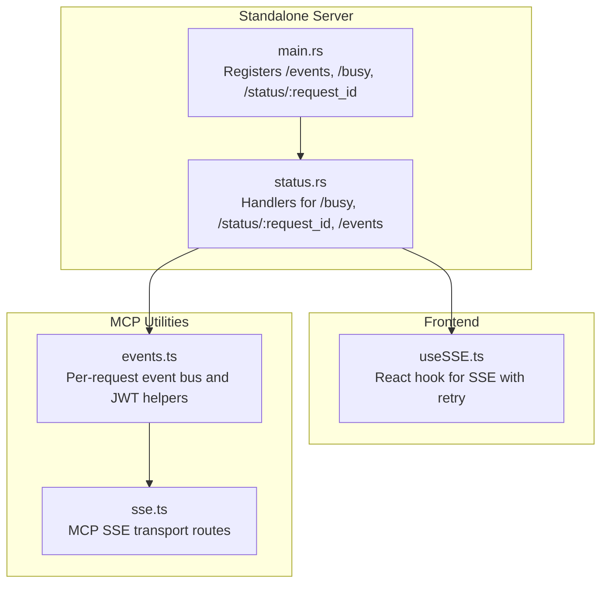
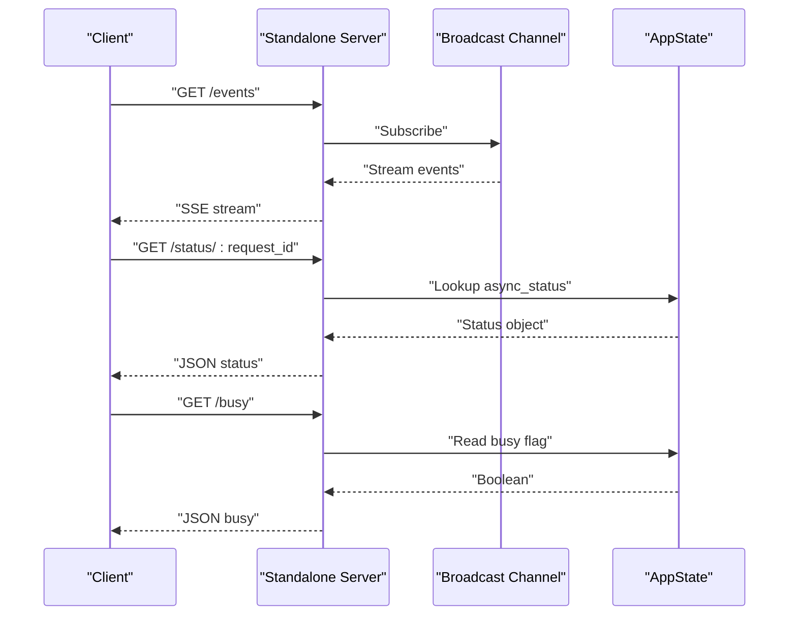
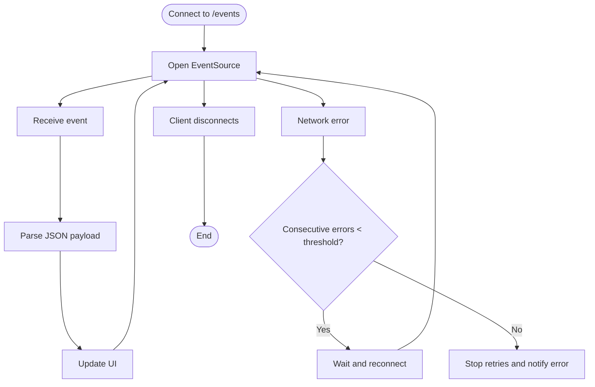
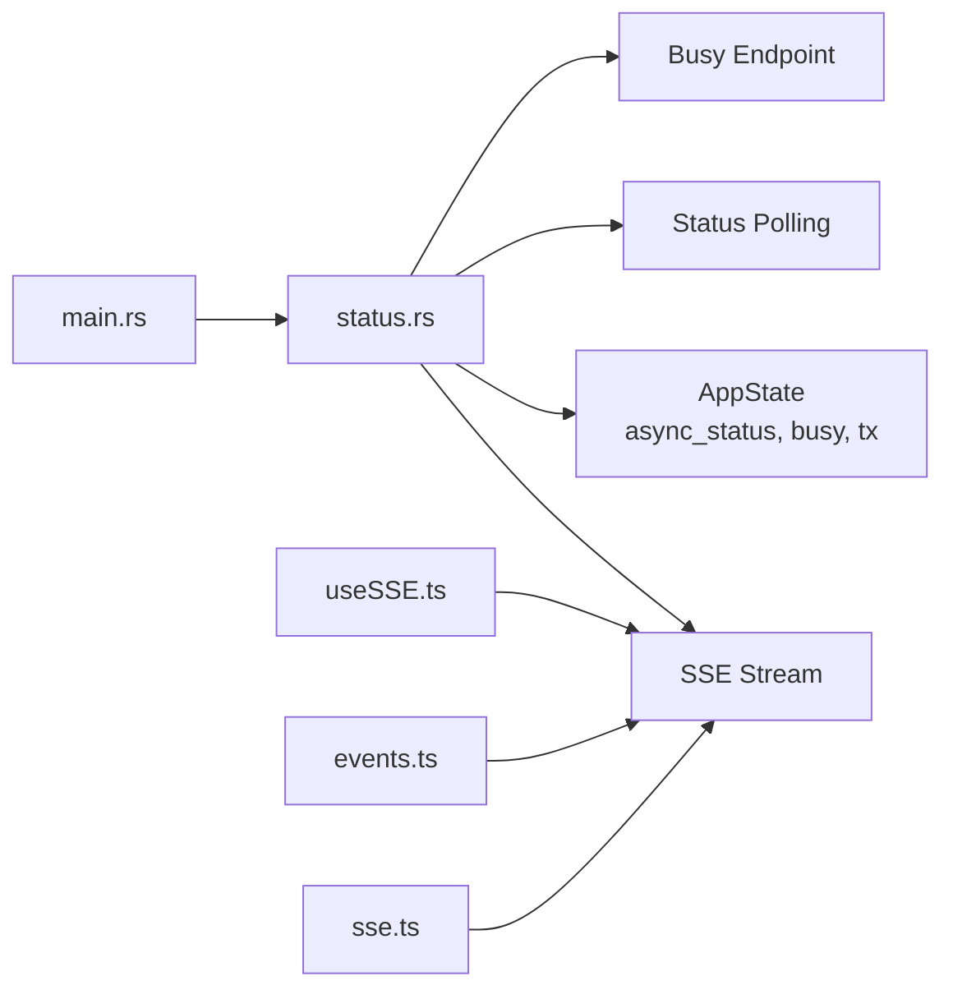

# Async Operations

<cite>
**Referenced Files in This Document**
- [standalone/src/main.rs](file://standalone/src/main.rs)
- [standalone/src/handlers/status.rs](file://standalone/src/handlers/status.rs)
- [mcp/src/repo/events.ts](file://mcp/src/repo/events.ts)
- [mcp/src/tools/sse.ts](file://mcp/src/tools/sse.ts)
- [mcp/web/src/hooks/useSSE.ts](file://mcp/web/src/hooks/useSSE.ts)
</cite>

## Table of Contents
1. [Introduction](#introduction)
2. [Project Structure](#project-structure)
3. [Core Components](#core-components)
4. [Architecture Overview](#architecture-overview)
5. [Detailed Component Analysis](#detailed-component-analysis)
6. [Dependency Analysis](#dependency-analysis)
7. [Performance Considerations](#performance-considerations)
8. [Troubleshooting Guide](#troubleshooting-guide)
9. [Conclusion](#conclusion)

## Introduction
This document provides comprehensive API documentation for StakGraph asynchronous operation endpoints. It covers:
- GET /status/:request_id for polling operation status with response codes indicating queued, processing, completed, and failed states
- GET /events for Server-Sent Events (SSE) connections with event stream management and client reconnection strategies
- Status response schemas with progress indicators, intermediate results, and error details
- Busy state monitoring via GET /busy
- Token-based authentication for SSE endpoints
- Connection lifecycle management, including timeouts, retries, and graceful degradation

## Project Structure
The asynchronous operation APIs are implemented in the standalone server and integrated with frontend and MCP utilities:
- Standalone server registers SSE and status endpoints and manages a global broadcast channel for event streaming
- Frontend hook provides robust SSE consumption with automatic retry and error handling
- MCP utilities demonstrate JWT-scoped tokens for SSE access and per-request event buses

**Diagram sources**
- [standalone/src/main.rs:77-116](file://standalone/src/main.rs#L77-L116)
- [standalone/src/handlers/status.rs:16-85](file://standalone/src/handlers/status.rs#L16-L85)
- [mcp/web/src/hooks/useSSE.ts:15-63](file://mcp/web/src/hooks/useSSE.ts#L15-L63)
- [mcp/src/repo/events.ts:15-174](file://mcp/src/repo/events.ts#L15-L174)
- [mcp/src/tools/sse.ts:8-59](file://mcp/src/tools/sse.ts#L8-L59)

**Section sources**
- [standalone/src/main.rs:77-116](file://standalone/src/main.rs#L77-L116)
- [standalone/src/handlers/status.rs:16-85](file://standalone/src/handlers/status.rs#L16-L85)

## Core Components
- SSE endpoint: GET /events publishes live updates to subscribers
- Status endpoint: GET /status/:request_id returns the current state for a given request ID
- Busy endpoint: GET /busy indicates whether synchronous operations are currently in progress
- Authentication: Bearer token middleware protects protected endpoints when API_TOKEN is configured

Key behaviors:
- SSE uses a broadcast channel to fan out events to all connected clients
- Status polling returns a JSON object keyed by request_id with current state
- Busy endpoint returns a simple boolean indicating system load

**Section sources**
- [standalone/src/main.rs:77-116](file://standalone/src/main.rs#L77-L116)
- [standalone/src/handlers/status.rs:16-40](file://standalone/src/handlers/status.rs#L16-L40)

## Architecture Overview
The async operation architecture centers around a broadcast channel and per-request state management:
- A global broadcast channel distributes events to all SSE subscribers
- Per-request state is stored in-memory under a request_id key
- Busy flag tracks whether synchronous operations are active

**Diagram sources**
- [standalone/src/main.rs:48-72](file://standalone/src/main.rs#L48-L72)
- [standalone/src/handlers/status.rs:16-85](file://standalone/src/handlers/status.rs#L16-L85)

## Detailed Component Analysis

### GET /status/:request_id
Purpose:
- Poll for the current status of an asynchronous operation identified by request_id

Behavior:
- Returns the stored status object if present
- Returns 404 with an error message if the request_id is not found

Response schema (example):
- Fields include status, message, step, total_steps, progress, optional stats, and step_description
- Additional fields may be included depending on the operation type

HTTP behavior:
- 200 OK with status object
- 404 Not Found with error field

Implementation highlights:
- Uses AppState.async_status map guarded by a mutex
- Retrieves value by request_id and returns JSON

**Section sources**
- [standalone/src/handlers/status.rs:22-40](file://standalone/src/handlers/status.rs#L22-L40)

### GET /events
Purpose:
- Establish an SSE connection to receive real-time updates

Behavior:
- Subscribes to the broadcast channel and streams events as Server-Sent Events
- Sends periodic keep-alive pings
- Sets appropriate headers for caching and proxy compatibility

Event model:
- Each event carries a data payload and a monotonic event ID
- Clients can reconnect using Last-Event-ID header to resume

Lifecycle:
- Stream continues until client disconnects or server closes the subscription
- Lagged messages are handled gracefully by skipping missed events

Headers:
- Content-Type: text/event-stream
- Cache-Control: no-cache, no-store, must-revalidate
- X-Accel-Buffering: no (nginx), X-Proxy-Buffering: no (other proxies)

**Section sources**
- [standalone/src/handlers/status.rs:42-85](file://standalone/src/handlers/status.rs#L42-L85)

### GET /busy
Purpose:
- Monitor system busy state for synchronous operations

Behavior:
- Returns a JSON object containing a boolean busy flag

Use cases:
- Prevent initiating long-running synchronous operations when the system is overloaded
- Integrate with frontends to show user feedback during busy periods

**Section sources**
- [standalone/src/handlers/status.rs:16-21](file://standalone/src/handlers/status.rs#L16-L21)

### Token-Based Authentication for SSE
When API_TOKEN is configured:
- Protected routes require Bearer token authentication
- SSE endpoints are part of the protected route set
- Clients must obtain a valid token before connecting

Note:
- The SSE implementation itself does not embed tokens; authentication is enforced at the route level

**Section sources**
- [standalone/src/main.rs:109-115](file://standalone/src/main.rs#L109-L115)

### Status Response Schema
The status object returned by GET /status/:request_id follows a common pattern:
- status: string indicating current phase (queued, processing, completed, failed)
- message: human-readable description of the current state
- step: integer representing the current step index
- total_steps: integer representing the total number of steps
- progress: number between 0 and 100 indicating completion percentage
- stats: optional object containing operation-specific metrics
- step_description: optional string describing the current step

Intermediate results:
- Operations may emit incremental updates reflecting partial progress
- Error details are included when status is failed

**Section sources**
- [mcp/web/src/hooks/useSSE.ts:3-11](file://mcp/web/src/hooks/useSSE.ts#L3-L11)

### Busy State Monitoring
The busy endpoint provides a simple boolean indicator:
- busy: true indicates synchronous operations are currently active
- busy: false indicates the system is idle

Frontend integration:
- Poll or subscribe to /busy to adjust UI state and prevent overlapping operations

**Section sources**
- [standalone/src/handlers/status.rs:16-21](file://standalone/src/handlers/status.rs#L16-L21)

### Connection Lifecycle Management
SSE connection lifecycle:
- Client establishes connection via GET /events
- Server sends events as they arrive on the broadcast channel
- Client may reconnect using Last-Event-ID to resume
- Server handles lagged messages and closed subscriptions gracefully

Client-side reconnection:
- The React hook establishes an EventSource connection
- On error, it retries with exponential backoff up to a threshold
- On reaching the error threshold, it invokes an error callback

**Diagram sources**
- [mcp/web/src/hooks/useSSE.ts:25-62](file://mcp/web/src/hooks/useSSE.ts#L25-L62)

**Section sources**
- [mcp/web/src/hooks/useSSE.ts:15-63](file://mcp/web/src/hooks/useSSE.ts#L15-L63)

### Practical Examples

#### Async Workflow Implementation (Client)
- Initiate an async operation and capture the returned request_id
- Poll GET /status/:request_id at intervals to track progress
- Optionally monitor GET /busy to avoid overlapping synchronous operations
- Connect to GET /events to receive real-time updates

#### Event Listener Setup (Frontend)
- Use the React hook to connect to SSE
- Implement onMessage to handle incoming status updates
- Implement onError to surface connection issues and trigger fallback behavior

#### Error Recovery Patterns
- If SSE connection fails repeatedly, switch to polling or degrade to a simplified UI
- On receiving a failed status, surface actionable error messages and provide retry options
- Use busy state to defer operations until the system becomes idle

**Section sources**
- [mcp/web/src/hooks/useSSE.ts:15-63](file://mcp/web/src/hooks/useSSE.ts#L15-L63)
- [standalone/src/handlers/status.rs:22-40](file://standalone/src/handlers/status.rs#L22-L40)

## Dependency Analysis
The following diagram shows the relationships among the key components involved in async operations:

**Diagram sources**
- [standalone/src/main.rs:67-72](file://standalone/src/main.rs#L67-L72)
- [standalone/src/handlers/status.rs:16-85](file://standalone/src/handlers/status.rs#L16-L85)
- [mcp/web/src/hooks/useSSE.ts:15-63](file://mcp/web/src/hooks/useSSE.ts#L15-L63)
- [mcp/src/repo/events.ts:94-110](file://mcp/src/repo/events.ts#L94-L110)
- [mcp/src/tools/sse.ts:8-27](file://mcp/src/tools/sse.ts#L8-L27)

**Section sources**
- [standalone/src/main.rs:67-72](file://standalone/src/main.rs#L67-L72)
- [standalone/src/handlers/status.rs:16-85](file://standalone/src/handlers/status.rs#L16-L85)

## Performance Considerations
- SSE throughput: The broadcast channel fan-out is optimized by consuming a dummy receiver to keep message rates high
- Keep-alive: Periodic ping messages maintain connection liveness and detect dead peers
- Header configuration: Disables proxy buffering to ensure real-time delivery
- Memory footprint: In-memory status map scales with concurrent requests; consider pruning old entries in production deployments

[No sources needed since this section provides general guidance]

## Troubleshooting Guide
Common issues and resolutions:
- 404 Not Found on /status/:request_id
  - Cause: request_id not found or operation completed and removed
  - Resolution: Ensure the request_id matches the original async initiation; poll only while the operation is in progress

- SSE connection drops frequently
  - Cause: Network instability or proxy buffering
  - Resolution: Verify headers disable proxy buffering; implement client-side retry with backoff

- Busy flag remains true
  - Cause: Long-running synchronous operation still in progress
  - Resolution: Wait for completion or cancel the operation if supported

- Authentication failures
  - Cause: API_TOKEN configured but missing/invalid Bearer token
  - Resolution: Provide a valid token when API_TOKEN is set

**Section sources**
- [standalone/src/handlers/status.rs:22-40](file://standalone/src/handlers/status.rs#L22-L40)
- [standalone/src/handlers/status.rs:42-85](file://standalone/src/handlers/status.rs#L42-L85)
- [standalone/src/main.rs:109-115](file://standalone/src/main.rs#L109-L115)

## Conclusion
StakGraph provides a robust foundation for asynchronous operations with:
- Predictable status polling via GET /status/:request_id
- Real-time updates through GET /events with resilient client reconnection
- Busy state monitoring to coordinate system load
- Optional token-based authentication for secure access

By combining these endpoints with client-side retry logic and busy-aware orchestration, applications can implement reliable async workflows with graceful degradation under adverse conditions.