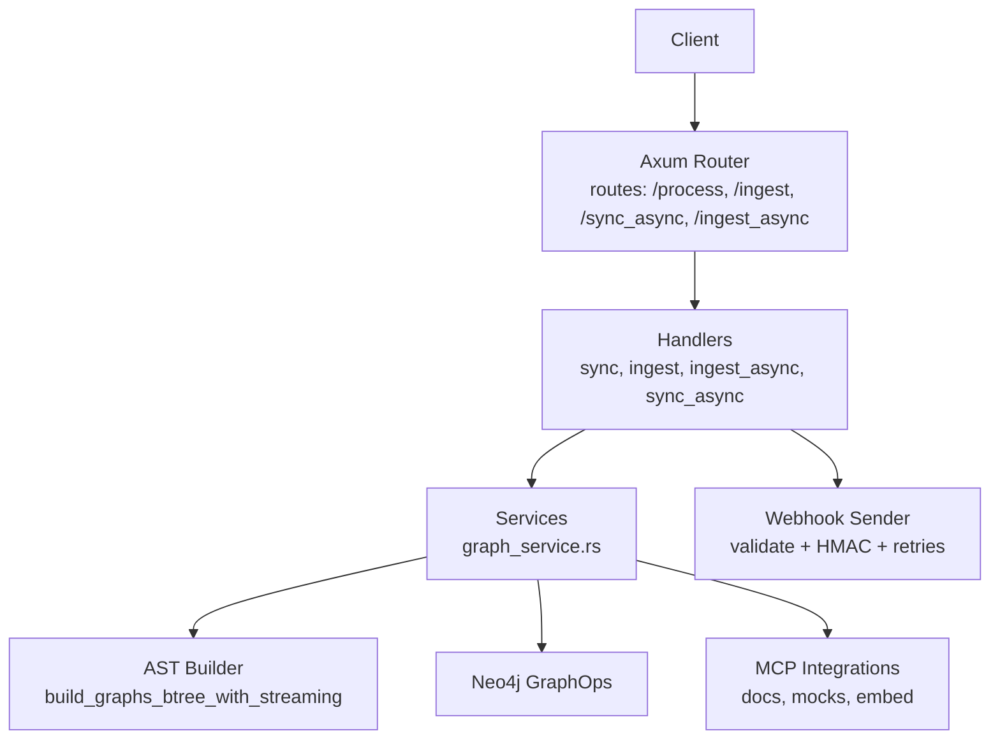
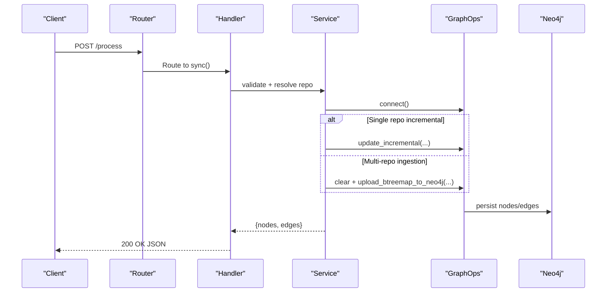
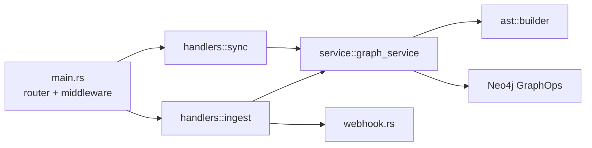

# Processing Endpoints

<cite>
**Referenced Files in This Document**
- [main.rs](file://standalone/src/main.rs)
- [types.rs](file://standalone/src/types.rs)
- [graph_service.rs](file://standalone/src/service/graph_service.rs)
- [ingest.rs](file://standalone/src/handlers/ingest.rs)
- [webhook.rs](file://standalone/src/webhook.rs)
- [utils.rs](file://ast/src/utils.rs)
</cite>

## Table of Contents
1. [Introduction](#introduction)
2. [Project Structure](#project-structure)
3. [Core Components](#core-components)
4. [Architecture Overview](#architecture-overview)
5. [Detailed Component Analysis](#detailed-component-analysis)
6. [Dependency Analysis](#dependency-analysis)
7. [Performance Considerations](#performance-considerations)
8. [Troubleshooting Guide](#troubleshooting-guide)
9. [Conclusion](#conclusion)

## Introduction
This document provides comprehensive API documentation for StakGraph’s processing endpoints focused on synchronous code analysis and repository ingestion. It covers:
- POST /process (alias /sync): Synchronous processing of a single repository with incremental updates and optional downstream AI steps.
- POST /ingest: Asynchronous ingestion of one or more repositories with progress tracking via server-sent events and optional webhook callbacks.

It specifies request/response schemas, parameter controls, encoding expectations, language-aware processing options, output formatting, and operational guidance including timeouts, payload limits, and concurrency handling.

## Project Structure
The processing endpoints are implemented in the standalone Axum server with handlers delegating to service-layer logic. Key components:
- Endpoint registration and middleware wiring in the main server module.
- Shared request/response types and state structures.
- Synchronous and asynchronous ingestion handlers.
- Service layer orchestrating cloning, graph building, Neo4j upload, and optional MCP integrations.
- Webhook utilities for secure, retryable notifications.

**Diagram sources**
- [main.rs:77-116](file://standalone/src/main.rs#L77-L116)
- [ingest.rs:18-264](file://standalone/src/handlers/ingest.rs#L18-L264)
- [graph_service.rs:14-206](file://standalone/src/service/graph_service.rs#L14-L206)
- [webhook.rs:11-129](file://standalone/src/webhook.rs#L11-L129)

**Section sources**
- [main.rs:77-116](file://standalone/src/main.rs#L77-L116)

## Core Components
- Endpoint routing and middleware:
  - /process and /sync are registered under a busy-middleware-protected group for synchronous operations.
  - /ingest is registered similarly; async variants (/sync_async, /ingest_async) spawn background tasks and return request IDs.
- Request body schema (ProcessBody):
  - Supports repository selection via repo_url or repo_path, credentials, LSP toggle, commit/branch targeting, webhook/callback configuration, real-time streaming toggle, and downstream AI options (docs, mocks, embeddings) with an embeddings limit.
- Response schema (ProcessResponse):
  - Returns node and edge counts produced by the operation.
- Webhook payload schema (WebhookPayload):
  - Provides structured completion/failure notifications with progress, timestamps, and result metadata.

**Section sources**
- [main.rs:82-95](file://standalone/src/main.rs#L82-L95)
- [types.rs:33-64](file://standalone/src/types.rs#L33-L64)
- [graph_service.rs:208-350](file://standalone/src/service/graph_service.rs#L208-L350)
- [webhook.rs:55-78](file://standalone/src/webhook.rs#L55-L78)

## Architecture Overview
The synchronous endpoints (/process and /sync) perform:
- Repository resolution and validation.
- Optional incremental update for single-repo sync.
- AST graph construction and Neo4j upload.
- Optional downstream MCP steps (docs, mocks, embeddings).
- Response with node/edge counts.

Asynchronous endpoints (/ingest_async, /sync_async) mirror the above but:
- Spawn background tasks.
- Publish progress updates via a broadcast channel.
- Optionally notify a caller-supplied HTTPS callback endpoint with HMAC signatures and idempotency.

**Diagram sources**
- [main.rs:82-84](file://standalone/src/main.rs#L82-L84)
- [graph_service.rs:208-350](file://standalone/src/service/graph_service.rs#L208-L350)

## Detailed Component Analysis

### Endpoint: POST /process (alias /sync)
Purpose:
- Synchronously process a single repository with incremental updates when applicable, returning node and edge counts.

Request body (ProcessBody):
- repo_url: Optional; GitHub/GitLab-style URL for the repository.
- repo_path: Optional; local filesystem path to an already-cloned repository.
- username: Optional; credential username for private repositories.
- pat: Optional; personal access token for private repositories.
- use_lsp: Optional boolean; toggles LSP-based parsing.
- commit: Optional; target commit SHA for checkout.
- branch: Optional; target branch for checkout.
- callback_url: Optional; HTTPS callback URL for completion notifications.
- realtime: Optional boolean; enables streaming/batch behavior for ingestion.
- docs: Optional; triggers downstream docs generation for matching repositories.
- mocks: Optional; triggers downstream mocks generation for matching repositories.
- embeddings: Optional; triggers downstream embeddings generation for matching repositories.
- embeddings_limit: Optional numeric; limit for embedding operations.

Encoding expectations:
- Request body is JSON; UTF-8 recommended for string fields.
- Binary content is not accepted for this endpoint.

Behavior:
- Validates credentials for the single repository.
- If repository hash unchanged, returns cached node/edge deltas.
- Otherwise, performs incremental update and optionally calls downstream MCP steps.
- Returns ProcessResponse with node and edge counts.

Response:
- 200 OK with ProcessResponse { nodes, edges }.
- Error responses use standardized HTTP status codes mapped to shared error types.

Notes:
- This endpoint enforces single-repository mode; multi-repo requests are rejected.

**Section sources**
- [main.rs:82-84](file://standalone/src/main.rs#L82-L84)
- [types.rs:33-48](file://standalone/src/types.rs#L33-L48)
- [graph_service.rs:208-350](file://standalone/src/service/graph_service.rs#L208-L350)

### Endpoint: POST /ingest
Purpose:
- Asynchronously ingest one or more repositories, publishing progress updates and optionally notifying a callback URL.

Request body (ProcessBody):
- Same schema as /process; supports multi-repo via repo_url list semantics and repo_path list semantics.
- realtime: Optional boolean enabling streaming upload behavior.

Behavior:
- Validates multi-repo credentials.
- Spawns a background task to clone, detect languages, build AST graphs, upload to Neo4j, and optionally set properties.
- Publishes StatusUpdate messages via a broadcast channel for progress tracking.
- Optionally sends a WebhookPayload to the provided HTTPS callback URL with HMAC signature and idempotency headers.

Response:
- 202 Accepted with JSON { request_id }.
- Progress and completion can be polled via /status/:request_id.

**Section sources**
- [main.rs:85-85](file://standalone/src/main.rs#L85-L85)
- [types.rs:33-48](file://standalone/src/types.rs#L33-L48)
- [ingest.rs:267-507](file://standalone/src/handlers/ingest.rs#L267-L507)
- [graph_service.rs:14-206](file://standalone/src/service/graph_service.rs#L14-L206)
- [webhook.rs:11-129](file://standalone/src/webhook.rs#L11-L129)

### Request Body Schema: ProcessBody
- repo_url: String or list of strings (URLs).
- repo_path: String or list of strings (local paths).
- username: String.
- pat: String.
- use_lsp: Boolean.
- commit: String.
- branch: String.
- callback_url: String.
- realtime: Boolean.
- docs: String.
- mocks: String.
- embeddings: String.
- embeddings_limit: Number.

Constraints:
- Either repo_url or repo_path must be provided.
- For /sync, only a single repository is supported.
- For /ingest, multiple repositories are supported.

Encoding:
- UTF-8 recommended for textual fields.

**Section sources**
- [types.rs:33-48](file://standalone/src/types.rs#L33-L48)

### Response Schema: ProcessResponse
- nodes: Integer count of nodes produced.
- edges: Integer count of edges produced.

**Section sources**
- [types.rs:50-53](file://standalone/src/types.rs#L50-L53)

### Webhook Payload Schema: WebhookPayload
- request_id: String.
- status: String ("InProgress", "Complete", "Failed").
- progress: Integer percentage.
- result: Optional ProcessResponse { nodes, edges }.
- error: Optional error message string.
- started_at: RFC3339 timestamp.
- completed_at: RFC3339 timestamp.
- duration_ms: Integer milliseconds.

Signing and delivery:
- Signature header X-Signature uses HMAC-SHA256 over the JSON payload using WEBHOOK_SECRET.
- Idempotency handled via Idempotency-Key and X-Request-Id headers.
- Retries on 429/5xx with exponential backoff-like delays.

**Section sources**
- [types.rs:55-64](file://standalone/src/types.rs#L55-L64)
- [webhook.rs:38-129](file://standalone/src/webhook.rs#L38-L129)

### Endpoint: POST /ingest_async
Alias: /sync_async for single-repo mode.
- Returns request_id immediately.
- Background task performs the same work as /ingest or /sync respectively.
- Progress updates published via broadcast; completion/failure sent to callback_url if provided.

**Section sources**
- [main.rs:94-95](file://standalone/src/main.rs#L94-L95)
- [ingest.rs:18-264](file://standalone/src/handlers/ingest.rs#L18-L264)

### Endpoint: GET /status/:request_id
- Returns the current AsyncRequestStatus including status, progress, and latest StatusUpdate.
- Useful for polling progress for asynchronous operations.

**Section sources**
- [main.rs:99-99](file://standalone/src/main.rs#L99-L99)
- [types.rs:76-89](file://standalone/src/types.rs#L76-L89)

### Practical Examples

curl: Synchronous processing
- Single repository with incremental update:
  - curl -X POST http://localhost:7799/process -H "Content-Type: application/json" -d '{...}'
- With credentials and branch:
  - curl -X POST http://localhost:7799/process -H "Content-Type: application/json" -d '{...}'

curl: Asynchronous ingestion
- Multi-repo ingestion with callback:
  - curl -X POST http://localhost:7799/ingest -H "Content-Type: application/json" -d '{...}'

JavaScript fetch (browser/runtime)
- Example pattern:
  - fetch("http://localhost:7799/process", { method: "POST", headers: {"Content-Type": "application/json"}, body: JSON.stringify({...}) })
  - .then(r => r.json())
  - .then(data => console.log("Nodes:", data.nodes, "Edges:", data.edges));

Error handling
- Typical HTTP statuses:
  - 400 Bad Request for invalid repository configuration or multi-repo usage in /sync.
  - 401 Unauthorized if API_TOKEN is configured and missing/expired.
  - 409 Conflict if system is busy (busy middleware prevents overlapping synchronous operations).
  - 500 Internal Server Error for internal failures.

**Section sources**
- [main.rs:82-90](file://standalone/src/main.rs#L82-L90)
- [types.rs:241-270](file://standalone/src/types.rs#L241-L270)

## Dependency Analysis
- Router and middleware:
  - Routes are grouped under busy-protected and async groups; authentication middleware is applied conditionally when API_TOKEN is present.
- Handler-to-service coupling:
  - Handlers depend on service functions for ingestion and synchronization.
- Service-to-AST and DB:
  - Services orchestrate AST graph building and Neo4j persistence.
- Webhook dependency:
  - Handlers optionally invoke webhook sender with HMAC signing and retries.

**Diagram sources**
- [main.rs:77-116](file://standalone/src/main.rs#L77-L116)
- [ingest.rs:18-264](file://standalone/src/handlers/ingest.rs#L18-L264)
- [graph_service.rs:14-206](file://standalone/src/service/graph_service.rs#L14-L206)
- [webhook.rs:11-129](file://standalone/src/webhook.rs#L11-L129)

**Section sources**
- [main.rs:77-116](file://standalone/src/main.rs#L77-L116)
- [graph_service.rs:14-206](file://standalone/src/service/graph_service.rs#L14-L206)

## Performance Considerations
- Streaming vs batch:
  - realtime=true enables streaming behavior during ingestion, reducing intermediate cleanup and property-setting overhead.
- Incremental updates:
  - /sync compares repository hashes and only processes diffs, minimizing compute when no code changes are detected.
- Progress reporting:
  - Broadcast channel emits StatusUpdate messages; clients can subscribe to SSE endpoint for live progress.
- Output formatting:
  - Optional JSONL or pretty-printed JSON dumping controlled by environment variables for diagnostics.

**Section sources**
- [graph_service.rs:75-138](file://standalone/src/service/graph_service.rs#L75-L138)
- [graph_service.rs:286-320](file://standalone/src/service/graph_service.rs#L286-L320)
- [utils.rs:17-51](file://ast/src/utils.rs#L17-L51)

## Troubleshooting Guide
Common issues and resolutions:
- Authentication failures:
  - Ensure API_TOKEN is set and Authorization header is included when enabled.
- Busy system:
  - Synchronous endpoints return 409 when another request is in progress; retry later.
- Invalid callback_url:
  - Must be absolute HTTPS URL; configure ALLOW_INSECURE_WEBHOOKS only for development.
- Webhook delivery failures:
  - Check WEBHOOK_SECRET, WEBHOOK_MAX_RETRIES, and WEBHOOK_TIMEOUT_MS; inspect server logs for retry attempts.
- Repository validation errors:
  - Verify repo_url/repo_path, credentials, and branch/commit correctness.
- Large payloads:
  - Keep request bodies minimal; avoid unnecessary fields; use repo_path for local repos to reduce network overhead.

Operational controls:
- Environment variables:
  - API_TOKEN: Enables bearer auth.
  - PORT: Server binding port (default 7799).
  - PRINT_ROOT: Directory for dumping graph JSONL outputs.
  - OUTPUT_FORMAT: jsonl or pretty-printed JSON.
  - USE_LSP: Toggle LSP usage.
  - WEBHOOK_SECRET, WEBHOOK_MAX_RETRIES, WEBHOOK_TIMEOUT_MS: Webhook behavior.
  - ALLOW_INSECURE_WEBHOOKS: Allow http callback URLs (default true if unset).

**Section sources**
- [main.rs:58-65](file://standalone/src/main.rs#L58-L65)
- [main.rs:159-160](file://standalone/src/main.rs#L159-L160)
- [webhook.rs:44-53](file://standalone/src/webhook.rs#L44-L53)
- [webhook.rs:11-28](file://standalone/src/webhook.rs#L11-L28)

## Conclusion
StakGraph provides robust synchronous and asynchronous processing endpoints for repository ingestion and code analysis. The synchronous endpoints offer immediate results for single-repo scenarios with incremental updates, while asynchronous endpoints support multi-repo ingestion with progress tracking and secure webhook notifications. By leveraging the documented schemas, environment controls, and error-handling patterns, clients can integrate reliably with predictable performance characteristics.