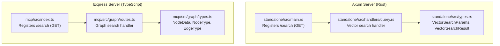
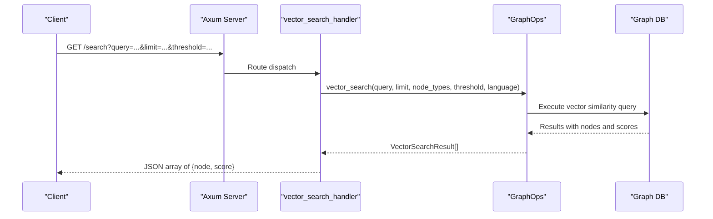
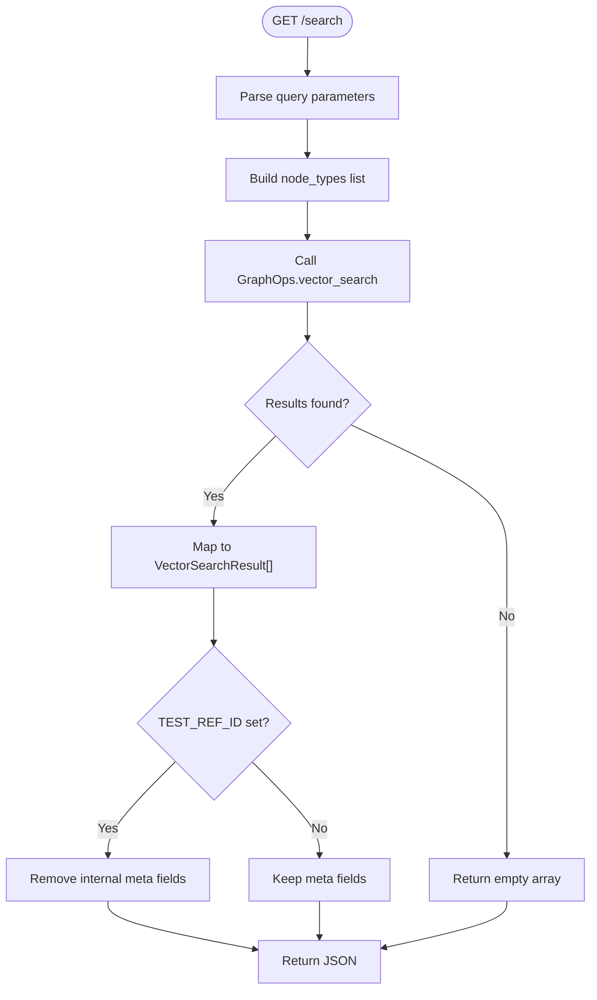
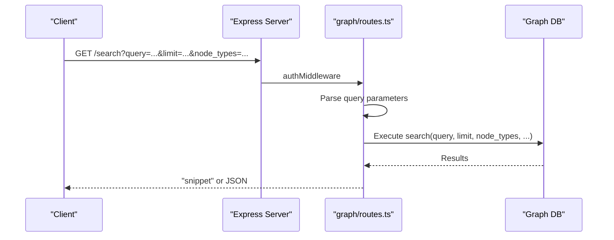
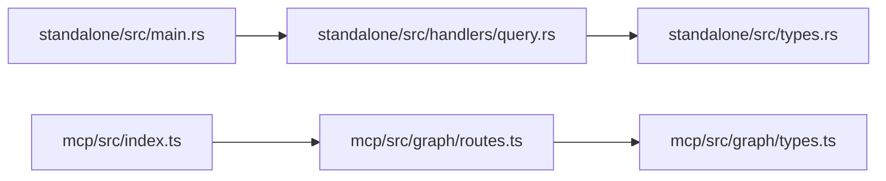

# Search Endpoints

<cite>
**Referenced Files in This Document**
- [main.rs](file://standalone/src/main.rs)
- [query.rs](file://standalone/src/handlers/query.rs)
- [vector.rs](file://standalone/src/handlers/vector.rs)
- [types.rs](file://standalone/src/types.rs)
- [routes.ts](file://mcp/src/graph/routes.ts)
- [types.ts](file://mcp/src/graph/types.ts)
- [index.ts](file://mcp/src/index.ts)
</cite>

## Table of Contents
1. [Introduction](#introduction)
2. [Project Structure](#project-structure)
3. [Core Components](#core-components)
4. [Architecture Overview](#architecture-overview)
5. [Detailed Component Analysis](#detailed-component-analysis)
6. [Dependency Analysis](#dependency-analysis)
7. [Performance Considerations](#performance-considerations)
8. [Troubleshooting Guide](#troubleshooting-guide)
9. [Conclusion](#conclusion)
10. [Appendices](#appendices)

## Introduction
This document provides comprehensive API documentation for StakGraph search endpoints. It covers:
- GET /search for vector similarity search with query parameters including search_text, limit, threshold, and language filters
- POST /query for structured graph queries with Cypher-like syntax and parameter binding
- Detailed response formats with similarity scores, node metadata, and relevance rankings
- Query optimization techniques, embedding model integration, and performance tuning options
- Practical examples showing semantic search patterns, hybrid search combining vector and graph queries, and pagination strategies
- Guidance on interpreting search results, confidence scoring, and filtering mechanisms

## Project Structure
StakGraph exposes search capabilities through two primary servers:
- Standalone Axum server (Rust) with a vector similarity search endpoint
- MCP Express server (TypeScript) with a graph search endpoint and additional graph utilities

**Diagram sources**
- [main.rs:77-107](file://standalone/src/main.rs#L77-L107)
- [query.rs:1-44](file://standalone/src/handlers/query.rs#L1-L44)
- [types.rs:98-111](file://standalone/src/types.rs#L98-L111)
- [index.ts:136-168](file://mcp/src/index.ts#L136-L168)
- [routes.ts:617-657](file://mcp/src/graph/routes.ts#L617-L657)
- [types.ts:1-429](file://mcp/src/graph/types.ts#L1-L429)

**Section sources**
- [main.rs:77-107](file://standalone/src/main.rs#L77-L107)
- [index.ts:136-168](file://mcp/src/index.ts#L136-L168)

## Core Components
- Vector similarity search (Axum):
  - Endpoint: GET /search
  - Purpose: Semantic search over stored embeddings using similarity thresholds and optional language filters
  - Parameters: query, limit, node_types, similarity_threshold, language
  - Response: Array of items with node metadata and similarity score
- Graph search (Express):
  - Endpoint: GET /search
  - Purpose: Structured graph search supporting node types, limits, concise output, and language filters
  - Parameters: query, limit, node_types, method, output, tests, max_tokens, language
  - Response: Snippet or JSON depending on output format

**Section sources**
- [query.rs:5-43](file://standalone/src/handlers/query.rs#L5-L43)
- [types.rs:104-111](file://standalone/src/types.rs#L104-L111)
- [routes.ts:617-657](file://mcp/src/graph/routes.ts#L617-L657)
- [types.ts:23-34](file://mcp/src/graph/types.ts#L23-L34)

## Architecture Overview
The search architecture integrates vector similarity retrieval and graph traversal. The Axum server performs vector similarity search against stored embeddings, while the Express server executes graph-centric queries with support for node types and output formats.

**Diagram sources**
- [main.rs](file://standalone/src/main.rs#L102)
- [query.rs:5-43](file://standalone/src/handlers/query.rs#L5-L43)

## Detailed Component Analysis

### Vector Similarity Search (Axum: GET /search)
- Endpoint: GET /search
- Authentication: Optional bearer/basic auth if API_TOKEN is configured
- Query parameters:
  - query (required): Text to search
  - limit (optional): Maximum results (default applied by handler)
  - node_types (optional): Comma-separated node types to constrain search
  - similarity_threshold (optional): Minimum similarity score
  - language (optional): Language filter
- Response format:
  - Array of objects with:
    - node: NodeData (includes name, file, body, start, end, docs, hash, verb, date_added_to_graph, and arbitrary metadata)
    - score: f64 similarity score
- Behavior:
  - Handler constructs node_types from comma-separated string
  - Calls GraphOps.vector_search with parsed parameters
  - Optionally strips internal metadata during tests

**Diagram sources**
- [query.rs:5-43](file://standalone/src/handlers/query.rs#L5-L43)
- [types.rs:98-111](file://standalone/src/types.rs#L98-L111)

**Section sources**
- [main.rs](file://standalone/src/main.rs#L102)
- [query.rs:5-43](file://standalone/src/handlers/query.rs#L5-L43)
- [types.rs:98-111](file://standalone/src/types.rs#L98-L111)

### Graph Search (Express: GET /search)
- Endpoint: GET /search
- Authentication: Middleware checks x-api-token or Basic Auth
- Query parameters:
  - query (required): Search text
  - limit (optional): Maximum results
  - node_types or node_type (optional): One or more node types
  - method (optional): Search method
  - output (optional): "snippet" or JSON
  - tests (optional): Boolean toggle
  - max_tokens (optional): Token budget for processing
  - language (optional): Language filter
- Response format:
  - If output=snippet: Plain text snippet
  - Otherwise: JSON with results
- Behavior:
  - Parses node_types from query string or single node_type
  - Invokes graph search with provided parameters
  - Supports concise output and language filtering

**Diagram sources**
- [index.ts:136-168](file://mcp/src/index.ts#L136-L168)
- [routes.ts:617-657](file://mcp/src/graph/routes.ts#L617-L657)

**Section sources**
- [index.ts:136-168](file://mcp/src/index.ts#L136-L168)
- [routes.ts:617-657](file://mcp/src/graph/routes.ts#L617-L657)

### Structured Graph Queries (POST /query)
Note: The repository does not expose a POST /query endpoint. The closest equivalent is the GET /search on the Express server for graph queries. If you require a POST variant, it would need to be implemented by adding a new route and handler similar to the existing GET /search pattern.

[No sources needed since this section clarifies absence of a specific endpoint]

## Dependency Analysis
- Axum server depends on:
  - Handlers for routing and parameter parsing
  - Types for request/response models
  - GraphOps for vector similarity operations
- Express server depends on:
  - Routes for endpoint definitions
  - Types for node/edge models and enumerations
  - Middleware for authentication and logging

**Diagram sources**
- [main.rs:77-107](file://standalone/src/main.rs#L77-L107)
- [query.rs:1-44](file://standalone/src/handlers/query.rs#L1-L44)
- [types.rs:1-283](file://standalone/src/types.rs#L1-L283)
- [index.ts:136-168](file://mcp/src/index.ts#L136-L168)
- [routes.ts:1-1251](file://mcp/src/graph/routes.ts#L1-L1251)
- [types.ts:1-429](file://mcp/src/graph/types.ts#L1-L429)

**Section sources**
- [main.rs:77-107](file://standalone/src/main.rs#L77-L107)
- [index.ts:136-168](file://mcp/src/index.ts#L136-L168)

## Performance Considerations
- Vector similarity search
  - Adjust limit to control result cardinality and reduce downstream processing
  - Tune similarity_threshold to balance precision and recall
  - Filter by node_types to narrow the search space
  - Use language parameter to restrict embeddings to relevant languages
- Graph search
  - Prefer concise output for lightweight responses
  - Limit max_tokens to control processing cost
  - Use node_types to constrain traversal breadth
- Embedding model integration
  - Ensure embeddings are precomputed and indexed for efficient similarity retrieval
  - Consider caching frequently accessed vectors
- Pagination strategies
  - Use limit and subsequent offsets for iterative retrieval
  - Apply similarity_threshold to filter low-confidence matches early
- Monitoring
  - Track request latency and error rates
  - Observe token usage and budget limits when applicable

[No sources needed since this section provides general guidance]

## Troubleshooting Guide
- Authentication failures
  - Verify API_TOKEN presence and correct usage of bearer/basic auth
  - Check x-api-token header or Authorization header format
- Parameter validation
  - Ensure required parameters are present (e.g., query)
  - Confirm numeric parameters (limit, max_tokens) are valid
- Response anomalies
  - For Axum GET /search, confirm node_types are valid and comma-separated
  - For Express GET /search, ensure output format is supported
- Internal errors
  - Inspect server logs for stack traces
  - Validate graph connectivity and indexes

**Section sources**
- [main.rs:110-115](file://standalone/src/main.rs#L110-L115)
- [index.ts:87-122](file://mcp/src/index.ts#L87-L122)
- [routes.ts:617-657](file://mcp/src/graph/routes.ts#L617-L657)

## Conclusion
StakGraph provides complementary search capabilities:
- Vector similarity search via GET /search (Axum) for semantic retrieval with configurable thresholds and filters
- Graph search via GET /search (Express) for structured traversal with node types and output controls

By combining these endpoints and applying the recommended optimization techniques, you can implement robust semantic and hybrid search experiences tailored to your application’s needs.

[No sources needed since this section summarizes without analyzing specific files]

## Appendices

### API Reference: Vector Similarity Search (Axum)
- Method: GET
- Path: /search
- Query parameters:
  - query (string, required)
  - limit (integer, optional)
  - node_types (string, optional; comma-separated)
  - similarity_threshold (number, optional)
  - language (string, optional)
- Response: Array of objects with node and score
- Example request:
  - GET /search?query=example&limit=20&similarity_threshold=0.7&language=rust
- Notes:
  - Node types are parsed from a comma-separated string
  - During tests, internal metadata may be stripped

**Section sources**
- [main.rs](file://standalone/src/main.rs#L102)
- [query.rs:5-43](file://standalone/src/handlers/query.rs#L5-L43)
- [types.rs:104-111](file://standalone/src/types.rs#L104-L111)

### API Reference: Graph Search (Express)
- Method: GET
- Path: /search
- Query parameters:
  - query (string, required)
  - limit (integer, optional)
  - node_types (string, optional; comma-separated) or node_type (single type)
  - method (enum, optional)
  - output (string, optional; "snippet" or JSON)
  - tests (boolean, optional)
  - max_tokens (integer, optional)
  - language (string, optional)
- Response: Snippet or JSON depending on output
- Example request:
  - GET /search?query=endpoint&limit=15&node_types=Endpoint,Request&output=snippet
- Notes:
  - Node types can be provided as a single value or comma-separated list
  - Output defaults to snippet when not specified

**Section sources**
- [index.ts:136-168](file://mcp/src/index.ts#L136-L168)
- [routes.ts:617-657](file://mcp/src/graph/routes.ts#L617-L657)
- [types.ts:23-34](file://mcp/src/graph/types.ts#L23-L34)

### Practical Examples

- Semantic search patterns
  - Use GET /search with similarity_threshold to control confidence
  - Narrow results with node_types to focus on specific domains (e.g., Function, Class)
  - Filter by language to constrain embeddings to a single language
- Hybrid search combining vector and graph queries
  - Perform vector similarity search to retrieve candidate nodes
  - Use graph traversal to refine relationships and context around candidates
- Pagination strategies
  - Iterate with increasing limit values and apply similarity_threshold to filter low-confidence results
  - Cache top-k results and progressively expand to lower-scoring matches

[No sources needed since this section provides general guidance]

### Response Formats

- Vector similarity search response (Axum)
  - Items include node metadata and a similarity score
  - Node metadata fields: name, file, body, start, end, docs, hash, verb, date_added_to_graph, and arbitrary keys
- Graph search response (Express)
  - If output=snippet: plain text snippet
  - Otherwise: JSON with results

**Section sources**
- [types.rs:98-102](file://standalone/src/types.rs#L98-L102)
- [types.ts:23-34](file://mcp/src/graph/types.ts#L23-L34)
- [routes.ts:648-652](file://mcp/src/graph/routes.ts#L648-L652)