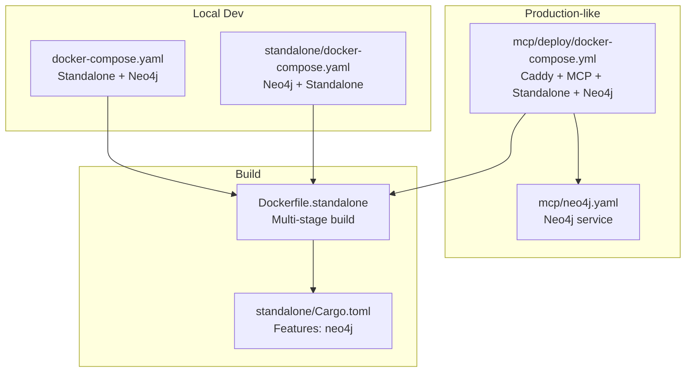
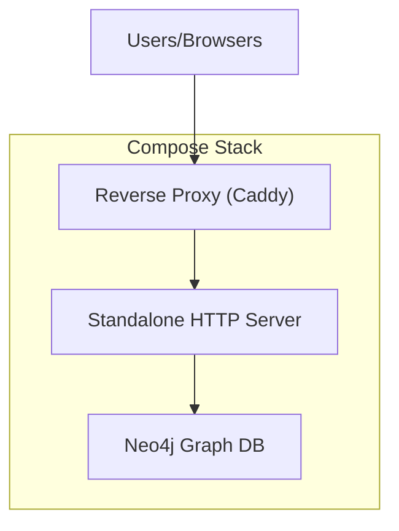
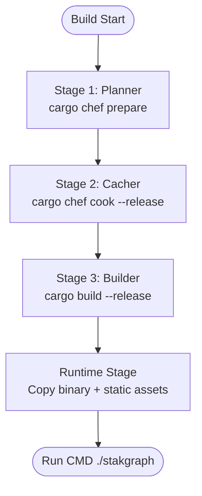
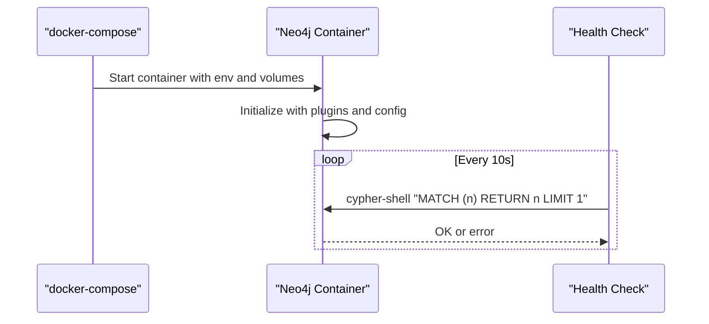
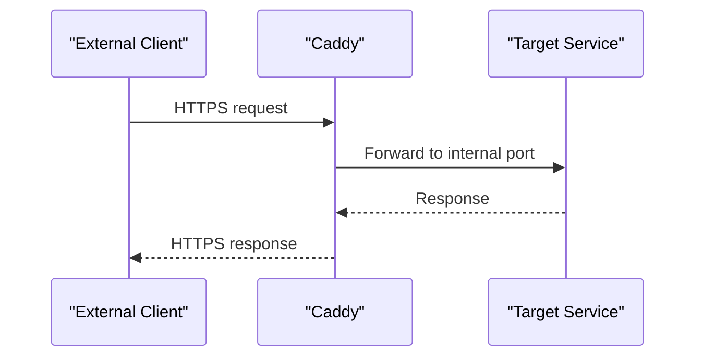
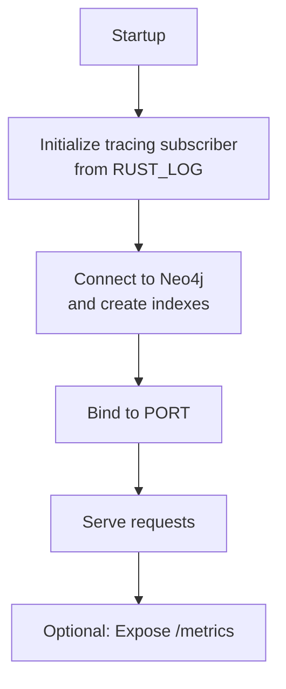
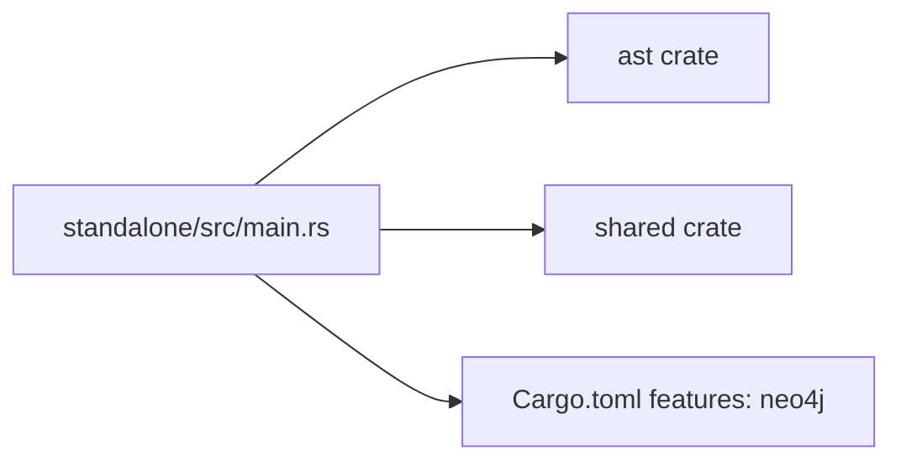

# Deployment Guide

<cite>
**Referenced Files in This Document**
- [Dockerfile.standalone](file://Dockerfile.standalone)
- [docker-compose.yaml](file://docker-compose.yaml)
- [standalone/src/main.rs](file://standalone/src/main.rs)
- [standalone/Cargo.toml](file://standalone/Cargo.toml)
- [standalone/docker-compose.yaml](file://standalone/docker-compose.yaml)
- [mcp/docker-compose.yaml](file://mcp/docker-compose.yaml)
- [mcp/deploy/docker-compose.yml](file://mcp/deploy/docker-compose.yml)
- [mcp/neo4j.yaml](file://mcp/neo4j.yaml)
- [scripts/local-openssl-env.sh](file://scripts/local-openssl-env.sh)
- [install.sh](file://install.sh)
</cite>

## Table of Contents
1. [Introduction](#introduction)
2. [Project Structure](#project-structure)
3. [Core Components](#core-components)
4. [Architecture Overview](#architecture-overview)
5. [Detailed Component Analysis](#detailed-component-analysis)
6. [Dependency Analysis](#dependency-analysis)
7. [Performance Considerations](#performance-considerations)
8. [Troubleshooting Guide](#troubleshooting-guide)
9. [Conclusion](#conclusion)
10. [Appendices](#appendices)

## Introduction
This guide documents how to deploy the StakGraph HTTP server (standalone) in production environments. It covers containerization with Docker, multi-stage builds, Neo4j integration, reverse proxy and load balancing, Kubernetes deployment patterns, environment variable management, secrets handling, monitoring, logging, scaling, backups, disaster recovery, and security hardening.

## Project Structure
StakGraph provides:
- A standalone HTTP server binary with optional Neo4j support
- Dockerfiles and docker-compose configurations for local and production-like setups
- Example deployments integrating Caddy as a reverse proxy and Neo4j as the graph backend
- Scripts for OpenSSL dependency management during builds

**Diagram sources**
- [docker-compose.yaml:1-51](file://docker-compose.yaml#L1-L51)
- [standalone/docker-compose.yaml:1-54](file://standalone/docker-compose.yaml#L1-L54)
- [mcp/deploy/docker-compose.yml:1-78](file://mcp/deploy/docker-compose.yml#L1-L78)
- [mcp/neo4j.yaml:1-35](file://mcp/neo4j.yaml#L1-L35)
- [Dockerfile.standalone:1-61](file://Dockerfile.standalone#L1-L61)
- [standalone/Cargo.toml:31-34](file://standalone/Cargo.toml#L31-L34)

**Section sources**
- [docker-compose.yaml:1-51](file://docker-compose.yaml#L1-L51)
- [standalone/docker-compose.yaml:1-54](file://standalone/docker-compose.yaml#L1-L54)
- [mcp/deploy/docker-compose.yml:1-78](file://mcp/deploy/docker-compose.yml#L1-L78)
- [mcp/neo4j.yaml:1-35](file://mcp/neo4j.yaml#L1-L35)
- [Dockerfile.standalone:1-61](file://Dockerfile.standalone#L1-L61)
- [standalone/Cargo.toml:31-34](file://standalone/Cargo.toml#L31-L34)

## Core Components
- Standalone HTTP server: Axum-based service exposing ingestion, search, and status endpoints; optionally protected by bearer/basic auth when an API token is configured.
- Neo4j integration: Graph operations and indexing are initialized at startup; health-checked via Cypher Shell.
- Reverse proxy: Caddy example demonstrates HTTPS termination and routing to internal services.
- Containerization: Multi-stage Docker build with caching and runtime base image.

Key environment variables:
- PORT: TCP port to bind (default 7799)
- API_TOKEN: Optional bearer/basic auth token
- NEO4J_URI, NEO4J_USER, NEO4J_PASSWORD: Neo4j connection details
- RUST_LOG, RUST_BACKTRACE: Logging and stack traces for diagnostics

**Section sources**
- [standalone/src/main.rs:15-194](file://standalone/src/main.rs#L15-L194)
- [standalone/src/main.rs:58-65](file://standalone/src/main.rs#L58-L65)
- [standalone/src/main.rs:159-160](file://standalone/src/main.rs#L159-L160)
- [docker-compose.yaml:10-16](file://docker-compose.yaml#L10-L16)
- [standalone/docker-compose.yaml:40-46](file://standalone/docker-compose.yaml#L40-L46)
- [mcp/deploy/docker-compose.yml:34-37](file://mcp/deploy/docker-compose.yml#L34-L37)

## Architecture Overview
The StakGraph standalone server runs as an HTTP service with optional Neo4j graph storage. In production-like setups, Caddy terminates TLS and proxies to internal services. Neo4j is provisioned as a persistent container with health checks.

**Diagram sources**
- [mcp/deploy/docker-compose.yml:2-13](file://mcp/deploy/docker-compose.yml#L2-L13)
- [mcp/deploy/docker-compose.yml:28-39](file://mcp/deploy/docker-compose.yml#L28-L39)
- [mcp/deploy/docker-compose.yml:41-74](file://mcp/deploy/docker-compose.yml#L41-L74)

## Detailed Component Analysis

### Docker Containerization and Multi-Stage Builds
The standalone Dockerfile implements a three-stage build:
- Planner: Generates a dependency recipe using cargo-chef
- Cacher: Installs system OpenSSL and builds dependencies with caching
- Builder: Copies cached dependencies, compiles the release binary
- Runtime: Copies the binary and static assets into a runtime base image and starts the server

**Diagram sources**
- [Dockerfile.standalone:1-10](file://Dockerfile.standalone#L1-L10)
- [Dockerfile.standalone:12-27](file://Dockerfile.standalone#L12-L27)
- [Dockerfile.standalone:29-46](file://Dockerfile.standalone#L29-L46)
- [Dockerfile.standalone:48-61](file://Dockerfile.standalone#L48-L61)

Operational notes:
- OpenSSL development libraries are installed in both cache and build stages to satisfy native dependencies.
- The runtime stage uses a prebuilt LSP base image and copies the compiled binary plus static frontend assets.

**Section sources**
- [Dockerfile.standalone:1-61](file://Dockerfile.standalone#L1-L61)

### Neo4j Integration and Health Checks
Neo4j is configured with:
- Persistent volumes for data, logs, plugins, and import
- Health check using Cypher Shell to validate connectivity and basic query capability
- Authentication via environment variable

**Diagram sources**
- [docker-compose.yaml:18-51](file://docker-compose.yaml#L18-L51)
- [standalone/docker-compose.yaml:3-54](file://standalone/docker-compose.yaml#L3-L54)
- [mcp/neo4j.yaml:21-34](file://mcp/neo4j.yaml#L21-L34)

**Section sources**
- [docker-compose.yaml:18-51](file://docker-compose.yaml#L18-L51)
- [standalone/docker-compose.yaml:3-54](file://standalone/docker-compose.yaml#L3-L54)
- [mcp/neo4j.yaml:1-35](file://mcp/neo4j.yaml#L1-L35)

### Reverse Proxy and Load Balancing
Caddy is used as a reverse proxy terminating TLS and forwarding requests to internal services. The example shows:
- HTTPS from-to mapping
- Port exposure for HTTP/HTTPS
- Depends-on relationship to ensure downstream services start after Neo4j

**Diagram sources**
- [mcp/deploy/docker-compose.yml:2-13](file://mcp/deploy/docker-compose.yml#L2-L13)
- [mcp/deploy/docker-compose.yml:15-26](file://mcp/deploy/docker-compose.yml#L15-L26)

Load balancing strategies:
- Horizontal scaling: Deploy multiple instances of the standalone service behind a load balancer (e.g., Caddy, Nginx, or cloud LB). Ensure sticky sessions are not required for stateless endpoints; maintain a shared Neo4j instance.
- Health checks: Use the existing Neo4j health check pattern for readiness probes and integrate application-specific health endpoints if exposed.

**Section sources**
- [mcp/deploy/docker-compose.yml:2-13](file://mcp/deploy/docker-compose.yml#L2-L13)
- [mcp/deploy/docker-compose.yml:41-74](file://mcp/deploy/docker-compose.yml#L41-L74)

### Kubernetes Deployment Patterns
While Kubernetes manifests are not present in the repository, the compose configurations provide a blueprint for translating to Kubernetes:
- Deployments: One for Neo4j and one for the standalone HTTP server
- Services: ClusterIP for internal communication; optional LoadBalancer/Ingress for external access
- ConfigMaps/EnvVars: Map environment variables from compose files
- Secrets: Store sensitive values like NEO4J_PASSWORD and API_TOKEN
- Volumes/PersistentVolumes: Mount data/logs/plugins/import paths
- Probes: Use liveness/readiness probes aligned with health checks

Environment variables to map:
- PORT, NEO4J_URI, NEO4J_USER, NEO4J_PASSWORD, API_TOKEN, RUST_LOG, RUST_BACKTRACE

**Section sources**
- [standalone/src/main.rs:159-160](file://standalone/src/main.rs#L159-L160)
- [standalone/src/main.rs:58-65](file://standalone/src/main.rs#L58-L65)
- [docker-compose.yaml:10-16](file://docker-compose.yaml#L10-L16)
- [standalone/docker-compose.yaml:40-46](file://standalone/docker-compose.yaml#L40-L46)
- [mcp/deploy/docker-compose.yml:34-37](file://mcp/deploy/docker-compose.yml#L34-L37)

### Monitoring, Health Checks, and Logging
- Logging: The server initializes a tracing subscriber with level filtering from RUST_LOG and adds a directive for tower_http. Debugging can be enabled via RUST_LOG and RUST_BACKTRACE.
- Health checks: Neo4j health check uses cypher-shell; add analogous HTTP health endpoints in the standalone service if needed.
- Metrics: Prometheus metrics are not present in the repository. To enable, integrate a metrics exporter crate and expose a /metrics endpoint.

**Diagram sources**
- [standalone/src/main.rs:27-36](file://standalone/src/main.rs#L27-L36)
- [standalone/src/main.rs:38-46](file://standalone/src/main.rs#L38-L46)
- [standalone/src/main.rs:159-160](file://standalone/src/main.rs#L159-L160)

**Section sources**
- [standalone/src/main.rs:27-36](file://standalone/src/main.rs#L27-L36)
- [standalone/src/main.rs:159-160](file://standalone/src/main.rs#L159-L160)
- [docker-compose.yaml:12-13](file://docker-compose.yaml#L12-L13)

### Security Hardening and SSL/TLS
- TLS termination: Use Caddy or Nginx/Apache to terminate TLS and forward to the internal service over HTTP.
- Secrets management: Store credentials in environment variables or Kubernetes Secrets/Vault; avoid committing secrets to source control.
- Network policies: Restrict inbound/outbound traffic to necessary ports; isolate Neo4j and limit exposure.
- Authentication: Enable API_TOKEN to enforce bearer/basic auth on protected routes.

**Section sources**
- [mcp/deploy/docker-compose.yml:2-13](file://mcp/deploy/docker-compose.yml#L2-L13)
- [standalone/src/main.rs:58-65](file://standalone/src/main.rs#L58-L65)
- [standalone/src/main.rs:110-115](file://standalone/src/main.rs#L110-L115)

### Backup and Disaster Recovery
- Neo4j backups: Use Neo4j’s built-in backup tools or enterprise capabilities; ensure periodic snapshots of persistent volumes.
- Restore procedure: Validate backups regularly; practice restoring to a staging environment before production.

[No sources needed since this section provides general guidance]

### Scaling Considerations
- Stateless design: Keep the standalone service stateless; rely on Neo4j for persistence.
- Horizontal scaling: Scale the standalone service pods behind a load balancer; ensure Neo4j cluster or highly available instance.
- Resource sizing: Start with conservative CPU/memory limits and adjust based on workload; monitor GC and I/O.

[No sources needed since this section provides general guidance]

## Dependency Analysis
The standalone binary depends on the AST and shared crates and enables the Neo4j feature to activate graph operations.

**Diagram sources**
- [standalone/src/main.rs:1-20](file://standalone/src/main.rs#L1-L20)
- [standalone/Cargo.toml:1-34](file://standalone/Cargo.toml#L1-L34)

**Section sources**
- [standalone/Cargo.toml:31-34](file://standalone/Cargo.toml#L31-L34)
- [standalone/src/main.rs:1-20](file://standalone/src/main.rs#L1-L20)

## Performance Considerations
- Multi-stage builds reduce final image size and speed up rebuilds by leveraging dependency caching.
- Use release builds and appropriate container resource limits.
- Monitor Neo4j performance and scale vertically or horizontally as needed.

[No sources needed since this section provides general guidance]

## Troubleshooting Guide
Common issues and remedies:
- Build failures related to OpenSSL: Use the OpenSSL helper script to ensure proper OpenSSL installation and environment variables are exported before building.
- Startup binding errors: Verify PORT is set and not conflicting with other containers.
- Neo4j connectivity: Confirm NEO4J_URI, NEO4J_USER, and NEO4J_PASSWORD; check health check logs.
- Authentication problems: Ensure API_TOKEN is set when enabling auth; otherwise, routes may be unexpectedly protected.

**Section sources**
- [scripts/local-openssl-env.sh:1-161](file://scripts/local-openssl-env.sh#L1-L161)
- [standalone/src/main.rs:159-160](file://standalone/src/main.rs#L159-L160)
- [docker-compose.yaml:14-16](file://docker-compose.yaml#L14-L16)
- [standalone/src/main.rs:58-65](file://standalone/src/main.rs#L58-L65)

## Conclusion
This guide outlined how to containerize, deploy, and operate the StakGraph standalone HTTP server with Neo4j. By following the provided Docker and compose configurations, implementing reverse proxying, managing environment variables and secrets, and adopting sound monitoring and security practices, you can achieve a robust, scalable, and secure production deployment.

## Appendices

### Environment Variables Reference
- PORT: TCP port for the HTTP server (default 7799)
- API_TOKEN: Optional bearer/basic auth token
- NEO4J_URI: Bolt URI for Neo4j
- NEO4J_USER: Neo4j username
- NEO4J_PASSWORD: Neo4j password
- RUST_LOG: Tracing log level
- RUST_BACKTRACE: Enable backtraces for diagnostics

**Section sources**
- [standalone/src/main.rs:58-65](file://standalone/src/main.rs#L58-L65)
- [standalone/src/main.rs:159-160](file://standalone/src/main.rs#L159-L160)
- [docker-compose.yaml:10-16](file://docker-compose.yaml#L10-L16)
- [standalone/docker-compose.yaml:40-46](file://standalone/docker-compose.yaml#L40-L46)
- [mcp/deploy/docker-compose.yml:34-37](file://mcp/deploy/docker-compose.yml#L34-L37)

### Installation Script
The install script automates downloading and installing the stakgraph binary for supported platforms.

**Section sources**
- [install.sh:1-94](file://install.sh#L1-L94)