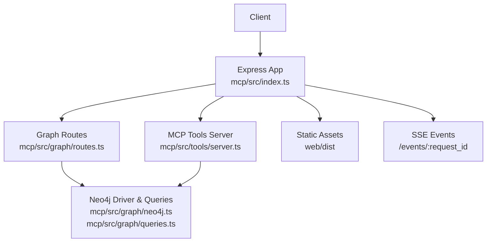
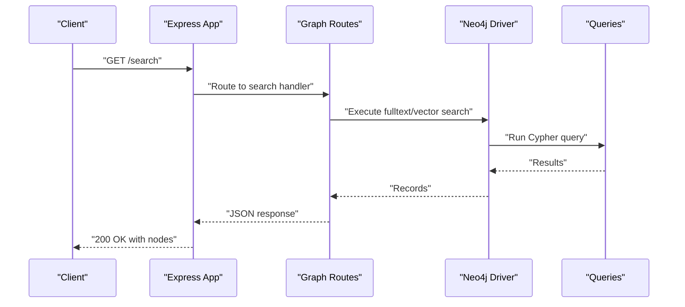
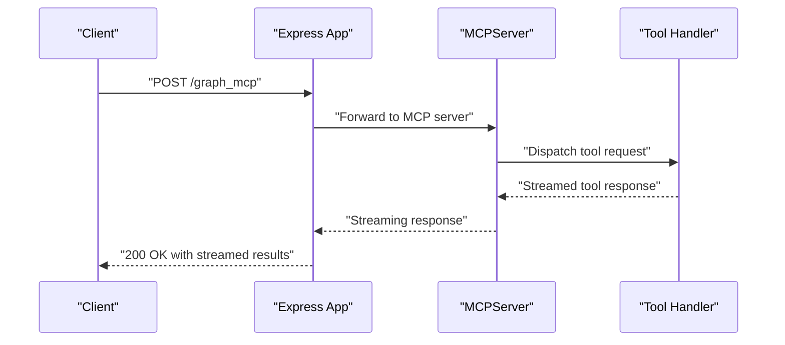
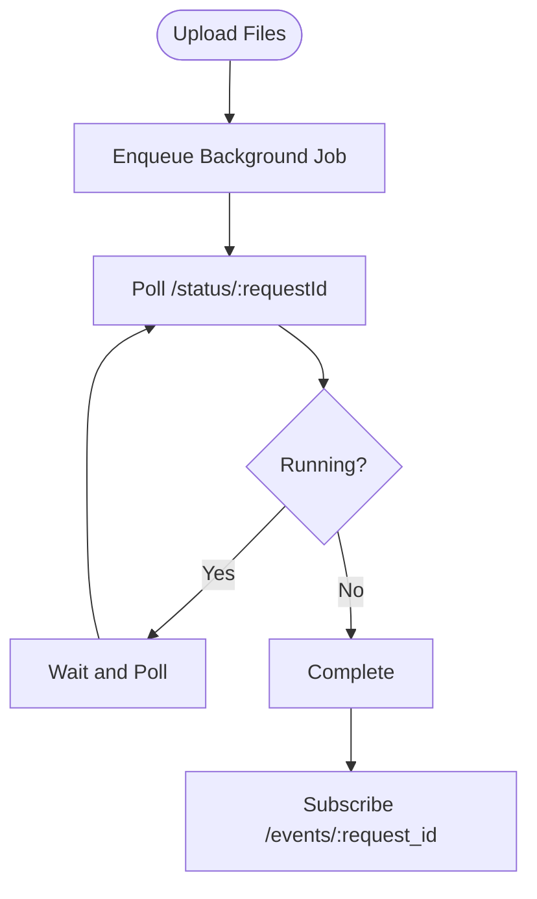
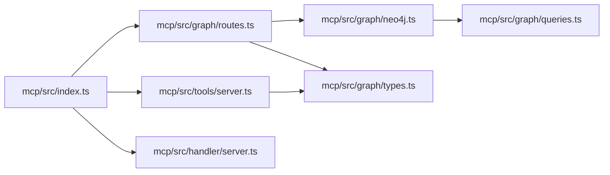
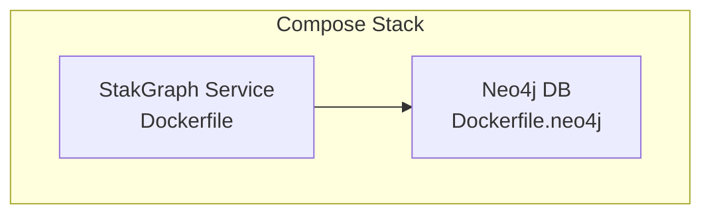

# HTTP Server and API

<cite>
**Referenced Files in This Document**
- [index.ts](file://mcp/src/index.ts)
- [server.ts](file://mcp/src/tools/server.ts)
- [routes.ts](file://mcp/src/graph/routes.ts)
- [neo4j.ts](file://mcp/src/graph/neo4j.ts)
- [queries.ts](file://mcp/src/graph/queries.ts)
- [types.ts](file://mcp/src/graph/types.ts)
- [server.ts](file://mcp/src/handler/server.ts)
- [docker-compose.yaml](file://docker-compose.yaml)
- [Dockerfile](file://Dockerfile)
- [Dockerfile.neo4j](file://mcp/Dockerfile.neo4j)
- [neo4j.yaml](file://mcp/neo4j.yaml)
- [apoc.conf](file://mcp/deploy/conf/apoc.conf)
- [neo4j.conf](file://mcp/deploy/conf/neo4j.conf)
</cite>

## Table of Contents
1. [Introduction](#introduction)
2. [Project Structure](#project-structure)
3. [Core Components](#core-components)
4. [Architecture Overview](#architecture-overview)
5. [Detailed Component Analysis](#detailed-component-analysis)
6. [Dependency Analysis](#dependency-analysis)
7. [Performance Considerations](#performance-considerations)
8. [Troubleshooting Guide](#troubleshooting-guide)
9. [Conclusion](#conclusion)
10. [Appendices](#appendices)

## Introduction
This document provides comprehensive API documentation for the StakGraph HTTP server. It covers the REST endpoints POST /process, GET /search, GET /map, and GET /shortest_path, including request and response schemas, Neo4j integration, asynchronous processing, background jobs, server configuration, deployment options, performance tuning, authentication, rate limiting, error handling, and production deployment patterns.

## Project Structure
The HTTP server is implemented in the MCP (Multi-Client Protocol) service under mcp/src. Key areas:
- Entry point and routing: mcp/src/index.ts
- MCP server transport and session management: mcp/src/handler/server.ts
- Tool-based API endpoints: mcp/src/tools/server.ts
- Graph routes and business logic: mcp/src/graph/routes.ts
- Neo4j driver and queries: mcp/src/graph/neo4j.ts, mcp/src/graph/queries.ts
- Shared types and constants: mcp/src/graph/types.ts
- Deployment assets: docker-compose.yaml, Dockerfile, Dockerfile.neo4j, neo4j.yaml, apoc.conf, neo4j.conf

**Diagram sources**
- [index.ts:51-241](file://mcp/src/index.ts#L51-L241)
- [server.ts:29-95](file://mcp/src/tools/server.ts#L29-L95)
- [routes.ts](file://mcp/src/graph/routes.ts)
- [neo4j.ts:44-53](file://mcp/src/graph/neo4j.ts#L44-L53)
- [queries.ts:1-120](file://mcp/src/graph/queries.ts#L1-L120)

**Section sources**
- [index.ts:51-241](file://mcp/src/index.ts#L51-L241)
- [server.ts:29-95](file://mcp/src/tools/server.ts#L29-L95)

## Core Components
- Express server initialization, CORS, middleware, and static asset serving
- Authentication middleware applied to graph routes
- SSE event streaming endpoint for real-time updates
- MCP-based tool endpoints for graph operations
- Neo4j integration for search, map retrieval, shortest path, and graph building

Key runtime configuration:
- Host and port configurable via environment variables
- Body parsing limits and file upload support
- Cache middleware for repository map endpoint

**Section sources**
- [index.ts:51-241](file://mcp/src/index.ts#L51-L241)
- [types.ts:1-429](file://mcp/src/graph/types.ts#L1-L429)

## Architecture Overview
The server exposes both traditional REST endpoints and MCP tool endpoints. Requests are routed to either:
- Graph routes for search, map, shortest path, and graph operations
- MCP tools for tool-based invocations with streaming transport

Neo4j is accessed via a dedicated driver with pre-defined indexes and vector indices for efficient querying.

**Diagram sources**
- [index.ts:136-146](file://mcp/src/index.ts#L136-L146)
- [routes.ts](file://mcp/src/graph/routes.ts)
- [neo4j.ts:336-393](file://mcp/src/graph/neo4j.ts#L336-L393)
- [queries.ts:471-534](file://mcp/src/graph/queries.ts#L471-L534)

## Detailed Component Analysis

### REST Endpoints

#### POST /process
- Purpose: Asynchronous ingestion and graph building pipeline
- Authentication: Requires auth middleware
- Request body: File upload(s) handled by express-fileupload
- Response: Job status and requestId for polling via GET /status/:requestId
- Background processing: Implemented via uploads module; SSE events available via /events/:request_id
- Notes: Large payload support via increased JSON limit

Practical usage:
- Upload files to trigger ingestion
- Poll /status/:requestId until completion
- Subscribe to /events/:request_id for live progress

**Section sources**
- [index.ts:147-148](file://mcp/src/index.ts#L147-L148)
- [index.ts:98-105](file://mcp/src/index.ts#L98-L105)
- [index.ts:58-96](file://mcp/src/index.ts#L58-L96)

#### GET /search
- Purpose: Fulltext and vector search across the graph
- Authentication: Requires auth middleware
- Query parameters:
  - q: search query string
  - limit: maximum results
  - node_types: comma-separated node types to include
  - skip_node_types: comma-separated node types to exclude
  - language: optional language filter
  - maxTokens: optional cap on cumulative token count
- Response: Array of nodes with properties, labels, and score
- Implementation: Uses composite fulltext index and vector index

Request schema (query parameters):
- q: string, required
- limit: integer, default 20
- node_types: string[]
- skip_node_types: string[]
- language: string
- maxTokens: integer

Response schema (array items):
- identity: integer or object
- properties: NodeData
- labels: string[]
- ref_id: string
- score: number

**Section sources**
- [index.ts](file://mcp/src/index.ts#L142)
- [routes.ts](file://mcp/src/graph/routes.ts)
- [neo4j.ts:336-393](file://mcp/src/graph/neo4j.ts#L336-L393)
- [queries.ts:471-534](file://mcp/src/graph/queries.ts#L471-L534)
- [types.ts:23-34](file://mcp/src/graph/types.ts#L23-L34)

#### GET /map
- Purpose: Retrieve a subgraph map centered around a node
- Authentication: Requires auth middleware
- Query parameters:
  - ref_id: node identifier
  - depth: traversal depth
  - direction: up | down | both
  - trim: comma-separated node names to exclude
  - include_tests: boolean
  - include_functions_and_classes: boolean
- Response: nodes and edges forming the subgraph
- Implementation: Uses APOC path expansion with label filters

Request schema (query parameters):
- ref_id: string, required
- depth: integer, default 2
- direction: string ("up" | "down" | "both")
- trim: string[]
- include_tests: boolean
- include_functions_and_classes: boolean

Response schema:
- nodes: ReturnNode[]
- edges: array of edge objects with source, target, edge_type, properties

**Section sources**
- [index.ts](file://mcp/src/index.ts#L143)
- [routes.ts](file://mcp/src/graph/routes.ts)
- [neo4j.ts:168-204](file://mcp/src/graph/neo4j.ts#L168-L204)
- [queries.ts:536-679](file://mcp/src/graph/queries.ts#L536-L679)
- [types.ts:16-21](file://mcp/src/graph/types.ts#L16-L21)

#### GET /shortest_path
- Purpose: Compute shortest path between two nodes constrained to specific node types
- Authentication: Requires auth middleware
- Query parameters:
  - start_ref_id: source node identifier
  - end_ref_id: destination node identifier
- Response: Path represented as nodes and edges
- Implementation: Uses Cypher shortestPath with type constraints

Request schema (query parameters):
- start_ref_id: string, required
- end_ref_id: string, required

Response schema:
- nodes: ReturnNode[]
- edges: array of edge objects with source, target, edge_type, properties

**Section sources**
- [index.ts](file://mcp/src/index.ts#L146)
- [routes.ts](file://mcp/src/graph/routes.ts)
- [neo4j.ts:262-284](file://mcp/src/graph/neo4j.ts#L262-L284)
- [queries.ts:740-769](file://mcp/src/graph/queries.ts#L740-L769)
- [types.ts:16-21](file://mcp/src/graph/types.ts#L16-L21)

### MCP Tool Endpoints
The server also exposes MCP tool endpoints under /graph_mcp for streaming transport:
- GET /graph_mcp: Establish session and receive tool listings
- POST /graph_mcp: Send tool requests with bearer token

Supported tools include Search, GetNodes, GetEdges, GetMap, GetCode, ShortestPath, RepoMap, GetRulesFiles, Explore, and others.

**Diagram sources**
- [server.ts:29-95](file://mcp/src/tools/server.ts#L29-L95)
- [server.ts:42-128](file://mcp/src/handler/server.ts#L42-L128)

**Section sources**
- [server.ts:29-95](file://mcp/src/tools/server.ts#L29-L95)
- [server.ts:15-164](file://mcp/src/handler/server.ts#L15-L164)

### Neo4j Integration
- Driver configuration: Host, user, and password from environment variables
- Indexes: Fulltext and vector indexes created at startup
- Queries: Optimized Cypher statements for search, map, shortest path, and graph operations
- Token counting and embeddings: Utility functions to enrich nodes with token counts and vector embeddings

Key environment variables:
- NEO4J_HOST, NEO4J_USER, NEO4J_PASSWORD
- NO_DB, DELAY_START

Indexes created:
- KEY_INDEX, FULLTEXT_BODY_INDEX, FULLTEXT_NAME_INDEX, FULLTEXT_COMPOSITE_INDEX, VECTOR_INDEX

**Section sources**
- [neo4j.ts:44-53](file://mcp/src/graph/neo4j.ts#L44-L53)
- [queries.ts:10-51](file://mcp/src/graph/queries.ts#L10-L51)
- [neo4j.ts:286-314](file://mcp/src/graph/neo4j.ts#L286-L314)

### Asynchronous Processing and Background Jobs
- File upload endpoint triggers ingestion; status tracked via requestId
- SSE endpoint /events/:request_id streams progress for a given request
- Session management for MCP server with automatic cleanup of stale sessions

**Diagram sources**
- [index.ts:147-148](file://mcp/src/index.ts#L147-L148)
- [index.ts:58-96](file://mcp/src/index.ts#L58-L96)

**Section sources**
- [index.ts:147-148](file://mcp/src/index.ts#L147-L148)
- [index.ts:58-96](file://mcp/src/index.ts#L58-L96)
- [server.ts:29-40](file://mcp/src/handler/server.ts#L29-L40)

### Server Configuration and Environment Variables
- Port and host: PORT, HOST
- Neo4j credentials: NEO4J_HOST, NEO4J_USER, NEO4J_PASSWORD
- SSE authentication: API_TOKEN for /events/:request_id
- Body size limits: Increased JSON limit for large payloads
- Optional DB bypass: NO_DB=true disables Neo4j
- Startup delay: DELAY_START to stagger index creation

**Section sources**
- [index.ts:233-236](file://mcp/src/index.ts#L233-L236)
- [neo4j.ts:32-42](file://mcp/src/graph/neo4j.ts#L32-L42)

### Authentication and Rate Limiting
- Authentication middleware applied to graph routes
- SSE /events/:request_id supports:
  - JWT query parameter verified against request_id
  - x-api-token header checked against API_TOKEN
  - Dev mode allows unauthenticated if API_TOKEN not set
- No explicit global rate limiter in the provided code; consider adding rate limiting middleware for production deployments

**Section sources**
- [index.ts](file://mcp/src/index.ts#L136)
- [index.ts:58-96](file://mcp/src/index.ts#L58-L96)

### Error Handling Strategies
- Centralized error responses for MCP transport
- Graceful handling of missing session headers and invalid requests
- Session cleanup on errors and stale session pruning

**Section sources**
- [server.ts:142-151](file://mcp/src/handler/server.ts#L142-L151)
- [server.ts:29-40](file://mcp/src/handler/server.ts#L29-L40)

## Dependency Analysis

**Diagram sources**
- [index.ts:16-41](file://mcp/src/index.ts#L16-L41)
- [routes.ts](file://mcp/src/graph/routes.ts)
- [server.ts:1-95](file://mcp/src/tools/server.ts#L1-L95)
- [server.ts:1-164](file://mcp/src/handler/server.ts#L1-L164)
- [neo4j.ts:1-80](file://mcp/src/graph/neo4j.ts#L1-L80)
- [queries.ts:1-120](file://mcp/src/graph/queries.ts#L1-L120)
- [types.ts:1-120](file://mcp/src/graph/types.ts#L1-L120)

**Section sources**
- [index.ts:16-41](file://mcp/src/index.ts#L16-L41)
- [routes.ts](file://mcp/src/graph/routes.ts)
- [server.ts:1-95](file://mcp/src/tools/server.ts#L1-L95)
- [server.ts:1-164](file://mcp/src/handler/server.ts#L1-L164)
- [neo4j.ts:1-80](file://mcp/src/graph/neo4j.ts#L1-L80)
- [queries.ts:1-120](file://mcp/src/graph/queries.ts#L1-L120)
- [types.ts:1-120](file://mcp/src/graph/types.ts#L1-L120)

## Performance Considerations
- Indexes: Ensure fulltext and vector indexes are created for optimal search performance
- Token filtering: Use maxTokens parameter to limit result size when appropriate
- Payload sizes: Body parsing limit increased to support large payloads
- Vector embeddings: Precompute embeddings to reduce latency during vector search
- Neo4j configuration: Tune heap and query timeout settings in Neo4j configuration files

[No sources needed since this section provides general guidance]

## Troubleshooting Guide
Common issues and resolutions:
- Neo4j connectivity: Verify NEO4J_HOST, NEO4J_USER, NEO4J_PASSWORD
- Index creation failures: Check DELAY_START and NO_DB settings
- SSE unauthorized: Confirm API_TOKEN and JWT validity for /events/:request_id
- MCP session errors: Ensure mcp-session-id header and proper initialization requests

**Section sources**
- [neo4j.ts:32-42](file://mcp/src/graph/neo4j.ts#L32-L42)
- [index.ts:58-96](file://mcp/src/index.ts#L58-L96)
- [server.ts:42-113](file://mcp/src/handler/server.ts#L42-L113)

## Conclusion
The StakGraph HTTP server provides robust REST and MCP endpoints backed by Neo4j. It supports asynchronous ingestion, real-time event streaming, and scalable graph operations. Proper configuration of Neo4j indexes, environment variables, and production-grade middleware (rate limiting, health checks) will ensure reliable operation at scale.

[No sources needed since this section summarizes without analyzing specific files]

## Appendices

### Deployment Options
- Docker Compose: Use the provided docker-compose.yaml to orchestrate the service and Neo4j
- Standalone Docker: Build and run the service container using Dockerfile
- Neo4j container: Deploy Neo4j with Dockerfile.neo4j and configure apoc.conf and neo4j.conf

**Diagram sources**
- [docker-compose.yaml](file://docker-compose.yaml)
- [Dockerfile](file://Dockerfile)
- [Dockerfile.neo4j](file://mcp/Dockerfile.neo4j)

**Section sources**
- [docker-compose.yaml](file://docker-compose.yaml)
- [Dockerfile](file://Dockerfile)
- [Dockerfile.neo4j](file://mcp/Dockerfile.neo4j)

### Monitoring Approaches
- Health endpoint: Use GET /busy to check service availability
- SSE events: Monitor /events/:request_id for real-time progress
- Neo4j metrics: Enable APOC procedures and monitor database performance

**Section sources**
- [index.ts:130-132](file://mcp/src/index.ts#L130-L132)
- [index.ts:58-96](file://mcp/src/index.ts#L58-L96)
- [apoc.conf](file://mcp/deploy/conf/apoc.conf)
- [neo4j.conf](file://mcp/deploy/conf/neo4j.conf)

### Scalability and Production Patterns
- Horizontal scaling: Run multiple instances behind a load balancer
- Session affinity: Not required for SSE; rely on request_id scoping
- Rate limiting: Add middleware to protect endpoints under high load
- Caching: Leverage cacheMiddleware for /repo_map and consider Redis for cross-instance cache invalidation

[No sources needed since this section provides general guidance]