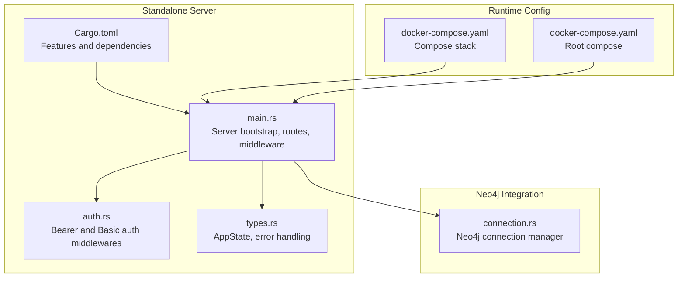
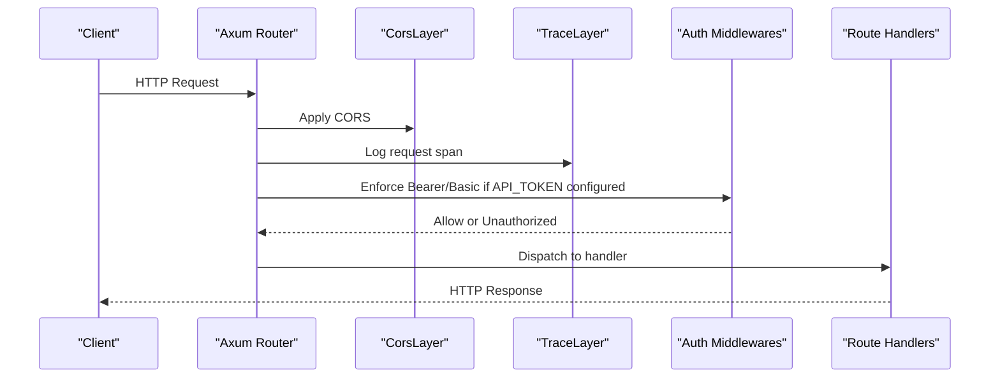
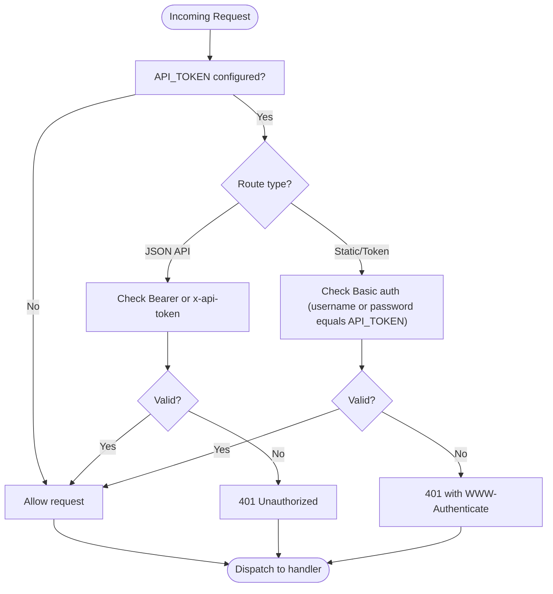
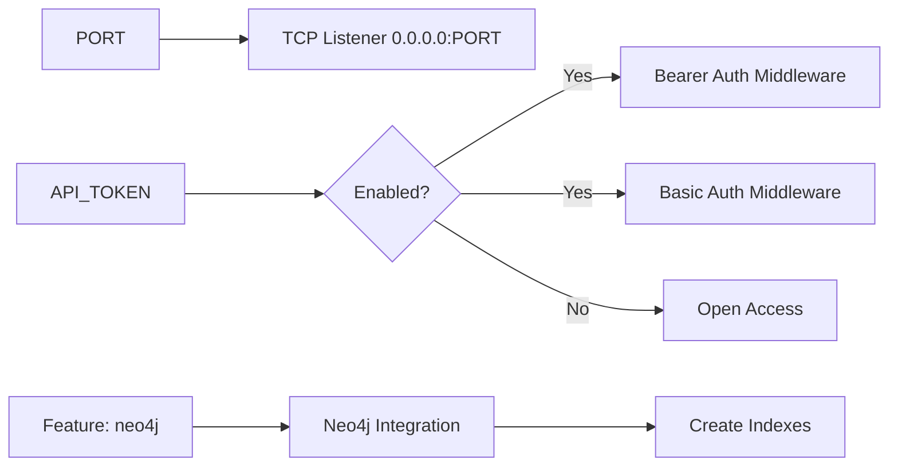

# Server Configuration

<cite>
**Referenced Files in This Document**
- [main.rs](file://standalone/src/main.rs)
- [auth.rs](file://standalone/src/auth.rs)
- [types.rs](file://standalone/src/types.rs)
- [Cargo.toml](file://standalone/Cargo.toml)
- [docker-compose.yaml](file://standalone/docker-compose.yaml)
- [docker-compose.yaml](file://docker-compose.yaml)
- [connection.rs](file://ast/src/lang/graphs/neo4j/connection.rs)
</cite>

## Table of Contents
1. [Introduction](#introduction)
2. [Project Structure](#project-structure)
3. [Core Components](#core-components)
4. [Architecture Overview](#architecture-overview)
5. [Detailed Component Analysis](#detailed-component-analysis)
6. [Dependency Analysis](#dependency-analysis)
7. [Performance Considerations](#performance-considerations)
8. [Troubleshooting Guide](#troubleshooting-guide)
9. [Conclusion](#conclusion)
10. [Appendices](#appendices)

## Introduction
This document describes how to configure and operate the StakGraph Standalone HTTP server. It focuses on environment variables, authentication, CORS, middleware layers, request tracing, startup options, feature flags, and dependency requirements. It also provides practical configuration examples for development and production, along with security best practices and monitoring guidance.

## Project Structure
The StakGraph Standalone server is implemented in Rust using Axum and Tokio. The server exposes REST endpoints for ingestion, synchronization, search, and status reporting, and serves static assets for the web UI. Authentication is optional and controlled by an API token. The server can optionally integrate with Neo4j for graph storage and indexing.

**Diagram sources**
- [main.rs:1-208](file://standalone/src/main.rs#L1-L208)
- [auth.rs:1-106](file://standalone/src/auth.rs#L1-L106)
- [types.rs:1-283](file://standalone/src/types.rs#L1-L283)
- [Cargo.toml:1-34](file://standalone/Cargo.toml#L1-L34)
- [connection.rs:1-84](file://ast/src/lang/graphs/neo4j/connection.rs#L1-L84)
- [docker-compose.yaml:1-54](file://standalone/docker-compose.yaml#L1-L54)
- [docker-compose.yaml:1-51](file://docker-compose.yaml#L1-L51)

**Section sources**
- [main.rs:1-208](file://standalone/src/main.rs#L1-L208)
- [Cargo.toml:1-34](file://standalone/Cargo.toml#L1-L34)

## Core Components
- Environment variables
  - PORT: TCP port the server binds to. Defaults to 7799 if unset.
  - API_TOKEN: Optional bearer token for protecting API routes and static token exchange endpoint.
  - NEO4J_URI, NEO4J_USER, NEO4J_PASSWORD: Neo4j connection parameters used by the graph layer.
- Authentication
  - Bearer token authentication for JSON API routes via Authorization: Bearer header or x-api-token header.
  - Basic authentication for static assets and token exchange endpoint.
- CORS
  - Permissive CORS layer is applied globally.
- Middleware
  - Busy flag middleware for synchronous operations.
  - Request tracing via Tower HTTP TraceLayer with structured spans.
- Startup
  - Multi-threaded runtime flavor when the neo4j feature is enabled.
  - Graceful shutdown on SIGINT/Ctrl+C.
- Features
  - neo4j: Enables Neo4j integration and builds the standalone binary.

**Section sources**
- [main.rs:58-65](file://standalone/src/main.rs#L58-L65)
- [main.rs:159-160](file://standalone/src/main.rs#L159-L160)
- [auth.rs:11-46](file://standalone/src/auth.rs#L11-L46)
- [auth.rs:48-87](file://standalone/src/auth.rs#L48-L87)
- [main.rs:75-75](file://standalone/src/main.rs#L75-L75)
- [main.rs:137-157](file://standalone/src/main.rs#L137-L157)
- [Cargo.toml:31-34](file://standalone/Cargo.toml#L31-L34)

## Architecture Overview
The server composes routes, applies middleware, and serves static assets. Authentication is optional and controlled by the presence of API_TOKEN. Neo4j integration is gated behind the neo4j feature flag.

**Diagram sources**
- [main.rs:77-157](file://standalone/src/main.rs#L77-L157)
- [auth.rs:11-87](file://standalone/src/auth.rs#L11-L87)

## Detailed Component Analysis

### Environment Variables and Security Implications
- PORT
  - Purpose: Controls the TCP port the server listens on.
  - Default: 7799 if not set.
  - Security: Bind to localhost or a restricted interface in production; prefer reverse proxies for TLS termination.
- API_TOKEN
  - Purpose: Enables optional bearer and basic authentication for protected routes and static token exchange.
  - Behavior: If present, Bearer and Basic auth are enforced; if absent, all requests are permitted.
  - Security: Treat as a secret; rotate regularly; avoid logging tokens; restrict access to containers/vaults.
- NEO4J_URI, NEO4J_USER, NEO4J_PASSWORD
  - Purpose: Configure Neo4j connectivity for graph operations.
  - Security: Store in secrets management; use least-privilege credentials; enforce TLS where possible.

**Section sources**
- [main.rs:58-65](file://standalone/src/main.rs#L58-L65)
- [main.rs:159-160](file://standalone/src/main.rs#L159-L160)
- [auth.rs:11-46](file://standalone/src/auth.rs#L11-L46)
- [auth.rs:48-87](file://standalone/src/auth.rs#L48-L87)
- [connection.rs:13-35](file://ast/src/lang/graphs/neo4j/connection.rs#L13-L35)

### Authentication Mechanisms
- Bearer Token Authentication (JSON API routes)
  - Validates Authorization: Bearer header or x-api-token header against API_TOKEN.
  - Applied only when API_TOKEN is configured.
- Basic Authentication (Static assets and token exchange)
  - Validates Authorization: Basic header; accepts either username or password equal to API_TOKEN.
  - Returns WWW-Authenticate challenge when unauthorized.
- Token Exchange Endpoint
  - Provides the configured API token after successful Basic authentication to static assets.

**Diagram sources**
- [auth.rs:11-46](file://standalone/src/auth.rs#L11-L46)
- [auth.rs:48-87](file://standalone/src/auth.rs#L48-L87)

**Section sources**
- [auth.rs:11-46](file://standalone/src/auth.rs#L11-L46)
- [auth.rs:48-87](file://standalone/src/auth.rs#L48-L87)
- [auth.rs:89-105](file://standalone/src/auth.rs#L89-L105)

### CORS Configuration
- The server applies a permissive CORS layer globally.
- Effectively allows cross-origin requests from any origin, method, and header.
- Recommendation: Narrow CORS policy in production to trusted origins and specific headers.

**Section sources**
- [main.rs:75-75](file://standalone/src/main.rs#L75-L75)

### Middleware Layers
- Busy Middleware
  - Synchronous routes use a busy flag middleware to serialize long-running operations.
- Request Tracing
  - Tower HTTP TraceLayer logs request lifecycle with spans and timing.
- Authentication Middleware
  - Conditionally applied when API_TOKEN is configured.

**Section sources**
- [main.rs:82-90](file://standalone/src/main.rs#L82-L90)
- [main.rs:137-157](file://standalone/src/main.rs#L137-L157)
- [auth.rs:11-46](file://standalone/src/auth.rs#L11-L46)
- [auth.rs:48-87](file://standalone/src/auth.rs#L48-L87)

### Request Tracing Setup
- Logging level is derived from RUST_LOG with a default INFO.
- Additional directive for tower_http is supported.
- TraceLayer emits spans for HTTP requests with method, URI, and version; logs request start and response finish with latency.

**Section sources**
- [main.rs:27-36](file://standalone/src/main.rs#L27-L36)
- [main.rs:137-157](file://standalone/src/main.rs#L137-L157)

### Server Startup Options and Feature Flags
- Startup
  - Binds to 0.0.0.0:PORT; prints the bound address.
  - Handles SIGINT/Ctrl+C gracefully.
- Feature Flags
  - neo4j: Required to build the standalone binary; enables Neo4j integration.
- Dependencies
  - Axum, Tokio, Tower HTTP, tracing, base64, and others as declared.

**Section sources**
- [main.rs:159-190](file://standalone/src/main.rs#L159-L190)
- [Cargo.toml:31-34](file://standalone/Cargo.toml#L31-L34)

### Neo4j Integration
- Connection parameters are used by the graph layer to establish connections and create indexes.
- Index creation includes node keys, fulltext indices, and a vector index.

**Section sources**
- [connection.rs:13-35](file://ast/src/lang/graphs/neo4j/connection.rs#L13-L35)
- [connection.rs:38-55](file://ast/src/lang/graphs/neo4j/connection.rs#L38-L55)

## Dependency Analysis
The server’s runtime behavior depends on environment variables and feature flags. The following diagram shows how configuration influences middleware and features.

**Diagram sources**
- [main.rs:58-65](file://standalone/src/main.rs#L58-L65)
- [main.rs:159-190](file://standalone/src/main.rs#L159-L190)
- [Cargo.toml:31-34](file://standalone/Cargo.toml#L31-L34)
- [connection.rs:38-55](file://ast/src/lang/graphs/neo4j/connection.rs#L38-L55)

**Section sources**
- [main.rs:58-65](file://standalone/src/main.rs#L58-L65)
- [main.rs:159-190](file://standalone/src/main.rs#L159-L190)
- [Cargo.toml:31-34](file://standalone/Cargo.toml#L31-L34)

## Performance Considerations
- Prefer a reverse proxy for TLS and connection pooling.
- Limit concurrent synchronous operations using the busy middleware.
- Monitor Neo4j index creation and query performance; tune vector dimensions and similarity functions as needed.
- Use structured logging and traces to identify slow endpoints and bottlenecks.

## Troubleshooting Guide
- Authentication failures
  - Ensure Authorization header uses Bearer scheme or x-api-token header for JSON routes.
  - For static assets, ensure Basic header with username or password equal to API_TOKEN.
- CORS issues
  - Verify that clients are allowed by the permissive CORS policy; adjust in production.
- Port binding
  - Confirm PORT is not blocked; ensure firewall rules allow inbound traffic.
- Neo4j connectivity
  - Validate NEO4J_URI, NEO4J_USER, and NEO4J_PASSWORD; confirm network reachability and credentials.
- Logging and tracing
  - Set RUST_LOG to increase verbosity; include tower_http directive for HTTP-specific logs.

**Section sources**
- [auth.rs:11-46](file://standalone/src/auth.rs#L11-L46)
- [auth.rs:48-87](file://standalone/src/auth.rs#L48-L87)
- [main.rs:27-36](file://standalone/src/main.rs#L27-L36)
- [main.rs:159-160](file://standalone/src/main.rs#L159-L160)
- [connection.rs:13-35](file://ast/src/lang/graphs/neo4j/connection.rs#L13-L35)

## Conclusion
The StakGraph Standalone server is configurable via environment variables and feature flags. Authentication is optional but strongly recommended for production. The server applies permissive CORS, request tracing, and busy middleware to support predictable operation. Neo4j integration is optional and controlled by the neo4j feature flag.

## Appendices

### Configuration Examples

- Development (no authentication)
  - Set PORT to desired port.
  - Leave API_TOKEN unset to disable authentication.
  - Configure NEO4J_URI, NEO4J_USER, NEO4J_PASSWORD for Neo4j integration.
  - Example compose environment:
    - PORT=7799
    - RUST_LOG=debug
    - NEO4J_URI=bolt://localhost:7687
    - NEO4J_USER=neo4j
    - NEO4J_PASSWORD=changeit

- Production (with authentication)
  - Set PORT to 7799 or higher privileged port.
  - Set API_TOKEN to a strong random value.
  - Configure CORS to trusted origins only.
  - Place server behind a reverse proxy with TLS termination.
  - Example compose environment:
    - PORT=7799
    - API_TOKEN=your-very-secret-token
    - NEO4J_URI=bolt://neo4j:7687
    - NEO4J_USER=neo4j
    - NEO4J_PASSWORD=strong-password

- Docker Compose References
  - Standalone service environment variables and ports.
  - Root compose defines stakgraph and neo4j services with health checks.

**Section sources**
- [docker-compose.yaml:40-47](file://standalone/docker-compose.yaml#L40-L47)
- [docker-compose.yaml:10-16](file://docker-compose.yaml#L10-L16)

### Security Best Practices for API Tokens
- Generate a cryptographically strong token.
- Store tokens in environment variables or secrets managers; avoid committing to version control.
- Rotate tokens periodically and revoke compromised ones.
- Restrict access to containers and logs; audit who has access to secrets.
- Enforce HTTPS/TLS at the edge and avoid transmitting tokens over plaintext networks.

### Monitoring Configuration Options
- Logging
  - RUST_LOG controls global log level; add tower_http directive for HTTP tracing.
- Tracing
  - TraceLayer captures request spans with method, URI, and latency; useful for observability.
- Health Checks
  - Use process signals for graceful shutdown; monitor container health checks for Neo4j readiness.

**Section sources**
- [main.rs:27-36](file://standalone/src/main.rs#L27-L36)
- [main.rs:137-157](file://standalone/src/main.rs#L137-L157)
- [docker-compose.yaml:23-36](file://standalone/docker-compose.yaml#L23-L36)
- [docker-compose.yaml:37-50](file://docker-compose.yaml#L37-L50)