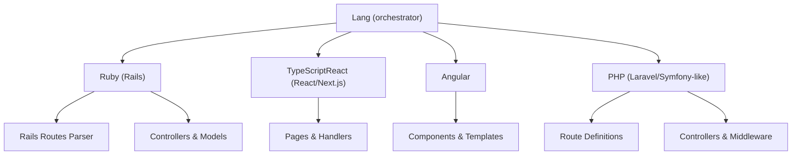
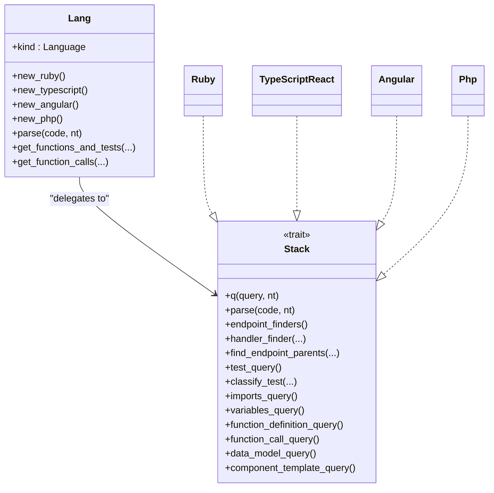
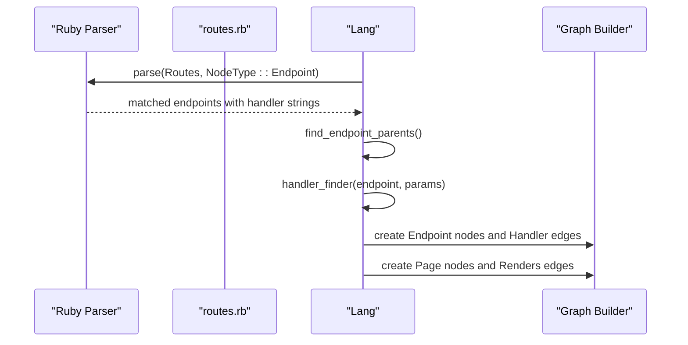
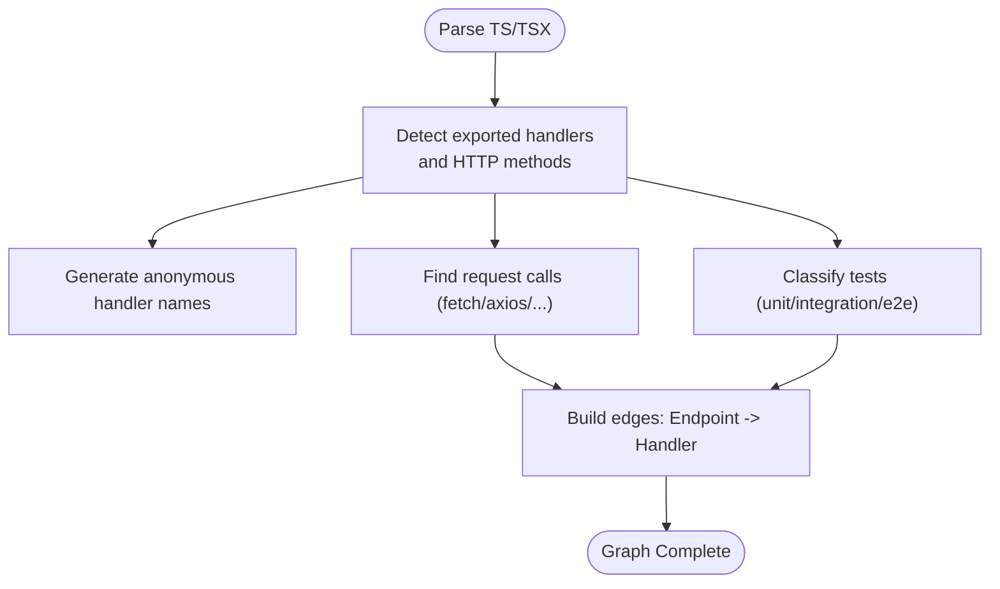
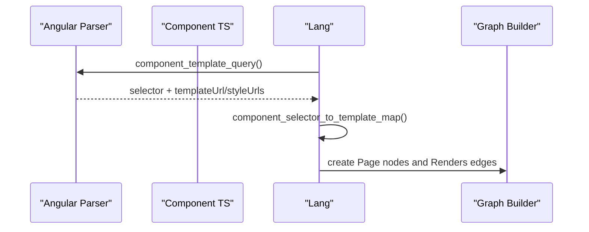
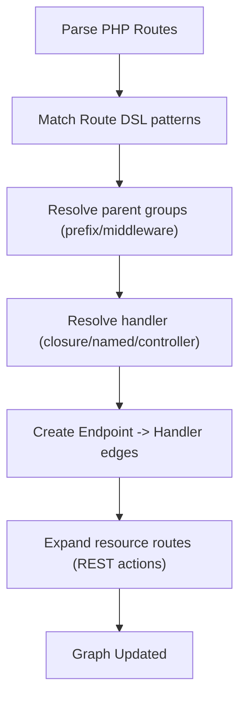
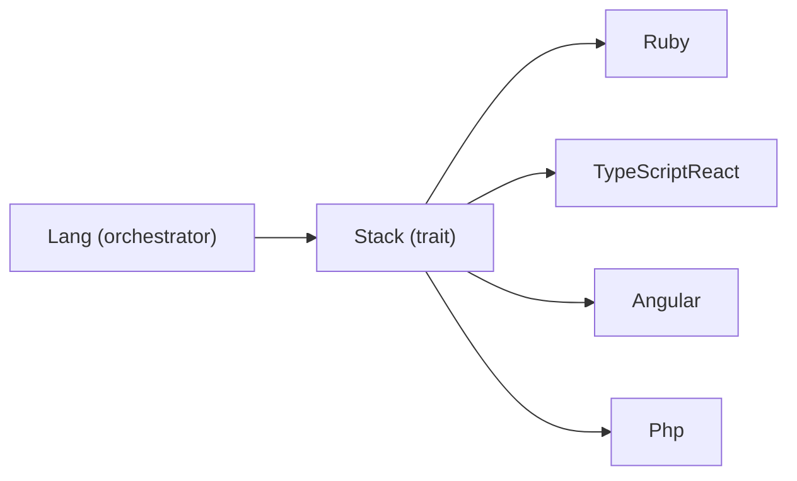

# Framework and Library Integrations

<cite>
**Referenced Files in This Document**
- [mod.rs](file://ast/src/lang/mod.rs)
- [queries/mod.rs](file://ast/src/lang/queries/mod.rs)
- [rails_routes.rs](file://ast/src/lang/queries/rails_routes.rs)
- [ruby.rs](file://ast/src/lang/queries/ruby.rs)
- [react_ts.rs](file://ast/src/lang/queries/react_ts.rs)
- [angular.rs](file://ast/src/lang/queries/angular.rs)
- [php.rs](file://ast/src/lang/queries/php.rs)
- [routes.rb](file://ast/examples/minimal/ruby/config/routes.rb)
- [Gemfile](file://ast/examples/minimal/ruby/Gemfile)
- [sessions_controller.rb](file://ast/examples/minimal/ruby/app/controllers/sessions_controller.rb)
- [Main.tsx](file://ast/examples/minimal/Main.tsx)
- [next.rs](file://ast/examples/next.rs)
</cite>

## Table of Contents
1. [Introduction](#introduction)
2. [Project Structure](#project-structure)
3. [Core Components](#core-components)
4. [Architecture Overview](#architecture-overview)
5. [Detailed Component Analysis](#detailed-component-analysis)
6. [Dependency Analysis](#dependency-analysis)
7. [Performance Considerations](#performance-considerations)
8. [Troubleshooting Guide](#troubleshooting-guide)
9. [Conclusion](#conclusion)

## Introduction
This document explains StakGraph's framework and library integration capabilities. It focuses on how the system parses and extracts meaningful information from major web frameworks and languages, including Ruby on Rails routing, React/Next.js applications, Angular applications, and PHP frameworks. The documentation covers framework-specific parsing strategies for routing files, component hierarchies, dependency injection patterns, and middleware configurations. It also details how framework constructs are mapped to graph nodes and edges, and how an abstraction layer enables framework-aware queries while remaining language-independent.

## Project Structure
StakGraph organizes framework integrations under a unified abstraction layer:
- A central language-agnostic orchestrator coordinates parsing and graph building.
- Per-language modules implement framework-specific queries and handlers.
- Framework-specific parsers extract endpoints, components, services, and relationships.

**Diagram sources**
- [mod.rs:51-321](file://ast/src/lang/mod.rs#L51-L321)
- [queries/mod.rs:55-393](file://ast/src/lang/queries/mod.rs#L55-L393)
- [ruby.rs:31-800](file://ast/src/lang/queries/ruby.rs#L31-L800)
- [react_ts.rs:29-800](file://ast/src/lang/queries/react_ts.rs#L29-L800)
- [angular.rs:20-582](file://ast/src/lang/queries/angular.rs#L20-L582)
- [php.rs:23-790](file://ast/src/lang/queries/php.rs#L23-L790)

**Section sources**
- [mod.rs:51-321](file://ast/src/lang/mod.rs#L51-L321)
- [queries/mod.rs:55-393](file://ast/src/lang/queries/mod.rs#L55-L393)

## Core Components
- Lang orchestrator: Provides unified parsing, caching, and graph-building APIs across languages and frameworks. It manages query compilation, parsing, and traversal.
- Stack trait: Defines per-language/framework contracts for queries, parsing, test detection, endpoint resolution, and import resolution.
- Framework-specific modules: Implement Stack for Ruby on Rails, React/Next.js, Angular, and PHP, each with tailored queries and handlers.

Key responsibilities:
- Parse code into ASTs using Tree-sitter.
- Compile and cache queries for repeated use.
- Extract endpoints, components, classes, variables, and tests.
- Resolve relationships (handlers to controllers, renders, contains, calls).
- Support framework-specific filters and path normalization.

**Section sources**
- [mod.rs:51-321](file://ast/src/lang/mod.rs#L51-L321)
- [queries/mod.rs:55-393](file://ast/src/lang/queries/mod.rs#L55-L393)

## Architecture Overview
The architecture separates concerns across layers:
- Language abstraction: Stack trait and Lang orchestrator.
- Framework parsers: Ruby, React/Next.js, Angular, PHP.
- Routing and endpoint resolution: Rails routes, PHP route chains, Next.js handlers.
- Graph construction: Edges represent relationships (handler-to-controller, renders, contains, calls).

**Diagram sources**
- [mod.rs:51-321](file://ast/src/lang/mod.rs#L51-L321)
- [queries/mod.rs:55-393](file://ast/src/lang/queries/mod.rs#L55-L393)
- [ruby.rs:31-800](file://ast/src/lang/queries/ruby.rs#L31-L800)
- [react_ts.rs:29-800](file://ast/src/lang/queries/react_ts.rs#L29-L800)
- [angular.rs:20-582](file://ast/src/lang/queries/angular.rs#L20-L582)
- [php.rs:23-790](file://ast/src/lang/queries/php.rs#L23-L790)

## Detailed Component Analysis

### Ruby on Rails Integration
Rails integration focuses on:
- Parsing routes.rb to discover endpoints, verbs, and handlers.
- Resolving handlers to controller actions and rendering views.
- Detecting models via ActiveRecord schema blocks.
- Identifying tests (RSpec, Minitest) and categorizing by type.

Key mechanisms:
- Endpoint discovery via Rails route DSL patterns (root, verb-based routes, resources, nested collections/members).
- Parent scoping resolution (namespaces, scopes, middleware) to compute canonical paths.
- Handler resolution mapping handler strings to controller files and actions.
- View rendering edges linking controllers/actions to ERB/HAML/Slim templates.

**Diagram sources**
- [ruby.rs:170-715](file://ast/src/lang/queries/ruby.rs#L170-L715)
- [rails_routes.rs:4-148](file://ast/src/lang/queries/rails_routes.rs#L4-L148)
- [rails_routes.rs:152-310](file://ast/src/lang/queries/rails_routes.rs#L152-L310)

Examples from repository:
- routes.rb demonstrates typical Rails routing patterns including namespace, resources, and verb-based routes.
- sessions_controller.rb shows a controller action used by routes.
- Gemfile indicates Rails usage.

**Section sources**
- [ruby.rs:170-715](file://ast/src/lang/queries/ruby.rs#L170-L715)
- [rails_routes.rs:4-148](file://ast/src/lang/queries/rails_routes.rs#L4-L148)
- [rails_routes.rs:152-310](file://ast/src/lang/queries/rails_routes.rs#L152-L310)
- [routes.rb:1-23](file://ast/examples/minimal/ruby/config/routes.rb#L1-L23)
- [sessions_controller.rb:1-10](file://ast/examples/minimal/ruby/app/controllers/sessions_controller.rb#L1-L10)
- [Gemfile:1-7](file://ast/examples/minimal/ruby/Gemfile#L1-L7)

### React/Next.js Integration
React/Next.js integration focuses on:
- Discovering pages and handlers exported from pages.
- Recognizing request patterns via fetch/axios/Request/NextRequest.
- Categorizing tests (unit, integration, e2e) based on file paths and heuristics.
- Building edges between pages and handlers.

Key mechanisms:
- Endpoint finders detect exported handlers and HTTP methods.
- Request finder identifies outbound HTTP calls to external endpoints.
- Test classification uses file patterns and body heuristics.
- Integration supports Next.js app router patterns.

**Diagram sources**
- [react_ts.rs:592-704](file://ast/src/lang/queries/react_ts.rs#L592-L704)
- [react_ts.rs:707-755](file://ast/src/lang/queries/react_ts.rs#L707-L755)
- [react_ts.rs:59-129](file://ast/src/lang/queries/react_ts.rs#L59-L129)

Example from repository:
- Main.tsx demonstrates React component exports, function declarations, and HTTP calls.

**Section sources**
- [react_ts.rs:592-704](file://ast/src/lang/queries/react_ts.rs#L592-L704)
- [react_ts.rs:707-755](file://ast/src/lang/queries/react_ts.rs#L707-L755)
- [react_ts.rs:59-129](file://ast/src/lang/queries/react_ts.rs#L59-L129)
- [Main.tsx:1-59](file://ast/examples/minimal/Main.tsx#L1-L59)
- [next.rs:1-24](file://ast/examples/next.rs#L1-L24)

### Angular Integration
Angular integration focuses on:
- Component discovery via decorators and class definitions.
- Template and style URL extraction from component decorators.
- Rendering edges between components and HTML/CSS templates.
- Test classification and e2e detection.

Key mechanisms:
- Component template query captures templateUrl/styleUrls/selectors.
- Selector-to-template mapping resolves component templates.
- Extra page finder recognizes HTML/CSS files rendered by components.
- Import resolution trims quotes and normalizes paths.

**Diagram sources**
- [angular.rs:35-53](file://ast/src/lang/queries/angular.rs#L35-L53)
- [angular.rs:483-551](file://ast/src/lang/queries/angular.rs#L483-L551)
- [angular.rs:553-580](file://ast/src/lang/queries/angular.rs#L553-L580)

**Section sources**
- [angular.rs:35-53](file://ast/src/lang/queries/angular.rs#L35-L53)
- [angular.rs:483-551](file://ast/src/lang/queries/angular.rs#L483-L551)
- [angular.rs:553-580](file://ast/src/lang/queries/angular.rs#L553-L580)

### PHP Framework Integration
PHP integration focuses on:
- Route discovery via Laravel-style Route facade calls and attributes.
- Controller/method resolution and RESTful resource handling.
- Middleware and prefix grouping resolution.
- Test detection and classification.

Key mechanisms:
- Endpoint finders cover scoped calls, chained calls, and attribute-based routes.
- Parent scoping resolution for prefixes and middleware.
- Handler resolution for closures, named handlers, and resource controllers.
- Anonymous handler naming for unnamed closures.

**Diagram sources**
- [php.rs:306-416](file://ast/src/lang/queries/php.rs#L306-L416)
- [php.rs:460-605](file://ast/src/lang/queries/php.rs#L460-L605)
- [php.rs:632-771](file://ast/src/lang/queries/php.rs#L632-L771)

**Section sources**
- [php.rs:306-416](file://ast/src/lang/queries/php.rs#L306-L416)
- [php.rs:460-605](file://ast/src/lang/queries/php.rs#L460-L605)
- [php.rs:632-771](file://ast/src/lang/queries/php.rs#L632-L771)

## Dependency Analysis
The system maintains loose coupling between the orchestrator and framework parsers:
- Lang delegates all parsing and query execution to Stack implementations.
- Each Stack defines its own query sets and handler logic.
- Shared constants and types enable consistent node/edge semantics across frameworks.

**Diagram sources**
- [mod.rs:51-321](file://ast/src/lang/mod.rs#L51-L321)
- [queries/mod.rs:55-393](file://ast/src/lang/queries/mod.rs#L55-L393)

**Section sources**
- [mod.rs:51-321](file://ast/src/lang/mod.rs#L51-L321)
- [queries/mod.rs:55-393](file://ast/src/lang/queries/mod.rs#L55-L393)

## Performance Considerations
- Query caching: Queries are cached per (query string, node type) to avoid repeated compilation.
- Parsing statistics: Aggregate timing and counts help monitor performance.
- Selective parsing: Framework-specific path filters reduce unnecessary parsing (e.g., Rails schema.rb for models).
- Skip lists: Framework-specific skip lists avoid false positives in function call detection.

Recommendations:
- Prefer framework-specific path filters to limit scope.
- Reuse Lang instances across builds to benefit from query cache.
- Use targeted queries for large repositories to minimize overhead.

**Section sources**
- [mod.rs:31-49](file://ast/src/lang/mod.rs#L31-L49)
- [ruby.rs:256-258](file://ast/src/lang/queries/ruby.rs#L256-L258)

## Troubleshooting Guide
Common issues and resolutions:
- Routes not discovered in Rails: Verify routes.rb is parsed and endpoint filters match file names.
- Handler not linked to controller: Ensure handler strings match controller file naming conventions and actions.
- Next.js handlers missing: Confirm exported handlers and HTTP methods are detected by endpoint finders.
- Angular template links incorrect: Check component selectors and templateUrl resolution logic.
- PHP resource routes unresolved: Validate controller naming and REST action mapping.

Diagnostic tips:
- Enable parse stats to identify slow queries.
- Inspect query compilation errors for malformed patterns.
- Verify test classification heuristics align with project structure.

**Section sources**
- [mod.rs:31-49](file://ast/src/lang/mod.rs#L31-L49)
- [ruby.rs:533-660](file://ast/src/lang/queries/ruby.rs#L533-L660)
- [react_ts.rs:592-704](file://ast/src/lang/queries/react_ts.rs#L592-L704)
- [angular.rs:483-551](file://ast/src/lang/queries/angular.rs#L483-L551)
- [php.rs:632-771](file://ast/src/lang/queries/php.rs#L632-L771)

## Conclusion
StakGraph’s framework integration layer provides a robust, extensible foundation for extracting and modeling web application structures across Ruby on Rails, React/Next.js, Angular, and PHP. Through a unified Stack interface and framework-specific parsers, it transforms routing files, components, and code constructs into a coherent graph of nodes and edges. The abstraction layer ensures language independence while enabling powerful, framework-aware queries and relationships.