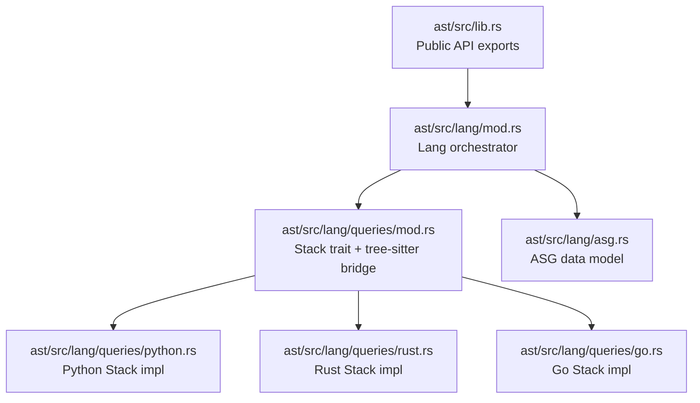
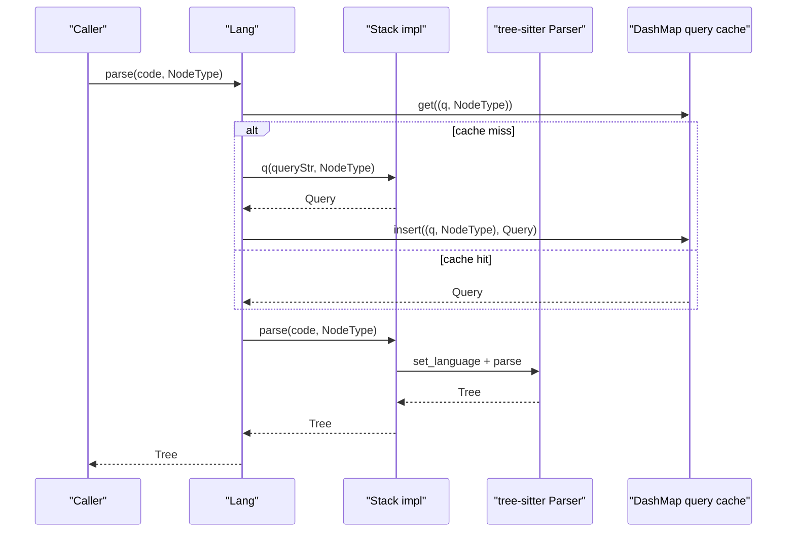
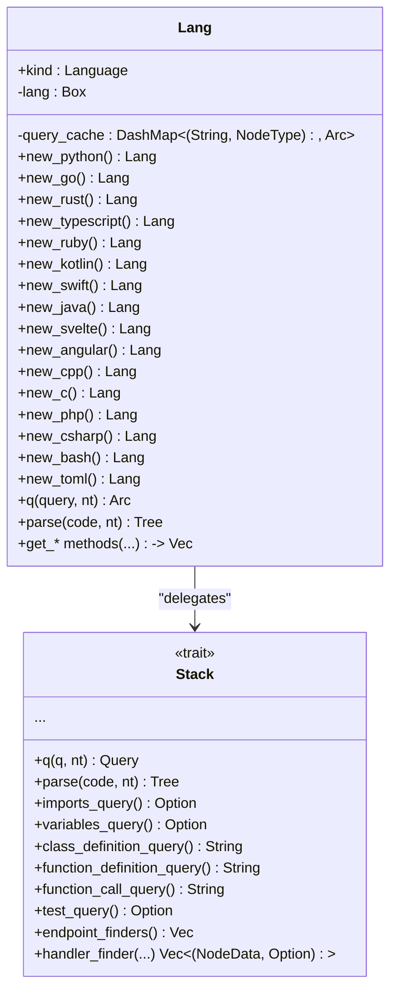
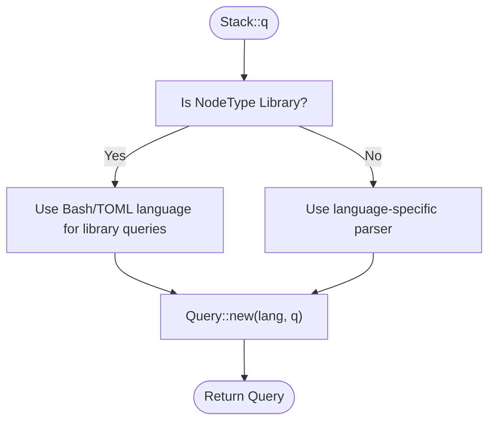
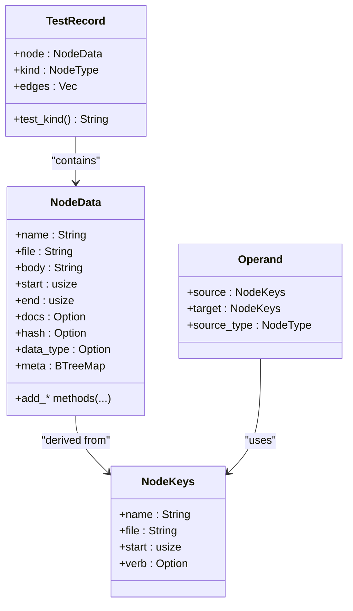
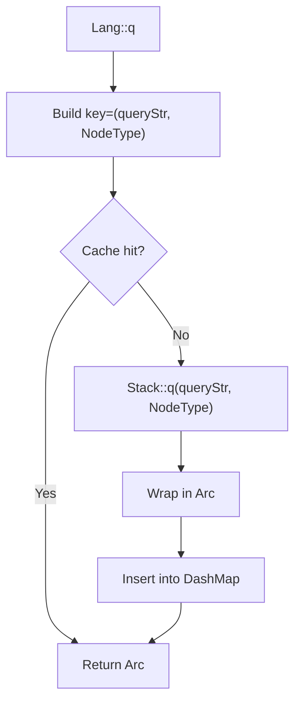
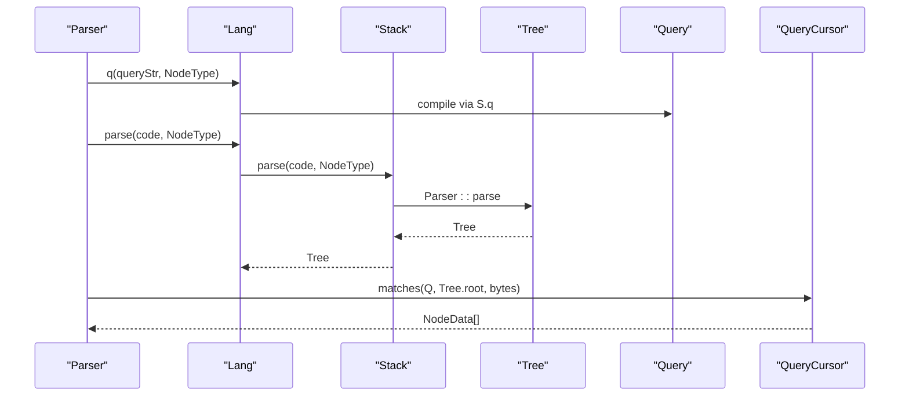
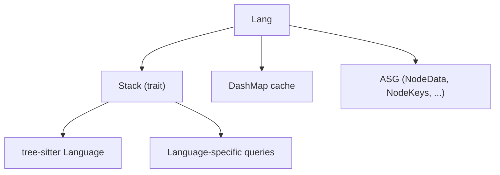

# Language Architecture Overview

<cite>
**Referenced Files in This Document**
- [ast/src/lang/mod.rs](file://ast/src/lang/mod.rs)
- [ast/src/lang/asg.rs](file://ast/src/lang/asg.rs)
- [ast/src/lib.rs](file://ast/src/lib.rs)
- [ast/src/lang/queries/mod.rs](file://ast/src/lang/queries/mod.rs)
- [ast/src/lang/queries/python.rs](file://ast/src/lang/queries/python.rs)
- [ast/src/lang/queries/rust.rs](file://ast/src/lang/queries/rust.rs)
- [ast/src/lang/queries/go.rs](file://ast/src/lang/queries/go.rs)
</cite>

## Table of Contents
1. [Introduction](#introduction)
2. [Project Structure](#project-structure)
3. [Core Components](#core-components)
4. [Architecture Overview](#architecture-overview)
5. [Detailed Component Analysis](#detailed-component-analysis)
6. [Dependency Analysis](#dependency-analysis)
7. [Performance Considerations](#performance-considerations)
8. [Troubleshooting Guide](#troubleshooting-guide)
9. [Conclusion](#conclusion)

## Introduction
This document explains StakGraph’s language architecture foundation: the Lang struct and Stack trait system that enable pluggable language support, the language factory pattern, query caching with DashMap, and the tree-sitter integration architecture. It also details how the system abstracts language-specific parsing while maintaining consistent interfaces, documents the ASG (Abstract Syntax Graph) data model and standardized node representations, and describes the parsing pipeline from raw code to structured graph nodes, including performance optimizations and memory management strategies.

## Project Structure
The language architecture is centered in the ast crate under ast/src/lang. Key areas:
- Lang orchestrates language-specific parsing and query execution via a Stack trait implementation.
- Stack defines the contract for language parsers, queries, and specialized behaviors.
- Queries are organized per language under ast/src/lang/queries with a shared trait and constants.
- ASG provides the standardized node representation and metadata model used across languages.
- The public API exposes Lang at the crate root.

**Diagram sources**
- [ast/src/lib.rs:1-14](file://ast/src/lib.rs#L1-L14)
- [ast/src/lang/mod.rs:1-100](file://ast/src/lang/mod.rs#L1-L100)
- [ast/src/lang/queries/mod.rs:55-393](file://ast/src/lang/queries/mod.rs#L55-L393)
- [ast/src/lang/queries/python.rs:20-564](file://ast/src/lang/queries/python.rs#L20-L564)
- [ast/src/lang/queries/rust.rs:178-800](file://ast/src/lang/queries/rust.rs#L178-L800)
- [ast/src/lang/queries/go.rs:21-512](file://ast/src/lang/queries/go.rs#L21-L512)
- [ast/src/lang/asg.rs:16-425](file://ast/src/lang/asg.rs#L16-L425)

**Section sources**
- [ast/src/lib.rs:1-14](file://ast/src/lib.rs#L1-L14)
- [ast/src/lang/mod.rs:1-100](file://ast/src/lang/mod.rs#L1-L100)

## Core Components
- Lang: A facade that encapsulates a language-specific Stack implementation, a DashMap-backed query cache, and a set of convenience methods to parse code and collect structured nodes. It delegates parsing to the underlying Stack and caches compiled tree-sitter queries keyed by query string and NodeType.
- Stack trait: Defines the language abstraction boundary. Methods include parse, q (compile query), and numerous query strings for constructs like imports, classes, functions, tests, endpoints, and comments. It also exposes language-specific behaviors such as test classification, handler resolution, and endpoint verb inference.
- ASG (Abstract Syntax Graph): Provides a unified NodeData model enriched with metadata, plus supporting types like NodeKeys, Operand, and TestRecord. This ensures consistent node semantics across languages.

**Section sources**
- [ast/src/lang/mod.rs:51-329](file://ast/src/lang/mod.rs#L51-L329)
- [ast/src/lang/queries/mod.rs:55-393](file://ast/src/lang/queries/mod.rs#L55-L393)
- [ast/src/lang/asg.rs:16-228](file://ast/src/lang/asg.rs#L16-L228)

## Architecture Overview
The system composes a language-agnostic orchestration layer (Lang) with language-specific implementations (Stack) and a shared ASG model. Parsing proceeds through tree-sitter, with queries compiled and cached. The pipeline produces standardized NodeData instances that feed downstream graph construction and linking.

**Diagram sources**
- [ast/src/lang/mod.rs:312-329](file://ast/src/lang/mod.rs#L312-L329)
- [ast/src/lang/queries/mod.rs:55-61](file://ast/src/lang/queries/mod.rs#L55-L61)

## Detailed Component Analysis

### Lang: Orchestrator and Factory
- Responsibilities:
  - Maintain a boxed Stack trait object for the chosen language.
  - Provide a DashMap-based query cache keyed by (query string, NodeType).
  - Offer convenience methods to collect nodes for classes, traits, functions, variables, libraries, pages, and component templates.
  - Attach comments to nodes and filter nested data models using scope queries.
  - Track and report parse statistics.
- Factory pattern:
  - Constructors for each supported language return a Lang instance with the appropriate Stack implementation and a fresh query cache.

**Diagram sources**
- [ast/src/lang/mod.rs:51-301](file://ast/src/lang/mod.rs#L51-L301)
- [ast/src/lang/queries/mod.rs:55-393](file://ast/src/lang/queries/mod.rs#L55-L393)

**Section sources**
- [ast/src/lang/mod.rs:51-301](file://ast/src/lang/mod.rs#L51-L301)
- [ast/src/lang/mod.rs:312-329](file://ast/src/lang/mod.rs#L312-L329)

### Stack Trait: Language Abstraction Boundary
- Contract:
  - q compiles a tree-sitter query for a given NodeType.
  - parse performs language-specific parsing and returns a Tree.
  - Optional query strings define how to extract imports, variables, classes, functions, tests, endpoints, comments, traits, and more.
  - Specialized behaviors: test detection/classification, handler resolution, endpoint verb inference, anonymous handler naming, import path/name resolution, and graph cleaning.
- Tree-sitter integration:
  - The trait bridges LSP Language to tree-sitter Language via a conversion function, enabling dynamic selection of the correct parser.

**Diagram sources**
- [ast/src/lang/queries/mod.rs:395-414](file://ast/src/lang/queries/mod.rs#L395-L414)
- [ast/src/lang/queries/python.rs:24-36](file://ast/src/lang/queries/python.rs#L24-L36)
- [ast/src/lang/queries/rust.rs:225-237](file://ast/src/lang/queries/rust.rs#L225-L237)
- [ast/src/lang/queries/go.rs:25-37](file://ast/src/lang/queries/go.rs#L25-L37)

**Section sources**
- [ast/src/lang/queries/mod.rs:55-393](file://ast/src/lang/queries/mod.rs#L55-L393)
- [ast/src/lang/queries/mod.rs:395-414](file://ast/src/lang/queries/mod.rs#L395-L414)

### ASG Data Model: Standardized Node Representation
- NodeData: A canonical representation of a parsed element with name, file, body, start/end positions, optional docs/hash/type, and a metadata map. It supports serialization and adds metadata via helper methods.
- NodeKeys: Lightweight unique key derived from NodeData for deduplication and cross-language matching.
- Operand and TestRecord: Represent relationships and test metadata consistently across languages.
- NodeType: Enumerated node kinds with string conversions, ensuring uniform semantics across parsers.

**Diagram sources**
- [ast/src/lang/asg.rs:66-228](file://ast/src/lang/asg.rs#L66-L228)
- [ast/src/lang/asg.rs:244-270](file://ast/src/lang/asg.rs#L244-L270)

**Section sources**
- [ast/src/lang/asg.rs:66-228](file://ast/src/lang/asg.rs#L66-L228)
- [ast/src/lang/asg.rs:272-327](file://ast/src/lang/asg.rs#L272-L327)

### Language Implementations: Python, Rust, Go
- Python:
  - Implements imports, variables, classes, functions, tests, endpoints, traits, and comments.
  - Uses a dedicated skip list for function calls and handler resolution tailored to frameworks.
- Rust:
  - Extends Stack with framework-specific route discovery (Actix, Rocket, Axum), prefix extraction for nested scopes, and anonymous handler naming.
  - Provides library queries targeting TOML and import resolution for modules.
- Go:
  - Supports module and import queries, library queries, and function call extraction.

These implementations demonstrate how Stack allows language-specific parsing and semantic extraction while preserving a consistent interface for consumers.

**Section sources**
- [ast/src/lang/queries/python.rs:20-564](file://ast/src/lang/queries/python.rs#L20-L564)
- [ast/src/lang/queries/rust.rs:178-800](file://ast/src/lang/queries/rust.rs#L178-L800)
- [ast/src/lang/queries/go.rs:21-512](file://ast/src/lang/queries/go.rs#L21-L512)

### Query Caching Mechanism with DashMap
- Lang maintains a DashMap cache keyed by (query string, NodeType) storing Arc<Query>.
- The q method checks the cache first; if absent, compiles the query via Stack::q, wraps it in Arc, inserts it, and returns it.
- Benefits:
  - Avoids repeated compilation of identical queries.
  - Reduces CPU overhead during repeated parsing of the same language constructs.
  - Thread-safe access via DashMap for concurrent parsing.

**Diagram sources**
- [ast/src/lang/mod.rs:312-321](file://ast/src/lang/mod.rs#L312-L321)

**Section sources**
- [ast/src/lang/mod.rs:312-321](file://ast/src/lang/mod.rs#L312-L321)

### Parsing Pipeline: From Raw Code to Structured Nodes
- Input: Raw code and a NodeType indicating the construct to extract.
- Steps:
  1. Lang::q retrieves or compiles a tree-sitter Query.
  2. Lang::parse invokes Stack::parse to produce a Tree.
  3. Consumers use QueryCursor to iterate matches and extract NodeData instances.
  4. Comments and metadata are attached to nodes where applicable.
  5. Results are normalized into ASG NodeData and returned to callers.

**Diagram sources**
- [ast/src/lang/mod.rs:312-329](file://ast/src/lang/mod.rs#L312-L329)
- [ast/src/lang/queries/mod.rs:55-61](file://ast/src/lang/queries/mod.rs#L55-L61)

**Section sources**
- [ast/src/lang/mod.rs:312-329](file://ast/src/lang/mod.rs#L312-L329)

## Dependency Analysis
- Lang depends on:
  - Stack trait for language-specific parsing and query generation.
  - DashMap for query caching.
  - tree-sitter for parsing and querying.
  - LSP Language enum for selecting the correct tree-sitter language.
- Stack implementations depend on:
  - tree-sitter language crates for parsing.
  - Language-specific query strings and skip lists.
- ASG is consumed by graph builders and linkers to maintain consistent node semantics.

**Diagram sources**
- [ast/src/lang/mod.rs:51-329](file://ast/src/lang/mod.rs#L51-L329)
- [ast/src/lang/queries/mod.rs:55-393](file://ast/src/lang/queries/mod.rs#L55-L393)
- [ast/src/lang/asg.rs:16-228](file://ast/src/lang/asg.rs#L16-L228)

**Section sources**
- [ast/src/lang/mod.rs:51-329](file://ast/src/lang/mod.rs#L51-L329)
- [ast/src/lang/queries/mod.rs:55-393](file://ast/src/lang/queries/mod.rs#L55-L393)

## Performance Considerations
- Query caching:
  - Use Lang::q to avoid recompiling identical queries; leverage Arc for cheap cloning.
- Concurrency:
  - DashMap provides lock-free concurrent access; ensure queries are immutable after insertion.
- Parse timing:
  - Lang tracks total parses and average parse time; use reset and print utilities for diagnostics.
- Memory management:
  - Prefer passing byte slices to tree-sitter APIs to avoid unnecessary allocations.
  - Reuse buffers and avoid cloning large strings; ASG metadata maps are compact and serialized efficiently.

[No sources needed since this section provides general guidance]

## Troubleshooting Guide
- Query compilation failures:
  - Stack::q panics on invalid queries; verify query strings and capture names align with language grammar.
- Incorrect language selection:
  - Ensure the LSP Language maps to the correct tree-sitter Language via the bridge function.
- Missing or misclassified tests:
  - Confirm language-specific test detection and classification logic; adjust skip lists and classification rules as needed.
- Endpoint verb inference:
  - Verify endpoint finder queries and handler resolution logic for the target framework.
- Comment attachment:
  - Confirm comment queries and capture names match the language’s comment syntax.

**Section sources**
- [ast/src/lang/queries/python.rs:24-36](file://ast/src/lang/queries/python.rs#L24-L36)
- [ast/src/lang/queries/rust.rs:225-237](file://ast/src/lang/queries/rust.rs#L225-L237)
- [ast/src/lang/queries/go.rs:25-37](file://ast/src/lang/queries/go.rs#L25-L37)
- [ast/src/lang/queries/mod.rs:395-414](file://ast/src/lang/queries/mod.rs#L395-L414)

## Conclusion
StakGraph’s language architecture cleanly separates language-specific parsing and semantic extraction behind the Stack trait, while a shared ASG model and query caching ensure consistent, efficient, and scalable processing across many languages. The Lang orchestrator centralizes caching, parsing, and collection, enabling robust graph construction from heterogeneous codebases.