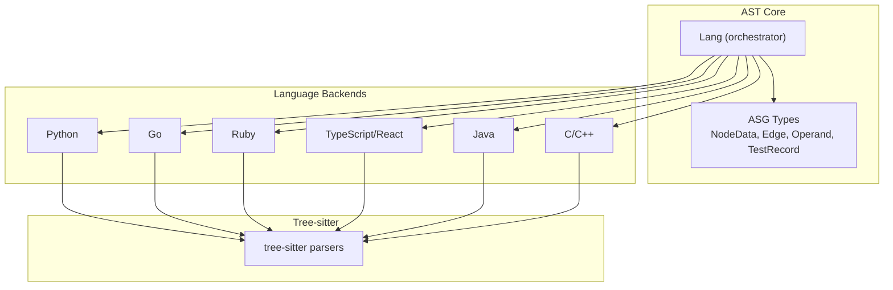
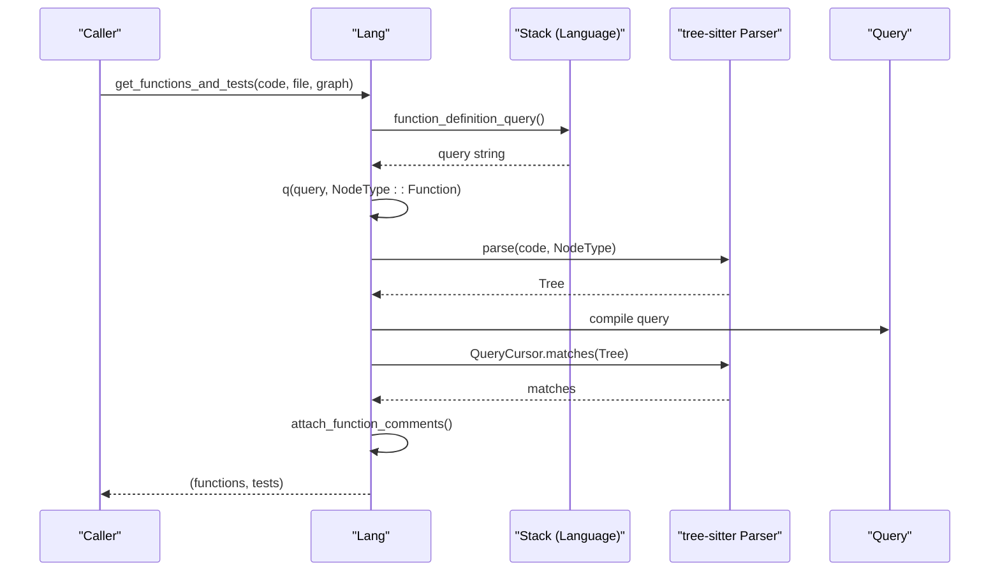
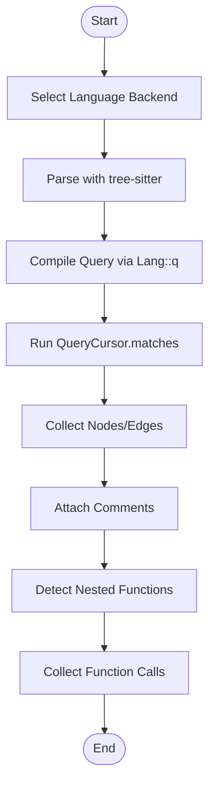
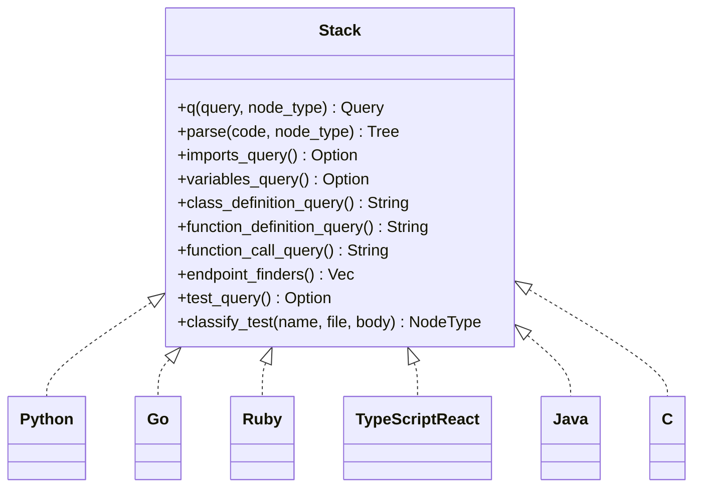
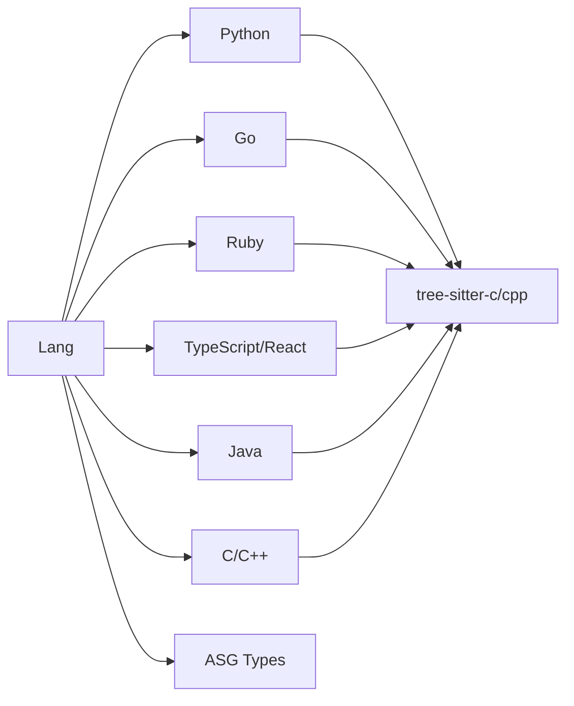

# Language Support System

<cite>
**Referenced Files in This Document**
- [mod.rs](file://ast/src/lang/mod.rs)
- [lib.rs](file://ast/src/lib.rs)
- [asg.rs](file://ast/src/lang/asg.rs)
- [queries/mod.rs](file://ast/src/lang/queries/mod.rs)
- [python.rs](file://ast/src/lang/queries/python.rs)
- [go.rs](file://ast/src/lang/queries/go.rs)
- [ruby.rs](file://ast/src/lang/queries/ruby.rs)
- [react_ts.rs](file://ast/src/lang/queries/react_ts.rs)
- [java.rs](file://ast/src/lang/queries/java.rs)
- [c.rs](file://ast/src/lang/queries/c.rs)
- [treesitter_from_lsp_language:395-414](file://ast/src/lang/queries/mod.rs#L395-L414)
- [Lang::new_python:197-203](file://ast/src/lang/mod.rs#L197-L203)
- [Lang::new_go:204-210](file://ast/src/lang/mod.rs#L204-L210)
- [Lang::new_rust:211-217](file://ast/src/lang/mod.rs#L211-L217)
- [Lang::new_typescript:218-224](file://ast/src/lang/mod.rs#L218-L224)
- [Lang::new_ruby:225-231](file://ast/src/lang/mod.rs#L225-L231)
- [Lang::new_kotlin:232-238](file://ast/src/lang/mod.rs#L232-L238)
- [Lang::new_swift:239-245](file://ast/src/lang/mod.rs#L239-L245)
- [Lang::new_java:246-252](file://ast/src/lang/mod.rs#L246-L252)
- [Lang::new_svelte:253-259](file://ast/src/lang/mod.rs#L253-L259)
- [Lang::new_angular:260-266](file://ast/src/lang/mod.rs#L260-L266)
- [Lang::new_cpp:267-273](file://ast/src/lang/mod.rs#L267-L273)
- [Lang::new_c:274-280](file://ast/src/lang/mod.rs#L274-L280)
- [Lang::new_php:281-287](file://ast/src/lang/mod.rs#L281-L287)
- [Lang::new_csharp:288-294](file://ast/src/lang/mod.rs#L288-L294)
- [Lang::new_bash:295-301](file://ast/src/lang/mod.rs#L295-L301)
- [Lang::new_toml:302-308](file://ast/src/lang/mod.rs#L302-L308)
- [Lang::q:312-321](file://ast/src/lang/mod.rs#L312-L321)
- [Lang::parse:322-329](file://ast/src/lang/mod.rs#L322-L329)
- [Lang::get_functions_and_tests:603-728](file://ast/src/lang/mod.rs#L603-L728)
- [Lang::get_function_calls:744-800](file://ast/src/lang/mod.rs#L744-L800)
- [Stack::endpoint_finders:180-182](file://ast/src/lang/queries/mod.rs#L180-L182)
- [Stack::request_finder:707-755](file://ast/src/lang/queries/react_ts.rs#L707-L755)
- [Stack::endpoint_group_find:758-771](file://ast/src/lang/queries/react_ts.rs#L758-L771)
- [Stack::handler_finder:591-704](file://ast/src/lang/queries/react_ts.rs#L591-L704)
- [Python::endpoint_finders:271-372](file://ast/src/lang/queries/python.rs#L271-L372)
- [Go::endpoint_finders:206-293](file://ast/src/lang/queries/go.rs#L206-L293)
- [Ruby::endpoint_finders:170-172](file://ast/src/lang/queries/ruby.rs#L170-L172)
- [Java::endpoint_finders:243-292](file://ast/src/lang/queries/java.rs#L243-L292)
- [C::endpoint_finders:275-305](file://ast/src/lang/queries/c.rs#L275-L305)
- [Python::data_model_query:414-425](file://ast/src/lang/queries/python.rs#L414-L425)
- [Go::data_model_query:392-401](file://ast/src/lang/queries/go.rs#L392-L401)
- [Ruby::data_model_query:228-254](file://ast/src/lang/queries/ruby.rs#L228-L254)
- [Java::data_model_query:398-416](file://ast/src/lang/queries/java.rs#L398-L416)
- [C::data_model_query:254-273](file://ast/src/lang/queries/c.rs#L254-L273)
- [Python::test_query:156-174](file://ast/src/lang/queries/python.rs#L156-L174)
- [Go::test_query:459-465](file://ast/src/lang/queries/go.rs#L459-L465)
- [Ruby::test_query:341-394](file://ast/src/lang/queries/ruby.rs#L341-L394)
- [Java::test_query:224-242](file://ast/src/lang/queries/java.rs#L224-L242)
- [C::test_query:60-66](file://ast/src/lang/queries/c.rs#L60-L66)
- [Python::classify_test:191-227](file://ast/src/lang/queries/python.rs#L191-L227)
- [Go::classify_test:411-448](file://ast/src/lang/queries/go.rs#L411-L448)
- [Ruby::classify_test:410-531](file://ast/src/lang/queries/ruby.rs#L410-L531)
- [Java::classify_test:388-397](file://ast/src/lang/queries/java.rs#L388-L397)
- [C::classify_test:68-91](file://ast/src/lang/queries/c.rs#L68-L91)
- [Python::function_call_query:258-269](file://ast/src/lang/queries/python.rs#L258-L269)
- [Go::function_call_query:175-192](file://ast/src/lang/queries/go.rs#L175-L192)
- [Ruby::function_call_query:157-169](file://ast/src/lang/queries/ruby.rs#L157-L169)
- [Java::function_call_query:195-222](file://ast/src/lang/queries/java.rs#L195-L222)
- [C::function_call_query:224-252](file://ast/src/lang/queries/c.rs#L224-L252)
- [Python::imports_query:56-73](file://ast/src/lang/queries/python.rs#L56-L73)
- [Go::imports_query:66-72](file://ast/src/lang/queries/go.rs#L66-L72)
- [Ruby::imports_query:55-64](file://ast/src/lang/queries/ruby.rs#L55-L64)
- [Java::imports_query:44-53](file://ast/src/lang/queries/java.rs#L44-L53)
- [C::imports_query:109-129](file://ast/src/lang/queries/c.rs#L109-L129)
- [Python::variables_query:74-99](file://ast/src/lang/queries/python.rs#L74-L99)
- [Go::variables_query:73-94](file://ast/src/lang/queries/go.rs#L73-L94)
- [Ruby::variables_query:66-77](file://ast/src/lang/queries/ruby.rs#L66-L77)
- [Java::variables_query:54-77](file://ast/src/lang/queries/java.rs#L54-L77)
- [C::variables_query:131-146](file://ast/src/lang/queries/c.rs#L131-L146)
- [Python::class_definition_query:101-125](file://ast/src/lang/queries/python.rs#L101-L125)
- [Go::class_definition_query:106-113](file://ast/src/lang/queries/go.rs#L106-L113)
- [Ruby::class_definition_query:79-125](file://ast/src/lang/queries/ruby.rs#L79-L125)
- [Java::class_definition_query:109-125](file://ast/src/lang/queries/java.rs#L109-L125)
- [C::class_definition_query:148-179](file://ast/src/lang/queries/c.rs#L148-L179)
- [Python::function_definition_query:127-146](file://ast/src/lang/queries/python.rs#L127-L146)
- [Go::function_definition_query:127-154](file://ast/src/lang/queries/go.rs#L127-L154)
- [Ruby::function_definition_query:127-140](file://ast/src/lang/queries/ruby.rs#L127-L140)
- [Java::function_definition_query:160-183](file://ast/src/lang/queries/java.rs#L160-L183)
- [C::function_definition_query:181-210](file://ast/src/lang/queries/c.rs#L181-L210)
- [Python::endpoint_comment_query:150-152](file://ast/src/lang/queries/python.rs#L150-L152)
- [Go::endpoint_comment_query:160-162](file://ast/src/lang/queries/go.rs#L160-L162)
- [Ruby::endpoint_comment_query:151-153](file://ast/src/lang/queries/ruby.rs#L151-L153)
- [Java::endpoint_comment_query:185-192](file://ast/src/lang/queries/java.rs#L185-L192)
- [C::endpoint_comment_query:212-214](file://ast/src/lang/queries/c.rs#L212-L214)
- [Python::data_model_comment_query:427-428](file://ast/src/lang/queries/python.rs#L427-L428)
- [Go::data_model_comment_query:392-392](file://ast/src/lang/queries/go.rs#L392-L392)
- [Ruby::data_model_comment_query:256-258](file://ast/src/lang/queries/ruby.rs#L256-L258)
- [Java::data_model_comment_query:398-416](file://ast/src/lang/queries/java.rs#L398-L416)
- [C::data_model_comment_query:254-273](file://ast/src/lang/queries/c.rs#L254-L273)
- [Python::lib_query:47-54](file://ast/src/lang/queries/python.rs#L47-L54)
- [Go::lib_query:50-62](file://ast/src/lang/queries/go.rs#L50-L62)
- [Ruby::lib_query:43-53](file://ast/src/lang/queries/ruby.rs#L43-L53)
- [Java::lib_query:37-42](file://ast/src/lang/queries/java.rs#L37-L42)
- [C::lib_query:93-107](file://ast/src/lang/queries/c.rs#L93-L107)
- [Python::module_query:63-65](file://ast/src/lang/queries/python.rs#L63-L65)
- [Go::module_query:63-65](file://ast/src/lang/queries/go.rs#L63-L65)
- [Python::trait_query:451-467](file://ast/src/lang/queries/python.rs#L451-L467)
- [Go::trait_query:95-104](file://ast/src/lang/queries/go.rs#L95-L104)
- [Ruby::trait_query:1-886](file://ast/src/lang/queries/ruby.rs#L1-L886)
- [Java::trait_query:79-87](file://ast/src/lang/queries/java.rs#L79-L87)
- [C::trait_query:1-369](file://ast/src/lang/queries/c.rs#L1-L369)
- [Python::implements_query:473-484](file://ast/src/lang/queries/python.rs#L473-L484)
- [Go::implements_query:95-104](file://ast/src/lang/queries/go.rs#L95-L104)
- [Ruby::implements_query:1-886](file://ast/src/lang/queries/ruby.rs#L1-L886)
- [Java::implements_query:89-107](file://ast/src/lang/queries/java.rs#L89-L107)
- [C::implements_query:1-369](file://ast/src/lang/queries/c.rs#L1-L369)
- [Python::is_test:486-491](file://ast/src/lang/queries/python.rs#L486-L491)
- [Go::is_test:450-457](file://ast/src/lang/queries/go.rs#L450-L457)
- [Ruby::is_test:288-295](file://ast/src/lang/queries/ruby.rs#L288-L295)
- [Java::is_test:382-387](file://ast/src/lang/queries/java.rs#L382-L387)
- [C::is_test:60-66](file://ast/src/lang/queries/c.rs#L60-L66)
- [Python::is_test_file:486-491](file://ast/src/lang/queries/python.rs#L486-L491)
- [Go::is_test_file:455-457](file://ast/src/lang/queries/go.rs#L455-L457)
- [Ruby::is_test_file:295-305](file://ast/src/lang/queries/ruby.rs#L295-L305)
- [Java::is_test_file:375-381](file://ast/src/lang/queries/java.rs#L375-L381)
- [C::is_test_file:46-58](file://ast/src/lang/queries/c.rs#L46-L58)
- [Python::is_e2e_test_file:467-493](file://ast/src/lang/queries/python.rs#L467-L493)
- [Go::is_e2e_test_file:467-493](file://ast/src/lang/queries/go.rs#L467-L493)
- [Ruby::is_e2e_test_file:307-336](file://ast/src/lang/queries/ruby.rs#L307-L336)
- [Java::is_e2e_test_file:375-381](file://ast/src/lang/queries/java.rs#L375-L381)
- [C::is_e2e_test_file:46-58](file://ast/src/lang/queries/c.rs#L46-L58)
- [Python::e2e_test_query:176-189](file://ast/src/lang/queries/python.rs#L176-L189)
- [Go::e2e_test_query:495-507](file://ast/src/lang/queries/go.rs#L495-L507)
- [Ruby::e2e_test_query:338-340](file://ast/src/lang/queries/ruby.rs#L338-L340)
- [Java::e2e_test_query:375-381](file://ast/src/lang/queries/java.rs#L375-L381)
- [C::e2e_test_query:46-58](file://ast/src/lang/queries/c.rs#L46-L58)
- [Python::integration_test_query:305-313](file://ast/src/lang/queries/python.rs#L305-L313)
- [Go::integration_test_query:495-507](file://ast/src/lang/queries/go.rs#L495-L507)
- [Ruby::integration_test_query:397-408](file://ast/src/lang/queries/ruby.rs#L397-L408)
- [Java::integration_test_query:375-381](file://ast/src/lang/queries/java.rs#L375-L381)
- [C::integration_test_query:46-58](file://ast/src/lang/queries/c.rs#L46-L58)
- [Python::find_function_parent:229-257](file://ast/src/lang/queries/python.rs#L229-L257)
- [Go::find_function_parent:326-355](file://ast/src/lang/queries/go.rs#L326-L355)
- [Ruby::find_function_parent:193-221](file://ast/src/lang/queries/ruby.rs#L193-L221)
- [Java::find_function_parent:375-381](file://ast/src/lang/queries/java.rs#L375-L381)
- [C::find_function_parent:375-381](file://ast/src/lang/queries/c.rs#L375-L381)
- [Python::find_trait_operand:1-564](file://ast/src/lang/queries/python.rs#L1-L564)
- [Go::find_trait_operand:356-374](file://ast/src/lang/queries/go.rs#L356-L374)
- [Ruby::find_trait_operand:1-886](file://ast/src/lang/queries/ruby.rs#L1-L886)
- [Java::find_trait_operand:375-381](file://ast/src/lang/queries/java.rs#L375-L381)
- [C::find_trait_operand:375-381](file://ast/src/lang/queries/c.rs#L375-L381)
- [Python::generate_anonymous_handler_name:546-562](file://ast/src/lang/queries/python.rs#L546-L562)
- [Go::generate_anonymous_handler_name:295-309](file://ast/src/lang/queries/go.rs#L295-L309)
- [Ruby::generate_anonymous_handler_name:174-188](file://ast/src/lang/queries/ruby.rs#L174-L188)
- [Java::generate_anonymous_handler_name:294-309](file://ast/src/lang/queries/java.rs#L294-L309)
- [C::generate_anonymous_handler_name:307-326](file://ast/src/lang/queries/c.rs#L307-L326)
- [Python::resolve_import_path:374-378](file://ast/src/lang/queries/python.rs#L374-L378)
- [Go::resolve_import_path:374-378](file://ast/src/lang/queries/go.rs#L374-L378)
- [Ruby::resolve_import_path:784-796](file://ast/src/lang/queries/ruby.rs#L784-L796)
- [Java::resolve_import_path:447-456](file://ast/src/lang/queries/java.rs#L447-L456)
- [C::resolve_import_path:375-381](file://ast/src/lang/queries/c.rs#L375-L381)
- [Python::resolve_import_name:374-378](file://ast/src/lang/queries/python.rs#L374-L378)
- [Go::resolve_import_name:374-378](file://ast/src/lang/queries/go.rs#L374-L378)
- [Ruby::resolve_import_name:797-800](file://ast/src/lang/queries/ruby.rs#L797-L800)
- [Java::resolve_import_name:438-446](file://ast/src/lang/queries/java.rs#L438-L446)
- [C::resolve_import_name:375-381](file://ast/src/lang/queries/c.rs#L375-L381)
- [Python::extra_calls_queries:379-381](file://ast/src/lang/queries/python.rs#L379-L381)
- [Go::extra_calls_queries:379-381](file://ast/src/lang/queries/go.rs#L379-L381)
- [Ruby::extra_calls_queries:1-886](file://ast/src/lang/queries/ruby.rs#L1-L886)
- [Java::extra_calls_queries:375-381](file://ast/src/lang/queries/java.rs#L375-L381)
- [C::extra_calls_queries:375-381](file://ast/src/lang/queries/c.rs#L375-L381)
- [Python::class_contains_datamodel:382-388](file://ast/src/lang/queries/python.rs#L382-L388)
- [Go::class_contains_datamodel:382-388](file://ast/src/lang/queries/go.rs#L382-L388)
- [Ruby::class_contains_datamodel:1-886](file://ast/src/lang/queries/ruby.rs#L1-L886)
- [Java::class_contains_datamodel:375-381](file://ast/src/lang/queries/java.rs#L375-L381)
- [C::class_contains_datamodel:375-381](file://ast/src/lang/queries/c.rs#L375-L381)
- [Python::filter_attribute:390-392](file://ast/src/lang/queries/python.rs#L390-L392)
- [Go::filter_attribute:390-392](file://ast/src/lang/queries/go.rs#L390-L392)
- [Ruby::filter_attribute:1-886](file://ast/src/lang/queries/ruby.rs#L1-L886)
- [Java::filter_attribute:375-381](file://ast/src/lang/queries/java.rs#L375-L381)
- [C::filter_attribute:375-381](file://ast/src/lang/queries/c.rs#L375-L381)
</cite>

## Table of Contents
1. [Introduction](#introduction)
2. [Project Structure](#project-structure)
3. [Core Components](#core-components)
4. [Architecture Overview](#architecture-overview)
5. [Detailed Component Analysis](#detailed-component-analysis)
6. [Dependency Analysis](#dependency-analysis)
7. [Performance Considerations](#performance-considerations)
8. [Troubleshooting Guide](#troubleshooting-guide)
9. [Conclusion](#conclusion)

## Introduction
This document explains StakGraph’s multi-language support system. It covers how the system parses code across 16+ languages, integrates with tree-sitter grammars, applies language-specific query sets, and extracts structured artifacts such as functions, classes, endpoints, data models, and relationships. It also documents language parser implementation patterns, custom query development, framework integration examples, and practical parsing scenarios across Python, Go, Ruby, TypeScript/React, Java, C/C++, and others.

## Project Structure
The language support lives primarily under ast/src/lang, with:
- A central orchestrator (Lang) that selects a language backend, caches queries, and executes extraction routines.
- A trait Stack that defines per-language capabilities and query sets.
- Language-specific modules implementing Stack for Python, Go, Ruby, TypeScript/React, Java, C/C++, and more.
- A shared ASG (Abstract Symbol Graph) model for nodes, edges, operands, and test records.

**Diagram sources**
- [mod.rs:51-329](file://ast/src/lang/mod.rs#L51-L329)
- [queries/mod.rs:55-414](file://ast/src/lang/queries/mod.rs#L55-L414)

**Section sources**
- [lib.rs:1-14](file://ast/src/lib.rs#L1-L14)
- [mod.rs:1-329](file://ast/src/lang/mod.rs#L1-L329)
- [asg.rs:1-425](file://ast/src/lang/asg.rs#L1-L425)
- [queries/mod.rs:1-436](file://ast/src/lang/queries/mod.rs#L1-L436)

## Core Components
- Lang orchestrator
  - Provides unified APIs to extract functions, classes, endpoints, data models, libraries, imports, variables, pages, and component templates.
  - Implements query caching, comment attachment, nested function detection, and function call extraction.
  - Exposes constructors for all supported languages.

- Stack trait
  - Defines the contract for language backends: parsing, query compilation, and extraction of imports, variables, classes, functions, tests, endpoints, and more.
  - Includes optional features like endpoint grouping, handler resolution, request finding, and test classification.

- ASG model
  - NodeData: name, file, body, position, docs, hash, type, and metadata.
  - Edge: typed relationships between nodes.
  - Operand: operand/source relationship for calls.
  - TestRecord: test nodes with kind and edges.

**Section sources**
- [mod.rs:51-329](file://ast/src/lang/mod.rs#L51-L329)
- [asg.rs:66-228](file://ast/src/lang/asg.rs#L66-L228)
- [queries/mod.rs:55-393](file://ast/src/lang/queries/mod.rs#L55-L393)

## Architecture Overview
The system composes a language backend (Stack) with tree-sitter to produce a language-aware AST. Queries define capture groups for language constructs. The orchestrator coordinates extraction, attaches comments, detects nested functions, and builds edges for relationships.

**Diagram sources**
- [Lang::get_functions_and_tests:603-728](file://ast/src/lang/mod.rs#L603-L728)
- [Lang::q:312-321](file://ast/src/lang/mod.rs#L312-L321)
- [Lang::parse:322-329](file://ast/src/lang/mod.rs#L322-L329)
- [queries/mod.rs:55-101](file://ast/src/lang/queries/mod.rs#L55-L101)

## Detailed Component Analysis

### Language Selection and Orchestration
- Lang constructors initialize a specific language backend and maintain a query cache keyed by (query_string, node_type).
- Parsing tracks timing statistics and exposes a unified parse method.
- Extraction methods:
  - get_functions_and_tests: collects functions and tests, attaches comments, detects nested functions, and filters tests when applicable.
  - get_function_calls: parses function definitions, locates function calls inside each function, and aggregates calls from functions/tests/integration tests.

**Diagram sources**
- [Lang::get_functions_and_tests:603-728](file://ast/src/lang/mod.rs#L603-L728)
- [Lang::get_function_calls:744-800](file://ast/src/lang/mod.rs#L744-L800)
- [Lang::q:312-321](file://ast/src/lang/mod.rs#L312-L321)
- [Lang::parse:322-329](file://ast/src/lang/mod.rs#L322-L329)

**Section sources**
- [mod.rs:197-329](file://ast/src/lang/mod.rs#L197-L329)
- [Lang::get_functions_and_tests:603-728](file://ast/src/lang/mod.rs#L603-L728)
- [Lang::get_function_calls:744-800](file://ast/src/lang/mod.rs#L744-L800)

### Tree-sitter Grammar Integration
- Each language backend sets the appropriate tree-sitter language for parsing and query compilation.
- The Stack::q method compiles queries against the correct language.
- treesitter_from_lsp_language maps LSP language identifiers to tree-sitter languages for compatibility.

**Diagram sources**
- [queries/mod.rs:55-414](file://ast/src/lang/queries/mod.rs#L55-L414)
- [python.rs:20-36](file://ast/src/lang/queries/python.rs#L20-L36)
- [go.rs:21-37](file://ast/src/lang/queries/go.rs#L21-L37)
- [ruby.rs:31-42](file://ast/src/lang/queries/ruby.rs#L31-L42)
- [react_ts.rs:29-41](file://ast/src/lang/queries/react_ts.rs#L29-L41)
- [java.rs:20-35](file://ast/src/lang/queries/java.rs#L20-L35)
- [c.rs:21-44](file://ast/src/lang/queries/c.rs#L21-L44)

**Section sources**
- [queries/mod.rs:395-414](file://ast/src/lang/queries/mod.rs#L395-L414)
- [python.rs:20-46](file://ast/src/lang/queries/python.rs#L20-L46)
- [go.rs:21-46](file://ast/src/lang/queries/go.rs#L21-L46)
- [ruby.rs:31-42](file://ast/src/lang/queries/ruby.rs#L31-L42)
- [react_ts.rs:29-41](file://ast/src/lang/queries/react_ts.rs#L29-L41)
- [java.rs:20-35](file://ast/src/lang/queries/java.rs#L20-L35)
- [c.rs:21-44](file://ast/src/lang/queries/c.rs#L21-L44)

### Query System and Extraction Patterns
- Imports and Variables
  - Each language defines import and variable capture queries to extract module-level imports and variable declarations.
- Classes and Functions
  - Class and function queries capture names, parameters, return types, attributes, and comments.
- Tests
  - Each language defines test queries and classification heuristics to distinguish unit, integration, and E2E tests.
- Endpoints
  - Endpoint queries detect HTTP routes and handlers across frameworks (e.g., decorators, annotations, method invocations).
- Data Models
  - Data model queries capture structs, interfaces, classes, enums, and annotated models depending on the language.
- Function Calls
  - Function call queries capture callee names, operands (receiver), and arguments.

Examples by language:
- Python
  - Imports: [imports_query:56-73](file://ast/src/lang/queries/python.rs#L56-L73)
  - Variables: [variables_query:74-99](file://ast/src/lang/queries/python.rs#L74-L99)
  - Functions: [function_definition_query:127-146](file://ast/src/lang/queries/python.rs#L127-L146)
  - Classes: [class_definition_query:101-125](file://ast/src/lang/queries/python.rs#L101-L125)
  - Tests: [test_query:156-174](file://ast/src/lang/queries/python.rs#L156-L174), [classify_test:191-227](file://ast/src/lang/queries/python.rs#L191-L227)
  - Endpoints: [endpoint_finders:271-372](file://ast/src/lang/queries/python.rs#L271-L372)
  - Data Models: [data_model_query:414-425](file://ast/src/lang/queries/python.rs#L414-L425)
  - Function Calls: [function_call_query:258-269](file://ast/src/lang/queries/python.rs#L258-L269)
  - Libs: [lib_query:47-54](file://ast/src/lang/queries/python.rs#L47-L54)
- Go
  - Imports: [imports_query:66-72](file://ast/src/lang/queries/go.rs#L66-L72)
  - Variables: [variables_query:73-94](file://ast/src/lang/queries/go.rs#L73-L94)
  - Functions: [function_definition_query:127-154](file://ast/src/lang/queries/go.rs#L127-L154)
  - Classes: [class_definition_query:106-113](file://ast/src/lang/queries/go.rs#L106-L113)
  - Tests: [test_query:459-465](file://ast/src/lang/queries/go.rs#L459-L465), [classify_test:411-448](file://ast/src/lang/queries/go.rs#L411-L448)
  - Endpoints: [endpoint_finders:206-293](file://ast/src/lang/queries/go.rs#L206-L293)
  - Data Models: [data_model_query:392-401](file://ast/src/lang/queries/go.rs#L392-L401)
  - Function Calls: [function_call_query:175-192](file://ast/src/lang/queries/go.rs#L175-L192)
  - Libs: [lib_query:50-62](file://ast/src/lang/queries/go.rs#L50-L62)
- Ruby
  - Imports: [imports_query:55-64](file://ast/src/lang/queries/ruby.rs#L55-L64)
  - Variables: [variables_query:66-77](file://ast/src/lang/queries/ruby.rs#L66-L77)
  - Functions: [function_definition_query:127-140](file://ast/src/lang/queries/ruby.rs#L127-L140)
  - Classes: [class_definition_query:79-125](file://ast/src/lang/queries/ruby.rs#L79-L125)
  - Tests: [test_query:341-394](file://ast/src/lang/queries/ruby.rs#L341-L394), [classify_test:410-531](file://ast/src/lang/queries/ruby.rs#L410-L531)
  - Endpoints: [endpoint_finders:170-172](file://ast/src/lang/queries/ruby.rs#L170-L172)
  - Data Models: [data_model_query:228-254](file://ast/src/lang/queries/ruby.rs#L228-L254)
  - Function Calls: [function_call_query:157-169](file://ast/src/lang/queries/ruby.rs#L157-L169)
  - Libs: [lib_query:43-53](file://ast/src/lang/queries/ruby.rs#L43-L53)
- TypeScript/React
  - Imports: [imports_query:141-167](file://ast/src/lang/queries/react_ts.rs#L141-L167)
  - Variables: [variables_query:169-218](file://ast/src/lang/queries/react_ts.rs#L169-L218)
  - Functions: [function_definition_query:248-464](file://ast/src/lang/queries/react_ts.rs#L248-L464)
  - Classes: [class_definition_query:233-246](file://ast/src/lang/queries/react_ts.rs#L233-L246)
  - Tests: [test_query:529-564](file://ast/src/lang/queries/react_ts.rs#L529-L564), [classify_test:59-129](file://ast/src/lang/queries/react_ts.rs#L59-L129)
  - Endpoints: [endpoint_finders:591-704](file://ast/src/lang/queries/react_ts.rs#L591-L704)
  - Data Models: [data_model_query:484-517](file://ast/src/lang/queries/react_ts.rs#L484-L517)
  - Function Calls: [function_call_query:789-800](file://ast/src/lang/queries/react_ts.rs#L789-L800)
  - Libs: [lib_query:44-56](file://ast/src/lang/queries/react_ts.rs#L44-L56)
- Java
  - Imports: [imports_query:44-53](file://ast/src/lang/queries/java.rs#L44-L53)
  - Variables: [variables_query:54-77](file://ast/src/lang/queries/java.rs#L54-L77)
  - Functions: [function_definition_query:160-183](file://ast/src/lang/queries/java.rs#L160-L183)
  - Classes: [class_definition_query:109-125](file://ast/src/lang/queries/java.rs#L109-L125)
  - Tests: [test_query:224-242](file://ast/src/lang/queries/java.rs#L224-L242), [classify_test:388-397](file://ast/src/lang/queries/java.rs#L388-L397)
  - Endpoints: [endpoint_finders:243-292](file://ast/src/lang/queries/java.rs#L243-L292)
  - Data Models: [data_model_query:398-416](file://ast/src/lang/queries/java.rs#L398-L416)
  - Function Calls: [function_call_query:195-222](file://ast/src/lang/queries/java.rs#L195-L222)
  - Libs: [lib_query:37-42](file://ast/src/lang/queries/java.rs#L37-L42)
- C/C++
  - Imports: [imports_query:109-129](file://ast/src/lang/queries/c.rs#L109-L129)
  - Variables: [variables_query:131-146](file://ast/src/lang/queries/c.rs#L131-L146)
  - Functions: [function_definition_query:181-210](file://ast/src/lang/queries/c.rs#L181-L210)
  - Classes: [class_definition_query:148-179](file://ast/src/lang/queries/c.rs#L148-L179)
  - Tests: [test_query:60-66](file://ast/src/lang/queries/c.rs#L60-L66), [classify_test:68-91](file://ast/src/lang/queries/c.rs#L68-L91)
  - Endpoints: [endpoint_finders:275-305](file://ast/src/lang/queries/c.rs#L275-L305)
  - Data Models: [data_model_query:254-273](file://ast/src/lang/queries/c.rs#L254-L273)
  - Function Calls: [function_call_query:224-252](file://ast/src/lang/queries/c.rs#L224-L252)
  - Libs: [lib_query:93-107](file://ast/src/lang/queries/c.rs#L93-L107)

**Section sources**
- [python.rs:56-425](file://ast/src/lang/queries/python.rs#L56-L425)
- [go.rs:66-401](file://ast/src/lang/queries/go.rs#L66-L401)
- [ruby.rs:55-254](file://ast/src/lang/queries/ruby.rs#L55-L254)
- [react_ts.rs:141-517](file://ast/src/lang/queries/react_ts.rs#L141-L517)
- [java.rs:44-416](file://ast/src/lang/queries/java.rs#L44-L416)
- [c.rs:109-273](file://ast/src/lang/queries/c.rs#L109-L273)

### Framework Integration Examples
- Python
  - Decorators for endpoints, Flask-style routing, and Django-style handlers.
  - Handler resolution supports dotted module.function and view files.
  - Anonymous handler naming uses method, path, and line number.
  - Example: [endpoint_finders:271-372](file://ast/src/lang/queries/python.rs#L271-L372), [handler_finder:492-536](file://ast/src/lang/queries/python.rs#L492-L536), [generate_anonymous_handler_name:546-562](file://ast/src/lang/queries/python.rs#L546-L562)
- Go
  - HTTP router patterns (net/http, Gin, Fiber) captured via selector expressions and method invocations.
  - Endpoint grouping via RouteGroup-like patterns.
  - Anonymous handler naming uses method, path, and line number.
  - Example: [endpoint_finders:206-293](file://ast/src/lang/queries/go.rs#L206-L293), [endpoint_group_find:310-325](file://ast/src/lang/queries/go.rs#L310-L325), [generate_anonymous_handler_name:295-309](file://ast/src/lang/queries/go.rs#L295-L309)
- Ruby
  - Rails routes and controller actions; handler finder resolves controller#action and resource conventions.
  - E2E detection via Capybara/Selenium/Cuprite markers.
  - Example: [endpoint_finders:170-172](file://ast/src/lang/queries/ruby.rs#L170-L172), [handler_finder:536-660](file://ast/src/lang/queries/ruby.rs#L536-L660), [is_e2e_test_file:307-336](file://ast/src/lang/queries/ruby.rs#L307-L336)
- TypeScript/React
  - Next.js export patterns, Express-style router.method(path, handler), and request helpers (fetch/axios).
  - Example: [endpoint_finders:591-704](file://ast/src/lang/queries/react_ts.rs#L591-L704), [request_finder:707-755](file://ast/src/lang/queries/react_ts.rs#L707-L755)
- Java
  - Spring annotations (GetMapping, PostMapping, etc.) and method invocations.
  - Example: [endpoint_finders:243-292](file://ast/src/lang/queries/java.rs#L243-L292)
- C/C++
  - Embedded HTTP servers (libonion, libmicrohttpd) patterns.
  - Example: [endpoint_finders:275-305](file://ast/src/lang/queries/c.rs#L275-L305)

**Section sources**
- [python.rs:271-562](file://ast/src/lang/queries/python.rs#L271-L562)
- [go.rs:206-325](file://ast/src/lang/queries/go.rs#L206-L325)
- [ruby.rs:170-660](file://ast/src/lang/queries/ruby.rs#L170-L660)
- [react_ts.rs:591-755](file://ast/src/lang/queries/react_ts.rs#L591-L755)
- [java.rs:243-292](file://ast/src/lang/queries/java.rs#L243-L292)
- [c.rs:275-305](file://ast/src/lang/queries/c.rs#L275-L305)

### Language Parser Implementation Patterns
- Query compilation and caching
  - Lang::q caches compiled queries by (query_string, node_type) to avoid repeated compilation overhead.
- Parsing strategy
  - Each language backend sets the correct tree-sitter language and parses code into a Tree.
- Comment attachment
  - Collect comments near nodes and attach them to NodeData.docs.
- Nested function detection
  - Build nested-in edges between inner functions and their enclosing functions or variables.
- Function call extraction
  - For each function, run a function-call query to collect calls with operand (receiver) and arguments.

**Section sources**
- [mod.rs:312-329](file://ast/src/lang/mod.rs#L312-L329)
- [mod.rs:84-182](file://ast/src/lang/mod.rs#L84-L182)
- [mod.rs:661-705](file://ast/src/lang/mod.rs#L661-L705)
- [mod.rs:756-800](file://ast/src/lang/mod.rs#L756-L800)

### Custom Query Development
- Define a query string in the language backend module.
- Use Stack::q to compile and cache the query.
- Run QueryCursor.matches on the parsed Tree to iterate matches.
- Capture named groups (e.g., FUNCTION_NAME, ARGUMENTS, HANDLER) and map them to NodeData or Edges.

Practical steps:
- Add imports/variables/functions/classes/tests/endpoints/data models queries in the language module.
- Implement classify_test and handler_finder if needed.
- Use endpoint_group_find and request_finder for advanced routing patterns.

**Section sources**
- [queries/mod.rs:55-101](file://ast/src/lang/queries/mod.rs#L55-L101)
- [python.rs:56-174](file://ast/src/lang/queries/python.rs#L56-L174)
- [go.rs:66-192](file://ast/src/lang/queries/go.rs#L66-L192)
- [ruby.rs:55-169](file://ast/src/lang/queries/ruby.rs#L55-L169)
- [react_ts.rs:141-218](file://ast/src/lang/queries/react_ts.rs#L141-L218)
- [java.rs:44-222](file://ast/src/lang/queries/java.rs#L44-L222)
- [c.rs:109-252](file://ast/src/lang/queries/c.rs#L109-L252)

### Practical Parsing Examples Across Languages
- Python
  - Extract functions with decorators and comments, detect tests by naming and file path, and resolve endpoint handlers.
  - Example references: [function_definition_query:127-146](file://ast/src/lang/queries/python.rs#L127-L146), [test_query:156-174](file://ast/src/lang/queries/python.rs#L156-L174), [endpoint_finders:271-372](file://ast/src/lang/queries/python.rs#L271-L372)
- Go
  - Capture function/method declarations, HTTP routes, and data models; classify tests by file patterns and body markers.
  - Example references: [function_definition_query:127-154](file://ast/src/lang/queries/go.rs#L127-L154), [test_query:459-465](file://ast/src/lang/queries/go.rs#L459-L465), [endpoint_finders:206-293](file://ast/src/lang/queries/go.rs#L206-L293)
- Ruby
  - Parse Rails routes, controller actions, associations, and E2E detection via Capybara/Selenium.
  - Example references: [endpoint_finders:170-172](file://ast/src/lang/queries/ruby.rs#L170-L172), [is_e2e_test_file:307-336](file://ast/src/lang/queries/ruby.rs#L307-L336)
- TypeScript/React
  - Detect Next.js export handlers, Express-style routers, and request helpers; group endpoints and generate anonymous handler names.
  - Example references: [endpoint_finders:591-704](file://ast/src/lang/queries/react_ts.rs#L591-L704), [request_finder:707-755](file://ast/src/lang/queries/react_ts.rs#L707-L755), [generate_anonymous_handler_name:546-562](file://ast/src/lang/queries/react_ts.rs#L546-L562)
- Java
  - Spring annotations and method invocations for endpoints; classify tests by file and naming.
  - Example references: [endpoint_finders:243-292](file://ast/src/lang/queries/java.rs#L243-L292), [test_query:224-242](file://ast/src/lang/queries/java.rs#L224-L242)
- C/C++
  - Embedded HTTP server patterns; classify tests by file naming/body markers.
  - Example references: [endpoint_finders:275-305](file://ast/src/lang/queries/c.rs#L275-L305), [test_query:60-66](file://ast/src/lang/queries/c.rs#L60-L66)

**Section sources**
- [python.rs:127-372](file://ast/src/lang/queries/python.rs#L127-L372)
- [go.rs:127-293](file://ast/src/lang/queries/go.rs#L127-L293)
- [ruby.rs:170-336](file://ast/src/lang/queries/ruby.rs#L170-L336)
- [react_ts.rs:591-755](file://ast/src/lang/queries/react_ts.rs#L591-L755)
- [java.rs:243-292](file://ast/src/lang/queries/java.rs#L243-L292)
- [c.rs:275-66](file://ast/src/lang/queries/c.rs#L275-L66)

## Dependency Analysis
- Lang depends on Stack implementations for each language.
- Stack implementations depend on tree-sitter languages and queries.
- ASG types are used across all extraction routines.

**Diagram sources**
- [mod.rs:51-329](file://ast/src/lang/mod.rs#L51-L329)
- [queries/mod.rs:395-414](file://ast/src/lang/queries/mod.rs#L395-L414)
- [asg.rs:66-228](file://ast/src/lang/asg.rs#L66-L228)

**Section sources**
- [mod.rs:51-329](file://ast/src/lang/mod.rs#L51-L329)
- [queries/mod.rs:395-414](file://ast/src/lang/queries/mod.rs#L395-L414)
- [asg.rs:66-228](file://ast/src/lang/asg.rs#L66-L228)

## Performance Considerations
- Query caching: Lang caches compiled queries by (query_string, node_type) to reduce compilation overhead.
- Parsing timing: Lang tracks parse counts and total microseconds for profiling.
- Comment attachment: Sorting and merging comments is linear in the number of comments and nodes.
- Function call extraction: Cursor iteration over matches scales with the number of matches; batching and early filtering help.

Recommendations:
- Reuse Lang instances across files to benefit from query cache.
- Prefer targeted queries and narrow down matches with predicates.
- Avoid overly broad queries that match large portions of code.

**Section sources**
- [mod.rs:30-49](file://ast/src/lang/mod.rs#L30-L49)
- [mod.rs:312-321](file://ast/src/lang/mod.rs#L312-L321)

## Troubleshooting Guide
Common issues and resolutions:
- Query compilation failures
  - Symptom: Panic during query compilation.
  - Resolution: Verify query syntax and ensure captures match the language grammar.
  - References: [Python::q:24-36](file://ast/src/lang/queries/python.rs#L24-L36), [Go::q:25-37](file://ast/src/lang/queries/go.rs#L25-L37), [Ruby::q:32-37](file://ast/src/lang/queries/ruby.rs#L32-L37), [ReactTS::q:30-35](file://ast/src/lang/queries/react_ts.rs#L30-L35), [Java::q:24-29](file://ast/src/lang/queries/java.rs#L24-L29), [C::q:22-34](file://ast/src/lang/queries/c.rs#L22-L34)
- Incorrect endpoint verbs
  - Symptom: Endpoints missing or wrong verb.
  - Resolution: Ensure endpoint_finders capture verb and path; use update_endpoint/add_endpoint_verb as needed.
  - References: [Python::endpoint_finders:271-372](file://ast/src/lang/queries/python.rs#L271-L372), [Go::endpoint_finders:206-293](file://ast/src/lang/queries/go.rs#L206-L293), [ReactTS::endpoint_finders:591-704](file://ast/src/lang/queries/react_ts.rs#L591-L704), [Java::endpoint_finders:243-292](file://ast/src/lang/queries/java.rs#L243-L292), [C::endpoint_finders:275-305](file://ast/src/lang/queries/c.rs#L275-L305)
- Missing test classification
  - Symptom: Tests misclassified.
  - Resolution: Adjust classify_test heuristics for path/body markers.
  - References: [Python::classify_test:191-227](file://ast/src/lang/queries/python.rs#L191-L227), [Go::classify_test:411-448](file://ast/src/lang/queries/go.rs#L411-L448), [Ruby::classify_test:410-531](file://ast/src/lang/queries/ruby.rs#L410-L531), [Java::classify_test:388-397](file://ast/src/lang/queries/java.rs#L388-L397), [C::classify_test:68-91](file://ast/src/lang/queries/c.rs#L68-L91)
- Import resolution issues
  - Symptom: Handler or class not found for imports.
  - Resolution: Implement resolve_import_path/name and parse_imports_from_file if needed.
  - References: [Ruby::resolve_import_path:784-796](file://ast/src/lang/queries/ruby.rs#L784-L796), [Java::resolve_import_path:447-456](file://ast/src/lang/queries/java.rs#L447-L456), [Python::resolve_import_path:374-378](file://ast/src/lang/queries/python.rs#L374-L378), [Go::resolve_import_path:374-378](file://ast/src/lang/queries/go.rs#L374-L378)

**Section sources**
- [python.rs:24-36](file://ast/src/lang/queries/python.rs#L24-L36)
- [go.rs:25-37](file://ast/src/lang/queries/go.rs#L25-L37)
- [ruby.rs:32-37](file://ast/src/lang/queries/ruby.rs#L32-L37)
- [react_ts.rs:30-35](file://ast/src/lang/queries/react_ts.rs#L30-L35)
- [java.rs:24-29](file://ast/src/lang/queries/java.rs#L24-L29)
- [c.rs:22-34](file://ast/src/lang/queries/c.rs#L22-L34)
- [python.rs:191-227](file://ast/src/lang/queries/python.rs#L191-L227)
- [go.rs:411-448](file://ast/src/lang/queries/go.rs#L411-L448)
- [ruby.rs:410-531](file://ast/src/lang/queries/ruby.rs#L410-L531)
- [java.rs:388-397](file://ast/src/lang/queries/java.rs#L388-L397)
- [c.rs:68-91](file://ast/src/lang/queries/c.rs#L68-L91)
- [ruby.rs:784-796](file://ast/src/lang/queries/ruby.rs#L784-L796)
- [java.rs:447-456](file://ast/src/lang/queries/java.rs#L447-L456)
- [python.rs:374-378](file://ast/src/lang/queries/python.rs#L374-L378)
- [go.rs:374-378](file://ast/src/lang/queries/go.rs#L374-L378)

## Conclusion
StakGraph’s language support system leverages a modular Stack trait and tree-sitter grammars to provide robust, language-aware parsing. By defining precise queries per language and integrating with framework idioms, it extracts functions, classes, endpoints, data models, and relationships consistently. The Lang orchestrator unifies these capabilities, offering caching, comment attachment, nested function detection, and function call extraction. With clear extension points, teams can add new languages and refine existing ones to fit evolving codebases.