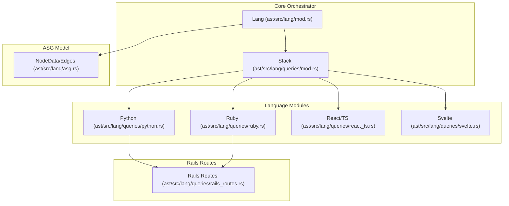
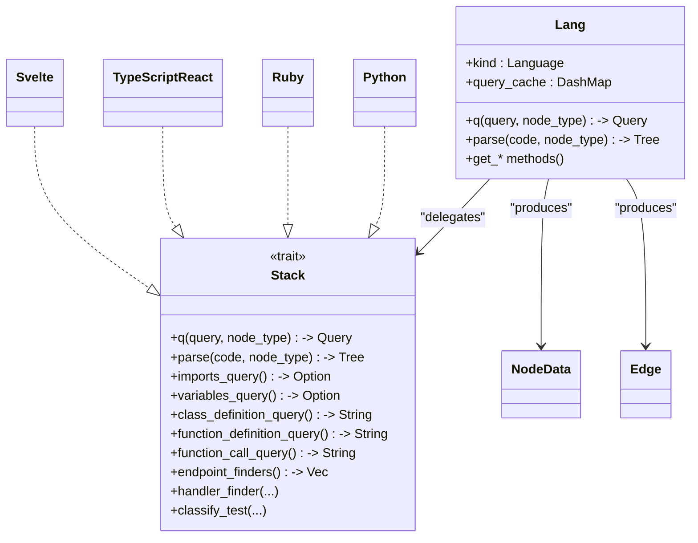
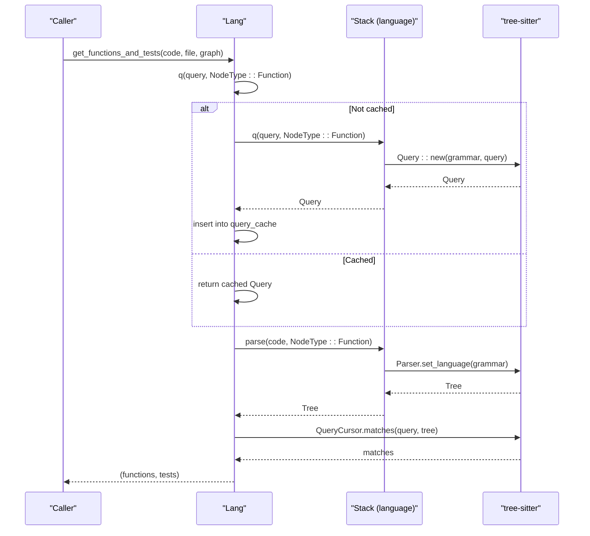
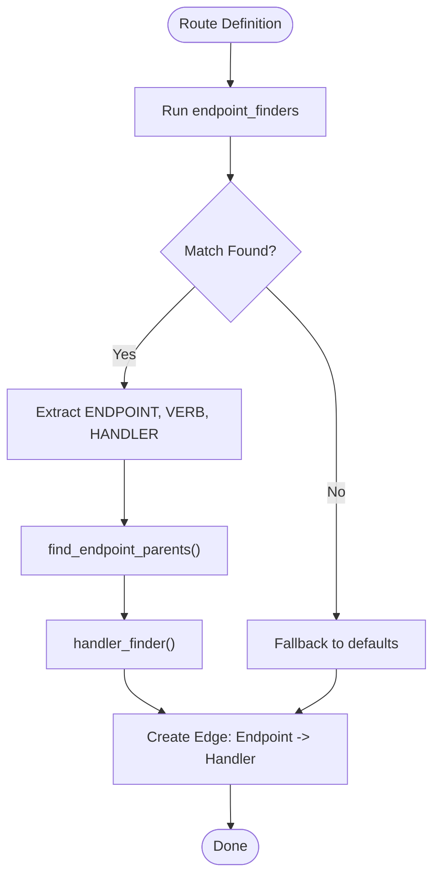
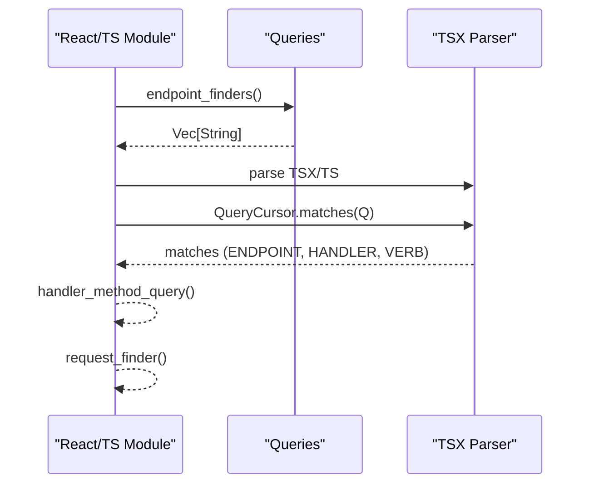
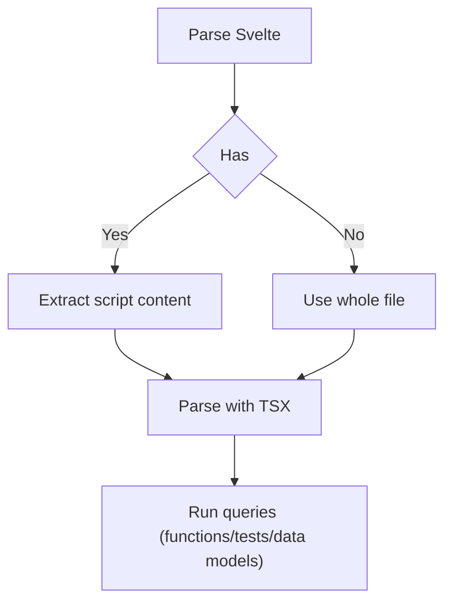
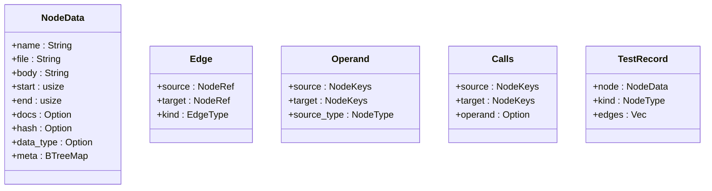
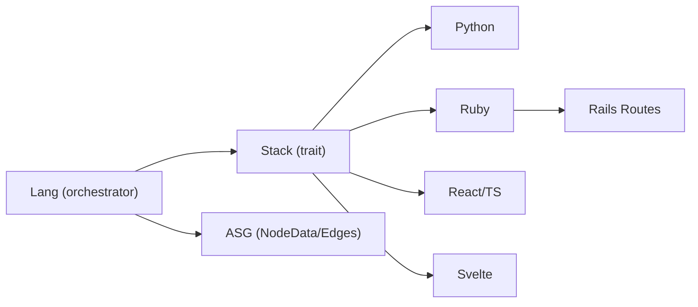

# Query System and Language-Specific Queries

<cite>
**Referenced Files in This Document**
- [mod.rs](file://ast/src/lang/mod.rs)
- [queries/mod.rs](file://ast/src/lang/queries/mod.rs)
- [python.rs](file://ast/src/lang/queries/python.rs)
- [ruby.rs](file://ast/src/lang/queries/ruby.rs)
- [react_ts.rs](file://ast/src/lang/queries/react_ts.rs)
- [svelte.rs](file://ast/src/lang/queries/svelte.rs)
- [asg.rs](file://ast/src/lang/asg.rs)
- [rails_routes.rs](file://ast/src/lang/queries/rails_routes.rs)
</cite>

## Table of Contents
1. [Introduction](#introduction)
2. [Project Structure](#project-structure)
3. [Core Components](#core-components)
4. [Architecture Overview](#architecture-overview)
5. [Detailed Component Analysis](#detailed-component-analysis)
6. [Dependency Analysis](#dependency-analysis)
7. [Performance Considerations](#performance-considerations)
8. [Troubleshooting Guide](#troubleshooting-guide)
9. [Conclusion](#conclusion)

## Introduction
This document explains StakGraph’s tree-sitter query system and language-specific query implementations. It covers how queries extract functions, classes, endpoints, data models, imports, variables, and relationships from source code, how the query DSL works, how queries are cached and reused, and how framework-specific patterns are handled for Rails routes, React components, Angular decorators, and Svelte components. It also documents how raw query results are transformed into standardized graph nodes via the ASG data model, along with optimization techniques, performance considerations, and edge-case handling.

## Project Structure
The query system is organized around a central orchestrator that manages parsing, caching, and extraction, and a set of language-specific modules that define the tree-sitter grammars, query strings, and extraction logic.

**Diagram sources**
- [mod.rs:51-329](file://ast/src/lang/mod.rs#L51-L329)
- [queries/mod.rs:55-393](file://ast/src/lang/queries/mod.rs#L55-L393)
- [python.rs:20-564](file://ast/src/lang/queries/python.rs#L20-L564)
- [ruby.rs:31-886](file://ast/src/lang/queries/ruby.rs#L31-L886)
- [react_ts.rs:29-800](file://ast/src/lang/queries/react_ts.rs#L29-L800)
- [svelte.rs:38-271](file://ast/src/lang/queries/svelte.rs#L38-L271)
- [asg.rs:66-228](file://ast/src/lang/asg.rs#L66-L228)
- [rails_routes.rs](file://ast/src/lang/queries/rails_routes.rs)

**Section sources**
- [mod.rs:51-329](file://ast/src/lang/mod.rs#L51-L329)
- [queries/mod.rs:55-393](file://ast/src/lang/queries/mod.rs#L55-L393)

## Core Components
- Lang orchestrator: Manages parsing, query compilation, caching, and extraction for all node types. It maintains a thread-safe query cache keyed by (query_string, node_type) and compiles queries against the appropriate tree-sitter language.
- Stack trait: Defines the contract for each language module, including query strings for imports, variables, classes, functions, endpoints, tests, and specialized features like handler resolution and endpoint grouping.
- ASG model: Provides standardized node and edge representations used across the system, enabling consistent graph construction regardless of language.

Key responsibilities:
- Query caching and reuse
- Per-language parsing and query compilation
- Extraction of functions, classes, endpoints, data models, imports, variables, and tests
- Relationship building (contains, calls, renders, handler, nested-in)
- Test classification and filtering

**Section sources**
- [mod.rs:51-329](file://ast/src/lang/mod.rs#L51-L329)
- [queries/mod.rs:55-393](file://ast/src/lang/queries/mod.rs#L55-L393)
- [asg.rs:66-228](file://ast/src/lang/asg.rs#L66-L228)

## Architecture Overview
The system composes a language-agnostic orchestration layer with language-specific query modules. Each language module implements the Stack trait, supplying tree-sitter grammar selection, query strings, and semantic logic (e.g., handler resolution, endpoint grouping, test classification).

**Diagram sources**
- [mod.rs:51-329](file://ast/src/lang/mod.rs#L51-L329)
- [queries/mod.rs:55-393](file://ast/src/lang/queries/mod.rs#L55-L393)
- [python.rs:20-564](file://ast/src/lang/queries/python.rs#L20-L564)
- [ruby.rs:31-886](file://ast/src/lang/queries/ruby.rs#L31-L886)
- [react_ts.rs:29-800](file://ast/src/lang/queries/react_ts.rs#L29-L800)
- [svelte.rs:38-271](file://ast/src/lang/queries/svelte.rs#L38-L271)
- [asg.rs:66-228](file://ast/src/lang/asg.rs#L66-L228)

## Detailed Component Analysis

### Query Architecture and Caching
- Query compilation: Each language module compiles tree-sitter queries against its grammar. The Lang orchestrator caches compiled queries in a DashMap keyed by (query_string, node_type) to avoid repeated compilation overhead.
- Parsing: Lang.parse wraps per-language parsing, tracks parse timing statistics, and delegates to the language’s Stack.parse.
- Extraction: Methods like get_functions_and_tests, get_classes, get_data_models, get_imports, get_vars, and get_functions_and_tests use compiled queries to collect nodes and attach metadata (comments, docs, types).

**Diagram sources**
- [mod.rs:312-329](file://ast/src/lang/mod.rs#L312-L329)
- [mod.rs:603-728](file://ast/src/lang/mod.rs#L603-L728)
- [queries/mod.rs:55-101](file://ast/src/lang/queries/mod.rs#L55-L101)

**Section sources**
- [mod.rs:51-329](file://ast/src/lang/mod.rs#L51-L329)

### Query DSL Syntax and Capture Patterns
- Captures: Each language module defines query strings that capture named groups (e.g., FUNCTION_NAME, CLASS_NAME, IMPORTS_FROM, VARIABLE_NAME). These are later accessed by name to extract identifiers, types, and values.
- Predicates: Queries use tree-sitter predicates like #eq?, #match?, and #any-of? to constrain matches (e.g., HTTP verbs, handler names).
- Grammar selection: Some modules switch grammars per node type (e.g., Svelte parses script content with TSX; Python uses Bash grammar for library queries).

Examples of capture patterns:
- Functions: FUNCTION_NAME, ARGUMENTS, RETURN_TYPES, FUNCTION_DEFINITION
- Classes: CLASS_NAME, CLASS_PARENT, CLASS_DEFINITION
- Imports: IMPORTS_NAME, IMPORTS_FROM, IMPORTS_ALIAS (TypeScript/React)
- Variables: VARIABLE_NAME, VARIABLE_TYPE, VARIABLE_VALUE
- Endpoints: ENDPOINT, ENDPOINT_VERB, HANDLER, ANONYMOUS_FUNCTION
- Tests: FUNCTION_DEFINITION, E2E_TEST, TEST_NAME

**Section sources**
- [python.rs:101-146](file://ast/src/lang/queries/python.rs#L101-L146)
- [ruby.rs:127-140](file://ast/src/lang/queries/ruby.rs#L127-L140)
- [react_ts.rs:249-464](file://ast/src/lang/queries/react_ts.rs#L249-L464)
- [svelte.rs:92-107](file://ast/src/lang/queries/svelte.rs#L92-L107)

### Framework-Specific Query Sets

#### Rails Routes (Ruby)
- Endpoint discovery: Uses a collection of endpoint_finders to match Rails routing patterns (decorators, route helpers, controller actions).
- Handler resolution: handler_finder resolves handlers to controller actions, supports namespaces/scopes/resources, and generates endpoint paths.
- Parent grouping: find_endpoint_parents walks up the AST to infer nested resources and namespaces.
- Schema-based data models: data_model_within_finder connects controller actions to ActiveRecord schema definitions.

**Diagram sources**
- [ruby.rs:170-172](file://ast/src/lang/queries/ruby.rs#L170-L172)
- [ruby.rs:492-536](file://ast/src/lang/queries/ruby.rs#L492-L536)
- [ruby.rs:661-715](file://ast/src/lang/queries/ruby.rs#L661-L715)
- [rails_routes.rs](file://ast/src/lang/queries/rails_routes.rs)

**Section sources**
- [ruby.rs:170-172](file://ast/src/lang/queries/ruby.rs#L170-L172)
- [ruby.rs:492-536](file://ast/src/lang/queries/ruby.rs#L492-L536)
- [ruby.rs:661-715](file://ast/src/lang/queries/ruby.rs#L661-L715)

#### React Components (TypeScript/TSX)
- Component detection: is_component identifies React components by PascalCase naming.
- Endpoint discovery: endpoint_finders match Next.js-style exports, Express-style router calls, and chained route patterns.
- Request discovery: request_finder matches fetch, axios, ky, and similar HTTP calls.
- Data model discovery: data_model_query recognizes type aliases, interfaces, enums, and decorated models.

**Diagram sources**
- [react_ts.rs:592-704](file://ast/src/lang/queries/react_ts.rs#L592-L704)
- [react_ts.rs:707-755](file://ast/src/lang/queries/react_ts.rs#L707-L755)
- [react_ts.rs:484-517](file://ast/src/lang/queries/react_ts.rs#L484-L517)

**Section sources**
- [react_ts.rs:29-800](file://ast/src/lang/queries/react_ts.rs#L29-L800)

#### Svelte Components
- Script parsing: extract_script_content isolates script blocks for TSX parsing when extracting functions/tests/data models.
- Endpoint discovery: request_finder identifies HTTP calls inside components.
- Test detection: classify_test determines unit/integration/E2E based on file paths and content.

**Diagram sources**
- [svelte.rs:19-35](file://ast/src/lang/queries/svelte.rs#L19-L35)
- [svelte.rs:57-76](file://ast/src/lang/queries/svelte.rs#L57-L76)
- [svelte.rs:151-160](file://ast/src/lang/queries/svelte.rs#L151-L160)

**Section sources**
- [svelte.rs:38-271](file://ast/src/lang/queries/svelte.rs#L38-L271)

### Query Results to ASG Transformation
Raw query results are transformed into standardized ASG nodes and edges:
- NodeData: name, file, body, start/end positions, docs, hash, data_type, meta
- Edges: contains, calls, handler, renders, nested-in, group, middleware, etc.
- Meta enrichment: verbs, handlers, attributes, test kinds, middleware, parent relationships, etc.

**Diagram sources**
- [asg.rs:66-228](file://ast/src/lang/asg.rs#L66-L228)

**Section sources**
- [asg.rs:66-228](file://ast/src/lang/asg.rs#L66-L228)

### Complex Queries: Nested Structures, Conditional Logic, and Framework Patterns
- Nested functions: get_functions_and_tests computes nested-in edges by correlating function start/end positions and variable scopes.
- Conditional logic: classify_test uses layered heuristics (path, content markers, DSL keywords) to distinguish unit/integration/E2E tests.
- Framework patterns: endpoint_finders combine multiple routing patterns (decorators, chained calls, method chaining) to maximize coverage.

Example behaviors:
- Python: endpoint_finders support Flask, Django, and FastAPI patterns; handler_finder resolves dotted module.function or controller/action forms.
- Ruby: handler_finder supports “resource” and “namespace” semantics; find_endpoint_parents infers nested resources.
- React/TS: endpoint_finders cover Next.js pages export, Express router calls, and chained route patterns; request_finder detects HTTP clients.

**Section sources**
- [mod.rs:603-728](file://ast/src/lang/mod.rs#L603-L728)
- [python.rs:271-372](file://ast/src/lang/queries/python.rs#L271-L372)
- [ruby.rs:536-660](file://ast/src/lang/queries/ruby.rs#L536-L660)
- [react_ts.rs:592-704](file://ast/src/lang/queries/react_ts.rs#L592-L704)

## Dependency Analysis
- Lang depends on Stack implementations for language-specific parsing and queries.
- Stack implementations depend on tree-sitter grammars and define query strings.
- Rails routes logic is integrated into Ruby’s handler resolution and endpoint grouping.
- ASG model is consumed by graph builders and exporters.

**Diagram sources**
- [mod.rs:51-329](file://ast/src/lang/mod.rs#L51-L329)
- [queries/mod.rs:55-393](file://ast/src/lang/queries/mod.rs#L55-L393)
- [ruby.rs:536-660](file://ast/src/lang/queries/ruby.rs#L536-L660)
- [asg.rs:66-228](file://ast/src/lang/asg.rs#L66-L228)

**Section sources**
- [mod.rs:51-329](file://ast/src/lang/mod.rs#L51-L329)
- [queries/mod.rs:55-393](file://ast/src/lang/queries/mod.rs#L55-L393)

## Performance Considerations
- Query caching: DashMap-based cache keyed by (query_string, node_type) prevents repeated compilation.
- Parse timing: Lang tracks total parses and average parse time per invocation to monitor performance.
- Grammar switching: Minimal overhead by selecting grammars only when necessary (e.g., Svelte script parsing).
- Cursor reuse: QueryCursor is created per query execution to avoid global state.
- Early exits: Many queries short-circuit when optional language features are absent.

Recommendations:
- Prefer capturing only needed fields to reduce memory churn.
- Reuse compiled queries across files when possible.
- Limit expensive post-processing (e.g., handler resolution) to necessary subsets.

**Section sources**
- [mod.rs:30-49](file://ast/src/lang/mod.rs#L30-L49)
- [mod.rs:312-329](file://ast/src/lang/mod.rs#L312-L329)

## Troubleshooting Guide
Common issues and resolutions:
- Malformed queries: Stack::q panics on invalid query strings; ensure query syntax and predicates are correct.
- Wrong grammar: Some modules switch grammars for specific node types; verify grammar selection logic.
- Missing comments/docs: attach_comments relies on comment_query captures; confirm language-specific comment queries are defined.
- Handler resolution failures: handler_finder depends on file paths and naming conventions; verify controller/action naming and file locations.
- Test classification mismatches: classify_test uses layered heuristics; adjust path filters or content markers if needed.

**Section sources**
- [queries/mod.rs:24-36](file://ast/src/lang/queries/mod.rs#L24-L36)
- [python.rs:147-155](file://ast/src/lang/queries/python.rs#L147-L155)
- [ruby.rs:536-660](file://ast/src/lang/queries/ruby.rs#L536-L660)

## Conclusion
StakGraph’s query system leverages tree-sitter to provide robust, language-aware extraction of functions, classes, endpoints, data models, imports, variables, and tests. The Stack trait enables modular, extensible language support, while the Lang orchestrator ensures efficient caching and consistent graph construction via the ASG model. Framework-specific modules (Rails, React/TS, Svelte) encapsulate complex routing and component patterns, and the system’s design allows for incremental improvements and performance tuning.