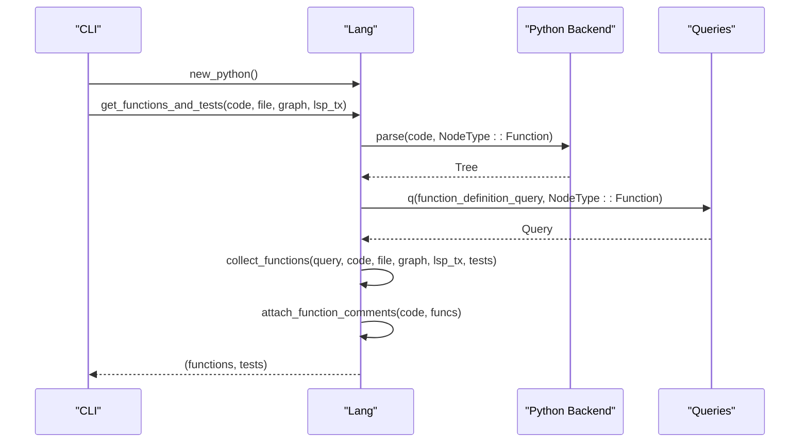
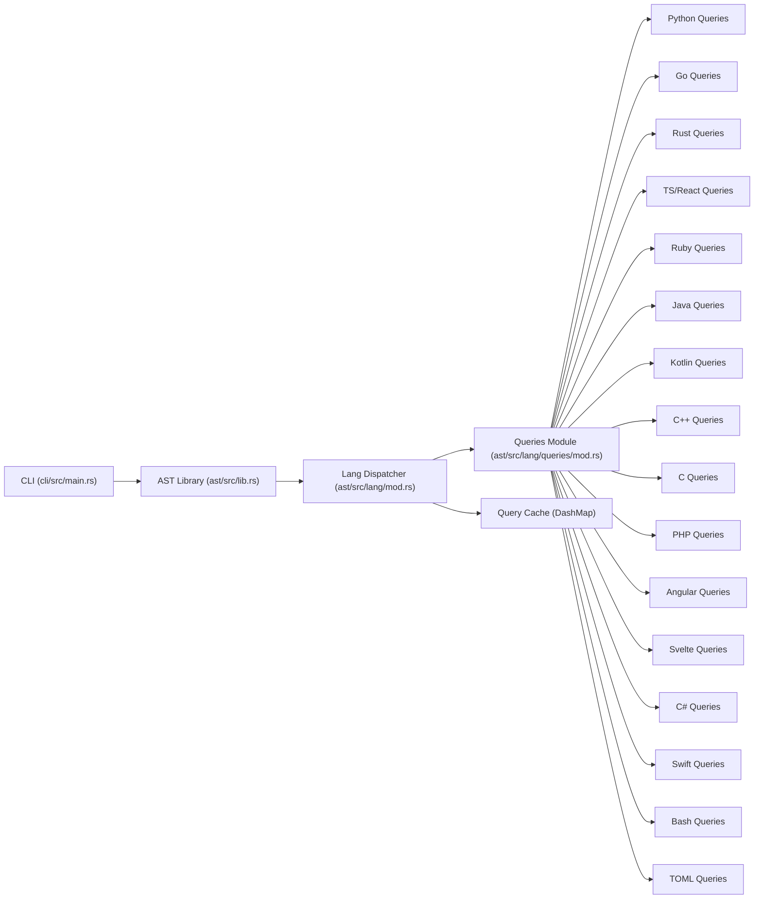

# Supported Languages and Implementations

<cite>
**Referenced Files in This Document**
- [Cargo.toml](file://Cargo.toml)
- [ast/src/lib.rs](file://ast/src/lib.rs)
- [ast/src/lang/mod.rs](file://ast/src/lang/mod.rs)
- [ast/src/lang/asg.rs](file://ast/src/lang/asg.rs)
- [ast/src/lang/queries/mod.rs](file://ast/src/lang/queries/mod.rs)
- [ast/src/lang/queries/python.rs](file://ast/src/lang/queries/python.rs)
- [ast/src/lang/queries/go.rs](file://ast/src/lang/queries/go.rs)
- [ast/src/lang/queries/rust.rs](file://ast/src/lang/queries/rust.rs)
- [ast/src/lang/queries/react_ts.rs](file://ast/src/lang/queries/react_ts.rs)
- [ast/src/lang/queries/ruby.rs](file://ast/src/lang/queries/ruby.rs)
- [ast/src/lang/queries/java.rs](file://ast/src/lang/queries/java.rs)
- [ast/src/lang/queries/kotlin.rs](file://ast/src/lang/queries/kotlin.rs)
- [ast/src/lang/queries/cpp.rs](file://ast/src/lang/queries/cpp.rs)
- [ast/src/lang/queries/c.rs](file://ast/src/lang/queries/c.rs)
- [ast/src/lang/queries/php.rs](file://ast/src/lang/queries/php.rs)
- [ast/src/lang/queries/angular.rs](file://ast/src/lang/queries/angular.rs)
- [ast/src/lang/queries/svelte.rs](file://ast/src/lang/queries/svelte.rs)
- [ast/src/lang/queries/csharp.rs](file://ast/src/lang/queries/csharp.rs)
- [ast/src/lang/queries/swift.rs](file://ast/src/lang/queries/swift.rs)
- [ast/src/lang/queries/bash.rs](file://ast/src/lang/queries/bash.rs)
- [ast/src/lang/queries/toml.rs](file://ast/src/lang/queries/toml.rs)
- [ast/src/lang/queries/skips/python.rs](file://ast/src/lang/queries/skips/python.rs)
- [ast/src/lang/queries/skips/go.rs](file://ast/src/lang/queries/skips/go.rs)
- [ast/src/lang/queries/skips/rust.rs](file://ast/src/lang/queries/skips/rust.rs)
- [ast/src/lang/queries/skips/react_ts.rs](file://ast/src/lang/queries/skips/react_ts.rs)
- [ast/src/lang/queries/skips/ruby.rs](file://ast/src/lang/queries/skips/ruby.rs)
- [ast/src/lang/queries/skips/java.rs](file://ast/src/lang/queries/skips/java.rs)
- [ast/src/lang/queries/skips/kotlin.rs](file://ast/src/lang/queries/skips/kotlin.rs)
- [ast/src/lang/queries/skips/cpp.rs](file://ast/src/lang/queries/skips/cpp.rs)
- [ast/src/lang/queries/skips/c.rs](file://ast/src/lang/queries/skips/c.rs)
- [ast/src/lang/queries/skips/php.rs](file://ast/src/lang/queries/skips/php.rs)
- [ast/src/lang/queries/skips/angular.rs](file://ast/src/lang/queries/skips/angular.rs)
- [ast/src/lang/queries/skips/svelte.rs](file://ast/src/lang/queries/skips/svelte.rs)
- [ast/src/lang/queries/skips/csharp.rs](file://ast/src/lang/queries/skips/csharp.rs)
- [ast/src/lang/queries/skips/swift.rs](file://ast/src/lang/queries/skips/swift.rs)
- [ast/src/lang/queries/skips/bash.rs](file://ast/src/lang/queries/skips/bash.rs)
- [ast/src/lang/queries/skips/toml.rs](file://ast/src/lang/queries/skips/toml.rs)
- [cli/src/main.rs](file://cli/src/main.rs)
- [cli/tests/cli/python.rs](file://cli/tests/cli/python.rs)
- [cli/tests/cli/go.rs](file://cli/tests/cli/go.rs)
- [cli/tests/cli/rust.rs](file://cli/tests/cli/rust.rs)
- [cli/tests/cli/react_ts.rs](file://cli/tests/cli/react_ts.rs)
- [cli/tests/cli/ruby.rs](file://cli/tests/cli/ruby.rs)
- [cli/tests/cli/java.rs](file://cli/tests/cli/java.rs)
- [cli/tests/cli/kotlin.rs](file://cli/tests/cli/kotlin.rs)
- [cli/tests/cli/cpp.rs](file://cli/tests/cli/cpp.rs)
- [cli/tests/cli/c.rs](file://cli/tests/cli/c.rs)
- [cli/tests/cli/php.rs](file://cli/tests/cli/php.rs)
- [cli/tests/cli/angular.rs](file://cli/tests/cli/angular.rs)
- [cli/tests/cli/svelte.rs](file://cli/tests/cli/svelte.rs)
- [cli/tests/cli/csharp.rs](file://cli/tests/cli/csharp.rs)
- [cli/tests/cli/swift.rs](file://cli/tests/cli/swift.rs)
- [cli/tests/cli/bash.rs](file://cli/tests/cli/bash.rs)
- [cli/tests/cli/toml.rs](file://cli/tests/cli/toml.rs)
</cite>

## Table of Contents
1. [Introduction](#introduction)
2. [Project Structure](#project-structure)
3. [Core Components](#core-components)
4. [Architecture Overview](#architecture-overview)
5. [Detailed Component Analysis](#detailed-component-analysis)
6. [Dependency Analysis](#dependency-analysis)
7. [Performance Considerations](#performance-considerations)
8. [Troubleshooting Guide](#troubleshooting-guide)
9. [Conclusion](#conclusion)

## Introduction
This document describes the 16 supported programming languages in StakGraph, focusing on parser characteristics, tree-sitter grammar integration, language-specific optimizations, and query sets. It covers TypeScript/JavaScript frameworks (React, Angular, Svelte), JVM languages (Java, Kotlin, Scala), systems programming languages (Rust, Go, C/C++), and web technologies (PHP, Ruby, Python). It also documents language initialization patterns, query caching strategies, and performance considerations, with practical examples of how different languages are parsed and represented in the graph.

## Project Structure
StakGraph organizes language support under the AST crate, with a central dispatcher that selects a language-specific implementation and applies language-aware queries. The CLI integrates with the AST crate to parse repositories and produce graph outputs.

```mermaid
graph TB
CLI["CLI (cli/src/main.rs)"] --> ASTLib["AST Library (ast/src/lib.rs)"]
ASTLib --> LangMod["Lang Dispatcher (ast/src/lang/mod.rs)"]
LangMod --> Queries["Queries Module (ast/src/lang/queries/mod.rs)"]
LangMod --> ASG["ASG Types (ast/src/lang/asg.rs)"]
Queries --> PyQ["Python Queries (ast/src/lang/queries/python.rs)"]
Queries --> GoQ["Go Queries (ast/src/lang/queries/go.rs)"]
Queries --> RustQ["Rust Queries (ast/src/lang/queries/rust.rs)"]
Queries --> TSReactQ["TS/React Queries (ast/src/lang/queries/react_ts.rs)"]
Queries --> RubyQ["Ruby Queries (ast/src/lang/queries/ruby.rs)"]
Queries --> JavaQ["Java Queries (ast/src/lang/queries/java.rs)"]
Queries --> KotlinQ["Kotlin Queries (ast/src/lang/queries/kotlin.rs)"]
Queries --> CPPQ["C++ Queries (ast/src/lang/queries/cpp.rs)"]
Queries --> CQ["C Queries (ast/src/lang/queries/c.rs)"]
Queries --> PHPQ["PHP Queries (ast/src/lang/queries/php.rs)"]
Queries --> AngularQ["Angular Queries (ast/src/lang/queries/angular.rs)"]
Queries --> SvelteQ["Svelte Queries (ast/src/lang/queries/svelte.rs)"]
Queries --> CSharpQ["C# Queries (ast/src/lang/queries/csharp.rs)"]
Queries --> SwiftQ["Swift Queries (ast/src/lang/queries/swift.rs)"]
Queries --> BashQ["Bash Queries (ast/src/lang/queries/bash.rs)"]
Queries --> TomlQ["TOML Queries (ast/src/lang/queries/toml.rs)"]
```

**Diagram sources**
- [cli/src/main.rs:1-70](file://cli/src/main.rs#L1-L70)
- [ast/src/lib.rs:1-14](file://ast/src/lib.rs#L1-L14)
- [ast/src/lang/mod.rs:1-329](file://ast/src/lang/mod.rs#L1-L329)
- [ast/src/lang/queries/mod.rs](file://ast/src/lang/queries/mod.rs)
- [ast/src/lang/asg.rs:1-425](file://ast/src/lang/asg.rs#L1-L425)
- [ast/src/lang/queries/python.rs](file://ast/src/lang/queries/python.rs)
- [ast/src/lang/queries/go.rs](file://ast/src/lang/queries/go.rs)
- [ast/src/lang/queries/rust.rs](file://ast/src/lang/queries/rust.rs)
- [ast/src/lang/queries/react_ts.rs](file://ast/src/lang/queries/react_ts.rs)
- [ast/src/lang/queries/ruby.rs](file://ast/src/lang/queries/ruby.rs)
- [ast/src/lang/queries/java.rs](file://ast/src/lang/queries/java.rs)
- [ast/src/lang/queries/kotlin.rs](file://ast/src/lang/queries/kotlin.rs)
- [ast/src/lang/queries/cpp.rs](file://ast/src/lang/queries/cpp.rs)
- [ast/src/lang/queries/c.rs](file://ast/src/lang/queries/c.rs)
- [ast/src/lang/queries/php.rs](file://ast/src/lang/queries/php.rs)
- [ast/src/lang/queries/angular.rs](file://ast/src/lang/queries/angular.rs)
- [ast/src/lang/queries/svelte.rs](file://ast/src/lang/queries/svelte.rs)
- [ast/src/lang/queries/csharp.rs](file://ast/src/lang/queries/csharp.rs)
- [ast/src/lang/queries/swift.rs](file://ast/src/lang/queries/swift.rs)
- [ast/src/lang/queries/bash.rs](file://ast/src/lang/queries/bash.rs)
- [ast/src/lang/queries/toml.rs](file://ast/src/lang/queries/toml.rs)

**Section sources**
- [Cargo.toml:1-5](file://Cargo.toml#L1-L5)
- [ast/src/lib.rs:1-14](file://ast/src/lib.rs#L1-L14)
- [ast/src/lang/mod.rs:1-329](file://ast/src/lang/mod.rs#L1-L329)

## Core Components
- Lang dispatcher: Central orchestrator that selects a language backend, caches queries, and executes language-specific parsing and extraction routines.
- ASG types: Shared graph node and edge models used across languages.
- Queries module: Language-specific Tree-sitter queries and skip lists for each supported language.

Key responsibilities:
- Parse code into a Tree-sitter tree.
- Apply language-specific queries to extract functions, classes, imports, variables, endpoints, pages, and tests.
- Attach comments and metadata to nodes.
- Build edges representing relationships (calls, nested-in, render-from-class, etc.).
- Provide query caching and performance statistics.

**Section sources**
- [ast/src/lang/mod.rs:51-329](file://ast/src/lang/mod.rs#L51-L329)
- [ast/src/lang/asg.rs:66-228](file://ast/src/lang/asg.rs#L66-L228)

## Architecture Overview
The system composes language backends behind a unified interface. Each backend supplies:
- Parser initialization and tree-sitter grammar integration.
- Query strings for extracting program constructs.
- Optional comment, test classification, and special-case logic (e.g., JSX detection for React/TypeScript).

```mermaid
classDiagram
class Lang {
+kind : Language
+query_cache : DashMap
+new_python()
+new_go()
+new_rust()
+new_typescript()
+new_ruby()
+new_kotlin()
+new_swift()
+new_java()
+new_svelte()
+new_angular()
+new_cpp()
+new_c()
+new_php()
+new_csharp()
+new_bash()
+new_toml()
+q(query, node_type) Query
+parse(code, node_type) Tree
+get_functions_and_tests(...)
+get_function_calls(...)
+get_classes(...)
+get_imports(...)
+get_vars(...)
+get_data_models(...)
+get_pages(...)
+get_component_templates(...)
+get_libs(...)
}
class Python {
+new()
+parse(code, node_type) Tree
+q(query, node_type) Query
+function_definition_query()
+variables_query()
+imports_query()
+data_model_query()
+comment_query()
+identifier_query()
+test_query()
+page_query()
+component_template_query()
+nested_scope_query()
+lib_query()
+trait_query()
+class_definition_query()
}
class Go {
+new()
+parse(code, node_type) Tree
+q(query, node_type) Query
+function_definition_query()
+variables_query()
+imports_query()
+data_model_query()
+comment_query()
+identifier_query()
+test_query()
+page_query()
+component_template_query()
+nested_scope_query()
+lib_query()
+trait_query()
+class_definition_query()
}
class Rust {
+new()
+parse(code, node_type) Tree
+q(query, node_type) Query
+function_definition_query()
+variables_query()
+imports_query()
+data_model_query()
+comment_query()
+identifier_query()
+test_query()
+page_query()
+component_template_query()
+nested_scope_query()
+lib_query()
+trait_query()
+class_definition_query()
}
class TypeScriptReact {
+new()
+parse(code, node_type) Tree
+q(query, node_type) Query
+function_definition_query()
+variables_query()
+imports_query()
+data_model_query()
+comment_query()
+identifier_query()
+test_query()
+page_query()
+component_template_query()
+nested_scope_query()
+lib_query()
+trait_query()
+class_definition_query()
}
class Ruby {
+new()
+parse(code, node_type) Tree
+q(query, node_type) Query
+function_definition_query()
+variables_query()
+imports_query()
+data_model_query()
+comment_query()
+identifier_query()
+test_query()
+page_query()
+component_template_query()
+nested_scope_query()
+lib_query()
+trait_query()
+class_definition_query()
}
class Java {
+new()
+parse(code, node_type) Tree
+q(query, node_type) Query
+function_definition_query()
+variables_query()
+imports_query()
+data_model_query()
+comment_query()
+identifier_query()
+test_query()
+page_query()
+component_template_query()
+nested_scope_query()
+lib_query()
+trait_query()
+class_definition_query()
}
class Kotlin {
+new()
+parse(code, node_type) Tree
+q(query, node_type) Query
+function_definition_query()
+variables_query()
+imports_query()
+data_model_query()
+comment_query()
+identifier_query()
+test_query()
+page_query()
+component_template_query()
+nested_scope_query()
+lib_query()
+trait_query()
+class_definition_query()
}
class Cpp {
+new()
+parse(code, node_type) Tree
+q(query, node_type) Query
+function_definition_query()
+variables_query()
+imports_query()
+data_model_query()
+comment_query()
+identifier_query()
+test_query()
+page_query()
+component_template_query()
+nested_scope_query()
+lib_query()
+trait_query()
+class_definition_query()
}
class C {
+new()
+parse(code, node_type) Tree
+q(query, node_type) Query
+function_definition_query()
+variables_query()
+imports_query()
+data_model_query()
+comment_query()
+identifier_query()
+test_query()
+page_query()
+component_template_query()
+nested_scope_query()
+lib_query()
+trait_query()
+class_definition_query()
}
class Php {
+new()
+parse(code, node_type) Tree
+q(query, node_type) Query
+function_definition_query()
+variables_query()
+imports_query()
+data_model_query()
+comment_query()
+identifier_query()
+test_query()
+page_query()
+component_template_query()
+nested_scope_query()
+lib_query()
+trait_query()
+class_definition_query()
}
class Angular {
+new()
+parse(code, node_type) Tree
+q(query, node_type) Query
+function_definition_query()
+variables_query()
+imports_query()
+data_model_query()
+comment_query()
+identifier_query()
+test_query()
+page_query()
+component_template_query()
+nested_scope_query()
+lib_query()
+trait_query()
+class_definition_query()
}
class Svelte {
+new()
+parse(code, node_type) Tree
+q(query, node_type) Query
+function_definition_query()
+variables_query()
+imports_query()
+data_model_query()
+comment_query()
+identifier_query()
+test_query()
+page_query()
+component_template_query()
+nested_scope_query()
+lib_query()
+trait_query()
+class_definition_query()
}
class CSharp {
+new()
+parse(code, node_type) Tree
+q(query, node_type) Query
+function_definition_query()
+variables_query()
+imports_query()
+data_model_query()
+comment_query()
+identifier_query()
+test_query()
+page_query()
+component_template_query()
+nested_scope_query()
+lib_query()
+trait_query()
+class_definition_query()
}
class Swift {
+new()
+parse(code, node_type) Tree
+q(query, node_type) Query
+function_definition_query()
+variables_query()
+imports_query()
+data_model_query()
+comment_query()
+identifier_query()
+test_query()
+page_query()
+component_template_query()
+nested_scope_query()
+lib_query()
+trait_query()
+class_definition_query()
}
class Bash {
+new()
+parse(code, node_type) Tree
+q(query, node_type) Query
+function_definition_query()
+variables_query()
+imports_query()
+data_model_query()
+comment_query()
+identifier_query()
+test_query()
+page_query()
+component_template_query()
+nested_scope_query()
+lib_query()
+trait_query()
+class_definition_query()
}
class Toml {
+new()
+parse(code, node_type) Tree
+q(query, node_type) Query
+function_definition_query()
+variables_query()
+imports_query()
+data_model_query()
+comment_query()
+identifier_query()
+test_query()
+page_query()
+component_template_query()
+nested_scope_query()
+lib_query()
+trait_query()
+class_definition_query()
}
Lang --> Python : "delegates to"
Lang --> Go : "delegates to"
Lang --> Rust : "delegates to"
Lang --> TypeScriptReact : "delegates to"
Lang --> Ruby : "delegates to"
Lang --> Java : "delegates to"
Lang --> Kotlin : "delegates to"
Lang --> Cpp : "delegates to"
Lang --> C : "delegates to"
Lang --> Php : "delegates to"
Lang --> Angular : "delegates to"
Lang --> Svelte : "delegates to"
Lang --> CSharp : "delegates to"
Lang --> Swift : "delegates to"
Lang --> Bash : "delegates to"
Lang --> Toml : "delegates to"
```

**Diagram sources**
- [ast/src/lang/mod.rs:197-308](file://ast/src/lang/mod.rs#L197-L308)
- [ast/src/lang/queries/python.rs](file://ast/src/lang/queries/python.rs)
- [ast/src/lang/queries/go.rs](file://ast/src/lang/queries/go.rs)
- [ast/src/lang/queries/rust.rs](file://ast/src/lang/queries/rust.rs)
- [ast/src/lang/queries/react_ts.rs](file://ast/src/lang/queries/react_ts.rs)
- [ast/src/lang/queries/ruby.rs](file://ast/src/lang/queries/ruby.rs)
- [ast/src/lang/queries/java.rs](file://ast/src/lang/queries/java.rs)
- [ast/src/lang/queries/kotlin.rs](file://ast/src/lang/queries/kotlin.rs)
- [ast/src/lang/queries/cpp.rs](file://ast/src/lang/queries/cpp.rs)
- [ast/src/lang/queries/c.rs](file://ast/src/lang/queries/c.rs)
- [ast/src/lang/queries/php.rs](file://ast/src/lang/queries/php.rs)
- [ast/src/lang/queries/angular.rs](file://ast/src/lang/queries/angular.rs)
- [ast/src/lang/queries/svelte.rs](file://ast/src/lang/queries/svelte.rs)
- [ast/src/lang/queries/csharp.rs](file://ast/src/lang/queries/csharp.rs)
- [ast/src/lang/queries/swift.rs](file://ast/src/lang/queries/swift.rs)
- [ast/src/lang/queries/bash.rs](file://ast/src/lang/queries/bash.rs)
- [ast/src/lang/queries/toml.rs](file://ast/src/lang/queries/toml.rs)

## Detailed Component Analysis

### Python
- Initialization pattern: Construct via Lang::new_python().
- Parser characteristics: Uses a Python tree-sitter grammar; parses functions, classes, imports, variables, data models, and endpoints.
- Tree-sitter grammar integration: Implemented by the Python backend; queries are loaded via Lang::q.
- Language-specific optimizations:
  - Comment attachment to functions/classes/data models.
  - Nested scope filtering for data models.
  - Test discovery and classification.
- Query sets:
  - Function definition, variables, imports, data model, comment, identifier, test, page, component template, nested scope, library, trait, class definition.
- Practical example: Functions and variables extracted from a Python file; comments attached; nested data models filtered; tests classified as unit/integration/e2e.

**Diagram sources**
- [ast/src/lang/mod.rs:197-203](file://ast/src/lang/mod.rs#L197-L203)
- [ast/src/lang/mod.rs:603-728](file://ast/src/lang/mod.rs#L603-L728)
- [ast/src/lang/queries/python.rs](file://ast/src/lang/queries/python.rs)

**Section sources**
- [ast/src/lang/mod.rs:197-203](file://ast/src/lang/mod.rs#L197-L203)
- [ast/src/lang/mod.rs:355-406](file://ast/src/lang/mod.rs#L355-L406)
- [ast/src/lang/mod.rs:603-728](file://ast/src/lang/mod.rs#L603-L728)
- [ast/src/lang/queries/python.rs](file://ast/src/lang/queries/python.rs)
- [ast/src/lang/queries/skips/python.rs](file://ast/src/lang/queries/skips/python.rs)

### Go
- Initialization pattern: Construct via Lang::new_go().
- Parser characteristics: Uses a Go tree-sitter grammar; supports functions, imports, variables, data models, and endpoints.
- Language-specific optimizations:
  - Comment attachment to functions/classes/data models.
  - Test discovery and classification.
- Query sets:
  - Function definition, variables, imports, data model, comment, identifier, test, page, component template, nested scope, library, trait, class definition.

**Section sources**
- [ast/src/lang/mod.rs:204-210](file://ast/src/lang/mod.rs#L204-L210)
- [ast/src/lang/mod.rs:355-406](file://ast/src/lang/mod.rs#L355-L406)
- [ast/src/lang/queries/go.rs](file://ast/src/lang/queries/go.rs)
- [ast/src/lang/queries/skips/go.rs](file://ast/src/lang/queries/skips/go.rs)

### Rust
- Initialization pattern: Construct via Lang::new_rust().
- Parser characteristics: Uses a Rust tree-sitter grammar; supports functions, imports, variables, structs/enums/trait blocks, and endpoints.
- Language-specific optimizations:
  - Comment attachment to functions/structs/trait.
  - Nested scope filtering for data models.
  - Macro detection and tagging.
- Query sets:
  - Function definition, variables, imports, data model, comment, identifier, test, page, component template, nested scope, library, trait, class definition.

**Section sources**
- [ast/src/lang/mod.rs:211-217](file://ast/src/lang/mod.rs#L211-L217)
- [ast/src/lang/mod.rs:355-406](file://ast/src/lang/mod.rs#L355-L406)
- [ast/src/lang/queries/rust.rs](file://ast/src/lang/queries/rust.rs)
- [ast/src/lang/queries/skips/rust.rs](file://ast/src/lang/queries/skips/rust.rs)

### TypeScript/React
- Initialization pattern: Construct via Lang::new_typescript() (TypeScriptReact backend).
- Parser characteristics: Uses a TS/React tree-sitter grammar; supports functions, imports, variables, decorators, JSX/TSX detection, and component templates.
- Language-specific optimizations:
  - JSX/TSX detection and component template resolution.
  - Decorator parsing for metadata.
  - Comment attachment to functions/components.
  - Test discovery and classification.
- Query sets:
  - Function definition, variables, imports, data model, comment, identifier, test, page, component template, nested scope, library, trait, class definition.

**Section sources**
- [ast/src/lang/mod.rs:218-224](file://ast/src/lang/mod.rs#L218-L224)
- [ast/src/lang/mod.rs:407-553](file://ast/src/lang/mod.rs#L407-L553)
- [ast/src/lang/queries/react_ts.rs](file://ast/src/lang/queries/react_ts.rs)
- [ast/src/lang/queries/skips/react_ts.rs](file://ast/src/lang/queries/skips/react_ts.rs)

### Ruby
- Initialization pattern: Construct via Lang::new_ruby().
- Parser characteristics: Uses a Ruby tree-sitter grammar; supports functions, classes, modules, requires, variables, and endpoints.
- Language-specific optimizations:
  - Comment attachment to functions/classes/modules.
  - Test discovery and classification.
- Query sets:
  - Function definition, variables, imports, data model, comment, identifier, test, page, component template, nested scope, library, trait, class definition.

**Section sources**
- [ast/src/lang/mod.rs:225-231](file://ast/src/lang/mod.rs#L225-L231)
- [ast/src/lang/mod.rs:355-406](file://ast/src/lang/mod.rs#L355-L406)
- [ast/src/lang/queries/ruby.rs](file://ast/src/lang/queries/ruby.rs)
- [ast/src/lang/queries/skips/ruby.rs](file://ast/src/lang/queries/skips/ruby.rs)

### Java
- Initialization pattern: Construct via Lang::new_java().
- Parser characteristics: Uses a Java tree-sitter grammar; supports classes, methods, imports, packages, and annotations.
- Language-specific optimizations:
  - Comment attachment to classes/methods.
  - Annotation parsing for metadata.
  - Test discovery and classification.
- Query sets:
  - Function definition, variables, imports, data model, comment, identifier, test, page, component template, nested scope, library, trait, class definition.

**Section sources**
- [ast/src/lang/mod.rs:246-252](file://ast/src/lang/mod.rs#L246-L252)
- [ast/src/lang/mod.rs:355-406](file://ast/src/lang/mod.rs#L355-L406)
- [ast/src/lang/queries/java.rs](file://ast/src/lang/queries/java.rs)
- [ast/src/lang/queries/skips/java.rs](file://ast/src/lang/queries/skips/java.rs)

### Kotlin
- Initialization pattern: Construct via Lang::new_kotlin().
- Parser characteristics: Uses a Kotlin tree-sitter grammar; supports classes, functions, imports, annotations, and data structures.
- Language-specific optimizations:
  - Comment attachment to classes/functions.
  - Annotation parsing for metadata.
  - Test discovery and classification.
- Query sets:
  - Function definition, variables, imports, data model, comment, identifier, test, page, component template, nested scope, library, trait, class definition.

**Section sources**
- [ast/src/lang/mod.rs:232-238](file://ast/src/lang/mod.rs#L232-L238)
- [ast/src/lang/mod.rs:355-406](file://ast/src/lang/mod.rs#L355-L406)
- [ast/src/lang/queries/kotlin.rs](file://ast/src/lang/queries/kotlin.rs)
- [ast/src/lang/queries/skips/kotlin.rs](file://ast/src/lang/queries/skips/kotlin.rs)

### C++
- Initialization pattern: Construct via Lang::new_cpp().
- Parser characteristics: Uses a C++ tree-sitter grammar; supports functions, classes, includes, namespaces, and templates.
- Language-specific optimizations:
  - Comment attachment to functions/classes.
  - Template and namespace awareness.
  - Test discovery and classification.
- Query sets:
  - Function definition, variables, imports, data model, comment, identifier, test, page, component template, nested scope, library, trait, class definition.

**Section sources**
- [ast/src/lang/mod.rs:267-273](file://ast/src/lang/mod.rs#L267-L273)
- [ast/src/lang/mod.rs:355-406](file://ast/src/lang/mod.rs#L355-L406)
- [ast/src/lang/queries/cpp.rs](file://ast/src/lang/queries/cpp.rs)
- [ast/src/lang/queries/skips/cpp.rs](file://ast/src/lang/queries/skips/cpp.rs)

### C
- Initialization pattern: Construct via Lang::new_c().
- Parser characteristics: Uses a C tree-sitter grammar; supports functions, includes, preprocessor directives, and declarations.
- Language-specific optimizations:
  - Comment attachment to functions.
  - Preprocessor directive handling.
  - Test discovery and classification.
- Query sets:
  - Function definition, variables, imports, data model, comment, identifier, test, page, component template, nested scope, library, trait, class definition.

**Section sources**
- [ast/src/lang/mod.rs:274-280](file://ast/src/lang/mod.rs#L274-L280)
- [ast/src/lang/mod.rs:355-406](file://ast/src/lang/mod.rs#L355-L406)
- [ast/src/lang/queries/c.rs](file://ast/src/lang/queries/c.rs)
- [ast/src/lang/queries/skips/c.rs](file://ast/src/lang/queries/skips/c.rs)

### PHP
- Initialization pattern: Construct via Lang::new_php().
- Parser characteristics: Uses a PHP tree-sitter grammar; supports functions, classes, traits, imports/include, and closures.
- Language-specific optimizations:
  - Comment attachment to functions/classes.
  - Closure and trait detection.
  - Test discovery and classification.
- Query sets:
  - Function definition, variables, imports, data model, comment, identifier, test, page, component template, nested scope, library, trait, class definition.

**Section sources**
- [ast/src/lang/mod.rs:281-287](file://ast/src/lang/mod.rs#L281-L287)
- [ast/src/lang/mod.rs:355-406](file://ast/src/lang/mod.rs#L355-L406)
- [ast/src/lang/queries/php.rs](file://ast/src/lang/queries/php.rs)
- [ast/src/lang/queries/skips/php.rs](file://ast/src/lang/queries/skips/php.rs)

### Angular
- Initialization pattern: Construct via Lang::new_angular().
- Parser characteristics: Uses an Angular tree-sitter grammar; supports components, services, pipes, and decorators.
- Language-specific optimizations:
  - Component template and style URL resolution.
  - Decorator parsing for metadata.
  - Comment attachment to components/services.
- Query sets:
  - Function definition, variables, imports, data model, comment, identifier, test, page, component template, nested scope, library, trait, class definition.

**Section sources**
- [ast/src/lang/mod.rs:260-266](file://ast/src/lang/mod.rs#L260-L266)
- [ast/src/lang/mod.rs:407-553](file://ast/src/lang/mod.rs#L407-L553)
- [ast/src/lang/queries/angular.rs](file://ast/src/lang/queries/angular.rs)
- [ast/src/lang/queries/skips/angular.rs](file://ast/src/lang/queries/skips/angular.rs)

### Svelte
- Initialization pattern: Construct via Lang::new_svelte().
- Parser characteristics: Uses a Svelte tree-sitter grammar; supports components, script/style/template blocks.
- Language-specific optimizations:
  - Component template resolution.
  - Script and style block parsing.
  - Comment attachment to components.
- Query sets:
  - Function definition, variables, imports, data model, comment, identifier, test, page, component template, nested scope, library, trait, class definition.

**Section sources**
- [ast/src/lang/mod.rs:253-259](file://ast/src/lang/mod.rs#L253-L259)
- [ast/src/lang/mod.rs:407-553](file://ast/src/lang/mod.rs#L407-L553)
- [ast/src/lang/queries/svelte.rs](file://ast/src/lang/queries/svelte.rs)
- [ast/src/lang/queries/skips/svelte.rs](file://ast/src/lang/queries/skips/svelte.rs)

### C#
- Initialization pattern: Construct via Lang::new_csharp().
- Parser characteristics: Uses a C# tree-sitter grammar; supports classes, methods, properties, attributes, and namespaces.
- Language-specific optimizations:
  - Attribute parsing for metadata.
  - Comment attachment to classes/methods.
  - Test discovery and classification.
- Query sets:
  - Function definition, variables, imports, data model, comment, identifier, test, page, component template, nested scope, library, trait, class definition.

**Section sources**
- [ast/src/lang/mod.rs:288-294](file://ast/src/lang/mod.rs#L288-L294)
- [ast/src/lang/mod.rs:355-406](file://ast/src/lang/mod.rs#L355-L406)
- [ast/src/lang/queries/csharp.rs](file://ast/src/lang/queries/csharp.rs)
- [ast/src/lang/queries/skips/csharp.rs](file://ast/src/lang/queries/skips/csharp.rs)

### Swift
- Initialization pattern: Construct via Lang::new_swift().
- Parser characteristics: Uses a Swift tree-sitter grammar; supports functions, classes, structs, enums, protocols, and extensions.
- Language-specific optimizations:
  - Comment attachment to types/functions.
  - Protocol and extension detection.
  - Test discovery and classification.
- Query sets:
  - Function definition, variables, imports, data model, comment, identifier, test, page, component template, nested scope, library, trait, class definition.

**Section sources**
- [ast/src/lang/mod.rs:239-245](file://ast/src/lang/mod.rs#L239-L245)
- [ast/src/lang/mod.rs:355-406](file://ast/src/lang/mod.rs#L355-L406)
- [ast/src/lang/queries/swift.rs](file://ast/src/lang/queries/swift.rs)
- [ast/src/lang/queries/skips/swift.rs](file://ast/src/lang/queries/skips/swift.rs)

### Bash
- Initialization pattern: Construct via Lang::new_bash().
- Parser characteristics: Uses a Bash tree-sitter grammar; supports functions, variables, and commands.
- Language-specific optimizations:
  - Comment attachment to functions.
  - Test discovery and classification.
- Query sets:
  - Function definition, variables, imports, data model, comment, identifier, test, page, component template, nested scope, library, trait, class definition.

**Section sources**
- [ast/src/lang/mod.rs:295-301](file://ast/src/lang/mod.rs#L295-L301)
- [ast/src/lang/mod.rs:355-406](file://ast/src/lang/mod.rs#L355-L406)
- [ast/src/lang/queries/bash.rs](file://ast/src/lang/queries/bash.rs)
- [ast/src/lang/queries/skips/bash.rs](file://ast/src/lang/queries/skips/bash.rs)

### TOML
- Initialization pattern: Construct via Lang::new_toml().
- Parser characteristics: Uses a TOML tree-sitter grammar; supports keys, arrays, tables, and inline tables.
- Language-specific optimizations:
  - Comment attachment to keys/tables.
  - Nested table filtering.
- Query sets:
  - Function definition, variables, imports, data model, comment, identifier, test, page, component template, nested scope, library, trait, class definition.

**Section sources**
- [ast/src/lang/mod.rs:302-308](file://ast/src/lang/mod.rs#L302-L308)
- [ast/src/lang/mod.rs:355-406](file://ast/src/lang/mod.rs#L355-L406)
- [ast/src/lang/queries/toml.rs](file://ast/src/lang/queries/toml.rs)
- [ast/src/lang/queries/skips/toml.rs](file://ast/src/lang/queries/skips/toml.rs)

## Dependency Analysis
The CLI depends on the AST library, which in turn depends on the language backends and query sets. The Lang dispatcher maintains a query cache keyed by (query_string, node_type) to avoid repeated compilation of Tree-sitter queries.

**Diagram sources**
- [cli/src/main.rs:1-70](file://cli/src/main.rs#L1-L70)
- [ast/src/lib.rs:1-14](file://ast/src/lib.rs#L1-L14)
- [ast/src/lang/mod.rs:51-329](file://ast/src/lang/mod.rs#L51-L329)
- [ast/src/lang/queries/mod.rs](file://ast/src/lang/queries/mod.rs)

**Section sources**
- [cli/src/main.rs:1-70](file://cli/src/main.rs#L1-L70)
- [ast/src/lang/mod.rs:51-329](file://ast/src/lang/mod.rs#L51-L329)

## Performance Considerations
- Query caching: The Lang dispatcher caches compiled Tree-sitter queries in a concurrent DashMap keyed by (query_string, node_type). This avoids repeated compilation overhead during batch parsing.
- Parse timing: The Lang dispatcher measures per-parse durations and maintains totals and averages for profiling.
- Filtering: Language backends can apply filters (e.g., nested scope filtering for data models) to reduce downstream graph size.
- Concurrency: The dispatcher uses concurrent structures (DashMap) to support multi-threaded access to query cache.

Practical tips:
- Reuse Lang instances across files to benefit from cached queries.
- Prefer language-specific queries over generic ones to minimize false positives.
- Use skip lists for large vendor directories to reduce parse work.

**Section sources**
- [ast/src/lang/mod.rs:51-329](file://ast/src/lang/mod.rs#L51-L329)

## Troubleshooting Guide
Common issues and resolutions:
- Missing tree-sitter grammar: Ensure the appropriate language backend is selected and the grammar is available.
- Slow parsing: Enable verbose logging to inspect parse timings; consider reducing scope or using skip lists.
- Incorrect function/class boundaries: Verify language-specific queries and comment/comment proximity logic.
- Test classification mismatches: Confirm test query and classifier logic for the language backend.

Validation via CLI tests:
- Python: [cli/tests/cli/python.rs](file://cli/tests/cli/python.rs)
- Go: [cli/tests/cli/go.rs](file://cli/tests/cli/go.rs)
- Rust: [cli/tests/cli/rust.rs](file://cli/tests/cli/rust.rs)
- TypeScript/React: [cli/tests/cli/react_ts.rs](file://cli/tests/cli/react_ts.rs)
- Ruby: [cli/tests/cli/ruby.rs](file://cli/tests/cli/ruby.rs)
- Java: [cli/tests/cli/java.rs](file://cli/tests/cli/java.rs)
- Kotlin: [cli/tests/cli/kotlin.rs](file://cli/tests/cli/kotlin.rs)
- C++: [cli/tests/cli/cpp.rs](file://cli/tests/cli/cpp.rs)
- C: [cli/tests/cli/c.rs](file://cli/tests/cli/c.rs)
- PHP: [cli/tests/cli/php.rs](file://cli/tests/cli/php.rs)
- Angular: [cli/tests/cli/angular.rs](file://cli/tests/cli/angular.rs)
- Svelte: [cli/tests/cli/svelte.rs](file://cli/tests/cli/svelte.rs)
- C#: [cli/tests/cli/csharp.rs](file://cli/tests/cli/csharp.rs)
- Swift: [cli/tests/cli/swift.rs](file://cli/tests/cli/swift.rs)
- Bash: [cli/tests/cli/bash.rs](file://cli/tests/cli/bash.rs)
- TOML: [cli/tests/cli/toml.rs](file://cli/tests/cli/toml.rs)

**Section sources**
- [cli/tests/cli/python.rs](file://cli/tests/cli/python.rs)
- [cli/tests/cli/go.rs](file://cli/tests/cli/go.rs)
- [cli/tests/cli/rust.rs](file://cli/tests/cli/rust.rs)
- [cli/tests/cli/react_ts.rs](file://cli/tests/cli/react_ts.rs)
- [cli/tests/cli/ruby.rs](file://cli/tests/cli/ruby.rs)
- [cli/tests/cli/java.rs](file://cli/tests/cli/java.rs)
- [cli/tests/cli/kotlin.rs](file://cli/tests/cli/kotlin.rs)
- [cli/tests/cli/cpp.rs](file://cli/tests/cli/cpp.rs)
- [cli/tests/cli/c.rs](file://cli/tests/cli/c.rs)
- [cli/tests/cli/php.rs](file://cli/tests/cli/php.rs)
- [cli/tests/cli/angular.rs](file://cli/tests/cli/angular.rs)
- [cli/tests/cli/svelte.rs](file://cli/tests/cli/svelte.rs)
- [cli/tests/cli/csharp.rs](file://cli/tests/cli/csharp.rs)
- [cli/tests/cli/swift.rs](file://cli/tests/cli/swift.rs)
- [cli/tests/cli/bash.rs](file://cli/tests/cli/bash.rs)
- [cli/tests/cli/toml.rs](file://cli/tests/cli/toml.rs)

## Conclusion
StakGraph’s language support is built around a unified Lang dispatcher that delegates to language-specific backends and leverages Tree-sitter grammars with curated query sets. Each language backend exposes consistent APIs for parsing, query execution, and graph construction, with language-specific optimizations such as JSX detection for React/TypeScript, decorator parsing for TypeScript, annotation handling for JVM languages, macro detection for Rust, and component template resolution for Angular/Svelte. Query caching and performance metrics enable efficient processing at scale.