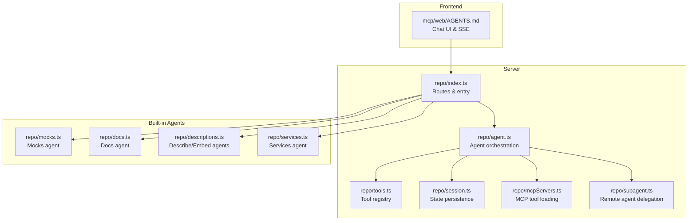
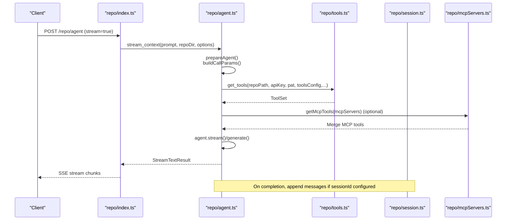
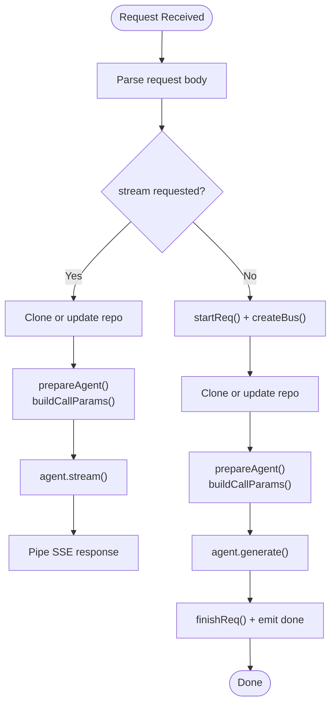
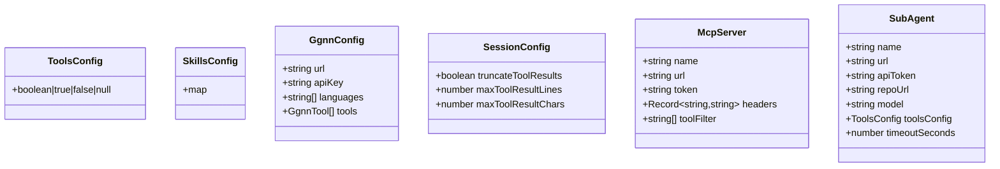
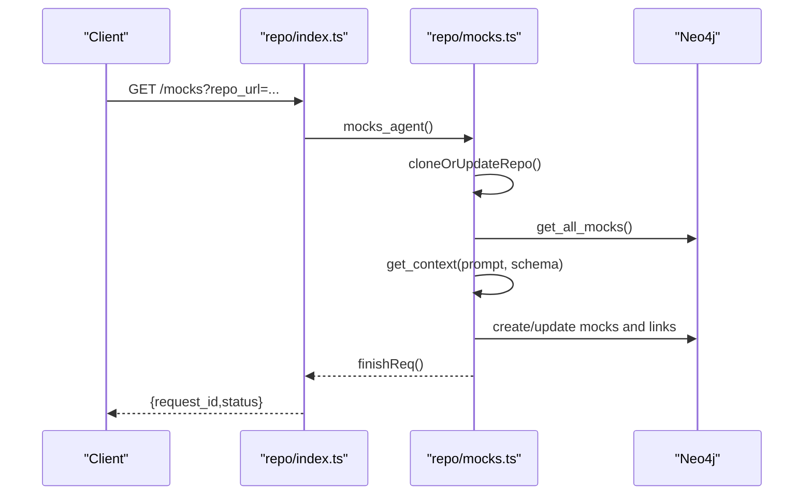
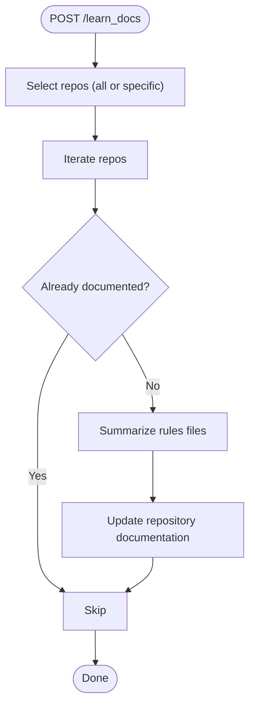
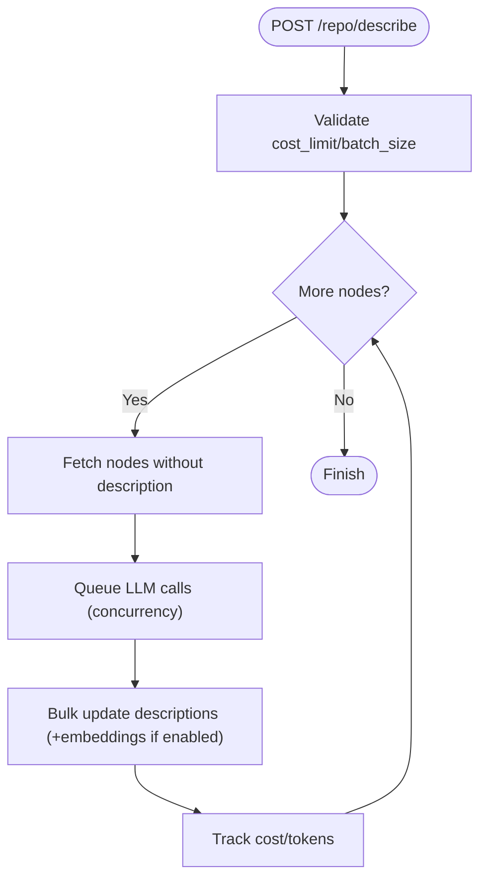
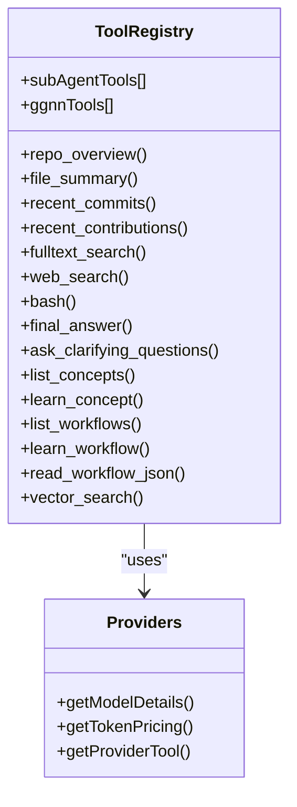
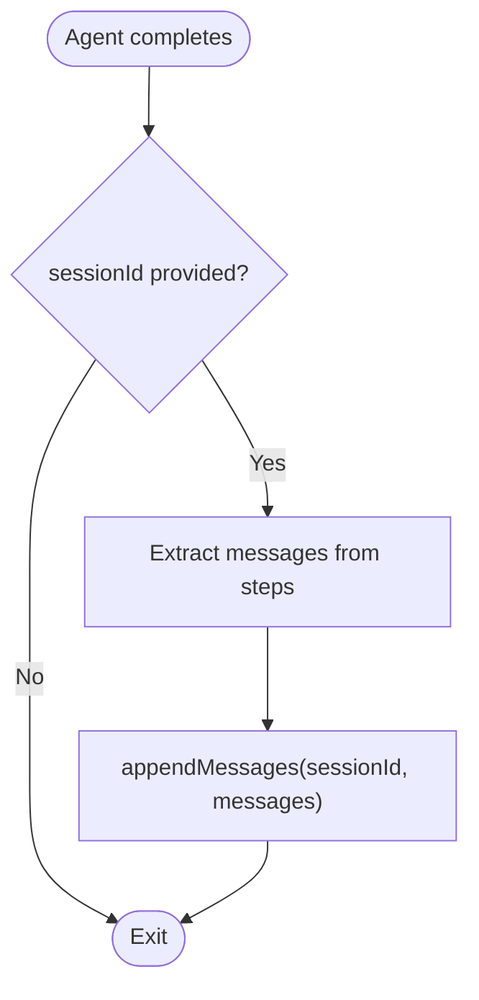
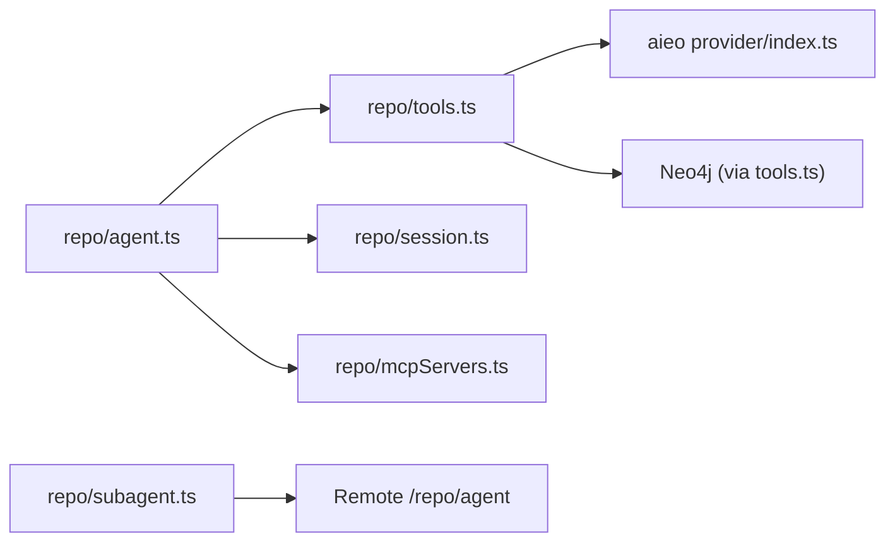

# AI Agent Framework

<cite>
**Referenced Files in This Document**
- [mcp/src/repo/index.ts](file://mcp/src/repo/index.ts)
- [mcp/src/repo/agent.ts](file://mcp/src/repo/agent.ts)
- [mcp/src/repo/session.ts](file://mcp/src/repo/session.ts)
- [mcp/src/repo/tools.ts](file://mcp/src/repo/tools.ts)
- [mcp/src/repo/mcpServers.ts](file://mcp/src/repo/mcpServers.ts)
- [mcp/src/repo/subagent.ts](file://mcp/src/repo/subagent.ts)
- [mcp/src/repo/mocks.ts](file://mcp/src/repo/mocks.ts)
- [mcp/src/repo/docs.ts](file://mcp/src/repo/docs.ts)
- [mcp/src/repo/descriptions.ts](file://mcp/src/repo/descriptions.ts)
- [mcp/src/repo/services.ts](file://mcp/src/repo/services.ts)
- [mcp/src/aieo/src/index.ts](file://mcp/src/aieo/src/index.ts)
- [mcp/web/AGENTS.md](file://mcp/web/AGENTS.md)
- [mcp/src/repo/agents.md](file://mcp/src/repo/agents.md)
</cite>

## Table of Contents
1. [Introduction](#introduction)
2. [Project Structure](#project-structure)
3. [Core Components](#core-components)
4. [Architecture Overview](#architecture-overview)
5. [Detailed Component Analysis](#detailed-component-analysis)
6. [Dependency Analysis](#dependency-analysis)
7. [Performance Considerations](#performance-considerations)
8. [Troubleshooting Guide](#troubleshooting-guide)
9. [Conclusion](#conclusion)
10. [Appendices](#appendices)

## Introduction
This document describes the AI agent framework within the MCP server. It explains the agent lifecycle, configuration management, execution patterns, and built-in agents. It also documents LLM provider integrations, communication protocols, session/state management, validation mechanisms, and practical examples for configuration and custom agent development.

## Project Structure
The agent framework centers around a Node/Express server that orchestrates AI-driven code exploration and documentation tasks. Key areas:
- Agent orchestration and lifecycle: repo agent controller, preparation, streaming, and session management
- Built-in agents: Mocks, Docs, Describe Nodes, Embed Nodes, Services
- Tooling and capabilities: Bash, search, vector search, workflow tools, sub-agent delegation, MCP server integration
- Frontend integration: chat UI that streams agent responses via SSE

**Diagram sources**
- [mcp/src/repo/index.ts:1-339](file://mcp/src/repo/index.ts#L1-L339)
- [mcp/src/repo/agent.ts:1-472](file://mcp/src/repo/agent.ts#L1-L472)
- [mcp/src/repo/tools.ts:1-722](file://mcp/src/repo/tools.ts#L1-L722)
- [mcp/src/repo/session.ts:1-191](file://mcp/src/repo/session.ts#L1-L191)
- [mcp/src/repo/mcpServers.ts:1-125](file://mcp/src/repo/mcpServers.ts#L1-L125)
- [mcp/src/repo/subagent.ts:1-213](file://mcp/src/repo/subagent.ts#L1-L213)
- [mcp/src/repo/mocks.ts:1-438](file://mcp/src/repo/mocks.ts#L1-L438)
- [mcp/src/repo/docs.ts:1-194](file://mcp/src/repo/docs.ts#L1-L194)
- [mcp/src/repo/descriptions.ts:1-328](file://mcp/src/repo/descriptions.ts#L1-L328)
- [mcp/src/repo/services.ts:1-146](file://mcp/src/repo/services.ts#L1-L146)
- [mcp/web/AGENTS.md:1-111](file://mcp/web/AGENTS.md#L1-L111)

**Section sources**
- [mcp/src/repo/index.ts:1-339](file://mcp/src/repo/index.ts#L1-L339)
- [mcp/web/AGENTS.md:1-111](file://mcp/web/AGENTS.md#L1-L111)

## Core Components
- Agent lifecycle
  - Parsing request bodies, cloning/updating repositories, preparing the ToolLoopAgent, streaming vs. async execution, and emitting progress via SSE
- Configuration management
  - ToolsConfig, SkillsConfig, GgnnConfig, session configuration, MCP server tool injection, sub-agent delegation
- Execution patterns
  - Structured final answers via JSON schema, stop conditions, step callbacks, and context truncation
- Communication protocols
  - SSE for streaming responses, HTTP for async jobs with progress polling, MCP HTTP transport for external tools

**Section sources**
- [mcp/src/repo/index.ts:40-253](file://mcp/src/repo/index.ts#L40-L253)
- [mcp/src/repo/agent.ts:128-395](file://mcp/src/repo/agent.ts#L128-L395)
- [mcp/src/repo/tools.ts:52-680](file://mcp/src/repo/tools.ts#L52-L680)
- [mcp/src/repo/mcpServers.ts:66-125](file://mcp/src/repo/mcpServers.ts#L66-L125)
- [mcp/src/repo/subagent.ts:94-212](file://mcp/src/repo/subagent.ts#L94-L212)

## Architecture Overview
The server exposes endpoints for:
- Interactive chat with streaming SSE
- Async jobs with progress polling
- Built-in agents for mocks, docs, descriptions, embeddings, and service setup
- Tool registration and dynamic capability composition

**Diagram sources**
- [mcp/src/repo/index.ts:80-253](file://mcp/src/repo/index.ts#L80-L253)
- [mcp/src/repo/agent.ts:164-395](file://mcp/src/repo/agent.ts#L164-L395)
- [mcp/src/repo/tools.ts:155-680](file://mcp/src/repo/tools.ts#L155-L680)
- [mcp/src/repo/session.ts:44-77](file://mcp/src/repo/session.ts#L44-L77)
- [mcp/src/repo/mcpServers.ts:66-125](file://mcp/src/repo/mcpServers.ts#L66-L125)

## Detailed Component Analysis

### Agent Lifecycle and Orchestration
- Request parsing and routing
  - Parses repo_url, credentials, prompt, toolsConfig, schema, model, apiKey, logs, sessionId, sessionConfig, mcpServers, systemOverride, skills, subAgents, ggnn, stream
  - Supports single or multi-repo URLs
- Streaming vs. async execution
  - Streaming: returns a StreamTextResult piped via SSE
  - Async: starts a background job, emits events, and returns request_id for polling
- Step events and progress
  - Step events are filtered and emitted to an event bus for SSE
  - Progress endpoint supports polling with JWT token when configured
- Context preparation
  - Resolves model and provider, loads/merges MCP tools, appends sub-agent and skills instructions, sets stop conditions, and prepares messages

**Diagram sources**
- [mcp/src/repo/index.ts:80-253](file://mcp/src/repo/index.ts#L80-L253)
- [mcp/src/repo/agent.ts:164-395](file://mcp/src/repo/agent.ts#L164-L395)

**Section sources**
- [mcp/src/repo/index.ts:40-253](file://mcp/src/repo/index.ts#L40-L253)
- [mcp/src/repo/agent.ts:128-395](file://mcp/src/repo/agent.ts#L128-L395)

### Configuration Management
- ToolsConfig
  - Enables/disables tools and overrides descriptions
  - Supports a compact string format and structured object form
- SkillsConfig
  - Activates inline and path-based skills
- GgnnConfig
  - Registers predictive/check/score-plan tools against a GGNN endpoint
- SessionConfig
  - Controls truncation of tool results for storage efficiency
- MCP Servers
  - Loads tools from external MCP servers with optional filtering and safe output conversion
- Sub-Agents
  - Delegates tasks to remote agents with timeouts and progress polling

**Diagram sources**
- [mcp/src/repo/tools.ts:52-680](file://mcp/src/repo/tools.ts#L52-L680)
- [mcp/src/repo/session.ts:21-25](file://mcp/src/repo/session.ts#L21-L25)
- [mcp/src/repo/mcpServers.ts:5-11](file://mcp/src/repo/mcpServers.ts#L5-L11)
- [mcp/src/repo/subagent.ts:3-20](file://mcp/src/repo/subagent.ts#L3-L20)

**Section sources**
- [mcp/src/repo/tools.ts:52-722](file://mcp/src/repo/tools.ts#L52-L722)
- [mcp/src/repo/session.ts:21-191](file://mcp/src/repo/session.ts#L21-L191)
- [mcp/src/repo/mcpServers.ts:66-125](file://mcp/src/repo/mcpServers.ts#L66-L125)
- [mcp/src/repo/subagent.ts:43-212](file://mcp/src/repo/subagent.ts#L43-L212)

### Built-in Agents

#### Mocks Agent
- Purpose: Discover third-party service integrations and record mock coverage
- Endpoint: GET /mocks
- Behavior:
  - Clones repo, optionally builds incremental prompt from existing mocks
  - Uses structured JSON schema to enforce output format
  - Persists results to graph, supports sync mode with delta computation
- Parameters: repo_url, username, pat, sync
- Responses: request_id, status; or JSON with mocks and config

**Diagram sources**
- [mcp/src/repo/index.ts:40-143](file://mcp/src/repo/index.ts#L40-L143)
- [mcp/src/repo/mocks.ts:40-143](file://mcp/src/repo/mocks.ts#L40-L143)

**Section sources**
- [mcp/src/repo/mocks.ts:40-438](file://mcp/src/repo/mocks.ts#L40-L438)
- [mcp/src/repo/agents.md:3-16](file://mcp/src/repo/agents.md#L3-L16)

#### Docs Agent
- Purpose: Summarize rules/documentation files and store repository-level documentation
- Endpoint: POST /learn_docs
- Behavior:
  - Iterates repositories, summarizes rules files, updates documentation
  - Supports limiting to a specific repo and forcing reprocessing
- Parameters: repo_url (optional), force
- Responses: message, summaries, usage

**Diagram sources**
- [mcp/src/repo/docs.ts:6-119](file://mcp/src/repo/docs.ts#L6-L119)

**Section sources**
- [mcp/src/repo/docs.ts:6-194](file://mcp/src/repo/docs.ts#L6-L194)
- [mcp/src/repo/agents.md:27-46](file://mcp/src/repo/agents.md#L27-L46)

#### Describe Nodes Agent
- Purpose: Generate short descriptions for graph nodes missing docs and optionally store embeddings
- Endpoint: POST /repo/describe
- Behavior:
  - Batched processing with concurrency control
  - Costs are tracked per token pricing
  - Optional embedding generation and bulk updates
- Parameters: cost_limit, batch_size, concurrency, repo_url, file_paths, embed
- Responses: request_id, status, message; progress updates; final stats

**Diagram sources**
- [mcp/src/repo/descriptions.ts:34-250](file://mcp/src/repo/descriptions.ts#L34-L250)

**Section sources**
- [mcp/src/repo/descriptions.ts:34-328](file://mcp/src/repo/descriptions.ts#L34-L328)
- [mcp/src/repo/agents.md:47-70](file://mcp/src/repo/agents.md#L47-L70)

#### Embed Nodes Agent
- Purpose: Generate embeddings for nodes with descriptions but no embeddings
- Endpoint: POST /embed/nodes
- Behavior:
  - Batched embedding generation and bulk updates
- Parameters: batch_size, repo_url, file_paths
- Responses: request_id, status, message; progress updates; final stats

**Section sources**
- [mcp/src/repo/descriptions.ts:251-328](file://mcp/src/repo/descriptions.ts#L251-L328)

#### Services Agent
- Purpose: Generate setup artifacts (pm2.config.js, docker-compose.yml) for a repository
- Endpoint: POST /repo/services
- Behavior:
  - Uses a specialized system prompt and final answer template
  - Parses returned file content and returns structured results
- Parameters: owner, repo, username, pat
- Responses: request_id, status; final files and usage

**Section sources**
- [mcp/src/repo/services.ts:9-146](file://mcp/src/repo/services.ts#L9-L146)

### Tool Capabilities and LLM Integrations
- Tool registry
  - Core tools: repo_overview, file_summary, recent_commits, recent_contributions, fulltext_search, web_search, bash, final_answer, ask_clarifying_questions, list_concepts, learn_concept, list_workflows, learn_workflow, read_workflow_json, vector_search
  - Conditional tools: workflow tools and vector_search activated when data exists
  - Sub-agent tools: dynamically registered remote agent tools
  - GGNN tools: predict/check/score-plan endpoints
- Provider integrations
  - Model resolution and pricing via aieo
  - Provider-specific tool wrappers (e.g., Anthropic web_search and bash)
- Structured outputs
  - Final answer can be constrained to a JSON schema for consistent formatting

**Diagram sources**
- [mcp/src/repo/tools.ts:155-680](file://mcp/src/repo/tools.ts#L155-L680)
- [mcp/src/aieo/src/index.ts:1-11](file://mcp/src/aieo/src/index.ts#L1-L11)

**Section sources**
- [mcp/src/repo/tools.ts:155-722](file://mcp/src/repo/tools.ts#L155-L722)
- [mcp/src/aieo/src/index.ts:1-11](file://mcp/src/aieo/src/index.ts#L1-L11)

### Communication Protocols
- Streaming
  - SSE via toUIMessageStreamResponse for real-time chat UI
- Async Jobs
  - Event bus emits step events; clients poll /progress?request_id
  - Optional JWT token signing for SSE auth
- MCP Transport
  - HTTP-based MCP client loads tools and wraps outputs safely

**Section sources**
- [mcp/src/repo/index.ts:102-253](file://mcp/src/repo/index.ts#L102-L253)
- [mcp/src/repo/mcpServers.ts:66-125](file://mcp/src/repo/mcpServers.ts#L66-L125)
- [mcp/web/AGENTS.md:78-111](file://mcp/web/AGENTS.md#L78-L111)

### Session Management and State Persistence
- Sessions
  - Create, load, append messages, check existence, delete, prune expired sessions
  - Storage format: JSONL lines per message
- Session configuration
  - Optional truncation of tool results to manage context size
- Agent integration
  - On completion, extracts messages from steps and appends to session when sessionId is provided

**Diagram sources**
- [mcp/src/repo/agent.ts:338-346](file://mcp/src/repo/agent.ts#L338-L346)
- [mcp/src/repo/session.ts:44-77](file://mcp/src/repo/session.ts#L44-L77)

**Section sources**
- [mcp/src/repo/session.ts:1-191](file://mcp/src/repo/session.ts#L1-L191)
- [mcp/src/repo/agent.ts:338-346](file://mcp/src/repo/agent.ts#L338-L346)

### Validation Mechanisms
- Request validation
  - Missing prompt, missing session_id, missing path, invalid parameters
- Tool validation
  - Sub-agent name sanitization, URL parsing, required fields
- MCP tool safety
  - Safe toModelOutput wrapper prevents crashes on undefined outputs
- Session validation
  - Existence checks and pruning of expired sessions

**Section sources**
- [mcp/src/repo/index.ts:266-339](file://mcp/src/repo/index.ts#L266-L339)
- [mcp/src/repo/subagent.ts:22-59](file://mcp/src/repo/subagent.ts#L22-L59)
- [mcp/src/repo/mcpServers.ts:13-64](file://mcp/src/repo/mcpServers.ts#L13-L64)
- [mcp/src/repo/session.ts:82-127](file://mcp/src/repo/session.ts#L82-L127)

## Dependency Analysis
- Cohesion
  - Agent orchestration encapsulates preparation, execution, and persistence
- Coupling
  - Tools depend on provider abstractions and optional DB features
  - Sub-agent and MCP integration are optional and layered
- External dependencies
  - AI SDK ToolLoopAgent, provider tool wrappers, MCP client, Neo4j graph DB, vector store

**Diagram sources**
- [mcp/src/repo/agent.ts:164-395](file://mcp/src/repo/agent.ts#L164-L395)
- [mcp/src/repo/tools.ts:155-680](file://mcp/src/repo/tools.ts#L155-L680)
- [mcp/src/repo/session.ts:44-77](file://mcp/src/repo/session.ts#L44-L77)
- [mcp/src/repo/mcpServers.ts:66-125](file://mcp/src/repo/mcpServers.ts#L66-L125)
- [mcp/src/repo/subagent.ts:94-212](file://mcp/src/repo/subagent.ts#L94-L212)
- [mcp/src/aieo/src/index.ts:1-11](file://mcp/src/aieo/src/index.ts#L1-L11)

**Section sources**
- [mcp/src/repo/agent.ts:164-395](file://mcp/src/repo/agent.ts#L164-L395)
- [mcp/src/repo/tools.ts:155-680](file://mcp/src/repo/tools.ts#L155-L680)

## Performance Considerations
- Streaming vs. async
  - Prefer streaming for interactive chat; async for long-running tasks with progress
- Concurrency and batching
  - Use batch_size and concurrency parameters for describe/embed agents to balance throughput and cost
- Context truncation
  - Enable session truncation to keep context manageable
- Token pricing
  - Monitor input/output token usage and cost limits for describe_nodes_agent

[No sources needed since this section provides general guidance]

## Troubleshooting Guide
- Streaming errors
  - Ensure toUIMessageStreamResponse is used and headers/body are forwarded correctly
- Missing prompt or session_id
  - Validate request payloads and session existence endpoints
- Tool failures
  - Check tool descriptions and provider tool availability; verify Anthropic-specific tool handling
- MCP tool issues
  - Confirm server connectivity, headers, and tool filtering; inspect safe toModelOutput logs
- Sub-agent timeouts
  - Increase timeoutSeconds and verify progress polling endpoint access

**Section sources**
- [mcp/src/repo/index.ts:102-175](file://mcp/src/repo/index.ts#L102-L175)
- [mcp/src/repo/index.ts:266-300](file://mcp/src/repo/index.ts#L266-L300)
- [mcp/src/repo/mcpServers.ts:13-64](file://mcp/src/repo/mcpServers.ts#L13-L64)
- [mcp/src/repo/subagent.ts:94-212](file://mcp/src/repo/subagent.ts#L94-L212)

## Conclusion
The MCP server’s AI agent framework provides a robust, extensible foundation for code exploration and documentation. It supports flexible tool registries, structured outputs, streaming and async execution, MCP integration, and persistent sessions. Built-in agents cover common scenarios like mocks discovery, documentation summarization, and service setup, while the underlying architecture enables custom agents and advanced patterns like sub-agent delegation.

[No sources needed since this section summarizes without analyzing specific files]

## Appendices

### Practical Examples

- Agent configuration
  - ToolsConfig: enable/disable tools and override descriptions
  - SkillsConfig: activate skills by name
  - GgnnConfig: register predictive/check/score-plan tools
  - SessionConfig: control truncation of tool results
  - MCP servers: load external tools with filtering and safe output handling
  - Sub-agents: delegate tasks to remote agents with timeouts and progress polling

- Custom agent development
  - Extend get_tools to add domain-specific tools
  - Use structured JSON schema for final_answer to enforce output formats
  - Integrate provider-specific tools for enhanced capabilities

- Agent-to-tool interaction patterns
  - Use ask_clarifying_questions to gather user preferences before final answer
  - Leverage vector_search for semantic code retrieval
  - Combine sub-agent tools for distributed reasoning across repositories

**Section sources**
- [mcp/src/repo/tools.ts:52-722](file://mcp/src/repo/tools.ts#L52-L722)
- [mcp/src/repo/agent.ts:91-126](file://mcp/src/repo/agent.ts#L91-L126)
- [mcp/src/repo/mcpServers.ts:66-125](file://mcp/src/repo/mcpServers.ts#L66-L125)
- [mcp/src/repo/subagent.ts:43-212](file://mcp/src/repo/subagent.ts#L43-L212)