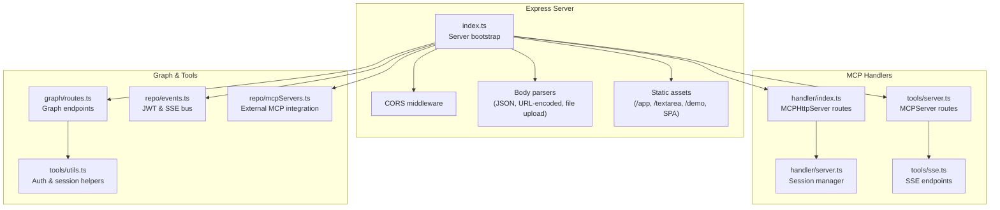
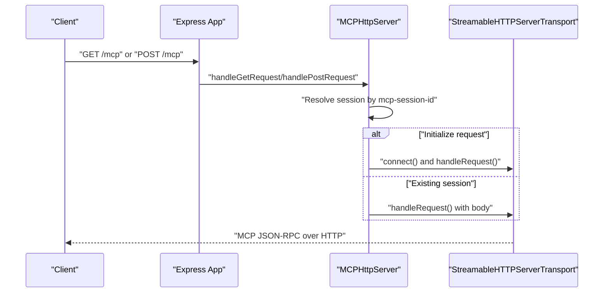
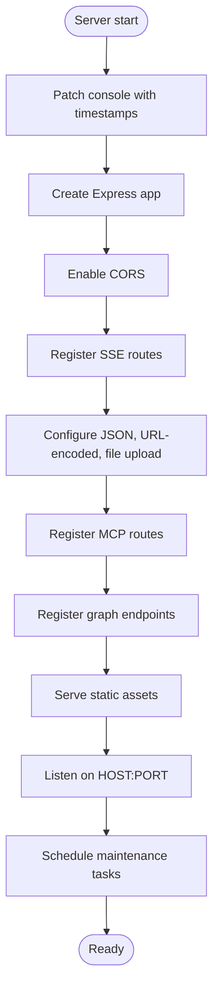
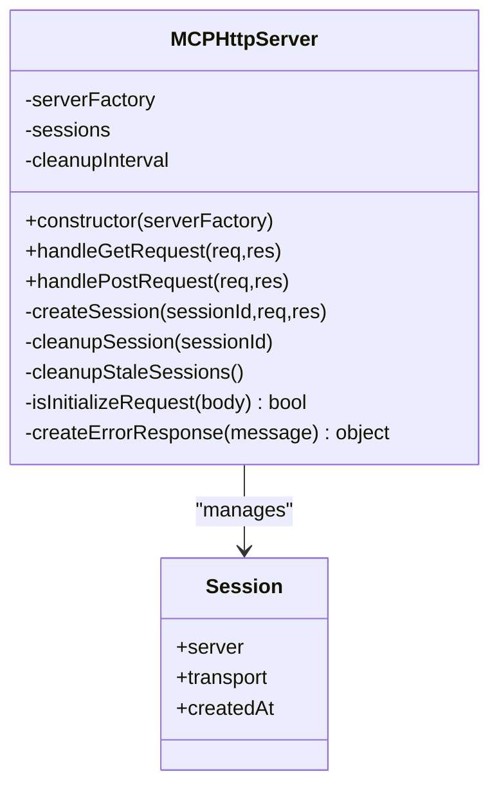
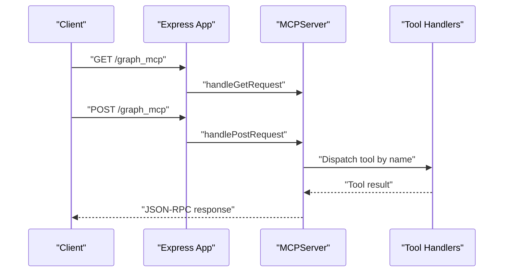
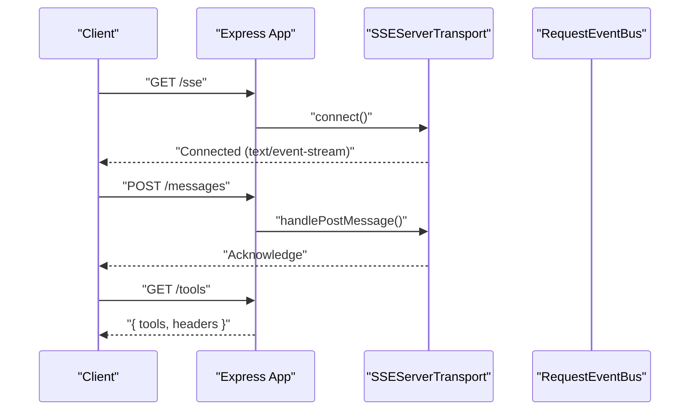
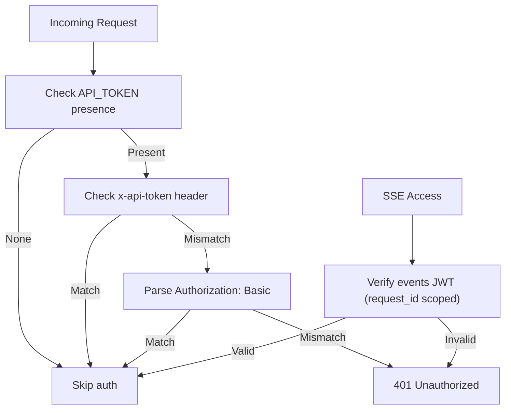
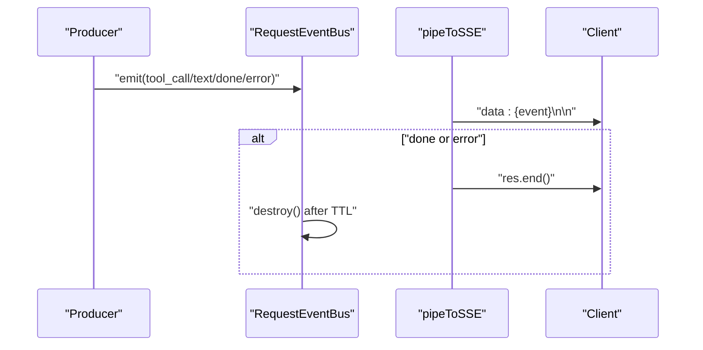
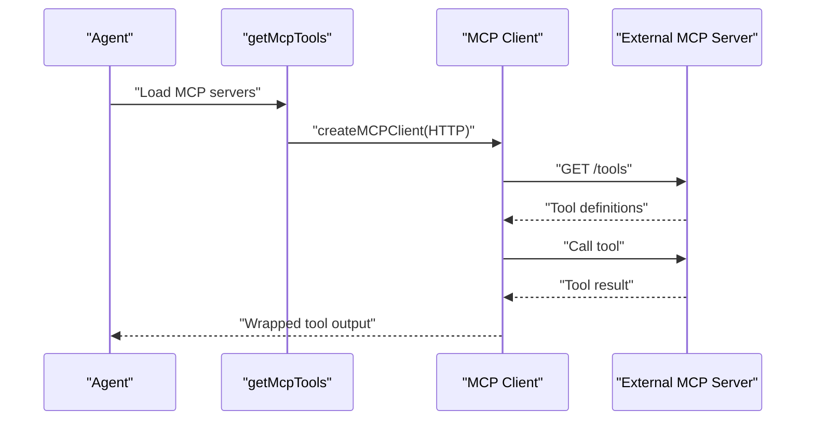
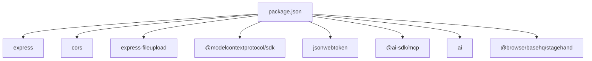

# Core MCP Server Implementation

<cite>
**Referenced Files in This Document**
- [index.ts](file://mcp/src/index.ts)
- [server.ts](file://mcp/src/handler/server.ts)
- [index.ts](file://mcp/src/handler/index.ts)
- [server.ts](file://mcp/src/tools/server.ts)
- [sse.ts](file://mcp/src/tools/sse.ts)
- [routes.ts](file://mcp/src/graph/routes.ts)
- [utils.ts](file://mcp/src/tools/utils.ts)
- [events.ts](file://mcp/src/repo/events.ts)
- [utils.ts](file://mcp/src/handler/utils.ts)
- [mcpServers.ts](file://mcp/src/repo/mcpServers.ts)
- [package.json](file://mcp/package.json)
- [app.js](file://mcp/app/app.js)
</cite>

## Table of Contents
1. [Introduction](#introduction)
2. [Project Structure](#project-structure)
3. [Core Components](#core-components)
4. [Architecture Overview](#architecture-overview)
5. [Detailed Component Analysis](#detailed-component-analysis)
6. [Dependency Analysis](#dependency-analysis)
7. [Performance Considerations](#performance-considerations)
8. [Troubleshooting Guide](#troubleshooting-guide)
9. [Conclusion](#conclusion)

## Introduction
This document explains the core MCP (Model Context Protocol) server implementation built on Express.js. It covers server initialization, middleware configuration, CORS handling, request routing, MCP handler integration, authentication mechanisms, and real-time communication via Server-Sent Events (SSE). It also documents global console patching for timestamped logging, error handling strategies, and practical examples for server configuration, custom middleware, and external tool integration.

## Project Structure
The MCP server is implemented primarily under the mcp/src directory with supporting modules for tools, SSE, events, and graph operations. Key areas:
- Server bootstrap and routing: mcp/src/index.ts
- MCP HTTP server and session management: mcp/src/handler/server.ts and mcp/src/handler/index.ts
- Alternative MCP server and tool routing: mcp/src/tools/server.ts and mcp/src/tools/sse.ts
- Authentication and graph routes: mcp/src/graph/routes.ts
- Utilities for tokens and sessions: mcp/src/tools/utils.ts and mcp/src/repo/events.ts
- External MCP server integration: mcp/src/repo/mcpServers.ts
- Frontend app for MCP clients: mcp/app/app.js
- Dependencies and scripts: mcp/package.json

**Diagram sources**
- [index.ts:51-241](file://mcp/src/index.ts#L51-L241)
- [server.ts:15-164](file://mcp/src/handler/server.ts#L15-L164)
- [index.ts:59-69](file://mcp/src/handler/index.ts#L59-L69)
- [server.ts:14-95](file://mcp/src/tools/server.ts#L14-L95)
- [sse.ts:8-59](file://mcp/src/tools/sse.ts#L8-L59)
- [routes.ts:87-122](file://mcp/src/graph/routes.ts#L87-L122)
- [utils.ts:22-41](file://mcp/src/tools/utils.ts#L22-L41)
- [events.ts:96-144](file://mcp/src/repo/events.ts#L96-L144)
- [mcpServers.ts:66-125](file://mcp/src/repo/mcpServers.ts#L66-L125)

**Section sources**
- [index.ts:51-241](file://mcp/src/index.ts#L51-L241)
- [package.json:24-36](file://mcp/package.json#L24-L36)

## Core Components
- Express server initialization and middleware stack
- MCP HTTP server with session management
- SSE transport for real-time event streaming
- Authentication middleware and token utilities
- Graph and tool endpoints
- External MCP server integration

**Section sources**
- [index.ts:51-241](file://mcp/src/index.ts#L51-L241)
- [server.ts:15-164](file://mcp/src/handler/server.ts#L15-L164)
- [server.ts:14-95](file://mcp/src/tools/server.ts#L14-L95)
- [sse.ts:8-59](file://mcp/src/tools/sse.ts#L8-L59)
- [routes.ts:87-122](file://mcp/src/graph/routes.ts#L87-L122)
- [utils.ts:22-41](file://mcp/src/tools/utils.ts#L22-L41)
- [events.ts:96-144](file://mcp/src/repo/events.ts#L96-L144)
- [mcpServers.ts:66-125](file://mcp/src/repo/mcpServers.ts#L66-L125)

## Architecture Overview
The server composes multiple concerns:
- Express app with CORS and body parsing
- MCP handler endpoints for both streamable HTTP and SSE transports
- Graph endpoints protected by authentication middleware
- Event bus for SSE with JWT-scoped tokens
- Optional external MCP servers integrated via HTTP transport

**Diagram sources**
- [index.ts:61-69](file://mcp/src/handler/index.ts#L61-L69)
- [server.ts:42-128](file://mcp/src/handler/server.ts#L42-L128)

## Detailed Component Analysis

### Express Server Initialization and Routing
- Global console patch adds ISO 8601 timestamps to all console output.
- CORS enabled globally.
- SSE routes registered before body parsers to preserve raw streams.
- Body parsers configured for JSON (with large payload limit) and URL-encoded forms; file upload middleware enabled.
- Static assets served for internal apps and SPA fallback.
- Environment variables configure host and port; scheduled maintenance tasks run periodically.

**Diagram sources**
- [index.ts:1-241](file://mcp/src/index.ts#L1-L241)

**Section sources**
- [index.ts:1-241](file://mcp/src/index.ts#L1-L241)

### MCP Handler System (Streamable HTTP)
- Session-per-request model with per-session transport.
- Accepts mcp-session-id header; supports re-initialization and reuse.
- Cleans up stale sessions periodically.
- Validates initialize requests and responds with standardized JSON-RPC error payloads.

**Diagram sources**
- [server.ts:15-164](file://mcp/src/handler/server.ts#L15-L164)

**Section sources**
- [server.ts:15-164](file://mcp/src/handler/server.ts#L15-L164)
- [index.ts:59-69](file://mcp/src/handler/index.ts#L59-L69)

### MCP Handler System (Alternative Transport)
- Provides a separate MCPServer with tool handlers for graph operations.
- Exposes GET/POST endpoints behind bearer token middleware.
- Supports dynamic tool discovery and invocation.

**Diagram sources**
- [server.ts:29-95](file://mcp/src/tools/server.ts#L29-L95)

**Section sources**
- [server.ts:14-95](file://mcp/src/tools/server.ts#L14-L95)
- [utils.ts:10-16](file://mcp/src/tools/utils.ts#L10-L16)

### SSE Transport and Real-Time Streaming
- SSE endpoint establishes a persistent connection and connects the MCP server transport.
- A dedicated POST endpoint accepts messages for the active transport.
- Tools endpoint lists available HTTP-compatible tools with optional Authorization header hint.

**Diagram sources**
- [sse.ts:8-59](file://mcp/src/tools/sse.ts#L8-L59)
- [server.ts:14-26](file://mcp/src/tools/server.ts#L14-L26)

**Section sources**
- [sse.ts:8-59](file://mcp/src/tools/sse.ts#L8-L59)
- [server.ts:14-26](file://mcp/src/tools/server.ts#L14-L26)

### Authentication and Authorization
- API token enforcement via x-api-token header or Basic Auth.
- Bearer token middleware for SSE and MCP endpoints.
- Session ID propagation via mcp-session-id header.
- JWT-scoped tokens for SSE event access.

**Diagram sources**
- [routes.ts:87-122](file://mcp/src/graph/routes.ts#L87-L122)
- [utils.ts:22-34](file://mcp/src/tools/utils.ts#L22-L34)
- [events.ts:21-34](file://mcp/src/repo/events.ts#L21-L34)

**Section sources**
- [routes.ts:87-122](file://mcp/src/graph/routes.ts#L87-L122)
- [utils.ts:22-41](file://mcp/src/tools/utils.ts#L22-L41)
- [events.ts:21-34](file://mcp/src/repo/events.ts#L21-L34)

### Event Bus and SSE Pipeline
- Per-request event bus with TTL and auto-cleanup.
- SSE helper writes events to the client stream and closes on completion.
- Step content filtering excludes large tool results.

**Diagram sources**
- [events.ts:56-144](file://mcp/src/repo/events.ts#L56-L144)

**Section sources**
- [events.ts:56-144](file://mcp/src/repo/events.ts#L56-L144)

### External MCP Servers Integration
- Wraps external MCP servers via HTTP transport.
- Supports token-based or custom header authentication.
- Safely converts tool outputs to model-friendly shapes, handling undefined results.

**Diagram sources**
- [mcpServers.ts:66-125](file://mcp/src/repo/mcpServers.ts#L66-L125)

**Section sources**
- [mcpServers.ts:66-125](file://mcp/src/repo/mcpServers.ts#L66-L125)

### Practical Examples

- Server configuration
  - Host and port are controlled by environment variables; defaults are applied if not set.
  - Example environment variables: HOST, PORT, API_TOKEN, NEO4J_*.

- Custom middleware implementation
  - Add a new middleware by defining a function with Request, Response, NextFunction signature and registering it before sensitive routes.
  - Example pattern: [authMiddleware:87-122](file://mcp/src/graph/routes.ts#L87-L122).

- Integration with external tools
  - Use bearerToken middleware for SSE and MCP endpoints.
  - Configure external MCP servers with token or headers in [mcpServers.ts:79-85](file://mcp/src/repo/mcpServers.ts#L79-L85).

- Real-time event streaming
  - Obtain a short-lived JWT scoped to a request_id via [signEventsToken:22-26](file://mcp/src/repo/events.ts#L22-L26).
  - Connect to /events/:request_id with token query parameter or x-api-token header.

**Section sources**
- [index.ts:233-241](file://mcp/src/index.ts#L233-L241)
- [routes.ts:87-122](file://mcp/src/graph/routes.ts#L87-L122)
- [utils.ts:22-34](file://mcp/src/tools/utils.ts#L22-L34)
- [mcpServers.ts:79-85](file://mcp/src/repo/mcpServers.ts#L79-L85)
- [events.ts:22-26](file://mcp/src/repo/events.ts#L22-L26)

## Dependency Analysis
- Express dependencies: cors, express, express-fileupload.
- MCP SDK: @modelcontextprotocol/sdk for server and transport.
- AI/MCP integrations: @ai-sdk/mcp, ai, @browserbasehq/stagehand.
- Authentication: jsonwebtoken for JWT signing/verification.
- Environment configuration: dotenv.

**Diagram sources**
- [package.json:42-76](file://mcp/package.json#L42-L76)

**Section sources**
- [package.json:42-76](file://mcp/package.json#L42-L76)

## Performance Considerations
- Payload limits: JSON body parser configured with a large limit suitable for MCP payloads.
- Session cleanup: MCP sessions are cleaned up periodically and on re-initialization to prevent memory leaks.
- SSE buffering: Nginx buffering disabled for SSE responses to ensure real-time delivery.
- Token handling: Avoid sending large tool results over SSE; use filtering to reduce bandwidth.

[No sources needed since this section provides general guidance]

## Troubleshooting Guide
- 401 Unauthorized
  - Ensure API token is set and matches x-api-token header or Basic Auth credentials.
  - For SSE, verify JWT validity and request_id scoping.

- No active transport or session
  - Confirm mcp-session-id header is present for MCP endpoints.
  - For SSE, ensure /sse was called before sending messages to /messages.

- Internal server errors
  - Check MCP handler error responses and session cleanup on exceptions.
  - Review console logs for stack traces.

- SSE connection issues
  - Verify headers and request_id scoping.
  - Confirm bus exists and is not ended prematurely.

**Section sources**
- [server.ts:106-112](file://mcp/src/handler/server.ts#L106-L112)
- [events.ts:118-144](file://mcp/src/repo/events.ts#L118-L144)
- [routes.ts:87-122](file://mcp/src/graph/routes.ts#L87-L122)

## Conclusion
The MCP server integrates Express.js with the Model Context Protocol using both streamable HTTP and SSE transports. It provides robust session management, authentication, and real-time event streaming. The modular design allows easy extension with external MCP servers and custom tool handlers while maintaining clear separation of concerns.