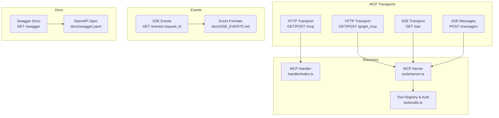
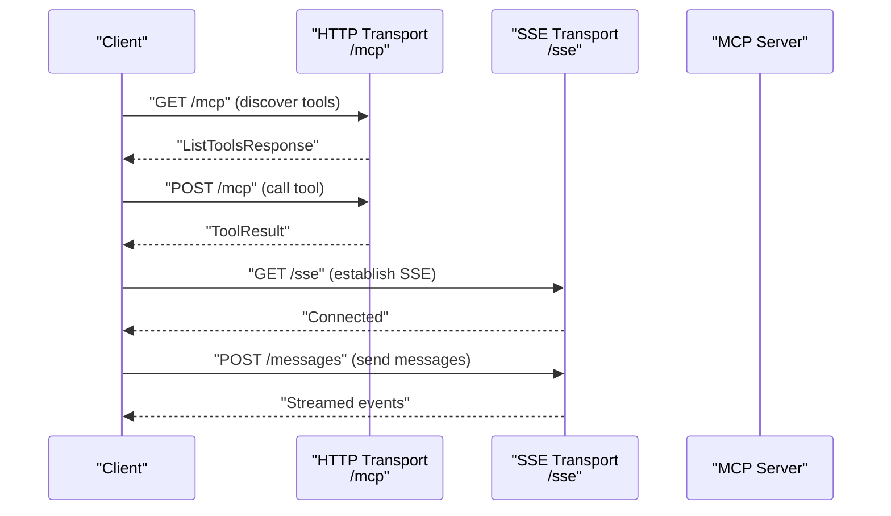
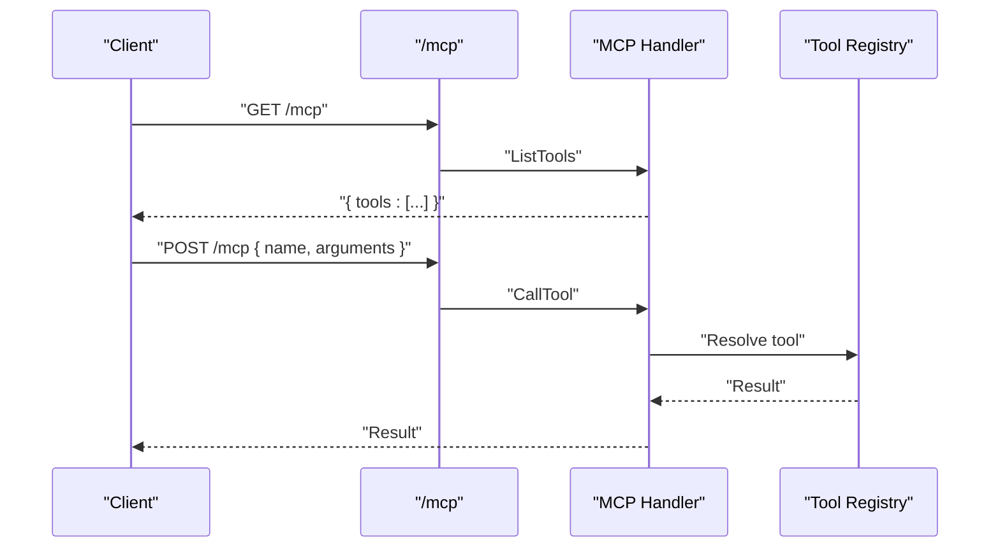
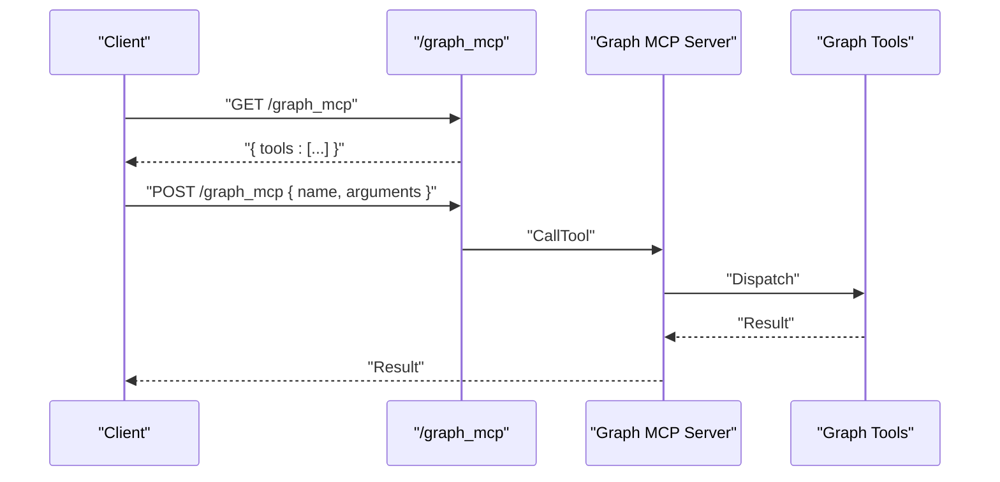
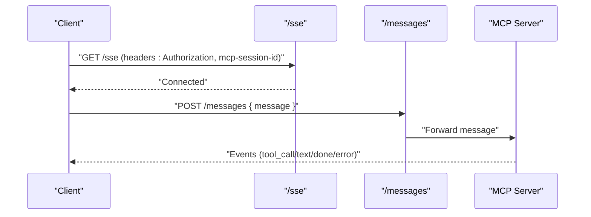
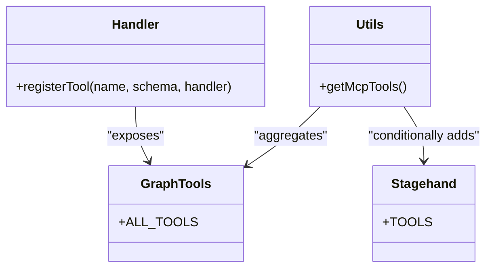
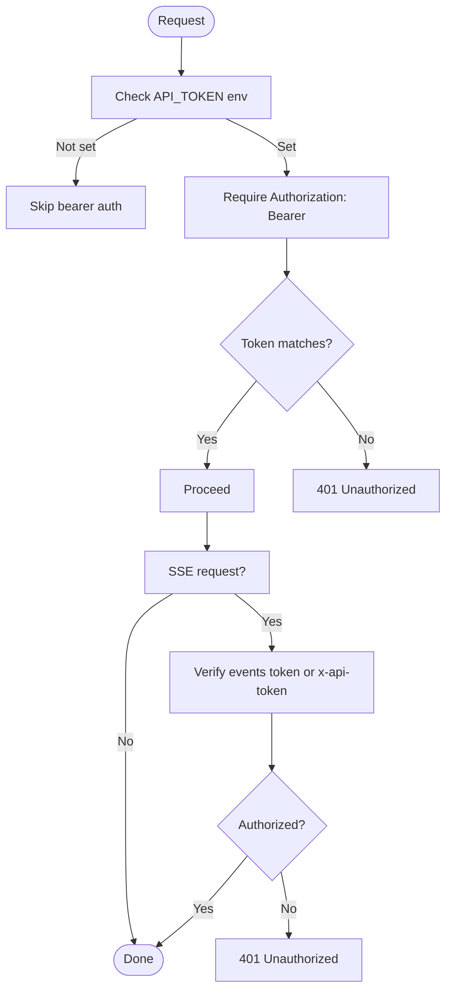
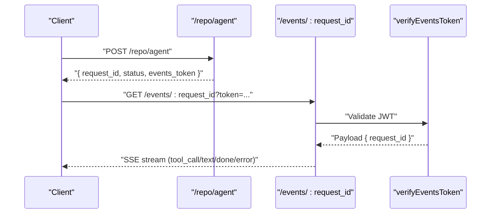
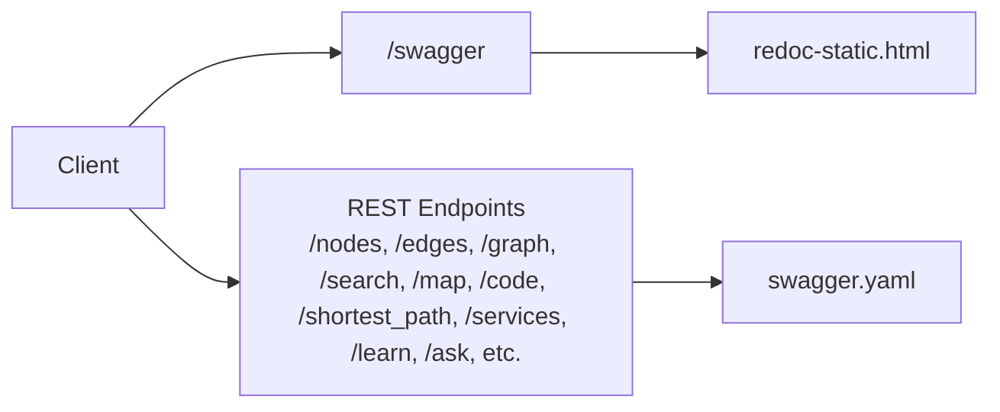
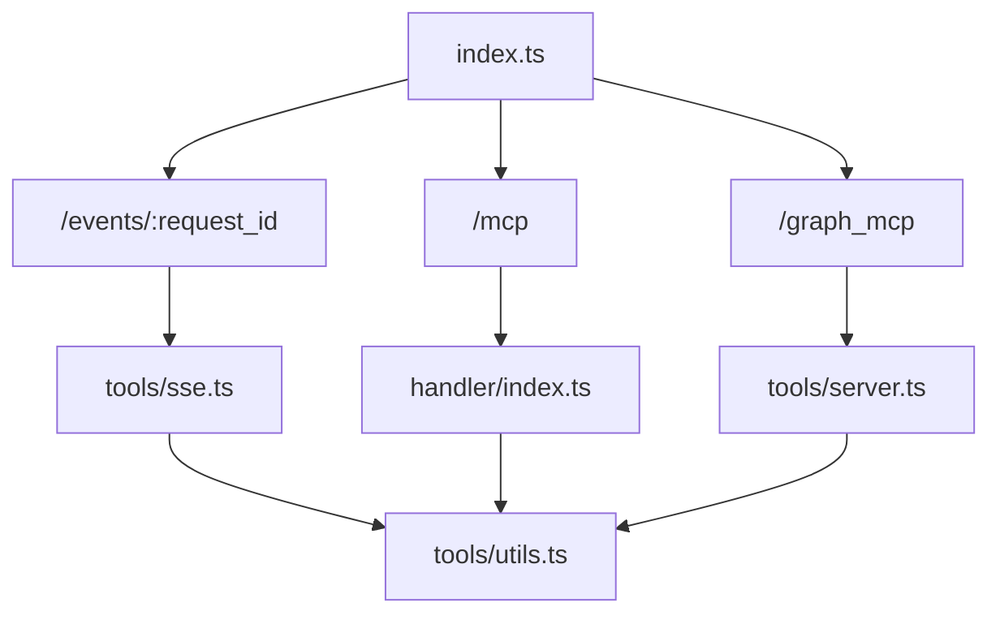

# Integration Examples and Clients

<cite>
**Referenced Files in This Document**
- [index.ts](file://mcp/src/index.ts)
- [swagger.yaml](file://mcp/docs/swagger.yaml)
- [SSE_EVENTS.md](file://mcp/docs/SSE_EVENTS.md)
- [handler/index.ts](file://mcp/src/handler/index.ts)
- [tools/server.ts](file://mcp/src/tools/server.ts)
- [tools/sse.ts](file://mcp/src/tools/sse.ts)
- [tools/utils.ts](file://mcp/src/tools/utils.ts)
- [tools/stakgraph/index.ts](file://mcp/src/tools/stakgraph/index.ts)
- [tools/stagehand/tools.ts](file://mcp/src/tools/stagehand/tools.ts)
- [repo/mcpServers.ts](file://mcp/src/repo/mcpServers.ts)
- [test-mcp/test-mcp.ts](file://mcp/docs/test-mcp/test-mcp.ts)
- [test-mcp/agent.ts](file://mcp/docs/test-mcp/agent.ts)
- [test-mcp/http-mcp-client.ts](file://mcp/docs/test-mcp/http-mcp-client.ts)
- [test-mcp/sse.ts](file://mcp/docs/test-mcp/sse.ts)
- [README.md](file://mcp/README.md)
</cite>

## Table of Contents
1. [Introduction](#introduction)
2. [Project Structure](#project-structure)
3. [Core Components](#core-components)
4. [Architecture Overview](#architecture-overview)
5. [Detailed Component Analysis](#detailed-component-analysis)
6. [Dependency Analysis](#dependency-analysis)
7. [Performance Considerations](#performance-considerations)
8. [Troubleshooting Guide](#troubleshooting-guide)
9. [Conclusion](#conclusion)
10. [Appendices](#appendices)

## Introduction
This document explains how to integrate AI editors and clients with the Model Context Protocol (MCP) server exposed by the project. It covers:
- How to discover tools via MCP
- How to configure authentication and sessions
- How to connect via HTTP and SSE transports
- How to test tool availability and execute tools
- How to consume real-time agent events via Server-Sent Events (SSE)
- How to use the Swagger/OpenAPI documentation for complementary endpoints

The MCP server exposes both a standard HTTP transport and an SSE transport for streaming agent events. Tool discovery is handled by the MCP protocol itself, while complementary REST endpoints are documented in the Swagger specification.

## Project Structure
Key integration surfaces:
- HTTP transport endpoints for MCP: GET/POST /mcp and GET/POST /graph_mcp
- SSE transport endpoints: GET /sse and POST /messages
- SSE event subscription: GET /events/:request_id with token-based auth
- Swagger/OpenAPI documentation: GET /swagger
- Tool registry and discovery: tools registered via handler and server modules

**Diagram sources**
- [index.ts:51-102](file://mcp/src/index.ts#L51-L102)
- [handler/index.ts:59-69](file://mcp/src/handler/index.ts#L59-L69)
- [tools/server.ts:29-36](file://mcp/src/tools/server.ts#L29-L36)
- [tools/sse.ts:8-27](file://mcp/src/tools/sse.ts#L8-L27)
- [tools/utils.ts:10-16](file://mcp/src/tools/utils.ts#L10-L16)
- [SSE_EVENTS.md:1-105](file://mcp/docs/SSE_EVENTS.md#L1-L105)
- [swagger.yaml:1-800](file://mcp/docs/swagger.yaml#L1-L800)

**Section sources**
- [index.ts:51-102](file://mcp/src/index.ts#L51-L102)
- [swagger.yaml:1-800](file://mcp/docs/swagger.yaml#L1-L800)

## Core Components
- MCP HTTP transport: Exposes GET/POST /mcp for tool discovery and execution.
- MCP HTTP transport (graph tools): Exposes GET/POST /graph_mcp for graph-related tools.
- SSE transport: Exposes GET /sse for long-lived SSE connections and POST /messages for bidirectional messaging.
- Tool registry: Aggregates core tools and optionally Stagehand tools behind a feature flag.
- Authentication: Bearer token enforcement via API_TOKEN environment variable.
- SSE events: Real-time agent step events with token-scoped JWT or x-api-token header.

**Section sources**
- [handler/index.ts:59-69](file://mcp/src/handler/index.ts#L59-L69)
- [tools/server.ts:29-36](file://mcp/src/tools/server.ts#L29-L36)
- [tools/sse.ts:8-27](file://mcp/src/tools/sse.ts#L8-L27)
- [tools/utils.ts:10-16](file://mcp/src/tools/utils.ts#L10-L16)
- [index.ts:58-96](file://mcp/src/index.ts#L58-L96)

## Architecture Overview
The MCP server supports two primary integration modes:
- HTTP: Stateless tool discovery and execution via GET/POST /mcp and /graph_mcp
- SSE: Long-lived streaming for agent events and bidirectional messaging

**Diagram sources**
- [handler/index.ts:61-69](file://mcp/src/handler/index.ts#L61-L69)
- [tools/server.ts:29-36](file://mcp/src/tools/server.ts#L29-L36)
- [tools/sse.ts:11-27](file://mcp/src/tools/sse.ts#L11-L27)

## Detailed Component Analysis

### MCP HTTP Transport Integration
- Discovery: GET /mcp lists available tools.
- Execution: POST /mcp invokes a tool by name with arguments.
- Authentication: Requires Authorization: Bearer <API_TOKEN> when API_TOKEN is configured.

**Diagram sources**
- [handler/index.ts:61-69](file://mcp/src/handler/index.ts#L61-L69)
- [tools/server.ts:38-89](file://mcp/src/tools/server.ts#L38-L89)

**Section sources**
- [handler/index.ts:59-69](file://mcp/src/handler/index.ts#L59-L69)
- [tools/server.ts:29-36](file://mcp/src/tools/server.ts#L29-L36)

### MCP Graph Tools HTTP Transport
- Discovery: GET /graph_mcp lists graph tools.
- Execution: POST /graph_mcp executes graph tools (e.g., search, get nodes/edges, map, code, path, repo map, rules files, explore).
- Authentication: Same bearer token requirement as /mcp.

**Diagram sources**
- [tools/server.ts:29-36](file://mcp/src/tools/server.ts#L29-L36)
- [tools/server.ts:42-89](file://mcp/src/tools/server.ts#L42-L89)

**Section sources**
- [tools/server.ts:29-36](file://mcp/src/tools/server.ts#L29-L36)
- [tools/server.ts:42-89](file://mcp/src/tools/server.ts#L42-L89)

### SSE Transport Integration
- Connect: GET /sse establishes an SSE transport with optional mcp-session-id header.
- Bidirectional messaging: POST /messages forwards client messages to the server.
- Tool availability: GET /tools returns the current tool list with optional Authorization header hint.

**Diagram sources**
- [tools/sse.ts:11-27](file://mcp/src/tools/sse.ts#L11-L27)
- [tools/sse.ts:30-46](file://mcp/src/tools/sse.ts#L30-L46)
- [tools/sse.ts:48-58](file://mcp/src/tools/sse.ts#L48-L58)

**Section sources**
- [tools/sse.ts:8-27](file://mcp/src/tools/sse.ts#L8-L27)
- [tools/sse.ts:30-46](file://mcp/src/tools/sse.ts#L30-L46)
- [tools/sse.ts:48-58](file://mcp/src/tools/sse.ts#L48-L58)

### Tool Discovery and Registration
- Core tools: Registered in the MCP handler and exported as ALL_TOOLS for graph tools.
- Optional Stagehand tools: Conditionally included when USE_STAGEHAND is enabled.
- Tool schemas: Defined with Zod and converted to JSON schema for discovery.

**Diagram sources**
- [handler/index.ts:7-57](file://mcp/src/handler/index.ts#L7-L57)
- [tools/stakgraph/index.ts:21-31](file://mcp/src/tools/stakgraph/index.ts#L21-L31)
- [tools/utils.ts:10-16](file://mcp/src/tools/utils.ts#L10-L16)
- [tools/stagehand/tools.ts:150-159](file://mcp/src/tools/stagehand/tools.ts#L150-L159)

**Section sources**
- [handler/index.ts:7-57](file://mcp/src/handler/index.ts#L7-L57)
- [tools/stakgraph/index.ts:21-31](file://mcp/src/tools/stakgraph/index.ts#L21-L31)
- [tools/utils.ts:10-16](file://mcp/src/tools/utils.ts#L10-L16)
- [tools/stagehand/tools.ts:150-159](file://mcp/src/tools/stagehand/tools.ts#L150-L159)

### Authentication and Sessions
- Bearer token: Required when API_TOKEN is set; enforced via bearerToken middleware.
- Session ID: Optional mcp-session-id header for SSE transport.
- API token header: Alternative to JWT for SSE event access.

**Diagram sources**
- [tools/utils.ts:22-34](file://mcp/src/tools/utils.ts#L22-L34)
- [tools/sse.ts:36-41](file://mcp/src/tools/sse.ts#L36-L41)
- [index.ts:58-96](file://mcp/src/index.ts#L58-L96)

**Section sources**
- [tools/utils.ts:22-34](file://mcp/src/tools/utils.ts#L22-L34)
- [tools/sse.ts:36-41](file://mcp/src/tools/sse.ts#L36-L41)
- [index.ts:58-96](file://mcp/src/index.ts#L58-L96)

### Real-time Agent Events (SSE)
- Establish SSE: POST /repo/agent returns { request_id, status, events_token }.
- Subscribe: GET /events/:request_id?token=<events_token> receives JSON events.
- Event types: tool_call, text, done, error.
- Token scope: events_token is a 1-hour JWT scoped to request_id; alternatively use x-api-token header.

**Diagram sources**
- [index.ts:58-96](file://mcp/src/index.ts#L58-L96)
- [SSE_EVENTS.md:5-10](file://mcp/docs/SSE_EVENTS.md#L5-L10)

**Section sources**
- [index.ts:58-96](file://mcp/src/index.ts#L58-L96)
- [SSE_EVENTS.md:1-105](file://mcp/docs/SSE_EVENTS.md#L1-L105)

### Swagger/OpenAPI Documentation
- Access: GET /swagger serves the Redoc static HTML.
- Specification: docs/swagger.yaml defines endpoints for graph exploration, search, maps, code retrieval, and more.
- Use cases: Complementary to MCP for non-tool operations (e.g., retrieving nodes, edges, maps, and search results).

**Diagram sources**
- [index.ts:47-49](file://mcp/src/index.ts#L47-L49)
- [swagger.yaml:1-800](file://mcp/docs/swagger.yaml#L1-L800)

**Section sources**
- [index.ts:47-49](file://mcp/src/index.ts#L47-L49)
- [swagger.yaml:1-800](file://mcp/docs/swagger.yaml#L1-L800)

### Practical Integration Examples

#### Using @ai-sdk/mcp client (HTTP)
- Configure transport with type "http", URL, and Authorization header.
- Discover tools via client.tools().
- Execute a tool by name with arguments.

References:
- [test-mcp/test-mcp.ts:1-40](file://mcp/docs/test-mcp/test-mcp.ts#L1-L40)

#### Using ai SDK experimental client (SSE)
- Configure transport with type "sse", URL, and Authorization header.
- Discover tools and execute them; useful for agent workflows.

References:
- [test-mcp/agent.ts:1-53](file://mcp/docs/test-mcp/agent.ts#L1-L53)
- [test-mcp/sse.ts:1-50](file://mcp/docs/test-mcp/sse.ts#L1-L50)

#### Using @modelcontextprotocol/sdk (HTTP)
- Create StreamableHTTPClientTransport with URL and headers.
- Connect client and call tools by name.

References:
- [test-mcp/http-mcp-client.ts:1-62](file://mcp/docs/test-mcp/http-mcp-client.ts#L1-L62)

#### Multi-server tool aggregation
- Use getMcpTools(mcpServers) to connect to multiple MCP servers, prefix tool names, and safely convert outputs.

References:
- [repo/mcpServers.ts:66-125](file://mcp/src/repo/mcpServers.ts#L66-L125)

## Dependency Analysis
- Index routes register SSE, auth, and MCP endpoints.
- Handler and server modules define MCP capabilities and tool dispatch.
- SSE routes depend on bearerToken and mcpSession middlewares.
- Tool availability depends on environment flags (USE_STAGEHAND) and API_TOKEN presence.

**Diagram sources**
- [index.ts:51-102](file://mcp/src/index.ts#L51-L102)
- [handler/index.ts:59-69](file://mcp/src/handler/index.ts#L59-L69)
- [tools/server.ts:29-36](file://mcp/src/tools/server.ts#L29-L36)
- [tools/sse.ts:8-27](file://mcp/src/tools/sse.ts#L8-L27)
- [tools/utils.ts:10-16](file://mcp/src/tools/utils.ts#L10-L16)

**Section sources**
- [index.ts:51-102](file://mcp/src/index.ts#L51-L102)
- [handler/index.ts:59-69](file://mcp/src/handler/index.ts#L59-L69)
- [tools/server.ts:29-36](file://mcp/src/tools/server.ts#L29-L36)
- [tools/sse.ts:8-27](file://mcp/src/tools/sse.ts#L8-L27)
- [tools/utils.ts:10-16](file://mcp/src/tools/utils.ts#L10-L16)

## Performance Considerations
- SSE transport is designed for long-lived connections; ensure proper cleanup on close and error.
- Tool execution results can be large; avoid streaming tool results in SSE to reduce bandwidth.
- Use caching and pagination where applicable for graph endpoints (e.g., search, map, code).
- Limit concurrent SSE connections and manage session IDs to prevent resource contention.

## Troubleshooting Guide
Common issues and resolutions:
- 401 Unauthorized on /mcp or /graph_mcp:
  - Ensure Authorization: Bearer <API_TOKEN> is set when API_TOKEN is configured.
  - Verify the token matches the configured API_TOKEN.
- 401 Unauthorized on /events/:request_id:
  - Use the events_token JWT scoped to request_id or set x-api-token header equal to API_TOKEN.
- No active transport on /messages:
  - Confirm that /sse was called first to establish the transport.
- Tool not found:
  - Verify tool name casing and prefix if using multi-server aggregation.
  - Check USE_STAGEHAND environment variable if expecting Stagehand tools.
- Large tool results:
  - SSE excludes tool results intentionally; poll or capture results via HTTP transport.

**Section sources**
- [tools/utils.ts:22-34](file://mcp/src/tools/utils.ts#L22-L34)
- [index.ts:58-96](file://mcp/src/index.ts#L58-L96)
- [tools/sse.ts:30-46](file://mcp/src/tools/sse.ts#L30-L46)
- [repo/mcpServers.ts:66-125](file://mcp/src/repo/mcpServers.ts#L66-L125)

## Conclusion
The MCP server provides robust HTTP and SSE transports for tool discovery and execution, complemented by Swagger/OpenAPI documentation for graph operations. By configuring authentication, managing sessions, and leveraging SSE for real-time agent events, clients can integrate seamlessly with the platform’s tool ecosystem.

## Appendices

### Appendix A: Environment Variables
- API_TOKEN: Enables bearer token enforcement and controls SSE event access.
- USE_STAGEHAND: Conditionally includes Stagehand tools in the tool registry.

**Section sources**
- [tools/utils.ts:22-34](file://mcp/src/tools/utils.ts#L22-L34)
- [tools/utils.ts:7-9](file://mcp/src/tools/utils.ts#L7-L9)

### Appendix B: Tool Categories
- Core graph tools: search, get nodes/edges, map, code, shortest path, repo map, rules files, explore.
- Optional Stagehand tools: navigate, act, extract, observe, screenshot, agent, logs, network activity.

**Section sources**
- [tools/stakgraph/index.ts:21-31](file://mcp/src/tools/stakgraph/index.ts#L21-L31)
- [tools/stagehand/tools.ts:150-159](file://mcp/src/tools/stagehand/tools.ts#L150-L159)

### Appendix C: Getting Started References
- Build documentation and generate Redoc static HTML.
- Try it out: install LSPs, generate graph data, load into Neo4j, and upload nodes/edges.

**Section sources**
- [README.md:1-34](file://mcp/README.md#L1-L34)