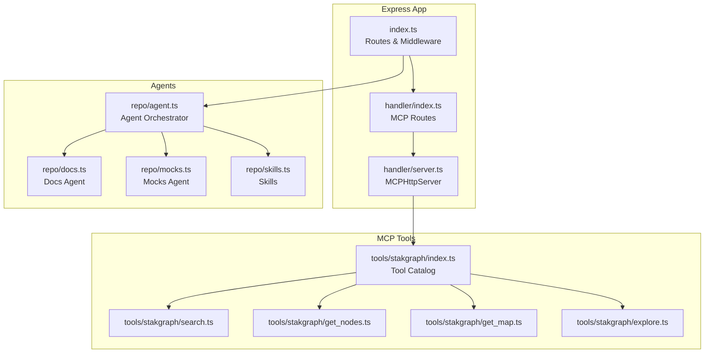
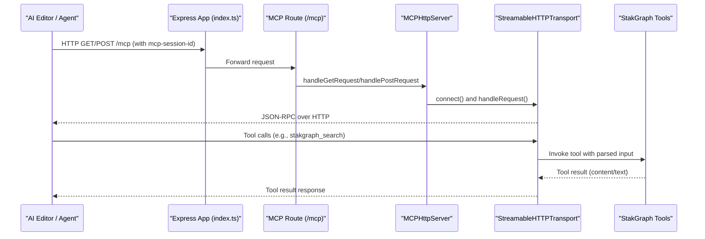
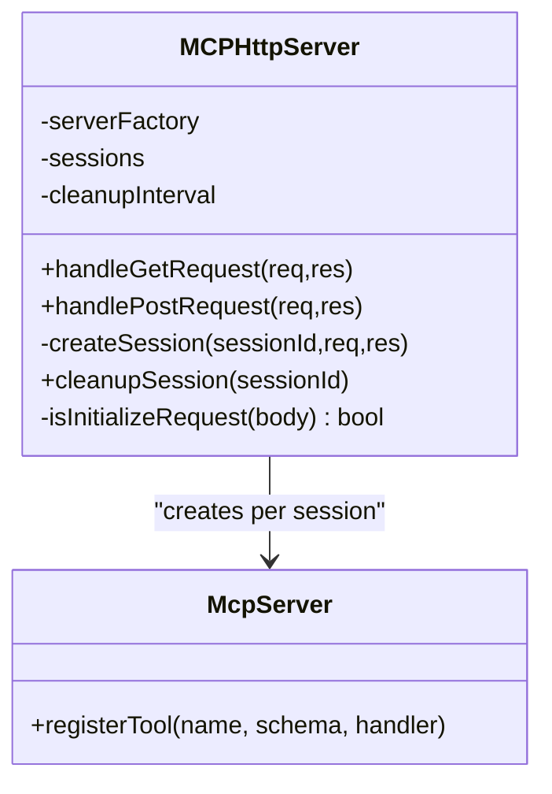
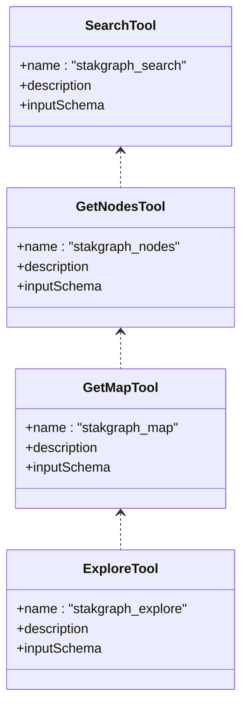
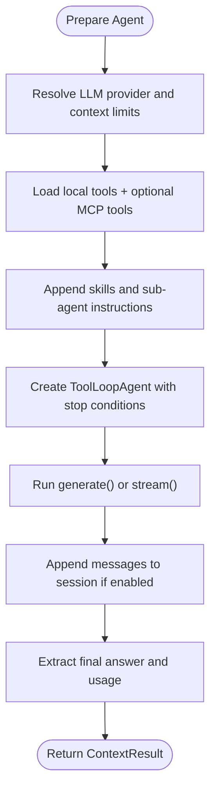
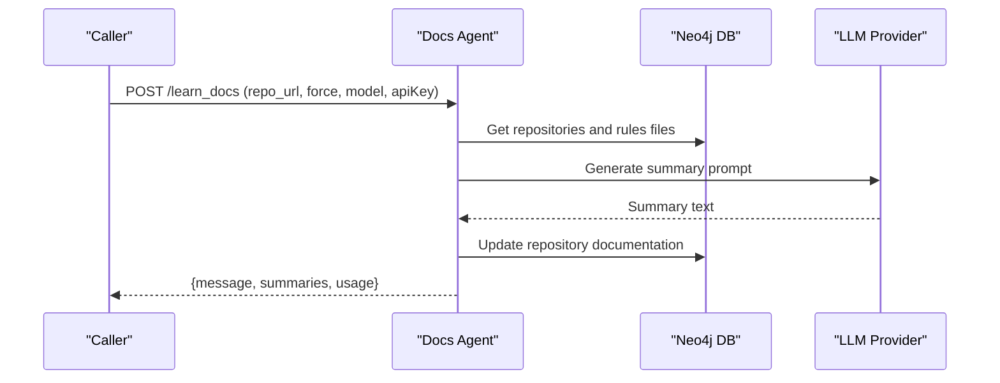
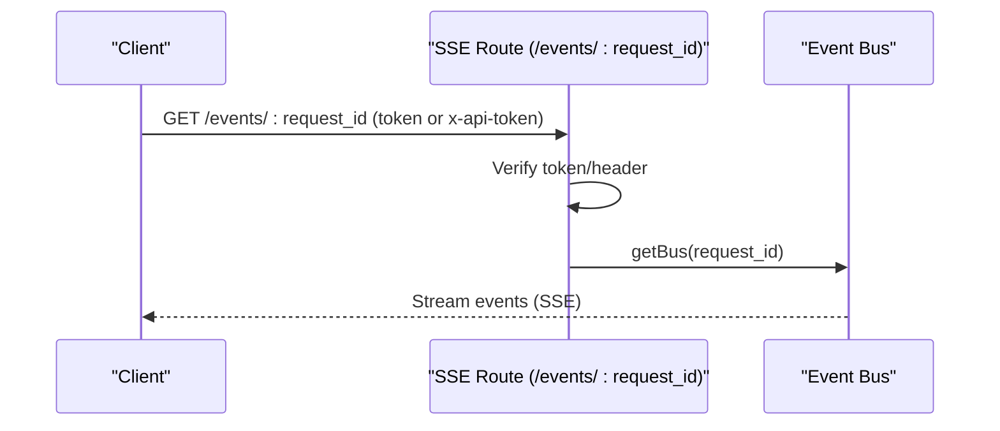
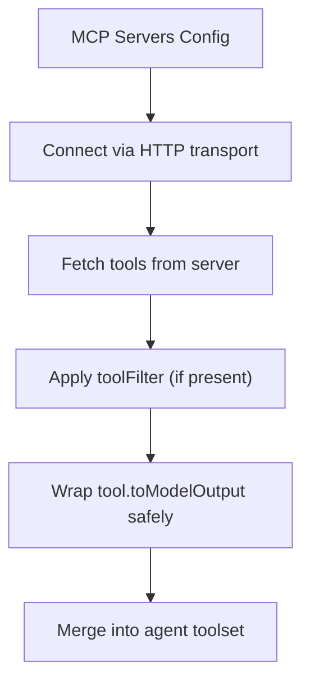
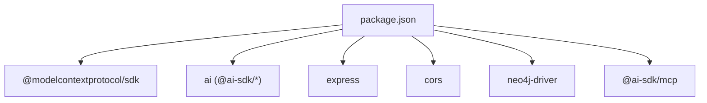

# MCP Server Architecture

<cite>
**Referenced Files in This Document**
- [index.ts](file://mcp/src/index.ts)
- [package.json](file://mcp/package.json)
- [handler/index.ts](file://mcp/src/handler/index.ts)
- [handler/server.ts](file://mcp/src/handler/server.ts)
- [repo/mcpServers.ts](file://mcp/src/repo/mcpServers.ts)
- [tools/stakgraph/index.ts](file://mcp/src/tools/stakgraph/index.ts)
- [tools/stakgraph/search.ts](file://mcp/src/tools/stakgraph/search.ts)
- [tools/stakgraph/get_nodes.ts](file://mcp/src/tools/stakgraph/get_nodes.ts)
- [tools/stakgraph/get_map.ts](file://mcp/src/tools/stakgraph/get_map.ts)
- [tools/stakgraph/explore.ts](file://mcp/src/tools/stakgraph/explore.ts)
- [repo/agent.ts](file://mcp/src/repo/agent.ts)
- [repo/agents.md](file://mcp/src/repo/agents.md)
- [repo/docs.ts](file://mcp/src/repo/docs.ts)
- [repo/mocks.ts](file://mcp/src/repo/mocks.ts)
- [repo/skills.ts](file://mcp/src/repo/skills.ts)
</cite>

## Table of Contents
1. [Introduction](#introduction)
2. [Project Structure](#project-structure)
3. [Core Components](#core-components)
4. [Architecture Overview](#architecture-overview)
5. [Detailed Component Analysis](#detailed-component-analysis)
6. [Dependency Analysis](#dependency-analysis)
7. [Performance Considerations](#performance-considerations)
8. [Troubleshooting Guide](#troubleshooting-guide)
9. [Conclusion](#conclusion)
10. [Appendices](#appendices)

## Introduction
This document describes the Model Context Protocol (MCP) server architecture powering StakGraph’s graph intelligence integration for AI agents. It explains how the TypeScript-based server integrates with the MCP SDK, exposes StakGraph tools, manages real-time communication via Server-Sent Events (SSE), and orchestrates AI agents that leverage built-in capabilities such as Explore, Describe, Docs, and Mocks. It also documents agent configuration, LLM provider integrations, and practical guidance for connecting AI editors like Cursor, Claude Code, and Windsurf to the MCP server.

## Project Structure
The MCP server is implemented in the mcp/src directory with modular components:
- Handler: MCP protocol transport and session management
- Tools: StakGraph tool catalog (search, nodes, map, explore, etc.)
- Repo: Agent orchestration, built-in agents (Docs, Mocks, Describe), and skills
- Root server: Express app wiring routes, SSE, and static assets

**Diagram sources**
- [index.ts:100-231](file://mcp/src/index.ts#L100-L231)
- [handler/index.ts:61-69](file://mcp/src/handler/index.ts#L61-L69)
- [handler/server.ts:15-164](file://mcp/src/handler/server.ts#L15-L164)
- [tools/stakgraph/index.ts:1-32](file://mcp/src/tools/stakgraph/index.ts#L1-L32)
- [repo/agent.ts:324-395](file://mcp/src/repo/agent.ts#L324-L395)
- [repo/docs.ts:6-119](file://mcp/src/repo/docs.ts#L6-L119)
- [repo/mocks.ts:40-143](file://mcp/src/repo/mocks.ts#L40-L143)
- [repo/skills.ts:1-53](file://mcp/src/repo/skills.ts#L1-L53)

**Section sources**
- [index.ts:100-231](file://mcp/src/index.ts#L100-L231)
- [package.json:1-102](file://mcp/package.json#L1-L102)

## Core Components
- Express server and routing: Central entry point that registers MCP routes, SSE endpoints, and graph-related endpoints. It also serves static assets for the web UI and Swagger documentation.
- MCP handler: Implements a Streamable HTTP transport and per-session server lifecycle management with initialization, reconnection, and cleanup.
- Tool catalog: Exposes StakGraph tools under the stakgraph_* namespace, including search, nodes retrieval, map generation, and exploration.
- Agent orchestrator: Provides a configurable ToolLoopAgent that merges local tools with external MCP tools, supports sessions, skills, sub-agents, and structured outputs.
- Built-in agents: Docs agent for repository documentation learning/updating, Mocks agent for discovering and syncing third-party service mocks.

**Section sources**
- [index.ts:100-231](file://mcp/src/index.ts#L100-L231)
- [handler/index.ts:7-57](file://mcp/src/handler/index.ts#L7-L57)
- [handler/server.ts:15-164](file://mcp/src/handler/server.ts#L15-L164)
- [tools/stakgraph/index.ts:21-31](file://mcp/src/tools/stakgraph/index.ts#L21-L31)
- [repo/agent.ts:128-162](file://mcp/src/repo/agent.ts#L128-L162)
- [repo/docs.ts:6-119](file://mcp/src/repo/docs.ts#L6-L119)
- [repo/mocks.ts:40-143](file://mcp/src/repo/mocks.ts#L40-L143)

## Architecture Overview
The MCP server exposes:
- An HTTP transport for MCP sessions with per-session lifecycle management
- A tool catalog backed by StakGraph graph operations
- Real-time event streaming via SSE for agent steps
- Agent endpoints for built-in tasks (Docs, Mocks, Describe)
- Integration with external MCP servers to dynamically load tools

**Diagram sources**
- [index.ts:100-102](file://mcp/src/index.ts#L100-L102)
- [handler/index.ts:61-69](file://mcp/src/handler/index.ts#L61-L69)
- [handler/server.ts:42-128](file://mcp/src/handler/server.ts#L42-L128)

## Detailed Component Analysis

### MCP Protocol Integration
- Transport and session management: The MCPHttpServer creates a new McpServer per session with a StreamableHTTPServerTransport. Sessions are tracked by ID, cleaned up after inactivity, and support reinitialization and reconnection.
- Initialization and request handling: Requests are validated for presence of mcp-session-id and whether they represent an initialize request. Non-initial requests without an active session return a 400 error.
- Error handling: Malformed requests and transport errors are handled with JSON-RPC error responses and session cleanup.

**Diagram sources**
- [handler/server.ts:15-164](file://mcp/src/handler/server.ts#L15-L164)
- [handler/index.ts:7-57](file://mcp/src/handler/index.ts#L7-L57)

**Section sources**
- [handler/server.ts:15-164](file://mcp/src/handler/server.ts#L15-L164)
- [handler/index.ts:61-69](file://mcp/src/handler/index.ts#L61-L69)

### Tool Catalog: StakGraph Tools
The StakGraph tool catalog exports a curated set of tools under the stakgraph_* namespace:
- stakgraph_search: Fulltext/vector/hybrid search across code snippets with filtering and token limits
- stakgraph_nodes: Retrieve nodes by type, language, and ref_ids
- stakgraph_map: Generate a visual map/tree of relationships from a specified node
- stakgraph_explore: High-level exploration of the codebase guided by a user prompt

Each tool defines an input schema and a handler that executes graph operations and returns content suitable for the MCP protocol.

**Diagram sources**
- [tools/stakgraph/index.ts:1-32](file://mcp/src/tools/stakgraph/index.ts#L1-L32)
- [tools/stakgraph/search.ts:48-77](file://mcp/src/tools/stakgraph/search.ts#L48-L77)
- [tools/stakgraph/get_nodes.ts:30-54](file://mcp/src/tools/stakgraph/get_nodes.ts#L30-L54)
- [tools/stakgraph/get_map.ts:55-74](file://mcp/src/tools/stakgraph/get_map.ts#L55-L74)
- [tools/stakgraph/explore.ts:13-31](file://mcp/src/tools/stakgraph/explore.ts#L13-L31)

**Section sources**
- [tools/stakgraph/index.ts:21-31](file://mcp/src/tools/stakgraph/index.ts#L21-L31)
- [tools/stakgraph/search.ts:7-46](file://mcp/src/tools/stakgraph/search.ts#L7-L46)
- [tools/stakgraph/get_nodes.ts:7-28](file://mcp/src/tools/stakgraph/get_nodes.ts#L7-L28)
- [tools/stakgraph/get_map.ts:19-53](file://mcp/src/tools/stakgraph/get_map.ts#L19-L53)
- [tools/stakgraph/explore.ts:6-17](file://mcp/src/tools/stakgraph/explore.ts#L6-L17)

### Agent Orchestration and Configuration
The agent orchestrator composes a ToolLoopAgent with:
- Local tools (from get_tools) and optional external MCP tools loaded via getMcpTools
- Optional skills and sub-agents
- Session persistence and truncation logic
- Structured final-answer formatting and streaming support

Key configuration options include model selection, API keys, tool filters, session IDs, and MCP server integration.

**Diagram sources**
- [repo/agent.ts:164-306](file://mcp/src/repo/agent.ts#L164-L306)
- [repo/agent.ts:324-395](file://mcp/src/repo/agent.ts#L324-L395)
- [repo/mcpServers.ts:66-125](file://mcp/src/repo/mcpServers.ts#L66-L125)

**Section sources**
- [repo/agent.ts:128-162](file://mcp/src/repo/agent.ts#L128-L162)
- [repo/agent.ts:164-306](file://mcp/src/repo/agent.ts#L164-L306)
- [repo/agent.ts:324-395](file://mcp/src/repo/agent.ts#L324-L395)
- [repo/mcpServers.ts:66-125](file://mcp/src/repo/mcpServers.ts#L66-L125)

### Built-in Agents: Docs and Mocks
- Docs agent: Summarizes repository rules/documentation files and stores a high-level documentation summary per repository. Supports filtering by repo URL and forcing updates.
- Mocks agent: Discovers third-party service integrations and determines if they have mock implementations. Supports initial discovery and incremental sync modes with delta computation.

**Diagram sources**
- [repo/docs.ts:6-119](file://mcp/src/repo/docs.ts#L6-L119)

**Section sources**
- [repo/agents.md:27-70](file://mcp/src/repo/agents.md#L27-L70)
- [repo/docs.ts:6-119](file://mcp/src/repo/docs.ts#L6-L119)
- [repo/mocks.ts:40-143](file://mcp/src/repo/mocks.ts#L40-L143)

### Real-time Communication Patterns (SSE)
The server exposes an SSE endpoint for agent step events:
- Endpoint: GET /events/:request_id with JWT token query param or x-api-token header
- Authentication: Validates JWT token scoped to request_id or API token header
- Streaming: Pipes events from an internal event bus to the client

**Diagram sources**
- [index.ts:59-96](file://mcp/src/index.ts#L59-L96)

**Section sources**
- [index.ts:59-96](file://mcp/src/index.ts#L59-L96)

### External MCP Servers Integration
The server can dynamically load tools from external MCP servers:
- getMcpTools connects to each server, lists tools, filters by toolFilter, and wraps outputs to ensure compatibility with the agent framework
- Tool names are prefixed with the server name to avoid collisions

**Diagram sources**
- [repo/mcpServers.ts:66-125](file://mcp/src/repo/mcpServers.ts#L66-L125)

**Section sources**
- [repo/mcpServers.ts:5-11](file://mcp/src/repo/mcpServers.ts#L5-L11)
- [repo/mcpServers.ts:66-125](file://mcp/src/repo/mcpServers.ts#L66-L125)

## Dependency Analysis
The server relies on the MCP SDK and ai SDK for protocol handling and agent orchestration. Dependencies include Express for HTTP, CORS for cross-origin support, and Neo4j driver for graph operations.

**Diagram sources**
- [package.json:42-76](file://mcp/package.json#L42-L76)

**Section sources**
- [package.json:42-76](file://mcp/package.json#L42-L76)

## Performance Considerations
- Context window management: The agent truncates old tool results to fit within model context limits during step preparation.
- Streaming: Use stream_context for long-running tasks to reduce latency and improve responsiveness.
- Caching: Graph endpoints support caching middleware to reduce repeated computation.
- Concurrency: Tools are executed synchronously; consider batching or async processing for heavy operations.

[No sources needed since this section provides general guidance]

## Troubleshooting Guide
Common issues and resolutions:
- Missing mcp-session-id: Ensure clients send the mcp-session-id header for MCP requests.
- Session not found: Initialize a new session with an initialize request before sending tool calls.
- Unauthorized SSE access: Provide a valid JWT token or x-api-token header for /events/:request_id.
- Tool output undefined: The server wraps tool outputs to prevent undefined/null crashes; check tool implementations and logs.

**Section sources**
- [handler/server.ts:42-113](file://mcp/src/handler/server.ts#L42-L113)
- [index.ts:59-96](file://mcp/src/index.ts#L59-L96)
- [repo/mcpServers.ts:13-64](file://mcp/src/repo/mcpServers.ts#L13-L64)

## Conclusion
The StakGraph MCP server provides a robust, extensible foundation for integrating graph intelligence into AI agents. It implements the MCP protocol with per-session transport management, exposes a rich tool catalog, supports real-time streaming, and orchestrates built-in agents for documentation and mocking. With flexible configuration for LLM providers and external MCP servers, it enables seamless integration with modern AI editors and development workflows.

[No sources needed since this section summarizes without analyzing specific files]

## Appendices

### Practical Examples: Connecting AI Editors
- Cursor: Configure the MCP server URL and authentication (token or headers) in Cursor’s MCP settings. Use the stakgraph_* tools for code search, node retrieval, and exploration.
- Claude Code: Set up an MCP session with the server URL and ensure the mcp-session-id header is included in requests. Utilize the tool catalog for graph-based insights.
- Windsurf: Point the editor to the MCP endpoint and include the required headers. Leverage SSE at /events/:request_id for live agent feedback.

[No sources needed since this section provides general guidance]