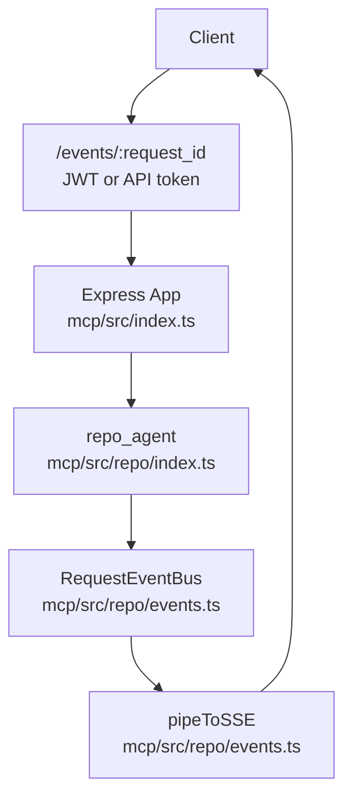
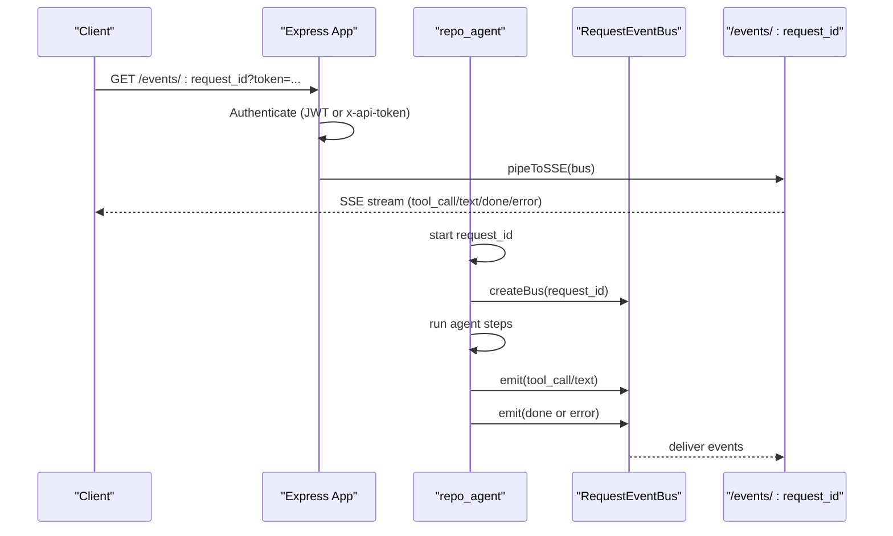
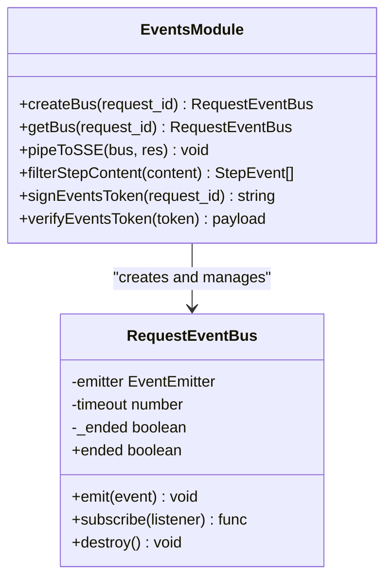
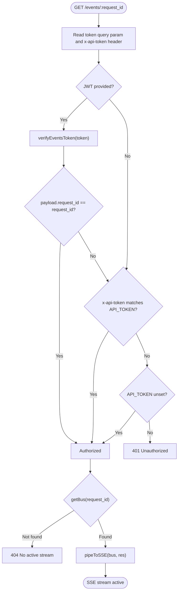
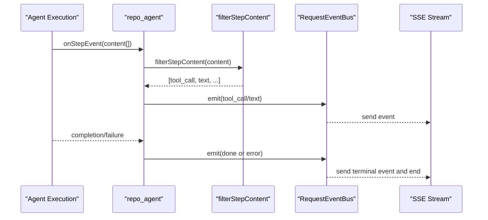
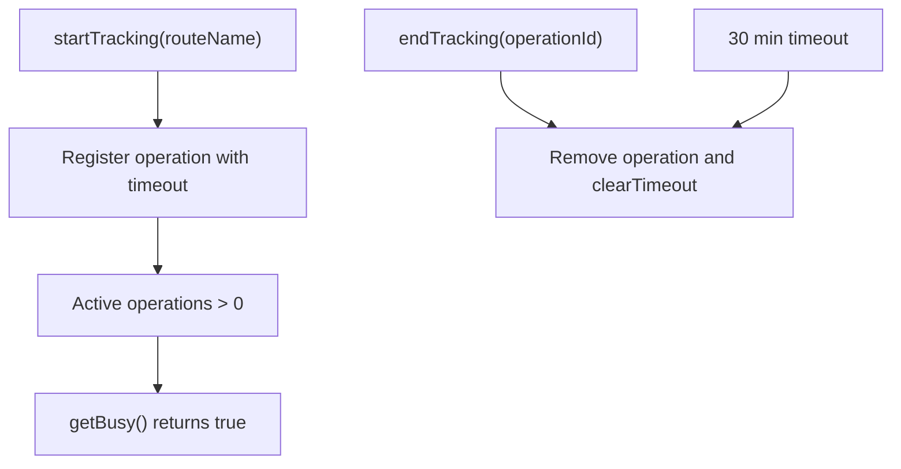
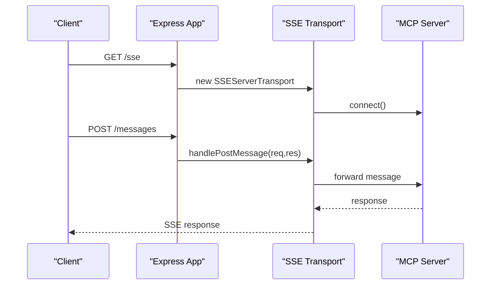
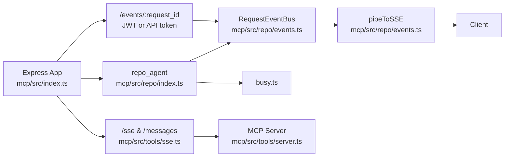

# Real-time Communication

<cite>
**Referenced Files in This Document**
- [index.ts](file://mcp/src/index.ts)
- [events.ts](file://mcp/src/repo/events.ts)
- [repo/index.ts](file://mcp/src/repo/index.ts)
- [busy.ts](file://mcp/src/busy.ts)
- [session.ts](file://mcp/src/repo/session.ts)
- [sse.ts](file://mcp/src/tools/sse.ts)
- [server.ts](file://mcp/src/tools/server.ts)
- [mcpServers.ts](file://mcp/src/repo/mcpServers.ts)
</cite>

## Table of Contents
1. [Introduction](#introduction)
2. [Project Structure](#project-structure)
3. [Core Components](#core-components)
4. [Architecture Overview](#architecture-overview)
5. [Detailed Component Analysis](#detailed-component-analysis)
6. [Dependency Analysis](#dependency-analysis)
7. [Performance Considerations](#performance-considerations)
8. [Troubleshooting Guide](#troubleshooting-guide)
9. [Conclusion](#conclusion)

## Introduction
This document explains the real-time communication infrastructure of the MCP server with a focus on:
- Server-Sent Events (SSE) for streaming agent step updates
- JWT token-based authentication scoped to a request_id
- Request-scoped event buses that manage per-request event lifecycles
- Message routing and delivery to clients
- Practical examples for connecting to event streams, handling authentication tokens, and implementing custom event listeners
- Busy state management, logging integration, and performance considerations

## Project Structure
The real-time communication stack spans several modules:
- Event bus and SSE plumbing in the repository module
- HTTP endpoints and middleware in the main server
- Busy state tracking and logging integration
- Optional MCP SSE transport for broader protocol streaming

**Diagram sources**
- [index.ts:59-96](file://mcp/src/index.ts#L59-L96)
- [repo/index.ts:177-253](file://mcp/src/repo/index.ts#L177-L253)
- [events.ts:56-144](file://mcp/src/repo/events.ts#L56-L144)

**Section sources**
- [index.ts:51-96](file://mcp/src/index.ts#L51-L96)
- [repo/index.ts:177-253](file://mcp/src/repo/index.ts#L177-L253)
- [events.ts:56-144](file://mcp/src/repo/events.ts#L56-L144)

## Core Components
- Request-scoped event bus: A per-request event publisher/subscriber with auto-cleanup and end detection
- SSE endpoint: An authenticated endpoint that streams events to clients using Server-Sent Events
- Authentication: Two-tier auth for /events/:request_id using a short-lived JWT scoped to request_id or a shared API token header
- Agent step routing: The agent pipeline emits step content that is filtered and forwarded to the event bus for SSE delivery
- Busy state and logging: Global busy tracking and console timestamping for observability

**Section sources**
- [events.ts:38-91](file://mcp/src/repo/events.ts#L38-L91)
- [events.ts:118-144](file://mcp/src/repo/events.ts#L118-L144)
- [index.ts:59-96](file://mcp/src/index.ts#L59-L96)
- [repo/index.ts:211-244](file://mcp/src/repo/index.ts#L211-L244)
- [busy.ts:30-77](file://mcp/src/busy.ts#L30-L77)

## Architecture Overview
The real-time flow integrates agent execution, event emission, and SSE delivery:

**Diagram sources**
- [index.ts:59-96](file://mcp/src/index.ts#L59-L96)
- [repo/index.ts:177-253](file://mcp/src/repo/index.ts#L177-L253)
- [events.ts:56-144](file://mcp/src/repo/events.ts#L56-L144)

## Detailed Component Analysis

### Request-Scoped Event Bus
The event bus encapsulates per-request event publishing and subscription with automatic cleanup:
- Emits typed step events: tool_call, text, done, error
- Ends the stream upon receiving done or error and schedules cleanup
- Auto-destructs after TTL even without subscribers
- Provides subscribe/unsubscribe semantics

**Diagram sources**
- [events.ts:56-110](file://mcp/src/repo/events.ts#L56-L110)
- [events.ts:118-144](file://mcp/src/repo/events.ts#L118-L144)

**Section sources**
- [events.ts:38-91](file://mcp/src/repo/events.ts#L38-L91)
- [events.ts:96-110](file://mcp/src/repo/events.ts#L96-L110)

### SSE Endpoint and Authentication
The /events/:request_id endpoint enforces authentication and streams events:
- Accepts either:
  - A JWT query parameter token scoped to the request_id
  - Or a shared API token via x-api-token header
- If API_TOKEN is unset, allows unauthenticated access (development mode)
- Returns 404 if no active bus exists for the request_id
- Pipes the bus to an SSE response with proper headers and cleanup on client disconnect

**Diagram sources**
- [index.ts:59-96](file://mcp/src/index.ts#L59-L96)
- [events.ts:32-34](file://mcp/src/repo/events.ts#L32-L34)
- [events.ts:118-144](file://mcp/src/repo/events.ts#L118-L144)

**Section sources**
- [index.ts:59-96](file://mcp/src/index.ts#L59-L96)
- [events.ts:21-34](file://mcp/src/repo/events.ts#L21-L34)

### Agent Step Notifications and Filtering
The agent pipeline emits step content during execution. The repository module filters and forwards relevant items to the event bus:
- filterStepContent extracts tool-call and text events
- onStepEvent callback emits tool_call and text events
- Final done or error events are emitted after completion or failure

**Diagram sources**
- [repo/index.ts:211-244](file://mcp/src/repo/index.ts#L211-L244)
- [events.ts:152-173](file://mcp/src/repo/events.ts#L152-L173)

**Section sources**
- [repo/index.ts:211-244](file://mcp/src/repo/index.ts#L211-L244)
- [events.ts:152-173](file://mcp/src/repo/events.ts#L152-L173)

### Busy State Management and Logging
- Busy tracking records active operations with timeouts and cleans them up automatically
- Console is patched to include ISO timestamps for all logs
- The busy endpoint exposes current busy state

**Diagram sources**
- [busy.ts:30-77](file://mcp/src/busy.ts#L30-L77)

**Section sources**
- [busy.ts:30-77](file://mcp/src/busy.ts#L30-L77)
- [index.ts:1-14](file://mcp/src/index.ts#L1-L14)
- [index.ts:130-132](file://mcp/src/index.ts#L130-L132)

### Optional MCP SSE Transport
Beyond request-scoped event streams, the server supports a general-purpose MCP SSE transport for protocol-level messaging:
- /sse establishes an SSE transport
- /messages handles POST messages over the transport
- Tools listing and invocation are exposed via MCP routes

**Diagram sources**
- [sse.ts:8-59](file://mcp/src/tools/sse.ts#L8-L59)
- [server.ts:29-95](file://mcp/src/tools/server.ts#L29-L95)

**Section sources**
- [sse.ts:8-59](file://mcp/src/tools/sse.ts#L8-L59)
- [server.ts:29-95](file://mcp/src/tools/server.ts#L29-L95)

## Dependency Analysis
The real-time communication relies on:
- Express for routing and middleware
- jsonwebtoken for JWT signing/verification
- EventEmitter for pub/sub
- MCP SDK for optional protocol streaming

**Diagram sources**
- [index.ts:59-96](file://mcp/src/index.ts#L59-L96)
- [repo/index.ts:177-253](file://mcp/src/repo/index.ts#L177-L253)
- [events.ts:56-144](file://mcp/src/repo/events.ts#L56-L144)
- [busy.ts:30-77](file://mcp/src/busy.ts#L30-L77)
- [sse.ts:8-59](file://mcp/src/tools/sse.ts#L8-L59)
- [server.ts:29-95](file://mcp/src/tools/server.ts#L29-L95)

**Section sources**
- [index.ts:16-40](file://mcp/src/index.ts#L16-L40)
- [events.ts:1-4](file://mcp/src/repo/events.ts#L1-L4)
- [repo/index.ts:16](file://mcp/src/repo/index.ts#L16)

## Performance Considerations
- Event filtering: filterStepContent excludes large tool-result payloads to keep SSE bandwidth low
- Auto-cleanup: RequestEventBus timers and TTL prevent memory leaks for inactive streams
- Nginx buffering: X-Accel-Buffering header disables proxy buffering for real-time delivery
- Payload limits: Express JSON limit is increased to support larger payloads
- Busy tracking: Prevents runaway operations and ensures cleanup after 30 minutes
- Session pruning: Expired session files are pruned periodically to maintain disk hygiene

**Section sources**
- [events.ts:152-173](file://mcp/src/repo/events.ts#L152-L173)
- [events.ts:118-124](file://mcp/src/repo/events.ts#L118-L124)
- [index.ts:98](file://mcp/src/index.ts#L98)
- [busy.ts:10](file://mcp/src/busy.ts#L10)
- [session.ts:102-127](file://mcp/src/repo/session.ts#L102-L127)

## Troubleshooting Guide
- 401 Unauthorized on /events/:request_id
  - Ensure a valid JWT token is provided and matches the request_id
  - Alternatively, set x-api-token to match API_TOKEN
  - If API_TOKEN is unset, access is allowed in development mode
- 404 Not Found for /events/:request_id
  - The request_id may be incorrect or the bus has been cleaned up
  - Confirm the request_id corresponds to an active agent job
- SSE stream closes unexpectedly
  - Done or error events terminate the stream by design
  - Check client-side connection handling and reconnection logic
- Excessive memory usage
  - Verify that RequestEventBus instances are ending and being garbage collected
  - Confirm busy operations are completing and cleaned up
- Large tool results causing bandwidth issues
  - filterStepContent intentionally excludes tool-result payloads
  - Retrieve full results via dedicated endpoints or tools

**Section sources**
- [index.ts:84-96](file://mcp/src/index.ts#L84-L96)
- [events.ts:87-91](file://mcp/src/repo/events.ts#L87-L91)
- [events.ts:74-78](file://mcp/src/repo/events.ts#L74-L78)
- [events.ts:152-173](file://mcp/src/repo/events.ts#L152-L173)
- [busy.ts:30-54](file://mcp/src/busy.ts#L30-L54)

## Conclusion
The MCP server’s real-time communication infrastructure combines a request-scoped event bus, JWT-authenticated SSE streaming, and robust lifecycle management. It delivers agent step updates efficiently while maintaining performance and observability. Optional MCP SSE transport extends the system to broader protocol-level streaming. By following the authentication and connection patterns described here, developers can integrate real-time updates into clients and build custom event listeners tailored to their needs.