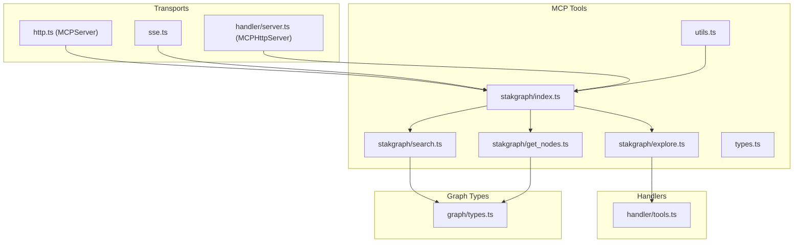
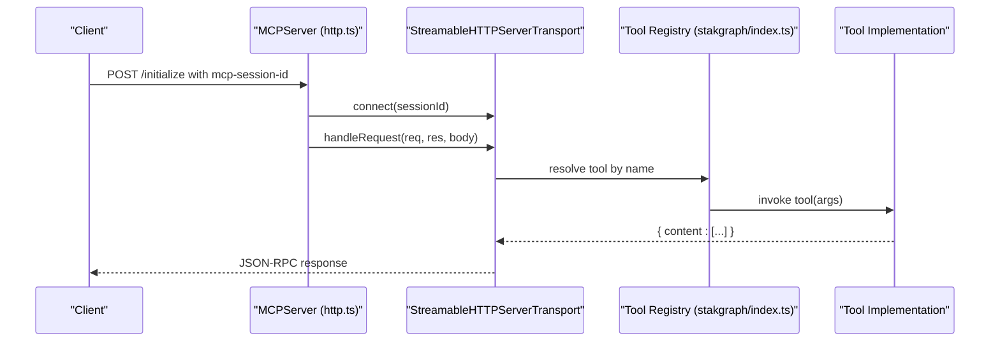
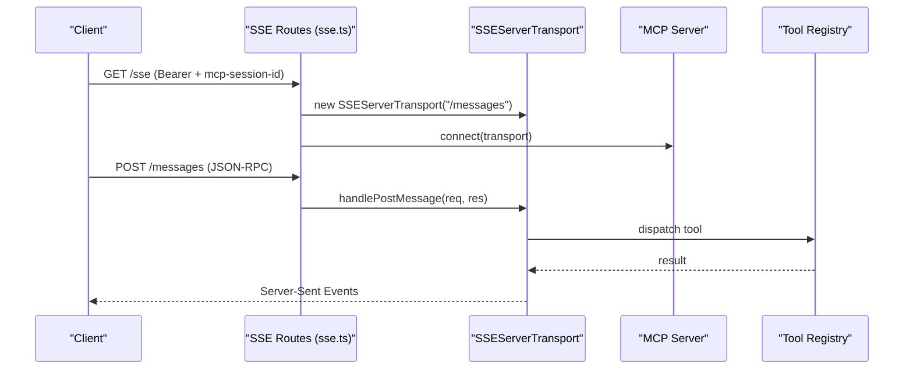
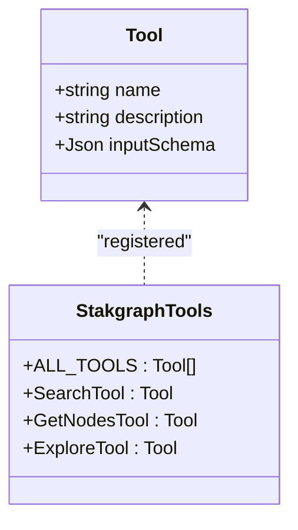
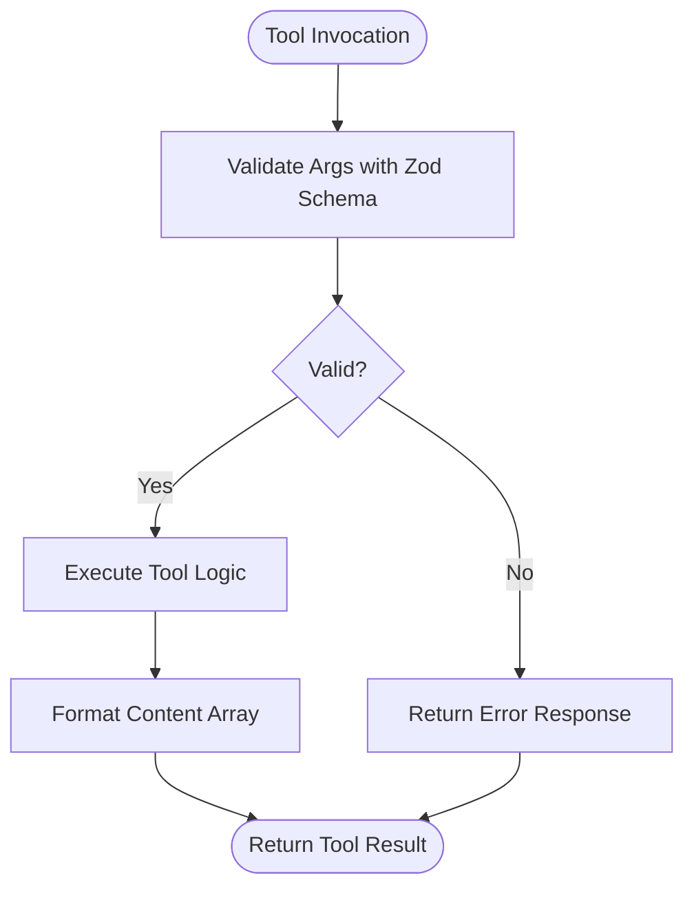
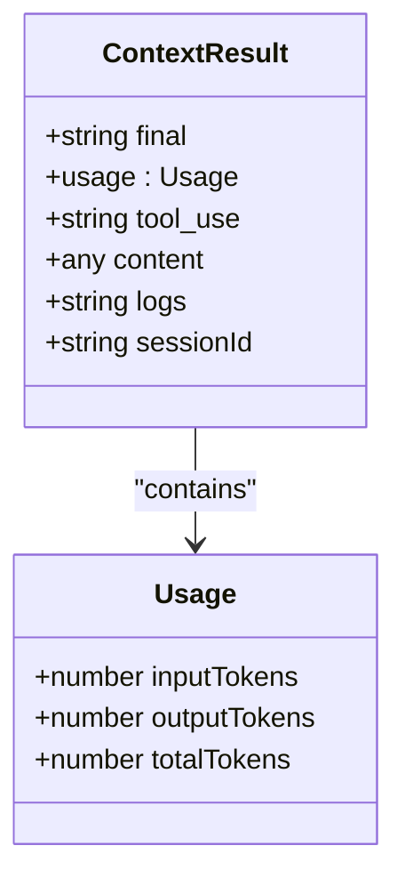
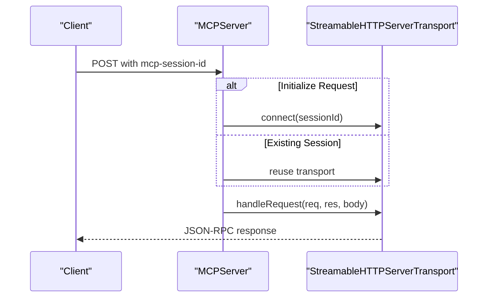
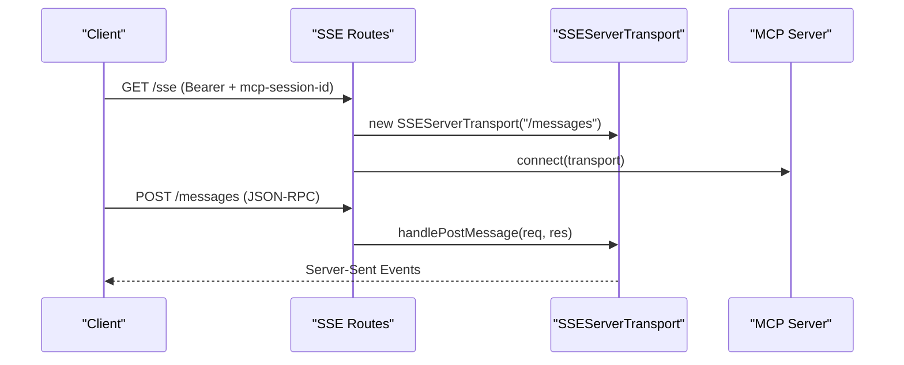
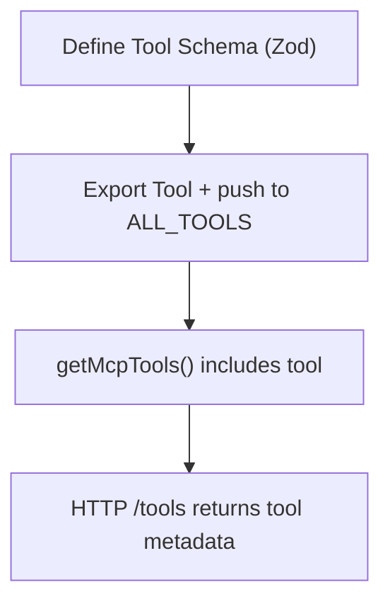
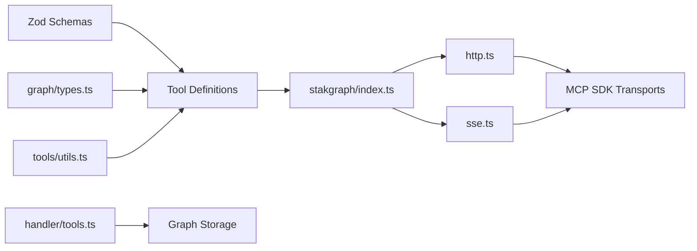

# Tool Implementation System

<cite>
**Referenced Files in This Document**
- [mcp/src/tools/types.ts](file://mcp/src/tools/types.ts)
- [mcp/src/tools/stakgraph/index.ts](file://mcp/src/tools/stakgraph/index.ts)
- [mcp/src/tools/stakgraph/search.ts](file://mcp/src/tools/stakgraph/search.ts)
- [mcp/src/tools/stakgraph/get_nodes.ts](file://mcp/src/tools/stakgraph/get_nodes.ts)
- [mcp/src/tools/stakgraph/explore.ts](file://mcp/src/tools/stakgraph/explore.ts)
- [mcp/src/tools/http.ts](file://mcp/src/tools/http.ts)
- [mcp/src/tools/sse.ts](file://mcp/src/tools/sse.ts)
- [mcp/src/tools/utils.ts](file://mcp/src/tools/utils.ts)
- [mcp/src/handler/server.ts](file://mcp/src/handler/server.ts)
- [mcp/src/handler/tools.ts](file://mcp/src/handler/tools.ts)
- [mcp/src/graph/types.ts](file://mcp/src/graph/types.ts)
</cite>

## Table of Contents
1. [Introduction](#introduction)
2. [Project Structure](#project-structure)
3. [Core Components](#core-components)
4. [Architecture Overview](#architecture-overview)
5. [Detailed Component Analysis](#detailed-component-analysis)
6. [Dependency Analysis](#dependency-analysis)
7. [Performance Considerations](#performance-considerations)
8. [Troubleshooting Guide](#troubleshooting-guide)
9. [Conclusion](#conclusion)

## Introduction
This document describes the Model Context Protocol (MCP) tool implementation system used by the Stakgraph project. It focuses on the tool catalog, registration mechanisms, execution patterns, parameter validation, response formatting, server-side transport implementations, and HTTP/SSE integration. It also documents the tool types system and how to register and integrate new tools.

## Project Structure
The MCP tool system is primarily implemented under the mcp/src directory with the following relevant areas:
- Tools catalog and registration: mcp/src/tools/stakgraph/index.ts
- Individual tool definitions and schemas: mcp/src/tools/stakgraph/*.ts
- Tool types and result contracts: mcp/src/tools/types.ts
- HTTP transport and session management: mcp/src/tools/http.ts
- SSE transport and routes: mcp/src/tools/sse.ts
- Utility functions for tool discovery and middleware: mcp/src/tools/utils.ts
- Handler utilities for logging and concept retrieval: mcp/src/handler/tools.ts
- Graph types and node taxonomy: mcp/src/graph/types.ts

**Diagram sources**
- [mcp/src/tools/stakgraph/index.ts:1-32](file://mcp/src/tools/stakgraph/index.ts#L1-L32)
- [mcp/src/tools/stakgraph/search.ts:1-77](file://mcp/src/tools/stakgraph/search.ts#L1-L77)
- [mcp/src/tools/stakgraph/get_nodes.ts:1-54](file://mcp/src/tools/stakgraph/get_nodes.ts#L1-L54)
- [mcp/src/tools/stakgraph/explore.ts:1-31](file://mcp/src/tools/stakgraph/explore.ts#L1-L31)
- [mcp/src/tools/types.ts:1-21](file://mcp/src/tools/types.ts#L1-L21)
- [mcp/src/tools/utils.ts:1-48](file://mcp/src/tools/utils.ts#L1-L48)
- [mcp/src/tools/http.ts:1-158](file://mcp/src/tools/http.ts#L1-L158)
- [mcp/src/tools/sse.ts:1-75](file://mcp/src/tools/sse.ts#L1-L75)
- [mcp/src/handler/server.ts:1-164](file://mcp/src/handler/server.ts#L1-L164)
- [mcp/src/handler/tools.ts:1-104](file://mcp/src/handler/tools.ts#L1-L104)
- [mcp/src/graph/types.ts:1-429](file://mcp/src/graph/types.ts#L1-L429)

**Section sources**
- [mcp/src/tools/stakgraph/index.ts:1-32](file://mcp/src/tools/stakgraph/index.ts#L1-L32)
- [mcp/src/tools/types.ts:1-21](file://mcp/src/tools/types.ts#L1-L21)
- [mcp/src/tools/http.ts:1-158](file://mcp/src/tools/http.ts#L1-L158)
- [mcp/src/tools/sse.ts:1-75](file://mcp/src/tools/sse.ts#L1-L75)
- [mcp/src/tools/utils.ts:1-48](file://mcp/src/tools/utils.ts#L1-L48)
- [mcp/src/handler/server.ts:1-164](file://mcp/src/handler/server.ts#L1-L164)
- [mcp/src/handler/tools.ts:1-104](file://mcp/src/handler/tools.ts#L1-L104)
- [mcp/src/graph/types.ts:1-429](file://mcp/src/graph/types.ts#L1-L429)

## Core Components
- Tool types and result contract:
  - Tool interface defines name, description, and inputSchema.
  - ContextResult defines standardized response shape including content, usage metrics, and optional metadata.
- Tool catalog:
  - Centralized export and registry via stakgraph/index.ts, exposing ALL_TOOLS and named exports for each tool.
- HTTP transport:
  - MCPServer manages session-based HTTP transport with mcp-session-id header support, initialize request detection, and transport lifecycle.
- SSE transport:
  - SSEServerTransport integration exposes /sse and /messages endpoints with bearer token and session middleware.
- Handler utilities:
  - listConcepts, learnConcept, and searchLogsHandler demonstrate standardized tool-like handlers returning content arrays with optional isError flags.

**Section sources**
- [mcp/src/tools/types.ts:1-21](file://mcp/src/tools/types.ts#L1-L21)
- [mcp/src/tools/stakgraph/index.ts:1-32](file://mcp/src/tools/stakgraph/index.ts#L1-L32)
- [mcp/src/tools/http.ts:1-158](file://mcp/src/tools/http.ts#L1-L158)
- [mcp/src/tools/sse.ts:1-75](file://mcp/src/tools/sse.ts#L1-L75)
- [mcp/src/handler/tools.ts:1-104](file://mcp/src/handler/tools.ts#L1-L104)

## Architecture Overview
The MCP tool system supports two primary transport modes:
- Streamable HTTP transport: session-scoped, initialize-first, and reuse-capable.
- SSE transport: long-lived event stream with explicit message handling.

**Diagram sources**
- [mcp/src/tools/http.ts:1-158](file://mcp/src/tools/http.ts#L1-L158)
- [mcp/src/tools/stakgraph/index.ts:1-32](file://mcp/src/tools/stakgraph/index.ts#L1-L32)

**Diagram sources**
- [mcp/src/tools/sse.ts:1-75](file://mcp/src/tools/sse.ts#L1-L75)
- [mcp/src/tools/stakgraph/index.ts:1-32](file://mcp/src/tools/stakgraph/index.ts#L1-L32)

## Detailed Component Analysis

### Tool Catalog and Registration
- Tool registration:
  - Tools are exported from stakgraph/index.ts and aggregated into ALL_TOOLS for centralized discovery.
  - getMcpTools() merges core Stakgraph tools with optional Stagehand tools based on environment flag.
- Tool discovery:
  - HTTP route /tools returns a list of tools with name, description, and input_schema derived from Tool definitions.

**Diagram sources**
- [mcp/src/tools/types.ts:3-7](file://mcp/src/tools/types.ts#L3-L7)
- [mcp/src/tools/stakgraph/index.ts:21-31](file://mcp/src/tools/stakgraph/index.ts#L21-L31)

**Section sources**
- [mcp/src/tools/stakgraph/index.ts:1-32](file://mcp/src/tools/stakgraph/index.ts#L1-L32)
- [mcp/src/tools/utils.ts:10-16](file://mcp/src/tools/utils.ts#L10-L16)
- [mcp/src/tools/sse.ts:48-58](file://mcp/src/tools/sse.ts#L48-L58)

### Tool Execution Patterns and Parameter Validation
- Validation:
  - Zod schemas define strict input validation for each tool (e.g., SearchSchema, GetNodesSchema, ExploreSchema).
  - parseSchema converts Zod schemas to JSON schema for tool catalogs and clients.
- Execution:
  - Tools return content arrays with type "text" and JSON-encoded payloads.
  - Some tools (e.g., ExploreTool) include usage metrics in the response.

**Diagram sources**
- [mcp/src/tools/stakgraph/search.ts:7-46](file://mcp/src/tools/stakgraph/search.ts#L7-L46)
- [mcp/src/tools/stakgraph/get_nodes.ts:7-28](file://mcp/src/tools/stakgraph/get_nodes.ts#L7-L28)
- [mcp/src/tools/stakgraph/explore.ts:6-11](file://mcp/src/tools/stakgraph/explore.ts#L6-L11)
- [mcp/src/tools/utils.ts:43-47](file://mcp/src/tools/utils.ts#L43-L47)

**Section sources**
- [mcp/src/tools/stakgraph/search.ts:1-77](file://mcp/src/tools/stakgraph/search.ts#L1-L77)
- [mcp/src/tools/stakgraph/get_nodes.ts:1-54](file://mcp/src/tools/stakgraph/get_nodes.ts#L1-L54)
- [mcp/src/tools/stakgraph/explore.ts:1-31](file://mcp/src/tools/stakgraph/explore.ts#L1-L31)
- [mcp/src/tools/utils.ts:43-47](file://mcp/src/tools/utils.ts#L43-L47)

### Server-Side Tool Implementation and Response Formatting
- Standardized response:
  - Tools return content arrays with entries of type "text".
  - Handlers (listConcepts, learnConcept, searchLogsHandler) demonstrate consistent content/text formatting and optional isError flags.
- Token usage and context:
  - ExploreTool integrates with context result types that include usage metrics and optional tool_use/sessionId fields.

**Diagram sources**
- [mcp/src/tools/types.ts:9-20](file://mcp/src/tools/types.ts#L9-L20)

**Section sources**
- [mcp/src/handler/tools.ts:1-104](file://mcp/src/handler/tools.ts#L1-L104)
- [mcp/src/tools/types.ts:1-21](file://mcp/src/tools/types.ts#L1-L21)
- [mcp/src/tools/stakgraph/explore.ts:19-30](file://mcp/src/tools/stakgraph/explore.ts#L19-L30)

### HTTP Tool Integration and Session Management
- Session handling:
  - MCPServer supports GET/POST routes with mcp-session-id header.
  - Initialize requests trigger transport creation; subsequent requests reuse existing sessions.
  - Cleanup handles stale sessions and transport closure.
- Error handling:
  - Dedicated error response builder returns JSON-RPC error objects with consistent structure.

**Diagram sources**
- [mcp/src/tools/http.ts:23-94](file://mcp/src/tools/http.ts#L23-L94)

**Section sources**
- [mcp/src/tools/http.ts:1-158](file://mcp/src/tools/http.ts#L1-L158)

### SSE (Server-Sent Events) Communication Patterns
- Route setup:
  - GET /sse establishes SSE transport and connects the MCP server.
  - POST /messages forwards JSON-RPC messages to the active transport.
- Middleware:
  - bearerToken enforces Authorization: Bearer token when configured.
  - mcpSession extracts mcp-session-id and attaches to request.

**Diagram sources**
- [mcp/src/tools/sse.ts:8-46](file://mcp/src/tools/sse.ts#L8-L46)

**Section sources**
- [mcp/src/tools/sse.ts:1-75](file://mcp/src/tools/sse.ts#L1-L75)
- [mcp/src/tools/utils.ts:22-41](file://mcp/src/tools/utils.ts#L22-L41)

### Tool Types System and Registration of New Tools
- Tool types:
  - Tool interface and ContextResult define the contract for tool implementations and results.
- Registration:
  - Add new tool to stakgraph/index.ts exports and push to ALL_TOOLS.
  - Expose tool name/description/inputSchema via Zod schema and parseSchema.
- Discovery:
  - getMcpTools() aggregates tools; /tools endpoint surfaces tool metadata for clients.

**Diagram sources**
- [mcp/src/tools/stakgraph/index.ts:1-32](file://mcp/src/tools/stakgraph/index.ts#L1-L32)
- [mcp/src/tools/utils.ts:10-16](file://mcp/src/tools/utils.ts#L10-L16)
- [mcp/src/tools/sse.ts:48-58](file://mcp/src/tools/sse.ts#L48-L58)

**Section sources**
- [mcp/src/tools/types.ts:1-21](file://mcp/src/tools/types.ts#L1-L21)
- [mcp/src/tools/stakgraph/index.ts:1-32](file://mcp/src/tools/stakgraph/index.ts#L1-L32)
- [mcp/src/tools/utils.ts:1-48](file://mcp/src/tools/utils.ts#L1-L48)
- [mcp/src/tools/sse.ts:48-58](file://mcp/src/tools/sse.ts#L48-L58)

## Dependency Analysis
- Tool catalog depends on:
  - Zod schemas for validation.
  - Graph types for node filtering and taxonomy.
  - Utility functions for schema parsing and tool discovery.
- Transports depend on:
  - MCP SDK transports (StreamableHTTPServerTransport, SSEServerTransport).
  - Express for routing and middleware.
- Handlers depend on:
  - Graph storage and formatting utilities for concept retrieval and logging search.

**Diagram sources**
- [mcp/src/tools/stakgraph/search.ts:1-77](file://mcp/src/tools/stakgraph/search.ts#L1-L77)
- [mcp/src/tools/stakgraph/get_nodes.ts:1-54](file://mcp/src/tools/stakgraph/get_nodes.ts#L1-L54)
- [mcp/src/tools/stakgraph/explore.ts:1-31](file://mcp/src/tools/stakgraph/explore.ts#L1-L31)
- [mcp/src/graph/types.ts:1-429](file://mcp/src/graph/types.ts#L1-L429)
- [mcp/src/tools/utils.ts:1-48](file://mcp/src/tools/utils.ts#L1-L48)
- [mcp/src/tools/stakgraph/index.ts:1-32](file://mcp/src/tools/stakgraph/index.ts#L1-L32)
- [mcp/src/tools/http.ts:1-158](file://mcp/src/tools/http.ts#L1-L158)
- [mcp/src/tools/sse.ts:1-75](file://mcp/src/tools/sse.ts#L1-L75)
- [mcp/src/handler/tools.ts:1-104](file://mcp/src/handler/tools.ts#L1-L104)

**Section sources**
- [mcp/src/tools/stakgraph/search.ts:1-77](file://mcp/src/tools/stakgraph/search.ts#L1-L77)
- [mcp/src/tools/stakgraph/get_nodes.ts:1-54](file://mcp/src/tools/stakgraph/get_nodes.ts#L1-L54)
- [mcp/src/tools/stakgraph/explore.ts:1-31](file://mcp/src/tools/stakgraph/explore.ts#L1-L31)
- [mcp/src/tools/stakgraph/index.ts:1-32](file://mcp/src/tools/stakgraph/index.ts#L1-L32)
- [mcp/src/tools/http.ts:1-158](file://mcp/src/tools/http.ts#L1-L158)
- [mcp/src/tools/sse.ts:1-75](file://mcp/src/tools/sse.ts#L1-L75)
- [mcp/src/handler/tools.ts:1-104](file://mcp/src/handler/tools.ts#L1-L104)
- [mcp/src/graph/types.ts:1-429](file://mcp/src/graph/types.ts#L1-L429)

## Performance Considerations
- Token limits and result sizing:
  - Tools expose max_tokens and limit parameters to constrain payload sizes and reduce latency.
- Streaming and batching:
  - Streamable HTTP transport supports long-running operations; consider chunked responses for large outputs.
- Caching and reuse:
  - Reusing sessions (mcp-session-id) avoids repeated initialization overhead.
- Filtering:
  - Use node_types and language filters to narrow result sets and improve relevance.

[No sources needed since this section provides general guidance]

## Troubleshooting Guide
- Session errors:
  - Missing or invalid mcp-session-id leads to Bad Request responses; ensure clients send the header and reuse the same ID for reconnects.
- Initialization issues:
  - Non-initialize requests without an active session return errors; clients must initialize first or reuse an existing session.
- SSE connectivity:
  - /sse requires Bearer token when configured; verify Authorization header and session middleware.
- Tool validation failures:
  - Zod schema mismatches produce validation errors; confirm input_schema alignment with client expectations.
- Logging and diagnostics:
  - searchLogsHandler wraps errors and returns structured messages; check logs for detailed error strings.

**Section sources**
- [mcp/src/tools/http.ts:23-48](file://mcp/src/tools/http.ts#L23-L48)
- [mcp/src/tools/http.ts:74-83](file://mcp/src/tools/http.ts#L74-L83)
- [mcp/src/tools/http.ts:117-126](file://mcp/src/tools/http.ts#L117-L126)
- [mcp/src/tools/sse.ts:11-27](file://mcp/src/tools/sse.ts#L11-L27)
- [mcp/src/tools/sse.ts:30-46](file://mcp/src/tools/sse.ts#L30-L46)
- [mcp/src/handler/tools.ts:72-103](file://mcp/src/handler/tools.ts#L72-L103)

## Conclusion
The Stakgraph MCP tool system provides a robust, extensible framework for tool-based interactions over HTTP and SSE. Tools are validated with Zod schemas, registered centrally, and executed consistently with standardized response formats. The transport layer supports session reuse, initialization semantics, and SSE streaming. By following the established patterns for schema definition, registration, and response formatting, new tools can be integrated efficiently while maintaining compatibility with MCP clients.