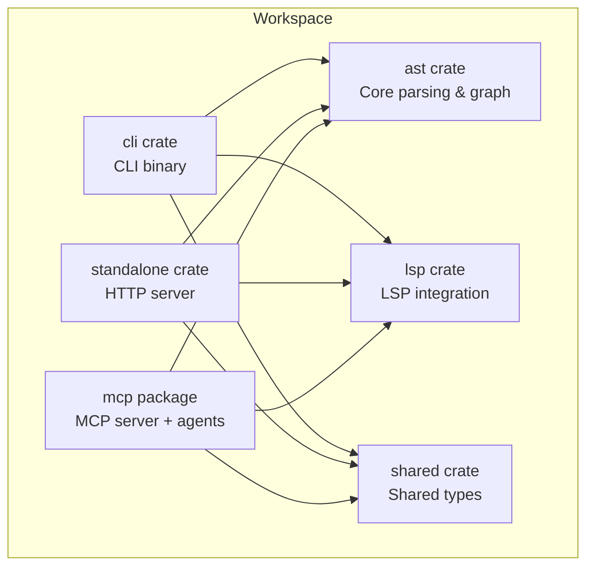
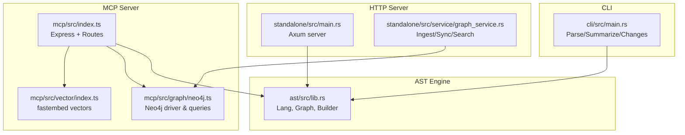

# Project Overview

<cite>
**Referenced Files in This Document**
- [README.md](file://README.md)
- [Cargo.toml](file://Cargo.toml)
- [cli/Cargo.toml](file://cli/Cargo.toml)
- [mcp/package.json](file://mcp/package.json)
- [standalone/Cargo.toml](file://standalone/Cargo.toml)
- [ast/src/lib.rs](file://ast/src/lib.rs)
- [mcp/src/index.ts](file://mcp/src/index.ts)
- [mcp/src/graph/neo4j.ts](file://mcp/src/graph/neo4j.ts)
- [mcp/src/vector/index.ts](file://mcp/src/vector/index.ts)
- [standalone/src/main.rs](file://standalone/src/main.rs)
- [standalone/src/service/graph_service.rs](file://standalone/src/service/graph_service.rs)
- [cli/src/main.rs](file://cli/src/main.rs)
</cite>

## Table of Contents
1. [Introduction](#introduction)
2. [Project Structure](#project-structure)
3. [Core Components](#core-components)
4. [Architecture Overview](#architecture-overview)
5. [Technology Stack](#technology-stack)
6. [High-Level Features](#high-level-features)
7. [Target Use Cases](#target-use-cases)
8. [Performance Considerations](#performance-considerations)
9. [Troubleshooting Guide](#troubleshooting-guide)
10. [Conclusion](#conclusion)

## Introduction
StakGraph is an AI agent-friendly code intelligence platform that transforms raw source code into structured semantic graphs. Its core value proposition is to dramatically reduce AI token waste by providing precise, queryable, and embeddable code graphs instead of forcing agents to parse entire files repeatedly. The platform offers three primary pathways:
- CLI for quick parsing, summarization, and change tracking
- MCP server for seamless integration with AI editors and agents
- HTTP server backed by Neo4j for scalable, persistent graph indexing and querying

By structuring code into nodes (functions, classes, endpoints, data models, tests) and edges (calls, handlers, contains, operands, implements, parent-of), StakGraph enables efficient semantic search, shortest-path navigation, and autonomous exploration—optimized for token budgets and real-world development workflows.

**Section sources**
- [README.md:5](file://README.md#L5)
- [README.md:17](file://README.md#L17)
- [README.md:225](file://README.md#L225)

## Project Structure
The repository is organized as a Rust workspace with multiple crates and a TypeScript/Node-based MCP server, plus supporting binaries and libraries:
- ast: Core Rust library implementing tree-sitter parsing, language-specific extraction, graph construction, and Neo4j integration
- cli: CLI binary for parsing, summarizing, and tracking changes
- lsp: Optional LSP integration for precise symbol resolution
- standalone: Axum HTTP server exposing graph APIs backed by Neo4j
- mcp: TypeScript MCP server with agents, Gitree, vector search, and UI
- shared: Shared types and error handling

**Diagram sources**
- [Cargo.toml:1-5](file://Cargo.toml#L1-L5)
- [cli/Cargo.toml:1-27](file://cli/Cargo.toml#L1-L27)
- [standalone/Cargo.toml:1-34](file://standalone/Cargo.toml#L1-L34)
- [mcp/package.json:1-102](file://mcp/package.json#L1-L102)

**Section sources**
- [Cargo.toml:1-5](file://Cargo.toml#L1-L5)
- [README.md:225](file://README.md#L225)

## Core Components
- AST engine: Implements language-specific parsing, semantic extraction, and graph construction. It supports in-memory graphs for CLI and Neo4j-backed graphs for the server.
- CLI: Provides commands to parse files, summarize projects within token budgets, and track structural changes across commits.
- MCP server: Exposes tools and agents for AI editors, including search, mapping, shortest path, and autonomous exploration. It integrates Gitree for feature knowledge extraction and vector search via fastembed.
- HTTP server: An Axum-based server that ingests repositories, indexes them in Neo4j, and exposes endpoints for search, mapping, and coverage analysis.

**Section sources**
- [ast/src/lib.rs:1-14](file://ast/src/lib.rs#L1-L14)
- [cli/src/main.rs:1-70](file://cli/src/main.rs#L1-L70)
- [mcp/src/index.ts:1-244](file://mcp/src/index.ts#L1-L244)
- [standalone/src/main.rs:1-208](file://standalone/src/main.rs#L1-L208)

## Architecture Overview
The system architecture centers around the AST engine, with distinct entry points for different use cases. The CLI operates independently, while the MCP server and HTTP server share the AST engine and Neo4j for persistence and advanced querying.

**Diagram sources**
- [cli/src/main.rs:1-70](file://cli/src/main.rs#L1-L70)
- [mcp/src/index.ts:1-244](file://mcp/src/index.ts#L1-L244)
- [mcp/src/graph/neo4j.ts:1-800](file://mcp/src/graph/neo4j.ts#L1-L800)
- [mcp/src/vector/index.ts:1-88](file://mcp/src/vector/index.ts#L1-L88)
- [standalone/src/main.rs:1-208](file://standalone/src/main.rs#L1-L208)
- [standalone/src/service/graph_service.rs:1-358](file://standalone/src/service/graph_service.rs#L1-L358)
- [ast/src/lib.rs:1-14](file://ast/src/lib.rs#L1-L14)

## Technology Stack
- Rust: Core parsing, graph construction, and HTTP server
- TypeScript/Node.js: MCP server, agents, vector search, and UI
- tree-sitter: Language parsing and query-based extraction
- Neo4j: Persistent graph storage, Cypher queries, and indexing
- fastembed: Efficient vector embeddings for semantic search
- Axum/Tower: HTTP server and middleware
- Express: MCP server routing and SSE
- LSP: Optional precise symbol resolution

**Section sources**
- [README.md:17](file://README.md#L17)
- [README.md:204](file://README.md#L204)
- [mcp/package.json:64](file://mcp/package.json#L64)
- [standalone/Cargo.toml:16](file://standalone/Cargo.toml#L16)
- [mcp/src/index.ts:16](file://mcp/src/index.ts#L16)

## High-Level Features
- Semantic graph extraction: Functions, classes, endpoints, data models, tests, imports, and relationships
- Token-aware summarization: Adaptive depth and scoring to fit into LLM context windows
- Structural change tracking: Compare codebases across commits and show added/removed/modified structural units
- Vector and fulltext search: Semantic similarity and keyword search across the graph
- Shortest path navigation: Find relationships between any two nodes
- Autonomous exploration: Agents that zoom from overview to files to functions to dependencies
- Gitree: Extract feature-level knowledge from PRs and commits and link to code entities
- Multi-repo ingestion: Link endpoints across frontend and backend repositories

**Section sources**
- [README.md:31](file://README.md#L31)
- [README.md:57](file://README.md#L57)
- [README.md:140](file://README.md#L140)
- [README.md:178](file://README.md#L178)
- [README.md:202](file://README.md#L202)

## Target Use Cases
- Developers: Quickly understand unfamiliar codebases, locate dependencies, and navigate relationships with shortest paths
- AI agents: Reduce token consumption by consuming structured graphs and embeddings instead of raw files; leverage autonomous exploration and semantic search
- Code analysis workflows: Build persistent knowledge graphs, track feature evolution, and maintain embeddings for ongoing semantic search

**Section sources**
- [README.md:5](file://README.md#L5)
- [README.md:157](file://README.md#L157)
- [README.md:164](file://README.md#L164)

## Performance Considerations
- Token budgeting: Summaries and search support token limits to keep LLM context manageable
- Streaming ingestion: Batch upload and incremental updates minimize downtime and optimize throughput
- Indexing: Neo4j indexes accelerate queries and vector search
- Vector weighting: Prioritizes function signatures for better semantic recall
- Parallelization: Rust concurrency and Node queues improve responsiveness

[No sources needed since this section provides general guidance]

## Troubleshooting Guide
- Authentication: The HTTP server optionally requires bearer tokens; ensure API_TOKEN is configured when enabled
- Neo4j connectivity: Verify NEO4J_HOST, NEO4J_USER, and NEO4J_PASSWORD; the server attempts to create indexes on startup
- LSP resolution: Enable USE_LSP or install language servers for precise symbol resolution
- CORS and middleware: Ensure CORS is configured and middleware layers are applied consistently

**Section sources**
- [standalone/src/main.rs:58-65](file://standalone/src/main.rs#L58-L65)
- [mcp/src/graph/neo4j.ts:47-53](file://mcp/src/graph/neo4j.ts#L47-L53)
- [README.md:251](file://README.md#L251)

## Conclusion
StakGraph delivers a practical, AI-centric approach to code understanding by transforming source code into precise, queryable graphs. By combining Rust-powered parsing, Neo4j-backed persistence, and TypeScript-based agents, it reduces token waste, accelerates discovery, and scales to enterprise-grade codebases and multi-repo environments.

[No sources needed since this section summarizes without analyzing specific files]