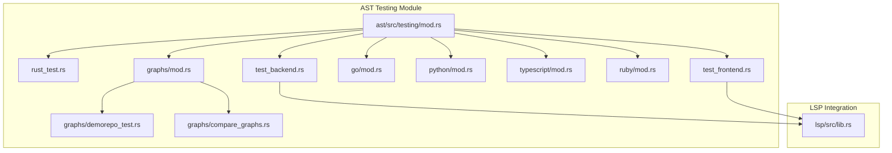
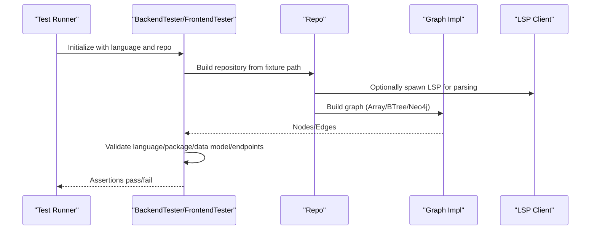
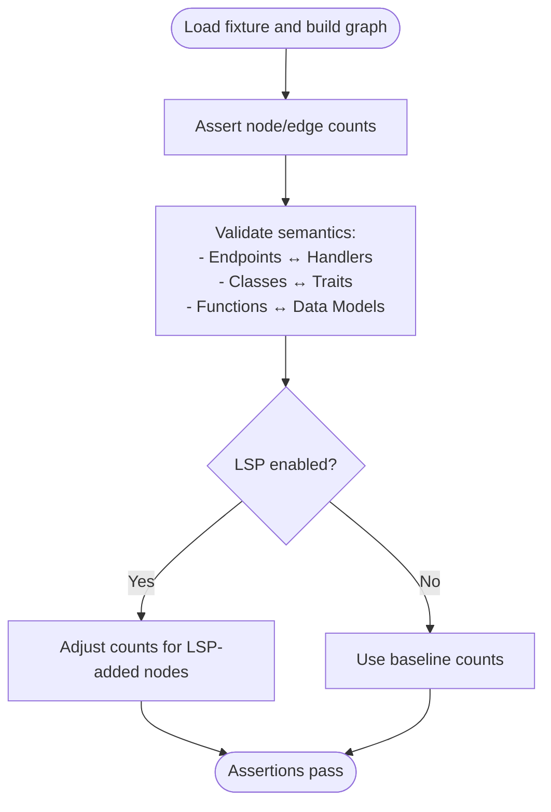
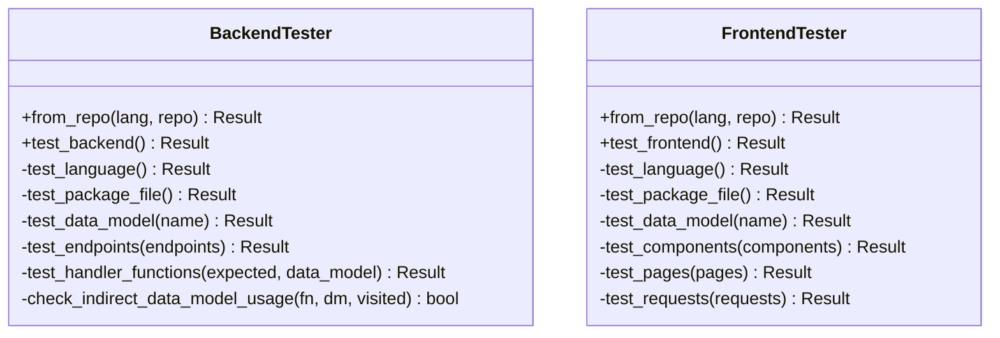
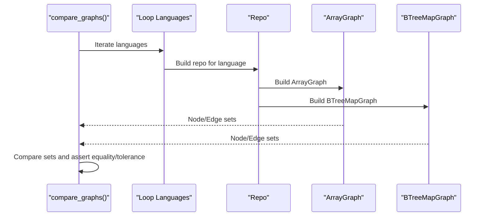
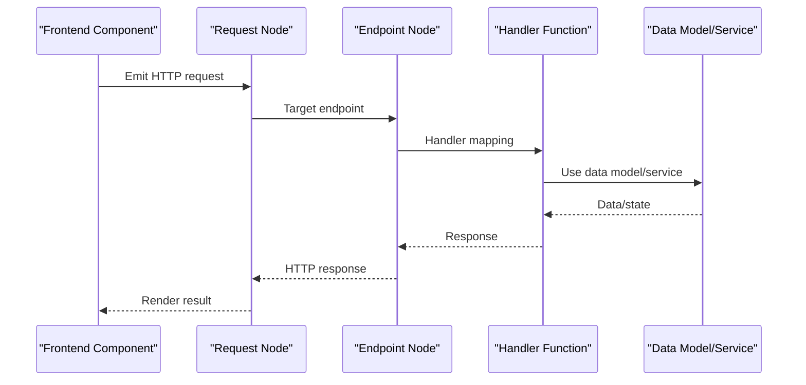
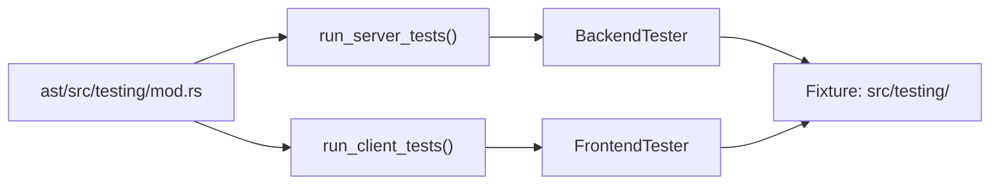
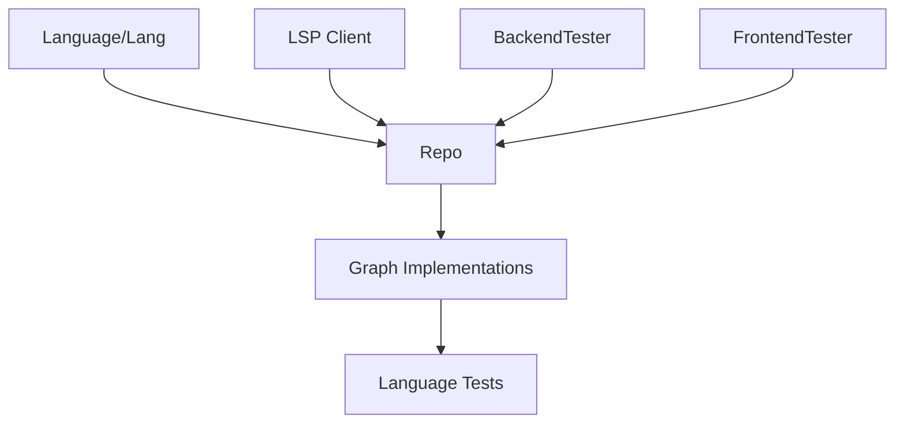

# Testing Framework

<cite>
**Referenced Files in This Document**
- [mod.rs](file://ast/src/testing/mod.rs)
- [rust_test.rs](file://ast/src/testing/rust_test.rs)
- [test_backend.rs](file://ast/src/testing/test_backend.rs)
- [test_frontend.rs](file://ast/src/testing/test_frontend.rs)
- [go/mod.rs](file://ast/src/testing/go/mod.rs)
- [python/mod.rs](file://ast/src/testing/python/mod.rs)
- [typescript/mod.rs](file://ast/src/testing/typescript/mod.rs)
- [ruby/mod.rs](file://ast/src/testing/ruby/mod.rs)
- [graphs/mod.rs](file://ast/src/testing/graphs/mod.rs)
- [demorepo_test.rs](file://ast/src/testing/graphs/demorepo_test.rs)
- [compare_graphs.rs](file://ast/src/testing/graphs/compare_graphs.rs)
- [lib.rs](file://lsp/src/lib.rs)
</cite>

## Table of Contents
1. [Introduction](#introduction)
2. [Project Structure](#project-structure)
3. [Core Components](#core-components)
4. [Architecture Overview](#architecture-overview)
5. [Detailed Component Analysis](#detailed-component-analysis)
6. [Dependency Analysis](#dependency-analysis)
7. [Performance Considerations](#performance-considerations)
8. [Troubleshooting Guide](#troubleshooting-guide)
9. [Conclusion](#conclusion)
10. [Appendices](#appendices)

## Introduction
This document describes StakGraph’s comprehensive testing framework and validation strategies across Rust, TypeScript, Go, Python, Ruby, and other supported languages. It explains the testing architecture (unit, integration, and end-to-end), language parser validation, graph construction verification, and AI agent evaluation workflows. It also covers test suite organization, fixture management, and automated CI-friendly patterns. Guidance is included for adding new language parsers and extending the testing framework while maintaining broad coverage.

## Project Structure
The testing system is organized under the AST crate’s testing module and includes:
- Language-specific test suites for Rust, Go, Python, TypeScript, and Ruby
- Backend and frontend tester harnesses for validating server-side and client-side artifacts
- Graph comparison and demo repository tests for cross-implementation validation
- LSP integration utilities enabling optional language server-powered parsing

**Diagram sources**
- [mod.rs:1-83](file://ast/src/testing/mod.rs#L1-L83)
- [rust_test.rs:1-120](file://ast/src/testing/rust_test.rs#L1-L120)
- [test_backend.rs:1-60](file://ast/src/testing/test_backend.rs#L1-L60)
- [test_frontend.rs:1-60](file://ast/src/testing/test_frontend.rs#L1-L60)
- [go/mod.rs:1-60](file://ast/src/testing/go/mod.rs#L1-L60)
- [python/mod.rs:1-60](file://ast/src/testing/python/mod.rs#L1-L60)
- [typescript/mod.rs:1-60](file://ast/src/testing/typescript/mod.rs#L1-L60)
- [ruby/mod.rs:1-60](file://ast/src/testing/ruby/mod.rs#L1-L60)
- [graphs/mod.rs:1-5](file://ast/src/testing/graphs/mod.rs#L1-L5)
- [demorepo_test.rs:1-40](file://ast/src/testing/graphs/demorepo_test.rs#L1-L40)
- [compare_graphs.rs:1-40](file://ast/src/testing/graphs/compare_graphs.rs#L1-L40)
- [lib.rs:1-40](file://lsp/src/lib.rs#L1-L40)

**Section sources**
- [mod.rs:1-83](file://ast/src/testing/mod.rs#L1-L83)

## Core Components
- Language-specific generic tests: Each language module validates parser correctness, node/edge counts, and semantic relationships for representative fixtures.
- BackendTester and FrontendTester: Unified harnesses that validate language detection, package files, data models, endpoints, and handler connections.
- Graph comparison and demo repository tests: Cross-graph validation and end-to-end integration across multiple languages.
- LSP integration: Optional language server support toggled via environment and feature flags.

Key responsibilities:
- Parser validation: Ensures language nodes, imports, classes, functions, endpoints, and relations are parsed and represented consistently.
- Graph construction: Verifies node and edge counts, containment, handler relations, and cross-file linkage.
- AI agent evaluation: End-to-end scenarios that exercise request-to-endpoint-to-handler chains and multi-repo ingestion.

**Section sources**
- [rust_test.rs:1-120](file://ast/src/testing/rust_test.rs#L1-L120)
- [test_backend.rs:1-60](file://ast/src/testing/test_backend.rs#L1-L60)
- [test_frontend.rs:1-60](file://ast/src/testing/test_frontend.rs#L1-L60)
- [go/mod.rs:1-60](file://ast/src/testing/go/mod.rs#L1-L60)
- [python/mod.rs:1-60](file://ast/src/testing/python/mod.rs#L1-L60)
- [typescript/mod.rs:1-60](file://ast/src/testing/typescript/mod.rs#L1-L60)
- [ruby/mod.rs:1-60](file://ast/src/testing/ruby/mod.rs#L1-L60)
- [graphs/demorepo_test.rs:1-40](file://ast/src/testing/graphs/demorepo_test.rs#L1-L40)
- [graphs/compare_graphs.rs:1-40](file://ast/src/testing/graphs/compare_graphs.rs#L1-L40)
- [lib.rs:1-40](file://lsp/src/lib.rs#L1-L40)

## Architecture Overview
The testing architecture comprises:
- Fixture-driven tests: Each language module loads a dedicated test fixture repository and builds a graph using the chosen graph implementation (ArrayGraph, BTreeMapGraph, optionally Neo4jGraph).
- Backend and frontend testers: Validate server-side endpoints and handlers, and client-side components/pages/requests.
- Graph comparison: Compares two graph implementations to ensure deterministic behavior.
- Demo repository ingestion: Validates multi-language, multi-repo scenarios and request-to-endpoint-to-handler chains.

**Diagram sources**
- [test_backend.rs:14-60](file://ast/src/testing/test_backend.rs#L14-L60)
- [test_frontend.rs:34-80](file://ast/src/testing/test_frontend.rs#L34-L80)
- [lib.rs:169-289](file://lsp/src/lib.rs#L169-L289)

## Detailed Component Analysis

### Multi-Language Generic Tests
Each language module defines a generic test function that:
- Loads a language fixture repository
- Builds a graph with the selected graph implementation
- Asserts counts for nodes (Language, Repository, Directory, File, Import, Class, Function, DataModel, Trait, Var, Endpoint, Request, Unit/Integration/E2E tests)
- Validates edges (Contains, Imports, Calls, Handler, Implements, Operand, NestedIn, Of, ParentOf, Uses, Renders, ArgOf)
- Checks specific semantic relationships (e.g., endpoints mapped to handlers, traits implemented by classes, data models used by functions)

Examples:
- Rust generic test validates imports, traits, classes, endpoints, and handler mappings across multiple frameworks.
- Go generic test validates endpoints, handlers, and function calls with and without LSP.
- Python generic test validates ORM models, routes across Flask/Django/FastAPI, and request-to-handler relations.
- TypeScript generic test validates test directory hierarchy, unit/integration/e2e tests, and endpoint-to-handler mappings.
- Ruby generic test validates Rails routes, controllers, services, models, migrations, ERB pages, and test coverage.

**Diagram sources**
- [rust_test.rs:8-120](file://ast/src/testing/rust_test.rs#L8-L120)
- [go/mod.rs:9-60](file://ast/src/testing/go/mod.rs#L9-L60)
- [python/mod.rs:7-60](file://ast/src/testing/python/mod.rs#L7-L60)
- [typescript/mod.rs:8-60](file://ast/src/testing/typescript/mod.rs#L8-L60)
- [ruby/mod.rs:9-60](file://ast/src/testing/ruby/mod.rs#L9-L60)

**Section sources**
- [rust_test.rs:1-200](file://ast/src/testing/rust_test.rs#L1-L200)
- [go/mod.rs:1-120](file://ast/src/testing/go/mod.rs#L1-L120)
- [python/mod.rs:1-160](file://ast/src/testing/python/mod.rs#L1-L160)
- [typescript/mod.rs:1-120](file://ast/src/testing/typescript/mod.rs#L1-L120)
- [ruby/mod.rs:1-120](file://ast/src/testing/ruby/mod.rs#L1-L120)

### Backend and Frontend Tester Harnesses
These harnesses provide reusable validation logic:
- BackendTester: Validates language detection, package file presence, data models, endpoints, and handler connectivity. It traverses handler call graphs (direct and indirect) to ensure data model usage is validated.
- FrontendTester: Validates language detection, package file presence, data models, components/pages (when applicable), and requests.

**Diagram sources**
- [test_backend.rs:8-281](file://ast/src/testing/test_backend.rs#L8-L281)
- [test_frontend.rs:9-210](file://ast/src/testing/test_frontend.rs#L9-L210)

**Section sources**
- [test_backend.rs:1-295](file://ast/src/testing/test_backend.rs#L1-L295)
- [test_frontend.rs:1-211](file://ast/src/testing/test_frontend.rs#L1-L211)

### Graph Construction and Comparison
- Compare graphs: Iterates over supported languages and compares ArrayGraph vs BTreeMapGraph to ensure deterministic node/edge counts within acceptable tolerance.
- Demo repository test: Builds a multi-language graph from a real repository, asserting request-to-endpoint-to-handler chains and counts.

**Diagram sources**
- [graphs/compare_graphs.rs:26-105](file://ast/src/testing/graphs/compare_graphs.rs#L26-L105)
- [graphs/demorepo_test.rs:9-217](file://ast/src/testing/graphs/demorepo_test.rs#L9-L217)

**Section sources**
- [graphs/compare_graphs.rs:1-106](file://ast/src/testing/graphs/compare_graphs.rs#L1-L106)
- [graphs/demorepo_test.rs:1-254](file://ast/src/testing/graphs/demorepo_test.rs#L1-L254)

### AI Agent Evaluation Methods
End-to-end scenarios validate request-to-endpoint-to-handler chains across frontend components and backend endpoints. These tests ensure:
- Requests originate from frontend components
- Requests target backend endpoints
- Endpoints are handled by appropriate functions
- Handler functions connect to data models or services

**Diagram sources**
- [graphs/demorepo_test.rs:122-201](file://ast/src/testing/graphs/demorepo_test.rs#L122-L201)

**Section sources**
- [graphs/demorepo_test.rs:1-254](file://ast/src/testing/graphs/demorepo_test.rs#L1-L254)

### Language Parser Validation
Parser validation is performed per language fixture:
- Node types: Language, Repository, Directory, File, Import, Class, Function, DataModel, Trait, Var, Endpoint, Request, Unit/Integration/E2E tests
- Edge types: Contains, Imports, Calls, Handler, Implements, Operand, NestedIn, Of, ParentOf, Uses, Renders, ArgOf
- Semantic checks: Routes mapped to handlers, traits implemented by classes, ORM models used by handlers, test directory structures, and LSP-enabled differences

**Section sources**
- [rust_test.rs:1-200](file://ast/src/testing/rust_test.rs#L1-L200)
- [go/mod.rs:1-120](file://ast/src/testing/go/mod.rs#L1-L120)
- [python/mod.rs:1-160](file://ast/src/testing/python/mod.rs#L1-L160)
- [typescript/mod.rs:1-120](file://ast/src/testing/typescript/mod.rs#L1-L120)
- [ruby/mod.rs:1-120](file://ast/src/testing/ruby/mod.rs#L1-L120)

### Test Suite Organization and Fixtures
- Central registry: The testing module aggregates language-specific suites and exposes server/client test runners.
- Fixture layout: Each language test fixture resides under ast/src/testing/<language> with representative codebases (web apps, CLI, etc.).
- Runner orchestration: Top-level tests iterate over implemented servers/clients and initialize testers from repository fixtures.

**Diagram sources**
- [mod.rs:40-72](file://ast/src/testing/mod.rs#L40-L72)

**Section sources**
- [mod.rs:1-83](file://ast/src/testing/mod.rs#L1-L83)

## Dependency Analysis
- Language selection: Tests rely on the Language enum and Lang abstraction to resolve language-specific parsers and package files.
- Graph implementations: ArrayGraph and BTreeMapGraph are the primary implementations; Neo4jGraph is conditionally used behind a feature flag.
- LSP integration: Optional language server spawning and initialization for enhanced parsing accuracy.
- Test harnesses: BackendTester and FrontendTester depend on the Graph trait and Repo to construct and validate graphs.

**Diagram sources**
- [test_backend.rs:14-38](file://ast/src/testing/test_backend.rs#L14-L38)
- [test_frontend.rs:34-56](file://ast/src/testing/test_frontend.rs#L34-L56)
- [lib.rs:169-289](file://lsp/src/lib.rs#L169-L289)

**Section sources**
- [test_backend.rs:1-60](file://ast/src/testing/test_backend.rs#L1-L60)
- [test_frontend.rs:1-60](file://ast/src/testing/test_frontend.rs#L1-L60)
- [lib.rs:1-40](file://lsp/src/lib.rs#L1-L40)

## Performance Considerations
- Multi-threaded test execution: Tests use a multi-threaded tokio flavor to parallelize graph building and validation.
- LSP toggling: Enabling LSP increases parsing fidelity but may alter counts slightly; tests account for this difference.
- Feature flags: Neo4jGraph requires a feature flag and clears the database between runs to avoid cross-test contamination.

[No sources needed since this section provides general guidance]

## Troubleshooting Guide
Common issues and resolutions:
- LSP initialization failures: The LSP client enforces timeouts and logs initialization errors; verify language server availability and arguments.
- Missing package files: BackendTester/FrontendTester validate package files; ensure fixtures include expected files (e.g., Gemfile, package.json).
- Handler mismatches: BackendTester traverses direct and indirect function calls to validate data model usage; confirm routes and handlers are correctly wired.
- Graph comparison discrepancies: Differences within a small tolerance are acceptable; investigate significant deviations in node/edge counts.

**Section sources**
- [lib.rs:234-254](file://lsp/src/lib.rs#L234-L254)
- [test_backend.rs:136-242](file://ast/src/testing/test_backend.rs#L136-L242)
- [graphs/compare_graphs.rs:79-102](file://ast/src/testing/graphs/compare_graphs.rs#L79-L102)

## Conclusion
StakGraph’s testing framework provides robust, language-agnostic validation of parsers, graph construction, and end-to-end workflows. By leveraging fixture-driven tests, unified backend/frontend testers, and cross-implementation graph comparisons, it ensures consistent behavior across Rust, TypeScript, Go, Python, Ruby, and other supported languages. Optional LSP integration enhances accuracy, while feature flags enable flexible deployment modes.

[No sources needed since this section summarizes without analyzing specific files]

## Appendices

### Guidelines for Writing Tests for New Language Parsers
- Create a fixture under ast/src/testing/<language> with representative code.
- Add a generic test function in ast/src/testing/<language>/mod.rs that asserts node/edge counts and semantic relationships.
- Integrate the language into the central registry in ast/src/testing/mod.rs and ensure it participates in server/client test loops.
- If applicable, add BackendTester/FrontendTester validations for endpoints, handlers, and package files.
- Use feature flags for optional graph backends (e.g., Neo4jGraph) and ensure cleanup between runs.

**Section sources**
- [mod.rs:1-83](file://ast/src/testing/mod.rs#L1-L83)
- [go/mod.rs:528-550](file://ast/src/testing/go/mod.rs#L528-L550)
- [python/mod.rs:798-818](file://ast/src/testing/python/mod.rs#L798-L818)
- [typescript/mod.rs:798-818](file://ast/src/testing/typescript/mod.rs#L798-L818)
- [ruby/mod.rs:800-951](file://ast/src/testing/ruby/mod.rs#L800-L951)

### Extending the Testing Framework
- Add new graph implementations: Implement the Graph trait and include in compare_graphs tests.
- Introduce AI agent evaluation scenarios: Extend demo repository tests to cover additional request-to-endpoint-to-handler chains.
- Enhance LSP integration: Adjust LSP toggling logic and handle language-specific server configurations.

**Section sources**
- [graphs/compare_graphs.rs:1-106](file://ast/src/testing/graphs/compare_graphs.rs#L1-L106)
- [graphs/demorepo_test.rs:1-254](file://ast/src/testing/graphs/demorepo_test.rs#L1-L254)
- [lib.rs:169-289](file://lsp/src/lib.rs#L169-L289)