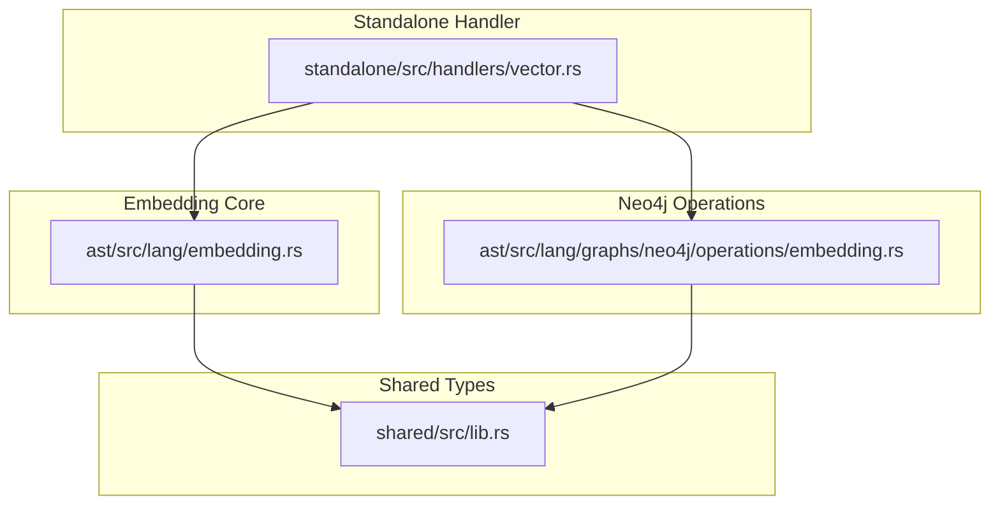
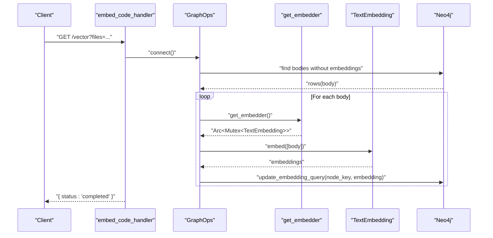
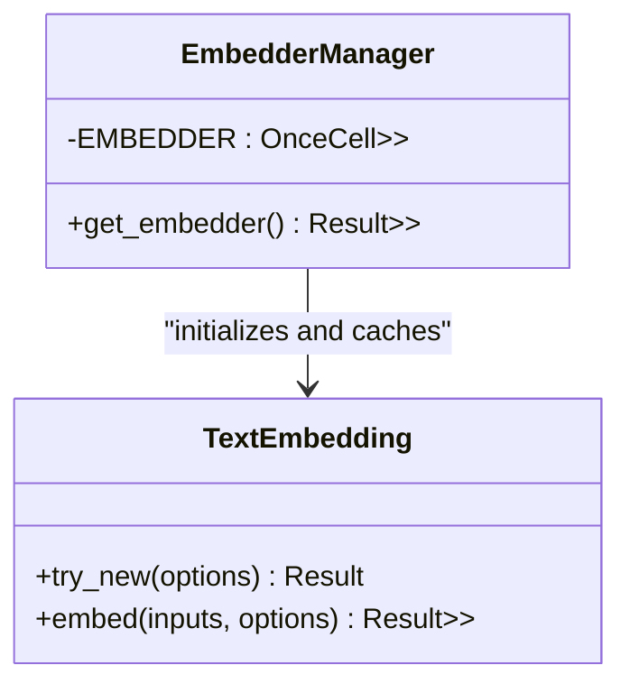
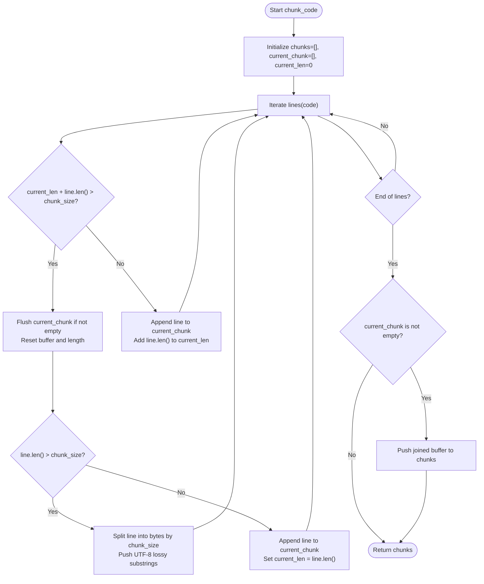
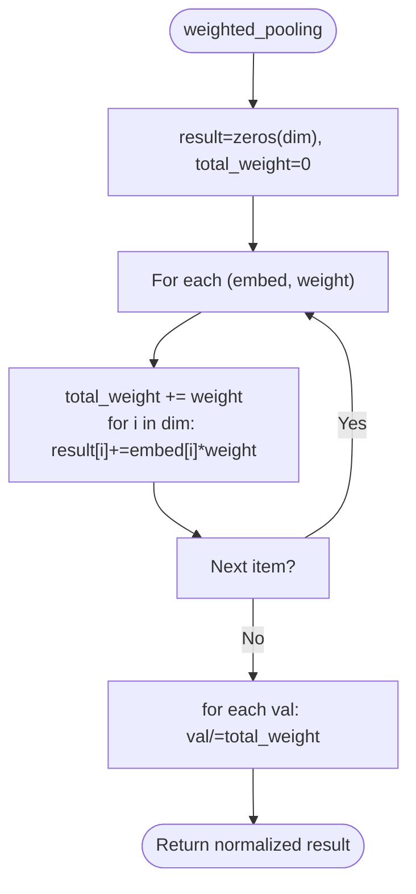
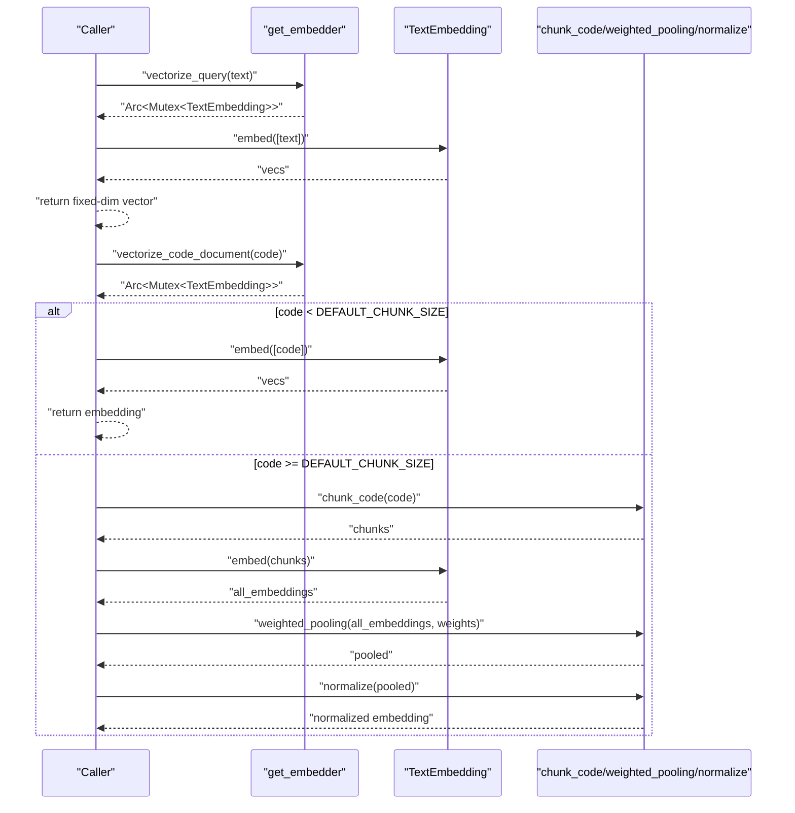
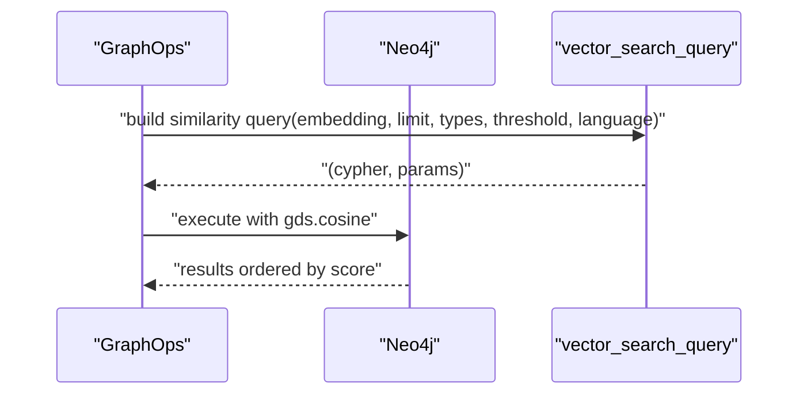
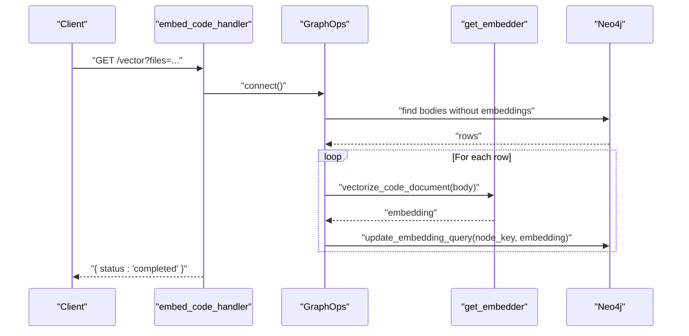
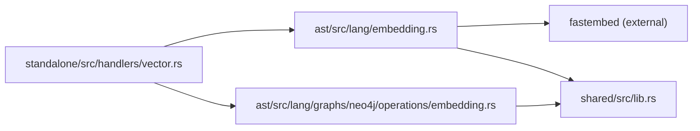

# Embedding Generation and Management

<cite>
**Referenced Files in This Document**
- [embedding.rs](file://ast/src/lang/embedding.rs)
- [embedding.rs](file://ast/src/lang/graphs/neo4j/operations/embedding.rs)
- [vector.rs](file://standalone/src/handlers/vector.rs)
- [lib.rs](file://shared/src/lib.rs)
</cite>

## Table of Contents
1. [Introduction](#introduction)
2. [Project Structure](#project-structure)
3. [Core Components](#core-components)
4. [Architecture Overview](#architecture-overview)
5. [Detailed Component Analysis](#detailed-component-analysis)
6. [Dependency Analysis](#dependency-analysis)
7. [Performance Considerations](#performance-considerations)
8. [Troubleshooting Guide](#troubleshooting-guide)
9. [Conclusion](#conclusion)

## Introduction
This document explains the embedding generation and management system in StakGraph. It focuses on the BGE-Small-EN-v1.5 model integration via fastembed, initialization and configuration, embedding dimension handling, chunking strategies for large code documents, weighted pooling and normalization for combined embeddings, the singleton pattern for embedder management, thread safety, and memory considerations. Practical examples and troubleshooting guidance are included.

## Project Structure
The embedding system spans three primary areas:
- Embedding core logic and utilities: [embedding.rs](file://ast/src/lang/embedding.rs)
- Neo4j integration for persistence and vector search: [embedding.rs](file://ast/src/lang/graphs/neo4j/operations/embedding.rs)
- Handler to trigger embedding generation for stored content: [vector.rs](file://standalone/src/handlers/vector.rs)
- Shared error types used across the system: [lib.rs](file://shared/src/lib.rs)

**Diagram sources**
- [embedding.rs:1-117](file://ast/src/lang/embedding.rs#L1-L117)
- [embedding.rs:1-115](file://ast/src/lang/graphs/neo4j/operations/embedding.rs#L1-L115)
- [vector.rs:1-14](file://standalone/src/handlers/vector.rs#L1-L14)
- [lib.rs:1-4](file://shared/src/lib.rs#L1-L4)

**Section sources**
- [embedding.rs:1-117](file://ast/src/lang/embedding.rs#L1-L117)
- [embedding.rs:1-115](file://ast/src/lang/graphs/neo4j/operations/embedding.rs#L1-L115)
- [vector.rs:1-14](file://standalone/src/handlers/vector.rs#L1-L14)
- [lib.rs:1-4](file://shared/src/lib.rs#L1-L4)

## Core Components
- Singleton embedder manager with lazy initialization and thread-safe access
- Model configuration for BGE-Small-EN-v1.5 via fastembed
- Embedding dimension constant and chunking logic for long code bodies
- Weighted pooling and normalization for multi-chunk embeddings
- Neo4j persistence and vector similarity search utilities
- Standalone handler to batch-embed stored content

Key constants and functions:
- Embedding dimension: [EMBEDDING_DIM:6-6](file://ast/src/lang/embedding.rs#L6-L6)
- Default chunk size: [DEFAULT_CHUNK_SIZE:7-7](file://ast/src/lang/embedding.rs#L7-L7)
- Singleton embedder accessor: [get_embedder:11-22](file://ast/src/lang/embedding.rs#L11-L22)
- Query embedding: [vectorize_query:78-86](file://ast/src/lang/embedding.rs#L78-L86)
- Code document embedding: [vectorize_code_document:88-110](file://ast/src/lang/embedding.rs#L88-L110)
- Chunking algorithm: [chunk_code:48-76](file://ast/src/lang/embedding.rs#L48-L76)
- Weighted pooling: [weighted_pooling:23-37](file://ast/src/lang/embedding.rs#L23-L37)
- Normalization: [normalize:39-46](file://ast/src/lang/embedding.rs#L39-L46)
- Neo4j embedding persistence: [update_embedding_query:31-45](file://ast/src/lang/graphs/neo4j/operations/embedding.rs#L31-L45)
- Vector similarity search: [vector_search_query:46-114](file://ast/src/lang/graphs/neo4j/operations/embedding.rs#L46-L114)
- Batch embedding handler: [embed_code_handler:5-13](file://standalone/src/handlers/vector.rs#L5-L13)

**Section sources**
- [embedding.rs:6-117](file://ast/src/lang/embedding.rs#L6-L117)
- [embedding.rs:31-114](file://ast/src/lang/graphs/neo4j/operations/embedding.rs#L31-L114)
- [vector.rs:5-13](file://standalone/src/handlers/vector.rs#L5-L13)

## Architecture Overview
The embedding pipeline integrates fastembed for inference, a singleton embedder for resource reuse, and Neo4j for storing and querying embeddings.

**Diagram sources**
- [vector.rs:5-13](file://standalone/src/handlers/vector.rs#L5-L13)
- [embedding.rs:11-22](file://ast/src/lang/embedding.rs#L11-L22)
- [embedding.rs:31-45](file://ast/src/lang/graphs/neo4j/operations/embedding.rs#L31-L45)

## Detailed Component Analysis

### Singleton Embedder Manager
- Uses a global OnceCell to lazily initialize a single TextEmbedding instance.
- Wraps the model in Arc<Mutex<TextEmbedding>> to enable safe concurrent access across tasks.
- Initialization options:
  - Model: BGE-Small-EN-v1.5
  - Max length: 512 tokens
- Thread safety:
  - Mutex ensures exclusive access during embedding calls.
  - Arc enables sharing across async tasks without cloning the underlying model.

**Diagram sources**
- [embedding.rs:9-22](file://ast/src/lang/embedding.rs#L9-L22)

**Section sources**
- [embedding.rs:9-22](file://ast/src/lang/embedding.rs#L9-L22)

### Model Loading Strategies
- Model selection: BGE-Small-EN-v1.5 via fastembed.
- Token length constraint: max length set to 512.
- Error propagation: model load failures are wrapped as dependency errors using shared.Error.

Practical implications:
- Choose a model appropriate for code-heavy text.
- Keep max length aligned with downstream vector store constraints.

**Section sources**
- [embedding.rs:16-18](file://ast/src/lang/embedding.rs#L16-L18)
- [lib.rs:1-4](file://shared/src/lib.rs#L1-L4)

### Embedding Dimension Configuration
- Fixed embedding dimension constant: 384.
- Used as fallback when inference returns empty results.
- Ensures consistent vector sizes for storage and similarity comparisons.

**Section sources**
- [embedding.rs:6-6](file://ast/src/lang/embedding.rs#L6-L6)
- [embedding.rs:82-85](file://ast/src/lang/embedding.rs#L82-L85)

### Chunking Algorithm for Large Code Documents
Purpose:
- Split long code bodies into smaller segments to respect model token limits and improve retrieval granularity.

Algorithm highlights:
- Iterates over lines and accumulates until reaching the chunk size threshold.
- If a single line exceeds the chunk size, it is split into byte-sized chunks to avoid exceeding limits.
- Maintains current chunk buffer and length to prevent mid-line truncation artifacts.

**Diagram sources**
- [embedding.rs:48-76](file://ast/src/lang/embedding.rs#L48-L76)

**Section sources**
- [embedding.rs:48-76](file://ast/src/lang/embedding.rs#L48-L76)

### Weighted Pooling and Normalization
Purpose:
- Combine multiple chunk embeddings into a single representative vector.
- Emphasize the first chunk slightly to preserve contextual primacy.

Mechanics:
- Weighted pooling computes a weighted sum across embeddings and normalizes by total weight.
- L2 normalization scales the pooled vector to unit norm for cosine similarity stability.

**Diagram sources**
- [embedding.rs:23-37](file://ast/src/lang/embedding.rs#L23-L37)
- [embedding.rs:39-46](file://ast/src/lang/embedding.rs#L39-L46)

**Section sources**
- [embedding.rs:23-46](file://ast/src/lang/embedding.rs#L23-L46)

### Query and Code Embedding Workflows
- Query embedding:
  - Acquire the singleton embedder.
  - Lock for exclusive access.
  - Embed a single query string.
  - Return a fixed-size vector, falling back to zeros if inference yields none.

- Code document embedding:
  - If the document is shorter than the default chunk size, embed directly.
  - Otherwise:
    - Chunk the code.
    - Embed all chunks.
    - Compute weights (boost first chunk).
    - Weighted pool and L2 normalize.

**Diagram sources**
- [embedding.rs:78-110](file://ast/src/lang/embedding.rs#L78-L110)
- [embedding.rs:48-76](file://ast/src/lang/embedding.rs#L48-L76)
- [embedding.rs:23-46](file://ast/src/lang/embedding.rs#L23-L46)

**Section sources**
- [embedding.rs:78-110](file://ast/src/lang/embedding.rs#L78-L110)

### Neo4j Integration for Embeddings
- Persistence:
  - Update query sets the node’s embeddings field with the computed vector.
- Vector search:
  - Cosine similarity against stored embeddings.
  - Optional filters by node types and file extensions.
  - Threshold and limit controls for relevance and performance.

**Diagram sources**
- [embedding.rs:46-114](file://ast/src/lang/graphs/neo4j/operations/embedding.rs#L46-L114)

**Section sources**
- [embedding.rs:31-114](file://ast/src/lang/graphs/neo4j/operations/embedding.rs#L31-L114)

### Standalone Handler for Batch Embedding
- Endpoint: GET /vector?files=[bool]
- Behavior:
  - Connects to the graph.
  - Retrieves content bodies without embeddings (optionally filtered by files).
  - Computes embeddings per body using the singleton embedder.
  - Persists embeddings to Neo4j.
  - Returns completion status.

**Diagram sources**
- [vector.rs:5-13](file://standalone/src/handlers/vector.rs#L5-L13)
- [embedding.rs:88-110](file://ast/src/lang/embedding.rs#L88-L110)
- [embedding.rs:31-45](file://ast/src/lang/graphs/neo4j/operations/embedding.rs#L31-L45)

**Section sources**
- [vector.rs:5-13](file://standalone/src/handlers/vector.rs#L5-L13)

## Dependency Analysis
- Embedding core depends on fastembed for inference and shared.Error for error handling.
- Neo4j operations depend on bolt types and the Language enum for extension filtering.
- Handler orchestrates GraphOps and the embedding pipeline.

**Diagram sources**
- [embedding.rs:1-2](file://ast/src/lang/embedding.rs#L1-L2)
- [embedding.rs:1-6](file://ast/src/lang/graphs/neo4j/operations/embedding.rs#L1-L6)
- [vector.rs:1-3](file://standalone/src/handlers/vector.rs#L1-L3)
- [lib.rs:1-4](file://shared/src/lib.rs#L1-L4)

**Section sources**
- [embedding.rs:1-2](file://ast/src/lang/embedding.rs#L1-L2)
- [embedding.rs:1-6](file://ast/src/lang/graphs/neo4j/operations/embedding.rs#L1-L6)
- [vector.rs:1-3](file://standalone/src/handlers/vector.rs#L1-L3)
- [lib.rs:1-4](file://shared/src/lib.rs#L1-L4)

## Performance Considerations
- Singleton embedder minimizes repeated model loading overhead and reduces memory footprint.
- Mutex-guarded access prevents contention but introduces serialization of inference calls; consider batching multiple inputs to reduce lock frequency.
- Chunk size influences recall vs. latency trade-offs; larger chunks increase context but risk exceeding token limits.
- Weighted pooling and normalization stabilize similarity metrics; ensure consistent normalization across training and runtime.
- Neo4j cosine similarity is efficient for approximate nearest neighbor retrieval; tune thresholds and limits for desired precision/recall.

[No sources needed since this section provides general guidance]

## Troubleshooting Guide
Common issues and resolutions:
- Model load failure:
  - Symptom: Error indicating dependency failure during embedder initialization.
  - Action: Verify model availability and environment; check fastembed compatibility and network access if downloading models.
  - Reference: [get_embedder:17-18](file://ast/src/lang/embedding.rs#L17-L18), [lib.rs:1-4](file://shared/src/lib.rs#L1-L4)
- Empty or zero vectors:
  - Symptom: Fallback to zero vector when inference returns no embeddings.
  - Action: Validate input text length and encoding; ensure chunking produces non-empty segments.
  - Reference: [vectorize_query:82-85](file://ast/src/lang/embedding.rs#L82-L85), [vectorize_code_document:94-97](file://ast/src/lang/embedding.rs#L94-L97)
- Unexpectedly small similarity scores:
  - Symptom: Low relevance despite semantically similar content.
  - Action: Confirm normalization is applied consistently; adjust similarity threshold and node type filters; verify extension filters align with target files.
  - Reference: [vector_search_query:46-114](file://ast/src/lang/graphs/neo4j/operations/embedding.rs#L46-L114)
- Memory or performance bottlenecks:
  - Symptom: Slow inference or high memory usage.
  - Action: Reduce DEFAULT_CHUNK_SIZE; batch embeddings where possible; monitor model memory usage and consider model selection adjustments.
  - Reference: [DEFAULT_CHUNK_SIZE:7-7](file://ast/src/lang/embedding.rs#L7-L7), [get_embedder:11-22](file://ast/src/lang/embedding.rs#L11-L22)

**Section sources**
- [embedding.rs:17-18](file://ast/src/lang/embedding.rs#L17-L18)
- [embedding.rs:82-97](file://ast/src/lang/embedding.rs#L82-L97)
- [embedding.rs:46-114](file://ast/src/lang/graphs/neo4j/operations/embedding.rs#L46-L114)
- [lib.rs:1-4](file://shared/src/lib.rs#L1-L4)

## Conclusion
The embedding system in StakGraph leverages a singleton fastembed TextEmbedding instance configured for BGE-Small-EN-v1.5, with a fixed 384-dimensional output. Robust chunking, weighted pooling, and normalization produce stable, retrievable embeddings for both queries and code documents. Neo4j integration supports efficient persistence and similarity search. The handler enables batch embedding of stored content, completing the end-to-end pipeline.

[No sources needed since this section summarizes without analyzing specific files]