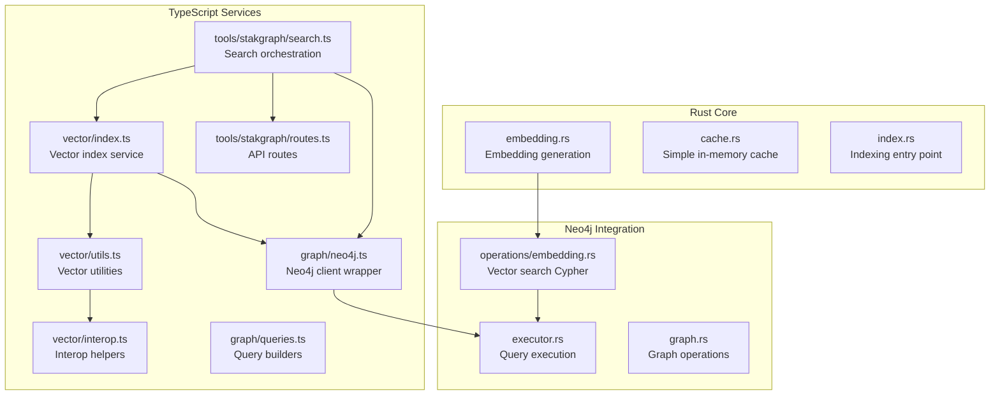
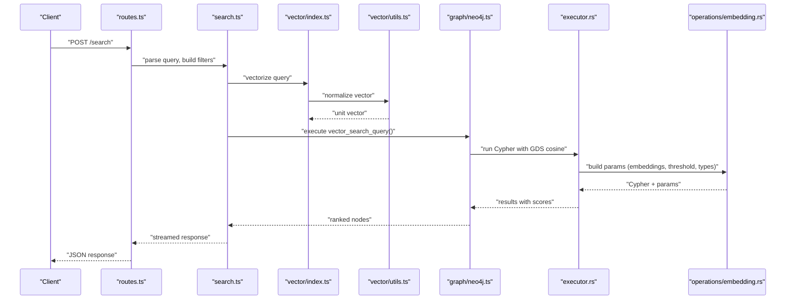
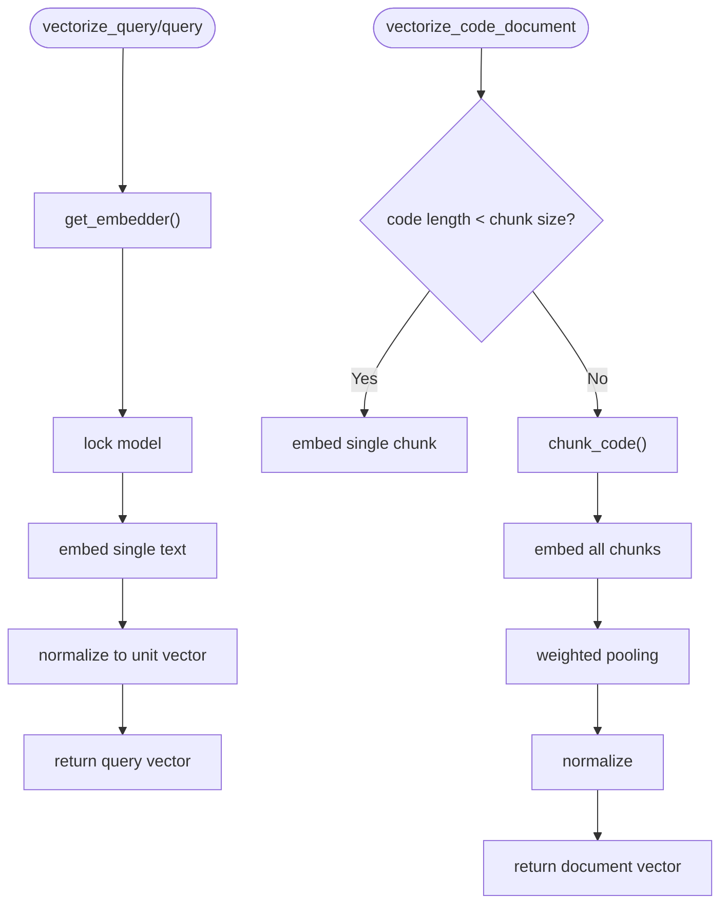
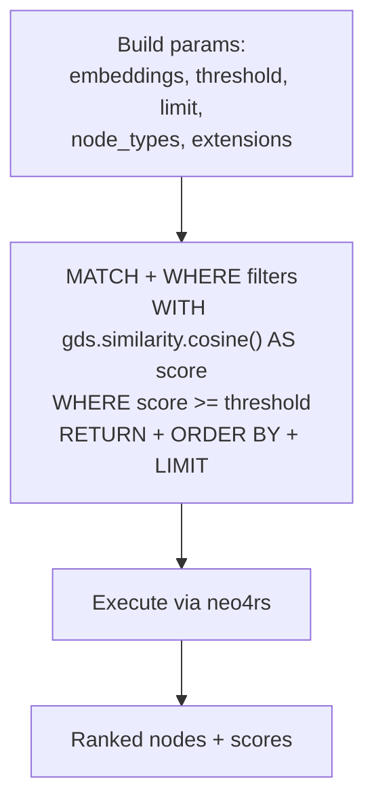
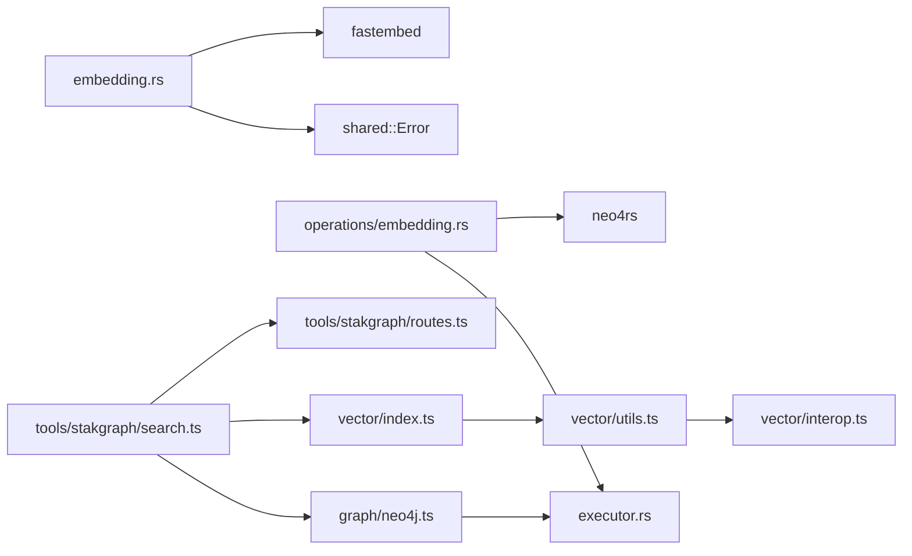

# Performance Optimization and Scaling

<cite>
**Referenced Files in This Document**
- [embedding.rs](file://ast/src/lang/embedding.rs)
- [embedding_ops.rs](file://ast/src/lang/graphs/neo4j/operations/embedding.rs)
- [graph.rs](file://ast/src/lang/graphs/neo4j/graph.rs)
- [executor.rs](file://ast/src/lang/graphs/neo4j/executor.rs)
- [cache.rs](file://ast/src/testing/rust/src/lib_core/cache.rs)
- [index.rs](file://ast/src/index.rs)
- [vector_index.ts](file://mcp/src/vector/index.ts)
- [vector_utils.ts](file://mcp/src/vector/utils.ts)
- [vector_interop.ts](file://mcp/src/vector/interop.ts)
- [graph_neo4j.ts](file://mcp/src/graph/neo4j.ts)
- [queries.ts](file://mcp/src/graph/queries.ts)
- [routes.ts](file://mcp/src/tools/stakgraph/routes.ts)
- [search.ts](file://mcp/src/tools/stakgraph/search.ts)
- [vector_search_response.json](file://mcp/testing/vector-search-response.json)
- [fulltext_search_response.txt](file://mcp/testing/fulltext-search-response.txt)
</cite>

## Table of Contents
1. [Introduction](#introduction)
2. [Project Structure](#project-structure)
3. [Core Components](#core-components)
4. [Architecture Overview](#architecture-overview)
5. [Detailed Component Analysis](#detailed-component-analysis)
6. [Dependency Analysis](#dependency-analysis)
7. [Performance Considerations](#performance-considerations)
8. [Troubleshooting Guide](#troubleshooting-guide)
9. [Conclusion](#conclusion)
10. [Appendices](#appendices)

## Introduction
This document provides a comprehensive guide to vector search performance optimization and scaling strategies in StakGraph. It covers embedding caching and memory management, parallel processing for embeddings and similarity computations, Neo4j vector index optimization and query plan analysis, latency reduction techniques, distributed ingestion and search aggregation, monitoring and profiling approaches, and cost-effective deployment strategies. The content is grounded in the repository's actual implementation and testing artifacts.

## Project Structure
StakGraph integrates Rust-based AST processing and Neo4j-backed vector search with a TypeScript/JavaScript frontend and backend services. Vector search spans:
- Embedding generation in Rust using fastembed
- Neo4j vector similarity queries via GDS cosine similarity
- TypeScript services orchestrating ingestion, embedding updates, and search routing
- Testing artifacts validating vector search responses and full-text fallbacks

**Diagram sources**
- [embedding.rs:1-117](file://ast/src/lang/embedding.rs#L1-L117)
- [cache.rs:1-43](file://ast/src/testing/rust/src/lib_core/cache.rs#L1-L43)
- [index.rs:1-100](file://ast/src/index.rs#L1-L100)
- [embedding_ops.rs:1-115](file://ast/src/lang/graphs/neo4j/operations/embedding.rs#L1-L115)
- [executor.rs](file://ast/src/lang/graphs/neo4j/executor.rs)
- [graph.rs](file://ast/src/lang/graphs/neo4j/graph.rs)
- [vector_index.ts](file://mcp/src/vector/index.ts)
- [vector_utils.ts](file://mcp/src/vector/utils.ts)
- [vector_interop.ts](file://mcp/src/vector/interop.ts)
- [graph_neo4j.ts](file://mcp/src/graph/neo4j.ts)
- [queries.ts](file://mcp/src/graph/queries.ts)
- [search.ts](file://mcp/src/tools/stakgraph/search.ts)
- [routes.ts](file://mcp/src/tools/stakgraph/routes.ts)

**Section sources**
- [embedding.rs:1-117](file://ast/src/lang/embedding.rs#L1-L117)
- [embedding_ops.rs:1-115](file://ast/src/lang/graphs/neo4j/operations/embedding.rs#L1-L115)
- [index.rs:1-100](file://ast/src/index.rs#L1-L100)
- [vector_index.ts](file://mcp/src/vector/index.ts)
- [vector_utils.ts](file://mcp/src/vector/utils.ts)
- [vector_interop.ts](file://mcp/src/vector/interop.ts)
- [graph_neo4j.ts](file://mcp/src/graph/neo4j.ts)
- [queries.ts](file://mcp/src/graph/queries.ts)
- [search.ts](file://mcp/src/tools/stakgraph/search.ts)
- [routes.ts](file://mcp/src/tools/stakgraph/routes.ts)

## Core Components
- Embedding generation and normalization in Rust:
  - Singleton embedder initialization with fastembed BGESmallENV15 model
  - Query and code document vectorization with chunking and weighted pooling
  - Normalization for unit vectors suitable for cosine similarity
- Neo4j vector search:
  - Parameterized Cypher with GDS cosine similarity
  - Filtering by node types and optional file extensions
  - Threshold-based scoring and top-K limiting
- TypeScript vector services:
  - Vector index orchestration and interop utilities
  - Query builders and Neo4j client integration
  - Search routing combining vector and full-text strategies
- In-memory caching:
  - Simple LRU-like cache with fixed capacity for small-scale scenarios

**Section sources**
- [embedding.rs:6-22](file://ast/src/lang/embedding.rs#L6-L22)
- [embedding.rs:78-110](file://ast/src/lang/embedding.rs#L78-L110)
- [embedding_ops.rs:46-114](file://ast/src/lang/graphs/neo4j/operations/embedding.rs#L46-L114)
- [cache.rs:6-42](file://ast/src/testing/rust/src/lib_core/cache.rs#L6-L42)
- [vector_index.ts](file://mcp/src/vector/index.ts)
- [vector_utils.ts](file://mcp/src/vector/utils.ts)
- [vector_interop.ts](file://mcp/src/vector/interop.ts)
- [graph_neo4j.ts](file://mcp/src/graph/neo4j.ts)
- [queries.ts](file://mcp/src/graph/queries.ts)
- [search.ts](file://mcp/src/tools/stakgraph/search.ts)

## Architecture Overview
The vector search pipeline connects code ingestion, embedding generation, Neo4j persistence, and retrieval with similarity scoring.

**Diagram sources**
- [routes.ts](file://mcp/src/tools/stakgraph/routes.ts)
- [search.ts](file://mcp/src/tools/stakgraph/search.ts)
- [vector_index.ts](file://mcp/src/vector/index.ts)
- [vector_utils.ts](file://mcp/src/vector/utils.ts)
- [graph_neo4j.ts](file://mcp/src/graph/neo4j.ts)
- [executor.rs](file://ast/src/lang/graphs/neo4j/executor.rs)
- [embedding_ops.rs:46-114](file://ast/src/lang/graphs/neo4j/operations/embedding.rs#L46-L114)

## Detailed Component Analysis

### Embedding Generation and Caching
- Singleton embedder pattern ensures one model instance across async tasks
- Code chunking with weighted pooling prioritizes early tokens; normalization enables cosine similarity
- In-memory cache utility demonstrates a naive eviction strategy for small workloads

**Diagram sources**
- [embedding.rs:11-22](file://ast/src/lang/embedding.rs#L11-L22)
- [embedding.rs:78-110](file://ast/src/lang/embedding.rs#L78-L110)

**Section sources**
- [embedding.rs:6-22](file://ast/src/lang/embedding.rs#L6-L22)
- [embedding.rs:48-76](file://ast/src/lang/embedding.rs#L48-L76)
- [embedding.rs:23-46](file://ast/src/lang/embedding.rs#L23-L46)
- [cache.rs:28-37](file://ast/src/testing/rust/src/lib_core/cache.rs#L28-L37)

### Neo4j Vector Index and Query Plan
- Vector search Cypher uses GDS cosine similarity against stored float arrays
- Filters support node type inclusion/exclusion and file extension matching
- Parameters include embeddings, similarity threshold, limit, and optional language extensions

**Diagram sources**
- [embedding_ops.rs:52-114](file://ast/src/lang/graphs/neo4j/operations/embedding.rs#L52-L114)

**Section sources**
- [embedding_ops.rs:46-114](file://ast/src/lang/graphs/neo4j/operations/embedding.rs#L46-L114)

### Parallel Processing for Embeddings and Similarity
- Rust embedder is protected by a mutex guard; concurrent calls serialize through async locks
- Suggested improvements:
  - Use thread-local or process-pool embedders per CPU core
  - Batch embedding requests to reduce overhead
  - Offload heavy computation to dedicated worker threads or processes

[No sources needed since this section provides general guidance]

### Search Latency Optimization
- Precomputation:
  - Persist embeddings in Neo4j nodes to avoid recomputation
  - Cache frequent query vectors and recent search results
- Streaming:
  - Stream results incrementally from the backend to the UI
  - Use server-sent events or incremental JSON responses

[No sources needed since this section provides general guidance]

### Scalability for Large Codebases
- Distributed embedding generation:
  - Partition repositories and files across workers
  - Use message queues or batch jobs to distribute workload
- Search result aggregation:
  - Combine top-K results from multiple shards with global ranking
  - Use consistent hashing for shard placement

[No sources needed since this section provides general guidance]

### Performance Monitoring and Profiling
- Monitor embedding model load time and throughput
- Track Neo4j query latency, index usage, and GDS similarity computation time
- Profile CPU and memory usage during indexing and search
- Use tracing spans around embedding and query execution

[No sources needed since this section provides general guidance]

## Dependency Analysis
Key dependencies and coupling:
- Rust embedding module depends on fastembed and shared error types
- Neo4j operations depend on bolt parameter construction and neo4rs
- TypeScript services depend on vector utilities and Neo4j client wrappers
- Search orchestration coordinates between routes, vector index, and graph queries

**Diagram sources**
- [embedding.rs:1-2](file://ast/src/lang/embedding.rs#L1-L2)
- [embedding_ops.rs:1-6](file://ast/src/lang/graphs/neo4j/operations/embedding.rs#L1-L6)
- [vector_index.ts](file://mcp/src/vector/index.ts)
- [vector_utils.ts](file://mcp/src/vector/utils.ts)
- [vector_interop.ts](file://mcp/src/vector/interop.ts)
- [graph_neo4j.ts](file://mcp/src/graph/neo4j.ts)
- [executor.rs](file://ast/src/lang/graphs/neo4j/executor.rs)
- [search.ts](file://mcp/src/tools/stakgraph/search.ts)
- [routes.ts](file://mcp/src/tools/stakgraph/routes.ts)

**Section sources**
- [embedding.rs:1-2](file://ast/src/lang/embedding.rs#L1-L2)
- [embedding_ops.rs:1-6](file://ast/src/lang/graphs/neo4j/operations/embedding.rs#L1-L6)
- [vector_index.ts](file://mcp/src/vector/index.ts)
- [vector_utils.ts](file://mcp/src/vector/utils.ts)
- [vector_interop.ts](file://mcp/src/vector/interop.ts)
- [graph_neo4j.ts](file://mcp/src/graph/neo4j.ts)
- [executor.rs](file://ast/src/lang/graphs/neo4j/executor.rs)
- [search.ts](file://mcp/src/tools/stakgraph/search.ts)
- [routes.ts](file://mcp/src/tools/stakgraph/routes.ts)

## Performance Considerations
- Embedding model selection:
  - Evaluate model size vs. accuracy trade-offs for code corpora
  - Consider quantization or ONNX runtime for reduced memory footprint
- Memory management:
  - Limit chunk size to balance recall and compute
  - Use normalized vectors to reduce storage overhead
- Neo4j tuning:
  - Ensure float array properties are indexed appropriately for GDS similarity
  - Monitor transaction sizes and batch updates
- Parallelism:
  - Increase embedding batch sizes to amortize model overhead
  - Use async concurrency for query routing while serializing model locks
- Caching:
  - Replace naive eviction with LRU or TTL-based caches for production
  - Cache query vectors keyed by normalized text hashes

[No sources needed since this section provides general guidance]

## Troubleshooting Guide
- Empty or zero vectors:
  - Verify embedding model initialization and fallback behavior
  - Check chunk boundaries and weighted pooling weights
- Slow queries:
  - Confirm GDS cosine similarity is applied and thresholds are reasonable
  - Review node type and extension filters for selectivity
- Test artifacts:
  - Compare vector search responses against expected JSON samples
  - Validate full-text search fallback behavior

**Section sources**
- [embedding.rs:16-22](file://ast/src/lang/embedding.rs#L16-L22)
- [embedding.rs:82-86](file://ast/src/lang/embedding.rs#L82-L86)
- [embedding_ops.rs:92-114](file://ast/src/lang/graphs/neo4j/operations/embedding.rs#L92-L114)
- [vector_search_response.json](file://mcp/testing/vector-search-response.json)
- [fulltext_search_response.txt](file://mcp/testing/fulltext-search-response.txt)

## Conclusion
StakGraph’s vector search combines efficient Rust-based embeddings with Neo4j’s GDS similarity for scalable retrieval. Optimizations focus on embedding caching, parallel processing, query plan tuning, and streaming responses. Production deployments should adopt robust caching, distributed ingestion, and continuous profiling to maintain low latency and cost-effectiveness.

## Appendices
- Indexing entry point demonstrates multi-repo ingestion and graph building for downstream vectorization.

**Section sources**
- [index.rs:31-94](file://ast/src/index.rs#L31-L94)