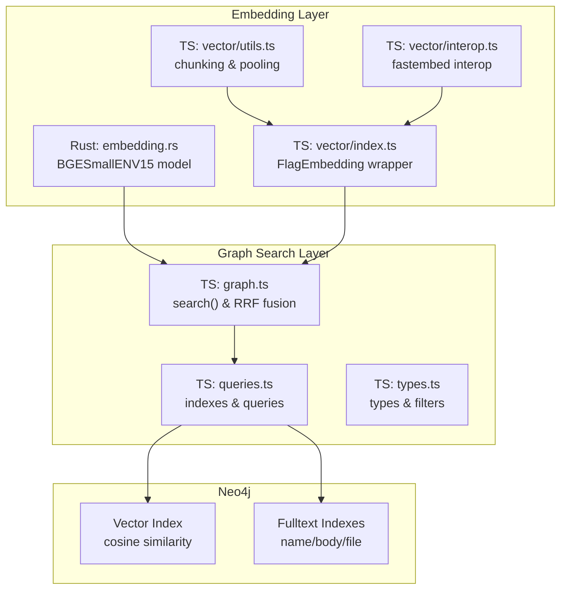
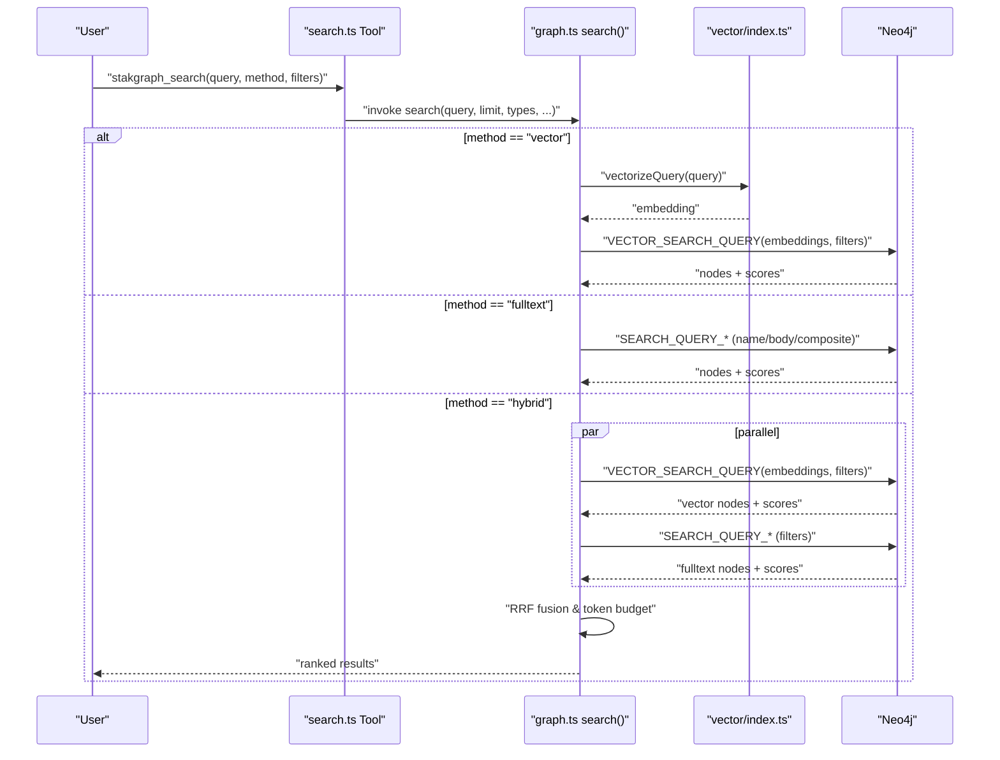
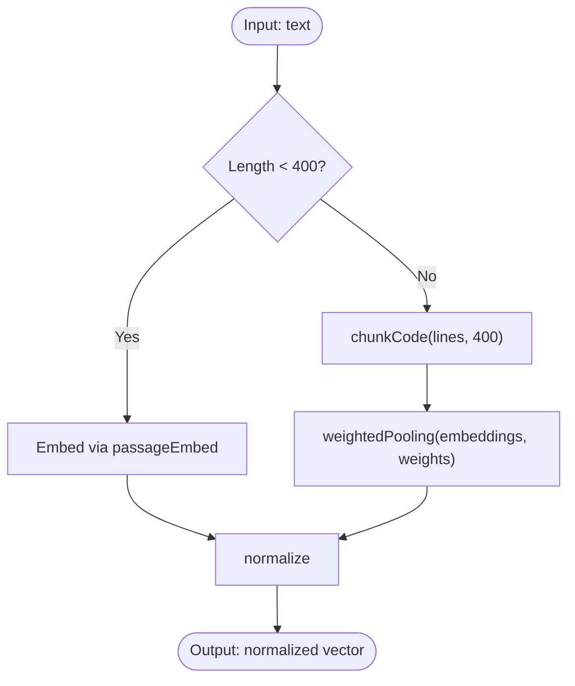
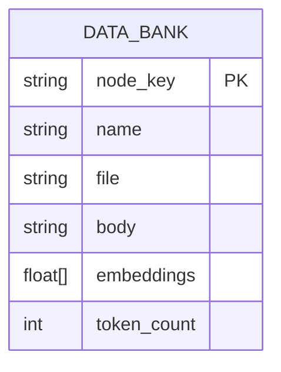
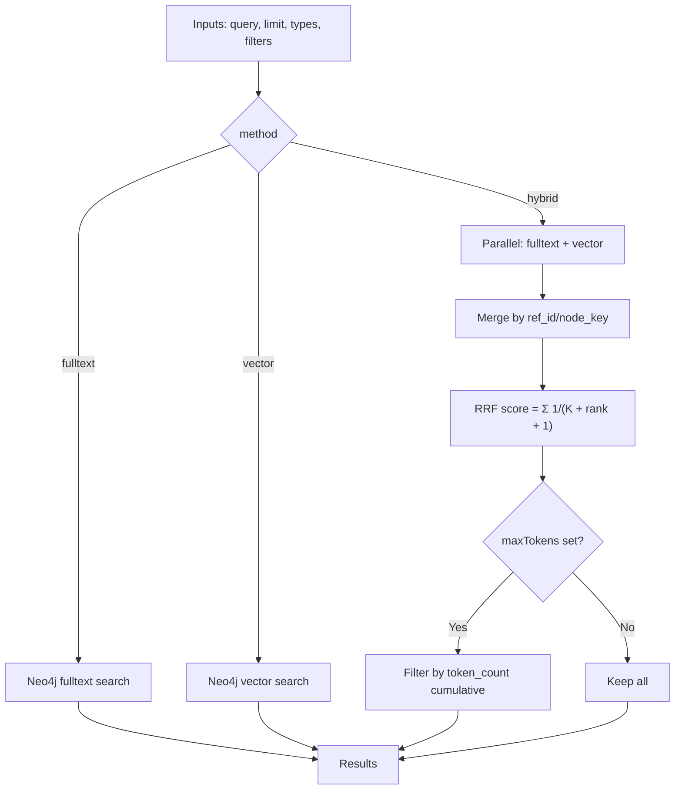
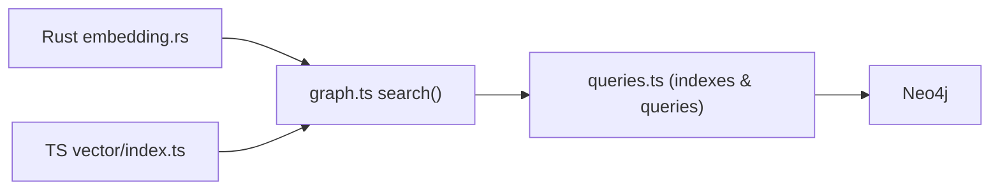

# Semantic Search Algorithms

<cite>
**Referenced Files in This Document**
- [embedding.rs](file://ast/src/lang/embedding.rs)
- [embedding.rs (Neo4j operations)](file://ast/src/lang/graphs/neo4j/operations/embedding.rs)
- [vector/index.ts](file://mcp/src/vector/index.ts)
- [vector/interop.ts](file://mcp/src/vector/interop.ts)
- [vector/utils.ts](file://mcp/src/vector/utils.ts)
- [search.ts](file://mcp/src/tools/stakgraph/search.ts)
- [graph.ts](file://mcp/src/graph/graph.ts)
- [types.ts](file://mcp/src/graph/types.ts)
- [queries.ts](file://mcp/src/graph/queries.ts)
</cite>

## Table of Contents
1. [Introduction](#introduction)
2. [Project Structure](#project-structure)
3. [Core Components](#core-components)
4. [Architecture Overview](#architecture-overview)
5. [Detailed Component Analysis](#detailed-component-analysis)
6. [Dependency Analysis](#dependency-analysis)
7. [Performance Considerations](#performance-considerations)
8. [Troubleshooting Guide](#troubleshooting-guide)
9. [Conclusion](#conclusion)
10. [Appendices](#appendices)

## Introduction
This document explains the semantic search algorithms and implementation in StakGraph. It covers the hybrid search approach that combines vector similarity with full-text search, the end-to-end workflow from natural language queries to vector embeddings and graph traversal, and the integration with Neo4j vector capabilities. It also details relevance scoring, result filtering, and practical guidance for tuning, interpreting, and optimizing search results.

## Project Structure
StakGraph implements semantic search across two complementary layers:
- Embedding generation and preprocessing in Rust and TypeScript
- Graph search orchestration and Neo4j integration in TypeScript

Key modules:
- Embedding utilities and vectorization logic
- Vector index creation and similarity queries in Neo4j
- Hybrid search orchestration and ranking fusion
- Tool schema and invocation for semantic search

**Diagram sources**
- [embedding.rs:1-117](file://ast/src/lang/embedding.rs#L1-L117)
- [vector/index.ts:1-88](file://mcp/src/vector/index.ts#L1-L88)
- [vector/utils.ts:1-71](file://mcp/src/vector/utils.ts#L1-L71)
- [vector/interop.ts:1-7](file://mcp/src/vector/interop.ts#L1-L7)
- [graph.ts:61-140](file://mcp/src/graph/graph.ts#L61-L140)
- [queries.ts:1-120](file://mcp/src/graph/queries.ts#L1-L120)
- [types.ts:1-120](file://mcp/src/graph/types.ts#L1-L120)

**Section sources**
- [embedding.rs:1-117](file://ast/src/lang/embedding.rs#L1-L117)
- [vector/index.ts:1-88](file://mcp/src/vector/index.ts#L1-L88)
- [vector/utils.ts:1-71](file://mcp/src/vector/utils.ts#L1-L71)
- [vector/interop.ts:1-7](file://mcp/src/vector/interop.ts#L1-L7)
- [graph.ts:61-140](file://mcp/src/graph/graph.ts#L61-L140)
- [queries.ts:1-120](file://mcp/src/graph/queries.ts#L1-L120)
- [types.ts:1-120](file://mcp/src/graph/types.ts#L1-L120)

## Core Components
- Embedding generation:
  - Rust BGESmallENV15 model with pooling and normalization for code documents
  - TypeScript FlagEmbedding wrapper with chunking and weighted pooling
- Vectorization:
  - Query vectors and code-document vectors with dimensionality alignment
- Neo4j integration:
  - Fulltext indexes for name/body/file
  - Vector index with cosine similarity
  - Parameterized queries for filtering by node types, extensions, and thresholds
- Hybrid search:
  - Parallel execution of fulltext and vector pipelines
  - Reciprocal Rank Fusion (RRF) scoring with configurable K
  - Token budget filtering to constrain output size

**Section sources**
- [embedding.rs:78-110](file://ast/src/lang/embedding.rs#L78-L110)
- [vector/index.ts:19-87](file://mcp/src/vector/index.ts#L19-L87)
- [vector/utils.ts:1-71](file://mcp/src/vector/utils.ts#L1-L71)
- [queries.ts:32-51](file://mcp/src/graph/queries.ts#L32-L51)
- [graph.ts:59-140](file://mcp/src/graph/graph.ts#L59-L140)

## Architecture Overview
The semantic search pipeline integrates embedding generation, Neo4j indexing, and hybrid retrieval.

**Diagram sources**
- [search.ts:55-76](file://mcp/src/tools/stakgraph/search.ts#L55-L76)
- [graph.ts:61-140](file://mcp/src/graph/graph.ts#L61-L140)
- [vector/index.ts:19-22](file://mcp/src/vector/index.ts#L19-L22)
- [queries.ts:513-534](file://mcp/src/graph/queries.ts#L513-L534)

## Detailed Component Analysis

### Embedding Generation and Vectorization
- Rust implementation:
  - Singleton embedder initialized once with BGESmallENV15
  - Query vectorization produces a fixed-size embedding
  - Code-document vectorization:
    - Chunking by lines up to a default chunk size
    - Weighted pooling favoring the first chunk
    - L2 normalization for unit vectors
- TypeScript implementation:
  - Wrapper around fastembed FlagEmbedding
  - Batch vectorization with short vs long text branching
  - Overlap-aware chunking and weighted pooling
  - Normalization to unit vectors

**Diagram sources**
- [embedding.rs:48-110](file://ast/src/lang/embedding.rs#L48-L110)
- [vector/index.ts:58-87](file://mcp/src/vector/index.ts#L58-L87)
- [vector/utils.ts:21-54](file://mcp/src/vector/utils.ts#L21-L54)

**Section sources**
- [embedding.rs:11-22](file://ast/src/lang/embedding.rs#L11-L22)
- [embedding.rs:78-110](file://ast/src/lang/embedding.rs#L78-L110)
- [vector/index.ts:19-87](file://mcp/src/vector/index.ts#L19-L87)
- [vector/utils.ts:1-71](file://mcp/src/vector/utils.ts#L1-L71)

### Neo4j Vector Index and Similarity Queries
- Index creation:
  - Fulltext indexes on body, name, and composite fields
  - Vector index on embeddings with cosine similarity and fixed dimensions
- Query construction:
  - Node-type inclusion/exclusion filters
  - Extension-based file filtering
  - Threshold-based similarity filtering
  - Limit and ordering by score

**Diagram sources**
- [queries.ts:10-51](file://mcp/src/graph/queries.ts#L10-L51)
- [embedding.rs (Neo4j operations):46-114](file://ast/src/lang/graphs/neo4j/operations/embedding.rs#L46-L114)

**Section sources**
- [queries.ts:32-51](file://mcp/src/graph/queries.ts#L32-L51)
- [embedding.rs (Neo4j operations):46-114](file://ast/src/lang/graphs/neo4j/operations/embedding.rs#L46-L114)

### Hybrid Search Orchestration and Ranking
- Method selection:
  - fulltext: pure keyword search
  - vector: vector similarity
  - hybrid: combine both
- Hybrid pipeline:
  - Run fulltext and vector queries in parallel
  - Merge results by ref_id/node_key
  - Score aggregation using reciprocal rank fusion with K=60
  - Optional token budget filtering to cap total tokens

**Diagram sources**
- [graph.ts:61-140](file://mcp/src/graph/graph.ts#L61-L140)

**Section sources**
- [graph.ts:59-140](file://mcp/src/graph/graph.ts#L59-L140)
- [types.ts:132-156](file://mcp/src/graph/types.ts#L132-L156)

### Tool Schema and Invocation
- Tool input schema supports:
  - query, method (fulltext/vector/hybrid), concise output, node_types filter, limit, max_tokens, language
- The tool delegates to the graph search function and returns a JSON-formatted result payload

**Section sources**
- [search.ts:7-76](file://mcp/src/tools/stakgraph/search.ts#L7-L76)

## Dependency Analysis
- Embedding generation depends on fastembed (Rust) and FlagEmbedding (TypeScript)
- Graph search depends on Neo4j indexes and queries
- Hybrid search composes both pipelines and merges results

**Diagram sources**
- [embedding.rs:1-117](file://ast/src/lang/embedding.rs#L1-L117)
- [vector/index.ts:1-88](file://mcp/src/vector/index.ts#L1-L88)
- [graph.ts:61-140](file://mcp/src/graph/graph.ts#L61-L140)
- [queries.ts:1-120](file://mcp/src/graph/queries.ts#L1-L120)

**Section sources**
- [embedding.rs:1-117](file://ast/src/lang/embedding.rs#L1-L117)
- [vector/index.ts:1-88](file://mcp/src/vector/index.ts#L1-L88)
- [graph.ts:61-140](file://mcp/src/graph/graph.ts#L61-L140)
- [queries.ts:1-120](file://mcp/src/graph/queries.ts#L1-L120)

## Performance Considerations
- Indexing
  - Maintain fulltext indexes on frequently queried fields
  - Use vector index with cosine similarity and correct dimensions
- Query optimization
  - Apply node_types and extension filters early to reduce candidate sets
  - Tune similarity threshold to prune low-relevance results
  - Limit results per pipeline in hybrid mode to reduce merge overhead
- Embedding efficiency
  - Prefer short-text batching for bulk operations
  - Use weighted pooling and normalization consistently
- Hybrid fusion
  - Adjust RRF K to balance between fulltext and vector contributions
  - Use token budget filtering to keep downstream processing efficient

[No sources needed since this section provides general guidance]

## Troubleshooting Guide
- No results or low recall
  - Verify vector index exists and embeddings are populated
  - Confirm similarity threshold is not overly strict
  - Check node_types and language filters
- Slow performance
  - Ensure indexes are created and up to date
  - Reduce limit or enable token budget filtering
  - Consider increasing parallelism for hybrid mode
- Misaligned dimensions
  - Confirm embedding dimension matches vector index configuration
- Debugging search results
  - Inspect raw scores from vector and fulltext pipelines
  - Log merged RRF scores and final filtered set
  - Validate chunking and pooling behavior for long code documents

**Section sources**
- [queries.ts:48-51](file://mcp/src/graph/queries.ts#L48-L51)
- [embedding.rs (Neo4j operations):46-114](file://ast/src/lang/graphs/neo4j/operations/embedding.rs#L46-L114)
- [graph.ts:59-140](file://mcp/src/graph/graph.ts#L59-L140)

## Conclusion
StakGraph implements a robust semantic search system by combining fast, scalable vector similarity with precise full-text search, orchestrated through Neo4j’s native indexes. The hybrid approach leverages reciprocal rank fusion to improve recall and precision, while token budget filtering ensures practical result sizes. With consistent embedding generation, proper indexing, and tuned thresholds, the system delivers high-quality semantic search over code graphs.

[No sources needed since this section summarizes without analyzing specific files]

## Appendices

### Practical Examples
- Natural language to code intent
  - Example: “authentication flow in React”
  - Method: hybrid
  - Filters: node_types include Function, Page, Endpoint
- Code semantics
  - Example: “error handling patterns”
  - Method: vector
  - Filters: language-specific extensions
- Keyword plus semantics
  - Example: “login component”
  - Method: hybrid
  - Filters: node_types include Page, Function

[No sources needed since this section provides general guidance]

### Search Quality Metrics and Continuous Improvement
- Metrics
  - Precision@K and Recall@K on curated datasets
  - Human relevance judgments for hybrid vs vector vs fulltext
  - Latency and throughput under varying limits and filters
- Improvements
  - Evaluate alternative embedding models for code
  - Expand fulltext analyzers and composite indexing
  - Tune similarity thresholds and RRF K empirically
  - Introduce query rewriting and term expansion

[No sources needed since this section provides general guidance]