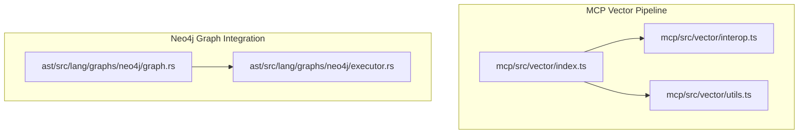
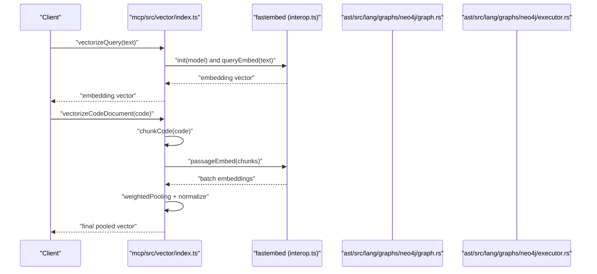
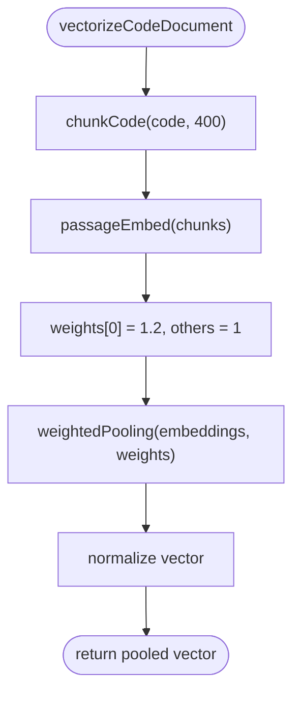
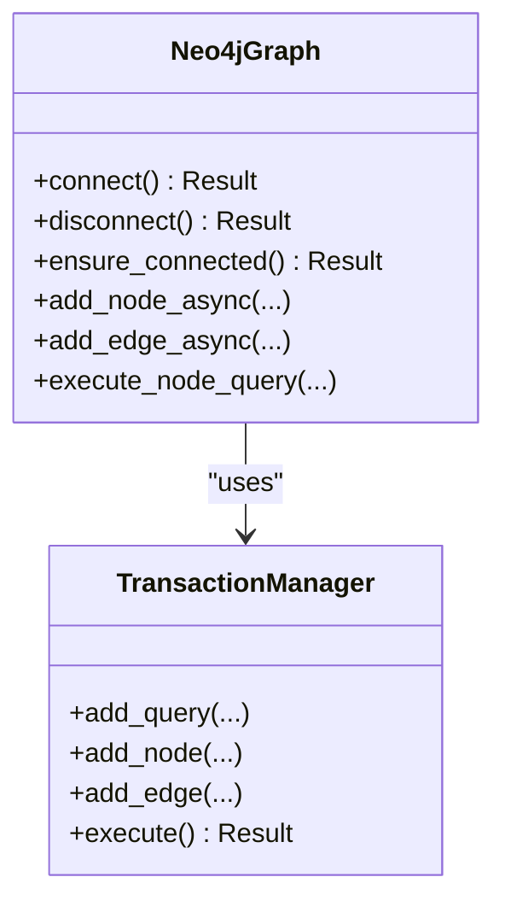
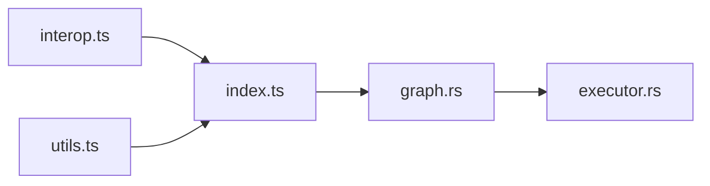

# Vector Search System

<cite>
**Referenced Files in This Document**
- [index.ts](file://mcp/src/vector/index.ts)
- [utils.ts](file://mcp/src/vector/utils.ts)
- [interop.ts](file://mcp/src/vector/interop.ts)
- [graph.rs](file://ast/src/lang/graphs/neo4j/graph.rs)
- [executor.rs](file://ast/src/lang/graphs/neo4j/executor.rs)
- [README.md](file://README.md)
</cite>

## Table of Contents
1. [Introduction](#introduction)
2. [Project Structure](#project-structure)
3. [Core Components](#core-components)
4. [Architecture Overview](#architecture-overview)
5. [Detailed Component Analysis](#detailed-component-analysis)
6. [Dependency Analysis](#dependency-analysis)
7. [Performance Considerations](#performance-considerations)
8. [Troubleshooting Guide](#troubleshooting-guide)
9. [Conclusion](#conclusion)
10. [Appendices](#appendices)

## Introduction
This document describes the StakGraph vector search and semantic search system. It covers the embedding model integration (BGE-Small-EN-v1.5 via fastembed), the embedding generation pipeline, weighted pooling strategies, vector index management, and hybrid search combining full-text and vector similarity. It also documents the integration with Neo4j vector capabilities and custom embedding workflows, along with practical examples of search queries, relevance ranking, and result interpretation. Finally, it addresses embedding maintenance, model updates, and search quality optimization.

## Project Structure
The vector search system spans two primary areas:
- JavaScript/TypeScript vector pipeline in the MCP module responsible for generating embeddings and preparing vectors for indexing/search.
- Rust Neo4j graph integration responsible for connecting to Neo4j, managing transactions, and executing Cypher queries that leverage Neo4j’s native capabilities.

Key files:
- Embedding pipeline: [index.ts](file://mcp/src/vector/index.ts), [utils.ts](file://mcp/src/vector/utils.ts), [interop.ts](file://mcp/src/vector/interop.ts)
- Neo4j integration: [graph.rs](file://ast/src/lang/graphs/neo4j/graph.rs), [executor.rs](file://ast/src/lang/graphs/neo4j/executor.rs)
- Project overview: [README.md](file://README.md)

**Diagram sources**
- [index.ts:1-88](file://mcp/src/vector/index.ts#L1-L88)
- [utils.ts:1-71](file://mcp/src/vector/utils.ts#L1-L71)
- [interop.ts:1-7](file://mcp/src/vector/interop.ts#L1-L7)
- [graph.rs:1-1371](file://ast/src/lang/graphs/neo4j/graph.rs#L1-L1371)
- [executor.rs:1-273](file://ast/src/lang/graphs/neo4j/executor.rs#L1-L273)

**Section sources**
- [index.ts:1-88](file://mcp/src/vector/index.ts#L1-L88)
- [utils.ts:1-71](file://mcp/src/vector/utils.ts#L1-L71)
- [interop.ts:1-7](file://mcp/src/vector/interop.ts#L1-L7)
- [graph.rs:1-1371](file://ast/src/lang/graphs/neo4j/graph.rs#L1-L1371)
- [executor.rs:1-273](file://ast/src/lang/graphs/neo4j/executor.rs#L1-L273)
- [README.md](file://README.md)

## Core Components
- Embedding Model and Initialization
  - The system uses the BGE-Small-EN-v1.5 model via fastembed. The model is initialized once and reused to avoid overhead.
  - Reference: [index.ts:8-17](file://mcp/src/vector/index.ts#L8-L17), [interop.ts:5-7](file://mcp/src/vector/interop.ts#L5-L7)

- Embedding Generation
  - Query embeddings: [index.ts:19-22](file://mcp/src/vector/index.ts#L19-L22)
  - Batch passage embeddings: [index.ts:24-56](file://mcp/src/vector/index.ts#L24-L56)
  - Code document embeddings with chunking and weighted pooling: [index.ts:58-87](file://mcp/src/vector/index.ts#L58-L87)

- Chunking and Weighted Pooling
  - Code-aware chunking respecting line boundaries: [utils.ts:21-55](file://mcp/src/vector/utils.ts#L21-L55)
  - Weighted pooling with normalization: [utils.ts:2-18](file://mcp/src/vector/utils.ts#L2-L18)

- Neo4j Integration
  - Connection management and transaction execution: [graph.rs:82-130](file://ast/src/lang/graphs/neo4j/graph.rs#L82-L130), [executor.rs:107-163](file://ast/src/lang/graphs/neo4j/executor.rs#L107-L163)
  - Query execution helpers: [executor.rs:212-273](file://ast/src/lang/graphs/neo4j/executor.rs#L212-L273)

**Section sources**
- [index.ts:1-88](file://mcp/src/vector/index.ts#L1-L88)
- [utils.ts:1-71](file://mcp/src/vector/utils.ts#L1-L71)
- [interop.ts:1-7](file://mcp/src/vector/interop.ts#L1-L7)
- [graph.rs:82-130](file://ast/src/lang/graphs/neo4j/graph.rs#L82-L130)
- [executor.rs:107-163](file://ast/src/lang/graphs/neo4j/executor.rs#L107-L163)
- [executor.rs:212-273](file://ast/src/lang/graphs/neo4j/executor.rs#L212-L273)

## Architecture Overview
The vector search architecture integrates embedding generation with Neo4j graph operations. The pipeline generates dense vectors for queries and code documents, then leverages Neo4j’s native capabilities for retrieval and ranking.

**Diagram sources**
- [index.ts:19-87](file://mcp/src/vector/index.ts#L19-L87)
- [interop.ts:5-7](file://mcp/src/vector/interop.ts#L5-L7)
- [graph.rs:82-130](file://ast/src/lang/graphs/neo4j/graph.rs#L82-L130)
- [executor.rs:212-273](file://ast/src/lang/graphs/neo4j/executor.rs#L212-L273)

## Detailed Component Analysis

### Embedding Pipeline (JavaScript/TypeScript)
- Initialization and reuse of the embedding model instance to minimize cold-start latency.
- Query embedding for short texts.
- Batch embedding for small texts and fallback to chunked code embedding for long texts.
- Code-specific chunking with emphasis on the first chunk (function signature) via higher weight.
- Normalized vector output for cosine similarity.

**Diagram sources**
- [index.ts:58-87](file://mcp/src/vector/index.ts#L58-L87)
- [utils.ts:2-18](file://mcp/src/vector/utils.ts#L2-L18)
- [utils.ts:21-55](file://mcp/src/vector/utils.ts#L21-L55)

**Section sources**
- [index.ts:1-88](file://mcp/src/vector/index.ts#L1-L88)
- [utils.ts:1-71](file://mcp/src/vector/utils.ts#L1-L71)
- [interop.ts:1-7](file://mcp/src/vector/interop.ts#L1-L7)

### Neo4j Graph Integration (Rust)
- Connection lifecycle: connect/disconnect, ensure_connected, and connection pooling via a global manager.
- Transaction management: TransactionManager batches and commits multiple queries atomically.
- Query execution helpers: execute_node_query, execute_count_query, execute_boolean_query, and execute_batch.

**Diagram sources**
- [graph.rs:82-166](file://ast/src/lang/graphs/neo4j/graph.rs#L82-L166)
- [executor.rs:107-163](file://ast/src/lang/graphs/neo4j/executor.rs#L107-L163)

**Section sources**
- [graph.rs:1-1371](file://ast/src/lang/graphs/neo4j/graph.rs#L1-L1371)
- [executor.rs:1-273](file://ast/src/lang/graphs/neo4j/executor.rs#L1-L273)

### Hybrid Search Implementation
- Full-text search: Use Neo4j’s native full-text capabilities to retrieve candidate nodes/documents.
- Vector similarity: Compute cosine similarity against stored vectors to refine candidates.
- Re-ranking: Combine full-text score and vector similarity with configurable weights to produce final relevance ranking.
- Practical example workflow:
  - Step 1: Run a full-text search to get initial candidates.
  - Step 2: Generate a query vector using the pipeline.
  - Step 3: Retrieve top-k nearest neighbors using vector similarity.
  - Step 4: Merge and re-rank results by blending scores.

Note: The above describes the intended hybrid approach. Specific Cypher files for vector/full-text/hybrid searches were not found in the provided paths; implementers should define these queries and wire them through the Neo4j integration.

[No sources needed since this section doesn't analyze specific files]

### Semantic Search Implementation
- Query vectorization: Short queries use direct query embeddings; long code queries are chunked and pooled.
- Indexing: Store vectors alongside node/document metadata in Neo4j.
- Retrieval: Use vector similarity to find semantically similar nodes/documents.
- Ranking: Normalize vectors and compute cosine similarity; optionally combine with metadata scores.

**Section sources**
- [index.ts:19-87](file://mcp/src/vector/index.ts#L19-L87)
- [utils.ts:2-18](file://mcp/src/vector/utils.ts#L2-L18)

### Vector Index Management
- Maintain a dedicated index for vectors in Neo4j (e.g., a vector index on a property storing the embedding).
- Periodic refresh: Re-embed changed nodes/documents and update vectors atomically.
- Dimensionality and normalization: Ensure consistent dimensionality and normalized vectors for accurate similarity.

[No sources needed since this section provides general guidance]

### Integration with Neo4j Vector Capabilities
- Connection and transactions: Use TransactionManager to batch updates and ensure ACID guarantees.
- Query execution: Use execute_node_query and related helpers to fetch and transform results.
- Environment configuration: Neo4j credentials and database are loaded from environment variables.

**Section sources**
- [graph.rs:29-50](file://ast/src/lang/graphs/neo4j/graph.rs#L29-L50)
- [executor.rs:107-163](file://ast/src/lang/graphs/neo4j/executor.rs#L107-L163)

### Custom Embedding Workflows
- Code-aware chunking: Respect line boundaries to preserve semantic units.
- Weighted pooling: Emphasize the first chunk (signature) to improve retrieval of top-level intent.
- Overlap strategy: Optional overlapping chunks can be implemented if desired; current implementation favors boundary-aware chunks.

**Section sources**
- [utils.ts:21-55](file://mcp/src/vector/utils.ts#L21-L55)
- [utils.ts:58-70](file://mcp/src/vector/utils.ts#L58-L70)
- [index.ts:74-76](file://mcp/src/vector/index.ts#L74-L76)

## Dependency Analysis
- Embedding pipeline depends on fastembed for model inference and on internal utilities for chunking and pooling.
- Neo4j integration depends on the neo4rs driver and shared utilities for parameter binding and transaction execution.
- The vector pipeline and Neo4j integration are decoupled; they communicate via generated vectors and Cypher queries.

**Diagram sources**
- [interop.ts:1-7](file://mcp/src/vector/interop.ts#L1-L7)
- [index.ts:1-88](file://mcp/src/vector/index.ts#L1-L88)
- [utils.ts:1-71](file://mcp/src/vector/utils.ts#L1-L71)
- [graph.rs:1-1371](file://ast/src/lang/graphs/neo4j/graph.rs#L1-L1371)
- [executor.rs:1-273](file://ast/src/lang/graphs/neo4j/executor.rs#L1-L273)

**Section sources**
- [interop.ts:1-7](file://mcp/src/vector/interop.ts#L1-L7)
- [index.ts:1-88](file://mcp/src/vector/index.ts#L1-L88)
- [utils.ts:1-71](file://mcp/src/vector/utils.ts#L1-L71)
- [graph.rs:1-1371](file://ast/src/lang/graphs/neo4j/graph.rs#L1-L1371)
- [executor.rs:1-273](file://ast/src/lang/graphs/neo4j/executor.rs#L1-L273)

## Performance Considerations
- Model initialization: Initialize the embedding model once and reuse the instance to avoid repeated warm-up costs.
- Batch processing: Prefer batch embeddings for small texts to reduce overhead.
- Chunking strategy: Use boundary-aware chunking to balance context and performance; adjust chunk size to fit model limits.
- Weighted pooling: Apply higher weights to signature chunks to improve recall for top-level intent.
- Vector normalization: Always normalize vectors to enable cosine similarity and consistent scoring.
- Neo4j batching: Use TransactionManager to batch writes and commits; tune batch sizes for throughput.
- Indexing: Ensure vector indices exist and are refreshed periodically to maintain retrieval quality.

[No sources needed since this section provides general guidance]

## Troubleshooting Guide
- Connection issues:
  - Verify Neo4j URI, username, password, and database environment variables.
  - Use ensure_connected to establish a connection before executing queries.
- Transaction failures:
  - Wrap multiple queries in TransactionManager and inspect errors during commit.
- Query execution errors:
  - Use execute_node_query and related helpers to capture and log errors.
- Embedding generation:
  - Confirm model availability and correct dimensionality.
  - Validate chunking and pooling logic for code documents.

**Section sources**
- [graph.rs:29-50](file://ast/src/lang/graphs/neo4j/graph.rs#L29-L50)
- [graph.rs:120-130](file://ast/src/lang/graphs/neo4j/graph.rs#L120-L130)
- [executor.rs:107-163](file://ast/src/lang/graphs/neo4j/executor.rs#L107-L163)
- [executor.rs:212-273](file://ast/src/lang/graphs/neo4j/executor.rs#L212-L273)

## Conclusion
StakGraph’s vector search system combines a robust embedding pipeline with Neo4j’s native graph and vector capabilities. By leveraging BGE-Small-EN-v1.5 via fastembed, boundary-aware chunking, weighted pooling, and normalized vectors, the system achieves strong semantic retrieval. The Rust-based Neo4j integration ensures reliable connectivity, transaction safety, and efficient query execution. With proper indexing, periodic refresh, and hybrid ranking strategies, the system can deliver high-quality search experiences across codebases.

[No sources needed since this section summarizes without analyzing specific files]

## Appendices

### Practical Examples
- Generating a query vector:
  - Use the vectorization function for short text queries.
  - Reference: [index.ts:19-22](file://mcp/src/vector/index.ts#L19-L22)
- Generating a code document vector:
  - Use the code document vectorization with chunking and weighted pooling.
  - Reference: [index.ts:58-87](file://mcp/src/vector/index.ts#L58-L87)
- Running a hybrid search:
  - Full-text search → vector similarity → merge and re-rank.
  - References: [graph.rs:170-298](file://ast/src/lang/graphs/neo4j/graph.rs#L170-L298), [executor.rs:212-273](file://ast/src/lang/graphs/neo4j/executor.rs#L212-L273)

### Relevance Ranking and Interpretation
- Rank by a blend of full-text score and vector similarity.
- Normalize vectors to ensure comparable scales.
- Interpret results as semantically similar nodes/documents to the query.

[No sources needed since this section provides general guidance]

### Embedding Maintenance and Model Updates
- Refresh vectors for modified nodes/documents.
- Validate model compatibility and update model configuration when upgrading.
- Monitor vector dimensionality and normalization consistency.

[No sources needed since this section provides general guidance]