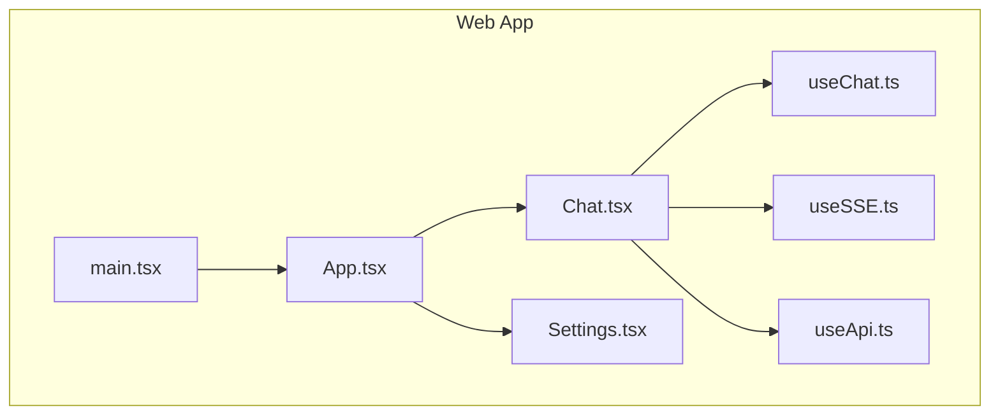
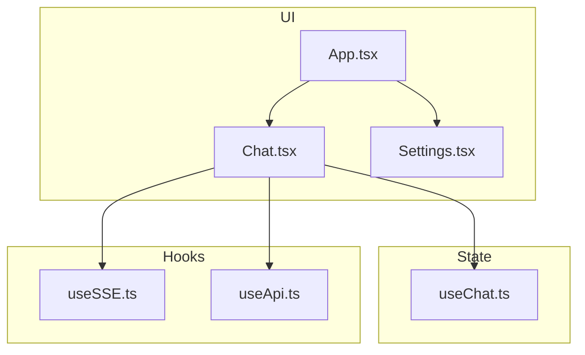
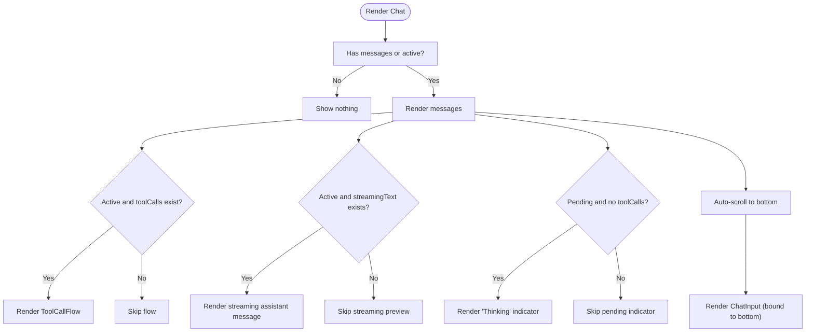
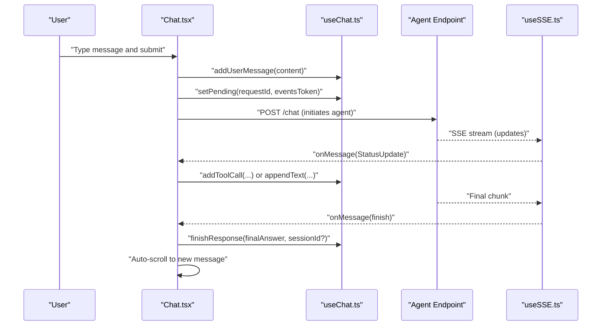
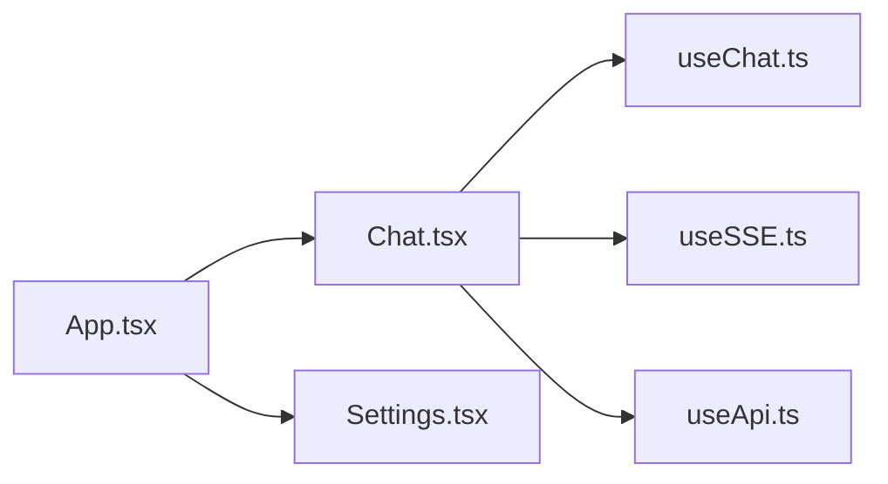

# Agent Chat Interface

<cite>
**Referenced Files in This Document**
- [App.tsx](file://mcp/web/src/App.tsx)
- [main.tsx](file://mcp/web/src/main.tsx)
- [Chat.tsx](file://mcp/web/src/components/chat/Chat.tsx)
- [Settings.tsx](file://mcp/web/src/components/chat/Settings.tsx)
- [useChat.ts](file://mcp/web/src/stores/useChat.ts)
- [useSSE.ts](file://mcp/web/src/hooks/useSSE.ts)
- [useApi.ts](file://mcp/web/src/hooks/useApi.ts)
</cite>

## Table of Contents
1. [Introduction](#introduction)
2. [Project Structure](#project-structure)
3. [Core Components](#core-components)
4. [Architecture Overview](#architecture-overview)
5. [Detailed Component Analysis](#detailed-component-analysis)
6. [Dependency Analysis](#dependency-analysis)
7. [Performance Considerations](#performance-considerations)
8. [Troubleshooting Guide](#troubleshooting-guide)
9. [Conclusion](#conclusion)
10. [Appendices](#appendices)

## Introduction
This document describes the StakGraph agent chat interface system. It covers the real-time chat component architecture, message handling, agent interaction patterns, tool call flow visualization, message threading, and conversation state management. It also explains WebSocket/SSE integration for real-time communication, message formatting, user input handling, customization APIs for appearance and behavior, persistence and history, error handling, and performance considerations for long conversations. Finally, it provides examples for extending the chat interface and adding custom agent capabilities.

## Project Structure
The chat interface is part of the web application built with React and Zustand for state management. The main application component integrates the chat overlay into the graph view. Stores manage conversation state, and hooks encapsulate SSE and API interactions.

**Diagram sources**
- [App.tsx:1-180](file://mcp/web/src/App.tsx#L1-L180)
- [main.tsx:1-11](file://mcp/web/src/main.tsx#L1-L11)
- [Chat.tsx:1-104](file://mcp/web/src/components/chat/Chat.tsx#L1-L104)
- [Settings.tsx:1-101](file://mcp/web/src/components/chat/Settings.tsx#L1-L101)
- [useChat.ts:1-146](file://mcp/web/src/stores/useChat.ts#L1-L146)
- [useSSE.ts:1-64](file://mcp/web/src/hooks/useSSE.ts#L1-L64)
- [useApi.ts:1-40](file://mcp/web/src/hooks/useApi.ts#L1-L40)

**Section sources**
- [App.tsx:1-180](file://mcp/web/src/App.tsx#L1-L180)
- [main.tsx:1-11](file://mcp/web/src/main.tsx#L1-L11)

## Core Components
- Chat overlay: Renders message history, streaming assistant text, tool call flow visualization, and the input area. It auto-scrolls to keep the latest content visible.
- Settings panel: Provides toggles and inputs for model selection and credentials, stored locally in the browser.
- Zustand store (useChat): Centralized state for messages, tool calls, streaming text, agent status, request/session identifiers, and error messages. Exposes actions to mutate state.
- SSE hook (useSSE): Manages a server-sent events connection with automatic retries and error handling.
- API hook (useApi): Generic fetch wrapper for API resources with loading/error states and refetch capability.

Key responsibilities:
- Message threading: Messages are appended with unique IDs and timestamps; assistant replies are finalized after streaming completes.
- Tool call flow: Tool call events are accumulated during streaming and rendered as a flow visualization.
- Conversation state: Tracks pending/streaming/done/error states, request/session IDs, and JWT tokens for event streams.
- Real-time updates: SSE receives incremental status updates; API hook supports resource fetching.

**Section sources**
- [Chat.tsx:1-104](file://mcp/web/src/components/chat/Chat.tsx#L1-L104)
- [Settings.tsx:1-101](file://mcp/web/src/components/chat/Settings.tsx#L1-L101)
- [useChat.ts:1-146](file://mcp/web/src/stores/useChat.ts#L1-L146)
- [useSSE.ts:1-64](file://mcp/web/src/hooks/useSSE.ts#L1-L64)
- [useApi.ts:1-40](file://mcp/web/src/hooks/useApi.ts#L1-L40)

## Architecture Overview
The chat system integrates tightly with the application layout. The Chat component is overlaid on the graph scene and becomes active when the graph view is shown. It consumes state from the useChat store and interacts with agent endpoints via hooks.

**Diagram sources**
- [App.tsx:1-180](file://mcp/web/src/App.tsx#L1-L180)
- [Chat.tsx:1-104](file://mcp/web/src/components/chat/Chat.tsx#L1-L104)
- [Settings.tsx:1-101](file://mcp/web/src/components/chat/Settings.tsx#L1-L101)
- [useChat.ts:1-146](file://mcp/web/src/stores/useChat.ts#L1-L146)
- [useSSE.ts:1-64](file://mcp/web/src/hooks/useSSE.ts#L1-L64)
- [useApi.ts:1-40](file://mcp/web/src/hooks/useApi.ts#L1-L40)

## Detailed Component Analysis

### Chat Overlay Component
The Chat component renders:
- Message history list
- Tool call flow visualization during active requests
- Streaming text preview
- Pending “Thinking” indicator
- Clear chat button
- Input area bound to the bottom

Behavior highlights:
- Auto-scroll to the latest content using a ref to a sentinel div
- Conditional rendering based on active status and presence of messages
- Delegates sending and clearing actions to the agent chat hook/store

**Diagram sources**
- [Chat.tsx:17-20](file://mcp/web/src/components/chat/Chat.tsx#L17-L20)
- [Chat.tsx:26-64](file://mcp/web/src/components/chat/Chat.tsx#L26-L64)
- [Chat.tsx:80-87](file://mcp/web/src/components/chat/Chat.tsx#L80-L87)

**Section sources**
- [Chat.tsx:1-104](file://mcp/web/src/components/chat/Chat.tsx#L1-L104)

### Settings Panel
The Settings panel provides:
- Model selection dropdown
- API key input (stored locally)
- GitHub token input (stored locally)
- Click-outside-to-close behavior

It reads and writes settings via a settings store (not included here) and exposes setters for model, API key, and GitHub token.

**Section sources**
- [Settings.tsx:1-101](file://mcp/web/src/components/chat/Settings.tsx#L1-L101)

### Zustand Store: useChat
State shape and actions:
- Messages: array of user/assistant entries with IDs and timestamps
- Tool calls: array of tool call events for the current request
- Streaming text: accumulated assistant text chunks
- Status: idle/pending/streaming/done/error
- Request/session identifiers and event token for SSE
- Error message for display

Actions:
- addUserMessage(content)
- setPending(requestId, eventsToken)
- setStreaming()
- addToolCall(toolCallEvent)
- appendText(textChunk)
- finishResponse(finalAnswer?, sessionId?)
- setError(message)
- clearChat()

Thread safety and immutability:
- All state updates are performed via Zustand’s functional updates
- New message IDs are generated incrementally

Conversation lifecycle:
- Transition from pending to streaming upon receiving SSE events
- Finalize with finishResponse, appending the assistant message
- Reset toolCalls and streamingText after completion

**Section sources**
- [useChat.ts:1-146](file://mcp/web/src/stores/useChat.ts#L1-L146)

### SSE Hook: useSSE
Responsibilities:
- Establishes an EventSource connection to the given URL
- Parses incoming messages as StatusUpdate objects
- Retries on error with exponential backoff-like cadence
- Limits consecutive errors and invokes an onError callback

Integration pattern:
- The hook is used by components that need to subscribe to agent progress/status updates
- It maintains refs to callbacks to avoid stale closures

**Section sources**
- [useSSE.ts:1-64](file://mcp/web/src/hooks/useSSE.ts#L1-L64)

### API Hook: useApi
Responsibilities:
- Fetches data from a given path under the configured base URL
- Manages loading/error states and exposes a refetch function
- Re-fetches when the path or internal tick changes

Usage:
- Useful for retrieving metadata or auxiliary resources needed by the chat UI

**Section sources**
- [useApi.ts:1-40](file://mcp/web/src/hooks/useApi.ts#L1-L40)

### Application Integration
The App component:
- Determines initial view based on whether graph data exists
- Switches to the graph view after ingestion completes
- Renders the Chat overlay when the graph view is active
- Integrates the Settings toggle in the header

**Section sources**
- [App.tsx:18-53](file://mcp/web/src/App.tsx#L18-L53)
- [App.tsx:108-176](file://mcp/web/src/App.tsx#L108-L176)

## Architecture Overview

**Diagram sources**
- [Chat.tsx:10-11](file://mcp/web/src/components/chat/Chat.tsx#L10-L11)
- [useChat.ts:56-113](file://mcp/web/src/stores/useChat.ts#L56-L113)
- [useSSE.ts:35-42](file://mcp/web/src/hooks/useSSE.ts#L35-L42)

## Detailed Component Analysis

### Message Threading and Formatting
- Each message carries a unique ID, role (user/assistant), content, and timestamp.
- Assistant messages are appended either from the final SSE response or from accumulated streaming text.
- The UI distinguishes between persisted messages and streaming previews.

Best practices:
- Always append assistant messages after streaming completes.
- Preserve streaming text until finalization to avoid flicker.

**Section sources**
- [useChat.ts:3-8](file://mcp/web/src/stores/useChat.ts#L3-L8)
- [useChat.ts:93-113](file://mcp/web/src/stores/useChat.ts#L93-L113)
- [Chat.tsx:39-49](file://mcp/web/src/components/chat/Chat.tsx#L39-L49)

### Tool Call Flow Visualization
- During active requests, tool call events are accumulated and rendered as a flow visualization component.
- The visualization appears alongside messages while the agent is processing.

Extensibility:
- Extend the visualization component to represent new tool types or add richer UI affordances.

**Section sources**
- [Chat.tsx:34-36](file://mcp/web/src/components/chat/Chat.tsx#L34-L36)
- [useChat.ts:10-15](file://mcp/web/src/stores/useChat.ts#L10-L15)

### Conversation State Management
- Status transitions: idle → pending → streaming → done/error
- Request/session IDs and event tokens enable per-request subscriptions and multi-turn conversations
- Error state appends an assistant message indicating failure

Persistence:
- The store does not persist to disk; it resets on page refresh. To persist, integrate a storage layer (e.g., localStorage) and hydrate on mount.

**Section sources**
- [useChat.ts:17](file://mcp/web/src/stores/useChat.ts#L17)
- [useChat.ts:69-77](file://mcp/web/src/stores/useChat.ts#L69-L77)
- [useChat.ts:115-132](file://mcp/web/src/stores/useChat.ts#L115-L132)

### WebSocket/SSE Integration
- The SSE hook manages the EventSource lifecycle, parsing JSON messages and handling errors.
- The chat subscribes to updates while a request is pending/streaming.
- Retry logic prevents immediate failure from terminating the session.

Operational notes:
- Ensure the backend emits structured StatusUpdate messages.
- Consider adding heartbeat or keep-alive if the server supports it.

**Section sources**
- [useSSE.ts:15-63](file://mcp/web/src/hooks/useSSE.ts#L15-L63)

### User Input Handling
- The input area is disabled while the agent is processing to prevent concurrent submissions.
- On send, the component dispatches actions to add a user message and initiate the request.

Accessibility:
- Ensure keyboard navigation and screen reader support for the input and buttons.

**Section sources**
- [Chat.tsx:82](file://mcp/web/src/components/chat/Chat.tsx#L82)

### Component APIs for Customization
Appearance and behavior:
- Modify the Chat component’s container styles and layout to fit your design system.
- Replace or extend the ToolCallFlow component to visualize tool invocations differently.
- Customize the Settings panel to add new configuration options.

Agent responses:
- Extend the store actions to handle new response types (e.g., suggestions, citations).
- Add new message roles or content formats in the message renderer.

Custom tools:
- Emit tool call events via SSE and accumulate them in the store.
- Render tool call flow and results in the UI.

**Section sources**
- [Chat.tsx:22-87](file://mcp/web/src/components/chat/Chat.tsx#L22-L87)
- [useChat.ts:34-42](file://mcp/web/src/stores/useChat.ts#L34-L42)

## Dependency Analysis

**Diagram sources**
- [Chat.tsx:1-104](file://mcp/web/src/components/chat/Chat.tsx#L1-L104)
- [useChat.ts:1-146](file://mcp/web/src/stores/useChat.ts#L1-L146)
- [useSSE.ts:1-64](file://mcp/web/src/hooks/useSSE.ts#L1-L64)
- [useApi.ts:1-40](file://mcp/web/src/hooks/useApi.ts#L1-L40)
- [App.tsx:1-180](file://mcp/web/src/App.tsx#L1-L180)
- [Settings.tsx:1-101](file://mcp/web/src/components/chat/Settings.tsx#L1-L101)

**Section sources**
- [Chat.tsx:1-104](file://mcp/web/src/components/chat/Chat.tsx#L1-L104)
- [useChat.ts:1-146](file://mcp/web/src/stores/useChat.ts#L1-L146)
- [useSSE.ts:1-64](file://mcp/web/src/hooks/useSSE.ts#L1-L64)
- [useApi.ts:1-40](file://mcp/web/src/hooks/useApi.ts#L1-L40)
- [App.tsx:1-180](file://mcp/web/src/App.tsx#L1-L180)
- [Settings.tsx:1-101](file://mcp/web/src/components/chat/Settings.tsx#L1-L101)

## Performance Considerations
- Virtualization: For long histories, consider virtualizing the message list to reduce DOM nodes.
- Debouncing: Debounce rapid SSE updates if the UI needs to re-render frequently.
- Memoization: Memoize message rendering props to avoid unnecessary re-renders.
- Cleanup: Ensure SSE connections are closed on unmount and when switching views.
- Memory: Periodically trim old messages to cap memory usage in long sessions.

## Troubleshooting Guide
Common issues and remedies:
- Cannot connect to SSE: The hook retries up to a threshold and reports a generic error. Verify the endpoint and network connectivity.
- Messages not appearing: Confirm that the store’s status transitions to streaming and that finishResponse is called with the final answer.
- Tool call flow not visible: Ensure tool call events are emitted and accumulated in the store while the agent is active.
- Settings not persisting: The Settings panel stores values locally; confirm browser storage is enabled and not cleared.

**Section sources**
- [useSSE.ts:45-53](file://mcp/web/src/hooks/useSSE.ts#L45-L53)
- [useChat.ts:93-113](file://mcp/web/src/stores/useChat.ts#L93-L113)
- [Settings.tsx:84-97](file://mcp/web/src/components/chat/Settings.tsx#L84-L97)

## Conclusion
The StakGraph chat interface combines a reactive UI with a robust state model and SSE-driven updates. Its modular design enables easy customization of appearance, agent responses, and tool integrations. By leveraging the provided hooks and store, developers can extend the system for advanced agent capabilities and long-running conversations while maintaining responsiveness and reliability.

## Appendices

### Extending the Chat Interface
- Add a new tool visualization: Extend the tool call flow component to render richer tool invocation details.
- Integrate a new agent mode: Emit new SSE statuses and map them to store actions to reflect new agent behaviors.
- Persist chat: Add a persistence layer to hydrate the store on load and periodically save state.

### Adding Custom Agent Capabilities
- Emit structured SSE updates representing new steps or outputs.
- Accumulate tool call events and finalize with a summary message.
- Provide a settings field for agent-specific parameters and pass them to the backend.