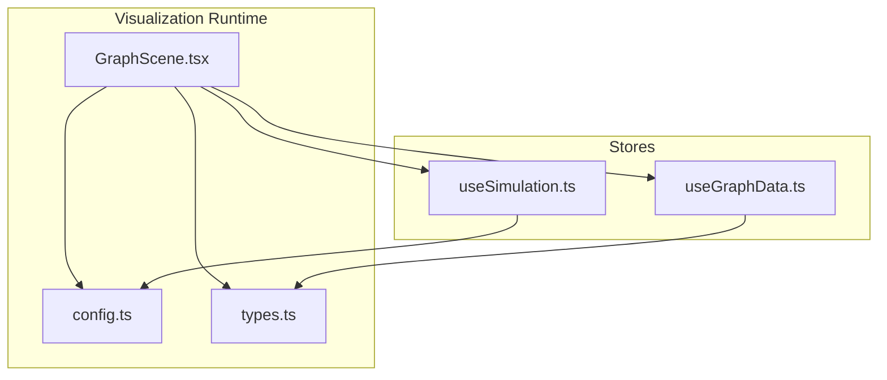
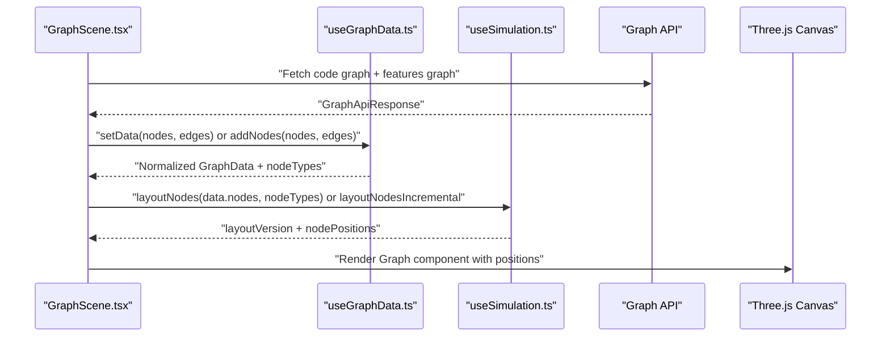
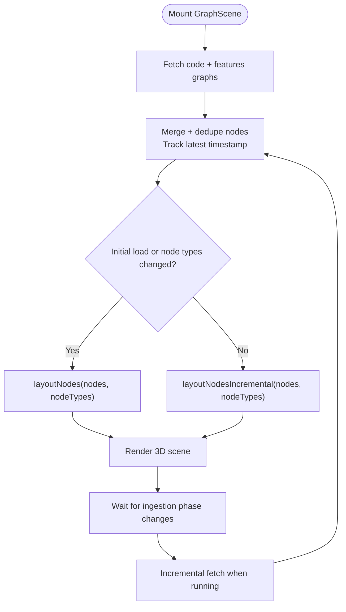
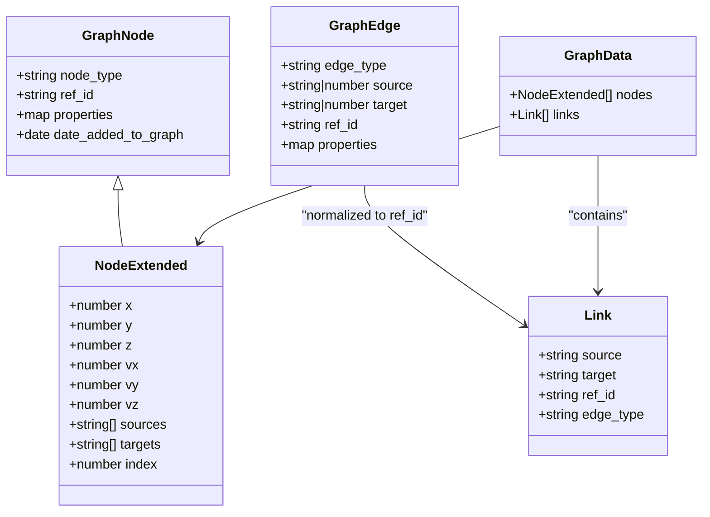
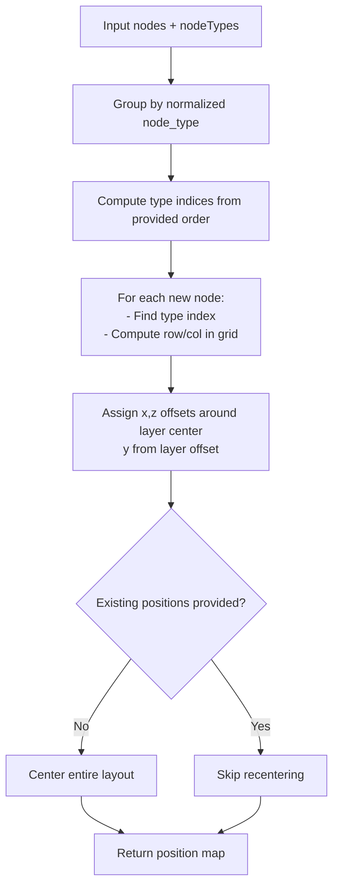
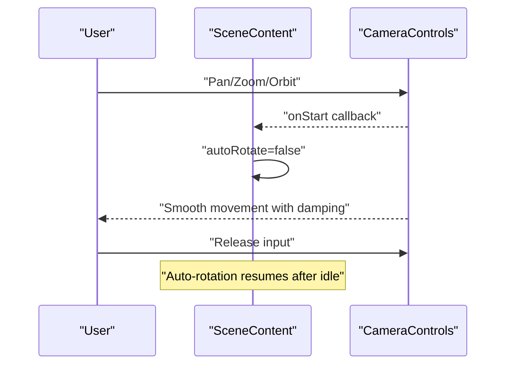
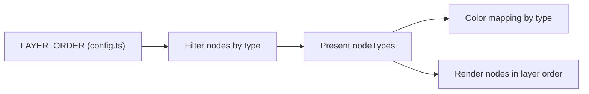
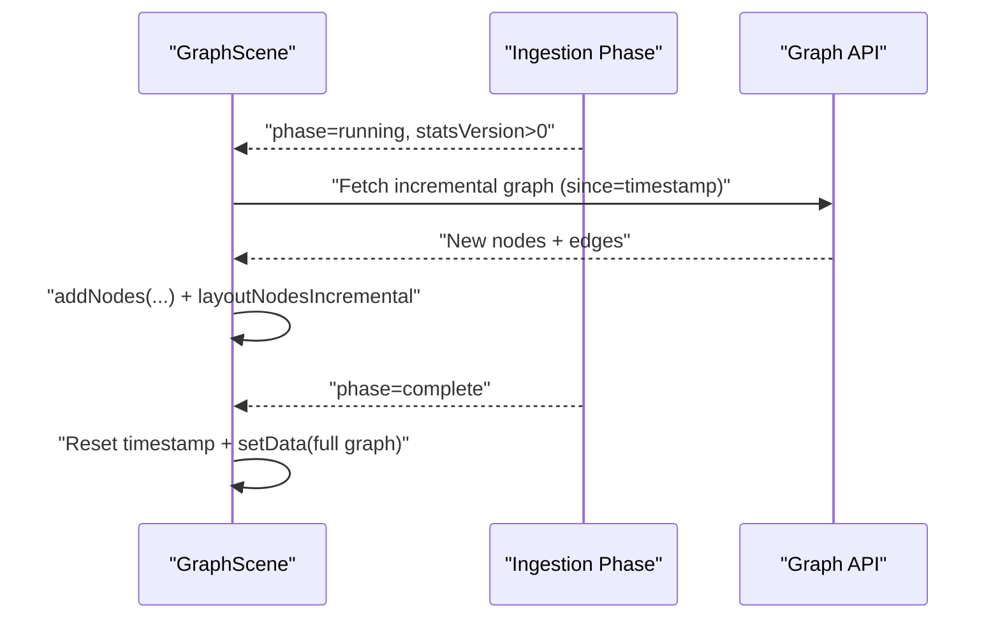
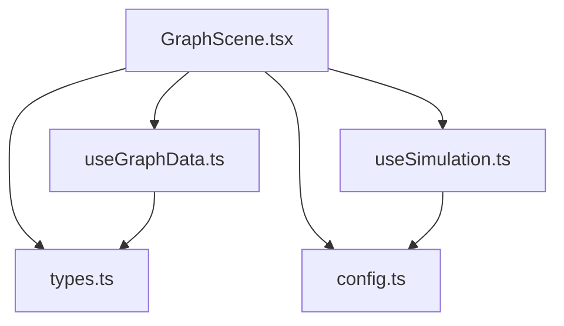

# Graph Visualization

<cite>
**Referenced Files in This Document**
- [GraphScene.tsx](file://mcp/web/src/graph/GraphScene.tsx)
- [types.ts](file://mcp/web/src/graph/types.ts)
- [config.ts](file://mcp/web/src/graph/config.ts)
- [useGraphData.ts](file://mcp/web/src/stores/useGraphData.ts)
- [useSimulation.ts](file://mcp/web/src/stores/useSimulation.ts)
</cite>

## Table of Contents
1. [Introduction](#introduction)
2. [Project Structure](#project-structure)
3. [Core Components](#core-components)
4. [Architecture Overview](#architecture-overview)
5. [Detailed Component Analysis](#detailed-component-analysis)
6. [Dependency Analysis](#dependency-analysis)
7. [Performance Considerations](#performance-considerations)
8. [Troubleshooting Guide](#troubleshooting-guide)
9. [Conclusion](#conclusion)

## Introduction
This document describes the StakGraph graph visualization system with a focus on the GraphScene component architecture, interactive node rendering, and edge relationship mapping. It explains the three-layer visualization system (edges, nodes, labels), layer toggle functionality, and real-time graph updates. It also covers the deterministic grid-based layout, zoom and pan controls, node selection mechanisms, and the component APIs for customizing visual appearance, handling user interactions, and integrating with the underlying graph data. Finally, it addresses performance optimization for large graphs, responsive design considerations, and accessibility features for visual graph exploration.

## Project Structure
The graph visualization is implemented in a React + Three.js stack using @react-three/fiber and @react-three/drei. The core runtime is composed of:
- GraphScene: orchestrates data fetching, layout computation, camera controls, and rendering canvas
- Stores: manage graph data normalization, selection/highlight state, and layout positions
- Types and Config: define the data model and constants for rendering and layout

**Diagram sources**
- [GraphScene.tsx:1-221](file://mcp/web/src/graph/GraphScene.tsx#L1-L221)
- [config.ts:1-46](file://mcp/web/src/graph/config.ts#L1-L46)
- [types.ts:1-75](file://mcp/web/src/graph/types.ts#L1-L75)
- [useGraphData.ts:1-294](file://mcp/web/src/stores/useGraphData.ts#L1-L294)
- [useSimulation.ts:1-137](file://mcp/web/src/stores/useSimulation.ts#L1-L137)

**Section sources**
- [GraphScene.tsx:1-221](file://mcp/web/src/graph/GraphScene.tsx#L1-L221)
- [config.ts:1-46](file://mcp/web/src/graph/config.ts#L1-L46)
- [types.ts:1-75](file://mcp/web/src/graph/types.ts#L1-L75)
- [useGraphData.ts:1-294](file://mcp/web/src/stores/useGraphData.ts#L1-L294)
- [useSimulation.ts:1-137](file://mcp/web/src/stores/useSimulation.ts#L1-L137)

## Core Components
- GraphScene: renders the 3D scene, manages camera controls, orchestrates data fetching and layout, and handles real-time updates
- useGraphData: normalizes graph data, resolves edges, maintains selection/highlight state, and exposes color mapping by node type
- useSimulation: computes deterministic grid-based layouts for nodes and maintains a mutable position map for rendering
- Types: defines the canonical graph node/edge/link structures and API response shape
- Config: centralizes constants for layers, camera, layout spacing, and visual defaults

Key responsibilities:
- Data ingestion: merges two graph sources, deduplicates nodes, and tracks timestamps for incremental updates
- Layout: computes a layered grid layout and supports incremental updates to avoid jitter during live ingestion
- Rendering: drives Three.js via @react-three/fiber, with camera controls and adaptive DPR
- Interactions: selection and highlighting, with optional auto-rotation and manual camera control

**Section sources**
- [GraphScene.tsx:52-221](file://mcp/web/src/graph/GraphScene.tsx#L52-L221)
- [useGraphData.ts:75-294](file://mcp/web/src/stores/useGraphData.ts#L75-L294)
- [useSimulation.ts:110-137](file://mcp/web/src/stores/useSimulation.ts#L110-L137)
- [types.ts:51-75](file://mcp/web/src/graph/types.ts#L51-L75)
- [config.ts:1-46](file://mcp/web/src/graph/config.ts#L1-L46)

## Architecture Overview
The visualization pipeline integrates data fetching, normalization, layout computation, and rendering:

**Diagram sources**
- [GraphScene.tsx:65-172](file://mcp/web/src/graph/GraphScene.tsx#L65-L172)
- [useGraphData.ts:75-238](file://mcp/web/src/stores/useGraphData.ts#L75-L238)
- [useSimulation.ts:110-130](file://mcp/web/src/stores/useSimulation.ts#L110-L130)

## Detailed Component Analysis

### GraphScene: orchestration and runtime
Responsibilities:
- Fetches graph data from two endpoints, merges and deduplicates nodes, and tracks the latest timestamp for incremental updates
- Chooses between full layout and incremental layout depending on initial load and node type changes
- Manages camera controls with auto-rotation and manual overrides
- Renders the 3D scene with adaptive DPR and preloading

Real-time update flow:
- On ingestion phase transitions, triggers incremental fetches
- After ingestion completion, resets incremental state and performs a full reload

**Diagram sources**
- [GraphScene.tsx:65-172](file://mcp/web/src/graph/GraphScene.tsx#L65-L172)
- [useSimulation.ts:110-130](file://mcp/web/src/stores/useSimulation.ts#L110-L130)

**Section sources**
- [GraphScene.tsx:65-172](file://mcp/web/src/graph/GraphScene.tsx#L65-L172)
- [GraphScene.tsx:204-217](file://mcp/web/src/graph/GraphScene.tsx#L204-L217)

### Data Model and Edge Resolution
The system normalizes nodes and edges, resolves source/target identifiers, and builds adjacency lists for efficient traversal. It filters nodes to those present in the configured layer order and computes a compact link representation.

Highlights:
- Nodes extended with spatial and adjacency metadata
- Edges resolved to ref_id pairs, with duplicate filtering
- Node type filtering to configured layer order
- Color mapping by node type for consistent visuals

**Diagram sources**
- [types.ts:2-54](file://mcp/web/src/graph/types.ts#L2-L54)

**Section sources**
- [types.ts:2-54](file://mcp/web/src/graph/types.ts#L2-L54)
- [useGraphData.ts:75-153](file://mcp/web/src/stores/useGraphData.ts#L75-L153)
- [useGraphData.ts:155-238](file://mcp/web/src/stores/useGraphData.ts#L155-L238)

### Layout Engine: Deterministic Grid-Based Placement
The layout engine assigns nodes to layers and arranges them in a square grid per layer. It supports:
- Full layout: centers the entire graph for a stable initial view
- Incremental layout: preserves existing positions and only lays out new nodes

**Diagram sources**
- [useSimulation.ts:15-95](file://mcp/web/src/stores/useSimulation.ts#L15-L95)
- [config.ts:36-45](file://mcp/web/src/graph/config.ts#L36-L45)

**Section sources**
- [useSimulation.ts:15-95](file://mcp/web/src/stores/useSimulation.ts#L15-L95)
- [config.ts:36-45](file://mcp/web/src/graph/config.ts#L36-L45)

### Camera Controls and Interaction Surface
- Auto-rotation enabled by default; pauses while user interacts
- Smooth damping and distance limits for comfortable navigation
- Dolly-to-cursor for precise zooming toward pointer
- Optional auto-focus behavior can be integrated by resolving camera target to selected node

**Diagram sources**
- [GraphScene.tsx:24-48](file://mcp/web/src/graph/GraphScene.tsx#L24-L48)
- [config.ts:27-34](file://mcp/web/src/graph/config.ts#L27-L34)

**Section sources**
- [GraphScene.tsx:24-48](file://mcp/web/src/graph/GraphScene.tsx#L24-L48)
- [config.ts:27-34](file://mcp/web/src/graph/config.ts#L27-L34)

### Layer Toggle and Visual Hierarchy
- Layer ordering is defined centrally and determines both rendering order and node type filtering
- Only nodes present in the configured layer order are included in the graph
- Color palette is mapped per node type for consistent visual semantics

**Diagram sources**
- [config.ts:2-25](file://mcp/web/src/graph/config.ts#L2-L25)
- [useGraphData.ts:16-38](file://mcp/web/src/stores/useGraphData.ts#L16-L38)
- [useGraphData.ts:139-145](file://mcp/web/src/stores/useGraphData.ts#L139-L145)

**Section sources**
- [config.ts:2-25](file://mcp/web/src/graph/config.ts#L2-L25)
- [useGraphData.ts:16-38](file://mcp/web/src/stores/useGraphData.ts#L16-L38)
- [useGraphData.ts:139-145](file://mcp/web/src/stores/useGraphData.ts#L139-L145)

### Real-Time Updates and Incremental Ingestion
- Timestamp tracking ensures incremental fetches include only newly added nodes
- After ingestion completes, the system clears incremental state and reloads to include all nodes
- Incremental layout avoids moving existing nodes, minimizing visual disruption

**Diagram sources**
- [GraphScene.tsx:135-151](file://mcp/web/src/graph/GraphScene.tsx#L135-L151)
- [GraphScene.tsx:113-117](file://mcp/web/src/graph/GraphScene.tsx#L113-L117)

**Section sources**
- [GraphScene.tsx:135-151](file://mcp/web/src/graph/GraphScene.tsx#L135-L151)
- [GraphScene.tsx:113-117](file://mcp/web/src/graph/GraphScene.tsx#L113-L117)

## Dependency Analysis
The following diagram shows the primary dependencies among the core modules:

**Diagram sources**
- [GraphScene.tsx:1-221](file://mcp/web/src/graph/GraphScene.tsx#L1-L221)
- [useGraphData.ts:1-294](file://mcp/web/src/stores/useGraphData.ts#L1-L294)
- [useSimulation.ts:1-137](file://mcp/web/src/stores/useSimulation.ts#L1-L137)
- [config.ts:1-46](file://mcp/web/src/graph/config.ts#L1-L46)
- [types.ts:1-75](file://mcp/web/src/graph/types.ts#L1-L75)

**Section sources**
- [GraphScene.tsx:1-221](file://mcp/web/src/graph/GraphScene.tsx#L1-L221)
- [useGraphData.ts:1-294](file://mcp/web/src/stores/useGraphData.ts#L1-L294)
- [useSimulation.ts:1-137](file://mcp/web/src/stores/useSimulation.ts#L1-L137)
- [config.ts:1-46](file://mcp/web/src/graph/config.ts#L1-L46)
- [types.ts:1-75](file://mcp/web/src/graph/types.ts#L1-L75)

## Performance Considerations
- Incremental layout: preserves existing node positions to avoid visual jitter during live updates
- Deduplication and incremental node/edge addition prevent redundant work and maintain stable IDs
- Adaptive DPR and preload reduce rendering overhead and improve responsiveness
- Filtering nodes to configured layer order reduces draw complexity
- Mutable position map avoids triggering React re-renders while enabling efficient imperative updates

Recommendations:
- For very large graphs, consider partitioning the graph or using LOD techniques
- Batch updates to the position map and throttle layout recalculations
- Use selective re-rendering strategies for labels and edges if adding thousands of labels

[No sources needed since this section provides general guidance]

## Troubleshooting Guide
Common issues and remedies:
- Empty or loading state: verify API endpoints and network connectivity; check ingestion phase state
- Jitter during live updates: ensure incremental layout is used and that existing positions are preserved
- Incorrect node types: confirm node_type values match the configured layer order
- Edge resolution failures: verify that edges reference either ref_id or node_key present in nodes

**Section sources**
- [GraphScene.tsx:174-200](file://mcp/web/src/graph/GraphScene.tsx#L174-L200)
- [useGraphData.ts:100-137](file://mcp/web/src/stores/useGraphData.ts#L100-L137)
- [useSimulation.ts:121-130](file://mcp/web/src/stores/useSimulation.ts#L121-L130)

## Conclusion
StakGraph’s visualization system combines a robust data normalization layer, a deterministic grid-based layout engine, and a responsive 3D rendering pipeline. The design supports real-time updates with minimal disruption, offers clear layering and color semantics, and provides a solid foundation for customization and performance tuning. The modular architecture enables straightforward extension for advanced interaction modes, accessibility enhancements, and further optimization strategies.