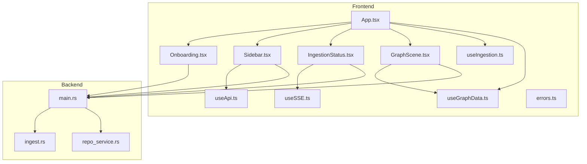
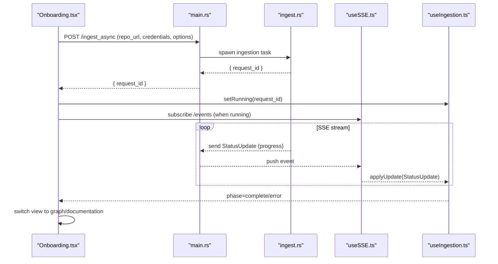
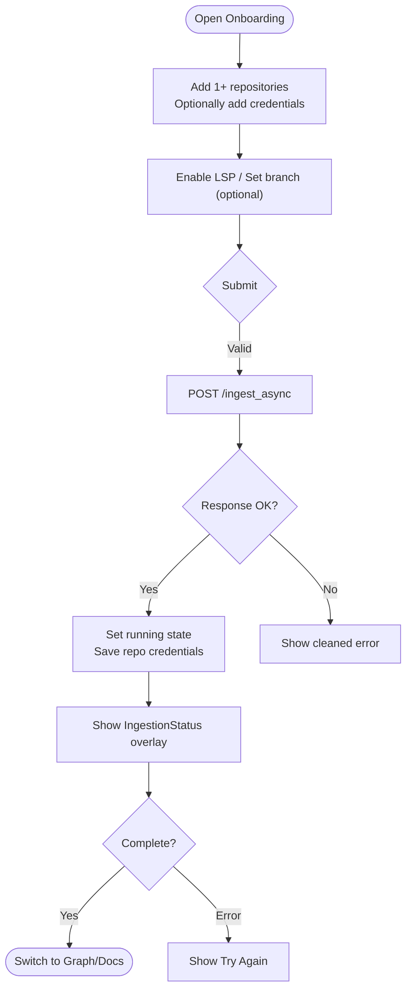
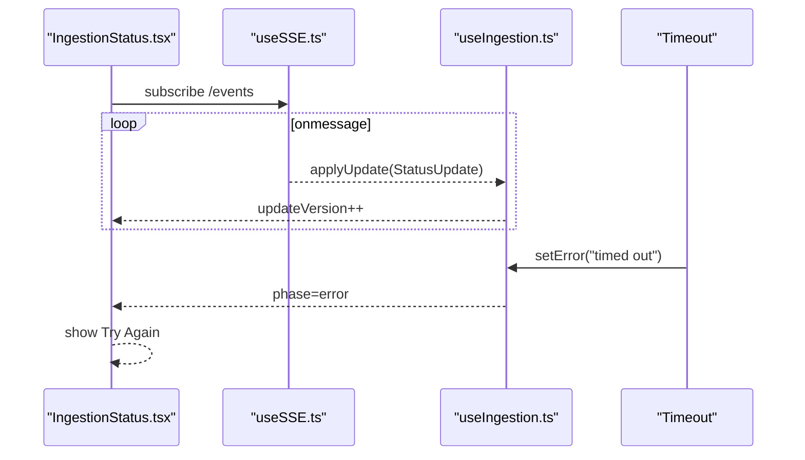
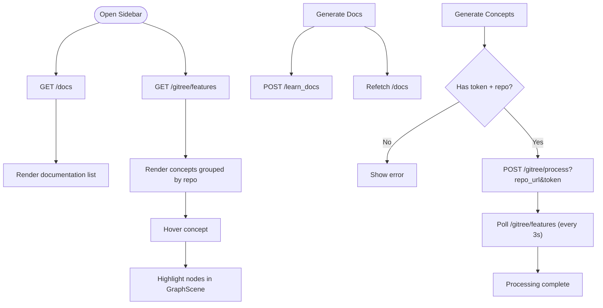
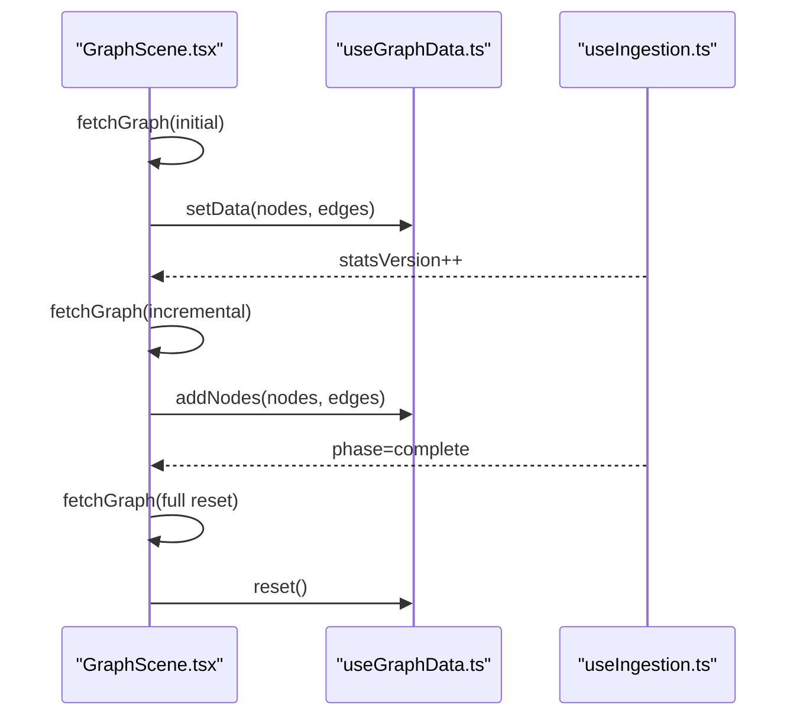
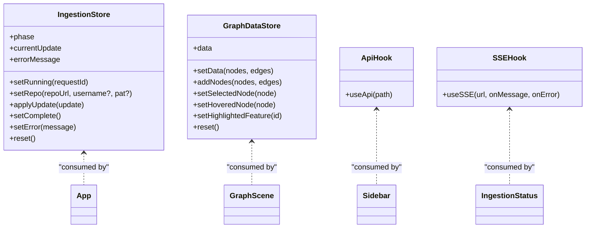
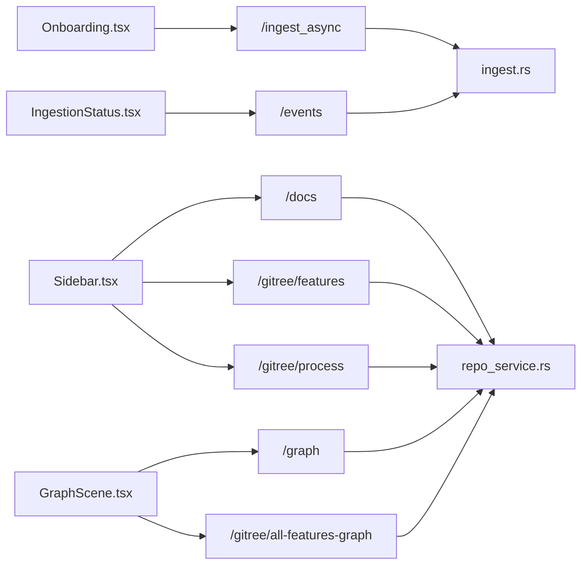

# Repository Management

<cite>
**Referenced Files in This Document**
- [App.tsx](file://mcp/web/src/App.tsx)
- [Sidebar.tsx](file://mcp/web/src/components/Sidebar.tsx)
- [Onboarding.tsx](file://mcp/web/src/components/Onboarding.tsx)
- [IngestionStatus.tsx](file://mcp/web/src/components/IngestionStatus.tsx)
- [GraphScene.tsx](file://mcp/web/src/graph/GraphScene.tsx)
- [useIngestion.ts](file://mcp/web/src/stores/useIngestion.ts)
- [useGraphData.ts](file://mcp/web/src/stores/useGraphData.ts)
- [useApi.ts](file://mcp/web/src/hooks/useApi.ts)
- [useSSE.ts](file://mcp/web/src/hooks/useSSE.ts)
- [errors.ts](file://mcp/web/src/lib/errors.ts)
- [types.ts](file://mcp/web/src/types.ts)
- [main.rs](file://standalone/src/main.rs)
- [ingest.rs](file://standalone/src/handlers/ingest.rs)
- [repo_service.rs](file://standalone/src/service/repo_service.rs)
</cite>

## Table of Contents
1. [Introduction](#introduction)
2. [Project Structure](#project-structure)
3. [Core Components](#core-components)
4. [Architecture Overview](#architecture-overview)
5. [Detailed Component Analysis](#detailed-component-analysis)
6. [Dependency Analysis](#dependency-analysis)
7. [Performance Considerations](#performance-considerations)
8. [Troubleshooting Guide](#troubleshooting-guide)
9. [Conclusion](#conclusion)
10. [Appendices](#appendices)

## Introduction
This document explains the repository management system in the StakGraph web interface. It covers the onboarding workflow, repository addition, ingestion status tracking, sidebar navigation, repository switching, and project management features. It also details the ingestion pipeline visualization, progress tracking, error handling, component APIs for managing repository connections, handling ingestion states, and customizing the onboarding experience. Additional topics include repository authentication, data refresh cycles, cleanup procedures, and examples for extending repository management and integrating with external version control systems.

## Project Structure
The repository management system spans the frontend web application and the backend standalone service:
- Frontend (React + Zustand + Three.js):
  - Application shell and view orchestration
  - Onboarding form for adding repositories
  - Sidebar for documentation and concepts
  - Ingestion status overlay with live updates
  - Graph scene rendering and incremental refresh
  - Stores for ingestion and graph data
  - Hooks for API and SSE
- Backend (Rust + Axum):
  - HTTP server exposing ingestion and graph endpoints
  - Handlers for synchronous and asynchronous ingestion
  - Repository service for metadata queries
  - SSE event streaming for progress updates

**Diagram sources**
- [App.tsx:18-177](file://mcp/web/src/App.tsx#L18-L177)
- [Onboarding.tsx:21-237](file://mcp/web/src/components/Onboarding.tsx#L21-L237)
- [Sidebar.tsx:40-547](file://mcp/web/src/components/Sidebar.tsx#L40-L547)
- [IngestionStatus.tsx:15-153](file://mcp/web/src/components/IngestionStatus.tsx#L15-L153)
- [GraphScene.tsx:52-221](file://mcp/web/src/graph/GraphScene.tsx#L52-L221)
- [useIngestion.ts:43-135](file://mcp/web/src/stores/useIngestion.ts#L43-L135)
- [useGraphData.ts:64-293](file://mcp/web/src/stores/useGraphData.ts#L64-L293)
- [useApi.ts:5-39](file://mcp/web/src/hooks/useApi.ts#L5-L39)
- [useSSE.ts:15-62](file://mcp/web/src/hooks/useSSE.ts#L15-L62)
- [errors.ts:21-46](file://mcp/web/src/lib/errors.ts#L21-L46)
- [main.rs:77-116](file://standalone/src/main.rs#L77-L116)
- [ingest.rs:267-507](file://standalone/src/handlers/ingest.rs#L267-L507)
- [repo_service.rs:5-29](file://standalone/src/service/repo_service.rs#L5-L29)

**Section sources**
- [App.tsx:18-177](file://mcp/web/src/App.tsx#L18-L177)
- [main.rs:77-116](file://standalone/src/main.rs#L77-L116)

## Core Components
- Application shell orchestrates views and global state:
  - Determines initial view based on graph presence
  - Switches between graph, documentation, and onboarding views
  - Controls visibility of sidebar and ingestion overlay
- Onboarding:
  - Multi-repo input with optional per-repo credentials
  - Advanced options (LSP, branch)
  - Starts asynchronous ingestion and transitions to ingestion overlay
- Sidebar:
  - Lists repository documentation and generated concepts
  - Triggers documentation generation and concept processing
  - Highlights nodes on feature hover
- Ingestion status overlay:
  - Live progress via SSE
  - Timeout detection and error messaging
  - Retry/reset controls
- Graph scene:
  - Renders interactive 3D graph
  - Performs incremental refresh during ingestion
  - Full reload after ingestion completes
- Stores:
  - Ingestion state (phase, updates, error, repo credentials)
  - Graph data (nodes, edges, selection, highlighting)
- Hooks:
  - Generic API hook for fetching lists
  - SSE hook for progress streaming

**Section sources**
- [App.tsx:18-177](file://mcp/web/src/App.tsx#L18-L177)
- [Onboarding.tsx:21-237](file://mcp/web/src/components/Onboarding.tsx#L21-L237)
- [Sidebar.tsx:40-547](file://mcp/web/src/components/Sidebar.tsx#L40-L547)
- [IngestionStatus.tsx:15-153](file://mcp/web/src/components/IngestionStatus.tsx#L15-L153)
- [GraphScene.tsx:52-221](file://mcp/web/src/graph/GraphScene.tsx#L52-L221)
- [useIngestion.ts:43-135](file://mcp/web/src/stores/useIngestion.ts#L43-L135)
- [useGraphData.ts:64-293](file://mcp/web/src/stores/useGraphData.ts#L64-L293)
- [useApi.ts:5-39](file://mcp/web/src/hooks/useApi.ts#L5-L39)
- [useSSE.ts:15-62](file://mcp/web/src/hooks/useSSE.ts#L15-L62)

## Architecture Overview
The frontend communicates with the backend through REST endpoints and Server-Sent Events (SSE). The backend manages ingestion tasks, updates a status map, and streams progress to clients. The frontend renders the graph, displays documentation and concepts, and surfaces ingestion progress.

**Diagram sources**
- [Onboarding.tsx:64-87](file://mcp/web/src/components/Onboarding.tsx#L64-L87)
- [main.rs:94-95](file://standalone/src/main.rs#L94-L95)
- [ingest.rs:267-507](file://standalone/src/handlers/ingest.rs#L267-L507)
- [useSSE.ts:15-62](file://mcp/web/src/hooks/useSSE.ts#L15-L62)
- [useIngestion.ts:79-117](file://mcp/web/src/stores/useIngestion.ts#L79-L117)

## Detailed Component Analysis

### Onboarding Workflow and Repository Addition
- Multi-repository support:
  - Users can add multiple repositories separated by commas
  - Credentials are applied from the first repository with username/pat
- Authentication:
  - Optional username/password or personal access token for private repositories
  - Validation occurs in the backend before ingestion starts
- Options:
  - LSP toggle for slower but more accurate cross-file links
  - Branch specification
- Submission:
  - Calls asynchronous ingestion endpoint
  - Sets ingestion state and transitions to ingestion overlay
- Error handling:
  - Cleans and presents user-friendly error messages
  - Highlights credential-related issues

**Diagram sources**
- [Onboarding.tsx:42-87](file://mcp/web/src/components/Onboarding.tsx#L42-L87)
- [useIngestion.ts:64-78](file://mcp/web/src/stores/useIngestion.ts#L64-L78)
- [errors.ts:21-46](file://mcp/web/src/lib/errors.ts#L21-L46)

**Section sources**
- [Onboarding.tsx:21-237](file://mcp/web/src/components/Onboarding.tsx#L21-L237)
- [errors.ts:21-46](file://mcp/web/src/lib/errors.ts#L21-L46)
- [ingest.rs:267-507](file://standalone/src/handlers/ingest.rs#L267-L507)

### Ingestion Pipeline Visualization and Progress Tracking
- SSE subscription:
  - Connects to /events when ingestion is running
  - Applies updates to the ingestion store
- Progress calculation:
  - Computes overall percentage from step, total_steps, and progress
  - Tracks a capped maximum percentage to avoid regressions
- UI presentation:
  - Animated progress bar and step description
  - Stats chips for metrics when available
- Timeout handling:
  - Detects lack of progress after five minutes and sets an error
- Completion:
  - Resets graph data and switches to the graph view

**Diagram sources**
- [IngestionStatus.tsx:25-38](file://mcp/web/src/components/IngestionStatus.tsx#L25-L38)
- [useSSE.ts:15-62](file://mcp/web/src/hooks/useSSE.ts#L15-L62)
- [useIngestion.ts:79-117](file://mcp/web/src/stores/useIngestion.ts#L79-L117)

**Section sources**
- [IngestionStatus.tsx:15-153](file://mcp/web/src/components/IngestionStatus.tsx#L15-L153)
- [useSSE.ts:15-62](file://mcp/web/src/hooks/useSSE.ts#L15-L62)
- [useIngestion.ts:79-117](file://mcp/web/src/stores/useIngestion.ts#L79-L117)

### Sidebar Navigation, Repository Switching, and Project Management
- Repository switching:
  - Uses stored repository URLs to gate concept generation
  - Requires a previously ingested repository URL
- Documentation and concepts:
  - Fetches documentation and features via API hooks
  - Supports generating documentation and triggering concept processing
- Concept processing:
  - Validates GitHub token and repository URL
  - Polls server processing flag with backoff
  - Handles timeouts and network errors
- Highlighting:
  - Highlights nodes related to a selected concept on the graph

**Diagram sources**
- [Sidebar.tsx:69-223](file://mcp/web/src/components/Sidebar.tsx#L69-L223)
- [useApi.ts:5-39](file://mcp/web/src/hooks/useApi.ts#L5-L39)
- [GraphScene.tsx:24-48](file://mcp/web/src/graph/GraphScene.tsx#L24-L48)

**Section sources**
- [Sidebar.tsx:40-547](file://mcp/web/src/components/Sidebar.tsx#L40-L547)
- [types.ts:1-25](file://mcp/web/src/types.ts#L1-L25)

### Graph Data Refresh Cycles and Cleanup
- Initial load:
  - Fetches combined code and features graphs
  - Merges nodes by ref_id and deduplicates edges
- Incremental refresh:
  - During ingestion, polls with a timestamp to get new nodes/edges
  - Adds only new nodes and edges to the existing dataset
- Full refresh:
  - After ingestion completes, clears incremental state and reloads all data
- Cleanup:
  - Resets graph store and clears local storage on reset

**Diagram sources**
- [GraphScene.tsx:65-151](file://mcp/web/src/graph/GraphScene.tsx#L65-L151)
- [useGraphData.ts:75-238](file://mcp/web/src/stores/useGraphData.ts#L75-L238)
- [useIngestion.ts:121-134](file://mcp/web/src/stores/useIngestion.ts#L121-L134)

**Section sources**
- [GraphScene.tsx:52-221](file://mcp/web/src/graph/GraphScene.tsx#L52-L221)
- [useGraphData.ts:64-293](file://mcp/web/src/stores/useGraphData.ts#L64-L293)
- [useIngestion.ts:121-134](file://mcp/web/src/stores/useIngestion.ts#L121-L134)

### Component APIs for Managing Repository Connections and States
- Ingestion store:
  - setRunning(requestId), setRepo(repoUrl, username?, pat?)
  - applyUpdate(update), setComplete(), setError(message), reset()
- Graph data store:
  - setData(nodes, edges), addNodes(nodes, edges), setSelectedNode, setHoveredNode
  - setHighlightedFeature(featureRefId), reset()
- API hook:
  - useApi(path) returns data, loading, error, refetch
- SSE hook:
  - useSSE(url, onMessage, onError) manages connection and retries
- Onboarding props:
  - onStarted callback to switch views after submission
- Sidebar props:
  - activeItemKey, onDocClick, onConceptClick callbacks

**Diagram sources**
- [useIngestion.ts:12-31](file://mcp/web/src/stores/useIngestion.ts#L12-L31)
- [useGraphData.ts:40-62](file://mcp/web/src/stores/useGraphData.ts#L40-L62)
- [useApi.ts:5-39](file://mcp/web/src/hooks/useApi.ts#L5-L39)
- [useSSE.ts:15-62](file://mcp/web/src/hooks/useSSE.ts#L15-L62)

**Section sources**
- [useIngestion.ts:12-31](file://mcp/web/src/stores/useIngestion.ts#L12-L31)
- [useGraphData.ts:40-62](file://mcp/web/src/stores/useGraphData.ts#L40-L62)
- [useApi.ts:5-39](file://mcp/web/src/hooks/useApi.ts#L5-L39)
- [useSSE.ts:15-62](file://mcp/web/src/hooks/useSSE.ts#L15-L62)

### Authentication, Data Refresh, and Cleanup Procedures
- Authentication:
  - Backend validates Git credentials for the provided repositories
  - Onboarding cleans and surfaces credential-related errors
- Data refresh:
  - GraphScene performs incremental fetches using a timestamp
  - After completion, triggers a full reload to ensure consistency
- Cleanup:
  - Resetting ingestion state clears stored repository credentials
  - Graph store reset clears selections and highlights

**Section sources**
- [ingest.rs:281-299](file://standalone/src/handlers/ingest.rs#L281-L299)
- [errors.ts:21-46](file://mcp/web/src/lib/errors.ts#L21-L46)
- [GraphScene.tsx:135-151](file://mcp/web/src/graph/GraphScene.tsx#L135-L151)
- [useIngestion.ts:121-134](file://mcp/web/src/stores/useIngestion.ts#L121-L134)

### Extending Repository Management and Integrating External VCS
- Extend ingestion:
  - Add new repository types by updating the backend ingestion handler to accept additional fields and dispatch appropriate tasks
- Integrate external VCS:
  - Provide a VCS adapter that translates repository identifiers and credentials into internal ingestion requests
  - Ensure credential validation and error reporting are consistent with existing flows
- UI customization:
  - Extend the onboarding form to capture VCS-specific options
  - Update the sidebar to surface repository metadata and actions

[No sources needed since this section provides general guidance]

## Dependency Analysis
The frontend depends on the backend for ingestion, graph data, and feature discovery. The backend exposes REST endpoints and SSE for progress updates. The ingestion handler spawns background tasks and maintains a status map updated by the AST pipeline.

**Diagram sources**
- [main.rs:77-116](file://standalone/src/main.rs#L77-L116)
- [ingest.rs:267-507](file://standalone/src/handlers/ingest.rs#L267-L507)
- [repo_service.rs:5-29](file://standalone/src/service/repo_service.rs#L5-L29)
- [Sidebar.tsx:69-78](file://mcp/web/src/components/Sidebar.tsx#L69-L78)
- [GraphScene.tsx:76-82](file://mcp/web/src/graph/GraphScene.tsx#L76-L82)

**Section sources**
- [main.rs:77-116](file://standalone/src/main.rs#L77-L116)
- [ingest.rs:267-507](file://standalone/src/handlers/ingest.rs#L267-L507)
- [repo_service.rs:5-29](file://standalone/src/service/repo_service.rs#L5-L29)

## Performance Considerations
- Incremental graph updates:
  - Use timestamp-based deltas to minimize payload sizes during ingestion
- SSE resilience:
  - Automatic retries with backoff reduce connection failures
- Debounced UI updates:
  - Feature hover highlighting debounces to prevent flicker
- Local storage:
  - Persist repository credentials to avoid re-entry on reload

[No sources needed since this section provides general guidance]

## Troubleshooting Guide
- Authentication errors:
  - Verify username and personal access token in onboarding
  - Check for credential-related hints in onboarding error banner
- Concept generation failures:
  - Ensure a GitHub token is configured in settings
  - Confirm a repository has been ingested before generating concepts
  - Review timeout warnings and server processing flags
- Ingestion stalls:
  - Look for timeout messages and “Try again” button
  - Inspect SSE connectivity and backend logs
- Graph not loading:
  - Wait for ingestion to complete or trigger a full refresh
  - Confirm that the graph endpoint returns data

**Section sources**
- [errors.ts:21-46](file://mcp/web/src/lib/errors.ts#L21-L46)
- [Onboarding.tsx:211-228](file://mcp/web/src/components/Onboarding.tsx#L211-L228)
- [Sidebar.tsx:170-214](file://mcp/web/src/components/Sidebar.tsx#L170-L214)
- [IngestionStatus.tsx:31-38](file://mcp/web/src/components/IngestionStatus.tsx#L31-L38)

## Conclusion
The StakGraph repository management system integrates a robust frontend UI with a backend ingestion pipeline. Users can onboard repositories, monitor ingestion progress, navigate documentation and concepts, and interact with an evolving knowledge graph. The system emphasizes clear error messaging, incremental updates, and extensibility for future integrations.

## Appendices
- Example extension points:
  - Add a new repository type by extending the ingestion handler and onboarding form
  - Introduce a new VCS adapter with standardized credential validation
  - Enhance the sidebar with additional repository metadata panels

[No sources needed since this section provides general guidance]