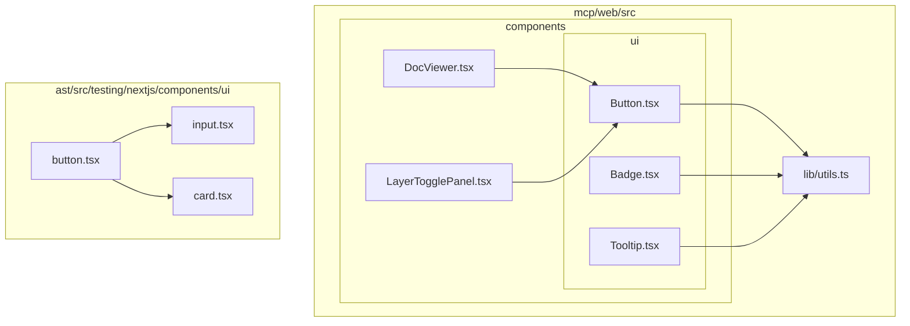
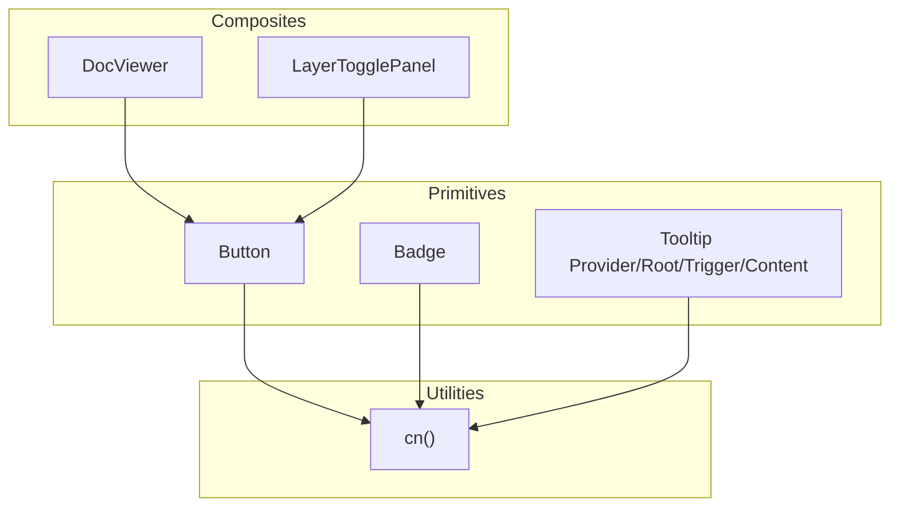
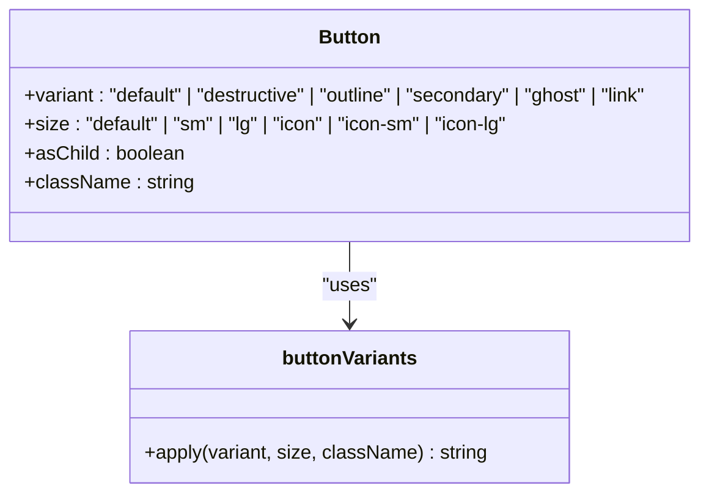
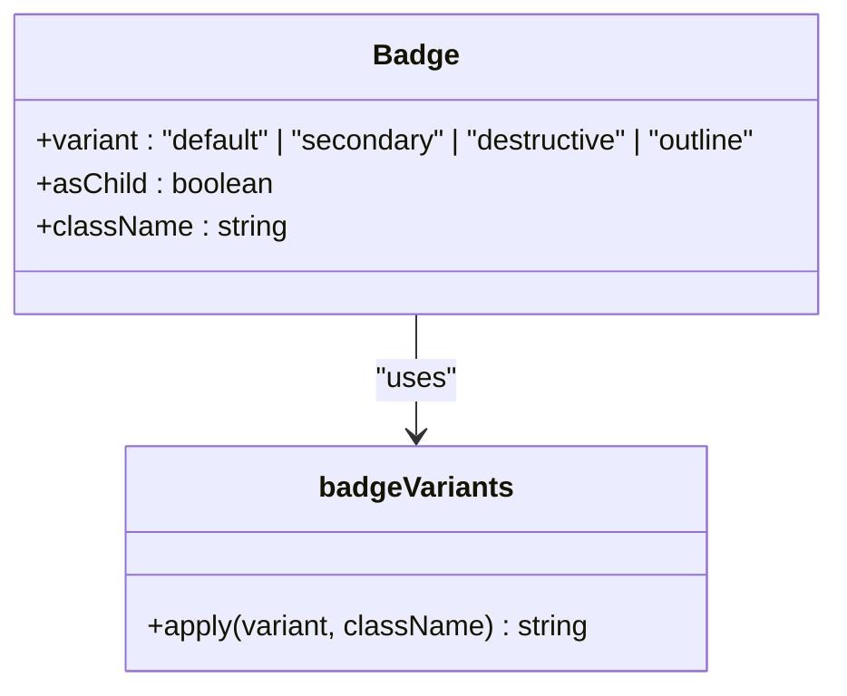
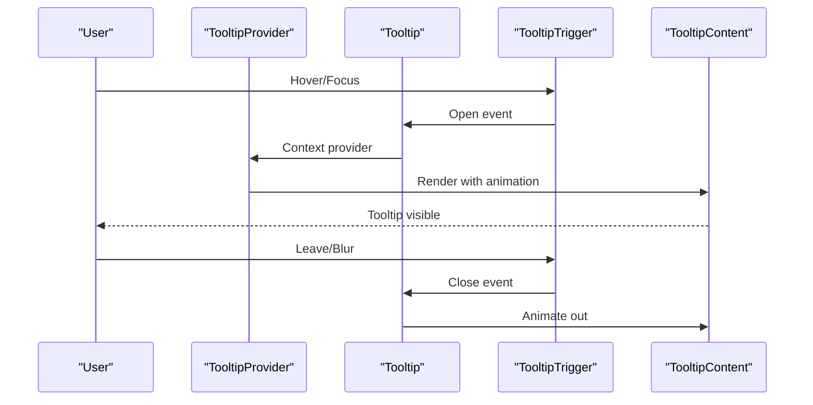
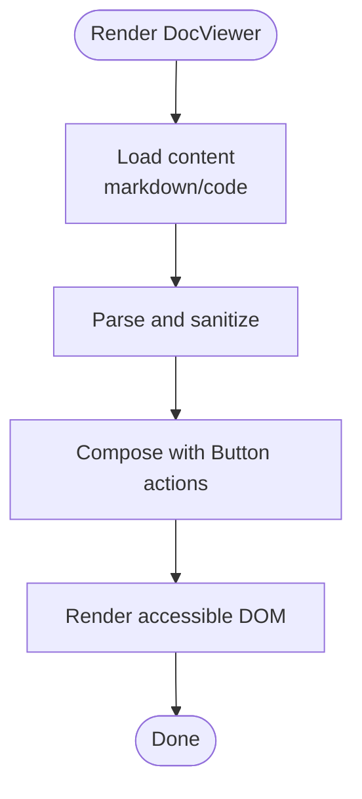
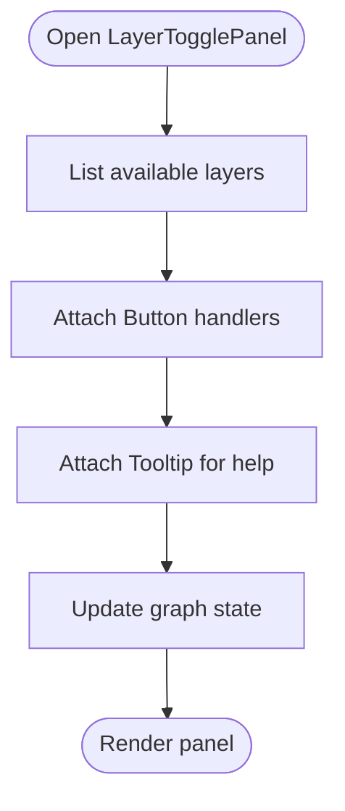
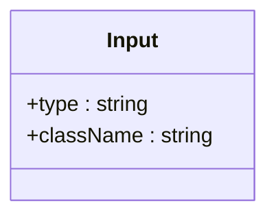
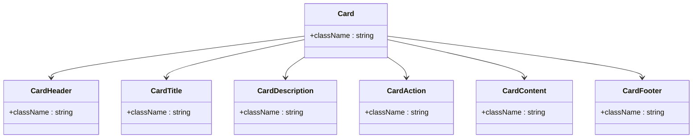
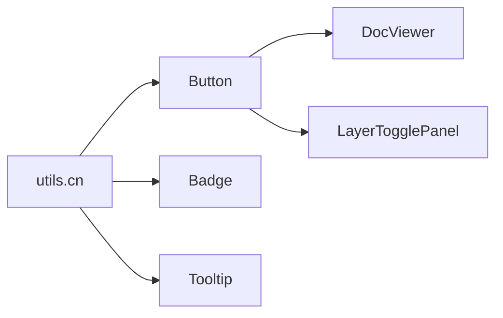

# UI Components Library

<cite>
**Referenced Files in This Document**
- [Button.tsx](file://mcp/web/src/components/ui/Button.tsx)
- [Badge.tsx](file://mcp/web/src/components/ui/Badge.tsx)
- [Tooltip.tsx](file://mcp/web/src/components/ui/Tooltip.tsx)
- [DocViewer.tsx](file://mcp/web/src/components/DocViewer.tsx)
- [LayerTogglePanel.tsx](file://mcp/web/src/components/LayerTogglePanel.tsx)
- [utils.ts](file://mcp/web/src/lib/utils.ts)
- [button.tsx](file://ast/src/testing/nextjs/components/ui/button.tsx)
- [input.tsx](file://ast/src/testing/nextjs/components/ui/input.tsx)
- [card.tsx](file://ast/src/testing/nextjs/components/ui/card.tsx)
</cite>

## Table of Contents
1. [Introduction](#introduction)
2. [Project Structure](#project-structure)
3. [Core Components](#core-components)
4. [Architecture Overview](#architecture-overview)
5. [Detailed Component Analysis](#detailed-component-analysis)
6. [Dependency Analysis](#dependency-analysis)
7. [Performance Considerations](#performance-considerations)
8. [Troubleshooting Guide](#troubleshooting-guide)
9. [Conclusion](#conclusion)
10. [Appendices](#appendices)

## Introduction
This document describes the StakGraph React UI component library and design system. It focuses on component architecture, styling approach, reusable interface elements, and the design token system. It also documents the button variants, badge system, tooltip functionality, form components, the DocViewer component for displaying documentation and code samples, the LayerTogglePanel for graph controls, and utility functions for component composition. Guidance is included for extending the component library while maintaining design consistency and integrating with themes and responsive breakpoints.

## Project Structure
The UI components are organized under a components directory with a dedicated ui subfolder for primitive and composite components. Shared utilities for class merging are centralized in a lib folder. Additional component examples and patterns exist in the ast testing Next.js app, which demonstrates complementary primitives such as Input and Card.

**Diagram sources**
- [Button.tsx:1-61](file://mcp/web/src/components/ui/Button.tsx#L1-L61)
- [Badge.tsx:1-47](file://mcp/web/src/components/ui/Badge.tsx#L1-L47)
- [Tooltip.tsx:1-62](file://mcp/web/src/components/ui/Tooltip.tsx#L1-L62)
- [DocViewer.tsx](file://mcp/web/src/components/DocViewer.tsx)
- [LayerTogglePanel.tsx](file://mcp/web/src/components/LayerTogglePanel.tsx)
- [utils.ts:1-7](file://mcp/web/src/lib/utils.ts#L1-L7)
- [button.tsx:1-60](file://ast/src/testing/nextjs/components/ui/button.tsx#L1-L60)
- [input.tsx:1-22](file://ast/src/testing/nextjs/components/ui/input.tsx#L1-L22)
- [card.tsx:1-95](file://ast/src/testing/nextjs/components/ui/card.tsx#L1-L95)

**Section sources**
- [Button.tsx:1-61](file://mcp/web/src/components/ui/Button.tsx#L1-L61)
- [Badge.tsx:1-47](file://mcp/web/src/components/ui/Badge.tsx#L1-L47)
- [Tooltip.tsx:1-62](file://mcp/web/src/components/ui/Tooltip.tsx#L1-L62)
- [DocViewer.tsx](file://mcp/web/src/components/DocViewer.tsx)
- [LayerTogglePanel.tsx](file://mcp/web/src/components/LayerTogglePanel.tsx)
- [utils.ts:1-7](file://mcp/web/src/lib/utils.ts#L1-L7)
- [button.tsx:1-60](file://ast/src/testing/nextjs/components/ui/button.tsx#L1-L60)
- [input.tsx:1-22](file://ast/src/testing/nextjs/components/ui/input.tsx#L1-L22)
- [card.tsx:1-95](file://ast/src/testing/nextjs/components/ui/card.tsx#L1-L95)

## Core Components
This section summarizes the primary UI components and their roles in the design system.

- Button: A versatile primitive with variant and size scales, supporting slottable composition and consistent focus/invalid states.
- Badge: A compact indicator with variant styling and optional slottable behavior.
- Tooltip: A provider and content stack built on Radix UI with animated transitions and accessible triggers.
- DocViewer: A documentation renderer for displaying markdown and code samples.
- LayerTogglePanel: A panel for toggling graph layers and controls.
- Utilities: A shared cn function for merging Tailwind classes safely.

Key design tokens and patterns:
- Variants and sizes are defined via class variance authority (CVA) for consistent styling.
- Focus-visible and invalid-state rings leverage ring and destructive tokens.
- Dark mode support is integrated via dark: prefixed Tailwind utilities.
- Slottable composition allows Button and Badge to wrap other components seamlessly.

**Section sources**
- [Button.tsx:7-37](file://mcp/web/src/components/ui/Button.tsx#L7-L37)
- [Badge.tsx:7-26](file://mcp/web/src/components/ui/Badge.tsx#L7-L26)
- [Tooltip.tsx:8-59](file://mcp/web/src/components/ui/Tooltip.tsx#L8-L59)
- [DocViewer.tsx](file://mcp/web/src/components/DocViewer.tsx)
- [LayerTogglePanel.tsx](file://mcp/web/src/components/LayerTogglePanel.tsx)
- [utils.ts:4-6](file://mcp/web/src/lib/utils.ts#L4-L6)

## Architecture Overview
The component library follows a modular, variant-driven architecture:
- Primitive components (Button, Badge, Tooltip) encapsulate base styles and behavior.
- Composite components (DocViewer, LayerTogglePanel) orchestrate primitives and domain-specific logic.
- Utilities centralize class merging to avoid conflicts and ensure predictable overrides.
- Design tokens are applied consistently through Tailwind classes and CVA-defined variants.

**Diagram sources**
- [Button.tsx:39-58](file://mcp/web/src/components/ui/Button.tsx#L39-L58)
- [Badge.tsx:28-44](file://mcp/web/src/components/ui/Badge.tsx#L28-L44)
- [Tooltip.tsx:21-59](file://mcp/web/src/components/ui/Tooltip.tsx#L21-L59)
- [DocViewer.tsx](file://mcp/web/src/components/DocViewer.tsx)
- [LayerTogglePanel.tsx](file://mcp/web/src/components/LayerTogglePanel.tsx)
- [utils.ts:4-6](file://mcp/web/src/lib/utils.ts#L4-L6)

## Detailed Component Analysis

### Button
- Purpose: Base interactive element with consistent focus, hover, and invalid states.
- Variants: default, destructive, outline, secondary, ghost, link.
- Sizes: default, sm, lg, icon, icon-sm, icon-lg.
- Composition: Supports asChild to wrap links or other components.
- Accessibility: Focus-visible ring and aria-invalid integration for error states.
- Theming: Uses primary/secondary/destructive tokens; dark mode variants included.

**Diagram sources**
- [Button.tsx:7-37](file://mcp/web/src/components/ui/Button.tsx#L7-L37)
- [Button.tsx:39-58](file://mcp/web/src/components/ui/Button.tsx#L39-L58)

**Section sources**
- [Button.tsx:7-37](file://mcp/web/src/components/ui/Button.tsx#L7-L37)
- [Button.tsx:39-58](file://mcp/web/src/components/ui/Button.tsx#L39-L58)

### Badge
- Purpose: Lightweight indicator or label with variant styling.
- Variants: default, secondary, destructive, outline.
- Composition: Supports asChild to render inside anchor tags or other elements.
- Accessibility: Focus-visible ring and invalid-state integration.

**Diagram sources**
- [Badge.tsx:7-26](file://mcp/web/src/components/ui/Badge.tsx#L7-L26)
- [Badge.tsx:28-44](file://mcp/web/src/components/ui/Badge.tsx#L28-L44)

**Section sources**
- [Badge.tsx:7-26](file://mcp/web/src/components/ui/Badge.tsx#L7-L26)
- [Badge.tsx:28-44](file://mcp/web/src/components/ui/Badge.tsx#L28-L44)

### Tooltip
- Purpose: Accessible tooltip with animated show/hide and arrow positioning.
- Provider: Controls global delay duration.
- Root: Wraps trigger and content.
- Trigger: Accessible trigger element.
- Content: Animated content with side offset and directional animations.

**Diagram sources**
- [Tooltip.tsx:8-59](file://mcp/web/src/components/ui/Tooltip.tsx#L8-L59)

**Section sources**
- [Tooltip.tsx:8-59](file://mcp/web/src/components/ui/Tooltip.tsx#L8-L59)

### DocViewer
- Purpose: Renders documentation and code samples with consistent styling and accessibility.
- Integration: Composes Button for actions and supports keyboard navigation.
- Extensibility: Designed to accept markdown and code blocks with syntax highlighting.

**Section sources**
- [DocViewer.tsx](file://mcp/web/src/components/DocViewer.tsx)

### LayerTogglePanel
- Purpose: Provides controls for toggling graph layers and related options.
- Integration: Uses Button for toggle actions and Tooltip for contextual help.
- Extensibility: Can be extended to include additional controls and state synchronization.

**Section sources**
- [LayerTogglePanel.tsx](file://mcp/web/src/components/LayerTogglePanel.tsx)

### Form Components
- Input: Text input with focus-visible ring, placeholder tokens, and selection styling.
- Select: Not present in current repository; can be added following Button’s variant pattern.

**Diagram sources**
- [input.tsx:5-19](file://ast/src/testing/nextjs/components/ui/input.tsx#L5-L19)

**Section sources**
- [input.tsx:5-19](file://ast/src/testing/nextjs/components/ui/input.tsx#L5-L19)

### Composite Patterns
- Card: A flexible card container with header, title, description, action, content, and footer slots.

**Diagram sources**
- [card.tsx:7-84](file://ast/src/testing/nextjs/components/ui/card.tsx#L7-L84)

**Section sources**
- [card.tsx:7-84](file://ast/src/testing/nextjs/components/ui/card.tsx#L7-L84)

## Dependency Analysis
- Component dependencies: Button, Badge, and Tooltip depend on the shared cn utility for class merging.
- Composite components depend on primitives for consistent behavior.
- Utilities are centralized to minimize duplication and ensure predictable overrides.

**Diagram sources**
- [utils.ts:4-6](file://mcp/web/src/lib/utils.ts#L4-L6)
- [Button.tsx:5-5](file://mcp/web/src/components/ui/Button.tsx#L5-L5)
- [Badge.tsx:5-5](file://mcp/web/src/components/ui/Badge.tsx#L5-L5)
- [Tooltip.tsx:6-6](file://mcp/web/src/components/ui/Tooltip.tsx#L6-L6)
- [DocViewer.tsx](file://mcp/web/src/components/DocViewer.tsx)
- [LayerTogglePanel.tsx](file://mcp/web/src/components/LayerTogglePanel.tsx)

**Section sources**
- [utils.ts:4-6](file://mcp/web/src/lib/utils.ts#L4-L6)
- [Button.tsx:5-5](file://mcp/web/src/components/ui/Button.tsx#L5-L5)
- [Badge.tsx:5-5](file://mcp/web/src/components/ui/Badge.tsx#L5-L5)
- [Tooltip.tsx:6-6](file://mcp/web/src/components/ui/Tooltip.tsx#L6-L6)
- [DocViewer.tsx](file://mcp/web/src/components/DocViewer.tsx)
- [LayerTogglePanel.tsx](file://mcp/web/src/components/LayerTogglePanel.tsx)

## Performance Considerations
- Prefer variant props over inline styles to leverage CSS caching and reduce reflows.
- Use asChild composition to avoid unnecessary DOM wrappers and improve semantic markup.
- Keep tooltip content lightweight to minimize portal rendering overhead.
- Consolidate class merging via cn to prevent excessive CSS class churn.

## Troubleshooting Guide
- Focus rings not visible: Ensure focus-visible utilities are enabled and not overridden by global resets.
- Dark mode inconsistencies: Verify dark: prefixed variants are applied and theme variables are configured.
- Tooltip not appearing: Confirm TooltipProvider wraps the Tooltip and delayDuration is appropriate.
- Button/Icon sizing: Use icon variants to maintain consistent spacing and sizing.

## Conclusion
The StakGraph UI component library emphasizes consistency, accessibility, and composability. By leveraging variant-driven primitives, a shared utility for class merging, and composite components for domain-specific needs, teams can build accessible and maintainable interfaces. Extending the library should follow established patterns: define variants via CVA, integrate focus and invalid states, and compose primitives to create higher-level components.

## Appendices

### Design Tokens and Theme Integration
- Tokens: primary, secondary, destructive, muted foreground/background, ring, input, card, and accent are used across components.
- Dark mode: dark: prefixed Tailwind utilities provide alternate tokens for contrast and readability.
- Focus states: focus-visible ring integrates with ring tokens for accessible focus indication.
- Invalid states: aria-invalid variants apply destructive ring and border for form feedback.

**Section sources**
- [Button.tsx:10-36](file://mcp/web/src/components/ui/Button.tsx#L10-L36)
- [Badge.tsx:10-26](file://mcp/web/src/components/ui/Badge.tsx#L10-L26)
- [Tooltip.tsx:42-51](file://mcp/web/src/components/ui/Tooltip.tsx#L42-L51)

### Responsive Breakpoints
- Components use responsive utilities where applicable (e.g., md:text-sm). Define application-wide breakpoints in Tailwind configuration and apply consistently across components.

**Section sources**
- [input.tsx:11-13](file://ast/src/testing/nextjs/components/ui/input.tsx#L11-L13)

### Extending the Component Library
- Follow Button’s pattern: define variants with CVA, export variant props, and merge classes via cn.
- Maintain accessibility: include focus-visible and aria-invalid states.
- Compose primitives: build composite components that orchestrate primitives and domain logic.
- Keep naming consistent: use data-slot attributes for testing and debugging.

**Section sources**
- [Button.tsx:7-37](file://mcp/web/src/components/ui/Button.tsx#L7-L37)
- [Badge.tsx:7-26](file://mcp/web/src/components/ui/Badge.tsx#L7-L26)
- [Tooltip.tsx:8-59](file://mcp/web/src/components/ui/Tooltip.tsx#L8-L59)
- [utils.ts:4-6](file://mcp/web/src/lib/utils.ts#L4-L6)