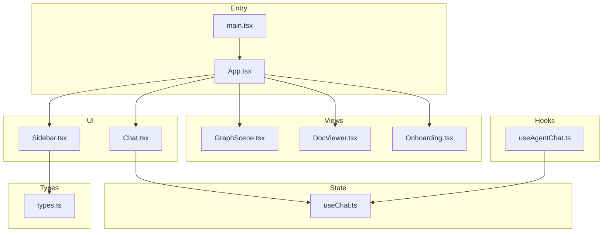
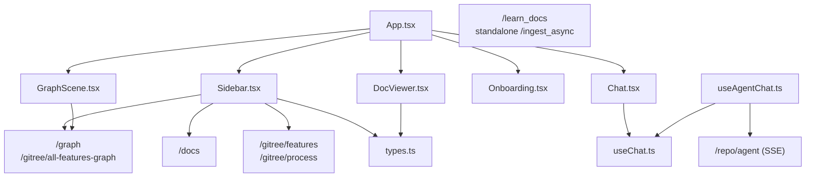
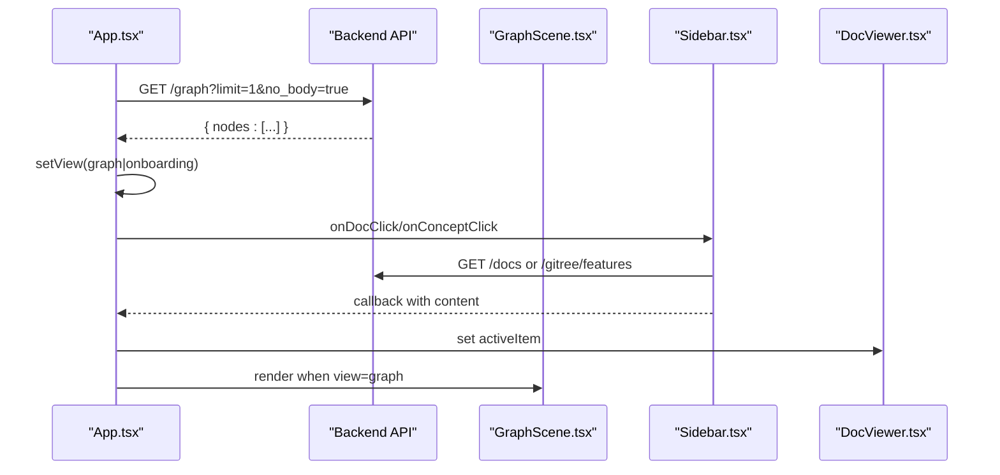
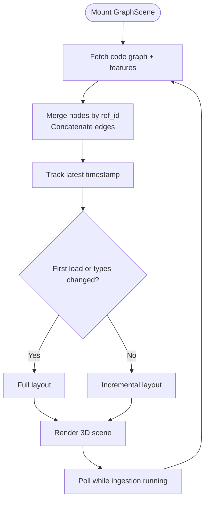
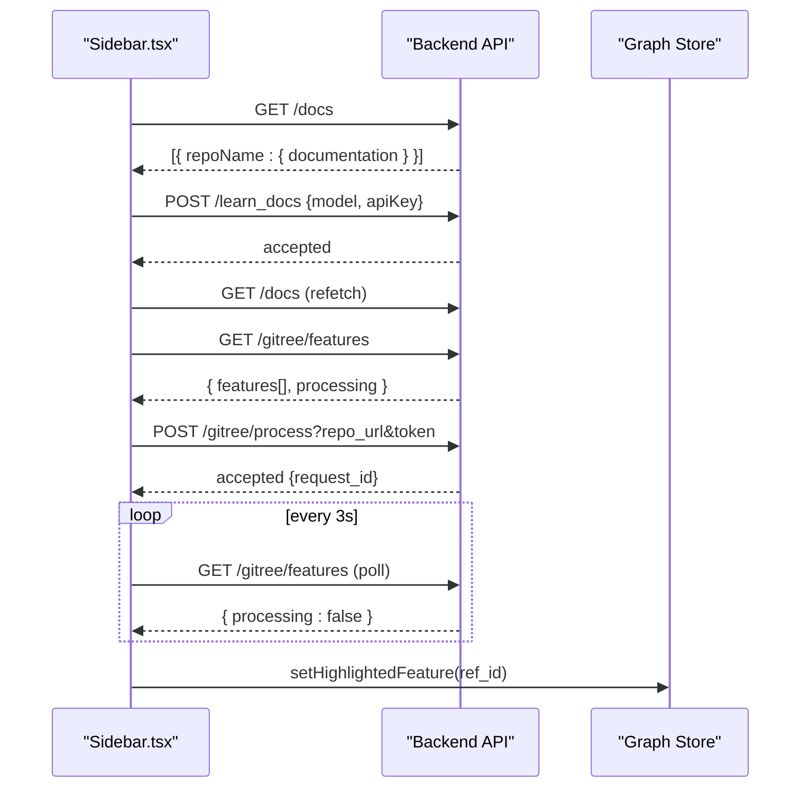
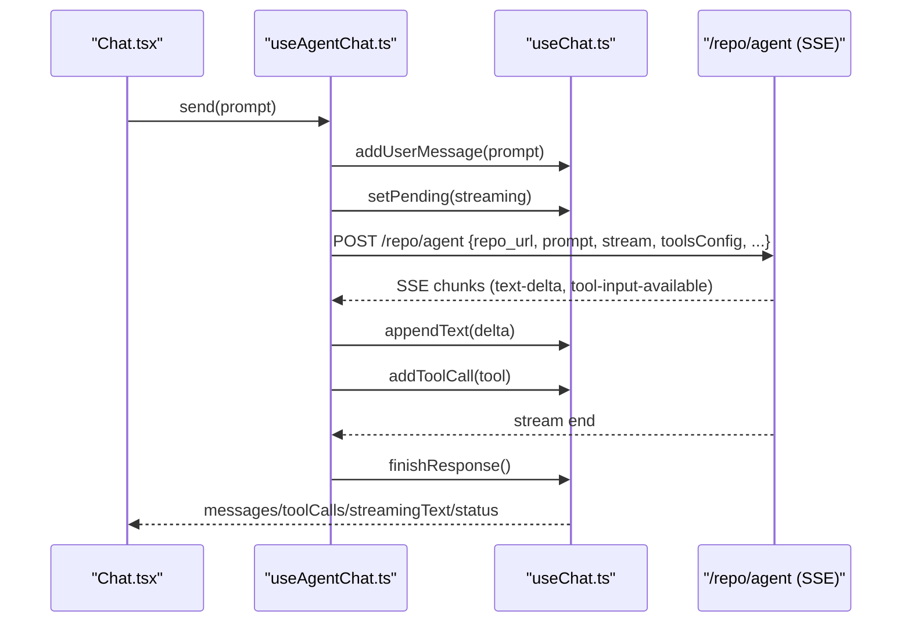
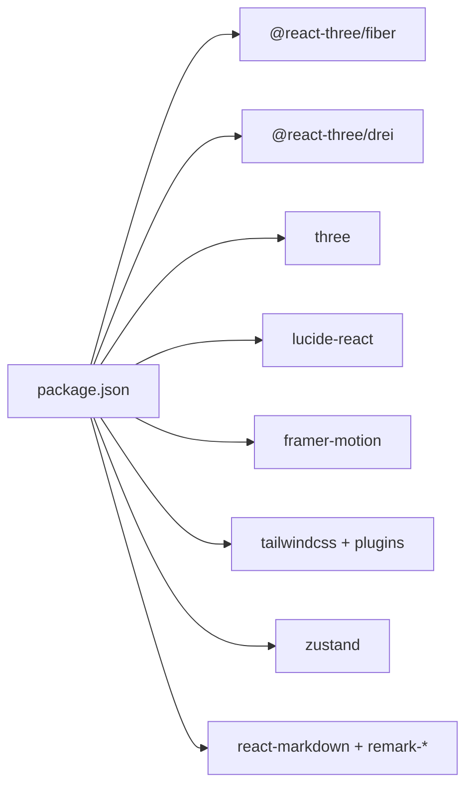

# Web Interface

<cite>
**Referenced Files in This Document**
- [App.tsx](file://mcp/web/src/App.tsx)
- [main.tsx](file://mcp/web/src/main.tsx)
- [Sidebar.tsx](file://mcp/web/src/components/Sidebar.tsx)
- [GraphScene.tsx](file://mcp/web/src/graph/GraphScene.tsx)
- [DocViewer.tsx](file://mcp/web/src/components/DocViewer.tsx)
- [Onboarding.tsx](file://mcp/web/src/components/Onboarding.tsx)
- [Chat.tsx](file://mcp/web/src/components/chat/Chat.tsx)
- [useAgentChat.ts](file://mcp/web/src/hooks/useAgentChat.ts)
- [useChat.ts](file://mcp/web/src/stores/useChat.ts)
- [types.ts](file://mcp/web/src/types.ts)
- [package.json](file://mcp/web/package.json)
</cite>

## Table of Contents
1. [Introduction](#introduction)
2. [Project Structure](#project-structure)
3. [Core Components](#core-components)
4. [Architecture Overview](#architecture-overview)
5. [Detailed Component Analysis](#detailed-component-analysis)
6. [Dependency Analysis](#dependency-analysis)
7. [Performance Considerations](#performance-considerations)
8. [Troubleshooting Guide](#troubleshooting-guide)
9. [Conclusion](#conclusion)
10. [Appendices](#appendices)

## Introduction
This document describes the StakGraph web interface built with React and Vite. It covers the application architecture, component structure, and user interaction patterns. It explains the 3D graph visualization, interactive node rendering, and relationship mapping interfaces. It documents the agent chat interface, real-time streaming, and repository ingestion capabilities. It also outlines the UI component library, styling system, and responsive design patterns, along with component APIs, prop definitions, customization options, browser compatibility, performance optimization, and accessibility features. Finally, it provides examples for extending the interface and integrating custom visualizations.

## Project Structure
The web application is organized around a small set of React components, a 3D graph scene powered by Three.js and React Three Fiber, a Zustand-based state management layer, and a collection of UI primitives and hooks. The entry point initializes the root component and global styles, while the main App orchestrates views, sidebar, chat overlay, and ingestion status.

**Diagram sources**
- [main.tsx:1-11](file://mcp/web/src/main.tsx#L1-L11)
- [App.tsx:1-180](file://mcp/web/src/App.tsx#L1-L180)
- [GraphScene.tsx:1-221](file://mcp/web/src/graph/GraphScene.tsx#L1-L221)
- [DocViewer.tsx:1-32](file://mcp/web/src/components/DocViewer.tsx#L1-L32)
- [Onboarding.tsx:1-240](file://mcp/web/src/components/Onboarding.tsx#L1-L240)
- [Sidebar.tsx:1-548](file://mcp/web/src/components/Sidebar.tsx#L1-L548)
- [Chat.tsx:1-104](file://mcp/web/src/components/chat/Chat.tsx#L1-L104)
- [useChat.ts:1-146](file://mcp/web/src/stores/useChat.ts#L1-L146)
- [useAgentChat.ts:1-160](file://mcp/web/src/hooks/useAgentChat.ts#L1-L160)
- [types.ts:1-25](file://mcp/web/src/types.ts#L1-L25)

**Section sources**
- [main.tsx:1-11](file://mcp/web/src/main.tsx#L1-L11)
- [App.tsx:1-180](file://mcp/web/src/App.tsx#L1-L180)

## Core Components
- App: Orchestrates initial view selection, routing between graph, documentation, and onboarding, and overlays the chat panel and ingestion status.
- GraphScene: Fetches graph data, merges code and feature graphs, manages camera controls, and renders the 3D scene.
- Sidebar: Provides documentation and concepts lists, generation triggers, and highlights nodes on hover.
- DocViewer: Renders selected documentation or concept content using Markdown.
- Onboarding: Handles repository ingestion configuration and starts asynchronous ingestion.
- Chat: Real-time chat panel with message history, tool-call flow visualization, and streaming text preview.
- useAgentChat: Manages agent requests, SSE streaming, and tool-call parsing.
- useChat: Zustand store for chat messages, tool calls, streaming text, and session state.
- Types: Shared TypeScript interfaces for docs and features.

**Section sources**
- [App.tsx:18-177](file://mcp/web/src/App.tsx#L18-L177)
- [GraphScene.tsx:52-221](file://mcp/web/src/graph/GraphScene.tsx#L52-L221)
- [Sidebar.tsx:40-548](file://mcp/web/src/components/Sidebar.tsx#L40-L548)
- [DocViewer.tsx:15-31](file://mcp/web/src/components/DocViewer.tsx#L15-L31)
- [Onboarding.tsx:21-237](file://mcp/web/src/components/Onboarding.tsx#L21-L237)
- [Chat.tsx:9-87](file://mcp/web/src/components/chat/Chat.tsx#L9-L87)
- [useAgentChat.ts:13-160](file://mcp/web/src/hooks/useAgentChat.ts#L13-L160)
- [useChat.ts:46-146](file://mcp/web/src/stores/useChat.ts#L46-L146)
- [types.ts:1-25](file://mcp/web/src/types.ts#L1-L25)

## Architecture Overview
The application follows a layered architecture:
- Presentation layer: React components and UI primitives.
- State layer: Zustand stores for chat and graph data.
- Data layer: API endpoints for graph, features, ingestion, and agent streaming.
- Visualization layer: Three.js scene with camera controls and physics-based layout.

**Diagram sources**
- [App.tsx:14-177](file://mcp/web/src/App.tsx#L14-L177)
- [GraphScene.tsx:22-125](file://mcp/web/src/graph/GraphScene.tsx#L22-L125)
- [Sidebar.tsx:73-223](file://mcp/web/src/components/Sidebar.tsx#L73-L223)
- [DocViewer.tsx:3-9](file://mcp/web/src/components/DocViewer.tsx#L3-L9)
- [Onboarding.tsx:64-87](file://mcp/web/src/components/Onboarding.tsx#L64-L87)
- [Chat.tsx:10-11](file://mcp/web/src/components/chat/Chat.tsx#L10-L11)
- [useAgentChat.ts:77-156](file://mcp/web/src/hooks/useAgentChat.ts#L77-L156)
- [useChat.ts:46-146](file://mcp/web/src/stores/useChat.ts#L46-L146)
- [types.ts:1-25](file://mcp/web/src/types.ts#L1-L25)

## Detailed Component Analysis

### App Component
Responsibilities:
- Preflight check to decide initial view based on graph presence.
- Switch between graph, documentation, and onboarding views.
- Manage sidebar visibility and overlay chat panel.
- Handle document and concept clicks to populate the viewer.
- Coordinate ingestion lifecycle and graph data resets.

Key behaviors:
- Uses a preflight fetch to determine whether to show the graph or onboarding.
- Delegates document and concept selection to the sidebar and updates the viewer accordingly.
- Shows ingestion status overlay during ingestion runs.

**Diagram sources**
- [App.tsx:24-95](file://mcp/web/src/App.tsx#L24-L95)
- [Sidebar.tsx:69-78](file://mcp/web/src/components/Sidebar.tsx#L69-L78)
- [DocViewer.tsx:15-31](file://mcp/web/src/components/DocViewer.tsx#L15-L31)
- [GraphScene.tsx:52-221](file://mcp/web/src/graph/GraphScene.tsx#L52-L221)

**Section sources**
- [App.tsx:18-177](file://mcp/web/src/App.tsx#L18-L177)

### GraphScene Component
Responsibilities:
- Fetch graph and feature data concurrently.
- Merge nodes by ref_id and deduplicate edges.
- Track latest timestamp for incremental updates.
- Trigger full or incremental layout depending on node types and initial load.
- Render a 3D canvas with camera controls and auto-rotation.

Processing logic:
- Initial fetch on mount.
- Incremental fetch when ingestion is running and statsVersion advances.
- After ingestion completion, clear incremental state and re-fetch full dataset.
- Layout on data arrival; full layout on type changes or first load; incremental otherwise.

**Diagram sources**
- [GraphScene.tsx:65-172](file://mcp/web/src/graph/GraphScene.tsx#L65-L172)

**Section sources**
- [GraphScene.tsx:52-221](file://mcp/web/src/graph/GraphScene.tsx#L52-L221)

### Sidebar Component
Responsibilities:
- List repositories’ AI-generated documentation and concepts.
- Trigger documentation generation and concept processing.
- Group concepts by repository and support expand/collapse.
- Highlight nodes on concept hover via graph store.
- Provide tooltips and badges for counts and statuses.

Generation flows:
- Documentation: synchronous POST to learn_docs; refetch docs list.
- Concepts: POST to process with repo_url and token; poll processing flag; timeout after 30 seconds if no server response.

**Diagram sources**
- [Sidebar.tsx:69-223](file://mcp/web/src/components/Sidebar.tsx#L69-L223)

**Section sources**
- [Sidebar.tsx:40-548](file://mcp/web/src/components/Sidebar.tsx#L40-L548)
- [types.ts:18-24](file://mcp/web/src/types.ts#L18-L24)

### DocViewer Component
Responsibilities:
- Render active documentation or concept content using Markdown.
- Provide a fallback message when nothing is selected.

**Section sources**
- [DocViewer.tsx:15-31](file://mcp/web/src/components/DocViewer.tsx#L15-L31)

### Onboarding Component
Responsibilities:
- Collect repository URLs, optional credentials, and advanced options.
- Submit ingestion request to standalone endpoint.
- Report errors and guide users on authentication issues.

**Section sources**
- [Onboarding.tsx:21-237](file://mcp/web/src/components/Onboarding.tsx#L21-L237)

### Chat Component and Agent Integration
Responsibilities:
- Display message history, pending indicators, and streaming text previews.
- Show tool-call flow while agent is working.
- Provide input for sending messages and clear chat.

Agent integration:
- useAgentChat sends POST /repo/agent with stream=true and parses SSE chunks.
- Parses text deltas and tool-input-available events.
- Maintains AbortController to cancel ongoing requests.
- Derives repo URL from graph nodes or ingestion store.

**Diagram sources**
- [Chat.tsx:9-87](file://mcp/web/src/components/chat/Chat.tsx#L9-L87)
- [useAgentChat.ts:77-156](file://mcp/web/src/hooks/useAgentChat.ts#L77-L156)
- [useChat.ts:46-146](file://mcp/web/src/stores/useChat.ts#L46-L146)

**Section sources**
- [Chat.tsx:9-104](file://mcp/web/src/components/chat/Chat.tsx#L9-L104)
- [useAgentChat.ts:13-160](file://mcp/web/src/hooks/useAgentChat.ts#L13-L160)
- [useChat.ts:19-42](file://mcp/web/src/stores/useChat.ts#L19-L42)

## Dependency Analysis
External libraries and their roles:
- @react-three/fiber and @react-three/drei: 3D rendering and camera controls.
- three: 3D engine core.
- lucide-react: UI icons.
- framer-motion: Animations for collapsible sections.
- tailwindcss and related plugins: Utility-first styling.
- zustand: Lightweight state management for chat and graph data.
- react-markdown and remark-*: Markdown rendering for documentation.

**Diagram sources**
- [package.json:11-35](file://mcp/web/package.json#L11-L35)

**Section sources**
- [package.json:11-45](file://mcp/web/package.json#L11-L45)

## Performance Considerations
- Incremental graph updates: GraphScene tracks a latest timestamp and performs incremental adds to avoid full re-layouts when node types remain unchanged.
- Deduplication: Nodes are merged by ref_id to prevent duplicates across code and feature graphs.
- Debounced highlighting: Hover clearing in Sidebar uses a debounced timer to avoid flickering when moving between items.
- Auto-rotation: Camera auto-rotation is paused while user interacts, reducing unnecessary computations.
- Memoization: SceneContent and GraphScene use memoization to minimize re-renders.
- Lazy loading: Collapsible sections defer rendering until expanded.

[No sources needed since this section provides general guidance]

## Troubleshooting Guide
Common issues and resolutions:
- No graph data: Ensure ingestion completed and statsVersion advanced; GraphScene will re-fetch full data after completion.
- Concepts generation timeout: If server does not respond within ~30 seconds, polling stops and an error is shown; check server logs and retry.
- Authentication failures: Onboarding error messages highlight credential issues; verify username and PAT under “Private repo credentials”.
- Chat errors: useAgentChat catches AbortError silently; other errors are surfaced in chat messages; verify model and API key settings.

**Section sources**
- [GraphScene.tsx:137-151](file://mcp/web/src/graph/GraphScene.tsx#L137-L151)
- [Sidebar.tsx:117-138](file://mcp/web/src/components/Sidebar.tsx#L117-L138)
- [Onboarding.tsx:211-228](file://mcp/web/src/components/Onboarding.tsx#L211-L228)
- [useAgentChat.ts:148-153](file://mcp/web/src/hooks/useAgentChat.ts#L148-L153)

## Conclusion
The StakGraph web interface combines a 3D graph visualization with a contextual documentation and concepts sidebar, a real-time agent chat, and a streamlined onboarding flow for repository ingestion. Its modular component architecture, efficient incremental updates, and robust state management enable a responsive and extensible user experience.

[No sources needed since this section summarizes without analyzing specific files]

## Appendices

### Component APIs and Prop Definitions
- App
  - Props: None
  - State: view, activeItem
  - Interactions: Preflight fetch, view switching, doc/concept click callbacks, ingestion reset, chat overlay toggle

- Sidebar
  - Props: activeItemKey, onDocClick, onConceptClick
  - State: expanded sections, repo group toggles, generation flags, error messages
  - Interactions: Fetch docs/features, trigger learn_docs, trigger gitree/process, hover highlight

- GraphScene
  - Props: None
  - State: data, nodeTypes, loading, layout triggers
  - Interactions: Fetch code + features, merge, layout, incremental polling

- DocViewer
  - Props: activeItem
  - State: None
  - Interactions: Render Markdown content

- Onboarding
  - Props: onStarted
  - State: repos, advanced options, submitting, error
  - Interactions: Submit ingestion request

- Chat
  - Props: None
  - State: messages, toolCalls, streamingText, status
  - Interactions: Scroll to bottom, clear chat, render pending/thinking indicators

- useAgentChat
  - Exposed: send, clearChat, status, repoUrl
  - Internals: SSE parsing, abort controller, tool-call accumulation

- useChat
  - Exposed: messages, toolCalls, streamingText, status, sessionId, eventsToken
  - Actions: addUserMessage, setPending, addToolCall, appendText, finishResponse, setError, clearChat

**Section sources**
- [App.tsx:16-177](file://mcp/web/src/App.tsx#L16-L177)
- [Sidebar.tsx:34-44](file://mcp/web/src/components/Sidebar.tsx#L34-L44)
- [GraphScene.tsx:52-221](file://mcp/web/src/graph/GraphScene.tsx#L52-L221)
- [DocViewer.tsx:11-13](file://mcp/web/src/components/DocViewer.tsx#L11-L13)
- [Onboarding.tsx:17-19](file://mcp/web/src/components/Onboarding.tsx#L17-L19)
- [Chat.tsx:9-11](file://mcp/web/src/components/chat/Chat.tsx#L9-L11)
- [useAgentChat.ts:158-159](file://mcp/web/src/hooks/useAgentChat.ts#L158-L159)
- [useChat.ts:46-146](file://mcp/web/src/stores/useChat.ts#L46-L146)

### Browser Compatibility and Accessibility
- Compatibility: Built with modern React and Vite; relies on ES2020+ features and modern DOM APIs. Ensure target browsers support fetch, AbortController, and TextDecoder streams.
- Accessibility: Uses semantic HTML, proper focus management, and ARIA attributes where applicable. Icons are decorative; ensure screen readers announce meaningful tooltips and labels.

[No sources needed since this section provides general guidance]

### Extending the Interface and Integrating Custom Visualizations
- Add a new visualization layer:
  - Create a new component under graph/components and integrate it into GraphScene’s render pipeline.
  - Use the existing graph data store to access nodes and edges.
- Introduce a new sidebar section:
  - Define a new API endpoint and a hook similar to useApi.
  - Add a new collapsible section in Sidebar with appropriate loading and error states.
- Extend the chat:
  - Add new tool-call handlers in useAgentChat and corresponding UI in ChatMessage or ToolCallFlow.
  - Update the store to track new tool-call metadata if needed.
- Customize styling:
  - Tailwind utilities and theme tokens are used throughout; adjust spacing, colors, and typography via Tailwind classes and CSS variables.

[No sources needed since this section provides general guidance]